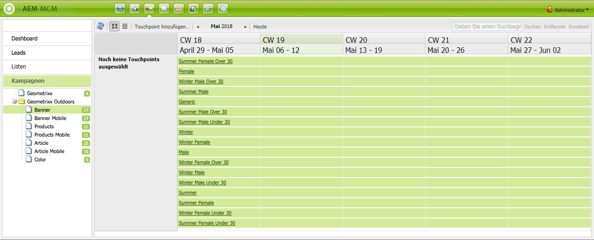

# Arbeiten mit dem Marketing Campaign Manager{#working-with-the-marketing-campaign-manager}

Der Marketing Campaign Manager (MCM) in AEM ist eine Konsole, mit der Sie Multi-Channel-Kampagnen verwalten können. Mit dieser Software zur Marketing-Automatisierung können Sie sämtliche Marken, Kampagnen und Erlebnisse gemeinsam mit den damit zusammenhängenden Segmenten, Listen, Leads und Berichten verwalten.

Sie können von verschiedenen Bereichen in AEM auf den MCM zugreifen, z. B. vom Begrüßungsbildschirm. Der Zugriff ist über das Symbol „Kampagnen“ oder über folgende URL möglich:

`https://<hostname>:<port>/libs/mcm/content/admin.html`

Beispiel:

`http://localhost:4502/libs/mcm/content/admin.html`

Aus dem MCM können Sie auf folgende Komponenten zugreifen:

* **[Dashboard](#dashboard)** Dieses ist in vier Bereiche unterteilt:

   * [Listen](#lists)

      Dieser Bereich enthält die Listen, die Sie bereits erstellt haben, sowie die Anzahl der Leads in den jeweiligen Listen. Aus diesem Bereich können Sie direkt neue Listen erstellen oder Leads importieren, um eine neue Liste zu erstellen.

      Wenn Sie eine bestimmte Liste auswählen, gelangen Sie in den Bereich [Listen](#lists), der Details zu Ihrer Liste enthält.

   * [Segmente](/help/sites-classic-ui-authoring/classic-personalization-campaigns.md#anoverviewofsegmentation)

      Dieser Bereich enthält die Segmente, die Sie definiert haben. Mit Segmenten können Sie eine Gruppe von Besuchern charakterisieren, die bestimmte Eigenschaften teilen.

      Wenn Sie ein bestimmtes Segment auswählen, wird die Segment-Definitionsseite geöffnet.

   * [Berichte](/help/sites-administering/reporting.md)\
      AEM bietet verschiedene Berichte, mit denen Sie den Status Ihrer Instanz analysieren und überwachen können. In diesem MCM-Bereich werden die Berichte angezeigt.

      Wenn Sie einen Bericht auswählen, wird die Berichtseite geöffnet.

   * [Kampagnen](#campaigns)

      In diesem Bereich werden Ihre Kampagnenerlebnisse aufgeführt, z. B. [Newsletter](/help/sites-classic-ui-authoring/classic-personalization-campaigns.md#newsletters) und [Teaser](/help/sites-classic-ui-authoring/classic-personalization-campaigns.md#teasers).

* **[Leads](#leads)**

   Hier können Sie Ihre Leads verwalten. Sie können Leads erstellen oder importieren, bestimmte Details für einzelne Leads bearbeiten oder löschen, wenn sie nicht mehr benötigt werden. Außerdem können Sie Leads in verschiedene Gruppen, sogenannte Listen, einteilen. **Hinweis:** Adobe plant nicht, diese Funktion weiter auszubauen.

    Es wird deshalb empfohlen, [Adobe Campaign und dessen Integration mit AEM zu nutzen](/help/sites-administering/campaign.md).

* **[Listen](#lists)**

   Hier können Sie Ihre (Lead-)Listen verwalten.**Hinweis:** Adobe plant nicht, diese Funktion weiter auszubauen.

    Es wird deshalb empfohlen, [Adobe Campaign und dessen Integration mit AEM zu nutzen](/help/sites-administering/campaign.md).

* **[Kampagnen](#campaigns)** Hier können Sie Ihre Marken, Kampagnen und Erlebnisse verwalten.

## Dashboard {#dashboard}

Das Dashboard enthält vier Bereiche, die Ihnen eine Übersicht über Ihre (Lead-)Listen, Segmente, Berichte und Kampagnen bieten. Hier können Sie ebenfalls auf die entsprechenden Grundfunktionen zugreifen.

## Leads {#leads}

>[!NOTE]
>
>Adobe plant nicht, diese Funktion (Lead-Verwaltung) weiter auszubauen.\
>Es wird deshalb empfohlen, [Adobe Campaign und dessen Integration mit AEM zu nutzen](/help/sites-administering/campaign.md).

Im MCM von AEM können Sie Leads organisieren und hinzufügen, indem Sie sie manuell eingeben oder indem Sie eine kommagetrennte Liste importieren, z. B. eine Mailing-Liste. Sie können Leads auch anhand von Newsletter- oder Community-Anmeldungen generieren. (Wenn dies konfiguriert wurde, kann nach einer Anmeldung ein Workflow ausgelöst werden, aus dem Leads hervorgehen.) Leads werden im Allgemeinen in Kategorien eingeteilt und in Listen gruppiert, sodass Sie zu einem späteren Zeitpunkt Aktionen für die gesamte Liste ausführen können, z. B. eine E-Mail an eine bestimmte Liste senden.

Im linken Bereich unter **Leads** können Sie Ihre Leads erstellen, importieren, bearbeiten und löschen und anschließend nach Bedarf aktivieren oder deaktivieren. Sie können einen Lead einer Liste hinzufügen oder anzeigen, welchen Listen er bereits angehört.

>[!NOTE]
>
>Genauere Informationen zu bestimmten Aufgaben finden Sie unter[ Arbeiten mit Leads](/help/sites-classic-ui-authoring/classic-personalization-campaigns.md#workingwithleads).

## Listen {#lists}

>[!NOTE]
>
>Adobe plant nicht, diese Funktion (Listenverwaltung) weiter auszubauen.\
>Es wird deshalb empfohlen, [Adobe Campaign und dessen Integration mit AEM zu nutzen](/help/sites-administering/campaign.md).

Mithilfe von Listen können Sie Ihre Leads in Gruppen organisieren. Mit Listen können Sie Marketingkampagnen gezielt für eine bestimmte Personengruppe erstellen, z. B. können Sie einen speziellen Newsletter an eine bestimmte Liste senden.

Unter **Listen** können Sie Ihre Listen verwalten, indem Sie Listen erstellen, importieren, bearbeiten, zusammenführen und löschen und dann nach Bedarf aktivieren oder deaktivieren. Außerdem können Sie die Leads innerhalb der Liste anzeigen, überprüfen ob die Liste einer weiteren Liste angehört, oder die Beschreibung anzeigen.

>[!NOTE]
>
>Genauere Informationen zu bestimmten Aufgaben finden Sie unter[ Arbeiten mit Listen](/help/sites-classic-ui-authoring/classic-personalization-campaigns.md#workingwithlists).

### Kampagnen {#campaigns}

>[!NOTE]
>
>Unter [Teaser und Strategien](/help/sites-classic-ui-authoring/classic-personalization-campaigns.md#workingwithlists), [Campaign einrichten](/help/sites-classic-ui-authoring/classic-personalization-campaigns.md#settingupyourcampaign) und [Newsletter](/help/sites-classic-ui-authoring/classic-personalization-campaigns.md#newsletters) finden Sie genauere Informationen zu bestimmten Aufgaben.

Klicken Sie im MCM auf **Kampagnen**, um auf die bestehenden Kampagnen zuzugreifen.

* **Im linken Bereich**:

   Hier befindet sich eine Liste der Marken und Kampagnen.

   Wenn Sie auf eine Marke klicken, geschieht Folgendes:

   * Die Liste wird erweitert, sodass alle zusammenhängenden Kampagnen im linken Bereich angezeigt werden. Die Liste enthält auch die Anzahl der Erlebnisse, die für die einzelnen Kampagnen vorhanden sind.
   * Im rechten Bereich wird die Markenübersicht geöffnet.

* **Im rechten Bereich**:

   Für jede Marke werden Symbole angezeigt (historische Kampagnen werden nicht angezeigt).

   Sie können darauf doppelklicken, um die Markenübersicht anzuzeigen.

#### Markenübersicht {#brand-overview}

Hier können Sie folgende Aktionen durchführen:

* Anzeigen der Anzahl von Kampagnen und Erlebnissen (Zahl wird im linken Bereich angezeigt), die für diese Marke vorhanden sind.
* Erstellen einer **neuen** Kampagne für diese Marke.

* Ändern des angezeigten Zeitbereichs. Wählen Sie **Woche**, **Monat** oder **Quartal**, verwenden Sie die Pfeile, um bestimmte Zeitabschnitte auszuwählen, oder kehren Sie zu **Heute** zurück.

* Auswählen einer Kampagne (im rechten Bereich), um folgende Aktionen auszuführen:

   * Bearbeiten der **Eigenschaften**.
   * **Löschen** der Kampagne.

* Öffnen der Kampagnenübersicht (doppelklicken Sie im rechten Bereich auf eine Kampagne oder klicken Sie im linken Bereich einmal).

#### Kampagnenübersicht {#campaign-overview}

Für die einzelnen Kampagnen sind zwei Ansichten verfügbar:

1. **Kalenderansicht**

   Verwenden Sie das Symbol:

   

   Eine Liste sämtlicher Touchpoints (grau) und eine horizontale Zeitleiste der mit dem jeweiligen Touchpoint verbunden Erlebnisse (grün) wird angezeigt.

   

   Hier können Sie folgende Aktionen durchführen:

   * Ändern des angezeigten Zeitbereichs mit den Pfeilen bzw. zu **Heute** zurückkehren.
   * Verwenden von **Touchpoint hinzufügen**, um einem vorhandenen Erlebnis einen neuen Touchpoint hinzuzufügen.
   * Klicken auf einen Teaser (im rechten Bereich), um die **Einschaltzeit** und die **Ausschaltzeit** einzurichten.

1. **Listenansicht**

   Verwenden Sie das Symbol:

   

   Hier werden sämtliche Erlebnisse (z. B. Teaser und Newsletter) für die ausgewählte Kampagne aufgeführt:

   

   Hier können Sie folgende Aktionen durchführen:

   * Erstellen Sie eine **Neu...** Erfahrung; z. B. Adobe Target-Angebote, Teaser und Newsletter.
   * **Bearbeiten** der Details einer bestimmten Teaser-Seite oder eines bestimmten Newsletters (auch per Doppelklick möglich).
   * Definieren der **Eigenschaften** für eine bestimmte Teaser-Seite oder einen bestimmten Newsletter.
   * **Simulieren** des Aussehens eines Erlebnisses (Teaser-Seite oder Newsletter).

      Wenn die simulierte Seite geöffnet ist, können Sie den Sidekick öffnen, um in den Bearbeitungsmodus für diese Seite zu wechseln.

   * **Analysieren** der für eine Seite erzeugten Impressions.
   * **Löschen** von Elementen, die nicht mehr benötigt werden.
   * **Suchen** nach Text (das Feld „Titel“ des Erlebnisses wird durchsucht).
   * Verwenden der **erweiterten** Suche, um Filter auf die Suche anzuwenden.

### Simulieren von Kampagnen-Erlebnissen {#simulating-your-campaign-experiences}

Klicken Sie im Marketing Campaign Manager auf **Kampagnen**. Vergewissern Sie sich, dass die Listenansicht aktiv ist, wählen Sie dann die gewünschte Kampagnenerfahrung und klicken Sie auf **Simulieren**. Der Touchpoint (Teaser- oder Newsletter-Seite) wird geöffnet und das gewählte Erlebnis wird angezeigt (so, wie der Besucher es sieht).

Von hier aus können Sie auch den Sidekick öffnen (klicken Sie auf den kleinen Pfeil nach unten), um zum Bearbeitungsmodus zu wechseln und die Seite zu aktualisieren.

### Analysieren von Kampagnen-Erlebnissen {#analyzing-your-campaign-experiences}

Klicken Sie im Marketing Campaign Manager auf **Kampagnen**. Vergewissern Sie sich, dass die Listenansicht aktiv ist, wählen Sie dann die gewünschte Kampagnenerfahrung und klicken Sie auf **Analysieren...**. Ein Diagramm mit den Seiten-Impressions im Zeitverlauf wird angezeigt.

