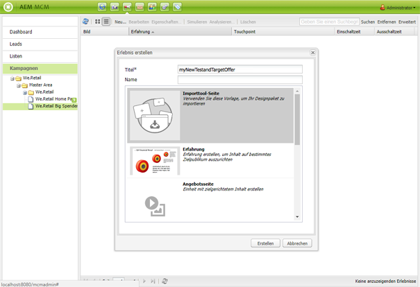

# Adobe Target-Angebote{#target-offers}

## Erstellen eines Test&amp;Target-Angebots {#creating-a-test-target-offer-experience}

1. Wählen Sie im linken Bereich die neue Kampagne oder doppelklicken Sie im rechten Bereich darauf.
1. Wählen Sie die Listenansicht mit folgendem Symbol:

   

1. Klicken Sie auf **Neu ...**
1. Sie können den **Titel**, **Name** und den Typ des zu erstellenden Erlebnisses angeben. in diesem Fall Test&amp;Target-Angebot.

   

1. Klicken Sie auf **Erstellen**.

   >[!NOTE]
   >
   >Test&amp;Target-Erlebnisse werden zurzeit nicht im MCM aufgeführt. Sie können über die **Websites**-Konsole unter „Kampagnen“ darauf zugreifen.

## Integrieren mit Adobe Target {#integrating-with-adobe-target}

Ausführliche Informationen finden Sie unter [Integrieren mit Adobe](/help/sites-administering/target.md) [Target](/help/sites-administering/target.md) .
