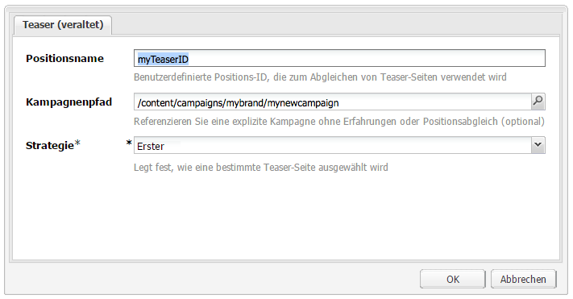

# Teaser und Strategien{#teasers-and-strategies}

>[!CAUTION]
>
>AEM 6.4 hat das Ende der erweiterten Unterstützung erreicht und diese Dokumentation wird nicht mehr aktualisiert. Weitere Informationen finden Sie in unserer [technische Unterstützung](https://helpx.adobe.com/de/support/programs/eol-matrix.html). Unterstützte Versionen suchen [here](https://experienceleague.adobe.com/docs/?lang=de).

In Kampagnen werden häufig Teaser verwendet, um ein bestimmtes Segment der Besucherpopulation zu Inhalten zu leiten, die auf ihre Interessen ausgerichtet sind. Für eine bestimmte Kampagne werden ein oder mehrere Teaser definiert.

>[!NOTE]
>
>Die Teaser-Komponente wird in AEM 6.2 nicht mehr unterstützt.

* **Markenseiten** werden innerhalb des Kampagnenbereichs der Website gespeichert. Eine Marke enthält die einzelnen Kampagnen.

* **Kampagnenseiten** werden innerhalb des Kampagnenbereichs der Website gespeichert. Jede Kampagne weist eine individuelle Seite auf, unter der sich die Teaserdefinitionen befinden. Die Container- oder Übersichtsseite enthält auch bestimmte Informationen und Statistiken zu den einzelnen Teaser-Seiten.

Teaser in AEM bestehen aus mehreren Teilen:

* **Teaser-Seiten** werden in der entsprechenden Kampagnenseite gespeichert und enthalten die Definitionen der Teaser-Absätze, die für die jeweilige Kampagne verfügbar sind. Diese Definitionen werden beim Anzeigen der Teaser-Absätze verwendet. einschließlich Inhaltsvarianten, das Segment, das zur Auswahl einer Variante und eines Verstärkungsfaktors verwendet werden soll.
* Die **Teaser-Komponente** ist im Lieferumfang enthalten und ermöglicht Ihnen das Erstellen einer Instanz eines speziellen Teaser-Absatzes auf einer Inhaltsseite. Sie können die Teaser-Komponente aus dem Sidekick ziehen und dann Ihre Teaser-Definition angeben, um einen eigenen Teaser-Absatz zu erstellen. **Hinweis:** Die Teaser-Komponente wird in AEM 6.2 nicht mehr unterstützt.

* **Teaser-Absätze** sind tatsächliche Instanzen Ihres Teasers innerhalb einer Inhaltsseite. Dadurch wird ein Segment von Besuchern zu Inhalten geleitet, die auf ihre Interessen ausgerichtet sind.
* Seiten, die den Kampagneninhalt für ein spezifisches Besuchersegment enthalten. Normalerweise führen die Teaser-Absätze den Besucher zu solchen Seiten.

## Strategien {#strategies}

Wenn Sie einer Seite einen Teaser-Absatz hinzufügen, müssen Sie eine **Strategie** definieren.

Dies ist für den Fall, dass mehrere Teaser zur Auswahl stehen, wenn sich alle zugewiesenen Segmente erfolgreich auflösen. Die **Strategie** gibt dann ein zusätzliches Kriterium an, mit dem der angezeigte Teaser ausgewählt wird:

* Das **Clickstream-Ergebnis** basiert auf den Tags und zugehörigen Tag-Treffern, die im ClientContext des Besuchers enthalten sind (der Client Context zeigt an, wie oft ein Besucher auf Seiten mit dem jeweiligen Tag geklickt hat). Die Trefferraten für Tags, die auf der Teaser-Seite definiert sind, werden verglichen.
* Mit **Willkürlich** für eine „willkürliche“ Auswahl wird der für eine Seite generierte Zufallsfaktor eingesetzt. Dieser kann im [ClientContext](/help/sites-administering/client-context.md) angezeigt werden.

* **Erste(r)** in der Liste aufgelöster Segmente. Die Reihenfolge ist die gleiche wie die der Teaser in der Kampagnen-Containerseite.

Der [Verstärkungsfaktor](/help/sites-administering/campaign-segmentation.md#boost-factor) des Segments hat auch Auswirkungen auf die Auswahl. Dies ist ein Gewichtungsfaktor, der zu einer Segmentdefinition hinzugefügt wird, um die relative Wahrscheinlichkeit der Auswahl zu erhöhen/zu verringern.

Der Prozess und die Zusammenhänge der verschiedenen Auswahlkriterien werden am besten mit einem Beispiel veranschaulicht (eine Methode, mit der auch sichergestellt werden kann, dass Ihre Teaser die gewünschte Zielgruppe erreichen).

Wenn die folgenden Segmente bereits erstellt und ihr jeweiliger Verstärkungsfaktor zugewiesen wurden:

| Segment | Verstärkungsfaktor |
|---|---|
| S1 | 0 |
| S2 | 0 |
| S3 | 10 |
| S4 | 30 |
| S5 | 0 |
| S6 | 100 |

Und wir verwenden die folgenden Teaser-Definitionen:

<table> 
 <tbody> 
  <tr> 
   <td>Kampagne</td> 
   <td>Teaser</td> 
   <td>Zugewiesene Segmente</td> 
   <td>Zugewiesene Tags </td> 
  </tr> 
  <tr> 
   <td>C1</td> 
   <td>T1</td> 
   <td>S1, S2</td> 
   <td>Business, Marketing</td> 
  </tr> 
  <tr> 
   <td>C1</td> 
   <td>T2 </td> 
   <td>S1</td> 
   <td>  </td> 
  </tr> 
  <tr> 
   <td>C1 </td> 
   <td>T3</td> 
   <td>S3, S4</td> 
   <td>  </td> 
  </tr> 
  <tr> 
   <td>C1 </td> 
   <td>T4</td> 
   <td>S2, S5</td> 
   <td>  </td> 
  </tr> 
  <tr> 
   <td>C1 </td> 
   <td>T5</td> 
   <td>S1, S2, S6</td> 
   <td>Marketing</td> 
  </tr> 
  <tr> 
   <td>C1 </td> 
   <td>T6</td> 
   <td>S6</td> 
   <td>Handel  </td> 
  </tr> 
 </tbody> 
</table>

Wenn wir dies auf einen Besucher anwenden, bei dem:

* **S1**, **S2** und **S6** werden erfolgreich aufgelöst.

* das Tag **Marketing** hat 3 Treffer
* das Tag **Business** hat 6 Treffer

Das Ergebnis ist sichtbar:

* Erfolgreiche Übereinstimmung - Löst eines der dem Teaser zugewiesenen Segmente für den aktuellen Besucher erfolgreich auf?
* Verstärkungsfaktor - der höchste Verstärkungsfaktor aller anwendbaren Segmente
* Clickstream-Ergebnis - die kumulierte Summe aller relevanten Tag-Treffer

die vor Anwendung der entsprechenden Strategie berechnet werden:

<table> 
 <tbody> 
  <tr> 
   <td>Kampagne</td> 
   <td>Teaser</td> 
   <td>Zugewiesene Segmente</td> 
   <td>Tags </td> 
   <td>Erfolgreiche Übereinstimmung?</td> 
   <td>Resultierender Verstärkungsfaktor</td> 
   <td>Resultierendes Clickstream-Ergebnis </td> 
  </tr> 
  <tr> 
   <td>C1</td> 
   <td>T1</td> 
   <td>S1, S2</td> 
   <td>Business, Marketing</td> 
   <td>Ja</td> 
   <td>0</td> 
   <td>9</td> 
  </tr> 
  <tr> 
   <td>C1</td> 
   <td>T2 </td> 
   <td>S1</td> 
   <td>  </td> 
   <td>Ja</td> 
   <td>0</td> 
   <td>  </td> 
  </tr> 
  <tr> 
   <td>C1 </td> 
   <td>T3</td> 
   <td>S3, S4</td> 
   <td>  </td> 
   <td>Nein</td> 
   <td>  </td> 
   <td>  </td> 
  </tr> 
  <tr> 
   <td>C1 </td> 
   <td>T4</td> 
   <td>S2, S5</td> 
   <td>  </td> 
   <td>Ja  </td> 
   <td>0  </td> 
   <td>  </td> 
  </tr> 
  <tr> 
   <td>C1 </td> 
   <td>T5</td> 
   <td>S1, S2, S6</td> 
   <td>Marketing</td> 
   <td>Ja</td> 
   <td>100</td> 
   <td>3</td> 
  </tr> 
  <tr> 
   <td>C1 </td> 
   <td>T6</td> 
   <td>S6</td> 
   <td>Handel</td> 
   <td>Ja</td> 
   <td>100</td> 
   <td>6 </td> 
  </tr> 
 </tbody> 
</table>

Diese Werte werden verwendet, um die Teaser zu bestimmen, die dem Besucher je nach **Strategie** wird auf den Teaser-Absatz angewendet:

<table> 
 <tbody> 
  <tr> 
   <td>Strategie</td> 
   <td>Resultierender Teaser</td> 
   <td>Kommentare</td> 
  </tr> 
  <tr> 
   <td>Erste(r)</td> 
   <td>T5</td> 
   <td>Nur T5 und T6 werden berücksichtigt, da all ihre Segmente aufgelöst werden <i>und</i> sie den höchsten Verstärkungsfaktor aufweisen. Die zurückgegebene Liste weist die Reihenfolge T5, T6 auf. sodass T5 ausgewählt und angezeigt wird.</td> 
  </tr> 
  <tr> 
   <td>Willkürlich</td> 
   <td>T5 oder T6</td> 
   <td>Beide Teaser weisen Segmente, die alle aufgelöst werden, und den gleichen Verstärkungsfaktor auf. Daher werden die beiden Teaser in gleichem Verhältnis angezeigt.</td> 
  </tr> 
  <tr> 
   <td>Clickstream-Ergebnis</td> 
   <td>T6</td> 
   <td>
Die Segmente für T1, T4, T5 und T6 werden für den Besucher alle aufgelöst. Aufgrund der höheren Verstärkungsfaktoren von T5 und T6 werden T1 und T4 ausgeschlossen. Der höhere Clickstream-Wert von T6 führt schließlich zur Auswahl.
 </td> 
  </tr> 
 </tbody> 
</table>

>[!NOTE]
>
>Wenn nach den oben genannten Auflösungstechniken mehrere Teaser zur Auswahl verfügbar sind, wird durch eine interne Auswahl (zufällig) ein einzelner Teaser zur Anzeige ausgewählt.
>
>Wenn die Strategie beispielsweise Clickstream-Ergebnis war und T5 denselben Clickstream-Score wie T6 (d. h. 6 anstelle von 3) aufwies, würde die interne Auswahl (zufällig) verwendet, um eine dieser beiden auszuwählen.

Teaser-Seiten/-Absätze: Um bestimmte Besuchersegmente auf Inhalte zu lenken, die speziell auf deren Interessen abgestimmt sind. Sie können eine Reihe von Optionen bereitstellen, aus denen der Besucher auswählen kann, oder nur einen Teaser-Absatz anzeigen, der auf dem spezifischen Besuchersegment basiert. Beispielsweise kann der angezeigte Teaser-Absatz vom Alter des Besuchers abhängen.

Normalerweise ist eine Teaser-Seite eine temporäre Aktion, die für einen bestimmten Zeitraum anhält, bis sie durch die nächste Teaser-Seite ersetzt wird.

Nachdem Sie Ihre Marke und Kampagne erstellt haben, können Sie Ihr Teaser-Erlebnis erstellen und einrichten.

## Erstellen eines Touchpoints für Ihren Teaser {#creating-a-touchpoint-for-your-teaser}

>[!NOTE]
>
>Die Teaser-Komponente wird in AEM 6.2 nicht mehr unterstützt.

1. Navigieren Sie zur Inhaltsseite, auf der Sie den Teaser-Absatz platzieren möchten, der zu Ihrer Kampagnenseite führt.
1. Hinzufügen einer **Teaser** -Komponente (verfügbar in **Personalisierung** -Abschnitt des Sidekicks) an der gewünschten Position. Bei der ersten Erstellung wird angezeigt, dass der Kampagnenpfad noch nicht konfiguriert ist:

   

1. Bearbeiten Sie die Teaser-Komponente, um Folgendes hinzuzufügen:

   * **Kampagnenpfad**
Pfad zur Kampagnenseite, die die einzelne Teaser-Seite enthält; -Segmente bestimmen genau, welcher Teaser angezeigt wird.
   * **[Strategie](/help/sites-classic-ui-authoring/classic-personalization-campaigns.md#strategies)**
Methode, die zur Auswahl verwendet wird, wenn ein Besucher die Kriterien mehrerer Segmente erfüllt.
   

1. Klicken Sie zum Speichern auf **OK**. Je nach den Segmenten, die Sie für den Teaser festgelegt haben, und dem Profil des Benutzers, als der Sie derzeit angemeldet sind, wird der entsprechende Inhalt angezeigt:

   

1. Bewegen Sie den Mauszeiger auf den Teaser-Absatz, um das Fragezeichen-Symbol einzublenden (rechte untere Ecke der Komponente). Klicken Sie auf diese Option, um die angewendeten Segmente anzuzeigen und anzuzeigen, ob sie derzeit aufgelöst werden.

   

## Teaser-Übersicht {#teaser-overview}

Neben der Kampagnenansicht im MCM enthält die Kampagnenseite auch Informationen zu den mit ihr verbundenen Teasern:

1. Aus dem **Websites** Konsole die Kampagnenseite öffnen; Beispiel:

   `http://localhost:4502/content/campaigns/geometrixx-outdoors/storefront/summer.html`

   Hier finden Sie eine Übersicht über die Teaser-Definitionen und die Anzeigestatistik:

   
