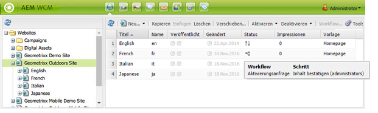
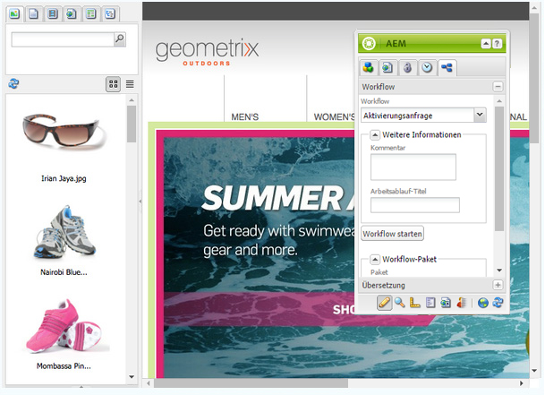

# Anwenden von Workflows auf Seiten{#applying-workflows-to-pages}

>[!CAUTION]
>
>AEM 6.4 hat das Ende der erweiterten Unterstützung erreicht und diese Dokumentation wird nicht mehr aktualisiert. Weitere Informationen finden Sie in unserer [technische Unterstützung](https://helpx.adobe.com/de/support/programs/eol-matrix.html). Unterstützte Versionen suchen [here](https://experienceleague.adobe.com/docs/?lang=de).

Wenn Sie den Workflow anwenden, geben Sie die folgenden Informationen an:

* Der anzuwendende Workflow.

   Sie können jeden beliebigen Workflow anwenden (auf den Sie Zugriff haben, wie von Ihrem AEM-Administrator zugewiesen).
* Optional:

   * Ein Kommentar, der Informationen zum Starten des Workflows enthält.
   * Ein Titel, der dabei hilft, die Workflow-Instanz im Posteingang eines Benutzers zu identifizieren.

>[!NOTE]
>
>AEM Administratoren können Workflows mit [mehrere andere Methoden](/help/sites-administering/workflows-starting.md).

## Anwenden von Workflows {#applying-workflows}

Workflows können entweder über die Websites-Konsole oder beim Bearbeiten einer Seite über den Sidekick gestartet werden.

Die Spalte **Status** in der **Websites**-Konsole gibt an, ob ein Workflow auf eine Seite angewendet wurde:

### Starten eines Workflows aus der Websites-Konsole {#starting-a-workflow-from-the-websites-console}

1. Öffnen Sie die Websites-Konsole. ([http://localhost:4502/siteadmin](http://localhost:4502/siteadmin))
1. Wählen Sie in der Website-Struktur das übergeordnete Element der Seite aus, auf die Sie den Workflow anwenden möchten.
1. Wählen Sie in der Seitenliste die Seite aus und klicken Sie auf &quot;Workflow&quot;.
1. Wählen Sie im Dialogfeld Workflow starten den anzuwendenden Workflow aus. Geben Sie optional einen Kommentar und einen Titel ein. Klicken Sie dann auf Start.

### Starten eines Workflows mit dem Sidekick {#starting-a-workflow-using-sidekick}

1. Öffnen Sie die Websites-Konsole.
1. Öffnen Sie die gewünschte Seite.
1. Wählen Sie im Sidekick die Registerkarte Workflow aus.
1. Erweitern Sie das Dialogfeld **Workflow**, um den **Workflow** auszuwählen, und geben Sie optional einen **Workflow-Titel** und einen **Kommentar** ein.

   

1. Klicken Sie auf **Workflow starten**, um eine neue Workflow-Instanz mit den Eigenschaften zu starten, die Sie konfiguriert haben, und mit der aktuellen Seite als Payload. Jetzt wird der Workflow ausgeführt.
