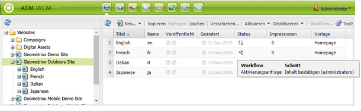
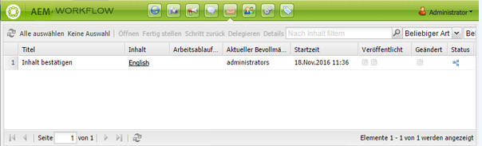
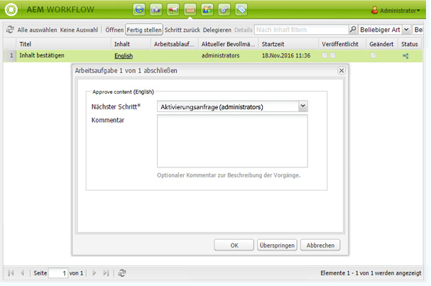
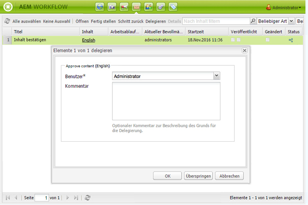
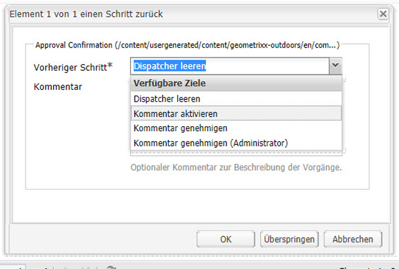

# Teilnehmen an Workflows{#participating-in-workflows}

>[!CAUTION]
>
>AEM 6.4 hat das Ende der erweiterten Unterstützung erreicht und diese Dokumentation wird nicht mehr aktualisiert. Weitere Informationen finden Sie in unserer [technische Unterstützung](https://helpx.adobe.com/de/support/programs/eol-matrix.html). Unterstützte Versionen suchen [here](https://experienceleague.adobe.com/docs/?lang=de).

Workflows enthalten normalerweise Schritte, bei denen eine Person eine Aktivität auf einer Seite oder in einem Asset ausführen muss. Der Workflow wählt einen Benutzer oder eine Gruppe aus, um die Aktivität auszuführen, und weist dieser Person oder Gruppe ein Arbeitselement zu.

## Bearbeiten von Arbeitselementen {#processing-your-work-items}

Sie können die folgenden Aktionen ausführen, um ein Arbeitselement zu verarbeiten:

* **Fertig stellen**

   Sie können ein Element abschließen, damit der Workflow mit dem nächsten Schritt fortfahren kann.

* **Delegieren**

   Wenn Ihnen ein Schritt zugewiesen wurde, Sie jedoch aus irgendeinem Grund keine Aktion ausführen können, können Sie den Schritt an einen anderen Benutzer oder eine andere Gruppe delegieren.

   Die Benutzer, die für die Zuweisung verfügbar sind, hängen davon ab, wem das Arbeitselement zugewiesen wurde:

   * Wenn das Arbeitselement einer Gruppe zugewiesen wurde, sind die Gruppenmitglieder verfügbar.
   * Wenn das Arbeitselement einer Gruppe zugewiesen und dann an einen Benutzer delegiert wurde, sind die Gruppenmitglieder und die Gruppe verfügbar.
   * Wenn das Arbeitselement einem einzelnen Benutzer zugewiesen wurde, kann es nicht delegiert werden.

* **Schritt zurück**

   Wenn Sie erkennen, dass ein Schritt oder eine Reihe von Schritten wiederholt werden muss, können Sie zu einem vorherigen Schritt zurückkehren. Auf diese Weise können Sie einen früheren Schritt im Workflow zur erneuten Verarbeitung auswählen. Der Workflow kehrt zu dem von Ihnen angegebenen Schritt zurück und fährt dann von dort fort.

## Teilnehmen an einem Workflow {#participating-in-a-workflow}

### Benachrichtigungen über zugewiesene Workflow-Aktionen {#notifications-of-assigned-workflow-actions}

Wenn Ihnen ein Arbeitselement zugewiesen wird (z. B. **Inhalte genehmigen**), werden verschiedene Warnungen und/oder Benachrichtigungen angezeigt:

* Die **Status** -Spalte der Websites-Konsole gibt an, wann sich eine Seite in einem Workflow befindet:

   

* Wenn Ihnen oder einer Gruppe, der Sie angehören, ein Arbeitselement im Rahmen eines Workflows zugewiesen wird, wird das Arbeitselement in Ihrem AEM-Workflow-Posteingang angezeigt.

   

### Fertigstellen eines Teilnehmerschritts {#completing-a-participant-step}

Nachdem Sie die angegebene Aktion abgeschlossen haben, können Sie das Arbeitselement fertig stellen, damit der Workflow fortgesetzt wird. Führen Sie die folgenden Schritte aus, um das Arbeitselement abzuschließen.

1. Wählen Sie den Workflow-Schritt aus und klicken Sie auf die Schaltfläche **Fertig** in der oberen Navigationsleiste.
1. Wählen Sie im angezeigten Dialogfeld die Option **Nächster Schritt** aus. Damit ist der Schritt gemeint, der als nächster ausgeführt werden soll. Eine Dropdown-Liste zeigt alle entsprechenden Ziele an. A **Kommentar** kann auch eingegeben werden.

   

   Die Anzahl der aufgeführten Schritte hängt vom Design des Workflow-Modells ab.

1. Klicken Sie auf **OK**, um die Aktion zu bestätigen.

### Delegieren eines Teilnehmerschritts {#delegating-a-participant-step}

Gehen Sie wie folgt vor, um ein Arbeitselement zu delegieren.

1. Klicken Sie auf **Delegieren** in der oberen Navigationsleiste.
1. Wählen Sie im Dialogfeld mithilfe der Dropdown-Liste die **Benutzer** , um das Arbeitselement zu delegieren. Sie können auch eine **Kommentar**.

   

1. Klicken Sie auf **OK**, um die Aktion zu bestätigen.

### Wechseln zu einem vorherigen Teilnehmerschritt {#performing-step-back-on-a-participant-step}

Gehen Sie wie folgt vor, um zurückzutreten.

1. Klicken Sie in der oberen Navigationsleiste auf die Schaltfläche Schritt zurück .
1. Wählen Sie im angezeigten Dialogfeld einen Schritt unter „Vorheriger Schritt“ aus. Dies ist der Schritt, der als nächster ausgeführt werden soll (wobei es sich natürlich um einen Schritt handelt, der weiter vorne im Workflow steht). Eine Dropdown-Liste zeigt alle entsprechenden Ziele an.

   

1. Klicken Sie auf „OK“, um die Aktion zu bestätigen.
