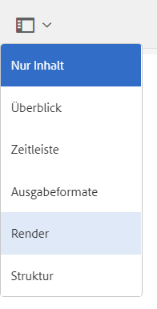

# Rendern von 3D-Assets{#rendering-d-assets}

Sie können 3D-Assets rendern, die Sie in AEM bearbeitet und gespeichert haben, um 2D-Bilder für die Verwendung in Ihren Webseiten zu erstellen.

Siehe [Bearbeiten des Seiteninhalts](/help/sites-authoring/qg-page-authoring.md#editing-your-page-content).

## Leistungsaspekte beim Rendern von 3D-Assets {#performance-considerations-when-rendering-d-assets}

Das Rendern von 3D-Inhalten benötigt erhebliche Serverressourcen wie CPU und Arbeitsspeicher. Daher kann das Rendern häufig sehr zeitaufwendig sein. Die Zeit für das Rendern variiert in Abhängigkeit von verschiedenen Faktoren neben der offensichtlichen Modellgröße und Serverhardware erheblich:

* **Renderer-Auswahl**.

   Beim Standard-Renderer von AEM 3D, Rapid Refine™, haben schnelle Renderzeiten Priorität vor Qualität. Dennoch liefert er für viele Anwendungen qualitativ hochwertige Ergebnisse. Renderer, die von Drittanbieteranwendungen bereitgestellt werden (z. B. V-Ray™ oder NVIDIA® Mental Ray® aus Autodesk® Maya® oder Autodesk® 3ds Max®V-Ray™) sind breit konfigurierbar. Die Entscheidung über Qualität oder Leistung wird beim Entwurf der Bühnen getroffen.

* **IBL im Vergleich zur herkömmlichen Beleuchtung**.

   Dieser Aspekt hat kaum Einfluss auf den Standard-Renderer Rapid Refine. Renderer von Drittanbietern wie Mental Ray rendern IBL-Bühnen jedoch beträchtlich langsamer als die herkömmlichen Punkt- oder Spotlichter.

Der Rapid Refine-Renderer benötigt in der Regel nur wenige Minuten für das Rendern von großen Bildern. Bei Drittanbieter kommt es häufig zu Renderzeiten von vielen Minuten oder gar Stunden, wenn maximale Qualität eingestellt ist.

Umrechnungs-, Verarbeitungs- und Renderaufträge werden in die Warteschlange des Servers gestellt, um eine Überlastung des Servers zu vermeiden. The message &quot;Waiting for rendering...&quot; is shown on recently uploaded assets in the [!UICONTROL Card View]. Sie weist darauf hin, dass zunächst andere Verarbeitungs- oder Renderaufträge abgeschlossen werden müssen, bevor der aktuelle Renderauftrag beginnen kann.

>[!NOTE]
>
>Ein 3D-Asset wird immer mit den ursprünglichen Materialien gerendert – unabhängig davon, welche Materialien in der interaktiven AEM 3D-Ansicht angezeigt werden. Diese Funktion gilt für den integrierten Renderer Rapid Refine und alle nativen Renderer.

**So rendern Sie 3D-Assets**:

1. Öffnen Sie ein 3D-Asset zur Anzeige.

   Siehe [Anzeigen von 3D-Assets](/help/sites-classic-ui-authoring/classicui-view-3d-assets.md).

1. From **Adobe Experience Manager**, on the **[!UICONTROL Navigation]** page, tap **[!UICONTROL Assets**.
1. Near the upper-right corner of the page, from the **[!UICONTROL View** drop-down list, tap **[!UICONTROL Card View]**.
1. Navigieren Sie zu einem 3D-Asset, das Sie rendern möchten.

1. Tippen Sie auf die Karte des 3D-Assets, um das Asset auf der Seite mit den Asset-Details zu öffnen.
1. Tippen Sie in der linken oberen Ecke der Seite auf die Dropdown-Liste und wählen Sie **[!UICONTROL Rendern]**.

   

1. Near the upper-right corner of the asset details page, tap the **[!UICONTROL Stage Selector]** icon (spotlight), then select a stage name with the background and lighting that you want to apply to the 3D object.

   Siehe [Informationen zu Bühnen in AEM 3D](/help/sites-classic-ui-authoring/classicui-stages-aem3d.md).

   

   [!UICONTROL Symbol für Bühnen-Auswahl]

1. On the **[!UICONTROL Render]** drop-down list on the left side of the asset details page, select a renderer.

   Der Standard-Renderer **[!UICONTROL Rapid Refine]** ist immer verfügbar. Wenn die ausgewählte Bühne ein natives Format hat, ist auch der entsprechende Drittpartei-Renderer in der Liste verfügbar und kann ausgewählt werden.

   Siehe [Informationen zu Bühnen in AEM 3D](/help/sites-classic-ui-authoring/classicui-stages-aem3d.md).

1. Gehen Sie folgendermaßen vor:

   * In the **[!UICONTROL Width and Height]** fields, enter the pixel width and height that you want your image rendered.
   * In the **[!UICONTROL Image Name]** field, enter the name of the rendered image.
   * In the **[!UICONTROL Export Path]** field, enter the path where you want the rendered image stored. Or, tap the **[!UICONTROL Browse]** icon and navigate to a location.
   * (Optional) Aktivieren oder deaktivieren Sie das Kontrollkästchen **[!UICONTROL Vorhandenes Bild überschreiben.]**

1. Near the upper-right corner of the asset details page, tap the **[!UICONTROL Camera Selector]** icon. Wählen Sie eine Kameraansicht aus, die Sie auf das gerenderte Bild anwenden möchten.

   Die linken und rechten sowie oberen und unteren Balken sind sichtbarere Indikatoren dafür, welche Teile der Ansicht gerendert werden. Wenn die Kamera von der ausgewählten Bühne bereitgestellt wird, können Sie eine vordefinierte Kamera auswählen. 

   

   [!UICONTROL Symbol für Kameraauswahl]

1. Tippen Sie auf **[!UICONTROL Renderer starten]**, um den Renderprozess zu starten.

   In der vorübergehend angezeigten Meldung wird Ihnen mitgeteilt, dass die Wiedergabe begonnen hat. For convenience, this message also includes a link to the selected [!UICONTROL Output Folder] so you can navigate to it directly.

