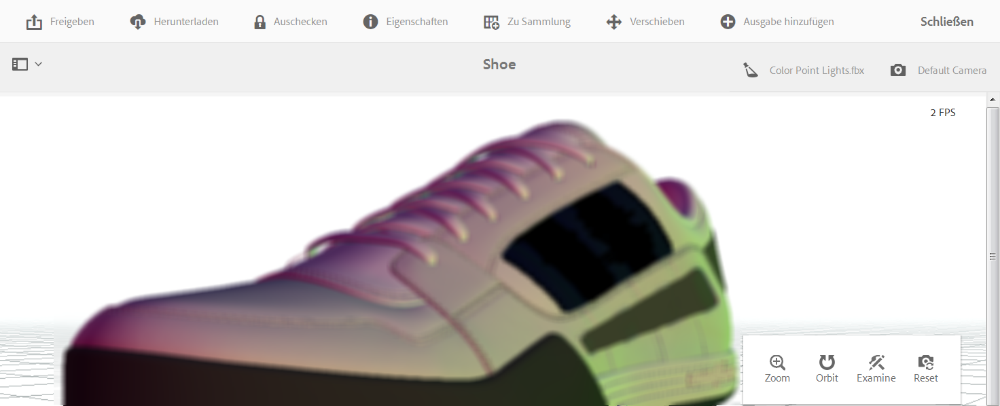

# Anzeigen von 3D-Assets{#viewing-d-assets}

Der interaktive 3D-Viewer ist auf der Seite „Asset-Details“ in AEM verfügbar. Der Viewer bietet unter anderem eine Reihe interaktiver Kamera-Steuerelemente, mit denen Sie die Kamera um das 3D-Asset drehen sowie Zoom- und Schwenkvorgänge durchführen können.

Neben den Standardbühnen können Sie in AEM 3D auch Bühnen verwenden, die in einer Drittanbieteranwendung erstellt und in AEM hochgeladen wurden.

Siehe [Informationen zu Bühnen in AEM 3D](/help/sites-classic-ui-authoring/classicui-stages-aem3d.md).

>[!NOTE]
>
>Um ein 3D-Asset anzuzeigen, muss Ihr Gerät oder Desktop-Browser WebGL-fähig sein. Auch die zugrunde liegende Grafikhardware muss über entsprechende Funktionen und ausreichend Speicherkapazität verfügen, um Modelle in der gewünschten Größe zu rendern.

## Leistungsaspekte beim Anzeigen von 3D-Assets  {#performance-considerations-when-you-view-d-assets}

Wie schnell ein 3D-Asset auf der Seite „Asset-Details“ geöffnet wird, hängt u. a. von den folgenden Faktoren abhängt:

* Bandbreite und Latenz zum Server.
* Modellgröße (Anzahl der Flächen).
* Anzahl und Größe der Maps.
* Komplexität der Bühnendatei. Beispielsweise die Größe des IBL-Bildes.

Wenn Sie die Kamera interaktiv bearbeiten, muss darüber hinaus die Kapazität des Client-Computers – etwa Workstation, Notebook oder Mobilgerät mit Touch-Funktion – berücksichtigt werden. Ein relativ leistungsfähiges System mit guten Grafikfähigkeiten unterstützt eine weichere, angenehmere interaktive 3D-Anzeige.

**So zeigen Sie 3D-Assets an**:

1. Laden Sie 3D-Assets in AEM hoch.

   Siehe [Informationen zum Hochladen und Verarbeiten von 3D-Assets in AEM](/help/sites-classic-ui-authoring/classicui-upload-proc-3d.md).
1. Tippen Sie im **[!UICONTROL Adobe Experience Manager]** auf der Seite **[!UICONTROL Navigation]** auf **[!UICONTROL Assets]**.
1. Tippen Sie oben rechts auf der Seite in der Dropdown-Liste **[!UICONTROL Ansicht]** auf **[!UICONTROL Kartenansicht]**.

1. Navigieren Sie zu einem 3D-Asset, das Sie anzeigen möchten.
1. Tippen Sie auf die Karte des 3D-Assets, um das Asset auf der Seite „Asset-Details“ zu öffnen.

1. Führen Sie einen der folgenden Schritte aus:

   * Testen Sie mit der Palette der Kamerasteuerung in der rechten unteren Ecke der Seite „Asset-Details“ verschiedene Ansichten des Assets.

      Der Zoomfaktor und die Perspektive eines 3D-Assets lassen sich auch auf Eingabegeräten ohne Touchfunktion oder Mausrad ändern, beispielsweise mit der klassischen Apple-Maustaste. You accomplish the action by pressing and holding down the `SHIFT`key while depressing the mouse button and dragging up or down.

      Wenn Sie ein Touchpad auf einem typischen Notebook verwenden, lässt sich das Zoom- oder Perspektiveverhalten mit zwei Fingern häufig schwer steuern. In such cases, you can press and hold down `SHIFT`during the action. Dadurch wird die Geschwindigkeit der Pinch-Geste reduziert und es ist einfacher, den exakten Zoomfaktor oder die exakte Perspektive einzustellen. Alternately, you can use a one finger drag up or down while the `SHIFT`key is pressed to affect zoom or perspective behaviors.
   <table> 
    <tbody> 
      <tr> 
      <td><strong>Name der Camera Control</strong>  </td> 
      <td><strong>Beschreibung</strong></td> 
      </tr> 
      <tr> 
      <td>
Zoom
 
 oder
 
Persp
 </td> 
      <td>
Tippen oder klicken Sie auf , um zwischen den Modi "Zoom"und "Perspektive"zu wechseln.
 
Oder halten Sie die <code>ALT/OPTION</code> Taste während der Aktion gedrückt, um vorübergehend in den Perspektivmodus  zu wechseln. Lassen Sie die Taste los, um in den Zoom-Modus zurückzukehren.
 
        <ul> 
        <li><strong>Zoom</strong>-Dolly-Ein- und Auszoomen-Verhalten, das die Kamera näher oder weiter weg von dem Asset  bewegt, das Sie sehen. Zoom ist das Standardverhalten für das Mausrad (falls verfügbar), für Pinch-Gesten mit zwei Fingern auf Mobilgeräten oder dann, wenn Sie bei gedrückter Umschalttaste mit der linken Maustaste nach oben oder unten ziehen.</li> 
        <li><strong>Perspektive</strong>-Ändert die Brennweite (auch als "Ansicht-Feld"bezeichnet) der Kamera, wobei die relative Größe des Assets in der Ansicht beibehalten wird. Perspektive ist ein alternatives Verhalten für das Mausrad (falls verfügbar), für Pinch-Gesten mit zwei Fingern auf Mobilgeräten oder dann, wenn Sie bei gedrückter Umschalttaste mit der linken Maustaste nach oben oder unten ziehen.</li> 
        </ul> </td> 
      </tr> 
      <tr> 
      <td>
Orbit
 
 oder
 
Schwenken
 </td> 
      <td>
Tippen oder klicken Sie auf , um zwischen dem Umlaufmodus und dem Schwenken zu wechseln.
 
Oder halten Sie während der Aktion die <code>ALT/OPTION</code> Taste gedrückt, um vorübergehend in den Schwenk-Modus zu wechseln. Lassen Sie die Taste los, um in den Orbit-Modus zurückzukehren.
 
        <ul> 
        <li><strong>Orbit</strong>: Verschiebt die Betrachtungskamera auf eine Kugel, die auf einem Punkt der Zielgruppe zentriert ist, der sich in der Mitte des 3D-Assets befindet, ist standardmäßig eingestellt. Orbit ist das Standardverhalten beim Ziehen mit der linken Maustaste oder dem Ziehen mit Touch auf Mobilgeräten.</li> 
        <li><strong>Schwenken</strong>-Verschiebt die Kamera in der Betrachtungsebene. Der Zielpunkt wird entsprechend verschoben, sodass die Kamera in nachfolgenden Orbit-Vorgängen um einen neuen Zielpunkt bewegt wird. Schwenken ist ein alternatives Verhalten für das Ziehen mit der linken Maustaste und das Ziehen mit einem Touch.</li> 
        </ul> </td> 
      </tr> 
      <tr> 
      <td>
Untersuchen
 
 oder
 
Target
 </td> 
      <td>
Tippen oder klicken Sie auf , um zwischen dem Prüfungs- und dem Zielgruppe-Modus zu wechseln.
 
        <ul> 
        <li><strong>Überprüfen Sie</strong>, ob Sie auf tippen oder klicken, um in den Zielgruppe-Modus zu wechseln.</li> 
        <li><strong>Zielgruppe</strong>-Tippen oder klicken Sie auf einen Punkt an einer beliebigen Stelle des 3D-Assets, um die Ansicht auf diesem Teil des Assets zu zentrieren.  Der neue Zielpunkt wird für Drehungsaktionen verwendet.</li> 
        </ul> </td> 
      </tr> 
      <tr> 
      <td>Zurücksetzen</td> 
      <td>Tippen oder klicken Sie auf , um die Zielgruppe der Ansicht in der Mitte des Modells wiederherzustellen. Reset also moves the camera  closer or further away to show the asset in its entirety and at a reasonable viewing size.</td> 
      </tr> 
    </tbody> 
    </table>

1. Near the upper-right corner of the asset details page, tap the **[!UICONTROL Stage Selector]** icon. Wählen Sie eine Bühne mit dem Hintergrund und der Beleuchtung, die Sie auf das 3D-Asset anwenden möchten.

   

   Die Stufen liefern den Hintergrund, die Grundebene und die Beleuchtung, in der das 3D-Umgebung angezeigt wird.

   Siehe [Informationen zu Bühnen in AEM 3D](/help/sites-classic-ui-authoring/classicui-stages-aem3d.md).

1. Near the upper-right corner of the asset details page, tap the **[!UICONTROL Camera Selector]** icon, then select a camera view that you want to apply to the 3D asset.

   

   In Bühnen werden häufig vordefinierte Kameras bereitgestellt. Sie können die aktuelle Kamera erneut auswählen, um die vordefinierten Einstellungen wiederherzustellen.

   Siehe [Informationen zu Bühnen in AEM 3D](/help/sites-classic-ui-authoring/classicui-stages-aem3d.md).

1. Tippen Sie oben rechts auf der Seite auf **[!UICONTROL Speichern]**.
1. Führen Sie einen der folgenden Schritte aus:

   * Rendern Sie das 3D-Asset.

      Weitere Informationen finden Sie unter [Rendern von 3D-Assets](/help/sites-classic-ui-authoring/classicui-rendering-3d.md).

   * Tippen Sie in der linken oberen Ecke der Seite auf **[!UICONTROL Schließen]**, um zur Seite „Assets“ zurückzukehren.

