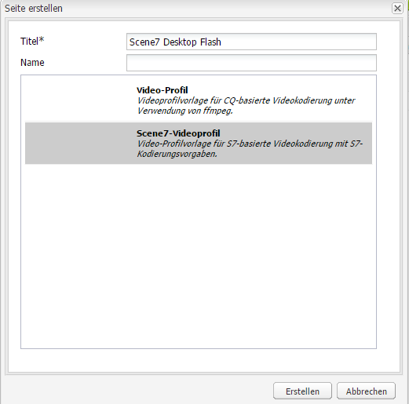

# Video {#video}

>[!CAUTION]
>
>AEM 6.4 hat das Ende der erweiterten Unterstützung erreicht und diese Dokumentation wird nicht mehr aktualisiert. Weitere Informationen finden Sie in unserer [technische Unterstützung](https://helpx.adobe.com/de/support/programs/eol-matrix.html). Unterstützte Versionen suchen [here](https://experienceleague.adobe.com/docs/?lang=de).

Assets bietet zentralisiertes Video-Asset-Management, mit dem Sie Videos direkt in Assets zur automatischen Kodierung in Dynamic Media Classic hochladen und für die Seitenerstellung direkt in Assets auf Dynamic Media Classic-Videos zugreifen können.

Die Dynamic Media Classic-Videointegration erweitert die Reichweite optimierter Videos auf alle Bildschirme (automatische Geräteanpassung und Bandbreitenerkennung).

* Die Videokomponente Dynamic Media Classic (Scene7) führt automatisch eine Geräte- und Bandbreitenerkennung durch, um auf Desktop-, Tablet- und Mobilgeräten das richtige Format und die richtige Qualität für Videos wiederzugeben.
* Assets – Sie können adaptive Videosets statt einzelner Video-Assets verwenden. Ein adaptives Videoset ist ein Container für alle Videoausgabedarstellungen, die für die nahtlose Wiedergabe des Videos über mehrere Bildschirme hinweg erforderlich sind. Ein adaptives Video-Set umfasst Versionen desselben Videos, die mit unterschiedlichen Bit-Raten und Formaten codiert wurden, wie 400 kBit/s, 800 kBit/s und 1000 kBit/s. Sie verwenden ein adaptives Videoset zusammen mit der S7-Videokomponente für adaptives Video-Streaming auf mehreren Bildschirmen, einschließlich Desktop-, iOS-, Android-, Blackberry- und Windows-Mobilgeräten. Siehe [Scene7-Dokumentation zu adaptiven Videosets für weitere Informationen](https://experienceleague.adobe.com/docs/dynamic-media-classic/using/setup/application-setup.html?lang=de#video-presets-for-encoding-video-files).

## Informationen zu FFMPEG und Dynamic Media Classic {#about-ffmpeg-and-scene}

Die Grundlage des standardmäßigen Videokodierungsprozesses ist die Verwendung der FFMPEG-basierten Integration mit Videoprofilen. Aus diesem Grund enthält der vorkonfigurierte Workflow DAM-Update-Asset die folgenden FFMPEG-basierten Workflow-Schritte:

* FFMPEG-Miniaturen
* FFMPEG-Codierung

Beachten Sie, dass die Aktivierung und Konfiguration der Dynamic Media Classic-Integration diese beiden Workflow-Schritte nicht automatisch aus dem vordefinierten Workflow &quot;DAM-Update-Asset-Erfassung&quot;entfernt oder deaktiviert. Wenn Sie bereits die FFMPEG-basierte Videokodierung in AEM verwenden, ist es wahrscheinlich, dass FFMPEG in Ihren Authoring-Umgebungen installiert ist. In diesem Fall würde ein neues Video, das mit Assets erfasst wird, zweimal kodiert: einmal vom FFMPEG-Kodierer und einmal von der Dynamic Media Classic-Integration.

Wenn Sie die FFMPEG-basierte Videokodierung in AEM konfiguriert und FFMPEG installiert haben, empfiehlt Adobe, die beiden FFMPEG-Workflows aus Ihren DAM Update Asset-Workflows zu entfernen.

### Unterstützte Formate {#supported-formats}

Die folgenden Formate werden für die Dynamic Media Classic-Videokomponente unterstützt:

* F4V H.264
* MP4 H.264

### Festlegen, wo das Video hochgeladen werden soll {#deciding-where-to-upload-your-video}

Die Entscheidung, wo Sie Ihre Video-Assets hochladen können, hängt von Folgendem ab:

* Benötigen Sie einen Workflow für das Video-Asset?
* Benötigen Sie eine Versionskontrolle für das Video-Asset?

Wenn Sie eine oder beide Fragen mit „Ja“ beantworten können, laden Sie Ihr Video direkt in Adobe DAM hoch. Lautet die Antwort auf beide Fragen „nein“, sollten Sie Ihr Video direkt in Dynamic Media Classic hochladen. Der Workflow für die einzelnen Szenarien wird im folgenden Abschnitt beschrieben.

#### Wenn Sie Ihr Video direkt in Adobe Assets hochladen {#if-you-are-uploading-your-video-directly-to-adobe-assets}

Wenn Sie einen Workflow oder eine Versionierung für Ihre Assets benötigen, laden Sie sie zuerst in Adobe DAM hoch. Der folgende Workflow wird empfohlen:

1. Laden Sie das Video-Asset in Adobe Assets hoch. Es findet eine automatische Kodierung und Veröffentlichung in Dynamic Media Classic statt.
1. Rufen Sie AEM Video-Assets in WCM im **[!UICONTROL Filme]** im Content Finder.
1. Verwenden Sie zum Erstellen die Video- oder Foundation-Videokomponente von Dynamic Media Classic.

#### Wenn Sie Ihr Video in Dynamic Media Classic hochladen {#if-you-are-uploading-your-video-to-scene}

Wenn Sie keinen Workflow und keine Versionierung für Ihre Assets benötigen, sollten Sie sie in Dynamic Media Classic hochladen. Der folgende Workflow wird empfohlen:

1. In Dynamic Media Classic [Geplantes Hochladen und Kodieren von FTP-Servern in Dynamic Media Classic einrichten (System automatisiert)](https://experienceleague.adobe.com/docs/dynamic-media-classic/using/upload-publish/uploading-files.html#uploading-your-files).
1. Rufen Sie AEM Video-Assets in WCM im **[!UICONTROL Dynamic Media Classic]** im Content Finder.
1. Verwenden Sie zum Erstellen die Dynamic Media Classic-Videokomponente.

### Video zur Konfiguration der Integration mit Dynamic Media Classic {#configuring-integration-with-scene-video}

**So konfigurieren Sie universelle Vorgaben**:

1. In **[!UICONTROL Cloud Services]**, navigieren Sie zu Ihrer **[!UICONTROL Dynamic Media Classic]** Konfiguration und klicken Sie auf **[!UICONTROL Bearbeiten]**.
1. Wählen Sie die Registerkarte **[!UICONTROL Video]** aus.

   >[!NOTE]
   >
   >Die Registerkarte **[!UICONTROL Video]** wird nicht angezeigt, wenn die Seite keine Cloud-Konfiguration hat. Siehe [Aktivieren von Dynamic Media Classic für WCM](#enablingscene7forwcm).

1. Wählen Sie das Profil für adaptive Videokodierung, ein Standardprofil für die Kodierung einzelner Videos, oder ein benutzerdefiniertes Videokodierungsprofil aus.

   >[!NOTE]
   >
   >Weitere Informationen dazu, was die Videovorgaben bedeuten, finden Sie in der [Dynamic Media Classic-Dokumentation](https://experienceleague.adobe.com/docs/dynamic-media-classic/using/setup/application-setup.html?lang=de#video-presets-for-encoding-video-files).
   >
   >Adobe empfiehlt, entweder beide adaptive Videosets bei der Konfiguration der universellen Vorgaben oder die Option **[!UICONTROL Adaptive Videokodierung]** auszuwählen.

1. Die ausgewählten Kodierungsprofile werden automatisch auf alle Videos angewendet, die in den CQ DAM-Zielordner hochgeladen werden, den Sie für diese Dynamic Media Classic-Cloud-Konfiguration einrichten. Sie können mehrere Dynamic Media Classic-Cloud-Konfigurationen mit verschiedenen Zielordnern einrichten, um nach Bedarf verschiedene Kodierungsprofile anzuwenden.

### Aktualisieren von Viewer- und Kodierungsvorlagen {#updating-viewer-and-encoding-presets}

Wenn Sie die Viewer- und Kodierungsvorgaben für Videos in AEM aktualisieren müssen, da die Vorgaben in Dynamic Media Classic aktualisiert wurden, navigieren Sie zur Dynamic Media Classic-Konfiguration in der Cloud-Konfiguration und klicken Sie auf **Aktualisieren von Viewer- und Kodierungsvorgaben**.

### Hochladen des Übergeordneten Videos {#uploading-your-master-video}

So laden Sie Ihr Übergeordnetes Video von Adobe DAM in Dynamic Media Classic hoch:

1. Navigieren Sie zum CQ DAM-Zielordner, in dem Sie Ihre Cloud-Konfiguration mit Dynamic Media Classic-Kodierungsprofilen eingerichtet haben.
1. Klicken **[!UICONTROL Hochladen]** , um ein Übergeordnetes Video hochzuladen. Upload und Kodierung des Videos sind fertig, wenn der Workflow [!UICONTROL DAM-Update-Asset] abgeschlossen und neben **[!UICONTROL In Dynamic Media Classic veröffentlichen]** ein Häkchen zu sehen ist.

   >[!NOTE]
   >
   >Es kann etwas Zeit in Anspruch nehmen, bis die Videominiaturen erstellt wurden.

   Durch Ziehen des Übergeordneten DAM-Videos auf die Videokomponente wird auf zugegriffen. *all* der Dynamic Media Classic-kodierten Proxy-Ausgabeformate für die Bereitstellung.

### Foundation-Videokomponente im Vergleich zur Dynamic Media Classic-Videokomponente {#foundation-video-component-versus-scene-video-component}

Bei Verwendung von AEM haben Sie Zugriff auf die Videokomponente, die in Sites verfügbar ist, und auf die Dynamic Media Classic (Scene7)-Videokomponente. Diese Komponenten sind nicht austauschbar.

Die Dynamic Media Classic-Videokomponente funktioniert nur für Dynamic Media Classic-Videos. Die Foundation-Komponente funktioniert mit Videos, die in AEM (mithilfe von ffmpeg) und Dynamic Media Classic-Videos gespeichert sind.

Die folgende Matrix verdeutlicht, wann Sie welche Komponente nutzen sollten:

>[!NOTE]
>
>Die Dynamic Media Classic-Videokomponente verwendet standardmäßig das universelle Videoprofil. Sie können jedoch den HTML5-basierten Videoplayer zur Verwendung durch AEM abrufen. Kopieren Sie in Dynamic Media Classic den Einbettungscode des vordefinierten HTML5-Videoplayers und fügen Sie ihn in Ihre AEM ein.

## AEM Videokomponente {#aem-video-component}

Auch wenn die Verwendung der Dynamic Media Classic-Videokomponente für die Anzeige von Dynamic Media Classic-Videos empfohlen wird, wird in diesem Abschnitt die Verwendung von Dynamic Media Classic-Videos mit dem [!UICONTROL Foundation-Videokomponente] AEM, um der Vollständigkeit halber.

### AEM Video- und Dynamic Media Classic-Videovergleich {#aem-video-and-scene-video-comparison}

Die folgende Tabelle bietet einen allgemeinen Vergleich der unterstützten Funktionen zwischen der AEM Foundation-Videokomponente und der Scene7-Videokomponente:

|  | AEM Foundation-Video | Dynamic Media Classic­Video |
|---|---|---|
| Ansatz | HTML5 als erster Ansatz. Flash dient nur als Ausweichlösung bei Nicht-HTML5-Inhalten. | Flash auf den meisten Desktopgeräten HTML5 wird für Mobilgeräte und Tablets verwendet. |
| Bereitstellung | Progressiv | Adaptives Streaming |
| Tracking | Ja | Ja |
| Erweiterbarkeit | Ja | Ja (mit Dynamic Media Classic Viewer-SDK) |
| Mobile-Video | Ja | Ja |

### Einrichten {#setting-up}

#### Erstellen von Videoprofilen {#creating-video-profiles}

Die verschiedenen Videokodierungen werden entsprechend den in der Dynamic Media Classic-Cloud-Konfiguration ausgewählten Dynamic Media Classic-Kodierungsvorgaben erstellt. Damit die Foundation-Videokomponente diese verwenden kann, muss für jede ausgewählte Dynamic Media Classic-Kodierungsvorgabe ein Videoprofil erstellt werden. Dadurch kann die Videokomponente die DAM-Ausgabeformate entsprechend auswählen.

>[!NOTE]
>
>Neue Videoprofile und Änderungen daran müssen für eine Veröffentlichung aktiviert werden.

1. Gehen Sie AEM zu **[!UICONTROL Instrumente]**, wählen Sie **[!UICONTROL Konfigurationskonsole]**. Navigieren Sie in der Konfigurationskonsole zu **[!UICONTROL Instrumente]** > **[!UICONTROL Assets]** > **[!UICONTROL Videoprofile]** in der Navigationsstruktur.
1. Erstellen Sie ein neues Dynamic Media Classic-Videoprofil. Im **[!UICONTROL Neu...]** Menü auswählen **[!UICONTROL Seite erstellen]** und wählen Sie dann die Vorlage Dynamic Media Classic-Videoprofil aus. Geben Sie der neuen Videoprofilseite einen Namen und klicken Sie auf **[!UICONTROL Erstellen]**.

   

1. Bearbeiten Sie das neue Videoprofil. Wählen Sie zuerst die Cloud-Konfiguration aus. Wählen Sie dann dieselbe Codierungsvorgabe aus wie in der Cloud-Konfiguration.

   

   | Eigenschaft | Beschreibung |
   |---|---|
   | Cloud-Konfiguration für Dynamic Media Classic (Scene7) | Die Cloud-Konfiguration, die für die Codierungsvorlagen verwendet werden soll |
   | Kodierungsvorgabe für Dynamic Media Classic (Scene7) | Die Codierungsvorgabe, mit der dieses Videoprofil verknüpft werden soll. |
   | HTML5-Videotyp | Mit dieser Eigenschaft können Sie den Wert der Eigenschaft type des Videoquellenelements HTML5 festlegen. Diese Information wird nicht von den Dynamic Media Classic-Kodierungsvorlagen bereitgestellt, sie ist jedoch erforderlich, um die Videos mit dem HTML5-Videoelements richtig zu rendern. Eine Liste für gängige Formate wird bereitgestellt, kann jedoch für andere Formate überschrieben werden. |

   Wiederholen Sie diesen Schritt für alle in der Cloud-Konfiguration ausgewählten Kodierungsvorgaben, die Sie in der Videokomponente verwenden möchten.

#### Konfigurieren von Design {#configuring-design}

Die Foundation-Videokomponente muss darüber informiert sein, welche Videoprofile verwendet werden sollen, damit sie die Videoquellenliste erstellen kann. Sie müssen das Dialogfeld &quot;Design&quot;der Videokomponenten öffnen und das Komponentendesign für die Verwendung der neuen Videoprofile konfigurieren.

>[!NOTE]
>
>Wenn Sie die Foundation-Videokomponente auf einer mobilen Seite verwenden, müssen Sie diese Schritte möglicherweise beim Design der mobilen Seite wiederholen.

>[!NOTE]
>
>Bei Änderungen am Design ist eine Aktivierung des Designs erforderlich, damit es für die Veröffentlichung übernommen wird.

1. Öffnen Sie den Designdialog der Foundation-Videokomponente und wechseln Sie auf die Registerkarte **[!UICONTROL Profile]**. Löschen Sie dann die nativen Profile und fügen Sie die neuen Dynamic Media Classic-Videoprofile hinzu. Die Reihenfolge der Profilliste im Design-Dialogfeld definiert die Reihenfolge des Videoquellenelements beim Rendern.
1. Bei Browsern, die HTML 5 nicht unterstützen, ermöglicht die Videokomponente die Konfiguration einer Flash-Ausweichmöglichkeit. Öffnen Sie den Designdialog der Videokomponenten und wechseln Sie auf die Registerkarte **[!UICONTROL Flash]**. Konfigurieren Sie die Einstellungen des Flash-Players und weisen Sie ein Ersatzprofil für den Flash-Player zu.

#### Checkliste {#checklist}

1. Erstellen Sie eine Dynamic Media Classic (Scene7)-Cloud-Konfiguration. Stellen Sie sicher, dass die Vorgaben für die Videokodierung festgelegt sind und das Importtool ausgeführt wird.
1. Erstellen Sie ein Dynamic Media Classic-Videoprofil für jede in der Cloud-Konfiguration ausgewählte Videokodierungsvorlage.
1. Die Videoprofile müssen aktiviert sein.
1. Konfigurieren Sie das Design der Foundation-Videokomponente auf Ihrer Seite.
1. Aktivieren Sie das Design, sobald Sie mit Ihren Design-Änderungen fertig sind.
