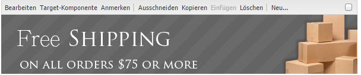

# Hinzufügen von Dynamischen Medien Classic-Funktionen zu einer Seite{#adding-scene-features-to-your-page}

[Adobe Dynamic Media Classic](https://help.adobe.com/en_US/scene7/using/WS26AB0D9A-F51C-464e-88C8-580A5A82F810.html) ist eine gehostete Lösung zum Verwalten, Erweitern, Veröffentlichen und Bereitstellen von Rich-Media-Assets für Web-, Mobil-, E-Mail- und Internetanzeigen und Drucken.

Sie können in Dynamic Media Classic veröffentlichte AEM-Assets in verschiedenen Viewern anzeigen:

* Zoom
* Flyout
* Video
* Bildvorlage
* Bild

Sie können digitale Assets direkt von AEM in Dynamic Media Classic veröffentlichen und digitale Assets von Dynamic Media Classic in AEM veröffentlichen.

In diesem Abschnitt wird beschrieben, wie Sie digitale Assets von AEM in Dynamic Media Classic veröffentlichen und umgekehrt. Die Viewer werden auch detailliert beschrieben. Informationen zum Konfigurieren von AEM für Dynamic Media Classic finden Sie unter [Integration von Dynamic Media Classic mit AEM](/help/sites-administering/scene7.md).

Siehe auch [Hinzufügen von Imagemaps](/help/assets/image-maps.md).

Weitere Informationen über die Arbeit mit Videokomponenten mit AEM finden Sie unter:

* [Video](/help/sites-classic-ui-authoring/manage-assets-classic-s7-video.md)

>[!NOTE]
>
>If Dynamic Media Classic assets do not display properly, make sure that Dynamic media is [disabled](/help/assets/config-dynamic.md#disabling-dynamic-media) and then refresh the page.

## Manuelles Veröffentlichen von Assets in Dynamic Media Classic {#manually-publishing-to-scene-from-assets}

Sie können digitale Assets entweder über die Asset-Konsole in der klassischen Benutzeroberfläche oder direkt vom Asset in Dynamic Media Classic veröffentlichen.

>[!NOTE]
>
>AEM veröffentlicht dynamisch Media Classic asynchron. After you click **[!UICONTROL Publish]**, it may take several seconds for your asset to publish to Dynamic Media Classic.

### Veröffentlichen über die Asset-Konsole {#publishing-from-the-assets-console}

So veröffentlichen Sie in der Assets-Konsole in Dynamic Media Classic, wenn sich die Assets in einem Zielordner von Dynamic Media Classic befinden:

1. In the AEM classic UI, click **[!UICONTROL Digital Assets]** to access the digital asset manager.

1. Select the asset (or assets) or folder from within the target folder you want to publish to Dynamic Media Classic and right-click and select **[!UICONTROL Publish to Dynamic Media Classic]**. Alternativ dazu können Sie im Menü ****[!UICONTROL Werkzeuge]** die Option Auf dynamische Medien klassisch [!UICONTROL veröffentlichen auswählen] .

   

1. Gehen Sie zu &quot;Dynamic Media Classic&quot;und überprüfen Sie, ob die Assets verfügbar sind.

   >[!NOTE]
   >
   >If the assets are not in a Dynamic Media Classic synchronized folder, **[!UICONTROL Publish to Dynamic Media Classic]** in both menus is visible but disabled.

### Veröffentlichen über ein Asset {#publishing-from-an-asset}

Sie können ein Asset manuell veröffentlichen, solange sich dieses Asset im synchronisierten Ordner &quot;Dynamic Media Classic&quot;befindet.

>[!NOTE]
>
>Wenn sich das Asset nicht im synchronisierten Ordner &quot;Dynamic Media Classic&quot;befindet, ist der Link zum **[!UICONTROL Veröffentlichen in &quot;Dynamic Media Classic&quot;nicht verfügbar]** .

**So veröffentlichen Sie Inhalte direkt aus einem digitalen Asset** in Dynamic Media Classic

1. Klicken Sie in AEM auf **[!UICONTROL Digitale Assets]**, um auf den Digital Asset Manager zuzugreifen.

1. Doppelklicken Sie, um ein Asset zu öffnen.

1. Wählen Sie im Bereich &quot;Asset-Details&quot;die Option **[!UICONTROL Auf dynamischen Medien klassisch]** veröffentlichen.

   

1. Der Link ändert sich zu **[!UICONTROL Wird veröffentlicht ...]** und dann zu **[!UICONTROL Veröffentlicht]**. Gehen Sie zu &quot;Dynamisch Media Classic&quot;und überprüfen Sie, ob das Asset verfügbar ist.

   >[!NOTE]
   >
   >If the asset does not publish properly to Dynamic Media Classic, the link changes to **[!UICONTROL Publishing Failed]**. Wenn das Asset bereits in &quot;Dynamic Media Classic&quot;veröffentlicht wurde, lautet der Link &quot; **[!UICONTROL In Dynamic Media Classic]** erneut veröffentlichen&quot;. Durch die Veröffentlichung können Sie Änderungen an einem Asset in AEM vornehmen und es erneut veröffentlichen.

### Publishing assets from outside the CQ target folder {#publishing-assets-from-outside-the-cq-target-folder}

Adobe empfiehlt, dass Sie Assets nur aus Assets im Zielordner von Dynamic Media Classic in Dynamic Media Classic veröffentlichen. However, if you need to upload assets from a folder outside of the target folder, you can still do that by uploading them to an *ad-hoc* folder on Dynamic Media Classic.

Hierzu konfigurieren Sie die Cloud-Konfiguration für die Seite, auf der das Asset angezeigt werden soll. Anschließend fügen Sie der Seite eine Komponente &quot;Dynamische Medien-Classic&quot;hinzu und ziehen ein Asset per Drag &amp; Drop in die Komponente. After the page properties are set for that page, a **[!UICONTROL Publish to Dynamic Media Classic]** link appears that when selected triggers uploading to Dynamic Media Classic.

>[!NOTE]
>
>Assets, die sich im Ad-hoc-Ordner befinden, werden nicht im Inhaltsbrowser von Dynamic Media Classic angezeigt.

**So veröffentlichen Sie außerhalb des CQ-Zielordners befindliche Assets**:

1. In AEM in the classic UI, click **[!UICONTROL Websites]** and navigate to the web page that you want to add a digital asset to that is not yet published to Dynamic Media Classic. (Es gelten normale Seitenübernahmeregeln.)

1. In the sidekick, click the **[!UICONTROL Page]** icon, then click **[!UICONTROL Page Properties]**.

1. Klicken Sie auf **[!UICONTROL Cloud-Dienste > Dienste hinzufügen > Dynamischer Medienklassiker (Scene7)**.
1. Wählen Sie in der Dropdownliste Adobe Dynamic Media Classic die gewünschte Konfiguration und klicken Sie dann auf **[!UICONTROL OK]**.

   

1. Fügen Sie auf der Webseite der gewünschten Position auf der Seite eine Komponente &quot;Dynamic Media Classic&quot;(Scene7) hinzu.
1. Ziehen Sie in der Inhaltssuche ein digitales Asset zur Komponente. Es wird ein Link zur **[!UICONTROL Prüfung des Veröffentlichungsstatus]** für dynamische Medien und Klassische Medien angezeigt.

   >[!NOTE]
   >
   >If the digital asset is in the CQ target folder, then no link to **[!UICONTROL Check Dynamic Media Classic Publication Status]** appears. Die Assets werden einfach in der Komponente platziert.

   

1. Klicken Sie auf **[!UICONTROL Überprüfen Sie den Status]** der Dynamischen Medien - Classic-Veröffentlichung. Wenn das Asset nicht veröffentlicht wird, veröffentlicht AEM das Asset in Dynamic Media Classic. Nach dem Upload befindet sich das Asset im Ad-hoc-Ordner. Der Ad-hoc-Ordner befindet sich standardmäßig im Ordner `name_of_the_company/CQ5_adhoc`. Sie können dies [bei Bedarf konfigurieren](#configuringtheadhocfolder).

   >[!NOTE]
   >
   >Wenn sich das Asset nicht in einem synchronisierten Ordner von Dynamic Media Classic befindet und der aktuellen Seite keine Dynamic Media Classic-Cloud-Konfiguration zugeordnet ist, schlägt der Upload fehl.

## Komponenten von Dynamic Media Classic (Scene7) {#scene-components}

Die folgenden Komponenten von Dynamic Media Classic sind in AEM verfügbar:

* Zoom
* Flyout (Zoom)
* Bildvorlage
* Bild
* Video

>[!NOTE]
>
>These components are not available by default and need to be selected in **[!UICONTROL Design]** mode before using.

After they are made available in **[!UICONTROL Design]** mode, you can add the components to your page like any other AEM component. Assets, die noch nicht in Dynamic Media Classic veröffentlicht wurden, werden in Dynamic Media Classic veröffentlicht, wenn sie sich in einem synchronisierten Ordner, auf einer Seite oder in einer Cloud-Konfiguration für Dynamic Media Classic befinden.

### Flash viewers end-of-life notice {#flash-viewers-end-of-life-notice}

Ab dem 31. Januar 2017 hat Adobe Dynamic Media Classic offiziell die Unterstützung für die Flash-Viewer-Plattform eingestellt.

For more information about this important change, see [Flash viewer end-of-life FAQs](https://docs.adobe.com/content/docs/en/aem/6-1/administer/integration/marketing-cloud/scene7/flash-eol.html).

### Adding a Dynamic Media Classic component to a page {#adding-a-scene-component-to-a-page}

Das Hinzufügen einer Komponente für dynamische Medien Classic zu einer Seite entspricht dem Hinzufügen einer Komponente zu einer beliebigen Seite. Die Komponenten von Dynamic Media Classic werden in den folgenden Abschnitten ausführlich beschrieben.

**So fügen Sie einer Seite in der klassischen Benutzeroberfläche** eine Komponente/einen Viewer für dynamische Medien hinzu:

1. Öffnen Sie in AEM die Seite, auf der Sie die Komponente &quot;Dynamische Medien - Klassik&quot;hinzufügen möchten.

1. If no Dynamic Media Classic components are available, click the ruler in the sidekick to enter **[!UICONTROL Design]** mode, click **[!UICONTROL Edit]** parsys, and select all the **[!UICONTROL Dynamic Media Classic]** components to make them available.

1. Return to **[!UICONTROL Edit]** mode by clicking the pencil in the sidekick.

1. Drag a component from the **[!UICONTROL Dynamic Media Classic]** group in the sidekick onto the page in the desired location.

1. Klicken Sie auf **[!UICONTROL Bearbeiten]**, um die Komponente zu öffnen.

1. Bearbeiten Sie die Komponente bei Bedarf und klicken Sie auf **[!UICONTROL OK]**, um die Änderungen zu speichern.

### Hinzufügen von interaktiven Anzeigeerlebnissen zu einer dynamischen Website {#adding-interactive-viewing-experiences-to-a-responsive-website}

Dynamisches Design für Ihre Assets bedeutet, dass Ihre Assets in Abhängigkeit ihrer Anzeigeposition angepasst werden. Bei reaktionsfähigem Design werden dieselben Assets effektiv auf mehreren Geräten angezeigt.

**So fügen Sie ein interaktives Anzeigeerlebnis zu einer dynamischen Website auf der klassischen Benutzeroberfläche hinzu**:

1. Log in to AEM, and ensure that you have [configured Adobe Dynamic Media Classic Cloud Services](/help/sites-administering/scene7.md#configuring-scene-integration) and that Dynamic Media Classic components are available.

   >[!NOTE]
   >
   >Wenn die WCM-Komponenten von Dynamic Media Classic nicht verfügbar sind, stellen Sie sicher, dass sie im **[!UICONTROL Designmodus] aktiviert werden.

1. In a website with the Dynamic Media Classic components enabled, drag an **[!UICONTROL Image]** viewer to the page.
1. Edit the component and adjust the breakpoints in the **[!UICONTROL Dynamic Media Classic Settings]** tab.

   

1. Bestätigen Sie, dass die Größe der Viewer dynamisch geändert wird und dass alle Interaktionen für Desktopcomputer, Tablets und Mobilgeräte optimiert sind.

### Allgemeine Einstellungen für alle Komponenten von Dynamic Media Classic {#settings-common-to-all-scene-components}

Obwohl die Konfigurationsoptionen variieren, gelten für alle Komponenten von Dynamic Media Classic die folgenden:

* **[!UICONTROL Dateiverweis]**: Navigieren Sie zu einer Datei, die Sie referenzieren möchten. Der Dateiverweis zeigt die Asset-URL und nicht unbedingt die vollständige URL von Dynamic Media Classic, einschließlich der URL-Befehle und -Parameter. Sie können in diesem Feld keine URL-Befehle und Parameter für Dynamic Media Classic hinzufügen. Sie müssen über die entsprechende Funktionalität in der Komponente hinzugefügt werden.
* **[!UICONTROL Breite]**: Hiermit kann die Breite angepasst werden.
* **[!UICONTROL Höhe]**: Hiermit kann die Höhe angepasst werden.

You set these configuration options by double-clicking a Dynamic Media Classic component, for example, when you open a **[!UICONTROL Zoom]** component:

### Zoom {#zoom}

Die HTML5 Zoom-Komponente zeigt ein größeres Bild an, wenn Sie die Taste „+“ drücken.

Das Asset verfügt unten über Zoomwerkzeuge. Klicken Sie auf **[!UICONTROL +]** zum Vergrößern. Klicken Sie auf **[!UICONTROL -]** zum Verkleinern. Clicking **[!UICONTROL x]** or the reset zoom arrow brings the image back to the original size it was imported as. Klicken Sie auf die diagonalen Pfeile, um es im Vollbild anzuzeigen. Klicken Sie auf **[!UICONTROL Bearbeiten]**, um die Komponente zu konfigurieren. With this component, you can configure [settings common to all Dynamic Media Classic components](#settings-common-to-all-scene-components).

### Flyout {#flyout}

In der HTML5 Flyout-Komponente wird das Asset als geteilter Bildschirm angezeigt. Links wird das Asset in der angegebenen Größe angezeigt, rechts wird der Zoomteil angezeigt. Klicken Sie auf **[!UICONTROL Bearbeiten]**, um die Komponente zu konfigurieren. With this component, you can configure [settings common to all Dynamic Media Classic components](/help/sites-administering/scene7.md#settingscommontoalldynamicmediaclassiccomponents).

>[!NOTE]
>
>Wenn die Flyout-Komponente eine benutzerdefinierte Größe aufweist, wird diese benutzerdefinierte Größe verwendet und die dynamische Einrichtung der Komponente ist deaktiviert.
>
>If your Flyout component uses the default size, as set in the [!UICONTROL Design] view, then the default size is used and the component stretches to accomodate the page layout size with responsive setup of the component enabled. Beachten Sie jedoch, dass es eine Beschränkung für das reaktionsfähige Setup der Komponente gibt. Beim Verwenden der Flyout-Komponente mit dynamischer Einrichtung sollten Sie sie nicht mit vollständiger Seitendehnung verwenden. Andernfalls kann der Flyout über den rechten Rand der Seite hinausgehen.

### Bild {#image}

Mit der Komponente &quot;Dynamisches Medienklassisches Bild&quot;können Sie Ihren Bildern Funktionen für Dynamische Medien Classic hinzufügen, z. B. Modifikatoren für Dynamische Medien Classic, Bild- oder Viewer-Vorgaben und Scharfzeichnen. Die Bildkomponente &quot;Dynamic Media Classic&quot;ähnelt anderen Bildkomponenten in AEM mit spezieller Dynamic Media Classic-Funktionalität. In diesem Beispiel wurde für das Bild der URL-Modifikator &quot;Dynamisch Media Classic&quot; `&op_invert=1` angewendet.

**[!UICONTROL Titel, Alt-Text]** - Fügen Sie auf der Registerkarte &quot; [!UICONTROL Erweitert] &quot;dem Bild einen Titel und Alt-Text für Benutzer hinzu, die Grafiken deaktiviert haben.

**[!UICONTROL URL, Öffnen in]** - Sie können ein Asset vom zum Öffnen eines Links festlegen. Set the **[!UICONTROL URL]** and **[!UICONTROL Open in]** to indicate whether you want it to open in the same window or a new window.

**[!UICONTROL Viewer-Vorgabe]** : Wählen Sie im Dropdown-Menü eine vorhandene Viewer-Vorgabe aus. Wenn die gewünschte Viewer-Vorgabe nicht sichtbar ist, müssen Sie sie möglicherweise sichtbar machen. Siehe [Verwalten von Viewer-Vorgaben](/help/assets/managing-viewer-presets.md). Es ist nicht möglich, eine Viewer-Vorgabe auszuwählen, wenn Sie eine Bildvorgabe verwenden, und umgekehrt.

**[!UICONTROL Konfiguration]** von Dynamic Media Classic - Wählen Sie die Konfiguration von Dynamic Media Classic aus, die Sie zum Abrufen aktiver Bildvorgaben aus dem Scene7 Publishing System verwenden möchten.

**[!UICONTROL Bildvorgabe]** : Wählen Sie eine vorhandene Bildvorgabe aus dem Dropdown-Menü. Wenn die gewünschte Bildvorgabe nicht sichtbar ist, müssen Sie sie möglicherweise sichtbar machen. Siehe [Verwalten von Bildvorgaben](/help/assets/managing-image-presets.md). Es ist nicht möglich, eine Viewer-Vorgabe auszuwählen, wenn Sie eine Bildvorgabe verwenden, und umgekehrt.

**[!UICONTROL Ausgabeformat]** - Wählen Sie das Ausgabeformat des Bilds, z. B. jpeg, aus. In Abhängigkeit des von Ihnen ausgewählten Ausgabeformats stehen Ihnen möglicherweise zusätzliche Konfigurationsoptionen zur Verfügung. Siehe [Verwalten von Bildvorgaben](/help/assets/managing-image-presets.md).

**[!UICONTROL Scharfzeichnen]** - Wählen Sie aus, wie das Bild scharfgezeichnet werden soll. Scharfzeichnen wird in den Best Practices für Bildqualität und Scharfzeichnen in [*Adobe Dynamic Media Classic ausführlich erläutert *](/help/assets/assets/s7_sharpening_images.pdf).

**[!UICONTROL URL-Modifikatoren]** : Sie können Bildeffekte ändern, indem Sie zusätzliche Dynamic Media Classic-Bildbefehle bereitstellen. These are described in [Managing Image Presets](/help/assets/managing-image-presets.md) and the [Command reference](https://marketing.adobe.com/resources/help/en_US/s7/is_ir_api/is_api/http_ref/c_command_reference.html).

**[!UICONTROL Haltepunkte]** : Wenn Ihre Website responsiv ist, sollten Sie die Haltepunkte anpassen. Breakpoints must be separated by commas `,`.

### Bildvorlage {#image-template}

[Dynamic Media Classic-Bildvorlagen](https://help.adobe.com/en_US/scene7/using/WS60B68844-9054-4099-BF69-3DC998A04D3C.html) sind in Dynamic Media Classic importierte Fotoshop-Inhalte mit Ebenen, bei denen Inhalt und Eigenschaften auf Variabilität parametrisiert wurden. Mit der Komponente **[!UICONTROL Bildvorlage]** können Sie Bilder importieren und den Text in AEM dynamisch ändern. Zusätzlich können Sie die Komponente **[!UICONTROL Bildvorlage]** dahingehend konfigurieren, dass sie Werte aus dem Clientkontext übernimmt, damit das Bild jedem Benutzer personalisiert angezeigt wird.

Klicken Sie auf **[!UICONTROL Bearbeiten]**, um die Komponente zu konfigurieren. You can configure [settings common to all Dynamic Media Classic components](/help/sites-administering/scene7.md#settingscommontoalldynamicmediaclassicscomponents) as well as other settings described in this section.

**[!UICONTROL Dateiverweis, Breite, Höhe]** - Siehe Einstellungen, die allen Komponenten von Dynamic Media Classic gemein sind.

>[!NOTE]
>
>URL-Befehle und -Parameter für Dynamic Media Classic können der Dateiverweis-URL nicht direkt hinzugefügt werden. Sie können nur auf der Komponenten-Benutzeroberfläche im Bedienfeld **[!UICONTROL Parameter]** definiert werden.

**[!UICONTROL Titel, Alt-Text]** Fügen Sie auf der Registerkarte [!UICONTROL Dynamic Media Classic-Bildvorlage] einen Titel zum Bild und alternativem Text für Benutzer hinzu, die Grafiken deaktiviert haben.

**[!UICONTROL URL, Öffnen in]** Sie können ein Asset so einstellen, dass ein Link geöffnet wird. Legen Sie die **[!UICONTROL URL]** fest. Geben Sie in **[!UICONTROL Öffnen in]** an, ob der Link im selben oder einem neuen Fenster geöffnet werden soll.

**[!UICONTROL Parameterbedienfeld]** Beim Importieren eines Bildes werden die Parameter mit Informationen aus dem Bild vorausgefüllt. Wenn kein Inhalt vorhanden ist, der dynamisch geändert werden kann, ist dieses Fenster leer.

#### Dynamisches Ändern von Text {#changing-text-dynamically}

Geben Sie zum dynamischen Ändern des Texts neuen Text in die Felder ein und klicken Sie auf **[!UICONTROL OK]**. In diesem Beispiel lautet der **[!UICONTROL Preis]** 50 $ und der Versand kostet 0,99 $.

Der Text im Bild ändert sich. Sie können den Text auf den ursprünglichen Wert zurücksetzen, indem Sie neben dem Feld auf **[!UICONTROL Zurücksetzen]** klicken.

#### Ändern von Text zum Berücksichtigen des Werts eines Clientkontextwerts {#changing-text-to-reflect-the-value-of-a-client-context-value}

To link a field to a client context value, click **[!UICONTROL Select]** to open the client-context menu, select the client context, and click **[!UICONTROL OK]**. In diesem Beispiel ändert sich der Name auf Grundlage der Verknüpfung des Namens mit dem formatierten Namen im Profil.

Der Text berücksichtigt den Namen des aktuell angemeldeten Benutzers. Sie können den Text auf den ursprünglichen Wert zurücksetzen, indem Sie neben dem Feld auf **[!UICONTROL Zurücksetzen]** klicken.

#### Erstellen eines Links zur Vorlage für das Bild &quot;Dynamic Media Classic&quot; {#making-the-scene-image-template-a-link}

**So erstellen Sie eine Verknüpfung** mit der Vorlage für das Bild &quot;Dynamic Media Classic&quot;:

1. On the page with the Dynamic Media Classic image template component, click **[!UICONTROL Edit]**.
1. Geben Sie im Feld **[!UICONTROL URL]** die URL ein, zu der Benutzer wechseln, wenn sie auf das Bild klicken. Wählen Sie im Feld **[!UICONTROL Öffnen in]** aus, ob das Ziel (in einem neuen oder im selben Fenster) geöffnet werden soll.

   

1. Klicken Sie auf **[!UICONTROL OK]**.

### Komponente „Video“{#video-component}

The Dynamic Media Classic **[!UICONTROL Video]** component (available from the Dynamic Media Classic section of the sidekick) uses device and bandwidth detection to serve the right video to each screen. Bei dieser Komponente handelt es sich um einen HTML5-Video-Player. Es ist ein einzelner Viewer, der kanalübergreifend verwendet werden kann.

Er kann für adaptive Videosets, ein einzelnes MP4-Video oder ein einzelnes F4V-Video verwendet werden.

See [Video](/help/sites-classic-ui-authoring/manage-assets-classic-s7-video.md) for more information on how videos work with Dynamic Media Classic integration. In addition, see how [the **Dynamic Media Classic video** component compares to the foundation **video** component](/help/sites-classic-ui-authoring/manage-assets-classic-s7-video.md).

### Bekannte Einschränkungen für die Videokomponente {#known-limitations-for-the-video-component}

Adobe DAM und WCM zeigen, ob ein Mastervideo hochgeladen wurde. Sie zeigen diese Proxy-Assets nicht an:

* Dynamische Medien - Classic-kodierte Darstellungen
* Adaptive Videosets für Dynamic Media Classic

Wenn Sie ein adaptives Videoset mit der Komponente &quot;Dynamic Media Classic&quot;verwenden, müssen Sie die Größe der Komponente an die Abmessungen des Videos anpassen.

## Browser für dynamische Medien-Classic-Inhalte {#scene-content-browser}

Mit dem Browser für dynamische Medien-Classic-Inhalte können Sie Inhalte aus Dynamic Media Classic direkt in AEM anzeigen. To access the content browser, in the Content Finder, select **[!UICONTROL Dynamic Media Classic]** in the touch-optimized user interface or the **[!UICONTROL S7]** icon in the classic user interface. Die Funktionalität ist zwischen den beiden Benutzeroberflächen identisch.

Wenn Sie über mehrere Konfigurationen verfügen, zeigt AEM standardmäßig die [Standardkonfiguration](/help/sites-administering/scene7.md#configuring-a-default-configuration) an. Sie können verschiedene Konfigurationen direkt im Inhaltsbrowser von Dynamic Media Classic im Dropdown-Menü auswählen.

>[!NOTE]
>
>* Assets, die sich im Ad-hoc-Ordner befinden, werden nicht im Inhaltsbrowser von Dynamic Media Classic angezeigt.
>* Wenn die [sichere Vorschau aktiviert](/help/sites-administering/scene7.md#configuring-the-state-published-unpublished-of-assets-pushed-to-scene)ist, werden veröffentlichte und unveröffentlichte Assets in Dynamic Media Classic im Inhaltsbrowser von Dynamic Media Classic angezeigt.
>* If you do not see **[!UICONTROL Dynamic Media Classic]** or the **[!UICONTROL S7]** icon as an option in the content browser, you need to [configure Dynamic Media Classic to work with AEM](/help/sites-administering/scene7.md).
   >
   >
* Für Videos unterstützt der Inhaltsbrowser Dynamic Media Classic Folgendes:
   >
   >
* Adaptive Videosets: Container von allen für die bildschirmübergreifende optimierte Wiedergabe erforderlichen Videoausgabeformaten
>* Einzelnes MP4-Video
>* Einzelnes F4V-Video

### Durchsuchen von Inhalt auf der klassischen Benutzeroberfläche {#browsing-content-in-the-classic-ui}

Durchsuchen Sie Inhalte in Dynamic Media Classic, indem Sie auf die Registerkarte **[!UICONTROL S7]** klicken.

Sie können die Konfiguration, auf die Sie zugreifen, ändern, indem Sie die Konfiguration auswählen. Die Ordner ändern sich je nach ausgewählter Konfiguration.

Wie mit der Inhaltssuche für Assets können Sie nach Assets suchen und Ergebnisse filtern. Im Gegensatz zur Asset-Suche **[!UICONTROL beginnt]** der Dateiname jedoch beim Eingeben eines Keywords auf der Registerkarte *S7* mit dem von Ihnen eingegebenen String, anstatt dass das Keyword im Dateinamen *enthalten* ist.

Standardmäßig werden Assets nach Dateiname angezeigt. Sie können Ergebnisse auch nach Asset-Typ filtern.

>[!NOTE]
>
>Für Videos unterstützt der Browser des WCM-Inhalts von Dynamic Media Classic Folgendes:
>
>* Adaptive Videosets: Container von allen für die bildschirmübergreifende optimierte Wiedergabe erforderlichen Videoausgabeformaten
>* Einzelnes MP4-Video
>* Einzelnes F4V-Video
>

### Suchen nach dynamischen Medien-Classic-Assets mit dem Inhaltsbrowser {#searching-for-scene-assets-with-the-content-browser}

Die Suche nach dynamischen Medien-Classic-Assets ähnelt der Suche nach AEM-Assets. Bei der Suche sehen Sie jedoch eine Remote-Ansicht der Assets im System Dynamic Media Classic, anstatt sie direkt in AEM zu importieren.

Sie können die klassische oder Touch-optimierte Benutzeroberfläche verwenden, um Assets anzuzeigen und nach ihnen zu suchen. In Abhängigkeit von der Oberfläche unterscheidet sich die Art und Weise der Suche etwas.

Wenn Sie auf einer der Benutzeroberflächen suchen, können Sie nach den folgenden Kriterien filtern (wird hier in der Touch-optimierten Benutzeroberfläche gezeigt):

**[!UICONTROL Suchbegriffe]** eingeben - Sie können Assets nach Namen suchen. Bei der Suche entsprechen die von Ihnen eingegebenen Keywords dem Beginn des Dateinamens. Zum Beispiel führt die Eingabe des Worts „schwimmen“ dazu, dass nach Asset-Dateinamen gesucht wird, die mit diesen Buchstaben in dieser Reihenfolge beginnen. Drücken Sie die Eingabetaste, nachdem Sie den Begriff eingegeben haben, um nach dem Asset zu suchen.

**[!UICONTROL Ordner/Pfad]** - Der Name des angezeigten Ordners hängt von der ausgewählten Konfiguration ab. Sie können niedrigere Ebenen anzeigen, indem Sie auf das Ordnersymbol klicken, einen Unterordner auswählen und dann auf das Häkchen klicken, um ihn auszuwählen.

Wenn Sie ein Keyword eingeben und einen Ordner auswählen, durchsucht AEM diesen Ordner und die zugehörigen Unterordner. Wenn Sie jedoch bei der Suche keine Keywords eingeben, wird durch die Auswahl des Ordners das Asset nur in diesem Ordner angezeigt und nicht in Unterordnern.

Standardmäßig durchsucht AEM den ausgewählten Ordner und alle Unterordner.

**[!UICONTROL Typ des Assets]** Wählen Sie &quot;Dynamischer Medienklassiker&quot;, um Inhalt von &quot;Dynamischer Medienklassiker&quot;zu durchsuchen. Diese Option ist nur verfügbar, wenn Sie Dynamic Media Classic bereits konfiguriert haben.

**[!UICONTROL Konfiguration]** Wenn in [!UICONTROL Cloud Services]mehr als eine Konfiguration von Dynamic Media Classic definiert ist, können Sie diese hier auswählen. Der Ordner ändert sich anhand der von Ihnen ausgewählten Konfiguration.

**[!UICONTROL Asset-Typ]** Im Browser von Dynamic Media Classic können Sie die Ergebnisse filtern, um Folgendes einzuschließen: Bilder, Vorlagen, Videos und adaptive Videosets. Wenn Sie keinen Asset-Typ auswählen, durchsucht AEM standardmäßig alle Asset-Typen.

>[!NOTE]
>
>* Beim Durchsuchen eines Videos suchen Sie nach einem einzelnen Ausgabeformat. Die Ergebnisse geben die ursprüngliche Darstellung (nur &amp;ast;.mp4) und die kodierte Darstellung zurück.
>* Beim Durchsuchen eines adaptiven Videosets suchen Sie den Ordner und alle Unterordner, allerdings nur, wenn Sie der Suche einen Suchbegriff hinzugefügt haben. Wenn Sie kein Keyword hinzugefügt haben, durchsucht AEM nicht die Unterordner.
>

**[!UICONTROL Veröffentlichungsstatus]** Sie können nach Assets basierend auf dem Veröffentlichungsstatus filtern: [!UICONTROL Veröffentlicht] oder [!UICONTROL Veröffentlichung rückgängig gemacht]. If you do not select any [!UICONTROL Publish status], AEM by default searches all publish statuses.

