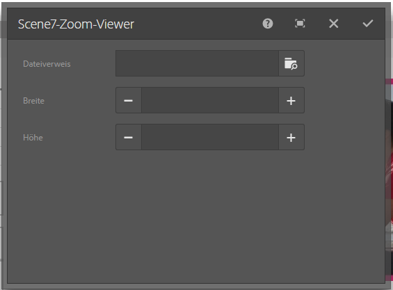
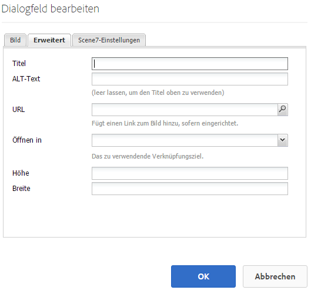

# Hinzufügen von Dynamic Media Classic-Funktionen zu Ihrer Seite{#adding-scene-features-to-your-page}

Adobe Dynamic Media Classic ist eine gehostete Lösung für die Verwaltung, Optimierung, Veröffentlichung und Bereitstellung von Rich-Media-Assets für Web-, Mobil-, E-Mail- und Internet-verbundene Anzeigen und Ausdrucke.

Sie können AEM Assets anzeigen, die in Dynamic Media Classic in verschiedenen Viewern veröffentlicht wurden:

* Zoom
* Flyout
* Video
* Bildvorlage
* Bild

Sie können digitale Assets direkt aus AEM in Dynamic Media Classic veröffentlichen und digitale Assets aus Dynamic Media Classic in AEM veröffentlichen.

In diesem Abschnitt wird beschrieben, wie Sie digitale Assets von AEM in Dynamic Media Classic veröffentlichen und umgekehrt. Die Viewer werden auch detailliert beschrieben. Informationen zum Konfigurieren von AEM für Dynamic Media Classic finden Sie unter [Integrieren von Dynamic Media Classic mit AEM](/help/sites-administering/scene7.md).

Siehe auch [Hinzufügen von Imagemaps](/help/assets/image-maps.md).

Weitere Informationen über die Arbeit mit Videokomponenten mit AEM finden Sie unter:

* [Video ](/help/sites-classic-ui-authoring/manage-assets-classic-s7-video.md)

>[!NOTE]
>
>Wenn Dynamic Media Classic-Assets nicht ordnungsgemäß angezeigt werden, stellen Sie sicher, dass Dynamic Media [disabled](/help/assets/config-dynamic.md#disabling-dynamic-media) und aktualisieren Sie dann die Seite.

## Manuelles Veröffentlichen in Dynamic Media Classic aus Assets {#manually-publishing-to-scene-from-assets}

Sie können digitale Assets in Dynamic Media Classic entweder über die Konsole &quot;Assets&quot;in der klassischen Benutzeroberfläche oder direkt über das Asset veröffentlichen.

>[!NOTE]
>
>AEM veröffentlicht asynchron in Dynamic Media Classic. Nachdem Sie auf **[!UICONTROL Veröffentlichen]** kann es mehrere Sekunden dauern, bis Ihr Asset in Dynamic Media Classic veröffentlicht wird.

### Veröffentlichen über die Asset-Konsole {#publishing-from-the-assets-console}

So veröffentlichen Sie in der Assets-Konsole in Dynamic Media Classic, wenn sich die Assets in einem Dynamic Media Classic-Zielordner befinden:

1. Klicken Sie in der klassischen AEM auf **[!UICONTROL Digitale Assets]** , um auf den Digital Asset Manager zuzugreifen.

1. Wählen Sie das Asset (oder die Assets) oder den Ordner aus dem Zielordner aus, den Sie in Dynamic Media Classic veröffentlichen möchten, klicken Sie mit der rechten Maustaste darauf und wählen Sie **[!UICONTROL In Dynamic Media Classic veröffentlichen]**. Alternativ können Sie **[!UICONTROL In Dynamic Media Classic veröffentlichen]** von **[!UICONTROL Instrumente]** Menü.

   

1. Wechseln Sie zu Dynamic Media Classic und überprüfen Sie, ob die Assets verfügbar sind.

   >[!NOTE]
   >
   >Wenn sich die Assets nicht in einem von Dynamic Media Classic synchronisierten Ordner befinden, **[!UICONTROL In Dynamic Media Classic veröffentlichen]** in beiden Menüs sichtbar, aber deaktiviert ist.

### Veröffentlichen über ein Asset {#publishing-from-an-asset}

Sie können ein Asset manuell veröffentlichen, solange sich dieses Asset im synchronisierten Ordner von Dynamic Media Classic befindet.

>[!NOTE]
>
>Wenn sich das Asset nicht im synchronisierten Ordner &quot;Dynamic Media Classic&quot;befindet, verknüpfen Sie **[!UICONTROL In Dynamic Media Classic veröffentlichen]** ist nicht verfügbar.

**So veröffentlichen Sie direkt über ein digitales Asset in Dynamic Media Classic**:

1. Klicken Sie in AEM auf **[!UICONTROL Digitale Assets]**, um auf den Digital Asset Manager zuzugreifen.

1. Doppelklicken Sie, um ein Asset zu öffnen.

1. Wählen Sie im Asset-Detailbereich **[!UICONTROL In Dynamic Media Classic veröffentlichen]**.

   

1. Der Link ändert sich zu **[!UICONTROL Wird veröffentlicht ...]** und dann zu **[!UICONTROL Veröffentlicht]**. Wechseln Sie zu Dynamic Media Classic und überprüfen Sie, ob das Asset verfügbar ist.

   >[!NOTE]
   >
   >Wenn das Asset nicht ordnungsgemäß in Dynamic Media Classic veröffentlicht wird, ändert sich der Link in **[!UICONTROL Veröffentlichung fehlgeschlagen]**. Wenn das Asset bereits in Dynamic Media Classic veröffentlicht wurde, lautet der Link **[!UICONTROL Erneutes Veröffentlichen in Dynamic Media Classic]**. Durch das erneute Veröffentlichen können Sie Änderungen an einem Asset in AEM vornehmen und es erneut veröffentlichen.

### Veröffentlichen von Assets außerhalb des CQ-Zielordners {#publishing-assets-from-outside-the-cq-target-folder}

Adobe empfiehlt, Assets nur aus Assets im Dynamic Media Classic-Zielordner in Dynamic Media Classic zu veröffentlichen. Wenn Sie jedoch Assets aus einem Ordner außerhalb des Zielordners hochladen müssen, können Sie dies dennoch tun, indem Sie sie in eine *Ad-hoc* Ordner in Dynamic Media Classic.

Konfigurieren Sie dazu die Cloud-Konfiguration für die Seite, auf der das Asset angezeigt wird. Anschließend fügen Sie eine Dynamic Media Classic-Komponente zur Seite hinzu und ziehen ein Asset per Drag-and-Drop auf die Komponente. Nachdem die Seiteneigenschaften für diese Seite festgelegt wurden, wird ein **[!UICONTROL In Dynamic Media Classic veröffentlichen]** angezeigt, wenn ausgewählte Trigger auf Dynamic Media Classic hochladen.

>[!NOTE]
>
>Assets, die sich im Ad-hoc-Ordner befinden, werden nicht im Dynamic Media Classic-Inhaltsbrowser angezeigt.

**So veröffentlichen Sie außerhalb des CQ-Zielordners befindliche Assets**:

1. Klicken Sie in AEM klassischen Benutzeroberfläche auf **[!UICONTROL Websites]** und navigieren Sie zur Webseite, zu der Sie ein digitales Asset hinzufügen möchten, das noch nicht in Dynamic Media Classic veröffentlicht wurde. (Es gelten normale Seitenübernahmeregeln.)

1. Klicken Sie im Sidekick auf die **[!UICONTROL Seite]** und klicken Sie auf **[!UICONTROL Seiteneigenschaften]**.

1. Klicken **[!UICONTROL Cloud Services] > [!UICONTROL Dienste hinzufügen] > [!UICONTROL Dynamic Media Classic (Scene7)]**.
1. Wählen Sie in der Dropdownliste Adobe Dynamic Media Classic die gewünschte Konfiguration aus und klicken Sie auf **[!UICONTROL OK]**.

   

1. Fügen Sie auf der Webseite eine Dynamic Media Classic (Scene7)-Komponente an der gewünschten Position auf der Seite hinzu.
1. Ziehen Sie in der Inhaltssuche ein digitales Asset zur Komponente. Sie sehen einen Link zu **[!UICONTROL Überprüfen des Dynamic Media Classic-Veröffentlichungsstatus]**.

   >[!NOTE]
   >
   >Wenn sich das digitale Asset im CQ-Zielordner befindet, ist kein Link zu **[!UICONTROL Überprüfen des Dynamic Media Classic-Veröffentlichungsstatus]** angezeigt. Die Assets werden einfach in der Komponente platziert.

   

1. Klicken **[!UICONTROL Überprüfen des Dynamic Media Classic-Veröffentlichungsstatus]**. Wenn das Asset nicht veröffentlicht wurde, veröffentlicht AEM das Asset in Dynamic Media Classic. Nach dem Upload befindet sich das Asset im Ad-hoc-Ordner. Standardmäßig befindet sich der Ad-hoc-Ordner im `name_of_the_company/CQ5_adhoc`. Sie können dies [bei Bedarf konfigurieren](#configuringtheadhocfolder).

   >[!NOTE]
   >
   >Wenn sich das Asset nicht in einem von Dynamic Media Classic synchronisierten Ordner befindet und der aktuellen Seite keine Dynamic Media Classic-Cloud-Konfiguration zugeordnet ist, schlägt der Upload fehl.

## Komponenten von Dynamic Media Classic (Scene7) {#scene-components}

Die folgenden Dynamic Media Classic-Komponenten sind in AEM verfügbar:

* Zoom
* Flyout (Zoom)
* Bildvorlage
* Bild
* Video

>[!NOTE]
>
>Diese Komponenten sind standardmäßig nicht verfügbar und müssen in **[!UICONTROL Design]** -Modus vor der Verwendung.

Nachdem sie verfügbar gemacht wurden in **[!UICONTROL Design]** -Modus können Sie die Komponenten wie jede andere AEM Ihrer Seite hinzufügen. Assets, die noch nicht in Dynamic Media Classic veröffentlicht wurden, werden in Dynamic Media Classic veröffentlicht, wenn sie sich in einem synchronisierten Ordner oder auf einer Seite befinden oder eine Dynamic Media Classic-Cloud-Konfiguration aufweisen.

### Benachrichtigung zum Ende der Lebensdauer von Flash-Viewern {#flash-viewers-end-of-life-notice}

Mit Wirkung vom 31. Januar 2017 hat Adobe Dynamic Media Classic offiziell die Unterstützung für die Flash-Viewer-Plattform eingestellt.

### Hinzufügen einer Dynamic Media Classic-Komponente zu einer Seite {#adding-a-scene-component-to-a-page}

Das Hinzufügen einer Dynamic Media Classic-Komponente zu einer Seite entspricht dem Hinzufügen einer Komponente zu einer beliebigen Seite. Dynamic Media Classic-Komponenten werden in den folgenden Abschnitten ausführlich beschrieben.

**So fügen Sie einer Seite in der klassischen Benutzeroberfläche eine Dynamic Media Classic-Komponente/einen Viewer hinzu**:

1. Öffnen Sie in AEM die Seite, auf der Sie die Dynamic Media Classic-Komponente hinzufügen möchten.

1. Wenn keine Dynamic Media Classic-Komponenten verfügbar sind, klicken Sie auf das Lineal im Sidekick, um **[!UICONTROL Design]** mode, click **[!UICONTROL Bearbeiten]** parsys und wählen Sie alle **[!UICONTROL Dynamic Media Classic]** Komponenten, um sie verfügbar zu machen.

1. Zurück zu **[!UICONTROL Bearbeiten]** durch Klicken auf den Stift im Sidekick.

1. Ziehen Sie eine Komponente aus dem **[!UICONTROL Dynamic Media Classic]** im Sidekick auf der Seite an der gewünschten Position.

1. Klicken Sie auf **[!UICONTROL Bearbeiten]**, um die Komponente zu öffnen.

1. Bearbeiten Sie die Komponente bei Bedarf und klicken Sie auf **[!UICONTROL OK]**, um die Änderungen zu speichern.

### Hinzufügen von interaktiven Anzeigeerlebnissen zu einer dynamischen Website {#adding-interactive-viewing-experiences-to-a-responsive-website}

Dynamisches Design für Ihre Assets bedeutet, dass Ihre Assets in Abhängigkeit ihrer Anzeigeposition angepasst werden. Responsives Design ermöglicht die effektive Anzeige derselben Assets auf mehreren Geräten.

**So fügen Sie ein interaktives Anwendererlebnis zu einer responsiven Website auf der klassischen Benutzeroberfläche hinzu**:

1. Melden Sie sich bei AEM an und stellen Sie sicher, dass Sie [konfigurierte Adobe Dynamic Media Classic Cloud Services](/help/sites-administering/scene7.md#configuring-scene-integration) und dass Dynamic Media Classic-Komponenten verfügbar sind.

   >[!NOTE]
   >
   >Wenn Dynamic Media Classic WCM-Komponenten nicht verfügbar sind, aktivieren Sie sie mit **[!UICONTROL Design] -Modus.

1. Ziehen Sie auf einer Website mit aktivierten Dynamic Media Classic-Komponenten eine **[!UICONTROL Bild]** -Ansicht auf der Seite angezeigt.
1. Bearbeiten Sie die Komponente und passen Sie die Haltepunkte im **[!UICONTROL Dynamic Media Classic-Einstellungen]** Registerkarte.

   

1. Bestätigen Sie, dass die Größe der Viewer dynamisch geändert wird und dass alle Interaktionen für Desktop-Computer, Tablets und Mobilgeräte optimiert sind.

### Gemeinsame Einstellungen für alle Dynamic Media Classic-Komponenten {#settings-common-to-all-scene-components}

Auch wenn sich die Konfigurationsoptionen unterscheiden, sind folgende Einstellungen für alle Dynamic Media Classic-Komponenten gleich:

* **[!UICONTROL Dateiverweis]**: Navigieren Sie zu einer Datei, die Sie referenzieren möchten. Der Dateiverweis zeigt die Asset-URL und nicht zwangsläufig die vollständige Dynamic Media Classic-URL, einschließlich der URL-Befehle und -Parameter. Das Hinzufügen von Dynamic Media Classic-URL-Befehlen und -Parametern ist in diesem Feld nicht möglich. Sie müssen über die entsprechende Funktionalität in der Komponente hinzugefügt werden.
* **[!UICONTROL Breite]**: Hiermit kann die Breite angepasst werden.
* **[!UICONTROL Höhe]**: Hiermit kann die Höhe angepasst werden.

Sie legen diese Konfigurationsoptionen fest, indem Sie beispielsweise beim Öffnen einer Dynamic Media Classic-Komponente auf eine-Komponente doppelklicken **[!UICONTROL Zoom]** component:

### Zoom {#zoom}

Die HTML5-Zoom-Komponente zeigt ein größeres Bild an, wenn Sie die Taste + drücken.

Das Asset verfügt unten über Zoomwerkzeuge. Klicken Sie auf **[!UICONTROL +]** zum Vergrößern. Klicken Sie auf **[!UICONTROL -]** zum Verkleinern. Klicken **[!UICONTROL x]** oder der Pfeil zum Zurücksetzen des Zooms bringt das Bild wieder in die Originalgröße zurück, als es importiert wurde. Klicken Sie auf die diagonalen Pfeile, um es im Vollbild anzuzeigen. Klicken Sie auf **[!UICONTROL Bearbeiten]**, um die Komponente zu konfigurieren. Mit dieser Komponente können Sie die [gemeinsamen Einstellungen für alle Dynamic Media Classic-Komponenten](#settings-common-to-all-scene-components) konfigurieren.

### Flyout {#flyout}

In der HTML5 Flyout-Komponente wird das Asset als geteilter Bildschirm angezeigt. Links wird das Asset in der angegebenen Größe angezeigt, rechts wird der Zoomteil angezeigt. Klicken Sie auf **[!UICONTROL Bearbeiten]**, um die Komponente zu konfigurieren. Mit dieser Komponente können Sie die [gemeinsamen Einstellungen für alle Dynamic Media Classic-Komponenten](/help/sites-administering/scene7.md#settingscommontoalldynamicmediaclassiccomponents) konfigurieren.

>[!NOTE]
>
>Wenn die Flyout-Komponente eine benutzerdefinierte Größe aufweist, wird diese benutzerdefinierte Größe verwendet und die responsive Einrichtung der Komponente deaktiviert.
>
>Wenn Ihre Flyout-Komponente die Standardgröße verwendet, die im [!UICONTROL Design] -Ansicht verwenden, wird die Standardgröße verwendet und die Komponente erstreckt sich, um die Seitenlayoutgröße mit der responsiven Einrichtung der Komponente anzupassen. Beachten Sie jedoch, dass es eine Einschränkung hinsichtlich der responsiven Einrichtung der Komponente gibt. Beim Verwenden der Flyout-Komponente mit dynamischer Einrichtung sollten Sie sie nicht mit vollständiger Seitendehnung verwenden. Andernfalls ragt das Flyout möglicherweise über den rechten Rand der Seite hinaus.

### Bild {#image}

Mit der Dynamic Media Classic-Komponente Bild können Sie Bildern Dynamic Media Classic-Funktionen hinzufügen, z. B. Dynamic Media Classic-Modifikatoren, Bild- oder Viewer-Vorgaben und Scharfzeichnen. Die Dynamic Media Classic-Bildkomponente ähnelt anderen Bildkomponenten in AEM mit speziellen Dynamic Media Classic-Funktionen. In diesem Beispiel wurde auf das Bild der Dynamic Media Classic-URL-Modifikator `&op_invert=1` angewendet.

**[!UICONTROL Titel, ALT-Text]**: Fügen Sie auf der Registerkarte [!UICONTROL Erweitert] einen Titel zum Bild und alternativen Text für die Benutzer hinzu, die Grafiken deaktiviert haben.

**[!UICONTROL URL, Öffnen in]**: Sie können ein Asset so einrichten, dass ein Link geöffnet wird. Legen Sie die **[!UICONTROL URL]** und **[!UICONTROL Öffnen in]** fest, um anzugeben, ob die Seite im selben Fenster oder in einem neuen Fenster geöffnet werden soll.

**[!UICONTROL Viewer-Vorgabe]**: Wählen Sie im Dropdown-Menü eine vorhandene Viewer-Vorgabe aus. Wenn die gewünschte Viewer-Vorgabe nicht sichtbar ist, müssen Sie sie möglicherweise sichtbar machen. Siehe [Verwalten von Viewer-Vorgaben](/help/assets/managing-viewer-presets.md). Es ist nicht möglich, eine Viewer-Vorgabe auszuwählen, wenn Sie eine Bildvorgabe verwenden, und umgekehrt.

**[!UICONTROL Dynamic Media Classic-Konfiguration]** - Wählen Sie die Dynamic Media Classic-Konfiguration aus, die Sie zum Abrufen aktiver Bildvorgaben aus dem Scene7 Publishing System verwenden möchten.

**[!UICONTROL Bildvorgabe]**: Wählen Sie im Dropdown-Menü eine vorhandene Bildvorgabe aus. Wenn die gewünschte Bildvorgabe nicht sichtbar ist, müssen Sie sie möglicherweise sichtbar machen. Siehe [Verwalten von Bildvorgaben](/help/assets/managing-image-presets.md). Es ist nicht möglich, eine Viewer-Vorgabe auszuwählen, wenn Sie eine Bildvorgabe verwenden, und umgekehrt.

**[!UICONTROL Ausgabeformat]**: Wählen Sie das Ausgabeformat des Bildes aus, beispielsweise jpeg. In Abhängigkeit des von Ihnen ausgewählten Ausgabeformats stehen Ihnen möglicherweise zusätzliche Konfigurationsoptionen zur Verfügung. Siehe [Verwalten von Bildvorgaben](/help/assets/managing-image-presets.md).

**[!UICONTROL Scharfzeichnen]**: Wählen Sie aus, wie Sie das Bild scharfzeichnen möchten. Das Scharfzeichnen wird ausführlich beschrieben unter [*Best Practices für Bildqualität und Scharfzeichnen in Adobe Dynamic Media Classic*](/help/assets/assets/sharpening_images.pdf).

**[!UICONTROL URL-Modifikatoren]**: Sie können Bildeffekte ändern, indem Sie zusätzliche Dynamic Media Classic-Bildbefehle bereitstellen. Diese werden unter [Verwalten von Bildvorgaben](/help/assets/managing-image-presets.md) und [Befehlsreferenz](https://experienceleague.adobe.com/docs/dynamic-media-developer-resources/image-serving-api/image-serving-api/http-protocol-reference/command-reference/c-command-reference.html?lang=de).

**[!UICONTROL Breakpoints]**: Wenn Ihre Website responsiv ist, können Sie die Breakpoints anpassen. Haltepunkte müssen durch Kommas getrennt werden `,`.

### Bildvorlage {#image-template}

[Dynamic Media Classic-Bildvorlagen](https://experienceleague.adobe.com/docs/dynamic-media-classic/using/template-basics/quick-start-template-basics.html?lang=de#template-basics) sind mehrschichtige Photoshop-Inhalte, die in Dynamic Media Classic importiert wurden, wo Inhalte und Eigenschaften für Variabilität parametrisiert wurden. Die **[!UICONTROL Bildvorlage]** -Komponente ermöglicht das Importieren von Bildern und das dynamische Ändern des Texts in AEM. Zusätzlich können Sie die Komponente **[!UICONTROL Bildvorlage]** dahingehend konfigurieren, dass sie Werte aus dem Client-Kontext übernimmt, damit das Bild jedem Benutzer personalisiert angezeigt wird.

Klicken Sie auf **[!UICONTROL Bearbeiten]**, um die Komponente zu konfigurieren. Sie können [Einstellungen, die für alle Dynamic Media Classic-Komponenten gelten](/help/sites-administering/scene7.md#settingscommontoalldynamicmediaclassicscomponents) sowie anderen in diesem Abschnitt beschriebenen Einstellungen.

**[!UICONTROL Dateiverweis, Breite, Höhe]** - Siehe für alle Dynamic Media Classic-Komponenten gemeinsame Einstellungen.

>[!NOTE]
>
>Dynamic Media Classic-URL-Befehle und -Parameter können nicht direkt zur Dateiverweis-URL hinzugefügt werden. Sie können nur auf der Komponenten-Benutzeroberfläche im Bedienfeld **[!UICONTROL Parameter]** definiert werden.

**[!UICONTROL Titel, Alternativtext]** Im [!UICONTROL Dynamic Media Classic-Bildvorlage] hinzufügen, fügen Sie einen Titel zum Bild und alternativen Text für die Benutzer hinzu, deren Grafiken deaktiviert sind.

**[!UICONTROL URL, Öffnen in]** Sie können ein Asset in festlegen, um einen Link zu öffnen. Legen Sie die **[!UICONTROL URL]** fest. Geben Sie in **[!UICONTROL Öffnen in]** an, ob der Link im selben oder einem neuen Fenster geöffnet werden soll.

**[!UICONTROL Parameterbereich]** Beim Importieren eines Bildes werden die Parameter vorab mit Informationen aus dem Bild gefüllt. Wenn kein Inhalt vorhanden ist, der dynamisch geändert werden kann, ist dieses Fenster leer.

#### Dynamisches Ändern von Text {#changing-text-dynamically}

Geben Sie zum dynamischen Ändern des Texts neuen Text in die Felder ein und klicken Sie auf **[!UICONTROL OK]**. In diesem Beispiel lautet der **[!UICONTROL Preis]** 50 $ und der Versand kostet 0,99 $.

Der Text im Bild ändert sich. Sie können den Text auf den ursprünglichen Wert zurücksetzen, indem Sie neben dem Feld auf **[!UICONTROL Zurücksetzen]** klicken.

#### Ändern von Text zum Berücksichtigen des Werts eines Clientkontextwerts {#changing-text-to-reflect-the-value-of-a-client-context-value}

Um ein Feld mit einem Client-Kontextwert zu verknüpfen, klicken Sie auf **[!UICONTROL Auswählen]** zum Öffnen des Client-Kontextmenüs, wählen Sie den Client-Kontext aus und klicken Sie auf **[!UICONTROL OK]**. In diesem Beispiel ändert sich der Name auf Grundlage der Verknüpfung des Namens mit dem formatierten Namen im Profil.

Der Text berücksichtigt den Namen des aktuell angemeldeten Benutzers. Sie können den Text auf den ursprünglichen Wert zurücksetzen, indem Sie neben dem Feld auf **[!UICONTROL Zurücksetzen]** klicken.

#### Verknüpfen der Dynamic Media Classic-Bildvorlage {#making-the-scene-image-template-a-link}

**So erstellen Sie einen Link zur Dynamic Media Classic-Bildvorlage**:

1. Klicken Sie auf der Seite mit der Dynamic Media Classic-Bildvorlagenkomponente auf **[!UICONTROL Bearbeiten]**.
1. Geben Sie im Feld **[!UICONTROL URL]** die URL ein, zu der Benutzer wechseln, wenn sie auf das Bild klicken. Wählen Sie im Feld **[!UICONTROL Öffnen in]** aus, ob das Ziel (in einem neuen oder im selben Fenster) geöffnet werden soll.

   

1. Klicken Sie auf **[!UICONTROL OK]**.

### Komponente „Video“ {#video-component}

Die Dynamic Media Classic-Komponente **[!UICONTROL Video]** (verfügbar über den Dynamic Media Classic-Abschnitt im Sidekick) verwendet die Geräte- und Bandbreitenerkennung, damit auf jedem Bildschirm das richtige Video bereitgestellt wird. Bei dieser Komponente handelt es sich um einen HTML5-Video-Player. Es ist ein einzelner Viewer, der kanalübergreifend verwendet werden kann.

Er kann für adaptive Videosets, ein einzelnes MP4-Video oder ein einzelnes F4V-Video verwendet werden.

Weitere Informationen darüber, wie Videos mit Dynamic Media Classic-Integration funktionieren, finden Sie unter [Video](/help/sites-classic-ui-authoring/manage-assets-classic-s7-video.md). Außerdem können Sie sehen, wie [die **Dynamic Media Classic-Video** Komponente im Vergleich zur Foundation **Video** component](/help/sites-classic-ui-authoring/manage-assets-classic-s7-video.md).

### Bekannte Einschränkungen für die Videokomponente {#known-limitations-for-the-video-component}

Adobe DAM und WCM zeigen, ob ein Mastervideo hochgeladen wurde. Sie zeigen diese Proxy-Assets nicht an:

* Dynamic Media Classic-kodierte Ausgabedarstellungen
* Adaptive Dynamic Media Classic-Videosets

Wenn Sie ein adaptives Videoset mit der Dynamic Media Classic-Videokomponente verwenden, müssen Sie die Größe der Komponente ändern, damit sie zu den Abmessungen des Videos passen.

## Dynamic Media Classic-Inhaltsbrowser {#scene-content-browser}

Mit dem Dynamic Media Classic-Inhaltsbrowser können Sie Inhalte aus Dynamic Media Classic direkt in AEM anzeigen. Wählen Sie für den Zugriff auf den Inhaltsbrowser in der Inhaltssuche die Option **[!UICONTROL Dynamic Media Classic]** auf der Touch-optimierten Benutzeroberfläche oder das Symbol **[!UICONTROL S7]** auf der klassischen Benutzeroberfläche aus. Die Funktionalität ist auf den beiden Benutzeroberflächen identisch.

Wenn Sie über mehrere Konfigurationen verfügen, zeigt AEM standardmäßig die [Standardkonfiguration](/help/sites-administering/scene7.md#configuring-a-default-configuration) an. Sie können unterschiedliche Kategorien direkt im Dynamic Media Classic-Inhaltsbrowser im Dropdown-Menü auswählen.

>[!NOTE]
>
>* Im Ad-hoc-Ordner befindliche Assets werden nicht im Dynamic Media Classic-Inhaltsbrowser angezeigt.
>* Wenn [Sichere Vorschau](/help/sites-administering/scene7.md#configuring-the-state-published-unpublished-of-assets-pushed-to-scene) aktiviert ist, werden in Dynamic Media Classic veröffentlichte und nicht veröffentlichte Assets im Dynamic Media Classic-Inhaltsbrowser angezeigt.
>* Wenn Sie **[!UICONTROL Dynamic Media Classic]** oder **[!UICONTROL S7]** -Symbol als Option im Inhaltsbrowser verwenden, müssen Sie [Dynamic Media Classic für die Verwendung mit AEM konfigurieren](/help/sites-administering/scene7.md).
>
>* Für Videos unterstützt der Dynamic Media Classic-Inhaltsbrowser Folgendes:
>
>* Adaptive Videosets: Container von allen für die bildschirmübergreifende optimierte Wiedergabe erforderlichen Videoausgabedarstellungen
>* Einzelnes MP4-Video
>* Einzelnes F4V-Video

### Durchsuchen von Inhalt auf der klassischen Benutzeroberfläche {#browsing-content-in-the-classic-ui}

Durchsuchen von Inhalten in Dynamic Media Classic durch Klicken auf **[!UICONTROL S7]** Registerkarte.

Sie können die Konfiguration, auf die Sie zugreifen, ändern, indem Sie die Konfiguration auswählen. Die Ordner ändern sich je nach ausgewählter Konfiguration.

Wie mit der Inhaltssuche für Assets können Sie nach Assets suchen und Ergebnisse filtern. Im Gegensatz zur Asset-Suche **[!UICONTROL beginnt]** der Dateiname jedoch beim Eingeben eines Keywords auf der Registerkarte *S7* mit dem von Ihnen eingegebenen String, anstatt dass das Keyword im Dateinamen *enthalten* ist.

Standardmäßig werden Assets nach Dateiname angezeigt. Sie können Ergebnisse auch nach Asset-Typ filtern.

>[!NOTE]
>
>Für Videos unterstützt der Dynamic Media Classic-Inhaltsbrowser von WCM Folgendes:
>
>* Adaptive Videosets: Container von allen für die bildschirmübergreifende optimierte Wiedergabe erforderlichen Videoausgabedarstellungen
>* Einzelnes MP4-Video
>* Einzelnes F4V-Video
>

### Suchen nach Dynamic Media Classic-Assets mit dem Inhaltsbrowser {#searching-for-scene-assets-with-the-content-browser}

Die Suche nach Dynamic Media Classic-Assets verläuft ähnlich wie die Suche nach AEM Assets. Bei der Suche wird Ihnen jedoch im Dynamic Media Classic-System eine Remote-Ansicht der Assets angezeigt, anstatt sie direkt in AEM zu importieren.

Sie können die klassische oder Touch-optimierte Benutzeroberfläche verwenden, um Assets anzuzeigen und nach ihnen zu suchen. In Abhängigkeit von der Oberfläche unterscheidet sich die Art und Weise der Suche etwas.

Wenn Sie auf einer der Benutzeroberflächen suchen, können Sie nach den folgenden Kriterien filtern (wird hier in der Touch-optimierten Benutzeroberfläche gezeigt):

**[!UICONTROL Keywords eingeben]**: Sie können Assets nach Namen suchen. Bei der Suche entsprechen die von Ihnen eingegebenen Keywords dem Beginn des Dateinamens. Zum Beispiel führt die Eingabe des Worts „schwimmen“ dazu, dass nach Asset-Dateinamen gesucht wird, die mit diesen Buchstaben in dieser Reihenfolge beginnen. Drücken Sie die Eingabetaste, nachdem Sie den Begriff eingegeben haben, um nach dem Asset zu suchen.

**[!UICONTROL Ordner/Pfad]** - Der Name des angezeigten Ordners basiert auf der von Ihnen ausgewählten Konfiguration. Sie können niedrigere Ebenen anzeigen, indem Sie auf das Ordnersymbol klicken, einen Unterordner auswählen und dann auf das Häkchen klicken, um ihn auszuwählen.

Wenn Sie ein Keyword eingeben und einen Ordner auswählen, durchsucht AEM diesen Ordner und die zugehörigen Unterordner. Wenn Sie jedoch bei der Suche keine Keywords eingeben, wird durch die Auswahl des Ordners das Asset nur in diesem Ordner angezeigt und nicht in Unterordnern.

Standardmäßig durchsucht AEM den ausgewählten Ordner und alle Unterordner.

**[!UICONTROL Asset-Typ]** Wählen Sie Dynamic Media Classic aus, um Dynamic Media Classic-Inhalte zu durchsuchen. Diese Option ist nur verfügbar, wenn Sie Dynamic Media Classic bereits konfiguriert haben.

**[!UICONTROL Konfiguration]** Wenn mehrere Dynamic Media Classic-Konfigurationen in definiert sind: [!UICONTROL Cloud Services]können Sie sie hier auswählen. Der Ordner ändert sich anhand der von Ihnen ausgewählten Konfiguration.

**[!UICONTROL Asset-Typ]** Im Dynamic Media Classic-Browser können Sie Ergebnisse filtern, um Folgendes einzuschließen: Bilder, Vorlagen, Videos und adaptive Videosets. Wenn Sie keinen Asset-Typ auswählen, durchsucht AEM standardmäßig alle Asset-Typen.

>[!NOTE]
>
>* Beim Durchsuchen eines Videos suchen Sie nach einer einzelnen Ausgabedarstellung. Die Ergebnisse geben die ursprüngliche (nur &amp;ast;.mp4) und die kodierte Ausgabedarstellung zurück.
>* Bei der Suche nach einem adaptiven Videoset durchsuchen Sie den Ordner und alle Unterordner, jedoch nur, wenn Sie der Suche ein Keyword hinzugefügt haben. Wenn Sie kein Keyword hinzugefügt haben, durchsucht AEM nicht die Unterordner.
>

**[!UICONTROL Veröffentlichungsstatus]** Sie können nach Assets basierend auf dem Veröffentlichungsstatus filtern: [!UICONTROL Veröffentlicht] oder [!UICONTROL Veröffentlichung rückgängig gemacht]. Wenn Sie keine [!UICONTROL Veröffentlichungsstatus]AEM durchsucht standardmäßig alle Veröffentlichungsstatus.

