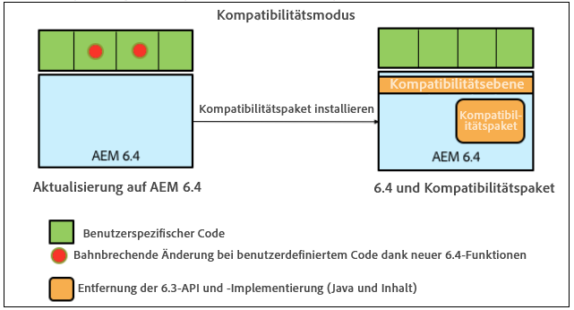
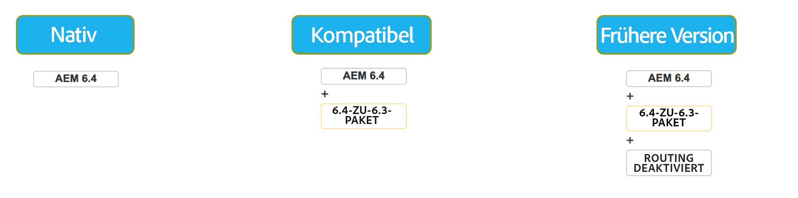

# Abwärtskompatibilität in AEM 6.4{#backward-compatibility-in-aem}

>[!CAUTION]
>
>AEM 6.4 hat das Ende der erweiterten Unterstützung erreicht und diese Dokumentation wird nicht mehr aktualisiert. Weitere Informationen finden Sie in unserer [technische Unterstützung](https://helpx.adobe.com/de/support/programs/eol-matrix.html). Unterstützte Versionen suchen [here](https://experienceleague.adobe.com/docs/?lang=de).

## Übersicht {#overview}

>[!NOTE]
>
>Eine Liste der Inhalts- und Konfigurationsänderungen, die nicht unter das Kompatibilitätspaket fallen, finden Sie unter [Repository-Neustrukturierung in AEM 6.4](/help/sites-deploying/repository-restructuring.md).

In AEM 6.4 wurden alle Funktionen mit Rückwärtskompatibilität entwickelt.

In den meisten Fällen sollten Kunden, die mit AEM 6.3 arbeiten, weder ihren Code noch ihre Anpassungen ändern müssen, wenn sie die Aktualisierung durchführen. Für Kunden von AEM 6.1 und 6.2 gibt es keine zusätzlichen Änderungen, die grundlegend sind, als dies bei einem Upgrade auf 6.3 der Fall wäre.

Für Ausnahmen, in denen Funktionen nicht abwärtskompatibel gehalten werden konnten, kann die Abwärtskompatibilität für Bundles und Inhalte erreicht werden, indem ein Kompatibilitätspaket für 6.3 installiert wird (weitere Informationen dazu, wo Sie herunterladen können, finden Sie unten). Dieses Kompatibilitätspaket stellt die Kompatibilität für Anwendungen wieder her, die mit AEM 6.3 kompatibel sind.

Mit dem Kompatibilitätspaket können Sie AEM im Kompatibilitätsmodus ausführen und die benutzerdefinierte Entwicklung für neue AEM Funktionen verschieben:

>[!NOTE]
>
>Bitte beachten Sie, dass das Kompatibilitätspaket nur eine Zwischenlösung ist, um die für die Kompatibilität mit AEM 6.4 erforderliche Entwicklung aufzuschieben. Es wird nur als letzte Option empfohlen, falls Sie Kompatibilitätsprobleme nicht direkt nach der Aktualisierung durch Eigenentwicklungen beheben können. Es wird dringend empfohlen, in den nativen Modus zu wechseln und das Kompatibilitätspaket zu deinstallieren, sobald Sie sich für eine 6.4-basierte benutzerdefinierte Entwicklung entscheiden und die vollständige 6.4-Funktionalität nutzen.

Das Kompatibilitätspaket umfasst zwei Modi: **Routing aktiviert** und **Routing deaktiviert**.

Dadurch kann AEM 6.4 in drei Modi ausgeführt werden:

**Nativer Modus:**

Der native Modus richtet sich an Kunden, die alle neuen Funktionen von AEM 6.4 nutzen möchten und bereit sind, einige Entwicklungsschritte vorzunehmen, damit ihre Anpassungen mit allen neuen Funktionen funktionieren.

Dies bedeutet, dass Sie möglicherweise sofort nach der Aktualisierung Anpassungen in Ihrer Anwendung vornehmen müssen.

**Kompatibilitätsmodus: Kompatibilitätspaket mit aktiviertem Routing installiert**

Der Kompatibilitätsmodus eignet sich für Kunden, die Benutzeroberflächen anpassen, die nicht abwärtskompatibel sind. Dies ermöglicht AEM Ausführung im Kompatibilitätsmodus und verzögert die benutzerdefinierte Entwicklung, die für neue AEM Funktionen erforderlich ist, die nicht mit einigen Ihrem benutzerdefinierten Code kompatibel sind.

**Legacy-Modus: Kompatibilitätspaket mit deaktiviertem Routing installiert**

Der alte Modus richtet sich an Kunden mit benutzerdefinierten Schnittstellen, die auf veraltetem oder veraltetem Code aus AEM basieren, der im Kompatibilitätspaket entfernt wurde.

## Einrichtung {#how-to-set-up}

Das AEM 6.3-Kompatibilitätspaket kann mit Package Manager als Paket installiert werden. Sie können die [AEM 6.3-Kompatibilitätspaket von der Softwareverteilung](https://experience.adobe.com/#/downloads/content/software-distribution/en/aem.html?package=/content/software-distribution/en/details.html/content/dam/aem/public/adobe/packages/cq640/compatpack/aem-compat-cq64-to-cq63) Site.

Sobald das Kompatibilitätspaket installiert wurde, können Sie das Routing über einen Schalter in der OSGi-Konfiguration aktivieren oder deaktivieren:

Sobald das Kompatibilitätspaket installiert und konfiguriert wurde, werden die Funktionen basierend auf dem ausgewählten Kompatibilitätsmodus verwendet.
