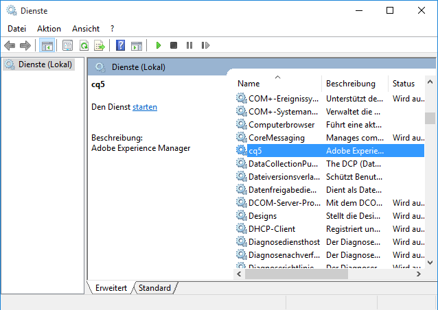
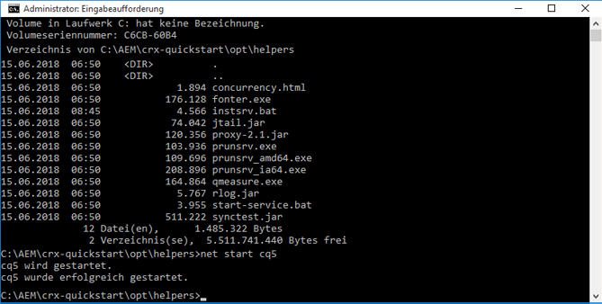
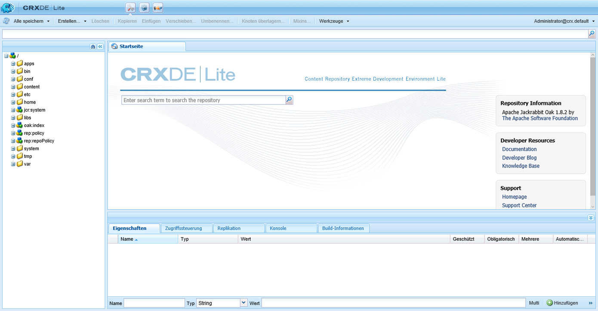

# Benutzerdefinierte eigenständige Installation{#custom-standalone-install}

>[!CAUTION]
>
>AEM 6.4 hat das Ende der erweiterten Unterstützung erreicht und diese Dokumentation wird nicht mehr aktualisiert. Weitere Informationen finden Sie in unserer [technische Unterstützung](https://helpx.adobe.com/de/support/programs/eol-matrix.html). Unterstützte Versionen suchen [here](https://experienceleague.adobe.com/docs/?lang=de).

In diesem Abschnitt wird beschrieben, welche Optionen bei der Installation einer AEM-Standalone-Instanz verfügbar sind. Sie können auch [Speicherelemente](/help/sites-deploying/storage-elements-in-aem-6.md) für weitere Informationen zur Auswahl des Backend-Speichertyps nach der Neuinstallation von AEM 6.

## Ändern der Anschlussnummer durch Umbenennen der Datei {#changing-the-port-number-by-renaming-the-file}

Der Standardport für AEM lautet 4502. Wenn dieser Port nicht verfügbar ist oder bereits verwendet wird, wird Quickstart automatisch so konfiguriert, dass die erste der folgenden verfügbaren Portnummern verwendet wird: 4502, 8080, 8081, 8082, 8083, 8084, 8085, 8888, 9362, `<random>`.

Sie können die Portnummer auch festlegen, indem Sie die Quickstart-JAR-Datei umbenennen, sodass der Dateiname die Portnummer enthält. Beispiel: `cq5-publish-p4503.jar` oder `cq5-author-p6754.jar`.

Beachten Sie beim Umbenennen der Quickstart-JAR-Datei die folgenden Regeln:

* Wenn Sie die Datei umbenennen, muss sie mit `cq;` beginnen, wie in `cq5-publish-p4503.jar`.

* Es wird empfohlen, *always* Setzen Sie der Portnummer -p voran. wie in cq5-publish-p4503.jar oder cq5-author-p6754.jar.

>[!NOTE]
>
>Dadurch soll sichergestellt werden, dass Sie sich nicht Gedanken darüber machen müssen, ob die Regeln zum Extrahieren der Portnummer erfüllt sind:
>
>* die Portnummer muss 4 oder 5 Stellen betragen
>* Diese Ziffern müssen nach einem Bindestrich stehen
>* Sollten sich andere Ziffern im Dateinamen befinden, muss die Portnummer mit dem Präfix `-p` versehen werden.
>* Das Präfix „cq5“ am Anfang des Dateinamens wird ignoriert.
>


>[!NOTE]
>
>Sie können die Portnummer auch ändern, indem Sie die Option `-port` im Startbefehl verwenden.

## Ausführungsmodi {#run-modes}

Mit **Ausführungsmodi** können Sie Ihre AEM-Instanz auf einen bestimmten Zweck ausrichten, zum Beispiel auf Erstellung und Veröffentlichung, Tests, Entwicklung, Intranet usw. Diese Modi ermöglichen es Ihnen zudem, die Nutzung von Beispielinhalten zu steuern. Diese Beispielinhalte werden vor dem Erstellen von Quickstart definiert und können Pakete, Konfigurationen usw. enthalten. Dies kann vor allem für produktionsbereite Installationen nützlich sein, wenn Sie möchten, dass Ihre Installation schlank und frei von Beispielinhalten ist. Weitere Informationen finden Sie unter:

* [Ausführungsmodi](/help/sites-deploying/configure-runmodes.md)

## Hinzufügen eines Dateiinstallationsanbieters {#adding-a-file-install-provider}

Standardmäßig wird der Ordner `crx-quickstart/install` auf Dateien überwacht.\
Dieser Ordner existiert nicht, kann jedoch einfach beim Ausführen erstellt werden.

Wenn Bundles, Konfigurationen oder Inhaltspakete in diesem Verzeichnis abgelegt werden, werden diese automatisch registriert und installiert. Wenn sie entfernt werden, erfolgt die Deinstallation.\
Dies stellt eine andere Möglichkeit dar, Bundles, Inhaltspakete oder Konfigurationen in das Repository aufzunehmen.

Dies ist besonders für verschiedene Anwendungsfälle interessant:

* Während der Entwicklung kann es einfacher sein, etwas in das Dateisystem zu setzen.
* Wenn etwas schiefgeht, sind die Web-Konsole und das Repository nicht erreichbar. Damit können Sie zusätzliche Bundles in dieses Verzeichnis einfügen und sie sollten installiert werden.
* Der Ordner `crx-quickstart/install` kann erstellt werden, bevor der Schnellstart gestartet wird, und es können zusätzliche Pakete darin abgelegt werden.

>[!NOTE]
>
>Weitere Informationen und Beispiele finden Sie in [So installieren Sie CRX-Pakete automatisch beim Serverstart](https://helpx.adobe.com/de/experience-manager/kb/HowToInstallPackagesUsingRepositoryInstall.html).

## Installieren und Starten von Adobe Experience Manager as a Windows Service {#installing-and-starting-adobe-experience-manager-as-a-windows-service}

>[!NOTE]
>
>Stellen Sie sicher, dass Sie die folgenden Schritte ausführen, während Sie als Administrator angemeldet sind, oder starten/führen Sie diese Schritte mit dem **Ausführen als Administrator** Kontextmenüauswahl.
>
>Die Anmeldung als Benutzer mit Administratorrechten erfolgt über **unzureichend**. Wenn Sie beim Durchführen dieser Schritte nicht als Admin angemeldet sind, erhalten Sie Fehler des Typs **Zugriff verweigert**.

So installieren und starten Sie AEM als Windows-Dienst:

1. Öffnen Sie die Datei crx-quickstart\opt\helpers\instsrv.bat in einem Texteditor.
1. Wenn Sie einen Windows-Server mit 64 Bit konfigurieren, ersetzen Sie, abhängig vom verwendeten Betriebssystem, alle Instanzen von „prunsrv“ durch einen der folgenden Befehle:

   * prunsrv_amd64
   * prunsrv_ia64

   Dieser Befehl ruft das passende Skript auf, das den Windows-Service-Daemon in der 64-Bit-Version von Java statt der 32-Bit-Variante startet.

1. Verhindern Sie, dass der Vorgang sich in mehr als einen Prozess aufspaltet, indem Sie die maximale Heap-Größe und die PermGen-JVM-Parameter erhöhen. Suchen Sie nach dem Befehl `set jvm_options` und legen Sie den Wert wie folgt fest:

   `set jvm_options=-XX:MaxPermSize=256M;-Xmx1792m`

1. Öffnen Sie die Eingabeaufforderung, ändern Sie das aktuelle Verzeichnis zum Ordner „crx-quickstart/opt/helpers“ der AEM-Installation und geben Sie den folgenden Befehl ein, um den Dienst zu erstellen:

   `instsrv.bat cq5`

   Überprüfen Sie, ob der Dienst erstellt wurde, indem Sie in der Systemsteuerung „Verwaltung“ > „Dienste“ auswählen oder `start services.msc` in der Eingabeaufforderung eingeben. Der cq5-Dienst wird in der Liste angezeigt.

1. Starten Sie den Dienst, indem Sie einen der folgenden Schritte ausführen:

   * Klicken Sie im Control Panel &quot;Services&quot;auf cq5 und klicken Sie auf Start.

   

   * Geben Sie in der Befehlszeile „net start cq5“ ein.

   

1. Windows zeigt an, dass der Dienst ausgeführt wird. AEM wird gestartet und die ausführbare Datei prunsrv wird im Task Manager angezeigt. Navigieren Sie in Ihrem Webbrowser zu AEM, beispielsweise `http://localhost:4502`, um mit der Nutzung von AEM zu beginnen.

   

>[!NOTE]
>
>Die Eigenschaftswerte in der Datei &quot;instsrv.bat&quot;werden beim Erstellen des Windows-Dienstes verwendet. Wenn Sie die Eigenschaftswerte in instsrv.bat bearbeiten, müssen Sie den Dienst deinstallieren und dann neu installieren.

>[!NOTE]
>
>Wird AEM als Service installiert, müssen Sie über den Configuration Manager den absoluten Pfad für das Protokollverzeichnis unter `com.adobe.xmp.worker.files.ncomm.XMPFilesNComm` angegeben.

Deinstallieren Sie den Dienst, indem Sie entweder in der Systemsteuerung unter **Dienste** auf **Beenden** klicken oder in einer Befehlszeile zum Ordner navigieren und `instsrv.bat -uninstall cq5` eingeben. Der Dienst wird in der Systemsteuerung unter **Dienste** aus der Liste entfernt oder verschwindet in der Eingabeaufforderung aus der Liste, wenn Sie `net start` eingeben.

## Neudefinieren des Speicherorts für das temporäre Arbeitsverzeichnis {#redefining-the-location-of-the-temporary-work-directory}

Der Standardpfad für den temporären Ordner des Java-Computers ist `/tmp`. AEM greift ebenfalls auf diesen Ordner zurück, etwa beim Erstellen von Paketen.

Wenn Sie den Speicherort des temporären Ordners ändern möchten (z. B. wenn Sie ein Verzeichnis mit mehr freiem Speicherplatz benötigen), definieren Sie eine `<new-tmp-path>` durch Hinzufügen des JVM-Parameters:

`-Djava.io.tmpdir="/<new-tmp-path>"`

entweder zu:

* der Befehlszeile zum Serverstart oder
* den Umgebungsparameter CQ_JVM_OPTS im Serverctl- oder Startskript

## Weitere in der Schnellstartdatei verfügbare Optionen {#further-options-available-from-the-quickstart-file}

Weitere Optionen und Konventionen zur Umbenennung sind in der Schnellstart-Hilfedatei beschrieben, die über die Option „-help“ aufgerufen werden kann. Geben Sie Folgendes ein, um auf die Hilfe zuzugreifen:

* `java -jar cq5-<version>.jar -help`

```shell
Loading quickstart properties: default
Loading quickstart properties: instance
Setting properties from filename '/Users/Desktop/AEM/cq-quickstart-5.6.0.jar'
--------------------------------------------------------------------------------
Adobe Experience Manager Quickstart (build 20130129)                            
--------------------------------------------------------------------------------
Usage:                                                                          
 Use these options on the Quickstart command line.                              
--------------------------------------------------------------------------------

-help (--help,-h)
         Show this help message                                                 
-quickstart.server.port (-p,-port) <port>
         Set server port number                                                 
-contextpath (-c,-org.apache.felix.http.context_path) <contextpath>
         Set context path                                                       
-debug <port>
         Enable Java Debugging on port number; forces forking                   
-gui 
         Show GUI if running on a terminal                                      
-nobrowser (-quickstart.nobrowser)
         Do not open browser at startup                                         
-unpack
         Unpack installation files only, do not start the server (implies       
         -verbose)                                                              
-v (-verbose)
         Do not redirect stdout/stderr to files and do not close stdin          
-nofork
         Do not fork the JVM, even if not running on a console                  
-fork
         Force forking the JVM if running on a console, using recommended       
         default memory settings for the forked JVM.                            
-forkargs <args> [<args> ...]
         Additional arguments for the forked JVM, defaults to '-Xmx1024m        
         -XX:MaxPermSize=256m '.  Use -- to specify values starting with -,     
         example: '-forkargs -- -server'                                        
-a (--interface) <interface>
         Optional IP address (interface) to bind to                             
-pt <string>
         Process type (main/fork) - do not use directly, used when forking a    
         process                                                                
-r <string> [<string> [<string> [<string> [<string> [<string> [<string> [<string> [<string> [<string>]]]]]]]]]
         Runmode(s) - Use this to define the run mode(s)                        
-b <string>
         Base folder - defines the path under which the quickstart work folder  
         is created                                                             
-low-mem-action <string>
         Low memory action - what to do if memory is insufficient at startup    
-use-control-port
         Start a control port                                                   
-ll <level>
         Define launchpad log level (1 = error...4 = debug)                     
--------------------------------------------------------------------------------
Quickstart filename options                                                     
--------------------------------------------------------------------------------
Usage:                                                                          
 Rename the jar file, including one of the patterns shown below, to set the     
corresponding option. Command-line options have priority on these filename      
patterns.                                                                       
--------------------------------------------------------------------------------

-NNNN
         Include -NNNN.jar or -pNNNN in the renamed jar filename to run on port 
         NNNN, for example: quickstart-8085.jar                                 
-nobrowser
         Include -nobrowser in the renamed jar filename to avoid opening the    
         browser at startup, example: quickstart-nobrowser-8085.jar             
-publish
         Include -publish in the renamed jar filename to run cq5 in "publish"   
         mode, example: cq5-publish-7502.jar                                    
--------------------------------------------------------------------------------
The license.properties file
--------------------------------------------------------------------------------
  The license.properties file stores licensing information, created from the    
  licensing form displayed on first startup and stored in the folder from where 
  Quickstart is run.                                                            
--------------------------------------------------------------------------------
Log files
--------------------------------------------------------------------------------
  Once Quickstart has been unpacked and started, log files can be found under   
  ./crx-quickstart/logs.                                                        
--------------------------------------------------------------------------------
```

## Installieren von AEM in der Amazon EC2-Umgebung {#installing-aem-in-the-amazon-ec-environment}

Wenn Sie AEM in einer Amazon Elastic Compute Cloud (EC2)-Instanz installieren und sowohl die Autoren- als auch die Veröffentlichungsinstanz in der EC2-Instanz installieren, wird die Autoreninstanz ordnungsgemäß installiert, indem Sie das Verfahren zum Installieren von befolgen [Installieren einer Instanz von AEM](/help/sites-deploying/custom-standalone-install.md); Die Veröffentlichungsinstanz wird jedoch zur Autoreninstanz.

Bevor Sie die Veröffentlichungsinstanz in Ihrer EC2-Umgebung installieren, gehen Sie wie folgt vor:

1. Entpacken Sie die JAR-Datei für die Veröffentlichungsinstanz, bevor Sie die Instanz zum ersten Mal starten. Verwenden Sie zum Entpacken der Datei den folgenden Befehl:

   ```xml
   java -jar quickstart.jar -unpack
   ```

   >[!NOTE]
   >
   >Wenn Sie den Modus ändern **after** Wenn Sie die Instanz zum ersten Mal starten, können Sie den Ausführungsmodus nicht ändern.

1. Starten Sie die Instanz, indem Sie Folgendes ausführen:

   ```xml
   java -jar quickstart.jar -r publish
   ```

   >[!CAUTION]
   >
   >Stellen Sie sicher, dass Sie die Instanz zuerst ausführen, nachdem Sie sie entpackt haben, indem Sie den obigen Befehl ausführen. Andernfalls wird die Auffüllung &quot;quickstart.properties&quot;nicht generiert. Ohne diese Datei schlagen zukünftige AEM-Upgrades fehl.

1. Im **bin** Ordner, öffnen Sie die **start** Skript erstellen und den folgenden Abschnitt überprüfen:

   ```xml
   # runmode(s)
   if [ -z "$CQ_RUNMODE" ]; then
    CQ_RUNMODE='author'
   fi
   ```

1. Ändern Sie den Ausführungsmodus in **publish** und speichern Sie die Datei.

   ```xml
   # runmode(s)
   if [ -z "$CQ_RUNMODE" ]; then
    CQ_RUNMODE='publish'
   fi
   ```

1. Beenden Sie die Instanz und starten Sie sie neu, indem Sie die **start** Skript.

## Überprüfen der Installation {#verifying-the-installation}

Die folgenden Links können verwendet werden, um zu überprüfen, ob Ihre Installation funktionsfähig ist (alle Beispiele basieren darauf, dass die Instanz auf Port 8080 des localhost ausgeführt wird, dass CRX unter /crx und Launchpad unter / installiert ist):

* `http://localhost:8080/crx/de`

   Die CRXDE Lite-Konsole.

* `http://localhost:8080/system/console`

   Die Web-Konsole.

## Aktionen nach der Installation {#actions-after-installation}

Obwohl es viele Möglichkeiten gibt, AEM WCM zu konfigurieren, sollten bestimmte Aktionen durchgeführt oder zumindest unmittelbar nach der Installation überprüft werden:

* Orientieren Sie sich bezüglich Maßnahmen zur Gewährleistung der Sicherheit Ihres Systems an der [Sicherheits-Checkliste](/help/sites-administering/security-checklist.md).
* Überprüfen Sie die Liste der Standardbenutzer und -gruppen, die mit AEM WCM installiert sind. Überprüfen Sie, ob Sie bei anderen Konten tätig werden möchten - siehe [Sicherheit und Benutzerverwaltung](/help/sites-administering/security.md) für weitere Informationen.

## Zugreifen auf CRXDE Lite und Webkonsole {#accessing-crxde-lite-and-the-web-console}

Nachdem AEM WCM gestartet wurde, können Sie auch auf Folgendes zugreifen:

* [CRXDE Lite](#accessing-crxde-lite) - für den Zugriff auf und die Verwaltung des Repositorys verwendet
* [Web-Konsole](#accessing-the-web-console) - zum Verwalten oder Konfigurieren der OSGi-Bundles (auch als OSGi-Konsole bezeichnet)

### Zugriff auf CRXDE Lite {#accessing-crxde-lite}

Öffnen Sie CRXDE Lite, indem Sie **CRXDE Lite** auf dem Willkommensbildschirm auswählen oder Ihren Browser öffnen und zu diesem Ziel navigieren.

```
 https://<<i>host</i>>:<<i>port</i>>/crx/de/index.jsp
```

Beispiel:\
`http://localhost:4502/crx/de/index.jsp` ``



### Zugreifen auf die Web-Konsole {#accessing-the-web-console}

Greifen Sie auf die Adobe CQ-Webkonsole zu, indem Sie auf dem Willkommensbildschirm **OSGi-Konsole** auswählen oder Ihren Browser öffnen und zu diesem Ziel navigieren.

```
 https://<<i>host</i>>:<<i>port</i>>/system/console
```

Beispiel:\
`http://localhost:4502/system/console`\
oder für die Seite &quot;Bundles&quot;\
`http://localhost:4502/system/console/bundles`


Siehe [OSGi-Konfiguration mit der Web-Konsole](/help/sites-deploying/configuring-osgi.md#osgi-configuration-with-the-web-console) für weitere Informationen.

## Fehlerbehebung {#troubleshooting}

Informationen zum Umgang mit Problemen, die während der Installation auftreten können, finden Sie unter:

* [Fehlerbehebung](/help/sites-deploying/troubleshooting.md)

## Deinstallieren von Adobe Experience Manager {#uninstalling-adobe-experience-manager}

Da AEM in einem einzigen Ordner installiert wird, ist kein Deinstallationsdienstprogramm erforderlich. Die Deinstallation kann so einfach sein wie das Löschen des gesamten Installationsordners. Wie Sie deinstallieren, hängt jedoch davon ab, was Sie erreichen und welchen persistenten Speicher Sie verwenden AEM.

Wenn persistenter Speicher in das Installationsverzeichnis eingebettet ist, z. B. in der standardmäßigen TarPM-Installation, werden beim Löschen von Ordnern auch Daten entfernt.

>[!NOTE]
>
>Adobe empfiehlt dringend, das Repository zu sichern, bevor Sie AEM löschen. Wenn Sie das gesamte &lt;CQ-Installationsverzeichnis> löschen, wird dabei auch das Repository gelöscht. Sichern Sie die Repository-Daten vor dem Löschen, indem Sie den Ordner „&lt;cq-installation-directory>/crx-quickstart/repository“ an einen anderen Speicherort verschieben oder kopieren, bevor Sie die anderen Ordner löschen.

Wenn Ihre AEM externen Speicher verwendet, z. B. einen Datenbankserver, werden die Daten beim Entfernen des Ordners nicht automatisch entfernt. Dadurch wird jedoch die Speicherkonfiguration entfernt, was die Wiederherstellung des JCR-Inhalts erschwert.
