# Indizieren mit dem Oak-run JAR{#indexing-via-the-oak-run-jar}

>[!CAUTION]
>
>AEM 6.4 hat das Ende der erweiterten Unterstützung erreicht und diese Dokumentation wird nicht mehr aktualisiert. Weitere Informationen finden Sie in unserer [technische Unterstützung](https://helpx.adobe.com/de/support/programs/eol-matrix.html). Unterstützte Versionen suchen [here](https://experienceleague.adobe.com/docs/?lang=de).

Oak-run unterstützt alle Indizierungs-Anwendungsfälle über die Befehlszeile, ohne dass der Einsatz von JMX erforderlich ist. Vorteile des Oak-Run-Ansatzes sind:

1. Es handelt sich um ein neues Indizierungs-Tool für AEM 6.4
1. Dadurch wird die Zeit bis zur Neuindizierung verkürzt, was sich positiv auf die Neuindizierungszeiten bei größeren Repositorys auswirkt
1. Verringert den Ressourcenverbrauch während der Neuindizierung in AEM, was die Systemleistung für andere AEM-Aktivitäten verbessert
1. Oak-run bietet Out-of-Band-Support: Wenn die Produktionsbedingungen keine Ausführung der Neuindizierung auf Produktionsinstanzen erlauben, kann für die Neuindizierung eine geklonte Umgebung genutzt werden, um eine kritische Leistungsbeeinträchtigung zu vermeiden.

Nachstehend finden Sie eine Liste von Nutzungsszenarien, die Sie bei der Durchführung von Indizierungen mit dem Tool `oak-run` nutzen können. 

## Prüfung der Indexkonsistenz {#indexconsistencychecks}

>[!NOTE]
>
>Weitere Informationen zu diesem Szenario finden Sie unter [Nutzungsszenario 1 - Prüfung der Indexkonsistenz](/help/sites-deploying/oak-run-indexing-usecases.md#usercase1indexconsistencycheck).

* `oak-run.jar`schnell feststellen, ob Lucene-Oak-Indizes beschädigt sind.
* Es kann problemlos auf einer verwendeten AEM-Instanz ausgeführt werden, um die Konsistenz auf den Ebenen 1 und 2 zu prüfen.

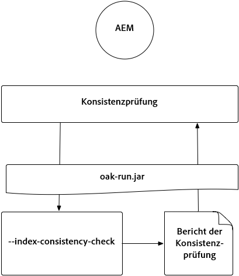

## Indexstatistiken {#indexstatistics}

>[!NOTE]
>
>Weitere Informationen zu diesem Szenario finden Sie unter [Nutzungsszenario 2 - Indexstatistiken](/help/sites-deploying/oak-run-indexing-usecases.md#usecase2indexstatistics) 

* `oak-run.jar` sichert alle Indexdefinitionen, wichtige Indexstatistiken und Indexinhalte für Offline-Analysen. 

* Kann problemlos auf einer verwendeten AEM-Instanz ausgeführt werden.

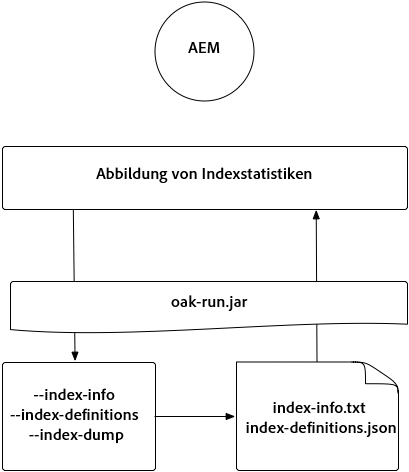

## Entscheidungsdiagramm für den Ansatz für die Neuindizierung {#reindexingapproachdecisiontree}

Dieses Diagramm ist ein Entscheidungsbaum für die Verwendung der verschiedenen Neuindizierungsansätze.

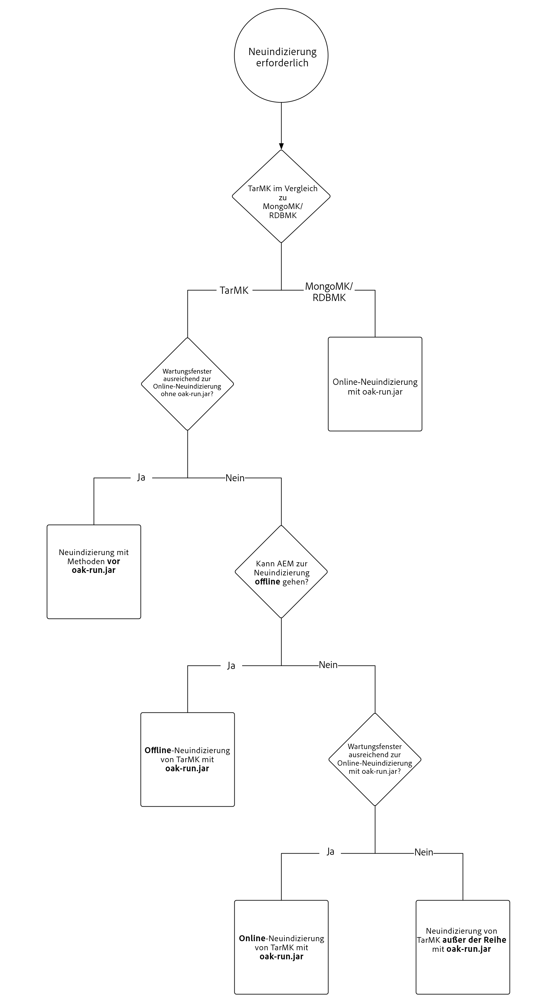

## Neuindizierung von MongoMK/RDMBMK {#reindexingmongomk}

>[!NOTE]
>
>Weitere Informationen zu diesem Szenario finden Sie unter [Nutzungsszenario 3 - Neuindizierung](/help/sites-deploying/oak-run-indexing-usecases.md#usecase3reindexing).

### Textvorextraktion für SegmentNodeStore und DocumentNodeStore {#textpre-extraction}

[Textvorextraktion](/help/sites-deploying/best-practices-for-queries-and-indexing.md#how-to-perform-text-pre-extraction) (eine Funktion, die mit AEM 6.3 vorhanden ist) kann verwendet werden, um die Zeit für die Neuindizierung zu verkürzen. Die Textvorextraktion kann zusammen mit allen Neuindizierungsansätzen verwendet werden.

Abhängig vom `oak-run.jar`-Indizierungsansatz, müssen, wie im Diagramm unten dargestellt, auf beiden Seiten des Schrittes zur Durchführung der Neuindizierung verschiedene Schritte ausgeführt werden.

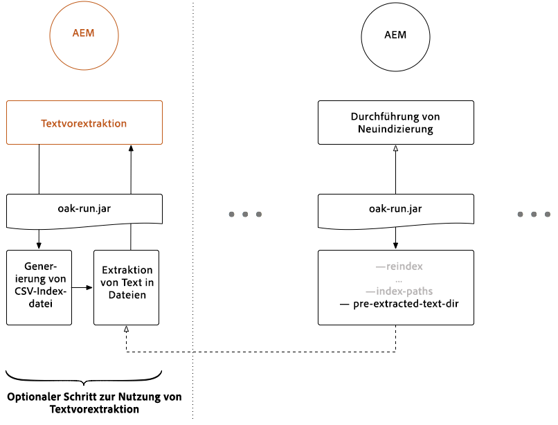

>[!NOTE]
>
>Orange bezeichnet Aktivitäten, bei denen sich AEM in einem Wartungsfenster befinden müssen.

### Online-Neuindizierung für MongoMK oder RDBMK mit oak-run.jar {#onlinere-indexingformongomk}

>[!NOTE]
>
>Weitere Informationen zu diesem Szenario finden Sie unter [Neuindizieren - DocumentNodeStore](/help/sites-deploying/oak-run-indexing-usecases.md#reindexdocumentnodestore).

Dies ist die empfohlene Methode für die Neuindizierung von MongoMK (und RDBMK) AEM Installationen. Es sollte keine andere Methode angewendet werden.

Dieser Prozess muss nur für eine AEM Instanz im Cluster ausgeführt werden.

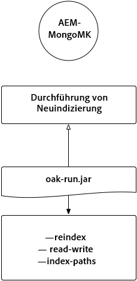

## Neuindizierung von TarMK {#re-indexingtarmk}

>[!NOTE]
>
>Weitere Informationen zu diesem Szenario finden Sie unter [Neuindizieren - SegmentNodeStore](/help/sites-deploying/oak-run-indexing-usecases.md#reindexsegmentnodestore).

* **Überlegungen zu Cold-Standby (TarMK)**

   * Es gibt keine besondere Berücksichtigung für Cold Standby. Die Cold Standby-Instanzen synchronisieren die Änderungen wie gewohnt.

* **AEM-Veröffentlichungsfarmen (AEM-Veröffentlichungsfarmen sollten immer TarMK sein)**

   * Für die Veröffentlichungsfarm muss dies für alle ODER die Schritte für eine einzelne Veröffentlichung ausgeführt werden. Anschließend muss das Setup für andere geklont werden (wobei beim Klonen AEM Instanzen alle üblichen Vorsichtsmaßnahmen getroffen werden). sling.id - sollte auf etwas hier verlinken)

### Online-Neuindizierung für TarMK {#onlinere-indexingfortarmk}

>[!NOTE]
>
>Weitere Informationen zu diesem Szenario finden Sie unter [Online-Neuindizierung - SegmentNodeStore](/help/sites-deploying/oak-run-indexing-usecases.md#onlinereindexsegmentnodestore).

Dies ist die Methode, die vor der Einführung der neuen Indizierungsfunktionen von oak-run.jar angewendet wurde. Sie kann verwendet werden, indem für den Oak-Index die Eigenschaft `reindex=true` festlegt wird.

Dieser Ansatz kann verwendet werden, wenn die Zeit- und Leistungseffekte für den Kunden akzeptabel sind. Dies gilt häufig für kleine und mittlere AEM.

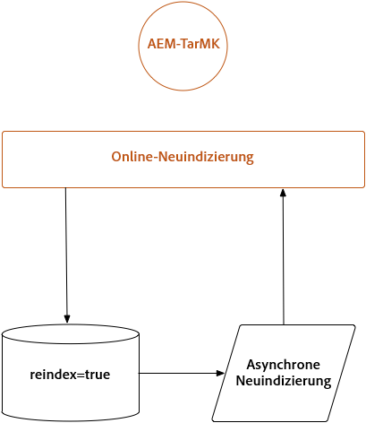

### Online-Neuindizierung von TarMK mit oak-run.jar {#onlinere-indexingtarmkusingoak-run-jar}

>[!NOTE]
>
>Weitere Informationen zu diesem Szenario finden Sie unter [Online-Neuindizierung - SegmentNodeStore - Die AEM-Instanz wird ausgeführt](/help/sites-deploying/oak-run-indexing-usecases.md#onlinereindexsegmentnodestoretheaeminstanceisrunning).

Die Online-Neuindizierung von TarMK mithilfe von oak-run.jar ist schneller als die oben beschriebene [Online-Neuindizierung für TarMK](#onlinere-indexingfortarmk). Sie muss jedoch ebenfalls während eines Wartungsfensters ausgeführt werden, wobei das Fenster kürzer ist und für die Neuindizierung mehr Schritte erforderlich sind.

>[!NOTE]
>
>Vorgänge, bei denen sich AEM in einem Wartungsfenster befinden muss, sind orange dargestellt.

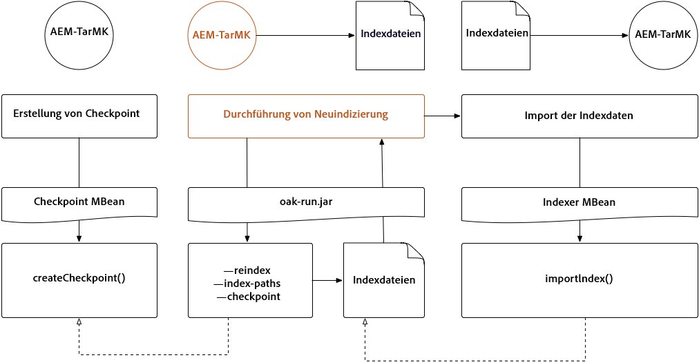

### Offline-Neuindizierung von TarMK mit oak-run.jar {#offlinere-indexingtarmkusingoak-run-jar}

>[!NOTE]
>
>Weitere Informationen zu diesem Szenario finden Sie unter [Online-Neuindizierung - SegmentNodeStore - Die AEM Instanz ist beendet.](/help/sites-deploying/oak-run-indexing-usecases.md#onlinereindexsegmentnodestoreaeminstanceisdown).

Die Offline-Neuindizierung von TarMK ist der einfachste auf `oak-run.jar` basierende Neuindizierungsansatz für TarMK, da nur ein einziger `oak-run.jar`-Befehl erforderlich ist. Dazu muss die AEM Instanz jedoch heruntergefahren werden.

>[!NOTE]
>
>Rot bezeichnet Vorgänge, bei denen AEM heruntergefahren werden müssen.

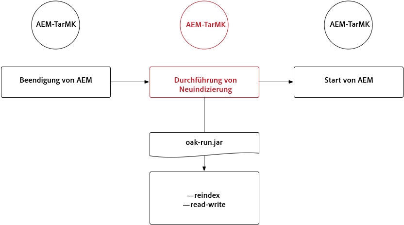

### Out-of-Band-Neuindizierung von TarMK mit oak-run.jar  {#out-of-bandre-indexingtarmkusingoak-run-jar}

>[!NOTE]
>
>Weitere Informationen zu diesem Szenario finden Sie unter [Out-Band-Neuindizierung - SegmentNodeStore](/help/sites-deploying/oak-run-indexing-usecases.md#outofbandreindexsegmentnodestore).

Die Out-of-Band-Neuindizierung minimiert die Auswirkungen der Neuindizierung auf AEM-Instanzen im Betrieb.

>[!NOTE]
>
>Rot bezeichnet Vorgänge, bei denen AEM abgeschaltet werden können.

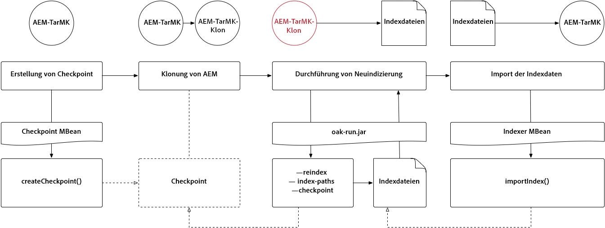

## Aktualisieren von Indexdefinitionen {#updatingindexingdefinitions}

>[!NOTE]
>
>Weitere Informationen zu diesem Szenario finden Sie unter [Nutzungsszenario 4 - Aktualisieren von Indexdefinitionen](/help/sites-deploying/oak-run-indexing-usecases.md#usecase4updatingindexdefinitions).

### Erstellen und Aktualisieren von Indexdefinitionen auf TarMK mithilfe von ACS Ensure Index {#creatingandupdatingindexdefinitionsontarmkusingacsensureindex}

>[!NOTE]
>
>ACS Ensure Index ist ein von der Community unterstütztes Projekt und wird von der Adobe-Unterstützung nicht unterstützt.

Dies ermöglicht den Versand der Indexdefinition über das Inhaltspaket, was später zu einer Neuindizierung führt, indem die Neuindizierungskennzeichnung auf `true`. Dies funktioniert bei kleineren Setups, bei denen die Neuindizierung nicht lange dauert.

Weitere Informationen finden Sie unter [ACS Ensure Index-Dokumentation](https://adobe-consulting-services.github.io/acs-aem-commons/features/ensure-oak-index/index.html) für Details.

### Erstellen und Aktualisieren von Indexdefinitionen auf TarMK mit oak-run.jar {#creatingandupdatingindexdefinitionsontarmkusingoak-run-jar}

Wenn die Dauer der Neuindizierung oder die Auswirkung auf die Performance bei Nicht-`oak-run.jar`-Methoden zu hoch ist, kann der folgende auf `oak-run.jar` basierende Ansatz genutzt werden, um Lucene-Indexdefinitionen in eine TarMK-basierte AEM-Installation zu importieren und neu zu indizieren.

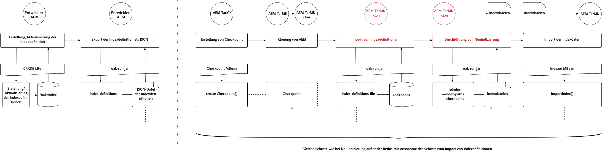

### Erstellen und Aktualisieren von Indexdefinitionen auf MongoMK mit oak-run.jar {#creatingandupdatingindexdefinitionsonmonogmkusingoak-run-jar}

Wenn die Dauer der Neuindizierung oder die Auswirkung auf die Performance bei Nicht-`oak-run.jar`-Methoden zu hoch ist, kann der folgende auf `oak-run.jar` basierende Ansatz genutzt werden, um Lucene-Indexdefinitionen in eine MongoMK-basierte AEM-Installation zu importieren und neu zu indizieren.

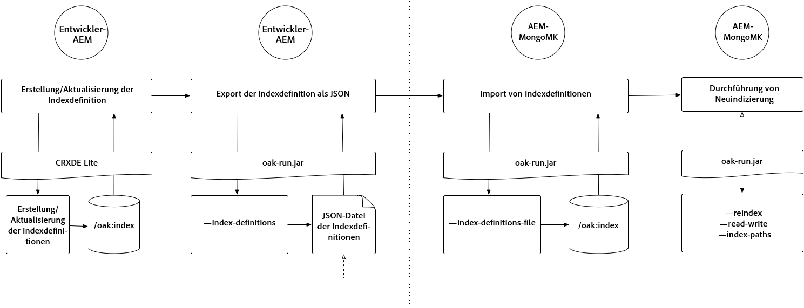
