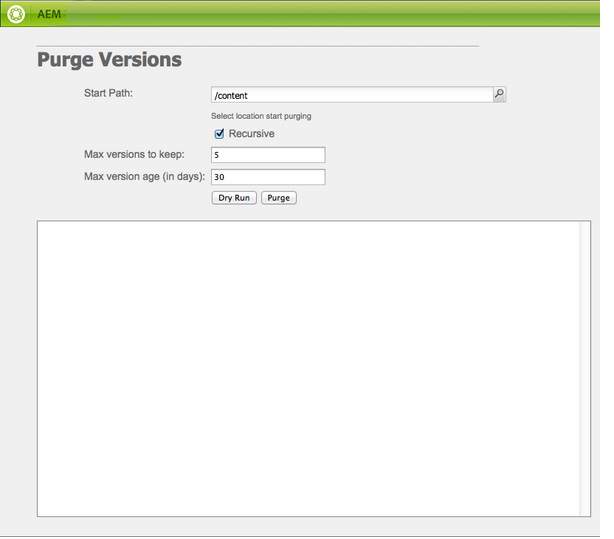
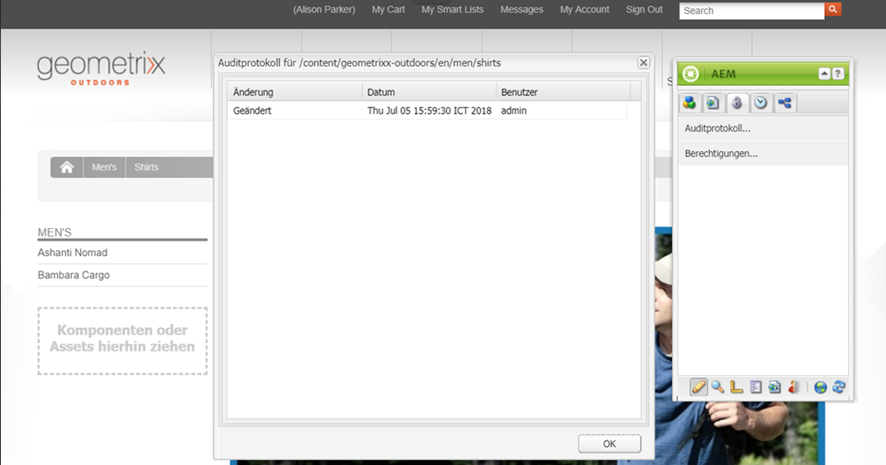

# Überwachen und Warten Ihrer AEM-Instanz{#monitoring-and-maintaining-your-aem-instance}

>[!CAUTION]
>
>AEM 6.4 hat das Ende der erweiterten Unterstützung erreicht und diese Dokumentation wird nicht mehr aktualisiert. Weitere Informationen finden Sie in unserer [technische Unterstützung](https://helpx.adobe.com/de/support/programs/eol-matrix.html). Unterstützte Versionen suchen [here](https://experienceleague.adobe.com/docs/?lang=de).

Nach der Bereitstellung der AEM-Instanzen sind bestimmte Aufgaben erforderlich, um Betrieb, Leistung und Integrität zu überwachen und aufrechtzuerhalten.

Um potenzielle Probleme erkennen zu können, müssen Sie unbedingt wissen, wie Ihre Systeme unter normalen Bedingungen aussehen und sich verhalten. Dies geschieht am besten durch Überwachung des Systems und Erfassung von Informationen über einen bestimmten Zeitraum.

| Überprüfen | Zu beachten | Kommentar/Aktionen |
|---|---|---|
| Sicherungsplan. |  | Erfahren Sie, wie Sie [Sichern Ihrer Instanz](/help/sites-deploying/monitoring-and-maintaining.md#backups). |
| Plan zur Notfallwiederherstellung. | Richtlinien für die Notfallwiederherstellung Ihres Unternehmens. |  |
| Ein System zur Fehlersuche steht Ihnen für das Problem-Reporting zur Verfügung. | Zum Beispiel [Bugzilla](https://www.bugzilla.org/), [Jira](https://www.atlassian.com/software/jira/) oder eines von vielen anderen. |  |
| Dateisysteme werden überwacht. | Das CRX-Repository wird „eingeforen“, wenn nicht genügend freier Speicherplatz vorhanden ist. Sobald genügend Platz verfügbar ist, wird der Vorgang fortgesetzt. | „`*ERROR* LowDiskSpaceBlocker`“-Meldungen werden in der Protokolldatei angezeigt, wenn der Speicherplatz zur Neige geht. |
| [Protokolldateien](/help/sites-deploying/monitoring-and-maintaining.md#working-with-audit-records-and-log-files) werden überwacht. |  |  |
| Die Systemüberwachung läuft (ständig) im Hintergrund. | Einschließlich CPU-, Speicher-, Datenträger- und Netzwerkauslastung. Verwenden Sie zum Beispiel Iostat/vmstat/perfmon. | Protokollierte Daten werden visualisiert und können zur Verfolgung von Leistungsproblemen verwendet werden. Auch Rohdaten sind verfügbar. |
| [AEM Leistung wird überwacht](/help/sites-deploying/monitoring-and-maintaining.md#monitoring-performance). | Einschließlich [Anforderungszähler](/help/sites-deploying/monitoring-and-maintaining.md#request-counters) zur Überwachung des Traffic-Niveaus. | Wird ein signifikanter oder langfristiger Leistungsverlust festgestellt, sollte eine eingehende Untersuchung durchgeführt werden. |
| Sie überwachen Ihre [Replikationsagenten](/help/sites-deploying/monitoring-and-maintaining.md#monitoring-your-replication-agents). |  |  |
| Regelmäßige Bereinigung der Workflow-Instanzen. | Repository-Größe und Workflow-Leistung. | Siehe [Regelmäßiges Bereinigen von Workflow-Instanzen](/help/sites-administering/workflows-administering.md#regular-purging-of-workflow-instances). |

## Backups {#backups}

Es empfiehlt sich, Sicherungen von Folgendem zu übernehmen:

* Ihre Software-Installation - vor/nach wesentlichen Änderungen in der Konfiguration
* Die im Repository gespeicherten Inhalte - regelmäßig

Ihr Unternehmen wird wahrscheinlich über eine Sicherungsrichtlinie verfügen, die Sie befolgen müssen, zusätzliche Überlegungen dazu, was Sie sichern möchten, und wann:

* wie wichtig das System und die Daten sind.
* wie oft Änderungen an der Software oder an den Daten vorgenommen werden.
* Datenvolumen; Die Kapazität kann gelegentlich ein Problem darstellen, ebenso wie die Zeit, die zum Ausführen der Sicherung benötigt wird.
* Ob die Sicherung durchgeführt werden kann, während Benutzer online sind, und welche Auswirkungen auf die Leistung zu erwarten sind.
* die geografische Verteilung der Nutzer; d. h. wann ist die beste Sicherungszeit (um die Auswirkungen zu minimieren)?
* Ihre Strategie zur Wiederherstellung der Katastrophe; Es gibt Richtlinien, wo die Backup-Daten gespeichert werden müssen (z. B. Offsite, spezifisches Medium usw.).

Häufig wird eine vollständige Sicherung in regelmäßigen Abständen (z. B. täglich, wöchentlich oder monatlich) durchgeführt, wobei inkrementelle Sicherungen zwischen (z. B. stündlich, täglich oder wöchentlich) erfolgen.

>[!CAUTION]
>
>Wenn Sie Sicherungskopien der Produktionsinstanzen erstellt haben, *müssen* Sie Tests durchführen, um sicherzustellen, dass die Sicherungskopie erfolgreich wiederhergestellt werden kann.
>
>Andernfalls ist die Sicherungskopie womöglich nutzlos (im schlimmsten Fall).

>[!NOTE]
>
>Weitere Informationen zur Sicherungsleistung finden Sie im Abschnitt [Backup-Leistung](/help/sites-deploying/configuring-performance.md#backup-performance) Abschnitt.

### Sichern der Software-Installation {#backing-up-your-software-installation}

Nach der Installation oder nach wesentlichen Änderungen der Konfiguration sollten Sie eine Sicherungskopie Ihrer Software-Installation erstellen.

Dazu müssen Sie erst [ein Backup des gesamten Repositorys erstellen](#backing-up-your-repository) und dann folgende Schritte ausführen:

1. Hör auf AEM.
1. Erstellen Sie eine vollständige Sicherungskopie von `<cq-installation-dir>` vom Dateisystem aus.

>[!CAUTION]
>
>Falls Sie einen Anwendungs-Server eines Drittanbieters verwenden, gibt es möglicherweise zusätzliche Ordner an anderen Speicherorten, die Sie ebenfalls sichern müssen. Informationen dazu, wie Sie Anwendungs-Server installieren, finden Sie unter [Installieren von AEM mit einem Anwendungs-Server](/help/sites-deploying/application-server-install.md).

>[!CAUTION]
>
>Eine inkrementelle Sicherung des Dateidatenspeichers wird unterstützt. Stellen Sie bei der Verwendung der inkrementellen Sicherung für andere Komponenten (z. B. Lucene-Index) sicher, dass gelöschte Dateien auch im Backup als gelöscht markiert sind.

>[!NOTE]
>
>Die Festplattenspiegelung kann auch als Sicherungsmechanismus verwendet werden.

### Repository sichern {#backing-up-your-repository}

Die [Sicherung und Wiederherstellung](/help/sites-administering/backup-and-restore.md) -Abschnitt der CRX-Dokumentation behandelt alle Probleme im Zusammenhang mit Sicherungen des CRX-Repositorys.

Ausführliche Informationen zum Erstellen eines &quot;Hot&quot;-Backups im Internet finden Sie unter [Erstellen eines Online-Backups](/help/sites-administering/backup-and-restore.md#online-backup).

## Versionsbereinigung {#version-purging}

Das Tool **Versionen bereinigen** dient zum Bereinigen der Versionen eines Knotens oder einer Hierarchie von Knoten in Ihrem Repository. Ihr Hauptzweck besteht darin, Ihnen zu helfen, die Größe Ihres Repositorys zu reduzieren, indem Sie alte Versionen Ihrer Knoten entfernen.

In diesem Abschnitt werden die Wartungsaufgaben im Zusammenhang mit der Versionsfunktion von AEM behandelt. Mit dem Tool **Versionsbereinigung** können Sie Versionen eines Knotens oder eine Knotenhierarchie Ihres Repository bereinigen. Ihr Hauptzweck besteht darin, Ihnen zu helfen, die Größe Ihres Repositorys zu reduzieren, indem Sie alte Versionen Ihrer Knoten entfernen.

### Überblick {#overview}

Das Tool **Versionsbereinigung** ist in der **[Tools](/help/sites-administering/tools-consoles.md)-Konsole** unter **„Versionsverwaltung“** oder direkt unter folgender URL verfügbar:

`https://<server>:<port>/etc/versioning/purge.html`



**Startpfad** Ein absoluter Pfad, auf dem die Bereinigung ausgeführt werden muss. Sie können den Startpfad auswählen, indem Sie auf den Navigatorbaum im Repository klicken.

**Rekursiv** Wenn Sie Daten bereinigen, können Sie den Vorgang an einem Knoten oder in der ganzen Hierarchie ausführen. Aktivieren Sie hierfür die Option „Rekursiv“. Im letzteren Fall definiert der angegebene Pfad den Stammknoten der Hierarchie.

**Maximale Anzahl an beizubehaltenden Versionen** Die maximale Anzahl von Versionen, die für einen Knoten beibehalten werden sollen. Wenn die Anzahl diesen Wert überschreitet, werden die ältesten Versionen gelöscht.

**Maximales Versionsalter** Das maximale Alter der Version eines Knotens. Wenn das Alter einer Version diesen Wert überschreitet, wird sie gelöscht.

**Probelauf** Da das Entfernen von Versionen endgültig ist und nur durch Wiederherstellen eines Backups rückgängig gemacht werden kann, ist beim Tool für die Versionsbereinigung ein Probelauf-Modus verfügbar, der Ihnen eine Vorschau auf die bereinigte Version erlaubt. Klicken Sie auf „Probelauf“, um einen Probelauf des Bereinigungsvorgangs zu starten.

**Bereinigen** Starten Sie das Bereinigen der Versionen auf dem Knoten, der durch den Startpfad definiert ist.

### Bereinigen von Versionen einer Website {#purging-versions-of-a-web-site}

Um Versionen einer Website zu löschen, gehen Sie folgendermaßen vor:

1. Navigieren Sie zur **[Tools](/help/sites-administering/tools-consoles.md)-Konsole**, wählen Sie **Versionsverwaltung** aus und doppelklicken Sie auf **Versionen bereinigen**.
1. Legen Sie den Startpfad für den zu löschenden Inhalt fest (z. B. `/content/geometrixx-outdoors`).

   * Wenn Sie nur den durch Ihren Pfad definierten Knoten bereinigen möchten, heben Sie die Auswahl auf **Rekursiv**.
   * Wenn Sie den durch Ihren Pfad und dessen untergeordnete Elemente definierten Knoten bereinigen möchten, wählen Sie **Rekursiv**.

1. Legen Sie die maximale Anzahl von Versionen (für jeden Knoten) fest, die Sie beibehalten möchten. Lassen Sie das Feld frei, falls diese Einstellung nicht verwendet werden soll.

1. Legen Sie das maximale Versionsalter in Tagen (für jeden Knoten) fest, den Sie beibehalten möchten. Lassen Sie das Feld frei, falls diese Einstellung nicht verwendet werden soll.

1. Klicken Sie auf **Probelauf**, um eine Vorschau des Bereinigungsvorgangs anzuzeigen.
1. Klicken Sie auf **Löschen**, um den Vorgang zu starten.

>[!CAUTION]
>
>Bereinigte Knoten können ohne Wiederherstellung des Repository nicht zurückgesetzt werden. Da eine fehlerfreie Konfiguration sehr wichtig ist, empfiehlt es sich, vor einer Bereinigung immer einen Probelauf durchzuführen.

### Analyse der Konsole {#analyzing-the-console}

Beim den Vorgängen **Probelauf** und **Löschen** werden alle Knoten aufgelistet, die verarbeitet werden. Während des Vorgangs kann ein Knoten einen der folgenden Statuswerte haben: 

* `ignore (not versionnable)`: Der Knoten unterstützt keine Versionierung und wird beim Bereinigungsvorgang ignoriert.
* `ignore (no version)`: Für den Knoten sind keine Versionen vorhanden und er wird beim Bereinigungsvorgang ignoriert.
* `retained`: Der Knoten wurde nicht gelöscht.
* `purged`: Der Knoten wurde gelöscht.

Darüber hinaus stellt die Konsole nützliche Informationen zu den Versionen bereit: 

* `V 1.0`: Die Versionsnummer.
* `V 1.0.1`&amp;ast;: Der Stern zeigt an, dass die Version die aktuelle ist.
* `Thu Mar 15 2012 08:37:32 GMT+0100`: Das Datum der Version.

Im Folgenden ein Beispiel:

* Die **Hemden** Versionen werden gelöscht, da ihr Versionsalter größer als 2 Tage ist.
* Die **Tonga Fashions!** Versionen werden gelöscht, da die Anzahl der Versionen größer als 5 ist.


## Arbeiten mit Auditdatensätzen und Protokolldateien {#working-with-audit-records-and-log-files}

Auditdatensätze und Protokolldateien für Adobe Experience Manager (AEM) finden sich an diversen Speicherorten. Im Folgenden erhalten Sie einen Überblick darüber, wo Sie sich befinden.

### Arbeiten mit Protokollen {#working-with-logs}

AEM WCM-System zeichnet detaillierte Protokolle auf. Nachdem Sie Quickstart entpackt und gestartet haben, finden Sie Protokolle in:

* `<cq-installation-dir>/crx-quickstart/logs/`
* `<cq-installation-dir>/crx-quickstart/repository/`

#### Protokolldateirotation {#log-file-rotation}

Die Rotation von Protokolldateien bezieht sich auf den Prozess, der das Dateiwachstum begrenzt, indem regelmäßig neue Dateien erstellt werden. In AEM wird die Protokolldatei `error.log` täglich nach folgenden Regeln rotiert:

* Die Datei `error.log` wird nach dem Muster {Original_Dateiname} `.yyyy-MM-dd` umbenannt. Beispielsweise wird die aktuelle Protokolldatei am 11. Juli 2010 umbenannt in `error.log-2010-07-10` und anschließend wird ein neues `error.og` erstellt.
* Vorherige Protokolldateien werden nicht gelöscht. Sie sind dafür verantwortlich, alte Protokolldateien regelmäßig zu löschen, um den Speicherbedarf zu beschränken.

>[!NOTE]
>
>Wenn Sie Ihre AEM-Installation aktualisieren, beachten Sie, dass alle vorhandenen Protokolldateien, die von AEM nicht mehr verwendet werden, auf der Festplatte verbleiben. Sie können diese ohne Risiko löschen. Alle neuen Protokolleinträge werden in die neuen Protokolldateien geschrieben. 

### Suchen nach Protokolldateien {#finding-the-log-files}

Verschiedene Protokolldateien werden auf dem Dateiserver gespeichert, auf dem Sie AEM installiert haben:

* `<cq-installation-dir>/crx-quickstart/logs`

   * `access.log`

      Hier werden alle Zugriffsanfragen an das AEM WCM-System und das Repository registriert.

   * `audit.log`

      Hier werden Moderationsaktionen registriert.

   * `error.log`

      Hier werden Fehlermeldungen (mit unterschiedlichem Schweregrad) registriert.

   * [ `ImageServer-<PortId>-yyyy>-<mm>-<dd>.log`](https://experienceleague.adobe.com/docs/dynamic-media-developer-resources/image-serving-api/image-serving-api/config-admin/server-logging/c-image-server-log.html?lang=de)

      Dieses Protokoll wird nur verwendet, wenn Dynamic Media aktiviert ist. Es stellt die Statistiken und analytische Informationen bereit, die für die Analyse des Verhaltens des internen ImageServer-Prozesses verwendet werden.

   * `request.log`

      Hier werden alle Zugriffsanfragen zusammen mit der Antwort registriert.

   * [ `s7access-<yyyy>-<mm>-<dd>.log`](https://experienceleague.adobe.com/docs/dynamic-media-developer-resources/image-serving-api/image-serving-api/config-admin/server-logging/c-access-log.html?lang=de)

      Dieses Protokoll wird nur verwendet, wenn Dynamic Media aktiviert ist. Das s7access-Protokoll zeichnet alle Anfragen auf, die über an Dynamic Media gesendet werden `/is/image` und `/is/content`.

   * `stderr.log`

       Enthält Fehlermeldungen (ebenfalls mit unterschiedlichem Schweregrad), die beim Starten generiert werden. Standardmäßig wird für die Protokollebene Folgendes festgelegt `Warning` ( `WARN`)

   * `stdout.log`

      Enthält Protokollmeldungen, die auf Ereignisse beim Starten verweisen.

   * `upgrade.log`

      Bietet ein Protokoll aller Aktualisierungsvorgänge, die von der `com.day.compat.codeupgrade` und `com.adobe.cq.upgradesexecutor` Packages.

* `<cq-installation-dir>/crx-quickstart/repository`

   * `revision.log`

      Zeigt Daten des Revisionsjournals an.

>[!NOTE]
>
>Die Protokolle ImageServer und s7access sind nicht in der Variablen **VollHerunterladen** -Paket, das aus der **system/console/status-Bundlelist** Seite. Wenn Sie Probleme mit Dynamic Media haben, hängen Sie zur Unterstützung auch die Protokolle ImageServer und s7access an, wenn Sie sich an den Kundensupport wenden.

### Aktivieren der DEBUG-Protokollebene {#activating-the-debug-log-level}

Die standardmäßige Protokollebene [Apache Sling Logging Configuration](/help/sites-deploying/osgi-configuration-settings.md#osgi-configuration-settings) ist Information, sodass Debugmeldungen nicht protokolliert werden.

Um die Debugging-Protokollebene für eine Protokollierung zu aktivieren, müssen Sie für die Eigenschaften `org.apache.sling.commons.log.level` im Repository den Wert „debug“ festlegen. Beispielsweise auf `/libs/sling/config/org.apache.sling.commons.log.LogManager`, um die [globale Apache Sling-Protokollierung](/help/sites-deploying/osgi-configuration-settings.md#osgi-configuration-settings) zu konfigurieren.

>[!CAUTION]
>
>Lassen Sie das Protokoll nicht länger als nötig auf der Debug-Protokollebene, da es viele Protokolleinträge generiert und so Ressourcen verbraucht.

Eine Zeile in der Debugging-Datei beginnt üblicherweise mit DEBUG, gefolgt von der Protokollebene, der Installationsaktion und der Protokollmeldung. Beispiel:

```shell
DEBUG 3 WebApp Panel: WebApp successfully deployed
```

Die Protokollebenen lauten wie folgt:

| 0 | Schwerwiegender Fehler | Die Aktion ist fehlgeschlagen und das Installationsprogramm kann nicht fortgesetzt werden. |
|---|---|---|
| 1 | Fehler | Die Aktion ist fehlgeschlagen. Die Installation wird fortgesetzt, ein Teil des AEM WCM-Systems wird jedoch nicht richtig installiert und funktioniert nicht. |
| 2 | Warnung | Die Aktion war erfolgreich, stieß aber auf Probleme. Das AEM WCM-System funktioniert möglicherweise nicht ordnungsgemäß. |
| 3 | Informationen | Die Aktion war erfolgreich. |

### Benutzerdefinierte Protokolldatei erstellen {#create-a-custom-log-file}

>[!NOTE]
>
>Bei der Arbeit mit Adobe Experience Manager gibt es mehrere Methoden zur Verwaltung der Konfigurationseinstellungen für diese Dienste. see [Konfigurieren von OSGi](/help/sites-deploying/configuring-osgi.md) für weitere Details und empfohlene Vorgehensweisen.

Unter bestimmten Umständen müssen Sie möglicherweise eine benutzerdefinierte Protokolldatei mit einer anderen Protokollebene erstellen. Gehen Sie dazu im Repository wie folgt vor:

1. Erstellen Sie, falls nicht bereits vorhanden, einen neuen Konfigurationsordner (`sling:Folder`) für das Projekt `/apps/<project-name>/config`.
1. Erstellen Sie unter `/apps/<project-name>/config` einen Knoten für die neue [Apache Sling Logging Logger-Konfiguration](/help/sites-deploying/osgi-configuration-settings.md#osgi-configuration-settings):

   * Name:

   `org.apache.sling.commons.log.LogManager.factory.config-<identifier>` (da dies ein Logger ist)

   wobei `<identifier>` durch einen freien Text ersetzt wird, den Sie eingeben (müssen), um die Instanz zu identifizieren (diese Information darf nicht weggelassen werden). Beispiel: `org.apache.sling.commons.log.LogManager.factory.config-MINE`

   * Typ: `sling:OsgiConfig`
   >[!NOTE]
   >
   >Es gibt zwar keine spezifischen technischen Anforderungen, es ist jedoch ratsam, für `<identifier>` einen eindeutigen Parameter zu verwenden.

1. Legen Sie die folgenden Eigenschaften des Knotens fest:

   * Name: `org.apache.sling.commons.log.file`

      Typ: String

      Wert: Angabe der Protokolldatei; Beispiel: `logs/myLogFile.log`

   * Name: `org.apache.sling.commons.log.names`

      Typ: `String[] (String + Multi)`

      Wert: Angabe der OSGi-Services, für die der Logger Meldungen protokollieren soll, beispielsweise alle folgenden:

      * `org.apache.sling`
      * `org.apache.felix`
      * `com.day`
   * Name: `org.apache.sling.commons.log.level`

      Typ: String

      Wert: Angabe der erforderliche Protokollebene (`debug`, `info`, `warn` oder `error`); Beispiel `debug`

   * Konfigurieren Sie ggf. weitere Parameter:

      * Name: `org.apache.sling.commons.log.pattern`

         Typ: `String`

         Wert: Angabe des Musters der Protokollmeldung nach Bedarf; Beispiel:

         `{0,date,dd.MM.yyyy HH:mm:ss.SSS} *{4}* [{2}] {3} {5}`
   >[!NOTE]
   >
   >`org.apache.sling.commons.log.pattern` unterstützt bis zu sechs Argumente.
   >
   >{0} Der Zeitstempel vom Typ `java.util.Date`
   >
   >{1} Die Protokollmarkierung
   >
   >{2} Der Name des aktuellen Threads
   >
   >{3} Der Name des Loggers
   >
   >{4} Die Protokollierungsebene
   >
   >{5} Die Protokollmeldung
   >
   >Falls der Protokollaufruf den Parameter `Throwable` enthält, wird der StackTrace an die Meldung angefügt.

   >[!CAUTION]
   >
   >„org.apache.sling.commons.log.names“ muss einen Wert enthalten.

   >[!NOTE]
   >
   >Die Protokollierungspfade sind vom Speicherort-`crx-quickstart`abhängig.
   >
   >Eine Protokolldatei wie:
   >
   >`logs/thelog.log`
   >
   >wird daher geschrieben in:
   >
   >`<cq-installation-dir>/crx-quickstart/logs/thelog.log`.
   >
   >Und eine Protokolldatei wie:
   >
   >`../logs/thelog.log`
   >
   >wird in folgendes Verzeichnis geschrieben:
   >
   >`<cq-installation-dir>/logs/`\
   >(d. h. neben `<cq-installation-dir>/crx-quickstart/`)

1. Dieser Schritt muss nur ausgeführt werden, wenn ein neuer Writer erforderlich ist (d. h. mit einer Konfiguration, die vom standardmäßigen Writer abweicht). 

   >[!CAUTION]
   >
   >Eine neue Logging-Writer-Konfiguration ist nur erforderlich, wenn die vorhandene Standardkonfiguration nicht geeignet ist.\
   >Wenn kein expliziter Writer konfiguriert ist, erstellt das System automatisch einen impliziten Writer auf Basis der Standardkonfiguration.

   Erstellen Sie unter `/apps/<project-name>/config` einen Knoten für die neue [Apache Sling Logging-Primär-Konfiguration](/help/sites-deploying/osgi-configuration-settings.md#osgi-configuration-settings):

   * Name: `org.apache.sling.commons.log.LogManager.factory.writer-<identifier>` (da dies ein Primär ist)

      Wie beim Logger wird `<identifier>` durch einen freien Text ersetzt, den Sie eingeben (müssen), um die Instanz zu identifizieren (diese Information darf nicht weggelassen werden). Beispiel: `org.apache.sling.commons.log.LogManager.factory.writer-MINE`

   * Typ: `sling:OsgiConfig`
   >[!NOTE]
   >
   >Es gibt zwar keine spezifischen technischen Anforderungen, es ist jedoch ratsam, für `<identifier>` einen eindeutigen Parameter zu verwenden.

   Legen Sie die folgenden Eigenschaften des Knotens fest:

   * Name: `org.apache.sling.commons.log.file`

      Typ: `String`

      Wert: Angabe der Protokolldatei in einer Weise, dass sie mit der im Logger angegebenen Datei übereinstimmt.

      Für dieses Beispiel: `../logs/myLogFile.log`.

   * Konfigurieren Sie ggf. weitere Parameter:

      * Name: `org.apache.sling.commons.log.file.number`

         Typ: `Long`

         Wert: Angabe der Anzahl der Protokolldateien, die Sie beibehalten möchten; wie z. B. `5`

      * Name: `org.apache.sling.commons.log.file.size`

         Typ: `String`

         Wert: Geben Sie diesen wie erforderlich an, um die Dateirotation nach Größe/Datum zu steuern; beispielsweise `'.'yyyy-MM-dd`
   >[!NOTE]
   >
   >`org.apache.sling.commons.log.file.size` steuert die Rotation der Protokolldatei durch eine der folgenden Einstellungen:
   >
   >* eine maximalen Dateigröße
   >* einen Zeit-/Terminplan

   >
   >um anzugeben, wann eine neue Datei erstellt wird (und die vorhandene Datei gemäß dem Namensmuster umbenannt wird).
   >
   >* Eine Größenbeschränkung kann mit einer Zahl angegeben werden. Falls kein Größenindikator angegeben ist, gilt die Anzahl der Bytes oder Sie können einen der folgenden Indikatoren hinzufügen: `KB`, `MB` oder `GB` (Groß-/Kleinschreibung wird ignoriert).
   >* Sie können einen Zeit-/Terminplan nach dem `java.util.SimpleDateFormat`-Muster angeben. Dieser gibt den Zeitraum an, in dem die Datei rotiert wird, sowie das Suffix, das an die rotierte Datei angehängt wurde (zur einfachen Identifizierung).

   >
   >Der Standardwert lautet „.“jjjj-MM-tt (für die tägliche Protokollrotation).
   >
   >So wird beispielsweise um Mitternacht am 20. Januar 2010 (oder sobald die erste Protokollmeldung nach diesem Zeitpunkt ausgegeben wird), ../logs/error.log in ../logs/error.log.2010-01-20 umbenannt. Die Protokollierung für den 21. Januar erfolgt in (ein neues und leeres) ../logs/error.log und geht bei der nächsten Änderung zum nächsten Datum über. 
   >
   >| `'.'yyyy-MM` | Rotation zu Beginn jedes Monats |
   >|---|---|
   >| `'.'yyyy-ww` | Rotation am ersten Tag jeder Woche (hängt vom Gebietsschema ab). |
   >| `'.'yyyy-MM-dd` | Rotation täglich um Mitternacht. |
   >| `'.'yyyy-MM-dd-a` | Rotation täglich um Mitternacht und am Mittag. |
   >| `'.'yyyy-MM-dd-HH` | Rotation zu jeder vollen Stunde. |
   >| `'.'yyyy-MM-dd-HH-mm` | Rotation zu Beginn jeder Minute. |
   >
   >Hinweis: Bei der Angabe einer Uhrzeit/eines Datums ist Folgendes zu beachten:
   > 1. Sie sollten wörtlichen Text innerhalb eines Paares einfacher Anführungszeichen (&#39; &#39;) „ausklammern“;
      >
      >     Dadurch wird verhindert, dass bestimmte Zeichen als Musterbuchstaben interpretiert werden.
   >
   >  1. Verwenden Sie nur Zeichen, die für einen gültigen Dateinamen an einer beliebigen Stelle in der Option zulässig sind.


1. Lesen Sie Ihre neue Protokolldatei mit Ihrem ausgewählten Tool.

   Die Protokolldatei, die für dieses Beispiel erstellte wurde, lautet wie folgt `../crx-quickstart/logs/myLogFile.log`.

Die Felix-Konsole enthält auch Informationen zum Sling Log-Support unter `../system/console/slinglog`; beispielsweise `http://localhost:4502/system/console/slinglog`.

### Auffinden der Auditdatensätze {#finding-the-audit-records}

Auditdatensätze werden als Nachweis darüber aufbewahrt, wer wann welche Aktion vorgenommen hat. Für WCM- und OSGi-Ereignisse werden unterschiedliche Auditdatensätze AEM.

#### AEM bei der Seitenbearbeitung angezeigte WCM-Auditdatensätze {#aem-wcm-audit-records-shown-when-page-authoring}

1. Öffnen Sie eine Seite.
1. Im Sidekick können Sie die Registerkarte mit dem Sperrsymbol auswählen und dann auf **Auditprotokoll...**
1. Daraufhin wird ein neues Fenster mit der Liste der Auditdatensätze für die aktuelle Seite geöffnet.

   

1. Klicken **OK** wenn Sie das Fenster schließen möchten.

#### AEM von WCM-Auditdatensätzen im Repository {#aem-wcm-auditing-records-within-the-repository}

Auditdatensätze werden im Ordner `/var/audit` je nach Ressource gespeichert. Sie können einen Drilldown durchführen, bis Sie die einzelnen Datensätze und die darin enthaltenen Informationen sehen können.

Diese Einträge enthalten dieselben Informationen, die beim Bearbeiten einer Seite angezeigt werden.

#### OSGi-Auditdatensätze aus der Web-Konsole {#osgi-audit-records-from-the-web-console}

OSGi-Ereignisse generieren ebenfalls Auditdatensätze, die Sie in der AEM-Web-Konsole auf der Registerkarte **Konfigurationsstatus** unter **Protokolldateien** anzeigen können:


## Überwachen von Replikationsagenten {#monitoring-your-replication-agents}

Sie können Ihre [Replikations-Warteschlangen](/help/sites-deploying/replication.md) , um zu erkennen, wann eine Warteschlange ausfällt oder blockiert ist - was wiederum auf ein Problem mit einer Veröffentlichungsinstanz oder einem externen System hinweisen könnte:

* Sind alle erforderlichen Warteschlangen aktiviert?
* Sind noch deaktivierte Warteschlangen erforderlich?
* Alle `enabled` Warteschlangen sollten den Status `idle` oder `active` aufweisen, was einem normalem Betrieb entspricht. Keine der Warteschlangen sollte den Status `blocked` aufweisen, da dies oft auf Probleme auf Empfängerseite hinweist.

* Wenn die Warteschlange im Laufe der Zeit größer wird, kann dies auf eine Blockierung hindeuten.

So überwachen Sie einen Replikationsagenten:

1. Zugriff auf **Instrumente** in AEM.
1. Klicken **Replikation**.
1. Doppelklicken Sie auf den Link zu Agenten für die entsprechende Umgebung (entweder im linken oder im rechten Bereich). Beispiel **Agenten für Autor**.

   Das resultierende Fenster zeigt eine Übersicht über alle Replikationsagenten für die Autorenumgebung, einschließlich Ziel und Status.

1. Klicken Sie auf den entsprechenden Agentennamen (der ein Link ist), um detaillierte Informationen zu diesem Agenten anzuzeigen:

   

   Folgende Informationen/Optionen sind verfügbar:

   * Überprüfen Sie, ob der Agent aktiviert ist.
   * Anzeigen der Zielgruppe von Replikationen.
   * Überprüfen Sie, ob die Replikationswarteschlange derzeit aktiv (aktiviert) ist.
   * Überprüfen Sie, ob sich Elemente in der Warteschlange befinden.
   * **Aktualisieren** oder **Löschen** Aktualisierung der Anzeige von Warteschlangeneinträgen; Dies hilft Ihnen dabei, Elemente in die Warteschlange zu gelangen und aus der Warteschlange zu verlassen.
   * **Protokoll anzeigen** , um auf das Protokoll aller Aktionen des Replikationsagenten zuzugreifen.
   * **Verbindung testen** auf die Zielinstanz.
   * **Wiederholen erzwingen** bei Bedarf für alle Warteschlangenelemente.

   >[!CAUTION]
   >
   >Verwenden Sie nicht den Link &quot;Verbindung testen&quot;für den Postausgang &quot;Rückwärtsreplikation&quot;auf einer Veröffentlichungsinstanz.
   >
   >Falls Sie eine Replikation für eine Warteschlange in einem Postausgang testen, werden alle Elemente, die älter als die Testreplikation sind, bei jeder Rückwärtsreplikation erneut verarbeitet.
   >
   >Wenn solche Elemente bereits in einer Warteschlange vorhanden sind, können Sie mit der folgenden XPath JCR-Abfrage danach suchen und diese entfernen.
   >
   >`/jcr:root/var/replication/outbox//*[@cq:repActionType='TEST']`

Auch hier können Sie eine Lösung entwickeln, um alle Replikationsagenten (unter `/etc/replication/author` oder `/etc/replication/publish`) zu erkennen und den Status des jeweiligen Agenten (`enabled`, `disabled`) sowie den der zugrunde liegenden Warteschlange (`active`, `idle`, `blocked`) zu überprüfen.

## Überwachung der Leistung {#monitoring-performance}

[Leistungsoptimierung](/help/sites-deploying/configuring-performance.md) ist ein interaktiver Prozess, der während der Entwicklung im Mittelpunkt steht. Nach der Bereitstellung wird sie in der Regel nach bestimmten Intervallen oder Ereignissen überprüft.

Die für das Erfassen von Informationen eingesetzten Methoden können auch zur kontinuierlichen Überwachung verwendet werden.

>[!NOTE]
>
>Spezifische [Konfigurationen, die die Leistung verbessern](/help/sites-deploying/configuring-performance.md#configuring-for-performance), können ebenfalls überprüft werden.

Nachfolgend finden Sie eine Liste mit häufigen Leistungsproblemen und Vorschlägen, wie Sie diese erkennen und beheben.

| Bereich | Symptom(e) | Steigerung der Kapazität... | So reduzieren Sie die Lautstärke ... |
|---|---|---|---|
| Client | Hohe Client-CPU-Auslastung. | Installieren Sie eine Client-CPU mit höherer Leistung. | Vereinfachen Sie das Layout (HTML). |
|  | Geringe CPU-Auslastung des Servers. | Aktualisieren Sie auf einen schnelleren Browser. | Verbessern Sie den clientseitigen Cache. |
|  | Einige Clients sind schnell, andere langsamer. |  |  |
| Server |  |  |  |
| Netzwerk | Geringe CPU-Auslastung auf Servern und Clients. | Entfernen Sie alle Netzwerkengpässe. | Verbessern/optimieren Sie die Konfiguration des Client-Cache. |
|  | Das lokale Browsen auf dem Server ist (vergleichsweise) schnell. | Vergrößern Sie die Netzwerkbandbreite. | Verringern Sie die &quot;Gewichtung&quot;Ihrer Webseiten (z. B. weniger Bilder, optimiertes HTML). |
| Webserver | Die CPU-Auslastung auf dem Webserver ist hoch. | Cluster Ihre Webserver. | Reduzieren Sie die Treffer pro Seite (Besuch). |
|  |  | Verwenden Sie einen Hardware Load Balancer. |  |
| Programm | Die CPU-Auslastung des Servers ist hoch. | Cluster Sie Ihre AEM Instanzen. | Suchen und beseitigen Sie CPU- und Speicherhogs (verwenden Sie Code-Überprüfung, Timing-Ausgabe usw.). |
|  | Hoher Speicherverbrauch. |  | Verbessern Sie das Zwischenspeichern auf allen Ebenen. |
|  | Kurze Antwortzeiten. |  | Optimieren Sie Vorlagen und Komponenten (z. B. Struktur, Logik). |
| Repository |  |  |  |
| Cache |  |  |  |

Leistungsprobleme können aus einer Reihe von Ursachen herrühren, die nichts mit Ihrer Website zu tun haben, darunter vorübergehende Verlangsamungen bei der Verbindungsgeschwindigkeit, CPU-Last und vieles mehr.

Dies kann sich auch auf alle Ihre Besucher oder nur auf eine Untergruppe davon auswirken.

All diese Informationen müssen erfasst, sortiert und analysiert werden, bevor Sie die allgemeine Leistung optimieren oder gezielt Probleme lösen können.

* Bevor ein Leistungsproblem auftritt:

   * so viele Informationen wie möglich zu sammeln, um unter normalen Umständen ein gutes Fachwissen über das System aufzubauen.

* Wenn ein Leistungsproblem auftritt:

   * versuchen Sie, sie mit einem (oder vorzugsweise mehreren) Standard-Webbrowser auf einem anderen Client zu replizieren, von dem Sie wissen, dass er eine gute allgemeine Leistung hat, und/oder auf dem Server selbst (falls möglich).
   * Überprüfen Sie, ob sich in einem geeigneten Zeitraum irgendetwas (im Zusammenhang mit dem System) geändert hat und ob eine dieser Änderungen die Leistung beeinflusst haben könnte.
   * Fragen stellen wie:

      * Tritt das Problem nur zu bestimmten Zeiten auf?
      * Tritt das Problem nur auf bestimmten Seiten auf?
      * Sind andere Anforderungen betroffen?
   * so viele Informationen wie möglich zu sammeln, um sie unter normalen Umständen mit Ihrem Wissen über das System zu vergleichen:


### Tools zur Leistungsüberwachung und -analyse {#tools-for-monitoring-and-analyzing-performance}

Im Folgenden finden Sie einen kurzen Überblick über einige der verfügbaren Tools zur Leistungsüberwachung und -analyse.

Einige davon hängen von Ihrem Betriebssystem ab.

<table> 
 <tbody> 
  <tr> 
   <td>Tool</td> 
   <td>Wird zur Analyse verwendet...</td> 
   <td>Nutzung / Weitere Informationen ...</td> 
  </tr> 
  <tr> 
   <td>request.log</td> 
   <td>Antwortzeiten und gleichzeitige Nutzung.</td> 
   <td><a href="#interpreting-the-request-log">Interpretieren von request.log</a>.</td> 
  </tr> 
  <tr> 
   <td>truss/strace</td> 
   <td>Seitenladevorgänge</td> 
   <td><p>Unix-/Linux-Befehle zur Verfolgung von Systemaufrufen und Signalen. Erhöhen Sie die Protokollebene auf <code>INFO</code>.</p> <p>Analysieren Sie die Anzahl der Seitenladevorgänge pro Anforderung, welche Seiten usw.</p> </td> 
  </tr> 
  <tr> 
   <td>Thread-Sicherheitskopien</td> 
   <td>Beobachten Sie die JVM-Threads. Identifizieren Sie Inhalte, Sperren und Langläufer.</td> 
   <td><p>Abhängig von Betriebssystem:<br /> – Unix/Linux: <code>kill -QUIT &lt;<em>pid</em>&gt;</code><br /> – Windows (Konsolenmodus): Strg-Umbruch<br /> </p> <p>Es stehen auch Analysetools zur Verfügung, z. B. <a href="https://java.net/projects/tda/">TDA</a>.<br /> </p> </td> 
  </tr> 
  <tr> 
   <td>Heap-Dumps</td> 
   <td>Fehler wegen zu wenig Arbeitsspeicher, die zu einer langsamen Leistung führen.</td> 
   <td><p>Fügen Sie die Option <br /> <code>-XX:+HeapDumpOnOutOfMemoryError</code><br /> beim Java-Auruf für AEM hinzu.</p> <p>Siehe <a href="https://java.sun.com/javase/6/webnotes/trouble/TSG-VM/html/clopts.html#gbzrr">Fehlerbehebungshandbuch für Java SE 6 mit HotSpot VM</a>.</p> </td> 
  </tr> 
  <tr> 
   <td>Systemaufrufe</td> 
   <td>Identifizieren Sie Timing-Probleme.</td> 
   <td><p>Ruft <code>System.currentTimeMillis()</code> oder <code>com.day.util</code> auf. Die Zeitmessung wird verwendet, um Zeitstempel aus Ihrem Code oder über <a href="#html-comments">HTML-Kommentare</a> zu generieren.</p> <p><strong>Hinweis:</strong> Diese sollten so implementiert werden, dass sie bei Bedarf aktiviert/deaktiviert werden können. wenn ein System reibungslos läuft, ist der Aufwand für die Erfassung von Statistiken nicht erforderlich.</p> </td> 
  </tr> 
  <tr> 
   <td>Apache Bench</td> 
   <td>Erkennen Sie Speicherlecks, analysieren Sie selektiv die Reaktionszeit.</td> 
   <td><p>grundlegende Verwendung ist:</p> <p><code>ab -k -n &lt;<em>requests</em>&gt; -c &lt;<em>concurrency</em>&gt; &lt;<em>url</em>&gt;</code></p> <p>Weitere Einzelheiten finden Sie unter <a href="#apache-bench">Apache Bench</a> und auf der <a href="https://httpd.apache.org/docs/2.2/programs/ab.html">ab man-Seite</a>.</p> </td> 
  </tr> 
  <tr> 
   <td>Rechercheanalyse</td> 
   <td> </td> 
   <td>Führen Sie Suchabfragen offline aus, ermitteln Sie die Antwortzeit der Abfrage, testen und bestätigen Sie die Ergebnismenge.<br /> </td> 
  </tr> 
  <tr> 
   <td>JMeter</td> 
   <td>Belastungs- und Funktionstests.</td> 
   <td><a href="https://jakarta.apache.org/jmeter/">https://jakarta.apache.org/jmeter/</a></td> 
  </tr> 
  <tr> 
   <td>JProfiler</td> 
   <td>Detaillierte CPU- und Speicherprofile.</td> 
   <td><a href="https://www.ej-technologies.com/">https://www.ej-technologies.com/</a></td> 
  </tr> 
  <tr> 
   <td>JConsole</td> 
   <td>Beobachten Sie JVM-Metriken und -Threads.</td> 
   <td><p>Verwendung: jconsole</p> <p>Siehe <a href="https://java.sun.com/developer/technicalArticles/J2SE/jconsole.html">JConsole</a> und <a href="#monitoring-performance-using-jconsole">Leistungsüberwachung mit JConsole</a>.</p> <p><strong>Hinweis:</strong> Bei JDK 1.6 ist JConsole durch Plug-ins erweiterbar; z. B. Top oder TDA (Thread Dump Analyzer).</p> </td> 
  </tr> 
  <tr> 
   <td>Java VisualVM</td> 
   <td>Beobachten Sie JVM-Metriken, Threads, Speicher und Profiling.</td> 
   <td><p>Verwendung: jvisualvm oder visualvm<br /> </p> <p>Siehe <a href="https://java.sun.com/javase/6/docs/technotes/tools/share/jvisualvm.html">jvisualvm</a>, <a href="https://visualvm.github.io/releases.html">visualvm</a> und <a href="#monitoring-performance-using-j-visualvm">Überwachen der Leistung mit (J)VisualVM</a>.</p> <p><strong>Hinweis</strong>: Bei JDK 1.6 ist VisualVM durch Plug-ins erweiterbar.</p> </td> 
  </tr> 
  <tr> 
   <td>truss/strace, lsof</td> 
   <td>Ausführliche Kernel-Aufruf- und Prozessanalyse (Unix).</td> 
   <td>Unix-/Linux-Befehle.</td> 
  </tr> 
  <tr> 
   <td>Zeitstatistiken</td> 
   <td>Siehe Zeitstatistiken für das Seiten-Rendering.</td> 
   <td><p>Zum Anzeigen von Zeitstatistiken für das Laden von Seiten können Sie <strong>Strg-Umschalt-U</strong> verwenden, wobei in der URL <code>?debugClientLibs=true</code> festgelegt ist.</p> </td> 
  </tr> 
  <tr> 
   <td>CPU- und Speicherprofil-Tool<br /> </td> 
   <td><a href="#interpreting-the-request-log">Wird bei der Analyse langsamer Anforderungen während der Entwicklung verwendet</a>.</td> 
   <td>Zum Beispiel <a href="https://www.yourkit.com/">YourKit</a>.</td> 
  </tr> 
  <tr> 
   <td><a href="#information-collection">Informationserfassung</a></td> 
   <td>Der aktuelle Status Ihrer Installation.</td> 
   <td>Wenn Sie möglichst viel über Ihre Installation wissen, kann Ihnen dies unter Umständen helfen, die Ursache für die Leistungsänderung herauszufinden und ob diese Änderungen sich begründen lassen. Diese Metriken müssen in regelmäßigen Abständen erfasst werden, sodass Sie signifikante Änderungen sofort sehen.</td> 
  </tr> 
 </tbody> 
</table>

### Interpretieren von request.log {#interpreting-the-request-log}

In dieser Datei werden grundlegende Informationen zu allen Anforderungen an AEM registriert. Sie können daraus wertvolle Schlüsse ziehen.

`request.log` ist eine integrierte Möglichkeit herauszufinden, wie lange Anforderungen brauchen. Zu Entwicklungszwecken ist es hilfreich, den Befehl `tail -f` auf `request.log` anzuwenden und nach langen Systemreaktionen zu suchen. Für das Analysieren einer größeren `request.log` empfiehlt sich die [Verwendung von `rlog.jar`, damit Sie nach Systemreaktionszeiten filtern und diese sortieren können](#using-rlog-jar-to-find-requests-with-long-duration-times).

Es wird empfohlen, „langsame“ Seiten aus `request.log` zu isolieren und einzeln für eine bessere Leistung zu optimieren. Dazu können Sie Leistungsmetriken pro Komponente oder ein Leistungprofil-Tool wie ` [yourkit](https://www.yourkit.com/)` verwenden. 

#### Traffic-Überwachung auf Ihrer Website {#monitoring-traffic-on-your-website}

Das Anfrageprotokoll registriert jede ausgeführte Anfrage sowie die Antwort:

```xml
09:43:41 [66] -> GET /author/y.html HTTP/1.1
09:43:41 [66] <- 200 text/html 797ms
```

Indem Sie alle GET innerhalb eines bestimmten Zeitraums (z. B. über verschiedene Zeiträume von 24 Stunden) auflisten, können Sie Aussagen zum durchschnittlichen Traffic auf Ihrer Website machen.

#### Überwachen der Antwortzeiten mit request.log {#monitoring-response-times-with-the-request-log}

Ein guter Ausgangspunkt für Leistungsanalysen ist das Anforderungsprotokoll:

`<cq-installation-dir>/crx-quickstart/logs/request.log`

Das Protokoll sieht wie folgt aus (die Zeilen werden zur Einfachheit gekürzt):

```xml
31/Mar/2009:11:32:57 +0200 [379] -> GET /path/x HTTP/1.1 
31/Mar/2009:11:32:57 +0200 [379] <- 200 text/html 33ms 
31/Mar/2009:11:33:17 +0200 [380] -> GET /path/y HTTP/1.1 
31/Mar/2009:11:33:17 +0200 [380] <- 200 application/json 39ms
```

Dieses Protokoll enthält eine Zeile pro Anforderung oder Antwort:

* Das Datum, an dem jede Anfrage oder Antwort erfolgte.
* der Anzahl an Anforderungen, in eckigen Klammern; Diese Zahl entspricht der Anforderung und der Antwort.
* Ein Pfeil, der angibt, ob es sich um eine Anforderung (Pfeil nach rechts) oder eine Antwort (Pfeil nach links) handelt.
* Bei Anforderungen enthält die Zeile:

   * die Methode (normalerweise GET, HEAD oder POST)
   * die angeforderte Seite
   * das Protokoll

* Bei Antworten enthält die Zeile: 

   * Status-Code (200 bedeutet &quot;Erfolg&quot;, 404 bedeutet &quot;Seite nicht gefunden&quot;
   * MIME-Typ
   * die Antwortzeit

Mithilfe von kleinen Skripten können Sie die erforderlichen Informationen aus der Protokolldatei extrahieren und die gewünschten Statistiken zusammenstellen. Daraus können Sie erkennen, welche Seiten oder Seitentypen langsam sind und ob die Gesamtleistung zufriedenstellend ist.

#### Überwachen der Antwortzeiten der Suche mit request.log {#monitoring-search-response-times-with-the-request-log}

Suchanforderungen werden auch in der Protokolldatei registriert:

```xml
31/Mar/2009:11:35:34 +0200 [338] -> GET /author/playground/en/tools/search.html?query=dilbert&size=5&dispenc=utf-8 HTTP/1.1
31/Mar/2009:11:35:34 +0200 [338] <- 200 text/html 1562ms
```

Sie können also wie oben beschrieben Skripte verwenden, um die relevanten Informationen zu extrahieren und Statistiken zu erstellen.

Nachdem Sie die Antwortzeit ermittelt haben, müssen Sie möglicherweise analysieren, warum die Anfrage die Zeit benötigt und was getan werden kann, um die Antwort zu verbessern.

#### Überwachen der Anzahl und Auswirkung gleichzeitiger Benutzer {#monitoring-the-number-and-impact-of-concurrent-users}

Sie können `request.log` verwenden, um die gleichzeitige Nutzung und die Systemreaktion darauf zu überwachen.

Sie sollten testen, wie viele gleichzeitige Benutzer das System unterstützt, bevor es zu Leistungseinbußen kommt. Auch hier können Skripte verwendet werden, um Ergebnisse aus der Protokolldatei zu extrahieren:

* überwachen, wie viele Anfragen innerhalb eines bestimmten Zeitraums gestellt werden, z. B. eine Minute
* die Auswirkungen einer bestimmten Anzahl von Anwendern zu testen, die alle die gleichen Anforderungen gleichzeitig (so nahe wie möglich) stellen; Beispiel: 30 Benutzer klicken auf **Speichern** gleichzeitig.

```xml
31/Mar/2009:11:45:29 +0200 [333] -> GET /author/libs/Personalize/content/statics.close.gif HTTP/1.1
31/Mar/2009:11:45:29 +0200 [334] -> GET /author/libs/Personalize/content/statics.detach.gif HTTP/1.1
31/Mar/2009:11:45:30 +0200 [335] -> GET /author/libs/CFC/content/imgs/logo.rZMNURccynWcTpCxyuBNiTCoiBMmw000.default.gif HTTP/1.1
31/Mar/2009:11:45:32 +0200 [335] <- 304 text/html 0ms
31/Mar/2009:11:45:33 +0200 [334] <- 200 image/gif 31ms
31/Mar/2009:11:45:38 +0200 [333] <- 200 image/gif 31ms
31/Mar/2009:11:45:42 +0200 [336] -> GET /author/libs/CFC/content/imgs/logo.rZMNURccynWcTZRXunQbbQtvuuCMbRRBuWXz0000.default.gif HTTP/1.1
31/Mar/2009:11:45:43 +0200 [337] -> GET /author/titlebar_bg.gif HTTP/1.1
31/Mar/2009:11:45:43 +0200 [336] <- 304 text/html 0ms
31/Mar/2009:11:45:44 +0200 [337] <- 304 text/html 0ms
```

### Verwenden von rlog.jar zum Suchen von Anforderungen mit langer Dauer {#using-rlog-jar-to-find-requests-with-long-duration-times}

AEM umfasst verschiedene Hilfs-Tools unter:\
`<cq-installation-dir>/crx-quickstart/opt/helpers`

Eines dieser Tools, `rlog.jar`, kann zum schnellen Sortieren von `request.log` verwendet werden, sodass Anforderungen nach Dauer (längste bis kürzeste Zeit) angezeigt werden.

Der folgende Befehl zeigt die möglichen Argumente:

```shell
$java -jar rlog.jar 
Request Log Analyzer Version 21584 Copyright 2005 Day Management AG 
Usage: 
  java -jar rlog.jar [options] <filename> 
Options: 
  -h               Prints this usage. 
  -n <maxResults>  Limits output to <maxResults> lines. 
  -m <maxRequests> Limits input to <maxRequest> requests. 
  -xdev            Exclude POST request to CRXDE.
```

Beispielsweise können Sie das Tool mit der `request.log`-Datei als Parameter ausführen und die ersten 10 Anforderungen mit der längsten Dauer anzeigen:

```shell
$ java -jar ../opt/helpers/rlog.jar -n 10 request.log 
*Info * Parsed 464 requests. 
*Info * Time for parsing: 22ms 
*Info * Time for sorting: 2ms 
*Info * Total Memory: 1mb 
*Info * Free Memory: 1mb 
*Info * Used Memory: 0mb 
------------------------------------------------------ 
     18051ms 31/Mar/2009:11:15:34 +0200 200 GET /content/geometrixx/en/company.html text/ html 
      2198ms 31/Mar/2009:11:15:20 +0200 200 GET /libs/cq/widgets.js application/x-javascript 
      1981ms 31/Mar/2009:11:15:11 +0200 200 GET /libs/wcm/content/welcome.html text/html 
      1973ms 31/Mar/2009:11:15:52 +0200 200 GET /content/campaigns/geometrixx.teasers..html text/html 
      1883ms 31/Mar/2009:11:15:20 +0200 200 GET /libs/security/cq-security.js application/x-javascript 
      1876ms 31/Mar/2009:11:15:20 +0200 200 GET /libs/tagging/widgets.js application/x-javascript
      1869ms 31/Mar/2009:11:15:20 +0200 200 GET /libs/tagging/widgets/themes/default.js application/x-javascript 
      1729ms 30/Mar/2009:16:45:56 +0200 200 GET /libs/wcm/content/welcome.html text/html; charset=utf-8 
      1510ms 31/Mar/2009:11:15:34 +0200 200 GET /bin/wcm/contentfinder/asset/view.json/ content/dam?_dc=1238490934657&query=&mimeType=image&_charset_=utf-8 application/json 
      1462ms 30/Mar/2009:17:23:08 +0200 200 GET /libs/wcm/content/welcome.html text/html; charset=utf-8 
```

Möglicherweise müssen Sie die einzelnen `request.log`-Dateien verketten, falls Sie diesen Vorgang auf ein großes Datenbeispiel anwenden möchten.

### Apache Bench {#apache-bench}

Um die Auswirkungen von Sonderfällen (z. B. Bereinigung usw.) zu minimieren, wird empfohlen, ein Tool wie `apachebench` zu verwenden (siehe z. B. die [ab](https://httpd.apache.org/docs/2.2/programs/ab.html)-Dokumentation), um Speicherlecks zu identifizieren und Antwortzeiten selektiv zu analysieren.

Apache Bench kann wie folgt verwendet werden:

```shell
$ ab -c 5 -k -n 1000 "http://localhost:4503/content/geometrixx/en/company.html"
This is ApacheBench, Version 2.3 <$Revision: 655654 $>
Copyright 1996 Adam Twiss, Zeus Technology Ltd, https://www.zeustech.net/
Licensed to The Apache Software Foundation, https://www.apache.org/

Benchmarking localhost (be patient)
Completed 100 requests
Completed 200 requests
Completed 300 requests
Completed 400 requests
Completed 500 requests
Completed 600 requests
Completed 700 requests
Completed 800 requests
Completed 900 requests
Completed 1000 requests
Finished 1000 requests

Server Software: Day-Servlet-Engine/4.1.52
Server Hostname: localhost
Server Port: 4503

Document Path: /content/geometrixx/en/company.html
Document Length: 24127 bytes

Concurrency Level: 5
Time taken for tests: 69.766 seconds
Complete requests: 1000
Failed requests: 998
(Connect: 0, Receive: 0, Length: 998, Exceptions: 0)
Write errors: 0
Keep-Alive requests: 0
Total transferred: 24160923 bytes
HTML transferred: 24010923 bytes
Requests per second: 14.33 /sec (mean)
Time per request: 348.828 [ms] (mean)
Time per request: 69.766 [ms] (mean, across all concurrent requests)
Transfer rate: 338.20 [Kbytes/sec] received

Connection Times (ms)
min mean[+/-sd] median max
Connect: 0 1 3.9 0 58
Processing: 138 347 568.5 282 8106
Waiting: 137 344 568.1 281 8106
Total: 139 348 568.4 283 8106

Percentage of the requests served within a certain time (ms)
50% 283
66% 323
75% 356
80% 374
90% 439
95% 512
98% 1047
99% 1132
100% 8106 (longest request)
```

Die obigen Zahlen stammen von einem MacBook Pro-Laptop (Mitte 2010), der auf die Unternehmensseite von Geometrixx zugreift, wie sie in einer Standardinstallation von AEM enthalten ist. Die Seite ist sehr einfach aufgebaut, aber nicht für Leistung optimiert.

`apachebench` zeigt auch die durchschnittliche Zeit pro Anforderung für alle gleichzeitigen Anfragen an; siehe `Time per request: 54.595 [ms]`(Durchschnitt aller gleichzeitigen Anfragen). Sie können den Parameterwert für parallele Verarbeitung `-c` (Anzahl mehrerer gleichzeitig auszuführender Anfragen) ändern, um die Auswirkungen anzuzeigen.

### Anforderungszähler {#request-counters}

Informationen zum Anforderungs-Traffic (Anzahl der Anfragen während eines bestimmten Zeitraums) geben Ihnen einen Hinweis auf die Belastung Ihrer Instanz. Diese Informationen können aus [request.log](#interpreting-the-request-log), obwohl die Datenerfassung mithilfe von Zählern automatisiert wird, damit Sie Folgendes sehen können:

* erhebliche Unterschiede in der Aktivität (d. h. zwischen &quot;vielen Anforderungen&quot;und &quot;geringer Aktivität&quot;)
* wenn keine Instanz verwendet wird
* alle Neustarts (Zähler werden auf 0 zurückgesetzt)

Um die Datenerfassung zu automatisieren, können Sie auch einen RequestFilter installieren, um bei jeder Anforderung einen Zähler zu erhöhen. Für verschiedene Zeiträume können mehrere Zähler verwendet werden.

Die erfassten Informationen können verwendet werden, um Folgendes anzugeben:

* signifikante Veränderungen der Aktivität
* eine redundante Instanz
* Neustarts (Zähler auf 0 zurücksetzen)

### HTML Kommentare {#html-comments}

Es wird empfohlen, dass jedes Projekt `html comments` zur Server-Leistung enthält. Es gibt viele gute öffentliche Beispiele. eine Seite auswählen, die Seitenquelle zum Anzeigen öffnen und zum unteren Rand blättern, z. B. der folgende Code:

```xml
</body>
 </html>
        <!--
        Page took 58 milliseconds to be rendered by server
         -->
```

### Überwachen der Leistung mit JConsole {#monitoring-performance-using-jconsole}

Der Tool-Befehl `jconsole` ist bei JDK verfügbar.

1. Starten Sie Ihre AEM-Instanz.
1. Führen Sie `jconsole.` aus.
1. Wählen Sie Ihre AEM-Instanz und **Verbinden**.

1. Doppelklicken Sie im Programm `Local` auf `com.day.crx.quickstart.Main`. Standardmäßig wird die folgende Übersicht angezeigt:

   

   Anschließend können Sie weitere Optionen auswählen.

### Leistungsüberwachung mit (J)VisualVM {#monitoring-performance-using-j-visualvm}

Ab JDK 1.6 ist der Tool-Befehl `jvisualvm` verfügbar. Wenn Sie JDK 1.6 installiert haben, können Sie folgende Schritte ausführen:

1. Starten Sie Ihre AEM-Instanz.

   >[!NOTE]
   >
   >Wenn Sie Java 5 verwenden, können Sie das Argument `-Dcom.sun.management.jmxremote` zur Java-Befehlszeile, mit der JVM gestartet wird, hinzufügen. JMX ist bei Java 6 standardmäßig aktiviert.

1. Führen Sie einen der beiden Befehle aus:

   * `jvisualvm`: im Ordner „bin“ von JDK 1.6 (getestete Version)
   * `visualvm`: kann von [VisualVM](https://visualvm.github.io/releases.html) heruntergeladen werden (allerneueste Version)

1. Doppelklicken Sie im Programm `Local` auf `com.day.crx.quickstart.Main`. Standardmäßig wird die folgende Übersicht angezeigt:

   

   Danach können Sie noch weitere Optionen, einschließlich „Monitor“ auswählen:

   

Sie können dieses Tool zum Generieren von Thread-Dumps und Heap-Dump Speicherabbildern verwenden. Diese Informationen werden oft vom technischen Support-Team angefordert.

### Informationserfassung {#information-collection}

Wenn Sie möglichst viel über Ihre Installation wissen, können Sie feststellen, was möglicherweise zu Leistungsänderungen geführt hat und ob diese Änderungen gerechtfertigt sind. Diese Metriken müssen in regelmäßigen Abständen erfasst werden, sodass Sie signifikante Änderungen sofort sehen.

Die folgenden Informationen können hilfreich sein:

* [Wie viele Autoren arbeiten mit dem System?](#how-many-authors-are-working-with-the-system)
* [Wie viele Seiten werden im Durchschnitt pro Tag aktiviert?](#what-is-the-average-number-of-page-activations-per-day)
* [Wie viele Seiten unterhalten Sie derzeit auf diesem System?](#how-many-pages-do-you-currently-maintain-on-this-system)
* [Falls Sie MSM verwenden, wie hoch ist die durchschnittliche Anzahl der Rollouts pro Monat?](#if-you-use-msm-what-is-the-average-number-of-rollouts-per-month)
* [Wie viele Live Copies pro Monat gibt es im Durchschnitt?](#what-is-the-average-number-of-live-copies-per-month)
* [Falls Sie AEM Assets verwenden, wie viele Assets verwalten Sie derzeit in Assets?](#if-you-use-aem-assets-how-many-assets-do-you-currently-maintain-in-assets)
* [Wie groß sind die Assets im Durchschnitt?](#what-is-the-average-size-of-the-assets)
* [Wie viele Vorlagen werden derzeit verwendet?](#how-many-templates-are-currently-used)
* [Wie viele Komponenten werden derzeit verwendet?](#how-many-components-are-currently-used)
* [Wie viele Anforderungen pro Stunde erfolgen zu Spitzenzeiten auf dem Autorensystem?](#how-many-requests-per-hour-do-you-have-on-the-author-system-at-peak-time)
* [Wie viele Anforderungen pro Stunde erfolgen zu Spitzenzeiten auf dem Veröffentlichungssystem?](#how-many-requests-per-hour-do-you-have-on-the-publish-system-at-peak-time)

#### Wie viele Autoren arbeiten mit dem System? {#how-many-authors-are-working-with-the-system}

Verwenden Sie die Befehlszeile, um die Anzahl der Autoren anzuzeigen, die das System seit der Installation verwendet haben:

```shell
cd <cq-installation-dir>/crx-quickstart/logs
cut -d " " -f 3 access.log | sort -u | wc -l
```

So zeigen Sie die Anzahl der Autoren an, die an einem bestimmten Datum arbeiten:

```shell
grep "<date>" access.log | cut -d " " -f 3 | sort -u | wc -l
```

#### Wie viele Seiten werden im Durchschnitt pro Tag aktiviert? {#what-is-the-average-number-of-page-activations-per-day}

Um die Gesamtzahl der Seitenaktivierungen seit der Serverinstallation anzuzeigen, verwenden Sie eine Repository-Abfrage. via CRXDE - Tools - Abfrage:

* **Typ** `XPath`

* **Pfad** `/`

* **Abfrage** `//element(*, cq:AuditEvent)[@cq:type='Activate']`

Ermitteln Sie die Anzahl der Tage seit der Installation, um den Durchschnitt zu berechnen.

#### Wie viele Seiten unterhalten Sie derzeit auf diesem System? {#how-many-pages-do-you-currently-maintain-on-this-system}

Verwenden Sie eine Repository-Abfrage, um die Anzahl der Seiten anzuzeigen, die sich derzeit auf dem Server befinden. via CRXDE - Tools - Abfrage:

* **Typ** `XPath`

* **Pfad** `/`

* **Abfrage** `//element(*, cq:Page)`

#### Falls Sie MSM verwenden, wie hoch ist die durchschnittliche Anzahl der Rollouts pro Monat? {#if-you-use-msm-what-is-the-average-number-of-rollouts-per-month}

Verwenden Sie eine Repository-Abfrage, um die Gesamtzahl der Rollouts seit der Installation zu ermitteln. via CRXDE - Tools - Abfrage:

* **Typ** `XPath`

* **Pfad** `/`

* **Abfrage** `//element(*, cq:AuditEvent)[@cq:type='PageRolledOut']`

Ermitteln Sie die Anzahl der Monate seit der Installation, um den Durchschnitt zu berechnen.

#### Wie viele Live Copies pro Monat gibt es im Durchschnitt? {#what-is-the-average-number-of-live-copies-per-month}

Verwenden Sie eine Repository-Abfrage, um die Gesamtzahl der Live Copies seit der Installation zu ermitteln. via CRXDE - Tools - Abfrage:

* **Typ** `XPath`

* **Pfad** `/`

* **Abfrage** `//element(*, cq:LiveSyncConfig)`

Ermitteln Sie erneut die Anzahl der Monate seit der Installation, um den Durchschnitt zu berechnen.

#### Falls Sie AEM Assets verwenden, wie viele Assets verwalten Sie derzeit in Assets? {#if-you-use-aem-assets-how-many-assets-do-you-currently-maintain-in-assets}

Um anzuzeigen, wie viele DAM-Assets Sie derzeit unterhalten, verwenden Sie eine Repository-Abfrage über CRXDE – Tools – Abfrage:

* **Typ** `XPath`

* **Pfad** `/`

* **Abfrage** `/jcr:root/content/dam//element(*, dam:Asset)`

#### Wie groß sind die Assets im Durchschnitt? {#what-is-the-average-size-of-the-assets}

Um die Gesamtgröße des Ordners `/var/dam` zu ermitteln:

1. Verwenden Sie WebDAV, um das Repository dem lokalen Dateisystem zuzuordnen.

1. Verwenden Sie folgende Befehlszeile: 

   ```shell
   cd /Volumes/localhost/var
   du -sh dam/
   ```

   Um die durchschnittliche Größe zu berechnen, müssen Sie die Gesamtgröße durch die Anzahl der Assets im Ordner `/var/dam` (oben ermittelt) teilen.

#### Wie viele Vorlagen werden derzeit verwendet? {#how-many-templates-are-currently-used}

Verwenden Sie eine Repository-Abfrage, um die Anzahl der Vorlagen anzuzeigen, die sich derzeit auf dem Server befinden. via CRXDE - Tools - Abfrage:

* **Typ** `XPath`

* **Pfad** `/`

* **Abfrage** `//element(*, cq:Template)`

#### Wie viele Komponenten werden derzeit verwendet? {#how-many-components-are-currently-used}

Verwenden Sie eine Repository-Abfrage, um die Anzahl der Komponenten anzuzeigen, die sich derzeit auf dem Server befinden. via CRXDE - Tools - Abfrage:

* **Typ** `XPath`

* **Pfad** `/`

* **Abfrage** `//element(*, cq:Component)`

#### Wie viele Anforderungen pro Stunde erfolgen zu Spitzenzeiten auf dem Autorensystem? {#how-many-requests-per-hour-do-you-have-on-the-author-system-at-peak-time}

Bestimmen Sie die Anforderungen pro Stunde auf dem Autorensystem zu Spitzenzeiten:

1. Um die Gesamtzahl der Anforderungen seit der Installation zu ermitteln, verwenden Sie folgende Befehlszeile:

   ```shell
   cd <cq-installation-dir>/crx-quickstart/logs
   grep -R "\->" request.log | wc -l
   ```

1. Um die Start- und Enddaten zu ermitteln, verwenden Sie:

   ```shell
   vim request.log
   G / 1G: for the last/first lines
   ```

   Verwenden Sie diese Werte, um die Anzahl der Stunden seit der Installation und anschließend die durchschnittliche Anzahl der Anforderungen pro Stunde zu berechnen.

#### Wie viele Anforderungen pro Stunde erfolgen zu Spitzenzeiten auf dem Veröffentlichungssystem? {#how-many-requests-per-hour-do-you-have-on-the-publish-system-at-peak-time}

Wiederholen Sie die obigen Schritte auf der Veröffentlichungsinstanz.

## Analysieren spezifischer Szenarien {#analyzing-specific-scenarios}

Im Folgenden finden Sie eine Liste mit Vorschlägen, was Sie überprüfen sollten, falls Sie gewisse Leistungsprobleme bemerken. Die Liste ist (leider) nicht vollständig. 

>[!NOTE]
>
>In folgenden Artikeln finden Sie weitere Informationen:
>
>* [Thread-Sicherheitskopien](https://helpx.adobe.com/experience-manager/kb/TakeThreadDump.html)
>* [Analysieren von Speicherproblemen](https://helpx.adobe.com/experience-manager/kb/AnalyzeMemoryProblems.html)
>* [Analyse mit integriertem Profiler](https://helpx.adobe.com/experience-manager/kb/AnalyzeUsingBuiltInProfiler.html)
>* [Analysieren langsamer und blockierter Prozesse](https://helpx.adobe.com/de/experience-manager/kb/AnalyzeSlowAndBlockedProcesses.html)
>


### CPU bei 100 % {#cpu-at}

Wenn die CPU Ihres Systems ständig bei 100 % ausgeführt wird, lesen Sie Folgendes:

* Die Wissensdatenbank:

   * [Analysieren langsamer und blockierter Prozesse](https://helpx.adobe.com/de/experience-manager/kb/AnalyzeSlowAndBlockedProcesses.html)

### Unzureichender Speicher {#out-of-memory}

Obwohl solche Fehler während der Entwicklung und Tests erkannt werden sollten, können sich bestimmte Szenarien durchschlagen.

Wenn Ihrem System der Arbeitsspeicher ausgeht, kann dies auf verschiedene Weise angezeigt werden, einschließlich Leistungsbeeinträchtigung und Fehlermeldungen, einschließlich des Untertexts:

`java.lang.OutOfMemoryError`

In diesen Fällen müssen Sie Folgendes überprüfen:

* die JVM-Einstellungen, die für [AEM](/help/sites-deploying/deploy.md#getting-started)
* Die Wissensdatenbank:

   * [Analysieren von Speicherproblemen](https://helpx.adobe.com/experience-manager/kb/AnalyzeMemoryProblems.html)

### Datenträger-E/A {#disk-i-o}

Wenn Ihrem System der Speicherplatz ausgeht oder Sie feststellen, dass der Datenträger bestickt wird, lesen Sie Folgendes:

* ob Sie die Erfassung von Debugging-Informationen deaktiviert haben; Dies kann an verschiedenen Stellen konfiguriert werden, darunter:

   * [Apache Sling JSP Script Handler](/help/sites-deploying/osgi-configuration-settings.md#osgi-configuration-settings)
   * [Apache Sling Java Script Handler](/help/sites-deploying/osgi-configuration-settings.md#osgi-configuration-settings)
   * [Apache Sling Logging-Konfiguration](/help/sites-deploying/osgi-configuration-settings.md#osgi-configuration-settings)
   * [CQ HTML-Bibliotheks-Manager](/help/sites-deploying/osgi-configuration-settings.md#osgi-configuration-settings)
   * [CQ WCM Debug-Filter](/help/sites-deploying/osgi-configuration-settings.md#osgi-configuration-settings)
   * [Protokollierungen](/help/sites-deploying/monitoring-and-maintaining.md#activating-the-debug-log-level)

* Haben Sie die [Versionsbereinigung](/help/sites-deploying/version-purging.md) deaktiviert?
* Wissensdatenbank:

   * [Zu viele geöffnete Dateien](https://helpx.adobe.com/experience-manager/kb/TooManyOpenFiles.html)
   * [Journal verbraucht zu viel Speicherplatz](https://helpx.adobe.com/de/experience-manager/kb/JournalTooMuchDiskSpace.html)

### Regelmäßige Leistungsbeeinträchtigung {#regular-performance-degradation}

Wenn die Leistung Ihrer Instanz nach jedem Neustart (manchmal eine Woche oder später) beeinträchtigt wird, kann Folgendes überprüft werden:

* [Unzureichender Speicher](#out-of-memory)
* Die Wissensdatenbank:

   * [Nicht beendete Sitzungen](https://helpx.adobe.com/de/experience-manager/kb/AnalyzeUnclosedSessions.html)

### JVM-Optimierung {#jvm-tuning}

Die Java Virtual Machine (JVM) hat sich im Hinblick auf die Optimierung deutlich verbessert (insbesondere seit Java 7). Daher ist es oft sinnvoll, eine angemessene feste JVM-Größe anzugeben und die Standardwerte zu verwenden.

Wenn die Standardeinstellungen nicht geeignet sind, ist es wichtig, eine Methode zur Überwachung und Bewertung der GC-Leistung festzulegen, bevor versucht wird, die JVM zu optimieren. Dazu können Überwachungsfaktoren wie die Heap-Größe, Algorithmen und andere Aspekte gehören.

Einige häufige Optionen sind:

* VerboseGC:

   ```
   -verbose:gc \
    -Xloggc:$LOGS/verbosegc.log \
    -XX:+PrintGCDetails \
    -XX:+PrintGCDateStamps
   ```

Das entsprechende Protokoll kann mit einem GC-Visualizer erfasst werden:

` [https://www.ibm.com/developerworks/library/j-ibmtools2/](https://www.ibm.com/developerworks/library/j-ibmtools2/)`

Oder mit JConsole:

* Diese Einstellungen gelten für eine JMX-Verbindung vom Typ „wide open“:

   ```
   -Dcom.sun.management.jmxremote \
    -Dcom.sun.management.jmxremote.port=8889 \
    -Dcom.sun.management.jmxremote.authenticate=false \
    -Dcom.sun.management.jmxremote.ssl=false
   ```

* Stellen Sie dann mit JConsole eine Verbindung zu JVM her; siehe:\
   ` [https://docs.oracle.com/javase/6/docs/technotes/guides/management/jconsole.html](https://docs.oracle.com/javase/6/docs/technotes/guides/management/jconsole.html)`

Dies ist hilfreich, wenn Sie herausfinden möchten, wie viel Arbeitsspeicher belegt ist, welche GC-Algorithmen verwendet werden, wie lange diese ausgeführt werden und welche Auswirkung dies auf die Anwendungsleistung hat. Ohne diese Daten bleibt die Optimierung dem Zufall überlassen.

>[!NOTE]
>
>Informationen zu Oracle VM finden Sie unter:
>
>[https://docs.oracle.com/javase/7/docs/technotes/guides/vm/server-class.html](https://docs.oracle.com/javase/7/docs/technotes/guides/vm/server-class.html)
