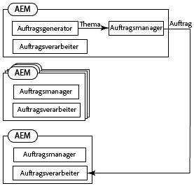
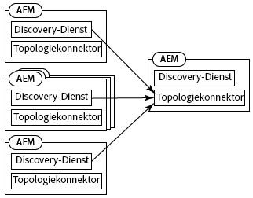
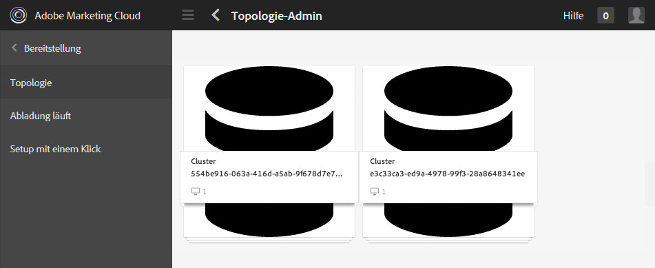
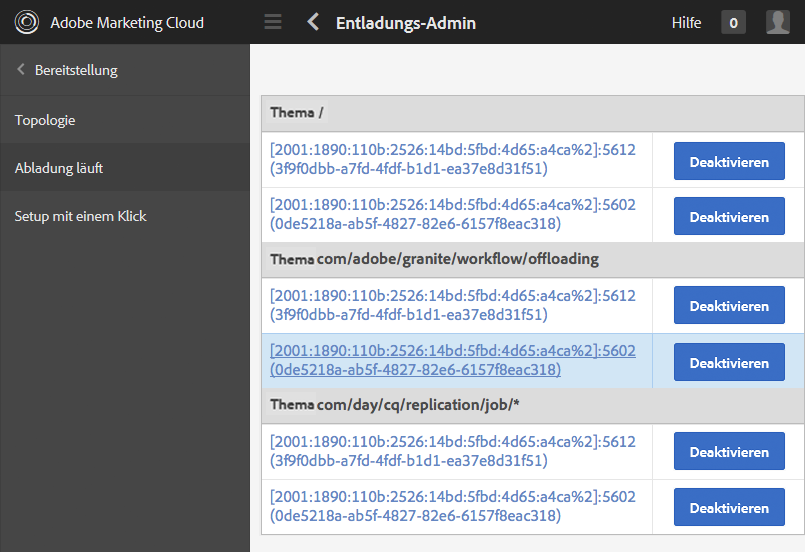
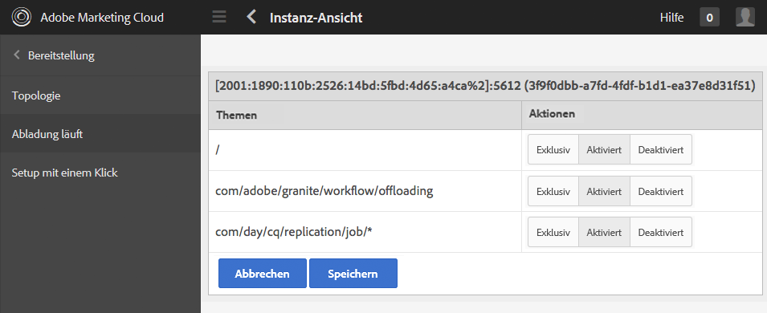
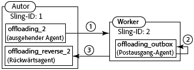
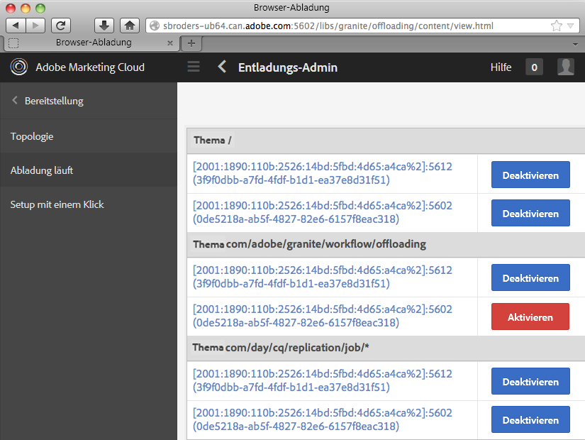

# Abladen von Aufträgen{#offloading-jobs}

## Einführung {#introduction}

Mit der Abladung werden Verarbeitungsaufgaben auf die Experience Manager-Instanzen in einer Topologie verteilt. Mit der Abladung können Sie bestimmte Experience Manager-Instanzen zur Durchführung bestimmter Verarbeitungsarten verwenden. Mit dieser gezielten Verarbeitung kann die Nutzung der verfügbaren Serverressourcen maximiert werden.

Die Abladung basiert auf den [Discovery](https://sling.apache.org/documentation/bundles/discovery-api-and-impl.html)- und JobManager-Funktionen von Apache Sling. Um die Abladung zu nutzen, müssen Sie Experience Manager-Cluster zu einer Topologie hinzufügen und die von den Clustern verarbeiteten Aufgabenthemen identifizieren. Cluster bestehen aus einer oder mehr Experience Manager-Instanzen, sodass eine Instanz als Cluster gilt.

Weitere Informationen zum Hinzufügen von Instanzen zu einer Topologie finden Sie unter [Verwalten von Topologien](/help/sites-deploying/offloading.md#administering-topologies).

### Auftragsverteilung {#job-distribution}

Mit den JobManager- und JobConsumer-Diensten von Apache Sling können Aufträge erstellt werden, die in einer Topologie verarbeitet werden:

* JobManager: Ein Dienst, der Aufträge für bestimmte Themen erstellt.
* JobConsumer: Ein Dienst, der Aufträge für ein oder mehrere Themen ausführt. Es können mehrere JobConsumer-Dienste für dasselbe Thema registriert werden.

Wenn der JobManager-Dienst einen Auftrag erstellt, wählt das Abladungs-Framework einen Experience Manager-Cluster in der Topologie aus, um diesen auszuführen:

* Der Cluster muss eine oder mehr Instanzen umfassen, auf denen ein für das Auftragsthema registrierter JobConsumer-Dienst ausgeführt wird.
* Das Thema muss für mindestens eine Instanz im Cluster aktiviert sein.

Weitere Informationen zur Optimierung der Auftragsverteilung finden Sie unter [Konfigurieren der Themenverarbeitung](/help/sites-deploying/offloading.md#configuring-topic-consumption).

Wenn das Abladungs-Framework einen Cluster für die Ausführung eines Auftrags auswählt und der Cluster mehrere Instanzen umfasst, bestimmt die Sling-Verteilung, welche Instanz im Cluster den Auftrag ausführt.

### Auftrags-Payloads {#job-payloads}

Das Abladungs-Framework unterstützt Auftrags-Payloads, die Aufträge mit Ressourcen im Repository verknüpfen. Auftrags-Payloads sind hilfreich, wenn Aufträge für Verarbeitungsressourcen erstellt werden und der Auftrag an einen anderen Computer abgeladen wird.

Bei der Erstellung eines Auftrags befindet sich die Payload nur auf der Instanz, die den Auftrag erstellt. Beim Abladen des Auftrags stellen Replikationsagenten sicher, dass die Payload auf der Instanz erstellt wird, die den Auftrag schließlich verarbeitet. Nach Ausführung des Auftrags sorgt die Rückwärtsreplikation dafür, dass die Payload wieder auf die Instanz zurück kopiert wird, die den Auftrag erstellt hat.

## Verwalten von Topologien {#administering-topologies}

Topologien sind lose verknüpfte Experience Manager-Cluster, die an der Abladung beteiligt sind. Ein Cluster besteht aus einer oder mehreren Experience Manager-Serverinstanzen (eine einzelne Instanz wird als Cluster betrachtet).

Jede Experience Manager-Instanz führt die folgenden abladungsbezogenen Dienste aus:

* Discovery-Dienst: Sendet Anfragen an einen Topologie-Connector, um Mitglied einer Topologie zu werden.
* Topologie-Connector: Empfängt die Mitgliedschaftsanfragen und akzeptiert oder lehnt sie ab.

Der Discovery-Dienst aller Topologiemitglieder verweist auf den Topologie-Connector eines der Mitglieder. Im nachfolgenden Abschnitt wird dieses Mitglied als Stamm-Mitglied bezeichnet.

Jeder Cluster in der Topologie enthält eine Instanz, die als Leader erkannt wird. Der Cluster-Leader interagiert für die anderen Cluster-Mitglieder mit der Topologie. Wenn der Leader den Cluster verlässt, wird automatisch ein neuer Leader ausgewählt.

### Anzeigen der Topologie {#viewing-the-topology}

Mit dem Topologie-Browser können Sie den Status der Topologie überprüfen, zu der die Experience Manager-Instanz gehört. Der Topologie-Browser zeigt die Cluster und Instanzen der Topologie.

Für jeden Cluster wird eine Liste der Cluster-Mitglieder angezeigt, die angibt, in welcher Reihenfolge die einzelnen Mitglieder dem Cluster beigetreten sind und welches Mitglied der Leader ist. Die Eigenschaft „Aktuell“ gibt die Instanz an, die Sie derzeit verwalten.

Für jede Instanz des Clusters werden verschiedene topologiebezogene Eigenschaften angezeigt:

* Eine Zulassungsliste mit Themen für den JobConsumer der Instanz.
* Die Endpunkte, die für die Verbindung mit der Topologie verfügbar gemacht werden
* Die Auftragsthemen, für die die Instanz für die Abladung registriert ist
* Die von der Instanz verarbeiteten Auftragsthemen

1. Klicken Sie auf der Touch-optimierten Benutzeroberfläche auf die Registerkarte „Tools“. ([http://localhost:4502/tools.html](http://localhost:4502/tools.html))
1. Klicken Sie im Bereich „Granite-Vorgänge“ auf „Browser-Abladung“.
1. Klicken Sie im Navigationsfenster auf „Topologie-Browser“.

   Die zur Topologie gehörenden Cluster werden angezeigt.

   

1. Klicken Sie auf einen Cluster, um eine Liste der Instanzen im Cluster und deren ID, aktuellen Status und Leader-Status anzuzeigen.
1. Klicken Sie auf eine Instanzen-ID, um detaillierte Eigenschaften anzuzeigen.

Sie können auch die Web-Konsole zum Anzeigen von Topologie-Informationen verwenden. Die Konsole stellt weitere Informationen zu den Topologie-Clustern bereit:

* Welche Instanz die lokale Instanz ist
* Die Topologie-Connector-Dienste, über die die Instanz eine Verbindung zur Topologie herstellt (ausgehend), und die Dienste, die eine Verbindung mit dieser Instanz herstellen (eingehend)
* Der Änderungsverlauf für die Topologie- und Instanzeigenschaften

Gehen Sie wie folgt vor, um die Seite „Topology Management“ der Web-Konsole zu öffnen:

1. Öffnen Sie die Web-Konsole in Ihrem Browser. ([http://localhost:4502/system/console](http://localhost:4502/system/console))
1. Klicken Sie auf „Main“ > „Topology Management“.

   

### Konfigurieren der Topologie-Mitgliedschaft {#configuring-topology-membership}

Der ressourcenbasierte Apache Sling-Discovery-Dienst wird auf jeder Instanz ausgeführt und steuert, wie Experience Manager-Instanzen mit einer Topologie interagieren.

Der Discovery-Dienst sendet regelmäßig POST-Anforderungen (Heartbeats) an Topologie-Connector-Dienste, um Verbindungen mit der Topologie herzustellen und aufrechtzuerhalten. Der Topologie-Connector-Dienst verwaltet eine Zulassungsliste mit IP-Adressen oder Host-Namen, die Mitglied der Topologie werden dürfen:

* Um eine Instanz zum Topologie-Mitglied zu machen, geben Sie die URL für den Topologie-Connector-Dienst des Stamm-Mitglieds an.
* Um einer Instanz zu ermöglichen, Topologie-Mitglied zu werden, fügen Sie die Instanz der Zulassungsliste für den Topologie-Connector-Dienst des Stammmitglieds hinzu.

Verwenden Sie die Web-Konsole oder einen „slign:OsgiConfig“-Knoten, um die folgenden Eigenschaften des Dienstes „org.apache.sling.discovery.impt.Config“ zu konfigurieren:

<table> 
 <tbody> 
  <tr> 
   <th>Eigenschaftsname</th> 
   <th>OSGi-Name</th> 
   <th>Beschreibung</th> 
   <th>Standardwert</th> 
  </tr> 
  <tr> 
   <td>Heartbeat-Timeout (Sekunden)</td> 
   <td>heartbeatTimeout</td> 
   <td>Die Zeit in Sekunden, die auf eine Heartbeat-Antwort gewartet wird, bevor die Targeting-Instanz als nicht verfügbar betrachtet wird. </td> 
   <td>20</td> 
  </tr> 
  <tr> 
   <td>Heartbeat-Intervall (Sekunden)</td> 
   <td>heartbeatInterval</td> 
   <td>Die Zeit in Sekunden zwischen Heartbeats.</td> 
   <td>15</td> 
  </tr> 
  <tr> 
   <td>Minimale Ereignis-Verzögerung (Sekunden)</td> 
   <td>minEventDelay</td> 
   <td>
Wenn eine Änderung an der Topologie eintritt, die Zeit der Verzögerung für die Änderung des Status von TOPOLOGY_CHANGING zu TOPOLOGY_CHANGED. Jede Änderung, die auftritt, wenn der Status TOPOLOGY_CHANGING lautet, erhöht die Verzögerung um diesen zeitlichen Wert.
 
Diese Verzögerung verhindert, dass Listener von Ereignissen überflutet werden. 
 
Soll keine Verzögerung verwendet werden, geben Sie „0“ oder eine negative Zahl an.
 </td> 
   <td>3</td> 
  </tr> 
  <tr> 
   <td>Topologie-Connectoren-URLs</td> 
   <td>topologyConnectorUrls</td> 
   <td>Die URLs der Topologie-Connector-Dienste zum Senden von Heartbeat-Nachrichten.</td> 
   <td>http://localhost:4502/libs/sling/topology/connector</td> 
  </tr> 
  <tr> 
   <td>Topologie-Connectoren-Zulassungsliste</td> 
   <td>topologyConnectorWhitelist</td> 
   <td>Die Liste von IP-Adressen oder Host-Namen, die der lokale Topologie-Connector-Dienst in der Topologie zulässt. </td> 
   <td>
localhost
 
127.0.0.1
 </td> 
  </tr> 
  <tr> 
   <td>Repository-Beschreibungsname</td> 
   <td>leaderElectionRepositoryDescriptor</td> 
   <td> </td> 
   <td>&lt;kein Wert&gt;</td> 
  </tr> 
 </tbody> 
</table>

Gehen Sie wie folgt vor, um eine CQ-Instanz mit dem Stamm-Mitglied einer Topologie zu verbinden. Die Instanz verweist dann auf die Topologie-Connector-URL des Stamm-Mitglieds der Topologie. Führen Sie diese Schritte für alle Topologiemitglieder durch.

1. Öffnen Sie die Web-Konsole in Ihrem Browser. ([http://localhost:4502/system/console](http://localhost:4502/system/console))
1. Klicken Sie auf „Main“ > „Topology Management“.
1. Klicken Sie auf „Configure Discovery Service“.
1. Fügen Sie ein Element zur Eigenschaft „Topology Connector URLs“ hinzu und geben Sie die URL des Topologie-Connector-Dienstes für das Stamm-Mitglied der Topologie an. Die URL hat die Form https://rootservername:4502/libs/sling/topology/connector.

Führen Sie die folgenden Schritte für das Stamm-Mitglied der Topologie aus. Dadurch werden die Namen der anderen Topologiemitglieder der Zulassungsliste für den Discovery-Dienst hinzugefügt.

1. Öffnen Sie die Web-Konsole in Ihrem Browser. ([http://localhost:4502/system/console](http://localhost:4502/system/console))
1. Klicken Sie auf „Main“ > „Topology Management“.
1. Klicken Sie auf „Configure Discovery Service“.
1. Fügen Sie für jedes Topologiemitglied ein Element zur Eigenschaft „Topologie-Connectoren-Zulassungsliste“ hinzu und geben Sie den Hostnamen oder die IP-Adresse des Topologiemitglieds an.

## Konfigurieren der Themenverarbeitung {#configuring-topic-consumption}

Verwenden Sie die Browser-Abladung, um die Themenverarbeitung für die Experience Manager-Instanzen in der Topologie zu konfigurieren. Sie können die von jeder Instanz verarbeiteten Themen angeben. Beispiel: Um die Topologie so zu konfigurieren, dass nur eine Instanz einen bestimmten Thementyp verarbeitet, deaktivieren Sie das Thema auf allen Instanzen bis auf eine.

Aufgaben werden mithilfe der Round-Robin-Logik auf die Instanzen verteilt, auf denen das verknüpfte Thema aktiviert ist.

1. Klicken Sie auf der Touch-optimierten Benutzeroberfläche auf die Registerkarte „Tools“. ([http://localhost:4502/tools.html](http://localhost:4502/tools.html))
1. Klicken Sie im Bereich „Granite-Vorgänge“ auf „Browser-Abladung“.
1. Klicken Sie im Navigationsfenster auf „Browser-Abladung“.

   Die Abladungsthemen und die Serverinstanzen, die die Themen verarbeiten können, werden angezeigt.

   

1. Um die Verarbeitung eines Themas für eine Instanz zu deaktivieren, klicken Sie unter dem Themennamen neben der Instanz auf „Deaktivieren“.
1. Um die Verarbeitung aller Themen für eine Instanz zu konfigurieren, klicken Sie auf die Instanz-ID unter einem beliebigen Thema.

   

1. Klicken Sie auf eine der folgenden Schaltflächen neben einem Thema, um das Verarbeitungsverhalten für die Instanz zu konfigurieren. Klicken Sie dann auf „Speichern“:

   * Aktiviert: Diese Instanz verarbeitet Aufträge für dieses Thema.
   * Deaktiviert: Diese Instanz verarbeitet keine Aufträge für dieses Thema.
   * Exklusiv: Diese Instanz verarbeitet nur Aufträge für dieses Thema.

   **Hinweis:** Wenn Sie die Option „Exklusiv“ für ein Thema auswählen, werden alle anderen Themen automatisch auf „Deaktiviert“ gesetzt.

### Installierte JobConsumer-Dienste {#installed-job-consumers}

Die Installation von Experience Manager umfasst mehrere implementierte JobConsumer-Dienste. Die Themen, für die diese JobConsumer-Dienste registriert sind, werden in der Browser-Abladung angezeigt. Bei den weiteren angezeigten Themen handelt es sich um von benutzerdefinierten JobConsumer-Diensten registrierte Themen. Die nachfolgende Tabelle beschreibt die Standard-JobConsumer-Dienste.

| Auftragsthema | Service-PID | Beschreibung |
|---|---|---|
| / | org.apache.sling.event.impl.jobs.deprecated.EventAdminBridge | Mit Apache Sling installiert. Verarbeitet Aufträge, die vom OSGi-Event-Admin-Dienst aus Gründen der Abwärtskompatibilität generiert werden. |
| com/day/cq/replication/job/&amp;ast; | com.day.cq.replication.impl.AgentManagerImpl | Ein Replikationsagent, der Auftrags-Payloads repliziert. |
| com/adobe/granite/workflow/offloading | com.adobe.granite.workflow.core.offloading.WorkflowOffloadingJobConsumer | Verarbeitet Aufträge, die der Workflow &quot;DAM Update Asset Offloader&quot;generiert. |

### Deaktivieren und Aktivieren von Themen für eine Instanz {#disabling-and-enabling-topics-for-an-instance}

Der Dienst „Apache Sling Job Consumer Manager“ stellt Eigenschaften für Themen der Zulassungs- und Blockierungsliste bereit. Konfigurieren Sie diese Eigenschaften, um die Verarbeitung von bestimmten Themen auf einer Experience Manager-Instanz zu aktivieren oder zu deaktivieren.

**Hinweis:** Wenn die Instanz zu einer Topologie gehört, können Sie Themen auch mit der Browser-Abladung auf einem beliebigen Computer der Topologie aktivieren oder deaktivieren.

Die Logik, mit der die Liste der aktivierten Themen erstellt wird, lässt zunächst alle Themen in der Zulassungsliste zu und entfernt dann Themen, die sich auf der Blockierungsliste befinden. Standardmäßig sind alle Themen aktiviert (der Wert für die Zulassungsliste lautet `*`) und keine Themen deaktiviert sind (die Blockierungsliste hat keinen Wert).

Verwenden Sie die Web-Konsole oder einen `sling:OsgiConfig`-Knoten, um die folgenden Eigenschaften zu konfigurieren. Für `sling:OsgiConfig`-Knoten lautet die PID des Job Consumer Manager-Dienstes „org.apache.sling.event.impl.jobs.JobConsumerManager“.

| Eigenschaftsname in der Web-Konsole | OSGi-ID | Beschreibung |
|---|---|---|
| Themen-Whitelist | job.consumermanager.whitelist | Eine Liste von Themen, die vom lokalen JobManager-Dienst verarbeitet werden. Der Standardwert „&amp;ast;“ sorgt dafür, dass alle Themen an den registrierten TopicConsumer-Dienst gesendet werden. |
| Themen-Blacklist | job.consumermanager.blacklist | Eine Liste der Themen, die nicht vom JobManager-Dienst verarbeitet werden. |

## Erstellen von Replikationsagenten für die Abladung {#creating-replication-agents-for-offloading}

Das Abladungs-Framework überträgt Ressourcen mittels Replikation zwischen Autoren- und Worker-Instanzen. Das Framework erstellt automatisch Replikationsagenten, wenn Instanzen Mitglied der Topologie werden. Die Agenten werden mit Standardwerten erstellt. Das von den Agenten zur Authentifizierung verwendete Kennwort muss manuell geändert werden.

>[!CAUTION]
>
>Es ist ein bekanntes Problem bei automatisch generierten Replikationsagenten, dass neue Agenten manuell erstellt werden müssen. Befolgen Sie das unter [Probleme bei der Verwendung automatisch generierter Replikationsagenten](/help/sites-deploying/offloading.md#problems-using-the-automatically-generated-replication-agents) beschriebene Verfahren, bevor Sie die Agenten für die Abladung erstellen.

Erstellen Sie die Replikationsagenten, die Auftrags-Payloads zwischen Instanzen für die Abladung übertragen. Die nachfolgende Darstellung zeigt die erforderlichen Agenten für die Abladung von der Autoren- an die Worker-Instanz. Die Autoreninstanz hat die Sling-ID 1 und die Worker-Instanz die Sling-ID 2:

Für diese Konfiguration sind die folgenden drei Agenten erforderlich:

1. Ein ausgehender Agent auf der Autoreninstanz, der eine Replikation auf der Worker-Instanz durchführt
1. Ein Rückwärtsagent auf der Autoreninstanz, der aus dem Postausgang auf der Worker-Instanz abruft
1. Einen Postausgang-Agent auf der Worker-Instanz

Dieses Replikationsschema gleicht dem für Autoren- und Veröffentlichungsinstanzen verwendeten. Bei der Abladung sind jedoch alle beteiligten Instanzen Autoreninstanzen.

>[!NOTE]
>
>Das Abladungs-Framework nutzt die Topologie zum Abrufen der IP-Adressen der Abladungsinstanzen. Basierend auf diesen IP-Adressen erstellt das Framework dann automatisch die Replikationsagenten. Falls die IP-Adressen der Abladungsinstanzen später geändert werden, wird die Änderung nach dem Neustart der Instanz automatisch in der Topologie weitergegeben. Das Abladungs-Framework aktualisiert jedoch nicht automatisch die Replikationsagenten mit den neuen IP-Adressen. Um dieses Problem zu vermeiden, verwenden Sie feste IP-Adressen für alle Instanzen der Topologie.

### Benennen der Replikationsagenten für die Abladung {#naming-the-replication-agents-for-offloading}

Verwenden Sie ein spezielles Format für die Eigenschaft ***Name*** des Replikationsagenten, damit das Abladungs-Framework automatisch den richtigen Agenten für bestimmte Worker-Instanzen nutzt.

**Benennung des ausgehenden Agenten auf der Autoreninstanz:**

`offloading_<slingid>`, wobei `<slingid>` die Sling-ID der Worker-Instanz ist.

Beispiel: `offloading_f5c8494a-4220-49b8-b079-360a72f71559`

**Benennung des Rückwärtsagenten auf der Autoreninstanz:**

`offloading_reverse_<slingid>`, wobei `<slingid>` die Sling-ID der Worker-Instanz ist.

Beispiel: `offloading_reverse_f5c8494a-4220-49b8-b079-360a72f71559`

**Benennung des Postausgangs auf der Worker-Instanz:**

`offloading_outbox`

### Erstellen des ausgehenden Agenten {#creating-the-outgoing-agent}

1. Erstellen Sie einen **Replikationsagenten** auf der Autoreninstanz. (Weitere Informationen finden Sie in der [Dokumentation zu Replikationsagenten](/help/sites-deploying/replication.md).) Geben Sie einen beliebigen **Titel an**. Der **Name** muss der Namenskonvention entsprechen.
1. Erstellen Sie den Agenten mit den folgenden Eigenschaften:

   | Eigenschaft | Wert |
   |---|---|
   | Einstellungen > Serialisierungstyp | Standard |
   | Transport > Transport-URI | https://*`<ip of target instance>`*:*`<port>`*`/bin/receive?sling:authRequestLogin=1` |
   | Transport > Transport-Benutzer | Replikationsbenutzer auf Zielinstanz |
   | Transport > Transport Passoword | Replizieren des Benutzerkennworts auf der Zielinstanz |
   | Erweitert > HTTP-Methode | POST |
   | Trigger > Standard ignorieren | True |

### Erstellen des Rückwärtsagenten {#creating-the-reverse-agent}

1. Erstellen Sie einen **Rückwärts-Replikationsagenten** auf der Autoreninstanz. (Siehe [Dokumentation für Replikationsagenten](/help/sites-deploying/replication.md). Geben Sie einen beliebigen **Titel an**. Der **Name** muss der Namenskonvention entsprechen.
1. Erstellen Sie den Agenten mit den folgenden Eigenschaften:

   | Eigenschaft | Wert |
   |---|---|
   | Einstellungen > Serialisierungstyp | Standard |
   | Transport > Transport-URI | https://*`<ip of target instance>`*:*`<port>`*`/bin/receive?sling:authRequestLogin=1` |
   | Transport > Transport-Benutzer | Replikationsbenutzer auf Zielinstanz |
   | Transport > Transport Passoword | Replizieren des Benutzerkennworts auf der Zielinstanz |
   | Erweitert > HTTP-Methode | GET |

### Erstellen des Postausgangs-Agenten {#creating-the-outbox-agent}

1. Erstellen Sie einen **Replikationsagenten** auf der Worker-Instanz. (Siehe [Dokumentation für Replikationsagenten](/help/sites-deploying/replication.md). Geben Sie einen beliebigen **Titel an**. Der **Name** muss `offloading_outbox` lauten.
1. Erstellen Sie den Agenten mit den folgenden Eigenschaften.

   | Eigenschaft | Wert |
   |---|---|
   | Einstellungen > Serialisierungstyp | Standard |
   | Transport > Transport-URI | repo://var/replication/outbox |
   | Trigger > Standard ignorieren | True |

### Suche nach der Sling-ID {#finding-the-sling-id}

Sie können die Sling-ID einer Experience Manager-Instanz mit einer der beiden folgenden Methoden abrufen:

* Öffnen Sie die Web-Konsole und suchen Sie in den Sling-Einstellungen nach dem Wert der Eigenschaft für die Sling-ID ([http://localhost:4502/system/console/status-slingsettings](http://localhost:4502/system/console/status-slingsettings)). Diese Methode ist hilfreich, wenn die Instanz noch nicht zur Topologie gehört.
* Ist sie bereits Teil der Topologie, verwenden Sie den Topologie-Browser.

## Abladen der Verarbeitung von DAM-Assets {#offloading-the-processing-of-dam-assets}

Konfigurieren Sie die Instanzen einer Topologie so, dass bestimmte Instanzen die Hintergrundverarbeitung von Assets durchführen, welche zu DAM hinzugefügt oder in DAM aktualisiert werden.

Standardmäßig führt Experience Manager den Workflow „DAM-Update-Asset“ aus, wenn ein DAM-Asset geändert oder ein Asset zu DAM hinzugefügt wird. Ändern Sie das Standardverhalten so, dass Experience Manager stattdessen den Workflow „Asset-Abladung für DAM-Update“ ausführt. Dieser Workflow generiert einen JobManager-Auftrag mit dem Thema `com/adobe/granite/workflow/offloading`. Konfigurieren Sie dann die Topologie so, dass der Auftrag an eine dedizierte Worker-Instanz abgeladen wird.

>[!CAUTION]
>
>Bei Verwendung mit Workflow-Abladung sollte kein Workflow vorübergehend sein. Beispielsweise darf sich der Workflow „DAM-Update-Asset“ nicht im Übergangsstatus befinden, wenn er für die Asset-Abladung verwendet wird. Informationen zum Festlegen/Aufheben der Übergangs-Markierung in einem Workflow finden Sie unter [Übergangs-Workflows](/help/assets/performance-tuning-guidelines.md#workflows).

Beim nachfolgenden Verfahren wird von den folgenden Merkmalen für die Abladungs-Topologie ausgegangen:

* Eine oder mehr Experience Manager-Instanzen sind Autoreninstanzen, mit denen Benutzer interagieren, um DAM-Assets hinzuzufügen oder zu aktualisieren.
* Die Benutzer interagieren nicht direkt mit einer oder mehr Experience Manager-Instanzen, die die DAM-Assets verarbeiten. Diese Instanzen sind dedizierte Instanzen für die Hintergrundverarbeitung von DAM-Assets.

1. Konfigurieren Sie den Discovery-Dienst auf allen Experience Manager-Instanzen so, dass er auf den Stamm-Topologie-Connector verweist. (Weitere Informationen finden Sie unter [Konfigurieren der Topologie-Mitgliedschaft](#title4).)
1. Konfigurieren Sie den Stamm-Topologie-Connector so, dass die damit verbundenen Instanzen auf der Zulassungsliste aufgeführt sind.
1. Öffnen Sie den Browser &quot;Abladung&quot; und deaktivieren Sie die `com/adobe/granite/workflow/offloading` Thema zu den Instanzen, mit denen Benutzer interagieren, um DAM-Assets hochzuladen oder zu ändern.

   

1. Konfigurieren Sie auf allen Instanzen, mit denen die Benutzer zum Hochladen oder Ändern von DAM-Assets interagieren, die Workflow-Starter so, dass sie den Workflow „Asset-Abladung für DAM-Update“ verwenden.

   1. Öffnen Sie die Workflow-Konsole.
   1. Klicken Sie auf die Registerkarte „Starter“.
   1. Suchen Sie nach den beiden Starter-Konfigurationen, die den Workflow „DAM-Update-Asset“ ausführen. Ein Ereignistyp für die Starter-Konfiguration ist „Knoten erstellt“ und der andere „Knoten geändert“.
   1. Ändern Sie beide Ereignistypen so, dass Sie den Workflow „Asset-Abladung für DAM-Update“ ausführen. (Weitere Informationen zu Starter-Konfigurationen finden Sie unter [Starten von Workflows bei Knotenänderungen](/help/sites-administering/workflows-starting.md).)

1. Deaktivieren Sie auf den Instanzen, die die Hintergrundverarbeitung von DAM-Assets durchführen, die Workflow-Starter, die den Workflow „DAM-Update-Asset“ ausführen.

## Weiterführende Literatur {#further-reading}

Neben den auf dieser Seite bereitgestellten, detaillierten Informationen können Sie auch folgende Abschnitte lesen:

* Weitere Information zur Verwendung von Java-APIs für die Erstellung von Aufträgen und JobConsumer-Diensten finden Sie unter [Erstellen und Nutzen von Aufträgen für die Abladung](/help/sites-developing/dev-offloading.md).
* Allgemeine Richtlinien und Best Practices für die Asset-Abladung finden Sie unter [Allgemeine Richtlinien und Best Practices für die Asset-Abladung](/help/assets/assets-offloading-best-practices.md#general-guidance-and-best-practices-for-asset-offloading).
* Weitere Informationen zum Deaktivieren der automatischen Erstellung von Abladungs-Agenten finden Sie unter [Deaktivieren der automatischen Agentenverwaltung](/help/assets/assets-offloading-best-practices.md#turning-off-automatic-agent-management).
