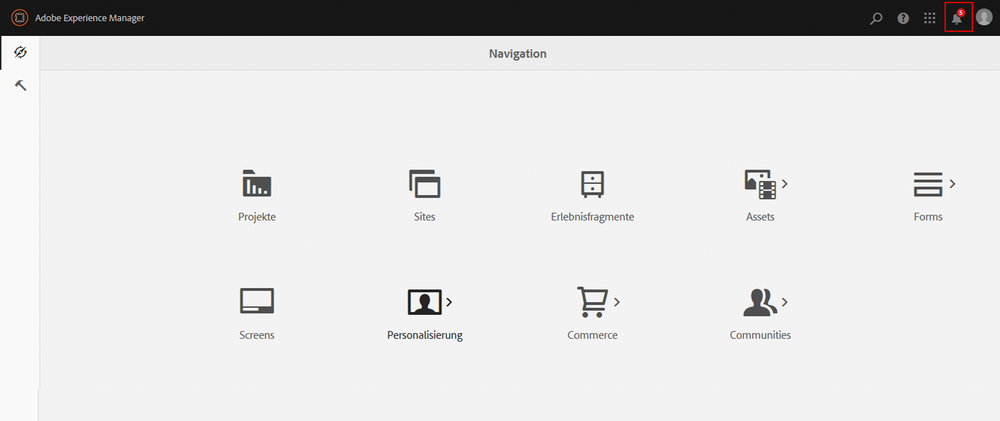
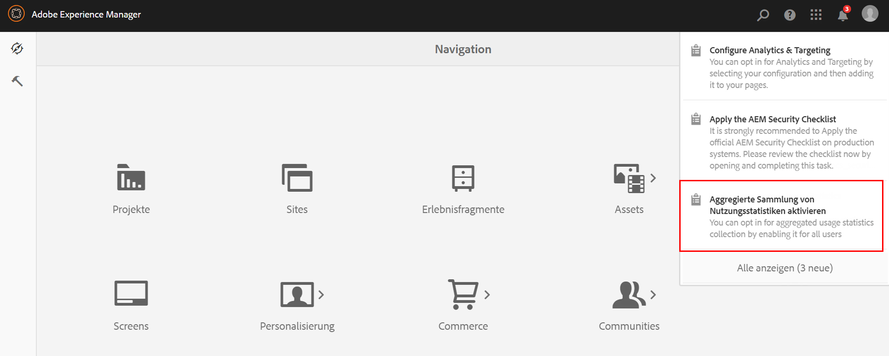
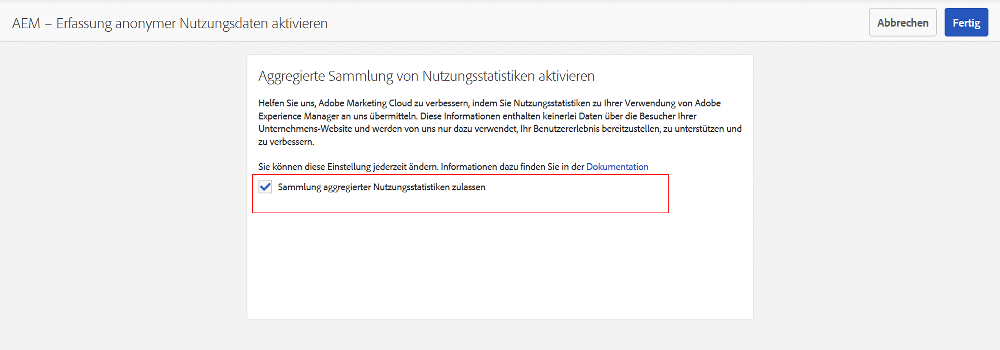
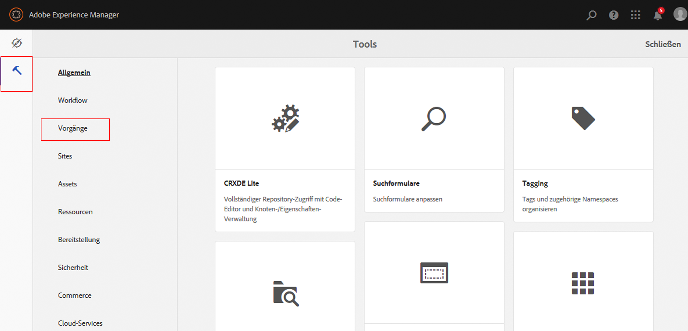
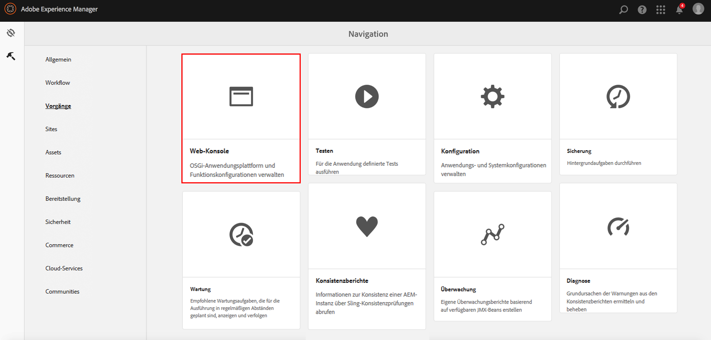

# Aktivieren der aggregierten Sammlung von Nutzungsstatistiken{#opting-into-aggregated-usage-statistics-collection}

## Einführung {#introduction}

Sie können dabei helfen, Adobe Marketing Cloud zu verbessern, indem Sie Statistiken über Ihre AEM-Interaktionen an Adobe senden. Diese Informationen enthalten keine Daten zu den Website-Besuchern Ihres Unternehmens. Sie dienen ausschließlich dazu, dass Adobe Benutzererlebnisse bereitstellen, unterstützen und verbessern kann.

Sie können die Sammlung von Nutzungsstatistiken über die Touch-Benutzeroberfläche oder die Web-Konsole aktivieren.

>[!NOTE]
>
>Es gibt verschiedene Datenschutzbestimmungen wie DSGVO und CCPA. AEM Sites kann Kunden bei der Erfüllung ihrer Datenschutz-Compliance-Pflichten unterstützen. Auf dieser Seite werden Kunden durch die Verfahren zum Aktivieren (oder Deaktivieren) der aggregierten Sammlung von Nutzungsstatistiken angeleitet.
>
>Weitere Informationen finden Sie im [Datenschutzzentrum von Adobe](https://www.adobe.com/de/privacy.html).

>[!NOTE]
>
>Sie können die Sammlungsfunktion jederzeit deaktivieren, indem Sie entweder die [Web-Konsole](/help/sites-deploying/opt-in-aggregated-usage-statistics.md#opt-in-by-using-the-web-console) verwenden oder die Opt-in-Option auf dem Opt-in-Bildschirm von AEM deaktivieren.

## Aktivieren mithilfe der Touch-Benutzeroberfläche {#opt-in-by-using-the-touch-ui}

Bei der ersten Verwendung von AEM können Sie die Sammlungsfunktion mithilfe der Touch-Benutzeroberfläche wie folgt aktivieren:

1. Klicken Sie auf dem AEM-Navigationsschirm auf das Symbol des **Posteingangs** (Glocke).

   

1. Klicken Sie in der Dropdown-Liste auf **Aggregierte Sammlung von Nutzungsstatistiken aktivieren**.

   

1. Wählen Sie auf dem Aktivierungsbildschirm **Sammlung aggregierter Nutzungsstatistiken zulassen** aus.

   

1. Klicken Sie auf **Fertig**.

## Aktivieren mithilfe der Web-Konsole {#opt-in-by-using-the-web-console}

Die Aktivierung (oder Deaktivierung) mithilfe der Web-Konsole funktioniert wie folgt:

1. Klicken Sie auf dem AEM-Navigationsbildschirm auf **Tools** und dann auf **Vorgänge**.

   

1. Klicken Sie im Fenster „Vorgänge“ auf **Web-Konsole**.

   

1. Suchen Sie nach **Aggregierte Sammlung von Nutzungsstatistiken**.
1. Klicken Sie auf das Symbol **Bearbeiten**.

   

1. Wählen Sie das Kontrollkästchen **Aktiviert** aus. Sie können auch das Kontrollkästchen deaktivieren, wenn Sie die Sammlung von Nutzungsstatistiken deaktivieren möchten.

   

1. Klicken Sie auf **Speichern**.
