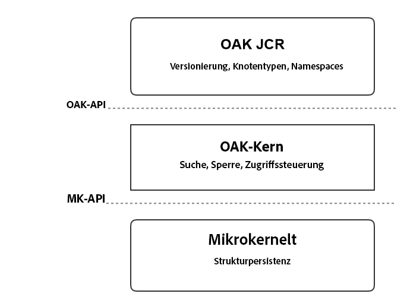
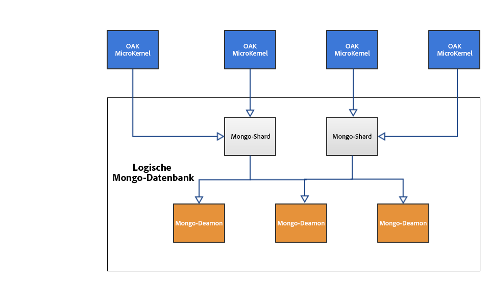

# Einführung in die AEM-Plattform{#introduction-to-the-aem-platform}

>[!CAUTION]
>
>AEM 6.4 hat das Ende der erweiterten Unterstützung erreicht und diese Dokumentation wird nicht mehr aktualisiert. Weitere Informationen finden Sie in unserer [technische Unterstützung](https://helpx.adobe.com/de/support/programs/eol-matrix.html). Unterstützte Versionen suchen [here](https://experienceleague.adobe.com/docs/?lang=de).

Die AEM-Plattform in AEM 6 basiert auf Apache Jackrabbit Oak.

Apache Jackrabbit Oak implementiert ein skalierbares und leistungsstarkes, hierarchisches Inhalts-Repository, das als Grundlage für moderne, erstklassige Websites und andere anspruchsvolle Inhaltsanwendungen dienen soll.

Es handelt sich hierbei um die Nachfolgeversion von Jackrabbit 2 und die Lösung wird von AEM 6 als Standard-Backend für dessen Inhalts-Repository, CRX, verwendet.

## Designrichtlinien und -ziele {#design-principles-and-goals}

Oak implementiert die [JSR-283](https://www.day.com/day/en/products/jcr/jsr-283.html)-Spezifikation (JCR 2.0). Hauptziele sind:

* Bessere Unterstützung für große Repositorys
* Mehrere verteilte Clusterknoten für hohe Verfügbarkeit
* Bessere Leistung
* Unterstützung für eine Vielzahl von untergeordneten Knoten und Zugriffssteuerungsebenen

## Architekturkonzept {#architecture-concept}

### Speicherung {#storage}

Die Speicherschicht hat folgenden Zweck:

* Baummodell implementieren
* Speicher als Plug-in einrichten
* Bereitstellung eines Clustering-Mechanismus

### Oak Core {#oak-core}

Der Oak-Kern fügt mehrere Ebenen zur Speicherschicht hinzu:

* Zugriffsstufenkontrollen
* Suche und Indizierung
* Beobachrung

### Oak JCR {#oak-jcr}

Das Hauptziel des Oak-JCR besteht darin, die JCR-Semantik in Strukturvorgängen zu transformieren. Darüber hinaus erfüllt es folgende Zwecke:

* Implementieren der JCR-API
* Enthält Commit-Hooks, die JCR-Einschränkungen implementieren

Darüber hinaus sind jetzt nicht-Java-basierte Implementierungen möglich, die Teil des Oak-JCR-Konzepts bilden.

## Speicherübersicht {#storage-overview}

Die Oak-Speicherschicht bietet eine Abstraktionsebene für die tatsächliche Speicherung des Inhalts.

Derzeit stehen in AEM 6 zwei Speicher zur Verfügung: der **TAR-Speicher** und der **MongoDB-Speicher**.

### Tar-Speicher {#tar-storage}

Der TAR-Speicher nutzt TAR-Dateien. Er speichert Inhalte als unterschiedliche Datensätze innerhalb größerer Segmente. Journale werden verwendet, um den aktuellen Status des Repositorys zu verfolgen.

Es gibt mehrere grundlegende Designprinzipien, um die es herum aufgebaut wurde:

* **Unveränderliche Segmente**

Die Inhalte werden in Segmenten von bis zu 256 KB gespeichert. Sie sind unveränderlich, sodass häufig genutzte Segmente problemlos zwischengespeichert und Systemfehler vermieden werden, die das Repository beschädigen können.

Jedes Segment wird durch einen eindeutigen Bezeichner (Unique Identifier, UUID) identifiziert und enthält eine kontinuierliche Teilmenge der Inhaltsstruktur. Darüber hinaus können Segmente andere Inhalte referenzieren. Jedes Segment verwaltet eine Liste von UUIDs anderer referenzierter Segmente.

* **Lokalität**

Verwandte Datensätze wie etwa ein Knoten und dessen unmittelbare, untergeordnete Elemente werden normalerweise im selben Segment gespeichert. Dadurch wird die Suche im Repository sehr schnell und die meisten Cache-Fehler für typische Clients, die auf mehr als einen zugehörigen Knoten pro Sitzung zugreifen, werden vermieden.

* **Kompaktheit**

Die Formatierung von Datensätzen ist für die Größe optimiert, um IO-Kosten zu reduzieren und so viel Inhalt wie möglich in Caches zu integrieren.

### Mongo-Speicher {#mongo-storage}

Der MongoDB-Speicher nutzt MongoDB für Sharding und Clustering. Die Repository-Struktur wird in einer MongoDB-Datenbank gespeichert, wobei jeder Knoten ein separates Dokument ist.

Sie weist mehrere Besonderheiten auf:

* Revisionen

Bei jeder Aktualisierung (Commit) von Inhalten wird eine neue Revision erstellt. Eine Revision ist im Grunde eine Zeichenfolge, die aus drei Elementen besteht:

1. Ein Zeitstempel, der von der Systemzeit des Geräts abgeleitet wird, auf dem er generiert wurde
1. Ein Zähler, der Revisionen unterscheidet, die mit demselben Zeitstempel erstellt wurden
1. Die Clusterknoten-ID, unter der die Revision erstellt wurde

* Zweige

Verzweigungen werden unterstützt, die es dem Client ermöglichen, mehrere Änderungen zu testen und sie mit einem einzigen Zusammenführungsaufruf sichtbar zu machen.

* Frühere Dokumente

Der MongoDB-Speicher fügt bei jeder Änderung Daten zu einem Dokument hinzu. Daten werden jedoch nur gelöscht, wenn explizit eine Bereinigung ausgelöst wird. Alte Daten werden verschoben, wenn ein bestimmter Grenzwert erreicht wird. Frühere Dokumente enthalten nur unveränderliche Daten, d. h. sie enthalten nur übergebene und zusammengeführte Revisionen.

* Clusterknotenmetadaten

Daten zu aktiven und inaktiven Clusterknoten werden in der Datenbank gespeichert, um Cluster-Vorgänge zu erleichtern.

Eine typische AEM-Clusterkonfiguration mit MongoDB-Speicher:

## Was unterscheidet sich von Jackrabbit 2? {#what-is-different-from-jackrabbit}

Da Oak für Abwärtskompatibilität mit dem JCR 1.0-Standard entwickelt wurde, gibt es auf Benutzerebene so gut wie keine Änderungen. Es gibt jedoch einige merkliche Unterschiede, die Sie beim Einrichten einer Oak-basierten AEM-Installation berücksichtigen müssen:

* Indizes in Oak werden nicht automatisch erstellt. Aus diesem Grund müssen bei Bedarf benutzerdefinierte Indizes erstellt werden.
* Im Gegensatz zu Jackrabbit 2, bei dem Sitzungen immer den aktuellen Status des Repositorys angegeben, zeigen Oak-Sitzungen eine unveränderte Ansicht des Repositorys zum Zeitpunkt, an dem die Sitzung erfasst wurde. Dies liegt an dem MVCC-Modell, auf dem Oak basiert.
* Same Name Siblings (SNS), d. h. untergeordnete Elemente mit demselben Namen, werden in Oak nicht unterstützt.

## Weitere plattformbezogene Dokumentation {#other-platform-related-documentation}

Weitere Informationen zur AEM Plattform finden Sie in den folgenden Artikeln:

* [Konfigurieren von Knotenspeichern und Datenspeichern in AEM 6](/help/sites-deploying/data-store-config.md)
* [Oak-Abfragen und Indizierung](/help/sites-deploying/queries-and-indexing.md)
* [Speicherelemente in AEM 6](/help/sites-deploying/storage-elements-in-aem-6.md)
* [AEM mit MongoDB](/help/sites-deploying/aem-with-mongodb.md)
