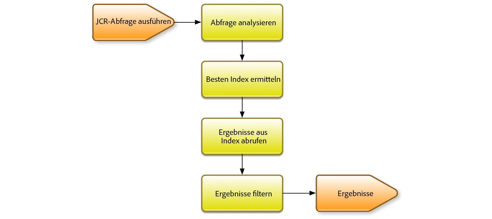

# Oak-Abfragen und Indizierung{#oak-queries-and-indexing}

>[!CAUTION]
>
>AEM 6.4 hat das Ende der erweiterten Unterstützung erreicht und diese Dokumentation wird nicht mehr aktualisiert. Weitere Informationen finden Sie in unserer [technische Unterstützung](https://helpx.adobe.com/de/support/programs/eol-matrix.html). Unterstützte Versionen suchen [here](https://experienceleague.adobe.com/docs/?lang=de).

>[!NOTE]
>
>In diesem Artikel geht es um die Konfiguration von Indizes in AEM 6. Informationen zur besten Vorgehensweise beim Optimieren von Abfragen- und Indizierungsleistung finden Sie unter [Best Practices für Abfragen und Indizierung](/help/sites-deploying/best-practices-for-queries-and-indexing.md).

## Einführung {#introduction}

Im Gegensatz zu Jackrabbit 2 indiziert Oak nicht standardmäßig Inhalte. Indizes müssen daher bei Bedarf vom Benutzer erstellt werden, ähnlich wie bei herkömmlichen relationalen Datenbanken. Wenn für eine bestimmte Abfrage kein Index vorhanden ist, werden möglicherweise viele Knoten durchlaufen. Die Abfrage funktioniert möglicherweise noch, ist aber wahrscheinlich sehr langsam.

Wenn Oak auf eine Abfrage ohne Index stößt, wird eine Protokollmeldung auf WARN-Ebene ausgegeben:

```xml
*WARN* Traversed 1000 nodes with filter Filter(query=select ...) consider creating an index or changing the query
```

## Unterstützte Abfragesprachen {#supported-query-languages}

Die Oak-Abfrage-Engine unterstützt die folgenden Sprachen:

* XPath (empfohlen)
* SQL-2
* SQL (nicht mehr unterstützt)
* JQOM

## Indextypen und Kostenberechnung {#indexer-types-and-cost-calculation}

Das auf Apache Oak basierende Backend ermöglicht die Einbindung verschiedener Indexer in das Repository.

Ein Indexer ist der **Eigenschaftsindex**, für die die Indexdefinition im Repository selbst gespeichert wird.

Implementierungen für **Apache Lucene** und **Solr** sind ebenfalls standardmäßig verfügbar und unterstützen die Volltextindizierung.

Der **Traversalindex** wird verwendet, wenn kein anderer Indexer verfügbar ist. Das bedeutet, dass der Inhalt nicht indiziert ist und Inhaltsknoten durchsucht werden, um Übereinstimmungen mit der Abfrage zu finden.

Wenn für eine Abfrage mehrere Indexer verfügbar sind, schätzt jeder verfügbare Indexer die Kosten für die Ausführung der Abfrage. Oak wählt dann den Indexer mit den niedrigsten geschätzten Kosten aus.



Das obige Diagramm stellt eine allgemeine Darstellung des Abfrageausführungsmechanismus von Apache Oak dar.

Zunächst wird die Abfrage in eine abstrakte Syntaxstruktur geparst. Anschließend wird die Abfrage überprüft und in SQL-2 umgewandelt, die für Oak-Abfragen die Muttersprache ist.

Anschließend wird jeder Index zur Schätzung der Kosten für die Abfrage herangezogen. Nach Abschluss werden die Ergebnisse aus dem billigsten Index abgerufen. Schließlich werden die Ergebnisse gefiltert, um sicherzustellen, dass der aktuelle Benutzer Lesezugriff auf das Ergebnis hat und dass das Ergebnis mit der vollständigen Abfrage übereinstimmt.

## Konfigurieren der Indizes {#configuring-the-indexes}

>[!NOTE]
>
>Hinweis: Bei großen Repositorys ist das Erstellen eines Index ein zeitaufwändiger Vorgang. Dies gilt sowohl für die anfängliche Erstellung eines Index als auch für die Neuindizierung (Neuerstellung eines Index nach Änderung der Definition). Weitere Informationen finden Sie im Beitrag zur [Fehlerbehebung in Oak-Indizes](/help/sites-deploying/troubleshooting-oak-indexes.md) in dem Abschnitt, der [Maßnahmen gegen eine langsame Neuindizierung](/help/sites-deploying/troubleshooting-oak-indexes.md#preventing-slow-re-indexing) beschreibt.

Wenn eine Neuindizierung in sehr großen Repositorys erforderlich ist, insbesondere bei der Verwendung von MongoDB und für Volltext-Indizes, sollten Sie die Textvorextraktion erwägen und oak-run verwenden, um den anfänglichen Index zu erstellen und die Neuindizierung durchzuführen.

Indizes werden als Knoten im Repository unter dem **oak:index** Knoten.

Der Typ des Indexknotens muss **oak:QueryIndexDefinition.** Für jeden Indexer sind mehrere Konfigurationsoptionen als Knoteneigenschaften verfügbar. Weitere Informationen finden Sie unten in den Konfigurationsdetails für jeden Indextyp.

### Der Eigenschaftsindex {#the-property-index}

Der Eigenschaftsindex ist im Allgemeinen für Abfragen nützlich, die Eigenschaftseinschränkungen aufweisen, aber keine Volltext-Elemente sind. Der Index kann wie folgt konfiguriert werden:

1. Öffnen Sie CRXDE, indem Sie zu `http://localhost:4502/crx/de/index.jsp` gehen.
1. Erstellen Sie einen neuen Knoten unter **oak:index**
1. Benennen Sie den Knoten . **PropertyIndex** und legen Sie den Knotentyp auf **oak:QueryIndexDefinition**
1. Legen Sie die folgenden Eigenschaften für den neuen Knoten fest:

   * **type:** `property` (vom Typ Zeichenfolge)
   * **propertyNames:** `jcr:uuid` (vom Typ „Name“)

   Bei diesem Beispiel wird die Eigenschaft `jcr:uuid` indiziert, die dazu dient, die UUID (Universally Unique Identifier) des verknüpften Knotens anzuzeigen.

1. Speichern Sie die Änderungen.

Der Eigenschaftsindex verfügt über die folgenden Konfigurationsoptionen:

* Die Eigenschaft **type** gibt den Indextyp an und muss in diesem Fall **property** lauten.

* Die **propertyNames** -Eigenschaft gibt die Liste der Eigenschaften an, die im Index gespeichert werden. Wenn dies fehlt, wird der Knotenname als Referenzwert für den Eigenschaftsnamen verwendet. In diesem Beispiel wird die **jcr:uuid** -Eigenschaft, deren Auftrag darin besteht, die eindeutige Kennung (UUID) ihres Knotens anzuzeigen, wird zum Index hinzugefügt.

* Falls für die Kennzeichnung **unique** der Wert **true** festgelegt ist, wird dadurch eine Eindeutigkeitsbeschränkung auf den Eigenschaften-Index angewendet.

* Mit der Eigenschaft **declaringNodeTypes** können Sie einen bestimmten Knotentyp angeben, der für den Index gilt.
* Die **reindex** Markierung, die, wenn **true**, wird eine vollständige Neuindizierung des Inhalts Trigger.

### Der sortierte Index {#the-ordered-index}

Der Index &quot;Geordnet&quot;ist eine Erweiterung des Eigenschaftenindex. Sie wird jedoch nicht mehr unterstützt. Indizes dieses Typs müssen durch den [Lucene-Eigenschaften-Index](#the-lucene-property-index) ersetzt werden.

### Der Lucene-Volltext-Index {#the-lucene-full-text-index}

AEM 6 beinhaltet einen auf Apache Lucene basierten Indexer.

Wenn ein Volltext-Index konfiguriert ist, verwenden alle Abfragen mit einer Volltext-Bedingung den Volltext-Index, unabhängig davon, ob andere Bedingungen indiziert sind oder ob eine Pfadbeschränkung vorliegt.

Wenn kein Volltext-Index konfiguriert ist, funktionieren Abfragen mit Volltext-Bedingungen nicht erwartungsgemäß.

Da der Index über einen asynchronen Hintergrund-Thread aktualisiert wird, sind einige Volltextsuchen für einen kurzen Zeitraum nicht verfügbar, bis die Hintergrundprozesse abgeschlossen sind.

Sie können einen Lucene-Volltext-Index wie folgt konfigurieren:

1. Öffnen Sie CRXDE und erstellen Sie einen neuen Knoten unter **oak:index**.
1. Benennen Sie den Knoten . **LuceneIndex** und legen Sie den Knotentyp auf **oak:QueryIndexDefinition**
1. Fügen Sie dem Knoten folgende Eigenschaften hinzu:

   * **type:** `lucene` (vom Typ Zeichenfolge)
   * **async:** `async` (vom Typ Zeichenfolge)

1. Speichern Sie die Änderungen.

Der Lucene-Index verfügt über die folgenden Konfigurationsoptionen:

* Die **type** -Eigenschaft, die den Indextyp angibt, muss auf **Lucene**
* Die **asynchron** -Eigenschaft, die auf **asynchron**. Dadurch wird der Index-Aktualisierungsprozess an einen Hintergrund-Thread gesendet.
* Die **includePropertyTypes** -Eigenschaft, die definiert, welche Untergruppe von Eigenschaftstypen in den Index aufgenommen wird.
* Die Eigenschaft **excludePropertyNames**, die eine Blockierungsliste mit Eigenschaftennamen definiert, d. h. Eigenschaften, die vom Index ausgeschlossen sein sollen.
* Die **reindex** Markierung, die bei Festlegung auf **true**, Trigger eine vollständige Neuindizierung des Inhalts.

### Der Lucene-Eigenschaftsindex {#the-lucene-property-index}

Seit **Oak 1.0.8** kann Lucene zum Erstellen von Indizes verwendet werden, die Eigenschaftenbeschränkungen beinhalten, die nicht Volltext sind.

Um einen Lucene-Eigenschaftsindex zu erhalten, muss die **fulltextEnabled** -Eigenschaft muss immer auf &quot;false&quot;gesetzt sein.

Sehen wir uns folgende Beispielabfrage an: 

```xml
select * from [nt:base] where [alias] = '/admin'
```

Um einen Lucene-Eigenschaften-Index für die obige Abfrage zu definieren, können Sie folgende Definition hinzufügen, indem Sie unter **oak:index:** einen neuen Knoten erstellen.

* **Name:** `LucenePropertyIndex`
* **Typ:** `oak:QueryIndexDefinition`

Sobald der Knoten erstellt wurde, fügen Sie die folgenden Eigenschaften hinzu:

* **Typ:**

   ```
   lucene (of type String)
   ```

* **asynchron:**

   ```
   async (of type String)
   ```

* **fulltextEnabled:**

   ```
   false (of type Boolean)
   ```

* **includePropertyNames:** `[alias]` (vom Typ String)

>[!NOTE]
>
>Verglichen mit dem normalen Eigenschaften-Index ist der Lucene-Eigenschaften-Index immer im asynchronen Modus konfiguriert. Daher entsprechen die vom Index ausgegebenen Ergebnisse möglicherweise nicht immer dem aktuellen Stand des Repositorys.

>[!NOTE]
>
>Weitere Informationen zum Lucene-Eigenschaften-Index finden Sie auf der Dokumentationsseite zu [Apache Jackrabbit Oak Lucene](https://jackrabbit.apache.org/oak/docs/query/lucene.html).

### Lucene Analyzer {#lucene-analyzers}

Seit Version 1.2.0 unterstützt Oak Lucene-Analyzer.

Analyzer werden sowohl bei der Indizierung eines Dokuments als auch bei der Abfrage verwendet. Ein Analyzer überprüft den Text von Feldern und generiert einen Token-Stream. Lucene-Analyzer bestehen aus einer Reihe von Token- und Filterklassen.

Die Analyzer können über den Knoten `analyzers` (vom Typ `nt:unstructured`) in der Definition `oak:index` konfiguriert werden.

Der Standard-Analyzer für einen Index wird im untergeordneten Knoten `default` des Analyzer-Knotens konfiguriert.


>[!NOTE]
>
>Eine Liste der verfügbaren Analyzer finden Sie in der API-Dokumentation der verwendeten Lucene-Version.

#### Direktes Angeben der Analyzer-Klasse {#specifying-the-analyzer-class-directly}

Wenn Sie einen vordefinierten Analyzer verwenden möchten, können Sie ihn wie folgt konfigurieren:

1. Suchen Sie im Knoten `oak:index` nach dem Index, mit dem Sie den Analyzer verwenden möchten.

1. Erstellen Sie unter dem Index einen untergeordneten Knoten `default` vom Typ `nt:unstructured`.

1. Fügen Sie dem Knoten „default“ eine Eigenschaft mit folgenden Eigenschaften hinzu:

   * **Name:** `class`
   * **Typ:** `String`
   * **Wert:** `org.apache.lucene.analysis.standard.StandardAnalyzer`

   Der Wert ist der Name der Analyzer-Klasse, die Sie verwenden möchten.

   Sie können auch einen Analyzer für eine bestimmte Lucene-Version festlegen, indem Sie die optionale String-Eigenschaft `luceneMatchVersion` verwenden. Eine gültige Syntax für die Verwendung mit Lucene 4.7 sieht wie folgt aus:

   * **Name:** `luceneMatchVersion`
   * **Typ:** `String`
   * **Wert:** `LUCENE_47`

   Wenn `luceneMatchVersion` nicht angegeben ist, verwendet Oak die im Lieferumfang enthaltene Version von Lucene.

1. Wenn Sie eine Stoppwörter-Datei zu Analyzer-Konfigurationen hinzufügen möchten, können Sie einen neuen Knoten unter dem Knoten `default` mit folgenden Eigenschaften erstellen:

   * **Name:** `stopwords`
   * **Typ:** `nt:file`

#### Erstellen von Analyzern durch Komposition {#creating-analyzers-via-composition}

Analyzer können auch anhand der Eigenschaften `Tokenizers`, `TokenFilters` und `CharFilters` zusammengestellt werden. Geben Sie dazu einen Analyzer an und erstellen Sie untergeordnete Knoten der optionalen Tokenizer und Filter, die in der aufgelisteten Reihenfolgen angewendet werden. Siehe auch [https://wiki.apache.org/solr/AnalyzersTokenizersTokenFilters#Specifying_an_Analyzer_in_the_schema](https://wiki.apache.org/solr/AnalyzersTokenizersTokenFilters#Specifying_an_Analyzer_in_the_schema)

Sehen Sie sich diese Knotenstruktur als Beispiel an:

* **Name:** `analyzers`

   * **Name:** `default`

      * **Name:** `charFilters`
      * **Typ:** `nt:unstructured`

         * **Name:** `HTMLStrip`
         * **Name:** `Mapping`
      * **Name:** `tokenizer`

         * **Eigenschaftsname:** `name`

            * **Typ:** `String`
            * **Wert:** `Standard`
      * **Name:** `filters`
      * **Typ:** `nt:unstructured`

         * **Name:** `LowerCase`
         * **Name:** `Stop`

            * **Eigenschaftsname:** `words`

               * **Typ:** `String`
               * **Wert:** `stop1.txt, stop2.txt`
            * **Name:** `stop1.txt`

               * **Typ:** `nt:file`
            * **Name:** `stop2.txt`

               * **Typ:** `nt:file`


Der Name der Filter, charFilters und tokenizers wird gebildet, indem die Factory-Suffixe entfernt werden. So:

* `org.apache.lucene.analysis.standard.StandardTokenizerFactory` wird zu `standard`

* `org.apache.lucene.analysis.charfilter.MappingCharFilterFactory` wird zu `Mapping`

* `org.apache.lucene.analysis.core.StopFilterFactory` wird zu `Stop`

Jeder für die Factory erforderliche Konfigurationsparameter wird als Eigenschaft des betreffenden Knotens angegeben.

In Fällen wie beim Laden von Stoppwörtern, bei denen Inhalt aus externem Dateien geladen werden muss, kann der Inhalt als untergeordneter Knoten vom Typ `nt:file` für die betroffene Datei bereitgestellt werden.

### Der Solr-Index {#the-solr-index}

Der Solr-Index dient hauptsächlich der Volltextsuche, kann aber auch zur Indexsuche nach Pfad, Eigenschaftsbeschränkungen und primären Typbeschränkungen verwendet werden. Das bedeutet, dass der Solr-Index in Oak für jede Art von JCR-Abfrage verwendet werden kann.

Die Integration in AEM erfolgt auf Repository-Ebene, sodass Solr einer der möglichen Indizes ist, die in Oak verwendet werden können, der neuen, mit AEM gelieferten Repository-Implementierung.

AEM kann auch für die Verwendung mit einer Remote-Solr-Serverinstanz konfiguriert werden:

1. Laden Sie die neueste Version von Solr herunter und extrahieren Sie sie. Weitere Informationen hierzu finden Sie im [Dokumentation zur Installation von Apache Solr](https://cwiki.apache.org/confluence/display/solr/Installing+Solr).
1. Erstellen Sie zwei Solr-Shards. Erstellen Sie dazu Ordner für jede Datei im Ordner, in den Solr hochgeladen wurde:

   * Erstellen Sie für das erste Shard folgenden Ordner:

   `<solrunpackdirectory>\aemsolr1\node1`

   * Erstellen Sie für das zweite Shard folgenden Ordner: 

   `<solrunpackdirectory>\aemsolr2\node2`

1. Suchen Sie die Beispiel-Instanz im Solr-Paket. Sie befindet sich in der Regel im Ordner `example` im Stammverzeichnis des Pakets.
1. Kopieren Sie die folgenden Ordner von der Beispiel-Instanz in die Ordner der zwei Shards (`aemsolr1\node1` und `aemsolr2\node2`):

   * `contexts`
   * `etc`
   * `lib`
   * `resources`
   * `scripts`
   * `solr-webapp`
   * `webapps`
   * `start.jar`

1. Erstellen Sie in jedem der beiden Shard-Ordner einen neuen Ordner mit dem Namen `cfg`.
1. Speichern Sie die Solr- und ZooKeeper-Konfigurationsdateien in den neu erstellten `cfg`-Ordnern.

   >[!NOTE]
   >
   >Weitere Informationen zur Solr- und ZooKeeper-Konfiguration finden Sie in der Dokumentation zur [Solr-Konfiguration](https://wiki.apache.org/solr/ConfiguringSolr) bzw. im [ZooKeeper-Handbuch „Erste Schritte“](https://zookeeper.apache.org/doc/r3.1.2/zookeeperStarted.html).

1. Starten Sie den ersten Shard mit ZooKeeper-Unterstützung, indem Sie zu `aemsolr1\node1` wechseln und folgenden Befehl ausführen:

   ```xml
   java -Xmx2g -Dbootstrap_confdir=./cfg/oak/conf -Dcollection.configName=myconf -DzkRun -DnumShards=2 -jar start.jar
   ```

1. Starten Sie den zweiten Shard, indem Sie zu `aemsolr2\node2` wechseln und folgenden Befehl ausführen:

   ```xml
   java -Xmx2g -Djetty.port=7574 -DzkHost=localhost:9983 -jar start.jar
   ```

1. Wenn Sie beide Shards gestartet haben, testen Sie die ordnungsgemäße Funktion, indem Sie eine Verbindung zur Solr-Schnittstelle unter `http://localhost:8983/solr/#/` /#/ herstellen.
1. Starten Sie AEM und wechseln Sie zur Web-Konsole unter `http://localhost:4502/system/console/configMgr`
1. Legen Sie folgende Konfiguration unter **Oak Solr remote server configuration** fest:

   * Solr-HTTP-URL: `http://localhost:8983/solr/`

1. Wählen Sie **Remote Solr** in der Dropdown-Liste unter dem Serveranbieter **Oak Solr** aus.

1. Gehen Sie zu CRXDE und melden Sie sich als Administrator an.
1. Erstellen Sie einen neuen Knoten mit dem Namen **solrIndex** under **oak:index** und legen Sie die folgenden Eigenschaften fest:

   * **type:**solr (vom Typ &quot;String&quot;)
   * **async:**async (vom Typ String)
   * **reindex:**true (vom Typ Boolean)

1. Speichern Sie die Änderungen.

#### Empfohlene Konfiguration für Solr {#recommended-configuration-for-solr}

Nachfolgend finden Sie ein Beispiel für eine Basiskonfiguration, die mit allen drei Solr-Bereitstellungen verwendet werden kann, die in diesem Artikel beschrieben werden. Es werden die dedizierten Eigenschaftenindizes erfasst, die bereits in AEM vorhanden sind und nicht mit anderen Anwendungen verwendet werden sollten.

Für die richtige Verwendung müssen Sie die Inhalte im Archiv direkt im Solr-Basisverzeichnis speichern. Bei Bereitstellungen mit mehreren Knoten muss der Inhalt direkt in den Stammorder der einzelnen Knoten gespeichert werden.

Empfohlene Solr-Konfigurationsdateien

[Datei laden](assets/recommended-conf.zip)

### AEM-Indizierungs-Tools {#aem-indexing-tools}

In AEM 6.1 sind auch zwei Indizierungs-Tools aus AEM 6.0 integriert, die Teil der Adobe Consulting Services Commons-Tools sind:

1. **Explain Query**: ein Tool, das Admins das Verständnis erleichtert, wie Abfragen ausgeführt werden.
1. **Oak Index Manager**, eine Webbenutzeroberfläche zur Pflege vorhandener Indizes.

Sie können sie jetzt erreichen, indem Sie **Tools - Vorgänge - Dashboard - Diagnose** über den AEM Willkommensbildschirm aus.

Weitere Informationen zu ihrer Verwendung finden Sie unter [Dokumentation zum Vorgangs-Dashboard](/help/sites-administering/operations-dashboard.md).

#### Erstellen von Eigenschaftenindizes über OSGi {#creating-property-indexes-via-osgi}

Das ACS Commons-Paket stellt auch OSGi-Konfigurationen bereit, die zum Erstellen von Eigenschaftenindizes verwendet werden können.

Sie können über die Web-Konsole darauf zugreifen, indem Sie nach **Oak-Eigenschaftenindex sicherstellen**&quot;.


### Fehlerbehebung bei Indizierungsproblemen {#troubleshooting-indexing-issues}

Situationen können auftreten, in denen die Ausführung von Abfragen lange dauert und die allgemeine Systemreaktionszeit langsam ist.

In diesem Abschnitt werden einige Empfehlungen gegeben, wie Sie vorgehen sollten, um die Ursache dieser Probleme zu finden und diese zu beheben.

#### Vorbereiten von Debugging-Informationen für Analysen {#preparing-debugging-info-for-analysis}

Die einfachste Möglichkeit, die erforderlichen Informationen für die ausgeführte Abfrage zu erhalten, ist über die [Tool &quot;Abfrage erläutern&quot;](/help/sites-administering/operations-dashboard.md#explain-query). Auf diese Weise können Sie die genauen Informationen erfassen, die zum Debuggen einer langsamen Abfrage erforderlich sind, ohne die Informationen auf Protokollebene einsehen zu müssen. Dies ist hilfreich, wenn Sie wissen, welche Abfrage debuggt werden soll.

Wenn dies aus irgendeinem Grund nicht möglich ist, können Sie die Indizierungsprotokolle in einer einzigen Datei sammeln und sie zur Fehlerbehebung für Ihr bestimmtes Problem verwenden.

#### Aktivieren der Protokollierung {#enable-logging}

Um die Protokollierung zu aktivieren, müssen Sie **DEBUG** Ebenenprotokolle für die Kategorien, die sich auf Oak-Indizierung und -Abfragen beziehen. Diese Kategorien sind: 

* org.apache.jackrabbit.oak.plugins.index
* org.apache.jackrabbit.oak.query
* com.day.cq.search

Die **com.day.cq.search** -Kategorie ist nur anwendbar, wenn Sie das AEM bereitgestellte QueryBuilder-Dienstprogramm verwenden.

>[!NOTE]
>
>Es ist wichtig, für Protokolle nur für die Dauer der problematischen Abfrage, die Sie debuggen, DEBUG festzulegen, da andernfalls über einen längeren Zeitraum sehr viele Ereignisse in den Protokollen erzeugt werden. Daher wechseln Sie nach der Erfassung der erforderlichen Protokolle für die oben genannten Kategorien zurück zur Protokollierung auf INFO-Ebene.

Sie können die Protokollierung aktivieren, indem Sie folgende Schritte ausführen:

1. Lassen Sie Ihren Browser auf `https://serveraddress:port/system/console/slinglog` verweisen.
1. Klicken Sie auf die Schaltfläche **Neue Protokollierung hinzufügen** unten in der Konsole.

1. Fügen Sie die oben genannten Kategorien in der neu erstellten Reihe hinzu. Verwenden Sie das **+**-Symbol, um einer Protokollierung mehr als eine Kategorie hinzuzufügen. 

1. Wählen Sie **DEBUG** aus der Dropdown-Liste **Protokollebene** aus.

1. Geben Sie als Ausgabedatei `logs/queryDebug.log` an. Dadurch werden alle DEBUG-Ereignisse in einer Protokolldatei zusammengefasst.

1. Führen Sie die Abfrage aus oder geben Sie die Seite aus, auf der die Abfrage verwendet wird, die Sie debuggen möchten.

1. Wenn Sie die Abfrage ausgeführt haben, wechseln Sie zurück zur Protokollierungskonsole und ändern Sie die Protokollierungsebene der neu erstellten Protokollierung in **INFO**.

#### Indexkonfiguration {#index-configuration}

Die Art und Weise, wie die Abfrage ausgewertet wird, wird durch die Indexkonfiguration stark beeinflusst. Es ist wichtig, die Indexkonfiguration abzurufen, um analysiert oder an die Unterstützung gesendet zu werden. Sie können die Konfiguration entweder als Inhaltspaket abrufen oder eine JSON-Ausgabedarstellung abrufen.

Da die Indexkonfiguration in den meisten Fällen unter dem Knoten `/oak:index` in CRXDE gespeichert ist, können Sie die JSON-Version unter folgender Adresse abrufen:

`https://serveraddress:port/oak:index.tidy.-1.json`

Wenn der Index an einem anderen Speicherort konfiguriert ist, ändern Sie den Pfad entsprechend.

#### MBean-Ausgabe {#mbean-output}

In einigen Fällen ist es hilfreich, die Ausgabe von index-bezogenen MBeans zum Debugging bereitzustellen. Gehen Sie dazu wie folgt vor:

1. Wechseln Sie zur JMX-Konsole unter:
   `https://serveraddress:port/system/console/jmx`

1. Suchen Sie nach den folgenden MBeans:

   * Lucene-Indexstatistiken
   * CopyOnRead-Unterstützungsstatistiken
   * Oak Query Statistics
   * IndexStats

1. Klicken Sie auf die einzelnen MBeans, um die Leistungsstatistiken anzuzeigen. Erstellen Sie einen Screenshot oder halten Sie die Daten fest, falls Sie diese an den Support weitergeben müssen.

Sie können auch die JSON-Version dieser Statistiken unter folgenden URLs abrufen:

* `https://serveraddress:port/system/sling/monitoring/mbeans/org/apache/jackrabbit/oak/%2522LuceneIndex%2522.tidy.-1.json`
* `https://serveraddress:port/system/sling/monitoring/mbeans/org/apache/jackrabbit/oak/%2522LuceneIndex%2522.tidy.-1.json`
* `https://serveraddress:port/system/sling/monitoring/mbeans/org/apache/jackrabbit/oak/%2522LuceneIndex%2522.tidy.-1.json`
* `https://serveraddress:port/system/sling/monitoring/mbeans/org/apache/jackrabbit/oak/%2522LuceneIndex%2522.tidy.-1.json`

Sie können die konsolidierte JMX-Ausgabe auch über `https://serveraddress:port/system/sling/monitoring/mbeans/org/apache/jackrabbit/oak.tidy.3.json` bereitstellen. Hierdurch werden alle Oak-spezifischen MBean-Details im JSON-Format erfasst.

#### Weitere Details {#other-details}

Sie können zusätzliche Details sammeln, um die Problembehebung zu unterstützen, z. B.:

1. Die Oak-Version, auf der Ihre Instanz ausgeführt wird. Öffnen Sie dazu CRXDE. Die Version wird unten rechts auf der Begrüßungsseite anzeigt. Sie können die Version auch im `org.apache.jackrabbit.oak-core`-Bundle überprüfen.
1. Die Ausgabe des QueryBuilder-Debugger zu der problematischen Abfrage. Der Debugger kann unter `https://serveraddress:port/libs/cq/search/content/querydebug.html` aufgerufen werden.
