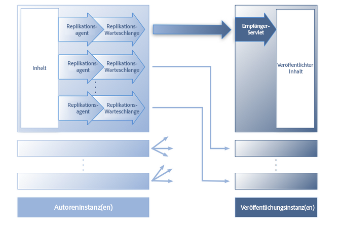
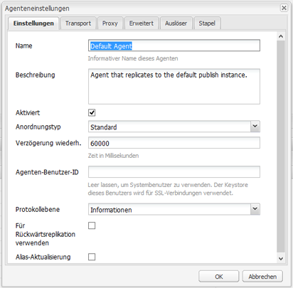
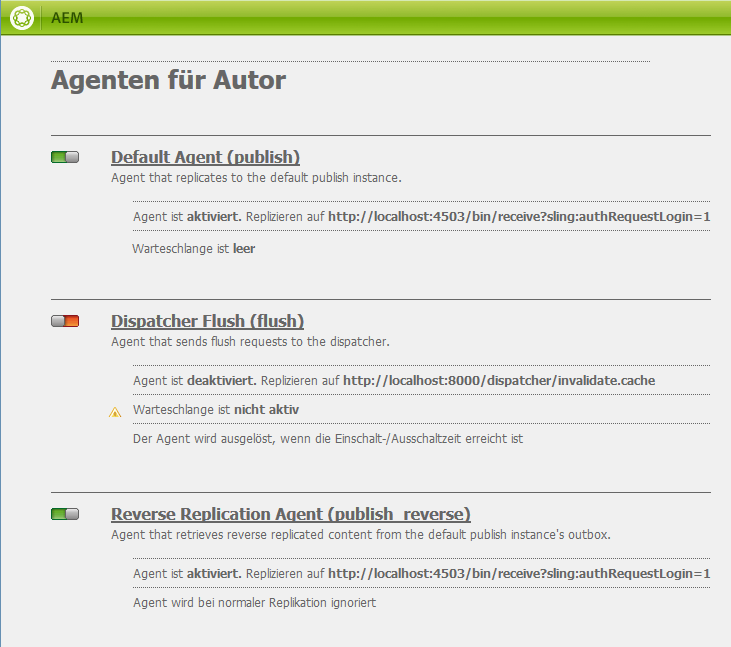
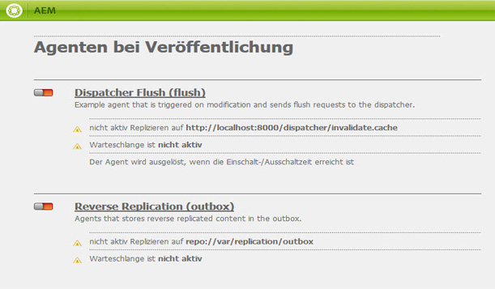
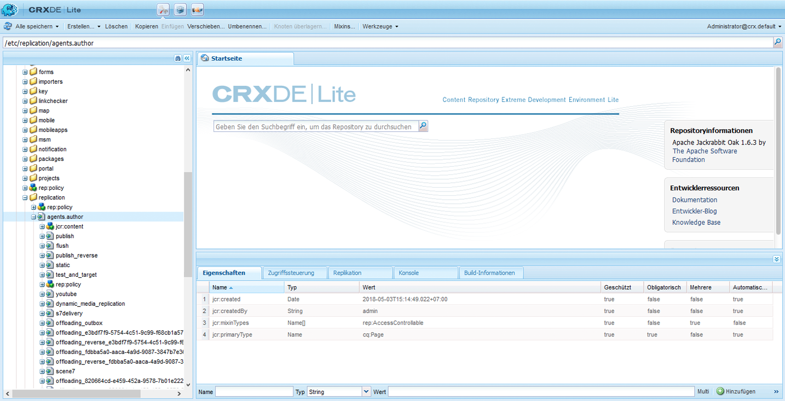
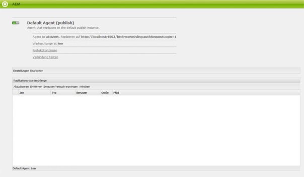

# Replikation{#replication}

>[!CAUTION]
>
>AEM 6.4 hat das Ende der erweiterten Unterstützung erreicht und diese Dokumentation wird nicht mehr aktualisiert. Weitere Informationen finden Sie in unserer [technische Unterstützung](https://helpx.adobe.com/de/support/programs/eol-matrix.html). Unterstützte Versionen suchen [here](https://experienceleague.adobe.com/docs/?lang=de).

Replikationsagenten sind von zentraler Bedeutung für Adobe Experience Manager (AEM), da der Mechanismus verwendet wird, um:

* [Veröffentlichen (aktivieren)](/help/sites-authoring/publishing-pages.md#publishing-pages) Inhalt von einem Autor in eine Veröffentlichungsumgebung.
* Explizites Leeren von Inhalten aus dem Dispatcher-Cache.
* Gibt Benutzereingaben (z. B. Formulareingaben) aus der Veröffentlichungsumgebung an die Autorenumgebung zurück (unter Kontrolle der Autorenumgebung).

Anforderungen sind [in Warteschlange](/help/sites-deploying/osgi-configuration-settings.md) an den entsprechenden Agenten für die Verarbeitung.

>[!NOTE]
>
>Benutzerdaten (Benutzer, Benutzergruppen und Benutzerprofile) werden nicht zwischen Autoren- und Veröffentlichungsinstanzen repliziert.
>
>Bei mehreren Veröffentlichungsinstanzen werden Benutzerdaten Sling verteilt, wenn [Benutzersynchronisierung](/help/sites-administering/sync.md) aktiviert ist.

## Replizieren von der Autoren- zur Veröffentlichungsinstanz {#replicating-from-author-to-publish}

Die Replikation auf einer Veröffentlichungsinstanz oder einem Dispatcher erfolgt in mehreren Schritten:

* der Autor fordert die Veröffentlichung (Aktivierung) bestimmter Inhalte an; kann durch eine manuelle Anfrage oder durch vorkonfigurierte automatische Trigger initiiert werden.
* Die Anforderung wird an den entsprechenden standardmäßigen Replikationsagenten übergeben. Eine Umgebung kann über mehrere Standardagenten verfügen, die für solche Aktionen immer ausgewählt werden.
* Der Replikationsagent &quot;packt&quot;den Inhalt und legt ihn in die Replikationswarteschlange.
* auf der Registerkarte Websites [Farbstatus-Anzeige](/help/sites-authoring/publishing-pages.md#determining-publication-status) für die einzelnen Seiten festgelegt ist.
* Der Inhalt wird aus der Warteschlange entfernt und mithilfe des konfigurierten Protokolls in die Veröffentlichungsumgebung übertragen. normalerweise HTTP.
* Ein Servlet in der Veröffentlichungsumgebung empfängt die Anforderung und veröffentlicht die erhaltenen Inhalte. Das Standard-Servlet ist `http://localhost:4503/bin/receive`.

* Es können mehrere Autoren- und Veröffentlichungsumgebungen konfiguriert werden.

## Replizieren von der Veröffentlichungsinstanz zur Autoreninstanz {#replicating-from-publish-to-author}

Einige Funktionen ermöglichen es Benutzern, Daten in einer Veröffentlichungsinstanz einzugeben.

In manchen Fällen ist eine bestimmte Form der Replikation erforderlich (die sog. Rückwärtsreplikation), um diese Daten an die Autorenumgebung zurückzuleiten, von wo sie erneut an andere Veröffentlichungsumgebungen verteilt werden. Aus Sicherheitsgründen muss der gesamte Traffic von der Veröffentlichungs- an die Autorenumgebung streng kontrolliert werden.

Die Rückwärtsreplikation nutzt einen Agenten in der Veröffentlichungsumgebung, der die Autorenumgebung referenziert. Dieser Agent legt die Daten in einem Postausgang ab. Diesem Postausgang sind Replikations-Listener in der Autorenumgebung zugeordnet. Die Listener fragen die Postausgänge ab, um darin abgelegte Daten abzurufen und diese dann ggf. zu verteilen. Dadurch wird sichergestellt, dass die Autorenumgebung den gesamten Traffic steuert.

In anderen Fällen, z. B. bei Communities-Funktionen (z. B. Foren, Blogs, Kommentare und Bewertungen), ist es schwierig, die Menge der in der Veröffentlichungsumgebung eingegebenen benutzergenerierten Inhalte (UGC) effizient mithilfe der Replikation zwischen AEM Instanzen zu synchronisieren.

AEM [Communities](/help/communities/overview.md) verwendet keine Replikation für benutzergenerierte Inhalte. Stattdessen ist zur Bereitstellung von benutzergenerierten Inhalten für Communities ein Common Store erforderlich (siehe [Community-Inhaltsspeicher](/help/communities/working-with-srp.md)).

## Replikation – vorkonfiguriert {#replication-out-of-the-box}

Die Geometrixx-Website, die in einer Standardinstallation von AEM enthalten ist, kann zur Veranschaulichung der Replikation verwendet werden.

Um diesem Beispiel zu folgen und die Standard-Replikationsagenten zu verwenden, müssen Sie [AEM installieren](/help/sites-deploying/deploy.md) und dabei Folgendes konfigurieren:

* die Autorenumgebung an Port `4502`
* die Veröffentlichungsumgebung an Port `4503`

>[!NOTE]
>
>Standardmäßig aktiviert :
>
>* Agenten für Autor : Standardagent (publish)
>
>Standardmäßig deaktiviert (ab AEM 6.1) :
>
>* Agenten für Autor: Rückwärtsreplikationsagent („publish_reverse“)
>* Agenten bei Veröffentlichung: Rückwärtsreplikation („outbox“)
>
>Der Status des Agenten oder der Warteschlange kann mithilfe der **Tools-Konsole** überprüft werden.\
>Weitere Informationen finden Sie unter [Überwachen der Replikationsagenten](#monitoring-your-replication-agents).

### Replikation (Autor zur Veröffentlichung) {#replication-author-to-publish}

1. Navigieren Sie zur Support-Seite in der Autorenumgebung.

   `http://localhost:4502/content/geometrixx/en/support.html`

1. Bearbeiten Sie die Seite, um neuen Text hinzuzufügen.
1. **Seite aktivieren** , um die Änderungen zu veröffentlichen.
1. Öffnen Sie die Support-Seite in der Veröffentlichungsumgebung:

   `http://localhost:4503/content/geometrixx/en/support.html`

1. Sie können nun die Änderungen sehen, die Sie in der Autoreninstanz eingegeben haben.

Diese Replikation wird von der Autorenumgebung aus durch Folgendes ausgeführt:

* **Standardagent („publish“)**
Dieser Agent repliziert Inhalte auf der Standard-Veröffentlichungsinstanz.

   Der Zugriff auf entsprechende Details (Konfiguration und Protokolle) ist über die Tools-Konsole der Autorenumgebung oder

   `http://localhost:4502/etc/replication/agents.author/publish.html` möglich.

### Replikationsagenten - vorkonfiguriert {#replication-agents-out-of-the-box}

Die folgenden Agenten sind in einer standardmäßigen AEM-Installation verfügbar:

* [Standardagent](#replication-author-to-publish) - Wird zur Replikation von der Autoren- zur Veröffentlichungsinstanz verwendet.

* Dispatcher Flush : Dies wird zum Verwalten des Dispatcher-Caches verwendet. Weitere Informationen finden Sie unter [Invalidieren des Dispatcher-Cache aus der Autorenumgebung](https://helpx.adobe.com/de/experience-manager/dispatcher/using/page-invalidate.html#invalidating-dispatcher-cache-from-the-authoring-environment) und [Invalidieren des Dispatcher-Cache von einer Veröffentlichungsinstanz](https://helpx.adobe.com/de/experience-manager/dispatcher/using/page-invalidate.html#invalidating-dispatcher-cache-from-a-publishing-instance).

* [Rückwärtsreplikation](#replicating-from-publish-to-author) - Wird für die Replikation von der Veröffentlichungs- zur Autoreninstanz verwendet. Die Rückwärtsreplikation wird nicht für Communities-Funktionen wie Foren, Blogs und Kommentare verwendet. Sie ist effektiv deaktiviert, da der Postausgang nicht aktiviert ist. Für die Rückwärtsreplikation ist eine benutzerdefinierte Konfiguration erforderlich.

* Statischer Agent - Dies ist ein &quot;Agent, der eine statische Darstellung eines Knotens im Dateisystem speichert&quot;. Bei den Standardeinstellungen werden beispielsweise Inhaltsseiten und DAM-Assets unter `/tmp` gespeichert, entweder im HTML- oder im entsprechenden Asset-Format. Weitere Einzelheiten zur Konfiguration finden Sie auf den Registerkarten `Settings` und `Rules`.
Der Grund hierfür war, dass die Inhalte sichtbar sein sollten, wenn die Seite direkt vom Anwendungs-Server angefordert wird. Hierbei handelt es sich um einen speziellen Agenten, der (wahrscheinlich) für den Großteil der Instanzen nicht benötigt wird.

## Replikationsagenten - Konfigurationsparameter {#replication-agents-configuration-parameters}

Beim Konfigurieren eines Replikationsagenten über die Tools-Konsole stehen vier Registerkarten im Dialogfeld zur Verfügung:

### Einstellungen {#settings}

* **Name**

   Ein eindeutiger Name für den Replikationsagenten.

* **Beschreibung**

   Eine Beschreibung des Zwecks, den dieser Replikationsagent erfüllen wird.

* **Aktiviert**

   Gibt an, ob der Replikationsagent derzeit aktiviert ist.

   Wenn der Agent **enabled** Die Warteschlange wird wie folgt angezeigt:

   * **Aktiv**, wenn Elemente verarbeitet werden.
   * **Leer**, wenn die Warteschlange leer ist.
   * **Blockiert**, wenn die Warteschlange Elemente enthält, die jedoch nicht verarbeitet werden können, z. B. wenn die empfangende Warteschlange deaktiviert ist.

* **Anordnungstyp**

   Der Serialisierungstyp:

   * **Standard**: Festlegen, ob der Agent automatisch ausgewählt werden soll.
   * **Dispatcher Flush**: Wählen Sie diese Option aus, wenn der Agent zum Leeren des Dispatcher-Caches verwendet werden soll.

* **Verzögerung wiederh.**

   Die Verzögerung (Wartezeit in Millisekunden) zwischen zwei Wiederholungen, wenn ein Problem auftritt.

   Standard: `60000`

* **Agenten-Benutzer-ID**

   Abhängig von der Umgebung verwendet der Agent dieses Benutzerkonto für Folgendes:

   * erfassen und verpacken Sie den Inhalt aus der Autorenumgebung.
   * Erstellen und Schreiben des Inhalts in der Veröffentlichungsumgebung

   Lassen Sie dieses Feld leer, um das Systembenutzerkonto zu verwenden (das in Sling als Admin definierte Konto; standardmäßig ist dies das `admin`-Konto).

   >[!CAUTION]
   >
   >Für einen Agenten in der Autorenumgebung *muss* dieses Konto Lesezugriff auf alle Pfade haben, die repliziert werden sollen.

   >[!CAUTION]
   >
   >Für einen Agenten in der Veröffentlichungsumgebung *muss* dieses Konto über die erforderlichen Erstellungs-/Schreibberechtigungen zum Replizieren der Inhalte verfügen.

   >[!NOTE]
   >
   >Dies kann als Mechanismus zur Auswahl bestimmter Inhalte für die Replikation verwendet werden.

* **Protokollebene**

   Gibt die Detailtiefe an, die für Protokollmeldungen verwendet werden soll.

   * `Error`: Es werden nur Fehler protokolliert.
   * `Info`: Fehler, Warnungen und andere Informationsmeldungen werden protokolliert.
   * `Debug`: Es wird ein hoher Detaillierungsgrad für die Meldungen verwendet. Dieser dient vor allem Debugging-Zwecken.

   Standard: `Info`

* **Für Rückwärtsreplikation verwenden**

   Gibt an, ob dieser Agent für die Rückwärtsreplikation verwendet wird; gibt Benutzereingaben von der Veröffentlichungs- zur Autorenumgebung zurück.

* **Alias-Aktualisierung**

   Durch Auswahl dieser Option werden Anforderungen an den Dispatcher zur Invalidierung des Alias- oder Vanity-Pfads aktiviert. Weitere Informationen finden Sie auch unter [Konfigurieren eines Dispatcher Flush-Agenten](/help/sites-deploying/replication.md#configuring-a-dispatcher-flush-agent).

### Transport {#transport}

* **URI**

   Gibt das Empfangs-Servlet am Zielspeicherort an. Insbesondere können Sie hier den Hostnamen (oder Alias) und den Kontextpfad zur Zielinstanz angeben.

   Beispiel:

   * Ein Standardagent wird möglicherweise unter `http://localhost:4503/bin/receive` repliziert.
   * Ein Dispatcher Flush-Agent wird möglicherweise unter `http://localhost:8000/dispatcher/invalidate.cache` repliziert.

   Das hier angegebene Protokoll (HTTP oder HTTPS) bestimmt die Transportmethode.

   Für Dispatcher Flush-Agenten wird die URI-Eigenschaft nur verwendet, wenn Sie pfadbasierte „VirtualHost“-Einträge nutzen, um zwischen Farmen zu unterscheiden. Dieses Feld dient dazu, die zu invalidierende Farm anzugeben. Beispiel: Farm 1 hat den virtuellen Host `www.mysite.com/path1/*` und Farm 2 den virtuellen Host `www.mysite.com/path2/*`. Mit der URL `/path1/invalidate.cache` können Sie die erste Farm und mit `/path2/invalidate.cache` die zweite Farm bestimmen.

* **Benutzer**

   Benutzername des Kontos, das für den Zugriff auf die Zielgruppe verwendet werden soll.

* **Kennwort**

   Kennwort für das Konto, das für den Zugriff auf das Ziel verwendet werden soll.

* **NTLM-Domäne**

   Domäne für NTML-Authentifizierung.

* **NTLM-Host**

   Host für NTML-Authentifizierung.

* **Relaxed SSL aktivieren**

   Aktivieren Sie diese Option, wenn selbstzertifizierte SSL-Zertifikate akzeptiert werden sollen.

* **Abgelaufene Zertifikate zulassen**

   Aktivieren Sie diese Option, wenn abgelaufene SSL-Zertifikate akzeptiert werden sollen.

### Proxy {#proxy}

Die folgenden Einstellungen sind nur erforderlich, wenn ein Proxy erforderlich ist:

* **Proxy-Host**

   Hostname des für den Transport verwendeten Proxys.

* **Proxy-Port**

   Port des Proxys.

* **Proxy-Benutzer**

   Benutzername des zu verwendenden Kontos.

* **Proxy-Kennwort**

   Kennwort des zu verwendenden Kontos.

* **Proxy-NTLM-Domäne**

   Die NTLM-Proxy-Domäne.

* **Proxy-NTLM-Host**

   Die NTLM-Proxy-Domäne.

### Erweitert {#extended}

* **Benutzeroberfläche**

   Hier können Sie die Socket-Oberfläche definieren, an die Sie sich binden möchten.

   Dadurch wird beim Erstellen von Verbindungen die lokale Adresse verwendet. Wurde diese Einstellung nicht festgelegt, wird die Standardadresse verwendet. Dies ist nützlich, um die Schnittstelle anzugeben, die auf Systemen mit mehreren Homepages oder Clustern verwendet werden soll.

* **HTTP-Methode**

   Die zu verwendende HTTP-Methode.

   Bei einem Dispatcher Flush-Agenten ist dies fast immer GET und sollte nicht geändert werden (POST wäre ein weiterer möglicher Wert).

* **HTTP-Kopfzeilen**

   Diese werden für Dispatcher Flush-Agenten verwendet und geben Elemente an, die geleert werden müssen.

   Für einen Dispatcher Flush-Agenten müssen die drei Standardeinträge nicht geändert werden:

   * `CQ-Action:{action}`
   * `CQ-Handle:{path}`
   * `CQ-Path:{path}`

   Diese dienen ggf. dazu, die Aktion anzugeben, die beim Leeren des Handles oder Pfades verwendet werden soll. Die Unterparameter sind dynamisch:

   * `{action}` zeigt eine Replikationsaktion an
   * `{path}` gibt einen Pfad an

   Sie werden durch den Pfad/die Aktion ersetzt, der/die für die Anfrage relevant ist, und müssen daher nicht &quot;hartcodiert&quot;sein:

   >[!NOTE]
   >
   >Wenn Sie AEM in einem anderen als dem empfohlenen Standardkontext installiert haben, müssen Sie den Kontext in den HTTP-Kopfzeilen registrieren. Beispiel:
   >
   >`CQ-Handle:/<*yourContext*>{path}`

* **Verbindung schließen**

   Aktivieren Sie diese Option, um die Verbindung nach jeder Anfrage zu schließen.

* **Verbindungs-Zeitüberschreitung**

   Zeitüberschreitung (in Millisekunden), die beim Versuch der Herstellung einer Verbindung angewendet werden soll.

* **Socket-Zeitüberschreitung**

   Zeitüberschreitung (in Millisekunden), die angewendet wird, wenn auf Traffic gewartet wird, nachdem eine Verbindung hergestellt wurde.

* **Protokollversion**

   Die Version des Protokolls, z. B. `1.0` für HTTP/1.0.

#### Auslöser {#triggers}

Diese Einstellungen werden verwendet, um Trigger für die automatisierte Replikation zu definieren:

* **Standard ignorieren**

   Wenn diese Option aktiviert ist, wird der Agent von der Standardreplikation ausgeschlossen. Dies bedeutet, dass es nicht verwendet wird, wenn ein Inhaltsautor eine Replikationsaktion ausführt.

* **Bei Modifizierung**

   Hiermit wird automatisch eine Replikation durch diesen Agenten ausgelöst, wenn eine Seite geändert wird. Dies wird hauptsächlich für Dispatcher Flush-Agenten, aber auch für die Rückwärtsreplikation verwendet.

* **Bei Verteilung**

   Wenn diese Option aktiviert ist, repliziert der Agent automatisch alle Inhalte, die zur Verteilung markiert sind, wenn sie geändert werden.

* **On-/Offtime erreicht**

   Diese Einstellung löst eine automatische Replikation aus (um eine Seite ggf. zu aktivieren oder zu deaktivieren), wenn die für die Seite definierten Ein- oder Ausschaltzeiten erreicht werden. Dies wird hauptsächlich für Dispatcher Flush-Agenten verwendet.

* **Auf Empfang**

   Wenn diese Option aktiviert ist, repliziert der Agent jedes Mal, wenn Replikationsereignisse empfangen werden.

* **Keine Statusaktualisierung**

   Wenn diese Option aktiviert ist, erzwingt der Agent keine Aktualisierung des Replikationsstatus.

* **Keine Versionierung**

   Wenn diese Option aktiviert ist, erzwingt der Agent keine Versionierung aktivierter Seiten.

## Konfigurieren Ihrer Replikationsagenten {#configuring-your-replication-agents}

Informationen zum Verbinden von Replikationsagenten mit der Veröffentlichungsinstanz mithilfe von MSSL finden Sie unter [Replizieren mithilfe von bidirektionalem SSL](/help/sites-deploying/mssl-replication.md).

### Konfigurieren Ihrer Replikationsagenten über die Autorenumgebung {#configuring-your-replication-agents-from-the-author-environment}

Auf der Registerkarte „Tools“ der Autorenumgebung können Sie Replikationsagenten konfigurieren, die sich in der Autorenumgebung (**Agenten für Autor**) oder der Veröffentlichungsumgebung (**Agenten bei Veröffentlichung**) befinden. Die folgenden Verfahren veranschaulichen die Konfiguration eines Agenten für die Autorenumgebung, können jedoch für beide verwendet werden.

>[!NOTE]
>
>Wenn ein Dispatcher HTTP-Anforderungen für Autoren- oder Veröffentlichungsinstanzen verarbeitet, muss die HTTP-Anforderung vom Replikationsagenten den Header „PATH“ enthalten. Zusätzlich zur nachfolgenden Vorgehensweise müssen Sie den Header „PATH“ zur Dispatcher-Liste der Client-Header hinzufügen. (Weitere Informationen finden Sie unter [/clientheaders (Client-Header)](https://helpx.adobe.com/de/experience-manager/dispatcher/using/dispatcher-configuration.html#specifying-the-http-headers-to-pass-through-clientheaders). 

1. Zugriff auf **Instrumente** in AEM.
1. Klicken **Replikation** (linker Bereich, um den Ordner zu öffnen).
1. Doppelklicken **Agenten für Autor** (entweder der linke oder der rechte Bereich).
1. Klicken Sie auf den entsprechenden Agentennamen (der ein Link ist), um detaillierte Informationen zu diesem Agenten anzuzeigen.
1. Klicken **Bearbeiten** , um das Konfigurationsdialogfeld zu öffnen:

   

1. Die angegebenen Werte sollten für eine Standardinstallation ausreichend sein. Wenn Sie Änderungen vornehmen, klicken Sie auf **OK**, um diese zu speichern (weitere Einzelheiten zu den einzelnen Parametern finden Sie unter [Replikationsagenten – Konfigurationsparameter](#replication-agents-configuration-parameters)).

>[!NOTE]
>
>Bei einer Standardinstallation von AEM wird `admin` als Benutzer für die Transport-Anmeldedaten in den Standard-Replikationsagenten angegeben.
>
>Dies sollte in ein Site-spezifisches Replikations-Benutzerkonto mit den Berechtigungen geändert werden, um den/die erforderlichen Pfad(e) zu replizieren.

### Konfigurieren der Rückwärtsreplikation {#configuring-reverse-replication}

Die Rückwärtsreplikation dient dazu, Benutzerinhalte abzurufen, die auf einer Veröffentlichungsinstanz generiert wurden, und sie an die Autoreninstanz zurückzuleiten. Dies wird häufig für Funktionen wie Umfragen und Registrierungsformulare verwendet.

Aus Sicherheitsgründen lassen die meisten Netzwerktopologien keine Verbindungen zu *von* die &quot;demilitarisierte Zone&quot;(ein Subnetz, das die externen Dienste einem nicht vertrauenswürdigen Netzwerk wie dem Internet zur Verfügung stellt).

Da sich die Veröffentlichungsumgebung in der Regel in der DMZ befindet, muss eine Verbindung von der Autoreninstanz aus initiiert werden, um Inhalte an die Autorenumgebung zurückzuleiten. Dies geschieht mit:

* ein *Postausgang* in der Veröffentlichungsumgebung, in der der Inhalt platziert wird.
* einen Agenten (Veröffentlichung) in der Autorenumgebung, der den Postausgang regelmäßig auf neue Inhalte abfragt.

>[!NOTE]
>
>Für AEM [Communities](/help/communities/overview.md) wird die Replikation nicht für benutzergenerierte Inhalte in einer Veröffentlichungsinstanz verwendet. Weitere Informationen finden Sie unter [Community-Inhaltsspeicher](/help/communities/working-with-srp.md).

Hierzu benötigen Sie Folgendes:

**Einen Agenten für die Rückwärtsreplikation in der Autorenumgebung** Dieser dient als aktive Komponente zum Erfassen von Informationen aus dem Postausgang in der Veröffentlichungsumgebung:

Falls Sie die Rückwärtsreplikation nutzen möchten, muss dieser Agent aktiviert sein.

**Einen Agenten für die Rückwärtsreplikation in der Veröffentlichungsumgebung (Postausgang)** Dies ist das passive Element, da es als „Postausgang“ fungiert. Benutzereingaben werden hier abgelegt und vom Agenten in der Autorenumgebung abgerufen.

### Konfigurieren der Replikation für mehrere Veröffentlichungsinstanzen {#configuring-replication-for-multiple-publish-instances}

>[!NOTE]
>
>Nur Inhalte werden repliziert - Benutzerdaten werden nicht repliziert (Benutzer, Benutzergruppen und Benutzerprofile).
>
>Um Benutzerdaten auf mehreren Veröffentlichungsinstanzen zu synchronisieren, aktivieren Sie die [Benutzersynchronisierung](/help/sites-administering/sync.md).

Bei der Installation ist bereits ein Standardagent für die Replikation von Inhalten auf eine Veröffentlichungsinstanz konfiguriert, die auf Port 4503 des localhost ausgeführt wird.

Um die Replikation von Inhalten für eine zusätzliche Veröffentlichungsinstanz zu konfigurieren, müssen Sie einen neuen Replikationsagenten erstellen und konfigurieren:

1. Öffnen Sie die **Instrumente** in AEM.
1. Auswählen **Replikation**, dann **Agenten für Autor** im linken Bereich.
1. Auswählen **Neu...**.
1. Legen Sie die **Titel** und **Name**, wählen Sie **Replikationsagent**.
1. Klicken **Erstellen** , um den neuen Agenten zu erstellen.
1. Doppelklicken Sie auf das neue Agentenelement, um das Konfigurationsfenster zu öffnen.
1. Klicken **Bearbeiten** - die **Agenteneinstellungen** wird das Dialogfeld geöffnet - **Serialisierungstyp** bereits als Standard definiert ist, muss dies weiterhin der Fall sein.

   * Im **Einstellungen** tab:

      * Aktivieren **Aktiviert**.
      * Geben Sie einen **Beschreibung**.
      * Setzen Sie den Wert für **Verzögerung wiederh.** auf `60000`.
      * Behalten Sie für den **Anordnungstyp** die Einstellung `Default` bei.
   * Führen Sie auf der Registerkarte **Transport** folgende Schritte aus:

      * Geben Sie die erforderliche URI für die neue Veröffentlichungsinstanz ein, z. B.

         `http://localhost:4504/bin/receive` möglich.

      * Geben Sie das Site-spezifische Benutzerkonto ein, das für die Replikation verwendet wird.
      * Sie können bei Bedarf weitere Parameter konfigurieren.

1. Klicken **OK** , um die Einstellungen zu speichern.

Anschließend können Sie den Vorgang testen, indem Sie eine Seite in der Autorenumgebung aktualisieren und dann veröffentlichen.

Die Aktualisierungen werden auf allen Veröffentlichungsinstanzen angezeigt, die wie oben konfiguriert wurden.

Falls Probleme auftreten, können Sie die Protokolle der Autoreninstanz überprüfen. Abhängig vom erforderlichen Detaillierungsgrad können Sie die Einstellung für die **Protokollebene** auf `Debug` festlegen. Verwenden Sie hierzu das Dialogfeld **Agenteneinstellungen**, wie oben beschrieben.

>[!NOTE]
>
>Diese Einstellung kann zusammen mit der [Agenten-Benutzer-ID](#settings) verwendet werden, um andere Inhalte für die Replikation auf den einzelnen Veröffentlichungsumgebungen auszuwählen. Gehen Sie für jede Veröffentlichungsumgebung wie folgt vor:
>
>1. Konfigurieren Sie einen Replikationsagenten für die Replikation auf dieser Veröffentlichungsumgebung.
>1. Konfigurieren eines Benutzerkontos; mit den erforderlichen Zugriffsrechten zum Lesen des Inhalts, der in dieser bestimmten Veröffentlichungsumgebung repliziert wird.
>1. Weisen Sie das Benutzerkonto als **Agenten-Benutzer-ID** für den Replikationsagenten.

>

### Konfigurieren eines Dispatcher Flush-Agenten {#configuring-a-dispatcher-flush-agent}

Die Installation umfasst Standardagenten. Allerdings ist weiterhin eine gewisse Konfiguration erforderlich, und dasselbe gilt, wenn Sie einen neuen Agenten definieren:

1. Öffnen Sie die **Instrumente** in AEM.
1. Klicken **Implementierung**.
1. Wählen Sie **Replikation** und dann **Agenten bei Veröffentlichung** aus.
1. Doppelklicken Sie auf die **Dispatcher Flush** -Element, um die Übersicht zu öffnen.
1. Klicken **Bearbeiten** - die **Agenteneinstellungen** wird geöffnet:

   * Im **Einstellungen** tab:

      * Aktivieren **Aktiviert**.
      * Geben Sie einen **Beschreibung**.
      * Behalten Sie als **Anordnungstyp** `Dispatcher Flush` bei oder legen Sie diese Einstellung fest, wenn Sie einen neuen Agenten erstellen.
      * (Optional) Wählen Sie **Alias-Aktualisierung** aus, um Invalidierungsanforderungen an den Dispatcher für Alias- oder Vanity-Pfade zu aktivieren.
   * Führen Sie auf der Registerkarte **Transport** folgende Schritte aus:

      * Geben Sie die erforderliche URI für die neue Veröffentlichungsinstanz ein, z. B.

         `http://localhost:80/dispatcher/invalidate.cache` möglich.

      * Geben Sie das Site-spezifische Benutzerkonto ein, das für die Replikation verwendet wird.
      * Sie können bei Bedarf weitere Parameter konfigurieren.

   Für Dispatcher Flush-Agenten wird die URI-Eigenschaft nur verwendet, wenn Sie pfadbasierte „VirtualHost“-Einträge nutzen, um zwischen Farmen zu unterscheiden. Dieses Feld dient dazu, die zu invalidierende Farm anzugeben. Beispiel: Farm 1 hat den virtuellen Host `www.mysite.com/path1/*` und Farm 2 den virtuellen Host `www.mysite.com/path2/*`. Mit der URL `/path1/invalidate.cache` können Sie die erste Farm und mit `/path2/invalidate.cache` die zweite Farm bestimmen.

   >[!NOTE]
   >
   >Wenn Sie AEM in einem anderen als dem empfohlenen Standardkontext installiert haben, müssen Sie auf der Registerkarte [Erweitert](#extended) die **HTTP-Kopfzeilen** konfigurieren.

1. Klicken Sie auf **OK**, um die Änderungen zu speichern.
1. Kehren Sie zu **Instrumente** Registerkarte, von hier aus können Sie **Aktivieren** die **Dispatcher Flush** Agent (**Agenten für Veröffentlichungen**).

Auf der Autoreninstanz ist der Replikationsagent **Dispatcher Flush** nicht aktiv. In der Veröffentlichungsumgebung können Sie mit der entsprechenden URI auf dieselbe Seite zugreifen, z. B. `http://localhost:4503/etc/replication/agents.publish/flush.html`.

### Steuern des Zugriffs auf Replikationsagenten {#controlling-access-to-replication-agents}

Der Zugriff auf die Seiten zum Konfigurieren der Replikationsagenten kann mithilfe von Berechtigungen für Benutzer- und/oder Gruppenseiten auf dem Knoten `etc/replication` gesteuert werden.

>[!NOTE]
>
>Das Festlegen dieser Berechtigungen hat keine Auswirkungen auf Benutzer, die Inhalte replizieren (z. B. über die Websites-Konsole oder die Sidekick-Option). Das Replikations-Framework verwendet keine Benutzersitzung des aktuellen Benutzers, um beim Replizieren von Seiten auf Replikationsagenten zuzugreifen.

### Konfigurieren der Replikationsagenten mit CRXDE Lite {#configuring-your-replication-agents-from-crxde-lite}

>[HINWEIS!]
>
>Die Erstellung von Replikationsagenten wird nur im Repository-Speicherort `/etc/replication` unterstützt. Dies ist erforderlich, damit die zugehörigen ACLs ordnungsgemäß verarbeitet werden können. Das Erstellen eines Replikationsagenten an einem anderen Speicherort der Baumstruktur kann zu nicht autorisiertem Zugriff führen.

Mit CRXDE Lite können verschiedene Parameter der Replikationsagenten konfiguriert werden.

Navigieren Sie zu `/etc/replication`, um die folgenden drei Knoten anzuzeigen:

* `agents.author`
* `agents.publish`
* `treeactivation`

Die beiden `agents`-Elemente beinhalten Konfigurationsinformationen über die entsprechende Umgebung und sind nur aktiv, wenn diese Umgebung ausgeführt wird. Beispielsweise wird `agents.publish` nur in der Veröffentlichungsumgebung verwendet. Der nachfolgende Screenshot zeigt den Veröffentlichungsagenten der Autorenumgebung, der im Lieferumfang von AEM WCM enthalten ist:

## Überwachen von Replikationsagenten {#monitoring-your-replication-agents}

So überwachen Sie einen Replikationsagenten:

1. Zugriff auf **Instrumente** in AEM.
1. Klicken **Replikation**.
1. Doppelklicken Sie auf den Link zu Agenten für die entsprechende Umgebung (entweder im linken oder im rechten Bereich). Beispiel **Agenten für Autor**.

   Das resultierende Fenster zeigt eine Übersicht über alle Replikationsagenten für die Autorenumgebung, einschließlich Ziel und Status.

1. Klicken Sie auf den entsprechenden Agentennamen (der ein Link ist), um detaillierte Informationen zu diesem Agenten anzuzeigen:

   

   Folgende Informationen/Optionen sind verfügbar:

   * Überprüfen Sie, ob der Agent aktiviert ist.
   * Anzeigen der Zielgruppe von Replikationen.
   * Überprüfen Sie, ob die Replikationswarteschlange derzeit aktiv (aktiviert) ist.
   * Überprüfen Sie, ob sich Elemente in der Warteschlange befinden.
   * **Aktualisieren** oder **Löschen** Aktualisierung der Anzeige von Warteschlangeneinträgen; Dies hilft Ihnen dabei, Elemente in die Warteschlange zu gelangen und aus der Warteschlange zu verlassen.
   * **Protokoll anzeigen** , um auf das Protokoll aller Aktionen des Replikationsagenten zuzugreifen.
   * **Verbindung testen** auf die Zielinstanz.
   * **Wiederholen erzwingen** bei Bedarf für alle Warteschlangenelemente.

   >[!CAUTION]
   >
   >Verwenden Sie nicht den Link &quot;Verbindung testen&quot;für den Postausgang &quot;Rückwärtsreplikation&quot;auf einer Veröffentlichungsinstanz.
   >
   >Falls Sie eine Replikation für eine Warteschlange in einem Postausgang testen, werden alle Elemente, die älter als die Testreplikation sind, bei jeder Rückwärtsreplikation erneut verarbeitet.
   >
   >Wenn solche Elemente bereits in einer Warteschlange vorhanden sind, können Sie mit der folgenden XPath JCR-Abfrage danach suchen und diese entfernen.
   >
   >`/jcr:root/var/replication/outbox//*[@cq:repActionType='TEST']`

## Batch-Replikation {#batch-replication}

Die Batch-Replikation repliziert keine einzelnen Seiten oder Assets, sondern wartet darauf, dass der erste Schwellenwert der beiden ausgelöst wird, basierend auf Zeit oder Größe.

Anschließend werden alle Replikationselemente in einem Paket zusammengefasst, das dann als einzelne Datei an den Publisher repliziert wird.

Der Publisher entpackt alle Elemente, speichert sie und meldet dies dem Autor.

### Konfigurieren der Batch-Replikation {#configuring-batch-replication}

1. Wechseln Sie zu `http://serveraddress:serverport/siteadmin`.
1. Wählen Sie das Symbol **[!UICONTROL Tools]** oben auf dem Bildschirm.
1. Navigieren Sie in der linken Navigationsleiste zu **[!UICONTROL Replikation - Agenten für Autor]** und doppelklicken Sie auf **[!UICONTROL Standardagent]**.
   * Sie können den Standardagenten für die Veröffentlichungsreplikation auch erreichen, indem Sie direkt zu `http://serveraddress:serverport/etc/replication/agents.author/publish.html` wechseln.
1. Wählen Sie die Schaltfläche **[!UICONTROL Bearbeiten]** oberhalb der Replikationswarteschlange.
1. Rufen Sie im folgenden Fenster die Registerkarte **[!UICONTROL Batch]** auf:
   
1. Konfigurieren Sie den Agenten.

### Parameter {#parameters}

* `[!UICONTROL Enable Batch Mode]`: Aktivierung oder Deaktivierung des Batch-Replikationsmodus
* `[!UICONTROL Max Wait Time]`: Maximale Wartezeit bis zum Start einer Batch-Anforderung in Sekunden. Der Standardwert ist 2 Sekunden.
* `[!UICONTROL Trigger Size]`: Start der Batch-Replikation bei dieser Größenbeschränkung wird in MB erreicht. Die Standardgröße ist 5 MB.

## Zusätzliche Ressourcen {#additional-resources}

Weitere Informationen zur Fehlerbehebung finden Sie unter [Fehlerbehebung bei der Replikation](/help/sites-deploying/troubleshoot-rep.md) Seite.

Weitere Informationen finden Sie in Adobe in einer Reihe von Knowledge Base-Artikeln zur Replikation:

[https://helpx.adobe.com/experience-manager/kb/ReplicationSiblingReordering.html](https://helpx.adobe.com/experience-manager/kb/ReplicationSiblingReordering.html)\
[https://helpx.adobe.com/experience-manager/kb/ReplicationFailureAfterNewIP.html](https://helpx.adobe.com/experience-manager/kb/ReplicationFailureAfterNewIP.html)\
[https://helpx.adobe.com/experience-manager/kb/LimitAccessToReplicationAgents.html](https://helpx.adobe.com/experience-manager/kb/LimitAccessToReplicationAgents.html)\
[https://helpx.adobe.com/experience-manager/kb/PagePermissionsNotReplicatedWithUser.html](https://helpx.adobe.com/experience-manager/kb/PagePermissionsNotReplicatedWithUser.html)\
[https://helpx.adobe.com/experience-manager/kb/HowToUseReverseReplication.html](https://helpx.adobe.com/experience-manager/kb/HowToUseReverseReplication.html)\
[https://helpx.adobe.com/experience-manager/kb/CQ5ReplicateToSpecificAgents.html](https://helpx.adobe.com/experience-manager/kb/CQ5ReplicateToSpecificAgents.html)\
[https://helpx.adobe.com/experience-manager/kb/ReplicationListener.html](https://helpx.adobe.com/experience-manager/kb/ReplicationListener.html)\
[https://helpx.adobe.com/experience-manager/kb/replication-stuck.html](https://helpx.adobe.com/experience-manager/kb/replication-stuck.html)\
[https://helpx.adobe.com/experience-manager/kb/replication-privileges-missing-after-upgrade-to-cq-5-5.html](https://helpx.adobe.com/experience-manager/kb/replication-privileges-missing-after-upgrade-to-cq-5-5.html)\
[https://helpx.adobe.com/experience-manager/kb/CQ53UnableToCreateJobQueueDueToMaxQueues.html](https://helpx.adobe.com/experience-manager/kb/CQ53UnableToCreateJobQueueDueToMaxQueues.html)\
[https://helpx.adobe.com/experience-manager/kb/ACLReplication.html](https://helpx.adobe.com/experience-manager/kb/ACLReplication.html)\
[https://helpx.adobe.com/experience-manager/kb/content-grow-due-reverse-replication.html](https://helpx.adobe.com/experience-manager/kb/content-grow-due-reverse-replication.html)\
[https://helpx.adobe.com/experience-manager/kb/ReplicationAgentUsingAnonUser.html](https://helpx.adobe.com/experience-manager/kb/ReplicationAgentUsingAnonUser.html)
