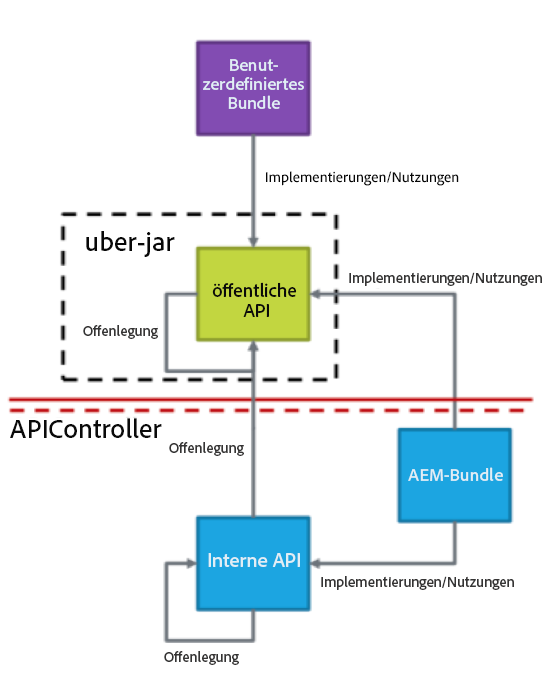
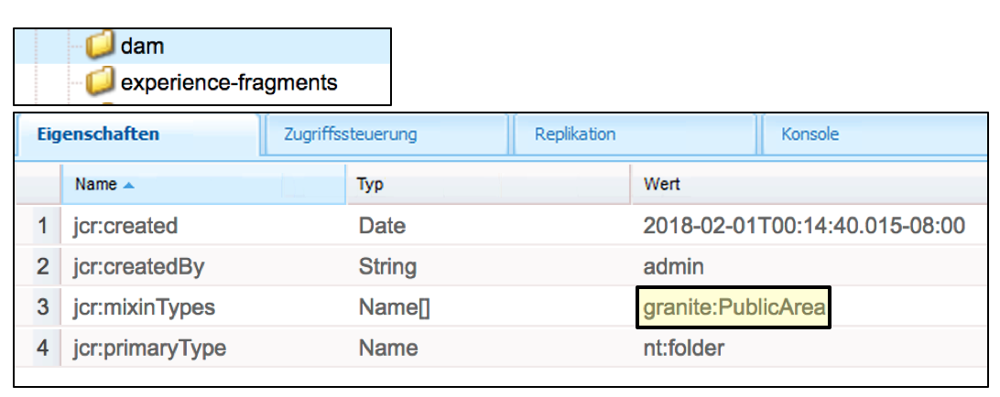
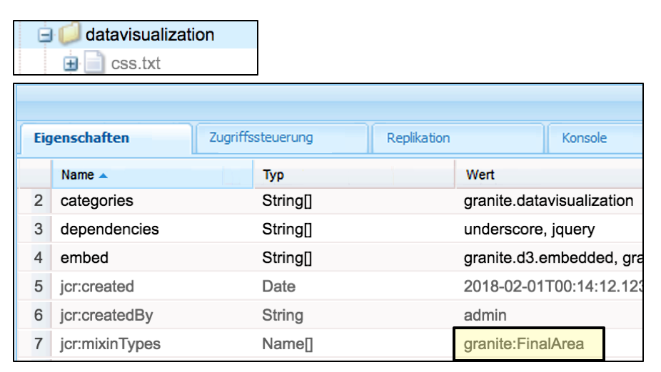
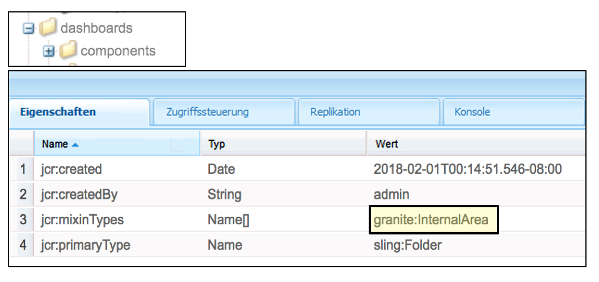
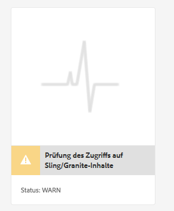
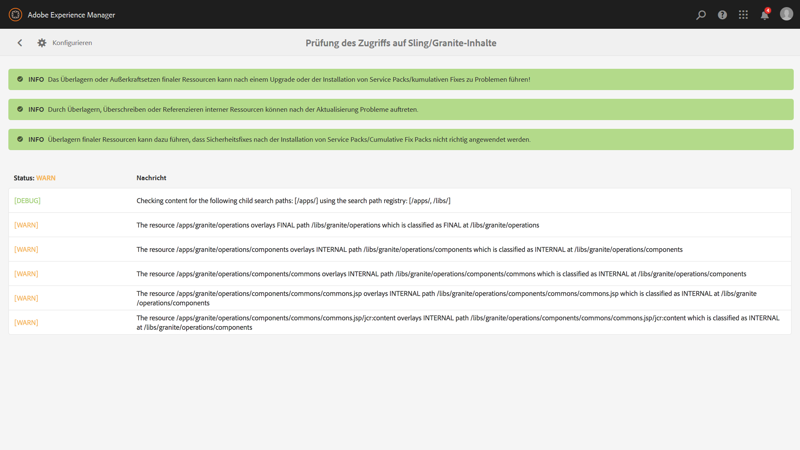
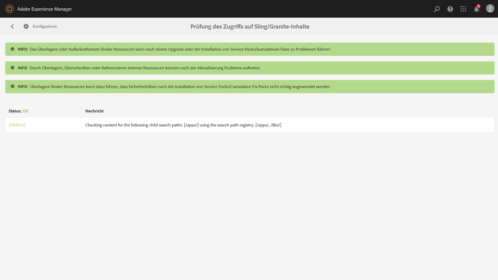

# Nachhaltige Aktualisierungen{#sustainable-upgrades}

>[!CAUTION]
>
>AEM 6.4 hat das Ende der erweiterten Unterstützung erreicht und diese Dokumentation wird nicht mehr aktualisiert. Weitere Informationen finden Sie in unserer [technische Unterstützung](https://helpx.adobe.com/de/support/programs/eol-matrix.html). Unterstützte Versionen suchen [here](https://experienceleague.adobe.com/docs/?lang=de).

## Anpassungsframework {#customization-framework}

### Architektur (funktional/infrastruktur/content/application)  {#architecture-functional-infrastructure-content-application}

Die Funktion des Anpassungs-Frameworks soll dazu beitragen, Verstöße in nicht erweiterbaren Bereichen des Codes (wie APIS) oder von Inhalten (wie Überlagerungen) zu reduzieren, die nicht aktualisierungsfreundlich sind.

Es gibt zwei Komponenten des Anpassungs-Frameworks: die **API-Oberfläche** und **Inhaltsklassifizierung**.

#### API-Oberfläche {#api-surface}

In früheren Versionen von AEM wurden viele APIs über das Uber Jar verfügbar gemacht. Einige dieser APIs waren nicht für die Verwendung durch Kunden vorgesehen, wurden aber für die Unterstützung AEM gebündelter Funktionen bereitgestellt. Künftig werden die Java-APIs als öffentlich oder privat gekennzeichnet, um Kunden anzuzeigen, welche APIs im Zusammenhang mit Upgrades sicher verwendet werden können. Weitere Besonderheiten sind:

* Java-APIs, die als `Public` gekennzeichnet sind, können durch benutzerdefinierte und Implementierungspakete verwendet und referenziert werden.

* Die öffentlichen APIs sind durch die Installation eines Kompatibilitätspakets abwärtskompatibel. 
* Das Kompatibilitätspaket enthält ein Uber JAR für die Kompatibilität enthalten, um Abwärtskompatibilität sicherzustellen. 
* Java-APIs, die als `Private` gekennzeichnet sind, sind ausschließlich zur Verwendung durch interne AEM-Pakete vorgesehen und sollten nicht von benutzerdefinierten Paketen verwendet werden.

>[!NOTE]
>
>Das in diesem Kontext verwendete Konzept von `Private` und `Public` darf nicht mit öffentlichen und privaten Java-Klassen verwechselt werden.

#### Inhaltsklassifizierungen {#content-classifications}

AEM verwendet seit langem den Prinzipal von Überlagerungen und Sling Resource Merger, um Kunden zu ermöglichen, AEM Funktionalität zu erweitern und anzupassen. Vordefinierte Funktionen, die die AEM Konsolen und die Benutzeroberfläche bedienen, werden in **/libs**. Kunden können nie etwas ändern unter **/libs** kann jedoch zusätzlichen Inhalt hinzufügen unter **/apps** , um die in **/libs** (Weitere Informationen finden Sie unter Entwickeln mit Überlagerungen .) Dies führte bei der Aktualisierung von AEM als Inhalt in **/libs** kann sich ändern, wodurch die Überlagerungsfunktion auf unerwartete Weise beschädigt wird. Kunden können AEM-Komponenten außerdem durch Vererbung über `sling:resourceSuperType` oder einfach durch einen Verweis auf eine Komponente in **/libs** direkt über sling:resourceType erweitern. Ähnliche Aktualisierungsprobleme können bei Referenz- und Außerkraftsetzungsfällen auftreten.

Damit es für Kunden sicherer und einfacher ist, die Bereiche von **/libs** sicher sind, den Inhalt in zu verwenden und zu überlagern **/libs** wurde mit den folgenden Mixins klassifiziert:

* **Öffentlich (granite:PublicArea)** – Definiert einen Knoten als „Öffentlich“, damit er überlagert, vererbt (`sling:resourceSuperType`) oder direkt verwendet (`sling:resourceType`) werden kann. Als „Öffentlich“ gekennzeichnete Knoten unter /libs können sicher aktualisiert werden, indem ein Kompatibilitätspaket hinzugefügt wird. Kunden sollten grundsätzlich nur Knoten nutzen, die als „Öffentlich“ gekennzeichnet sind. 

* **Abstrakt (granite:AbstractArea)** – Definiert einen Knoten als „Abstrakt“. Knoten können überlagert oder vererbt werden (`sling:resourceSupertype`), dürfen aber nicht direkt verwendet werden (`sling:resourceType`).

* **Endgültig (granite:FinalArea)** – Definiert einen Knoten als „Endgültig“. Als &quot;final&quot;klassifizierte Knoten können nicht überlagert oder vererbt werden. Endgültige Knoten können über `sling:resourceType` direkt verwendet werden. Unterknoten unter dem endgültigen Knoten gelten standardmäßig als intern.

* **Intern (granite:InternalArea)** - Definiert einen Knoten als intern. Als intern klassifizierte Knoten können nicht überlagert, vererbt oder direkt verwendet werden. Diese Knoten sind nur für die interne Funktionalität von AEM vorgesehen.

* **Keine Anmerkung** - Knoten übernehmen die Klassifizierung anhand der Baumstruktur. Der /root-Wert ist standardmäßig Öffentlich. **Knoten mit einem übergeordneten Element, das als &quot;Intern&quot;oder &quot;Endgültig&quot;klassifiziert ist, sind ebenfalls als &quot;Intern&quot;zu behandeln.**

>[!NOTE]
>
>Diese Richtlinien werden nur bei Sling-Suchpfadbasierten Mechanismen durchgesetzt. Andere Bereiche von **/libs**, z. B. eine Client-seitige Bibliothek, die als `Internal` gekennzeichnet sind, können jedoch weiterhin mit einem standardmäßigen clientlib-Einschluss verwendet werden. Es ist wichtig, dass ein Kunde in diesen Fällen weiterhin die interne Klassifizierung berücksichtigt.

#### CRXDE Lite Content Type Indicators {#crxde-lite-content-type-indicators}

In CRXDE Lite angewendete Mixins zeigen als `INTERNAL` gekennzeichnete Inhaltsknoten und Strukturen ausgegraut an. Für `FINAL` wird lediglich das Symbol ausgegraut. Die untergeordneten Elemente dieser Knoten werden ebenfalls grau dargestellt. In beiden Fällen ist die Funktion Überlagerungsknoten deaktiviert.

**Öffentlich**

**Endgültig** 

**Intern**

**Konsistenzprüfung des Inhalts**

AEM 6.4 bietet außerdem eine Konsistenzprüfung, die Kunden warnt, wenn überlagerter oder referenzierter Inhalt auf eine Weise verwendet wird, die nicht der Inhaltsklassifizierung entspricht.

Die **Prüfung des Inhaltszugriffs auf Sling/Granite** ist eine neue Konsistenzprüfung, die das Repository überwacht, um festzustellen, ob der Kundencode fälschlicherweise auf geschützte Knoten in AEM zugreift.

Dadurch wird überprüft. **/apps** und dauert normalerweise mehrere Sekunden.

Um auf diese neue Konsistenzprüfung zugreifen zu können, müssen Sie die folgenden Schritte ausführen:

1. Navigieren Sie auf der AEM-Startseite zu **Tools > Vorgänge > Statusberichte**
1. Klicken Sie auf **Prüfung des Inhaltszugriffs auf Sling/Granite** wie unten gezeigt:

   

Nachdem der Scan abgeschlossen ist, wird eine Liste mit Warnmeldungen angezeigt, die den Endbenutzer des unzulässig referenzierten geschützten Knotens informiert:

Nach der Korrektur der Verstöße wird der Zustand grün angezeigt:

Die Konsistenzprüfung zeigt Informationen an, die von einem Hintergrunddienst erfasst wurden, der asynchron prüft, wann immer eine Überlagerung oder ein Ressourcentyp für alle Sling-Suchpfade verwendet wird. Wenn Inhalts-Mixins falsch verwendet werden, wird ein Verstoß gemeldet.
