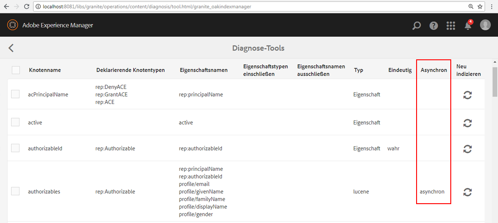

# Fehlerbehebung bei Oak-Indizes{#troubleshooting-oak-indexes}

>[!CAUTION]
>
>AEM 6.4 hat das Ende der erweiterten Unterstützung erreicht und diese Dokumentation wird nicht mehr aktualisiert. Weitere Informationen finden Sie in unserer [technische Unterstützung](https://helpx.adobe.com/de/support/programs/eol-matrix.html). Unterstützte Versionen suchen [here](https://experienceleague.adobe.com/docs/?lang=de).

## Langsame Neuindizierung  {#slow-re-indexing}

AEM interner Neuindizierungsprozess sammelt Repository-Daten und speichert sie in Oak-Indizes, um eine leistungsfähige Inhaltsabfrage zu unterstützen. Bei außergewöhnlichen Umständen kann der Vorgang langsam werden oder sogar anhalten. Diese Seite dient als Anleitung zur Fehlerbehebung, um zu ermitteln, ob die Indizierung langsam ist, die Ursache zu finden und das Problem zu beheben.

Dabei muss zwischen Neuindizierungen unterschieden werden, die ungewöhnliche lange dauern, und Neuindizierungen, die aufgrund der sehr großen Menge an Inhalt lange brauchen. Beispielsweise wird die Indexzeit von Inhalten mit der Menge an Inhalten skaliert, sodass große Produktionsspeicher mehr Zeit für die Neuindizierung benötigen als kleine Entwicklungs-Repositorys.

Siehe [Best Practices für Abfragen und Indizierung](/help/sites-deploying/best-practices-for-queries-and-indexing.md) für zusätzliche Informationen darüber, wann und wie Inhalte neu indiziert werden.

## Anfängliche Erkennung {#initial-detection}

Um eine langsame Indizierung anfänglich zu erkennen, müssen die `IndexStats`-JMX-MBeans überprüft werden. Klicken Sie auf die betroffene AEM-Instanz und gehen Sie wie folgt vor:

1. Öffnen Sie die Web-Konsole und klicken Sie auf die Registerkarte „JMX“. Oder wechseln Sie zu https://&lt;Host>:&lt;Port>/system/console/jmx (z. B. [http://localhost:4502/system/console/jmx](http://localhost:4502/system/console/jmx)).
1. Navigieren Sie zu den `IndexStats`-MBeans.
1. Öffnen Sie die `IndexStats`-MBeans für `async` und `fulltext-async`.

1. Überprüfen Sie für beide MBeans, ob die Zeitstempel **Done** und **LastIndexTime** weniger als 45 Minuten zurückliegen.

1. Falls für eines der MBeans der Zeitstempel (**Done** oder **LastIndexedTime**) mehr als 45 Minuten zurückliegt, dauert der Indizierungsvorgang zu lange oder ist fehlgeschlagen. Dies führt dazu, dass die asynchronen Indizes veraltet sind.

## Indizierung wird nach einem erzwungenen Herunterfahren angehalten {#indexing-is-paused-after-a-forced-shutdown}

Ein erzwungenes Herunterfahren führt dazu, dass AEM asynchrone Indizierung bis zu 30 Minuten nach dem Neustart ausgesetzt wird. Normalerweise werden weitere 15 Minuten benötigt, um den ersten Neuindizierungsdurchgang abzuschließen, und zwar für insgesamt etwa 45 Minuten (wobei auf die [Anfängliche Erkennung](/help/sites-deploying/troubleshooting-oak-indexes.md#initial-detection) 45 Minuten). Falls Sie vermuten, dass die Indizierung nach einem erzwungenen Herunterfahren angehalten wurde:

1. Zunächst muss festgestellt werden, ob die AEM Instanz erzwungen heruntergefahren wurde (der AEM wurde erzwungen oder ein Stromausfall trat ein), und anschließend wieder gestartet werden.

   * Hierfür kann die [AEM-Protokollierung](/help/sites-deploying/configure-logging.md) überprüft werden.

1. Wenn das erzwungene Herunterfahren beim Neustart stattgefunden hat, setzt AEM die Neuindizierung automatisch für bis zu 30 Minuten aus.
1. Warten Sie etwa 45 Minuten, bis AEM normale asynchrone Indizierungsvorgänge wieder aufnehmen kann.

## Thread-Pool überlastet {#thread-pool-overloaded}

>[!NOTE]
>
>Stellen Sie bei AEM 6.1 sicher, dass [AEM 6.1 CFP 11](https://helpx.adobe.com/de/experience-manager/release-notes-aem-6-1-cumulative-fix-pack.html) installiert ist.

Bei außergewöhnlichen Umständen kann der zum Verwalten der asynchronen Indizierung verwendete Thread-Pool überlastet sein. Um den Indizierungsvorgang zu isolieren, kann ein Thread-Pool konfiguriert werden, der verhindert, dass andere AEM-Vorgänge die zügige Inhaltsindizierung von Oak beeinträchtigen. Gehen Sie dazu folgendermaßen vor:

1. Definieren Sie einen neuen, isolierten Thread-Pool für den Apache Sling Scheduler, der für die asynchrone Indizierung verwendet werden soll:

   * Nagivieren Sie auf der betroffenen AEM-Instanz zu „AEM-OSGi-Web-Konsole“ > „OSGi“ > „Konfiguration“ > „Apache Sling Scheduler“ oder zu https://&lt;Host>:&lt;Port>/system/console/configMgr (beispielsweise [http://localhost:4502/system/console/configMgr](http://localhost:4502/system/console/configMgr)).
   * Fügen Sie dem Feld &quot;Zulässige Thread-Pools&quot;einen Eintrag mit dem Wert &quot;oak&quot;hinzu.
   * Klicken Sie unten rechts auf Speichern , um die Änderungen zu speichern.

   

1. Überprüfen Sie, dass der neue Thread-Pool in Apache Sling Scheduler registriert ist und in der Statusanzeige der Web-Konsole von Apache Sling Scheduler angezeigt wird.

   * Navigieren Sie zu „AEM-OSGi-Web-Konsole“ > „Status“ > „Sling Scheduler“ oder zu https://&lt;Host>:&lt;Port>/system/console/status-slingscheduler (beispielsweise [http://localhost:4502/system/console/status-slingscheduler](http://localhost:4502/system/console/status-slingscheduler)).
   * Stellen Sie sicher, dass die folgenden Pooleinträge vorhanden sind:

      * ApacheSlingoak
      * ApacheSlingdefault

   

## Überwachungswarteschlange ist voll {#observation-queue-is-full}

Wenn in kurzer Zeit zu viele Änderungen und Zusagen am Repository vorgenommen werden, kann die Indizierung aufgrund einer vollständigen Beobachtungswarteschlange verzögert werden. Bestimmen Sie zunächst, ob die Beobachtungswarteschlange voll ist:

1. Wechseln Sie zur Web-Konsole und klicken Sie auf die Registerkarte „JMX“. Oder wechseln Sie zu https://&lt;Host>:&lt;Port>/system/console/jmx (beispielsweise [http://localhost:4502/system/console/jmx](http://localhost:4502/system/console/jmx)).
1. Öffnen Sie im Oak-Repository das Statistik-MBean und überprüfen Sie, ob einer der Werte für `ObservationQueueMaxLength` mehr als 10.000 beträgt.

   * Bei normalem Betrieb wird dieser Höchstwert letztendlich auf null reduziert (insbesondere im Abschnitt `per second`). Überprüfen Sie daher, ob der Sekundenwert für `ObservationQueueMaxLength` 0 beträgt.
   * Wenn die Werte 10.000 oder höher sind und stetig zunehmen, deutet dies darauf hin, dass mindestens eine (möglicherweise mehrere) Warteschlange nicht so schnell verarbeitet werden kann, wie neue Änderungen (Commits) auftreten.
   * Jede Beobachtungswarteschlange hat einen Grenzwert (standardmäßig 10.000). Wenn die Warteschlange diesen Grenzwert erreicht, wird die Verarbeitung beeinträchtigt.
   * Bei Verwendung von MongoMK verschlechtert sich die interne Leistung des Oak-Cache mit zunehmender Warteschlangengröße. Diese Korrelation zeigt sich in der größeren `missRate` beim `DocChildren`-Cache im Statistik-MBean `Consolidated Cache`.

1. Um zu vermeiden, dass akzeptable Überwachungswarteschlangenbeschränkungen überschritten werden, sollten Sie:

   * Verringern Sie die konstante Rate von Commits. Kurze Spitzen bei den Commits sind akzeptabel, aber die konstante Rate sollte reduziert werden.
   * Vergrößern Sie den `DiffCache` wie unter [Tipps zur Leistungsoptimierung > Mongo-Speicheroptimierung > Dokument-Cache-Größe](https://helpx.adobe.com/experience-manager/kb/performance-tuning-tips.html#main-pars_text_3) beschrieben.

## Identifizieren und Beheben eines blockierten Neuindizierungsprozesses {#identifying-and-remediating-a-stuck-re-indexing-process}

Die Neuindizierung kann unter zwei Bedingungen als &quot;vollständig blockiert&quot;betrachtet werden:

* Die Neuindizierung ist sehr langsam, sodass in den Protokolldateien kein signifikanter Fortschritt bezüglich der Anzahl der durchquerten Knoten gemeldet wird.

   * Wenn beispielsweise im Laufe einer Stunde keine Nachrichten vorhanden sind oder der Fortschritt so langsam ist, dass die Fertigstellung eine Woche oder länger dauert.

* Die Neuindizierung hängt in einer endlosen Schleife, wenn wiederholte Ausnahmen in den Protokolldateien des Indizierungs-Thread angezeigt werden (beispielsweise `OutOfMemoryException`). Die Wiederholung derselben Ausnahme(en) im Protokoll deutet auf Oak-Versuche hin, dasselbe wiederholt zu indizieren, schlägt jedoch bei demselben Problem fehl.

Gehen Sie wie folgt vor, um einen blockierten Neuindizierungsprozess zu identifizieren und zu beheben:

1. Um die Ursache für eine festgefahrene Indizierung zu identifizieren, müssen die folgenden Informationen erfasst werden:

   * Erfassen Sie 5 Minuten Thread-Dump, eine Thread-Dump alle 2 Sekunden.
   * [Festlegen der DEBUG-Ebene und der Protokolle für die Appender](/help/sites-deploying/configure-logging.md).

      * *org.apache.jackrabbit.oak.plugins.index.AsyncIndexUpdate*
      * *org.apache.jackrabbit.oak.plugins.index.IndexUpdate*
   * Erfassen Sie die Daten aus dem asynchronen `IndexStats`-MBean:

      * Navigieren Sie zu AEM OSGi-Web-Konsole > Hauptfenster > JMX > IndexStat > async

         oder gehen Sie zu [http://localhost:4502/system/console/jmx/org.apache.jackrabbit.oak%3Aname%3Dasync%2Ctype%3DIndexStats](http://localhost:4502/system/console/jmx/org.apache.jackrabbit.oak%3Aname%3Dasync%2Ctype%3DIndexStats)
   * Verwenden Sie den Befehl [oak-run.jar&#39;s console mode](https://github.com/apache/jackrabbit-oak/tree/trunk/oak-run), um Details zum *`/:async`*-Knoten abzurufen.
   * Erfassen Sie anhand des `CheckpointManager`-MBean eine Liste der Repository-Checkpoints:

      * AEM OSGi-Web-Konsole > Hauptfenster > JMX > CheckpointManager > listCheckpoints()

         oder gehen Sie zu [http://localhost:4502/system/console/jmx/org.apache.jackrabbit.oak%3Aname%3DSegment+node+store+checkpoint+management%2Ctype%3DCheckpointManager](http://localhost:4502/system/console/jmx/org.apache.jackrabbit.oak%3Aname%3DSegment+node+store+checkpoint+management%2Ctype%3DCheckpointManager)

1. Wenn Sie alle in Schritt 1 genannten Informationen erfasst haben, starten Sie AEM neu.

   * Durch Neustarten von AEM kann das Problem im Fall von hohen gleichzeitigen Lasten (überlaufende Überwachungswarteschlange oder Ähnliches) eventuell behoben werden.
   * Wenn ein Neustart das Problem nicht behebt, wenden Sie sich an die [Adobe-Kundenunterstützung](https://helpx.adobe.com/de/marketing-cloud/contact-support.html) und geben Sie alle in Schritt 1 erfassten Informationen an.

## Sicheres Abbrechen der asynchronen Neuindizierung {#safely-aborting-asynchronous-re-indexing}

Die Neuindizierung kann sicher über die Index-Spuren `async, async-reindex` und `ulltext-async` (`IndexStats`-MBean) abgebrochen, d. h. vor dem Abschluss gestoppt werden. Weitere Informationen finden Sie auch in der Dokumentation zu Apache Oak im Abschnitt [Abbrechen der Neuindizierung](https://jackrabbit.apache.org/oak/docs/query/indexing.html#abort-reindex). Berücksichtigen Sie zusätzlich Folgendes:

* Die Neuindizierung von Lucene-Indizes und Lucene-Eigenschaftenindizes kann abgebrochen werden, da sie asynchron ist.
* Die Neuindizierung von Oak-Eigenschaftenindizes kann nur abgebrochen werden, wenn sie über das `PropertyIndexAsyncReindexMBean` initiiert wurde.

Gehen Sie wie folgt vor, um die Neuindizierung sicher abzubrechen:

1. Identifizieren Sie das IndexStats-MBean, das die Neuindizierungsspur steuert, die gestoppt werden muss.

   * Navigieren Sie über die JMX-Konsole zum gewünschten IndexStats-MBean. Wechseln Sie dazu entweder zu „AEM-OSGi-Web-Konsole“ > „Haupt“ > „JMX“ oder zu https://&lt;Host>:&lt;Port>/system/console/jmx (beispielsweise [http://localhost:4502/system/console/jmx](http://localhost:4502/system/console/jmx)).
   * Öffnen Sie das entsprechende IndexStats-MBean, je nach der Neuindizierungsspur, die Sie stoppen möchten (`async`, `async-reindex` oder `fulltext-async`).

      * Um die richtige Spur und die zugehörige IndexStats-MBean-Instanz zu ermitteln, durchsuchen Sie die Oak-Indexeigenschaft „async“. Die Eigenschaft „async“ enthält den Spurnamen: `async`, `async-reindex` oder `fulltext-async`.
      * Die Spur ist auch verfügbar, indem Sie auf AEM Index Manager in der Spalte &quot;Async&quot;zugreifen. Um auf den Index-Manager zuzugreifen, navigieren Sie zu Vorgänge > Diagnose > Index-Manager.

   

1. Rufen Sie den Befehl `abortAndPause()` auf dem entsprechenden `IndexStats`-MBean auf.
1. Markieren Sie die entsprechende Oak-Index-Definition, um zu verhindern, dass die Neuindizierung fortgesetzt wird, wenn die Index-Spur fortgesetzt wird.

   * Wenn Sie einen **vorhandenen** Index neu indizieren, setzen Sie die Eigenschaft für die Neuindizierung auf „false“.

      * `/oak:index/someExistingIndex@reindex=false`
   * Oder andernfalls für eine **new** index, entweder:

      * Festlegen der Eigenschaft &quot;type&quot;auf disabled

         * `/oak:index/someNewIndex@type=disabled`
      * oder entfernen Sie die Indexdefinition vollständig

   Übertragen Sie die Änderungen nach Abschluss in das Repository.

1. Setzen Sie schließlich die asynchrone Indizierung auf der abgebrochenen Indizierungsspur fort.

   * Rufen Sie im `IndexStats`-MBean, das den`abortAndPause()`-Befehl in Schritt 2 ausgegeben hat, den `resume()`-Befehl auf.

## Verhindern der langsamen Neuindizierung {#preventing-slow-re-indexing}

Die Neuindizierung empfiehlt sich zu ruhigen Zeiten (also nicht während der Verarbeitung großer Inhaltsmengen) und idealerweise während eines Wartungsfensters, wenn die AEM-Last bekannt und unter Kontrolle ist. Vergewissern Sie sich außerdem, dass Ihre Neuindizierung nicht während anderer Wartungstätigkeiten stattfindet.
