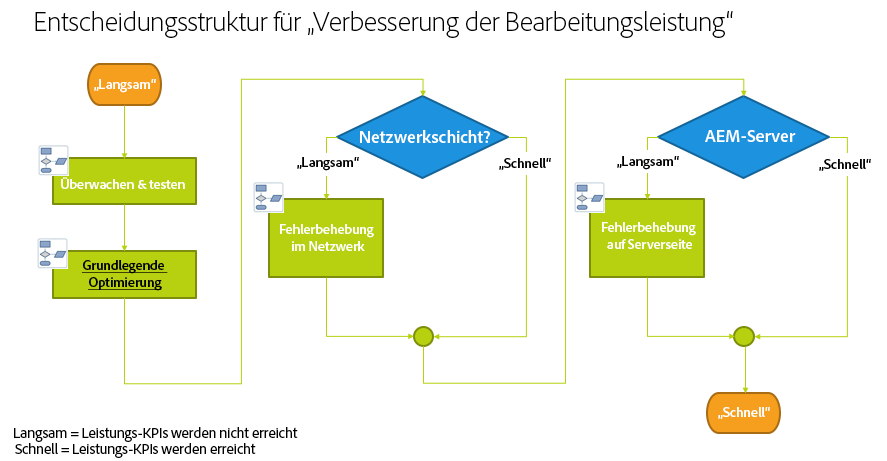
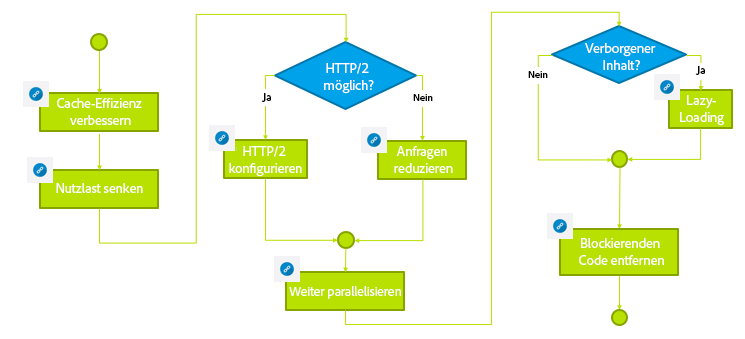

# Fehlerbehebung{#troubleshooting}

>[!CAUTION]
>
>AEM 6.4 hat das Ende der erweiterten Unterstützung erreicht und diese Dokumentation wird nicht mehr aktualisiert. Weitere Informationen finden Sie in unserer [technische Unterstützung](https://helpx.adobe.com/de/support/programs/eol-matrix.html). Unterstützte Versionen suchen [here](https://experienceleague.adobe.com/docs/?lang=de).

Dieser Abschnitt enthält detaillierte Informationen zu den verfügbaren Protokollen, die Ihnen bei der Fehlerbehebung helfen, sowie Informationen zu einigen Problemen, auf die Sie möglicherweise bei AEM stoßen.

## Fehlerbehebung bei der Autorenleistung {#troubleshoot-author-performance}

Das Analysieren von schlechter Leistung auf der Autoreninstanz kann sehr aufwendig sein. Als ersten Schritt muss ermittelt werden, auf welchem Niveau der Technologie-Stack die Leistung abnimmt.

Anhand der folgenden Entscheidungsstruktur können Sie die möglichen Ursachen von Leistungsengpässen einengen.

## Grundlegende Optimierung {#basic-optimization}

## Protokolldateien und Prüfprotokolle konfigurieren {#configuring-log-files-and-audit-logs}

AEM zeichnet detaillierte Protokolle auf, die Sie möglicherweise konfigurieren möchten, um Installationsprobleme zu beheben. Weitere Informationen finden Sie im Abschnitt [Arbeiten mit Prüfdatensätzen und Protokolldateien](/help/sites-deploying/monitoring-and-maintaining.md#working-with-audit-records-and-log-files).

## Verwenden der Option „verbose“ (ausführlich) {#using-the-verbose-option}

Wenn Sie AEM WCM starten, können Sie die Option „-v“ für „verbose“ zur Befehlszeile hinzufügen. Beispiel: java -jar cq-wcm-quickstart-&lt;Version>.jar -v.

Die ausführliche Option zeigt einige Ausgaben des Schnellstartprotokolls in der Konsole an, damit sie zur Fehlerbehebung verwendet werden können.

## Häufige Installationsprobleme {#common-installation-issues}

Im folgenden Abschnitt werden einige Installationsprobleme und deren Lösungen beschrieben.

### Beim Doppelklicken auf die JAR-Datei für den Schnellstart passiert entweder gar nichts oder die Datei wird mit einem anderen Programm (z. B. der Archivverwaltung) geöffnet {#double-clicking-the-quickstart-jar-does-not-have-any-effect-or-opens-the-jar-file-with-another-program-for-example-archive-manager}

Dieses Verhalten weist in der Regel darauf hin, dass ein Problem mit der Konfiguration der Desktop-Umgebung Ihres Betriebssystems im Hinblick auf das Öffnen von Dateien mit der Erweiterung JAR vorliegt. Es kann auch darauf hinweisen, dass Java nicht installiert ist oder dass Sie eine nicht unterstützte Java-Version verwenden.

Da JAR-Dateien das allgegenwärtige ZIP-Format verwenden, können einige Archivierungsprogramme den Desktop automatisch so konfigurieren, dass JAR-Dateien als Archivdateien geöffnet werden.

Gehen Sie zur Fehlerbehebung wie folgt vor:

* Vergewissern Sie sich, dass Sie mindestens Java Version 1.6 installiert haben.
* Probieren Sie ein Kontextmenü (in der Regel Rechtsklick) auf den AEM WCM-Schnellstart aus und wählen Sie &quot;Öffnen mit....&quot;
* Überprüfen Sie, ob Java oder Sun Java aufgeführt ist, und versuchen Sie, AEM WCM damit auszuführen. Wenn mehrere Java-Versionen installiert sind, wählen Sie die unterstützte Version aus.

   Wenn Sie diesen Schritt erfolgreich durchlaufen haben und Ihre Betriebssysteme die Option bieten, das ausgewählte Programm immer zum Ausführen der JAR-Dateien zu verwenden, wählen Sie es aus. Doppelklicken sollte von nun an funktionieren.

* Manchmal hilft die Neuinstallation der unterstützten Java-Version dabei, die richtige Zuordnung wiederherzustellen.
* Sie können CRX immer mit der Befehlszeile oder Start-/Stopp-Skripten ausführen, wie zuvor in diesem Dokument beschrieben.

### Meine über CRX ausgeführte Anwendung erzeugt Fehler wegen unzureichendem Arbeitsspeicher {#my-application-running-on-crx-throws-out-of-memory-errors}

>[!NOTE]
>
>Siehe auch [Analysieren von Speicherproblemen](https://helpx.adobe.com/experience-manager/kb/AnalyzeMemoryProblems.html).

CRX selbst hat einen sehr geringen Speicherbedarf. Wenn die in CRX ausgeführte Anwendung größere Speicheranforderungen hat oder speicherintensive Vorgänge anfordert (z. B. große Transaktionen), muss die JVM-Instanz, in der CRX ausgeführt wird, mit den entsprechenden Speichereinstellungen gestartet werden.

Verwenden Sie Java-Befehlsoptionen, um die Speichereinstellungen der JVM zu definieren, etwa „java -Xmx512m -jar crx&amp;ast;.jar“, um die Heap-Größe auf 512 MB festzulegen.

Geben Sie die Speichereinstellungsoption beim Starten AEM WCM über die Befehlszeile an. Die AEM WCM Start-/Stopp-Skripte oder benutzerdefinierten Skripte zur Verwaltung AEM WCM-Starts können ebenfalls geändert werden, um die erforderlichen Speichereinstellungen zu definieren.

Wenn Sie die Heap-Größe bereits auf 512 MB festgelegt haben, können Sie das Speicherproblem näher untersuchen, indem Sie ein Heap-Abbild erstellen:

Verwenden Sie den folgenden Befehl, um automatisch ein Heap-Abbild zu erstellen, wenn nicht genügend Arbeitsspeicher verfügbar ist:

java -Xmx256m -XX:+HeapDumpOnOutOfMemoryError -jar &amp;ast;.jar

Dadurch wird eine Heap-Dump-Datei (**java_..hprof**) immer dann, wenn dem Prozess der Speicher ausgeht. Der Prozess kann nach der Erstellung des Heap-Dumps fortgesetzt werden. Normalerweise reicht eine Heap-Dump-Datei aus, um das Problem zu analysieren.

### Der AEM Begrüßungsbildschirm wird nach einem Doppelklick auf AEM Schnellstart nicht im Browser angezeigt {#the-aem-welcome-screen-does-not-display-in-the-browser-after-double-clicking-aem-quickstart}

In bestimmten Situationen werden die AEM WCM-Begrüßungsbildschirme nicht automatisch angezeigt, obwohl das Repository selbst erfolgreich ausgeführt wurde. Dies kann von der Einrichtung des Betriebssystems, der Browserkonfiguration oder von ähnlichen Faktoren abhängen.

Ein häufiges Symptom ist, dass im AEM WCM-Schnellstartfenster die Meldung „AEM WCM starting up, waiting for server startup...“ angezeigt wird. Wenn diese Nachricht relativ lange angezeigt wird, geben Sie die AEM WCM-URL manuell unter Verwendung des standardmäßigen 4502-Anschlusses oder des Anschlusses ein, an dem die Instanz ausgeführt wird: http://localhost:4502/

Außerdem können Protokolle den Grund dafür enthalten, dass der Browser nicht gestartet wird.

Manchmal wird im AEM WCM-Schnellstartfenster die Meldung &quot;AEM WCM wird auf http://localhost:port/ ausgeführt&quot;angezeigt und der Browser startet nicht automatisch. Klicken Sie in diesem Fall auf die URL im AEM WCM-Schnellstartfenster (Hyperlink) oder geben Sie die URL manuell im Browser ein.

Wenn alles andere fehlschlägt, überprüfen Sie die Protokolle, um herauszufinden, was passiert ist.

## Fehlerbehebung bei Installationen mit einem Anwendungsserver {#troubleshooting-installations-with-an-application-server}

### Seite nicht gefunden wurde bei Anforderung einer Geometrixx-Outdoor-Seite zurückgegeben {#page-not-found-returned-when-requesting-a-geometrixx-outdoor-page}

**Gilt für WebLogic 10.3.5 und JBoss 5.1**

Wenn eine englische Geometrixx Outdoors-Seite einen 404-Fehler (Seite nicht gefunden) zurückgibt, sollten Sie sich noch einmal vergewissern, dass Sie die zusätzliche „sling“-Eigenschaft in der Datei „sling.properties“ festgelegt haben, die für diese speziellen Applikationsserver erforderlich ist.

Weitere Informationen finden Sie unter *Bereitstellen der AEM-Web-Anwendung*.

### Die Größe des Antwortheaders kann größer als 4 KB sein. {#response-header-size-can-be-greater-than-kb}

502-Fehler können darauf hinweisen, dass der Webserver die Größe des AEM HTTP-Antwortheaders nicht verarbeiten kann. AEM können HTTP-Antwort-Header generieren, die Cookies mit einer Größe von mehr als 4 KB enthalten. Stellen Sie sicher, dass Ihr Servlet-Container so konfiguriert ist, dass die maximale Größe des Antwort-Headers 4 KB überschreiten kann.

Beispiel: Für Tomcat 7.0 ist das Attribut maxHttpHeaderSize des [HTTP-Connector](https://tomcat.apache.org/tomcat-7.0-doc/config/http.html) steuert Beschränkungen der Header-Größe.

## Deinstallieren von Adobe Experience Manager {#uninstalling-adobe-experience-manager}

Da AEM in einem einzigen Ordner installiert wird, ist kein Deinstallationsdienstprogramm erforderlich. Die Deinstallation kann so einfach sein wie das Löschen des gesamten Installationsordners. Wie Sie deinstallieren, hängt jedoch davon ab, was Sie erreichen und welchen persistenten Speicher Sie verwenden AEM.

Wenn persistenter Speicher in das Installationsverzeichnis eingebettet ist, z. B. in der standardmäßigen TarPM-Installation, werden beim Löschen von Ordnern auch Daten entfernt.

>[!NOTE]
>
>Adobe empfiehlt dringend, das Repository zu sichern, bevor Sie AEM löschen. Wenn Sie das gesamte &lt;CQ-Installationsverzeichnis> löschen, wird dabei auch das Repository gelöscht. Sichern Sie die Repository-Daten vor dem Löschen, indem Sie den Ordner „&lt;cq-installation-directory>/crx-quickstart/repository“ an einen anderen Speicherort verschieben oder kopieren, bevor Sie die anderen Ordner löschen.

Wenn Ihre AEM externen Speicher verwendet, z. B. einen Datenbankserver, werden die Daten beim Entfernen des Ordners nicht automatisch entfernt. Dadurch wird jedoch die Speicherkonfiguration entfernt, was die Wiederherstellung des JCR-Inhalts erschwert.

### JSP-Dateien werden nicht auf JBoss kompiliert {#jsp-files-are-not-compiled-on-jboss}

Wenn Sie JSP-Dateien auf JBoss installieren oder auf Experience Manager aktualisieren und die entsprechenden Servlets nicht kompiliert sind, stellen Sie sicher, dass der JBoss JSP-Compiler korrekt konfiguriert ist. Weitere Informationen finden Sie unter\
[JSP-Kompilierungsprobleme in JBoss](https://helpx.adobe.com/de/experience-manager/kb/jsps-dont-compile-jboss.html) Artikel.
