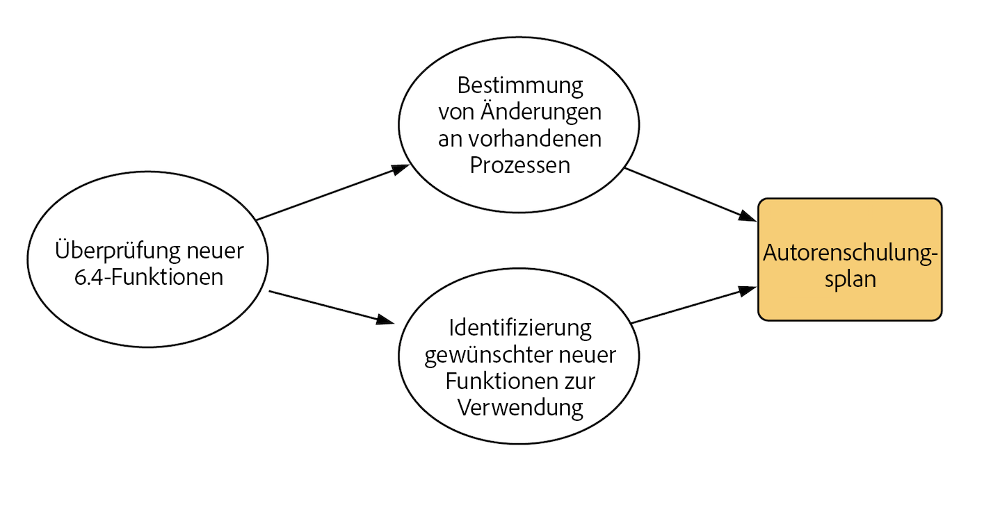
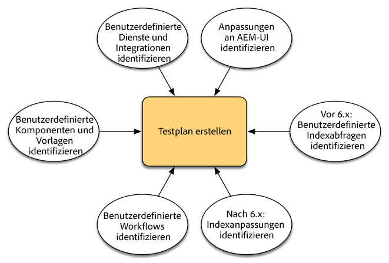
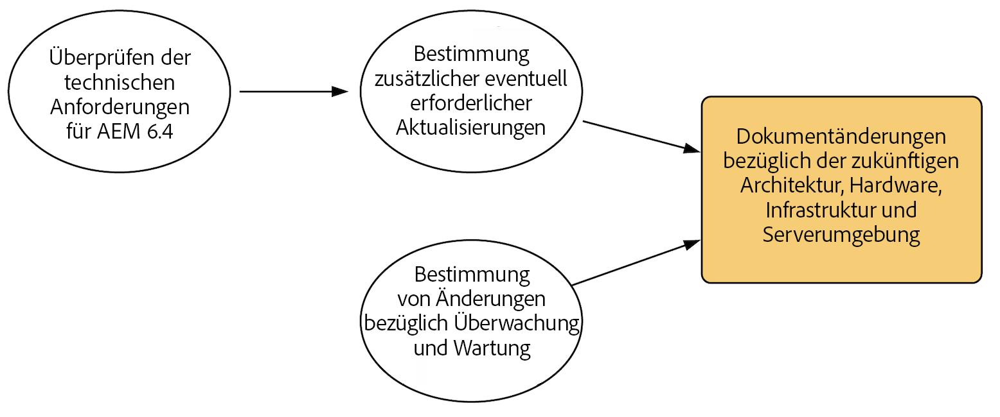
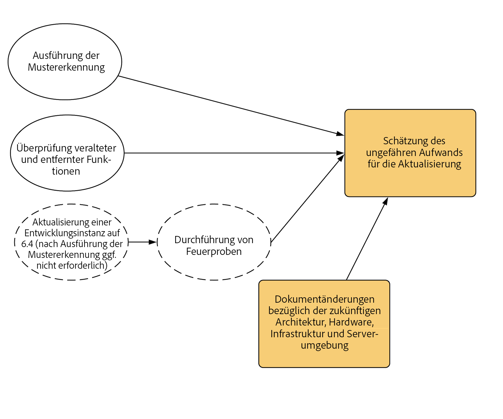
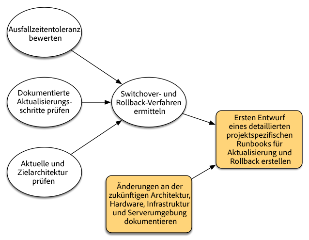
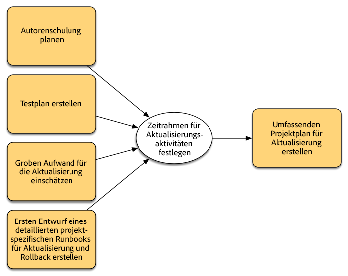
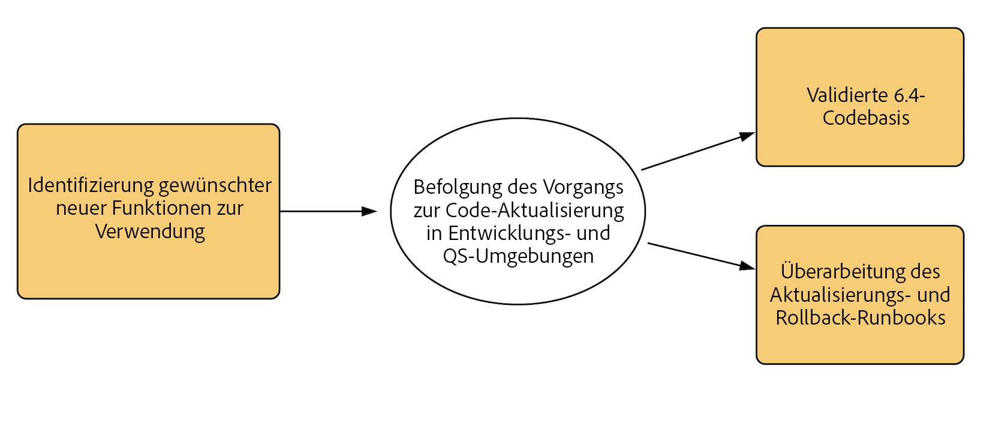
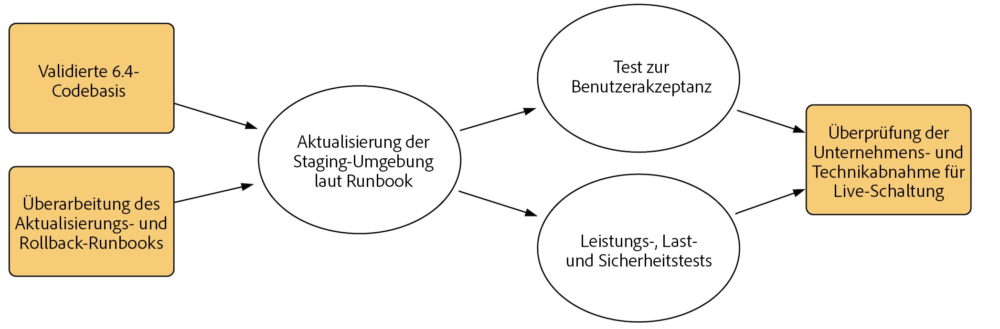
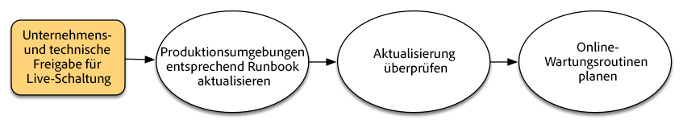

# Planung von Upgrades{#planning-your-upgrade}

>[!CAUTION]
>
>AEM 6.4 hat das Ende der erweiterten Unterstützung erreicht und diese Dokumentation wird nicht mehr aktualisiert. Weitere Informationen finden Sie in unserer [technische Unterstützung](https://helpx.adobe.com/de/support/programs/eol-matrix.html). Unterstützte Versionen suchen [here](https://experienceleague.adobe.com/docs/?lang=de).

## AEM Project Overview {#aem-project-overview}

AEM kommt häufig in umfangreichen Bereitstellungen zum Einsatz, die möglicherweise von Millionen von Benutzern genutzt werden. Im Großteil der Fälle werden dabei benutzerdefinierte Anwendungen auf Instanzen bereitgestellt, wodurch die Komplexität weiter erhöht wird. Das Upgrade einer solchen Implementierung muss deshalb methodisch angegangen werden.

Dieser Leitfaden unterstützt Sie bei der Formulierung von klaren Zielen, Phasen und Ergebnissen bei der Planung des Upgrades. Im Mittelpunkt des Leitfadens stehen die Abwicklung und die Richtlinien des gesamten Projekts. Er gibt einen Überblick über die konkreten Upgrade-Schritte und verweist auf verfügbare technische Ressourcen, falls erforderlich. Sie sollte in Verbindung mit den im Dokument genannten verfügbaren technischen Ressourcen verwendet werden.

Der Upgrade-Prozess für AEM erfordert sorgfältig ausgeführte Planungs-, Analyse- und Durchführungsphasen, für die jeweils wichtige Ergebnisse festgelegt werden müssen.

Beachten Sie, dass ein direktes Upgrade von AEM 6.0 und höheren Versionen auf Version 6.4 möglich ist. Kunden mit AEM 5.6.x und älteren Versionen müssen jedoch zuerst ein Upgrade auf Version 6.0 oder höher durchführen (empfohlen wird 6.0 SP3). Außerdem wird das neue OAK-Segment-TAR-Format jetzt für den Segment-Knotenspeicher seit 6.3 verwendet und die Repository-Migration auf dieses neue Format ist auch für 6.0, 6.1 und 6.2 obligatorisch.

>[!CAUTION]
>
>Wenn Sie von AEM 6.2 auf 6.3 upgraden, sollten Sie ENTWEDER von den Versionen **6.2-SP1-CFP1 - 6.2-SP1-CFP12.1** oder ab der Version **6.2-SP1-CFP15** upgraden. Wenn Sie jedoch von **6.2-SP1-CFP13/6.2-SP1CFP14** auf AEM 6.3 upgraden, müssen Sie mindestens auf Version **6.3.2.2** upgraden. Andernfalls würde AEM Sites nach der Aktualisierung fehlschlagen.

## Upgrade-Umfang und -Anforderungen {#upgrade-scope-requirements}

Nachfolgend finden Sie eine Liste der Bereiche, die von einem typischen AEM-Upgrade-Projekt betroffen sind:

<table> 
 <tbody>
  <tr>
   <td><strong>Komponente</strong></td> 
   <td><strong>Auswirkungen</strong></td> 
   <td><strong>Beschreibung</strong></td> 
  </tr>
  <tr>
   <td>Betriebssystem</td> 
   <td>Ungewisse, aber feine Effekte</td> 
   <td>Möglicherweise muss beim Upgrade von AEM auch das Betriebssystem aktualisiert werden. Dies kann gewisse Auswirkungen haben.</td> 
  </tr>
  <tr>
   <td>Java Runtime</td> 
   <td>Moderate Auswirkung</td> 
   <td>AEM 6.3 erfordert JRE 1.7.x (64 Bit) oder höher. JRE 1.8 ist die einzige Version, die derzeit von Oracle unterstützt wird.</td> 
  </tr>
  <tr>
   <td>Hardware</td> 
   <td>Moderate Auswirkung</td> 
   <td>Für die Online-Revisionsbereinigung sind freier  Speicherplatz, der 25 % des Repository-Volumens entspricht, sowie 15 % freier Heap-Speicher erforderlich,  um die Bereinigung erfolgreich abzuschließen. Möglicherweise müssen Sie Ihre Hardware aufrüsten, um  sicherzustellen, dass ausreichend Ressourcen für die vollständige Ausführung der Online-Revisionsbereinigung  verfügbar sind. Außerdem gibt es bei der Aktualisierung von einer Version vor AEM 6  kann zusätzliche Speicheranforderungen umfassen.</td> 
  </tr>
  <tr>
   <td>Content Repository (CRX oder Oak)</td> 
   <td>Hohe Auswirkung</td> 
   <td>Ab Version 6.1 bietet AEM keine Unterstützung für CRX2, sodass eine Migration auf  Oak (CRX3) erforderlich ist, wenn eine Aktualisierung von einer älteren Version durchgeführt wird. In AEM 6.3 wurde  ein neuer Segment-Knotenspeicher implementiert, der ebenfalls migriert werden muss. Die  Zu diesem Zweck wird das crx2oak-Tool verwendet.</td> 
  </tr>
  <tr>
   <td>AEM Komponenten/Inhalte</td> 
   <td>Moderate Auswirkung</td> 
   <td><code>/libs</code> Und <code>/apps</code> werden beim Upgrade problemlos verarbeitet; für <code>/etc</code> müssen die Anpassungen jedoch in der Regel erneut angewendet werden.</td> 
  </tr>
  <tr>
   <td>AEM</td> 
   <td>Geringe Auswirkung</td> 
   <td>Der Großteil der AEM-Core Services wird für ein Upgrade getestet. Dies ist ein Bereich mit geringen Auswirkungen.</td> 
  </tr>
  <tr>
   <td>Benutzerdefinierte Anwendungsdienste</td> 
   <td>Geringe bis große Auswirkung</td> 
   <td>Je nach Anwendung und Anpassung kann es  Abhängigkeiten von JVM, Betriebssystemversionen und einigen Indizierungsfragen  geändert, da Indizes in Oak nicht automatisch generiert werden.</td> 
  </tr>
  <tr>
   <td>Benutzerdefinierte Anwendungsinhalte</td> 
   <td>Geringe bis große Auswirkung</td> 
   <td>Inhalte, die vom Upgrade nicht betroffen sind, können vorher gesichert  und dann wieder in das Repository verschoben werden.  Die meisten Inhalte können mithilfe des Migrationstools verarbeitet werden.</td> 
  </tr>
 </tbody>
</table>

Sie müssen sicherstellen, dass ein unterstütztes Betriebssystem, eine unterstützte Java-Laufzeitumgebung sowie eine unterstützte httpd- und Dispatcher-Version ausgeführt werden. Weitere Informationen finden Sie auf der Seite [Technische Anforderungen für AEM 6.4](/help/sites-deploying/technical-requirements.md). Die Aktualisierung dieser Komponenten muss in Ihrem Projektplan berücksichtigt werden und sollte vor der Aktualisierung von AEM erfolgen.

## Projektphasen {#project-phases}

Mit der Planung und Durchführung eines AEM-Upgrades ist ein hoher Arbeitsaufwand verbunden. Um den Arbeitsaufwand besser zu verdeutlichen, haben wir die Planungs- und Durchführungsschritte in separate Phasen unterteilt. In den folgenden Abschnitten führt jede Phase zu einem Lieferziel, das häufig von einer künftigen Projektphase genutzt wird.

### Planen der Autorenschulung {#planning-for-author-training}

In jeder neuen Version ist mit potenziellen Änderungen an der Benutzeroberfläche und den Benutzer-Workflows zu rechnen. Außerdem werden neue Funktionen eingeführt, deren Nutzung sich für das Unternehmen als vorteilhaft erweisen kann. Wir empfehlen, die eingeführten Funktionsänderungen zu überprüfen und einen Plan zur Schulung Ihrer Benutzer hinsichtlich der effektiven Nutzung zu erstellen.

Neue Funktionen in AEM 6.4 finden Sie im [Bereich zu AEM auf adobe.com](/help/release-notes/release-notes.md). Achten Sie vor allem auf Änderungen an Benutzeroberflächen oder Produktfunktionen, die in Ihrem Unternehmen häufig verwendet werden. Wenn Sie sich über die neuen Funktionen informieren, achten Sie auch auf neue Funktionen, die für Ihr Unternehmen von Nutzen sein können. Sobald Sie sich mit den Änderungen in AEM 6.4 vertraut gemacht haben, entwickeln Sie einen Schulungsplan für Ihre Autoren. Dazu könnte die Nutzung frei verfügbarer Ressourcen wie der Helpx-Funktionsvideos oder des formellen Trainings über [Adobe Digital Learning Services](https://www.adobe.com/de/training.html).

### Erstellen eines Testplans {#creating-a-test-plan}

Jede Kundenimplementierung von AEM ist einzigartig und auf die Geschäftsanforderungen des Unternehmens zugeschnitten. Deshalb ist es wichtig, alle am System vorgenommenen Anpassungen zu bestimmen, damit sie in einen Testplan einbezogen werden können. Dieser Testplan bildet die Basis für den QS-Prozess, der für upgegradete Instanzen durchgeführt wird.

Die Produktionsumgebung muss exakt dupliziert und nach dem Upgrade getestet werden, um sicherzustellen, dass alle Anwendungen und benutzerdefinierter Code weiterhin wie gewünscht ausgeführt werden. Sie müssen alle Anpassungen rückgängig machen und Leistungs-, Last- und Sicherheitstests durchführen. Beziehen Sie beim Organisieren des Testplans neben den vorkonfigurierten Benutzeroberflächen und Workflows, die für Ihre täglichen Betriebsabläufe verwendet werden, alle am System vorgenommenen Anpassungen in den Plan mit ein. Hierzu gehören möglicherweise benutzerdefinierte OSGi-Dienste und -Servlets, Integrationen mit Adobe Marketing Cloud, Integrationen mit Drittanbieteranwendungen über AEM-Connectors, benutzerdefinierte Drittanbieterintegrationen, benutzerdefinierte Komponenten und Vorlagen, benutzerdefinierte Benutzeroberflächen-Überlagerungen in AEM und benutzerdefinierte Workflows. Kunden, die eine Migration von einer Version vor AEM 6 durchführen, sollten alle benutzerdefinierten Abfragen analysieren, da diese u. U. indiziert werden müssen. Kunden, die bereits eine AEM 6.x-Version verwenden, sollten diese Abfragen dennoch testen, um sicherzustellen, dass ihre Indizes nach der Aktualisierung weiterhin effektiv funktionieren.

### Ermittlung der erforderlichen Architektur- und Infrastrukturänderungen {#determining-architectural-and-infrastructure-changes-needed}

Sie müssen bei einem Upgrade möglicherweise auch andere Komponenten Ihres Technologie-Stacks upgraden, z. B. das Betriebssystem oder JVM. Darüber hinaus ist aufgrund von Änderungen an der Repository-Konfiguration u. U. zusätzliche Hardware erforderlich. Dies trifft in der Regel nur für Kunden zu, die eine Migration von Instanzen vor Version 6.x durchführen, muss jedoch berücksichtigt werden. Schließlich können Änderungen an Ihren betrieblichen Verfahren erforderlich sein, einschließlich Überwachungs-, Wartungs-, Sicherungs- und Notfallwiederherstellungsprozessen.

Überprüfen Sie die technischen Anforderungen für AEM 6.4 und stellen Sie sicher, dass Ihre Hardware und Software die Voraussetzungen erfüllen. Informationen zu potenziellen Änderungen an Ihren Betriebsabläufen finden Sie in den folgenden Dokumenten:

**Überwachung und Wartung**

[Vorgangs-Dashboard](/help/sites-administering/operations-dashboard.md)

[Asset-Überwachung – Best Practices](/help/assets/assets-monitoring-best-practices.md)

[Überwachen von Server-Ressourcen mit der JMX-Konsole](/help/sites-administering/jmx-console.md)

[Revisionsbereinigung](/help/sites-deploying/revision-cleanup.md)

**Sicherung/Wiederherstellung und Notfallwiederherstellung:**

[Sichern und Wiederherstellen](/help/sites-administering/backup-and-restore.md)

[Leistung und Skalierbarkeit](/help/sites-deploying/performance.md)

[Ausführen von AEM mit der TarMK-Cold-Standby-Funktion](/help/sites-deploying/tarmk-cold-standby.md)

#### Überlegungen zur Neustrukturierung des Contents {#content-restructuring-considerations}

AEM 6.4 hat Änderungen an der Repository-Struktur eingeführt, die dazu beitragen, Upgrades nahtloser durchzuführen. Diese Änderungen erfordern, dass Inhalte aus dem Ordner /etc in Ordner wie /libs, /apps und /content verschoben werden – je nachdem, ob Adobe oder der Kunde Eigentümer des Inhalts ist – um die Wahrscheinlichkeit zu verringern, dass Inhalte durch Aktualisierungen überschrieben werden. Die Repository-Umstrukturierung wurde so durchgeführt, dass zum Zeitpunkt der Aktualisierung von 6.4 keine Codeänderungen erforderlich sind. Es wird jedoch empfohlen, die Details unter [Repository-Neustrukturierung in AEM 6.4](/help/sites-deploying/repository-restructuring.md) bei der Planung eines Upgrades.

### Bewertung der Komplexität des Upgrades {#assessing-upgrade-complexity}

Aufgrund der von unseren Kunden an ihren AEM-Umgebungen vorgenommenen Anpassungen, die sich hinsichtlich des Umfangs und der Art der Anpassung weitgehend unterscheiden, ist es wichtig, vor einem Upgrade den damit verbundenen Aufwand zu bestimmen.

Es gibt zwei Ansätze zur Bewertung der Komplexität des Upgrades. In einer Vorbereitungsphase können Sie einfach den neuen Musterdetektor verwenden, der auf Ihren AEM 6.1-, 6.2- und 6.3-Instanzen ausgeführt werden kann. Der Musterdetektor bietet die einfachste Möglichkeit, die erwartete Gesamtkomplexität des Upgrades anhand der gefundenen Muster zu bewerten. Der Bericht des Musterdetektors enthält Muster, mit denen veraltete APIs identifiziert werden können, die von der benutzerdefinierten Code-Basis verwendet werden (dies wurde in 6.3 mithilfe von Kompatibilitätsprüfungen vor dem Upgrade durchgeführt).

Nach dieser anfänglichen Bewertung kann in einem umfangreicheren nächsten Schritt ein Upgrade einer Testinstanz durchgeführt werden, um einige grundlegende Tests durchzuführen. Adobe bietet auch einige . Außerdem sollte die Liste der [veralteten und entfernten Funktionen](/help/release-notes/deprecated-removed-features.md) überprüft werden, und zwar nicht nur in Bezug auf die Version, auf die Sie die Aktualisierung durchführen, sondern auch bezüglich der Versionen zwischen Ihrer Quell- und Zielversion. Bei einer Aktualisierung von AEM 6.2 auf 6.4 ist es beispielsweise wichtig, die veralteten und entfernten Funktionen von AEM 6.3 neben denen von AEM 6.4 zu überprüfen.

Der in Version 6.4 eingeführte Musterdetektor sollte Ihnen eine recht genaue Schätzung dessen liefern, was während eines Upgrades in den meisten Fällen zu erwarten ist. Für komplexere Anpassungen und Bereitstellungen, in denen inkompatible Änderungen vorhanden sind, können Sie jedoch eine Entwicklungsinstanz auf AEM 6.4 upgraden. Eine Anleitung finden Sie unter [Durchführen eines In-Place-Upgrades](/help/sites-deploying/in-place-upgrade.md). Führen Sie nach der Aktualisierung eine Reihe Feuerproben der hohen Stufe für die Umgebung durch. Sie dienen nicht dazu, das Nutzungsszenario umfassend zu testen und eine formelle Liste mit Defekten zu erstellen. Vielmehr soll der geschätzte erforderliche Arbeitsaufwand für das Upgrade des Codes ermittelt werden, um die Kompatibilität mit Version 6.4 sicherzustellen. Wenn die [Mustererkennung](/help/sites-deploying/pattern-detector.md) mit den Änderungen an der Architektur kombiniert wird, die im vorherigen Abschnitt beschrieben wurden, liefert dies eine grobe Schätzung, mit deren Hilfe das Projektleiter-Team das Upgrade planen kann.

### Erstellen des Runbooks für das Upgrade und das Rollback {#building-the-upgrade-and-rollback-runbook}

Obwohl Adobe den Prozess für die Aktualisierung von AEM-Instanzen dokumentiert hat, muss der Ansatz entsprechend dem Netzwerklayout, der Bereitstellungsarchitektur und den Anpassungen jedes Kunden optimiert und darauf zugeschnitten werden. Wir empfehlen deshalb die gesamte verfügbare Dokumentation zu lesen und auf dieser Basis ein projektspezifisches Runbook mit den speziellen Upgrade- und Rollbackverfahren für Ihre Umgebung zu erstellen. Stellen Sie bei einer Aktualisierung von CRX2 sicher, dass Sie die Dauer der Inhaltsmigration von CRX2 auf Oak evaluieren. Für große Repositorys könnte dies erheblich sein.

Unter [Upgrade-Verfahren](/help/sites-deploying/upgrade-procedure.md) finden Sie Upgrade- und Rollback-Verfahren sowie schrittweise Anleitungen für die Durchführung eines [In-Place-Upgrade](/help/sites-deploying/in-place-upgrade.md). Diese Anweisungen sollten überprüft und für Ihre Systemarchitektur, Anpassungen und Ausfallzeitentoleranz berücksichtigt werden, um die entsprechenden Switchover- und Rollback-Vorgänge zu bestimmen, die Sie während des Upgrades ausführen. Änderungen an der Architektur oder Servergröße sollten bei der Erstellung Ihres benutzerdefinierten Runbooks miteinbezogen werden. Beachten Sie, dass diese Version als erster Entwurf gelten sollte. Möglicherweise sind nach Abschluss der QS- und Entwicklungszyklen und der Bereitstellung des Upgrades in der Staging-Umgebung weitere Schritte erforderlich. Die Informationen im Dokument sollten möglichst umfassend sein, sodass Ihr Betriebspersonal das Upgrade anhand der darin enthaltenen Informationen vollständig durchführen und abschließen kann.

### Entwickeln eines Projektplans {#developing-a-project-plan}

Anhand der Ergebnisse aus den vorherigen Schritten kann ein Projektplan erstellt werden, der die erwarteten Zeitrahmen für den Test- oder Entwicklungsaufwand, Schulungen und das tatsächliche Upgrade beinhaltet.

Ein umfassender Projektplan sollte folgende Punkte beinhalten:

* Finalisierung der Entwicklungs- und Testpläne

* Aktualisierung von Entwicklungs- und QS-Umgebungen

* Aktualisierung der benutzerdefinierten Code-Basis für AEM 6.4

* Test- und Fehlerbehebungszyklus zur Qualitätssicherung

* Aktualisierung der Staging-Umgebung

* Integrations-, Leistungs- und Lasttests

* Zertifizierung der Umgebung

* Live-Schaltung

### Entwicklung und Qualitätssicherung durchführen {#performing-development-and-qa}

Wir haben Verfahren für das [Aktualisieren von Code und Anpassungen](/help/sites-deploying/upgrading-code-and-customizations.md) bereitgestellt, damit diese mit AEM 6.4 kompatibel sind. Wenn dieser iterative Prozess ausgeführt wird, sollten nach Bedarf Änderungen am Runbook vorgenommen werden. Auch unter [Abwärtskompatibilität in AEM 6.4](/help/sites-deploying/backward-compatibility.md) finden Sie Informationen darüber, wie Sie Ihre Anpassungen in den meisten Fällen abwärtskompatibel halten können, ohne dass sofort nach dem Upgrade Entwicklungsarbeiten erforderlich sind.

Der Entwicklungs- und Testprozess ist in der Regel iterativ. Änderungen, die aufgrund von Anpassungen während des Upgrades vorgenommen werden, können potenziell einen kompletten Teil des Produkts unbrauchbar machen. Wenn die Entwickler die Ursache des Problems behoben und das Test-Team Zugriff auf die Funktionen hat, um diese zu testen, werden möglicherweise weitere Probleme gefunden. Werden Probleme identifiziert, die Anpassungen des Upgrade-Prozesses erfordern, stellen Sie sicher, dass Sie diese zum benutzerdefinierten Runbook für das Upgrade hinzufügen. Nach mehreren Iterationen von Tests und Fehlerbehebung sollte die Codebasis vollständig validiert und für die Bereitstellung in der Staging-Umgebung bereit sein.

### Abschließende Tests {#final-testing}

Nach der Autorisierung der Codebasis durch das QS-Team Ihres Unternehmens wird eine abschließende Testphase empfohlen. Diese Testrunde beinhaltet die Validierung Ihres Runbooks in einer Staging-Umgebung, gefolgt von Benutzerakzeptanz-, Leistungs- und Sicherheitstests.

Dieser Schritt ist notwendig, da dies die einzige Gelegenheit ist, bei der Sie die Schritte im Runbook in einer produktionsähnlichen Umgebung überprüfen können. Wenn die Umgebung upgegradet wurde, müssen die Endbenutzer genügend Zeit haben, um sich anzumelden und ihre üblichen täglichen Aktivitäten im System durchzuführen. Nicht selten verwenden Benutzer einen Teil des Systems, den sie zuvor nicht genutzt haben. Durch die Identifizierung und Behebung von Fehlern in diesen Bereichen vor einer Live-Schaltung können teure Produktionsausfälle verhindert werden. Da eine neue Version von AEM wesentliche Änderungen an der zugrunde liegenden Plattform enthält, ist es auch wichtig, Leistungs-, Belastungs- und Sicherheitstests für das System durchzuführen, so als würden wir es zum ersten Mal starten.

### Durchführen des Upgrades {#performing-the-upgrade}

Wenn alle Beteiligten den Prozess abgezeichnet haben, ist es Zeit für die Ausführung der im Runbook festgelegten Verfahren. Unter [Upgrade-Verfahren](/help/sites-deploying/upgrade-procedure.md) werden Schritte für das Upgrade und das Rollback sowie als Referenz die Installationsschritte bei der Durchführung eines [In-Place-Upgrades](/help/sites-deploying/in-place-upgrade.md) beschrieben.

Die Upgrade-Anweisungen enthalten eine Reihe von Schritten für die Überprüfung der Umgebung. Hierzu gehören grundlegende Prüfungen wie das Überprüfen der Upgrade-Protokolle und die Verifizierung des ordnungsgemäßen Starts aller OSGi-Bundles. Wir empfehlen jedoch auch eine Validierung anhand eigener Nutzungsszenarien für Ihre Geschäftsprozesse. Darüber hinaus empfiehlt Adobe die Überprüfung des Zeitplans für die Online-Revisionsbereinigung von AEM sowie der zugehörigen Routinen, um sicherzustellen, dass diese nicht zu Stoßzeiten durchgeführt werden. Diese Routinen sind für die langfristige AEM von entscheidender Bedeutung.
