# Upgrade-Verfahren{#upgrade-procedure}

>[!CAUTION]
>
>AEM 6.4 hat das Ende der erweiterten Unterstützung erreicht und diese Dokumentation wird nicht mehr aktualisiert. Weitere Informationen finden Sie in unserer [technische Unterstützung](https://helpx.adobe.com/de/support/programs/eol-matrix.html). Unterstützte Versionen suchen [here](https://experienceleague.adobe.com/docs/?lang=de).

>[!NOTE]
>
>Für das Upgrade muss mit Ausfallzeiten für die Autorenschicht gerechnet werden, da der Großteil der AEM-Upgrades als In-Place-Upgrade durchgeführt wird. Durch Befolgen dieser Best Practices können Sie die Ausfallzeiten der Veröffentlichungsstufe minimieren oder eliminieren.

Wenn Sie die AEM-Umgebungen upgraden, müssen Sie sich die Unterschiede beim Upgrade von Autorenumgebungen und Veröffentlichungsumgebungen bewusst machen, um Ausfallzeiten für Autoren und Endbenutzer zu minimieren. Auf dieser Seite finden Sie einen Überblick über Upgrades einer AEM-Topologie, die auf einer AEM 6.x-Version ausgeführt wird. Da sich der Vorgang für die Autoren- und Veröffentlichungsschicht und ebenfalls für Bereitstellungen mit Mongo und TarMK unterscheidet, werden die einzelnen Schichten und Mikrokernel in separaten Abschnitten behandelt. Beim Ausführen der Bereitstellung wird empfohlen, zuerst die Autorenumgebung upzugraden und, wenn dies erfolgreich war, mit den Veröffentlichungsumgebungen fortzufahren.

## TarMK-Autorenebene {#tarmk-author-tier}

### Starttopologie {#starting-topology}

In diesem Abschnitt wird von einer Topologie mit einem Autorenserver ausgegangen, der auf TarMK mit einem Cold Standby ausgeführt wird. Die Replikation erfolgt vom Autorenserver an die TarMK-Veröffentlichungsfarm. Obwohl hierin nicht beschrieben, kann dieser Ansatz auch für Deployments, die nach dem Prinzip Offloading arbeiten. Stellen Sie sicher, dass Sie die Offloading-Instanz auf der neuen Version upgraden oder neu erstellen, bevor Sie Replikationsagenten, die auf der Autoreninstanz deaktiviert waren, neu aktivieren.

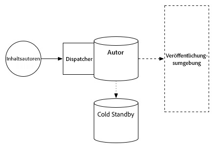

### Vorbereiten des Upgrades {#upgrade-preparation}

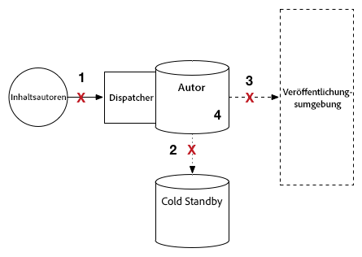

1. Beenden Sie das Verfassen von Inhalten.
1. Beenden Sie die Standby-Instanz.
1. Deaktivieren Sie Replikationsagenten auf der Autoreninstanz.
1. Führen Sie die [Wartungsaufgaben vor dem Upgrade](/help/sites-deploying/pre-upgrade-maintenance-tasks.md) aus.

### Ausführen des Upgrades {#upgrade-execution-1}

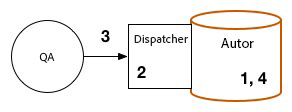

1. Führen Sie das [In-Place-Upgrade](/help/sites-deploying/in-place-upgrade.md) aus.
1. Aktualisieren Sie das Dispatcher-Modul, *falls erforderlich.*
1. QA überprüft das Upgrade.
1. Beenden Sie die Autoreninstanz.

### Bei erfolgreichem Upgrade {#if-successful}

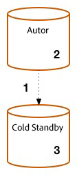

1. Kopieren Sie die upgegradete Instanz, um ein neues Cold Standby zu erstellen.
1. Starten Sie die Autoreninstanz.
1. Starten Sie die Standby-Instanz.

### Bei fehlgeschlagenem Upgrade (Rollback) {#if-unsuccessful-rollback}

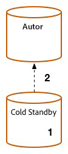

1. Starten Sie die Cold-Standby-Instanz als neue Primärinstanz.
1. Erstellen Sie die Autorenumgebung aus der Cold-Standby-Instanz neu.

## MongoMK-Autorencluster {#mongomk-author-cluster}

### Starttopologie {#starting}

In diesem Abschnitt wird von einer Topologie mit einem MongoMK-Autoren-Cluster mit mindestens zwei AEM-Autoreninstanzen ausgegangen, gesichert von mindestens zwei MongoMK-Datenbanken. Die Autoreninstanzen nutzen einen gemeinsamen Datenspeicher. Diese Schritte gelten für S3- und Dateidatenspeicher. Die Replikation erfolgt von den Autorenservern zur TarMK-Veröffentlichungsfarm.

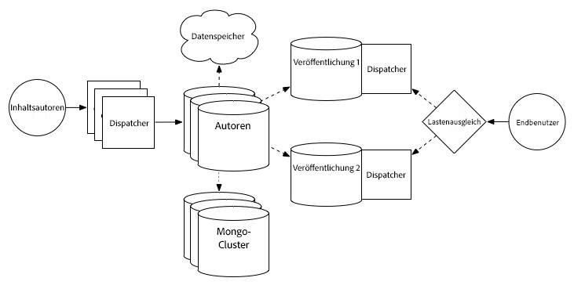

### Vorbereiten des Upgrades {#preparation}

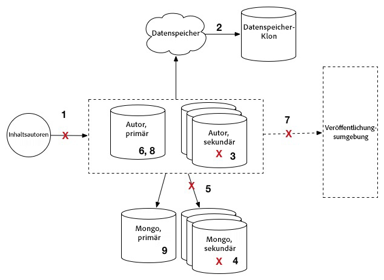

1. Beenden Sie das Verfassen von Inhalten.
1. Erstellen Sie einen Klon des Datenspeichers als Backup.
1. Beenden Sie alle AEM-Autoreninstanzen bis auf eine, die als primäre Autoreninstanz fungiert.
1. Entfernen Sie alle MongoDB-Knoten aus dem Replikationssatz bis auf einen, der als primäre Mongo-Instanz fungiert.
1. Aktualisieren Sie die Datei `DocumentNodeStoreService.cfg` auf der primären Autoreninstanz, dem einzigen Mitglied des Replikationssatzes.
1. Starten Sie die primäre Autoreninstanz neu, um sicherzustellen, dass diese richtig ausgeführt wird.
1. Deaktivieren Sie die Replikationsagenten auf der primären Autoreninstanz.
1. Führen Sie die [Wartungsaufgaben vor einem Upgrade](/help/sites-deploying/pre-upgrade-maintenance-tasks.md) auf der primären Autoreninstanz aus.
1. Falls erforderlich, aktualisieren Sie MongoDB auf der primären Mongo-Instanz mit WiredTiger auf Version 3.2.

### Ausführen des Upgrades {#execution}

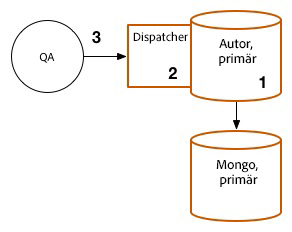

1. Führen Sie ein [In-Place-Upgrade](/help/sites-deploying/in-place-upgrade.md) auf der primären Autoreninstanz aus.
1. Aktualisieren Sie das Dispatcher- oder Web-Modul, *falls erforderlich*.
1. QA überprüft das Upgrade.

### Bei erfolgreichem Upgrade {#successful-1}

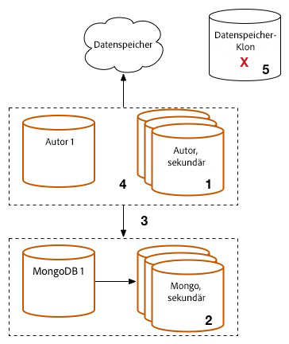

1. Erstellen Sie neue 6.3-Autoreninstanzen, die mit der upgegradeten Mongo-Instanz verbunden sind.
1. Erstellen Sie die MongoDB-Knoten, die aus dem Cluster entfernt wurden.
1. Aktualisieren Sie die `DocumentNodeStoreService.cfg`-Dateien, damit der vollständige Replikationssatz berücksichtigt wird.
1. Starten Sie die Autoreninstanzen einzeln neu.
1. Entfernen Sie den geklonten Datenspeicher. 

### Bei fehlgeschlagenem Upgrade (Rollback)  {#if-unsuccessful}

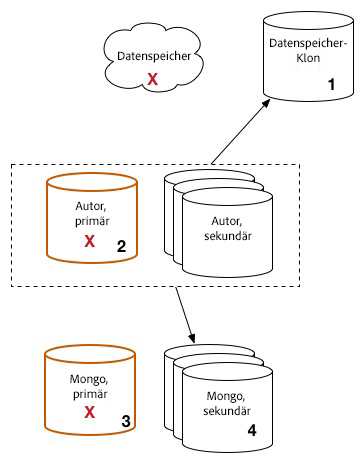

1. Konfigurieren Sie die sekundären Autoreninstanzen neu, um diese mit dem geklonten Datenspeicher zu verbinden.
1. Beenden der upgegradeten primären Autoreninstanz
1. Beenden Sie die upgegradete primäre Mongo-Instanz.
1. Starten Sie die sekundären Mongo-Instanzen neu, wobei eine dieser Instanzen als neue primäre Instanz fungieren muss.
1. Konfigurieren Sie die Dateien `DocumentNodeStoreService.cfg` auf den sekundären Autoreninstanzen so, dass sie auf den Replikationssatz noch nicht upgegradeter Mongo-Instanzen verweisen.
1. Starten Sie die sekundären Autoreninstanzen.
1. Bereinigen Sie die upgegradeten Autoreninstanzen, den Mongo-Knoten und den Datenspeicher.

## TarMK-Veröffentlichungsfarm {#tarmk-publish-farm}

### TarMK-Veröffentlichungsfarm {#publish-farm}

Die angenommene Topologie für diesen Abschnitt besteht aus zwei TarMK-Veröffentlichungsinstanzen, die von Dispatchern angeführt werden, die wiederum mit einem Lastenausgleich konfrontiert sind. Die Replikation erfolgt vom Autorenserver zur TarMK-Veröffentlichungsfarm.

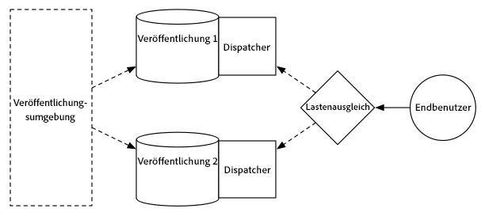

### Ausführen des Upgrades {#execution-upgrade}

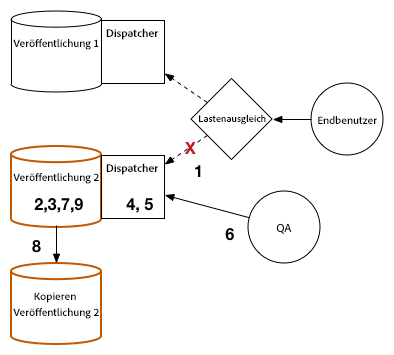

1. Beenden Sie den Traffic an die Veröffentlichungsinstanz 2 auf dem Lastausgleich.
1. Führen Sie die [Wartungsaufgaben vor einem Upgrade](/help/sites-deploying/pre-upgrade-maintenance-tasks.md) auf der Veröffentlichungsinstanz 2 aus.
1. Führen Sie ein [In-Place-Upgrade](/help/sites-deploying/in-place-upgrade.md) auf der Veröffentlichungsinstanz 2 aus.
1. Aktualisieren Sie das Dispatcher- oder Web-Modul, *falls erforderlich*.
1. Leeren Sie den Dispatcher-Cache.
1. QA validiert die Veröffentlichungsinstanz 2 über den Dispatcher, hinter der Firewall.
1. Beenden Sie die Veröffentlichungsinstanz 2. 
1. Kopieren Sie die Veröffentlichungsinstanz 2. 
1. Starten Sie die Veröffentlichungsinstanz 2.

### Bei erfolgreichem Upgrade {#successful-2}

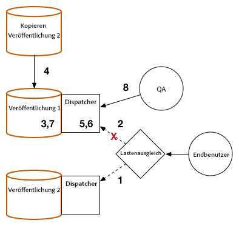

1. Aktivieren Sie Traffic zur Veröffentlichungsinstanz 2.
1. Beenden Sie Traffic zur Veröffentlichungsinstanz 1. 
1. Beenden Sie die Veröffentlichungsinstanz 1. 
1. Ersetzen Sie die Veröffentlichungsinstanz 1 durch eine Kopie der Veröffentlichungsinstanz 2.
1. Aktualisieren Sie das Dispatcher- oder Web-Modul, *falls erforderlich*.
1. Leeren Sie den Dispatcher-Cache der Veröffentlichungsinstanz 1.
1. Starten Sie die Veröffentlichungsinstanz 1.
1. QA validiert die Veröffentlichungsinstanz 1 über den Dispatcher, hinter der Firewall.

### Bei fehlgeschlagenem Upgrade (Rollback) {#rollback}

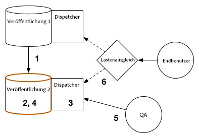

1. Erstellen Sie eine Kopie der Veröffentlichungsinstanz 1. 
1. Ersetzen Sie die Veröffentlichungsinstanz 2 durch eine Kopie der Veröffentlichungsinstanz 1.
1. Leeren Sie den Dispatcher-Cache der Veröffentlichungsinstanz 2.
1. Starten Sie die Veröffentlichungsinstanz 2.
1. QA validiert die Veröffentlichungsinstanz 2 über den Dispatcher, hinter der Firewall.
1. Aktivieren Sie Traffic zur Veröffentlichungsinstanz 2.

## Abschließende Upgrade-Schritte {#final-upgrade-steps}

1. Aktivieren Sie Traffic zur Veröffentlichungsinstanz 1.
1. QA führt die letzte Validierung von einer öffentlichen URL aus durch. 
1. Aktivieren Sie Replikationsagenten aus der Autorenumgebung. 
1. Setzen Sie das Authoring von Inhalt fort.
1. Führen Sie [Prüfungen nach dem Upgrade](/help/sites-deploying/post-upgrade-checks-and-troubleshooting.md) durch.

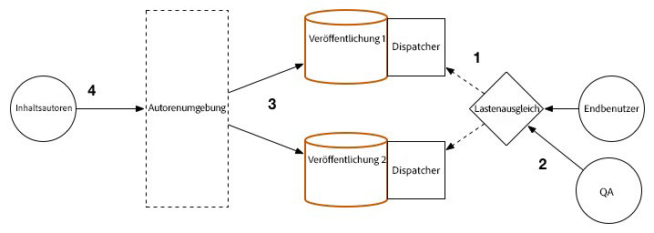
