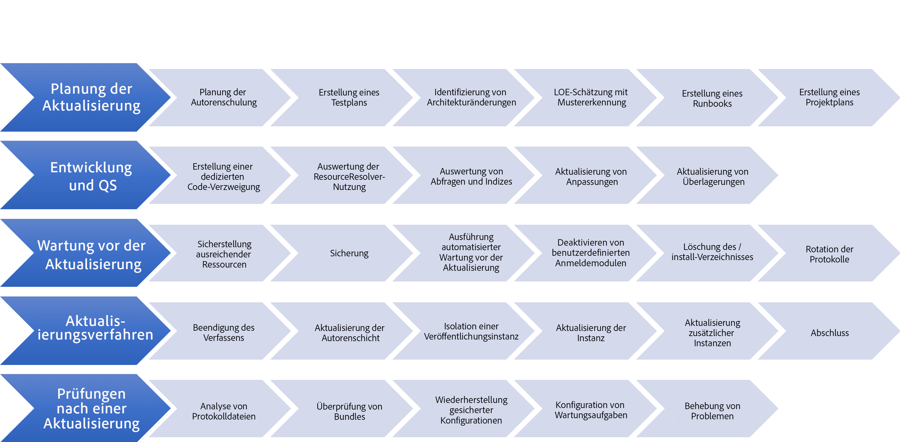
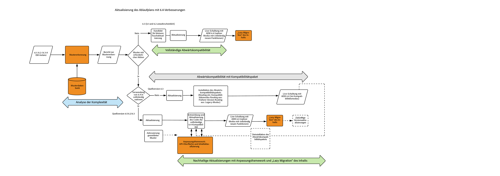

# Aktualisieren auf AEM 6.4{#upgrading-to-aem}

>[!CAUTION]
>
>AEM 6.4 hat das Ende der erweiterten Unterstützung erreicht und diese Dokumentation wird nicht mehr aktualisiert. Weitere Informationen finden Sie in unserer [technische Unterstützung](https://helpx.adobe.com/de/support/programs/eol-matrix.html). Unterstützte Versionen suchen [here](https://experienceleague.adobe.com/docs/?lang=de).

In diesem Abschnitt wird die Aktualisierung einer AEM auf AEM 6.4 beschrieben:

* [Planung von Upgrades](/help/sites-deploying/upgrade-planning.md)
* [Bewertung der Komplexität des Upgrades mit dem Musterdetektor ](/help/sites-deploying/pattern-detector.md)
* [Abwärtskompatibilität in AEM 6.4](/help/sites-deploying/backward-compatibility.md)
* [Upgrade-Verfahren](/help/sites-deploying/upgrade-procedure.md)
* [Upgrades von Code und Anpassungen](/help/sites-deploying/upgrading-code-and-customizations.md)
* [Wartungsaufgaben vor einem Upgrade](/help/sites-deploying/pre-upgrade-maintenance-tasks.md)
* [Durchführen eines In-Place-Upgrades](/help/sites-deploying/in-place-upgrade.md)
* [Prüfungen und Fehlerbehebung nach einem Upgrade](/help/sites-deploying/post-upgrade-checks-and-troubleshooting.md)
* [Nachhaltige Upgrades](/help/sites-deploying/sustainable-upgrades.md)
* [Lazy-Content-Migration](/help/sites-deploying/lazy-content-migration.md)
* [Repository-Neustrukturierung in AEM 6.4](/help/sites-deploying/repository-restructuring.md)

Für ein einfacheres Verständnis der in diesen Verfahren verwendeten AEM-Instanzen werden die folgenden Begriffe in diesen Artikeln verwendet:

* Die *source* -Instanz ist die AEM Instanz, von der Sie ein Upgrade durchführen.
* Die *target* -Instanz ist die Instanz, auf die Sie aktualisieren.

>[!NOTE]
>
>Im Rahmen der Bemühungen zur Verbesserung der Zuverlässigkeit von Upgrades wurde AEM 6.4 einer umfassenden Repository-Umstrukturierung unterzogen. Weitere Informationen zur Anpassung an die neue Struktur finden Sie unter [Repository-Neustrukturierung in AEM 6.4](/help/sites-deploying/repository-restructuring.md)

## Was hat sich geändert? {#what-has-changed}

Im Folgenden werden die wichtigsten Änderungen der letzten Versionen von AEM beschrieben:

In AEM 6.0 wurde das neue Jackrabbit-Oak-Repository eingeführt. Persistenz-Manager wurden durch [Mikrokernel](/help/sites-deploying/recommended-deploys.md) ersetzt. Ab Version 6.1 wird CRX2 nicht mehr unterstützt. Ein Migrationstool mit der Bezeichnung CRX2OAK muss ausgeführt werden, um CRX2-Repositorys von 5.6.1-Instanzen zu migrieren. Weitere Informationen finden Sie unter [Verwenden des CRX2OAK-Migrationstools](/help/sites-deploying/using-crx2oak.md).

Wenn Asset Insights verwendet werden soll und Sie ein Upgrade von einer Version vor AEM 6.2 durchführen, müssen Assets migriert und IDs für diese über ein JMX-Bean generiert werden. In internen Tests wurden 125.000 Assets in einer TarMK-Umgebung innerhalb einer Stunde migriert. Ihre Ergebnisse können jedoch möglicherweise abweichen.

Mit AEM 6.3 wurde ein neues Format für die `SegmentNodeStore`, die die Grundlage der TarMK-Implementierung bildet. Wenn Sie eine Version vor AEM 6.3 aktualisieren, muss beim Upgrade eine Migration des Repositorys durchgeführt werden, während der das System nicht verfügbar ist.

Adobe Engineering schätzt, dass diese Ausfallzeit ca. 20 Minuten beträgt. Beachten Sie, dass eine Neuindizierung nicht erforderlich ist. Darüber hinaus wurde eine neue Version des CRX2OAK-Tools für das neue Repository-Format veröffentlicht.

**Diese Migration ist nicht erforderlich, wenn Sie von AEM 6.3 auf AEM 6.4 aktualisieren.**

Die Wartungsaufgaben vor einem Upgrade wurden optimiert, um die Automatisierung zu unterstützen.

Die Befehlszeilenoptionen für die Verwendung des CRX2OAK-Tools wurden geändert, um diese automatisierungsfreundlich zu machen und mehr Upgrade-Pfade zu unterstützen.

Die Prüfungen nach einem Upgrade wurden ebenfalls automatisierungsfreundlich gestaltet.

Zu den regelmäßig durchzuführenden Routinewartungsaufgaben gehören jetzt die regelmäßige Revisionsbereinigung und die Bereinigung des Datenspeichers. Mit der Einführung von AEM 6.3 unterstützt und empfiehlt Adobe die Online-Revisionsbereinigung. Siehe [Revisionsbereinigung](/help/sites-deploying/revision-cleanup.md) für Informationen zur Konfiguration dieser Aufgaben.

**AEM 6.4** führt die [Musterdetektor](/help/sites-deploying/pattern-detector.md) für die Beurteilung der Komplexität des Upgrades während der Planung des Upgrades. In 6.4 liegt der Fokus auf der [Abwärtskompatibilität](/help/sites-deploying/backward-compatibility.md) der Funktionen. Außerdem wurden Best Practices für [nachhaltige Upgrades](/help/sites-deploying/sustainable-upgrades.md) hinzugefügt.

Weitere Informationen zu den Änderungen der letzten AEM finden Sie in den vollständigen Versionshinweisen:

* [https://helpx.adobe.com/de/experience-manager/6-2/release-notes.html](https://helpx.adobe.com/de/experience-manager/6-2/release-notes.html)
* [https://helpx.adobe.com/de/experience-manager/6-3/release-notes.html](https://helpx.adobe.com/de/experience-manager/6-3/release-notes.html)
* [https://helpx.adobe.com/de/experience-manager/6-4/release-notes.html](https://helpx.adobe.com/de/experience-manager/6-4/release-notes.html)

## Überblick über das Upgrade {#upgrade-overview}

Die Aktualisierung von AEM ist ein mehrstufiger Prozess, der in manchen Fällen mehrere Monate dauert. Die nachfolgende Darstellung gibt einen Überblick über die Bestandteile eines Upgrade-Projekts und die entsprechenden Inhalte, die in dieser Dokumentation enthalten sind:

## Ablauf des Upgrades mit 6.4 Upgrade-Verbesserungen {#upgrade-overview-1}

Das folgende Diagramm zeigt den für das Upgrade empfohlenen Ablauf. Beachten Sie bitte die neuen Funktionen, die wir eingeführt haben. Das Upgrade sollte damit starten, dass mit dem Musterdetektor ein Bericht über vorhandene Muster erstellt wird (siehe [Bewertung der Komplexität des Upgrades mit dem Musterdetektor](/help/sites-deploying/pattern-detector.md)), mit dessen Hilfe Sie entscheiden können, welchem Pfad Sie für die Kompatibilität mit AEM 6.4 folgen möchten.

In 6.4 haben wir einen starken Fokus darauf gelegt, alle neuen Funktionen abwärtskompatibel zu gestalten. In Fällen, in denen mit der Abwärtskompatibilität weiterhin Probleme auftreten, können Sie notwendige Entwicklungsarbeiten jedoch mit dem Kompatibilitätsmodus aufschieben und so Ihren benutzerdefinierten Code vorübergehend mit 6.4 kompatibel halten. Mit diesem Ansatz vermeiden Sie sofort nach dem Upgrade jeden erforderlichen Entwicklungsaufwand (siehe [Abwärtskompatibilität in AEM 6.4](/help/sites-deploying/backward-compatibility.md)).

In Ihrem 6.4-Entwicklungszyklus helfen Ihnen abschließend die unter „Nachhaltige Upgrades“ eingeführten Funktionen (siehe [Nachhaltige Upgrades](/help/sites-deploying/sustainable-upgrades.md)), Best Practices einzuhalten, um zukünftige Upgrades sogar noch effizienter und nahtloser durchzuführen.

