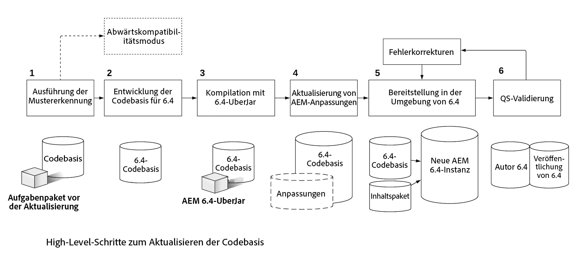

# Upgrades von Code und Anpassungen{#upgrading-code-and-customizations}

>[!CAUTION]
>
>AEM 6.4 hat das Ende der erweiterten Unterstützung erreicht und diese Dokumentation wird nicht mehr aktualisiert. Weitere Informationen finden Sie in unserer [technische Unterstützung](https://helpx.adobe.com/de/support/programs/eol-matrix.html). Unterstützte Versionen suchen [here](https://experienceleague.adobe.com/docs/?lang=de).

Beim Planen eines Upgrades sollten folgende Bereiche der Implementierung untersucht und berücksichtigt werden.

* [Upgrade der Code-Basis](#upgrade-code-base)
* [Anpassung an die 6.4-Repository-Struktur](#align-repository-structure)
* [AEM-Anpassungen](#aem-customizations)
* [Testverfahren](#testing-procedure)

## Übersicht {#overview}

1. **Musterdetektor** - Führen Sie den Musterdetektor aus, wie in der Aktualisierungsplanung beschrieben und detailliert unter [diese Seite](/help/sites-deploying/pattern-detector.md) um einen Musterdetektorbericht zu erhalten, der weitere Details zu Bereichen enthält, die zusätzlich zu den nicht verfügbaren APIs/Bundles in der Target-Version von AEM behoben werden müssen. Der Mustererkennungsbericht sollte Hinweise auf Inkompatibilitäten in Ihrem Code enthalten. Wenn keine vorhanden sind, ist Ihre Bereitstellung bereits mit 6.4 kompatibel. Sie können dennoch eine neue Entwicklung für die Verwendung von 6.4-Funktionen durchführen, aber Sie benötigen sie nicht nur zur Erhaltung der Kompatibilität. Wenn Inkompatibilitäten gemeldet werden, können Sie entweder a) das Ausführen im Kompatibilitätsmodus auswählen und Ihre Bereitstellung für neue 6.4-Funktionen oder die Kompatibilität zurückstellen oder b) nach dem Upgrade neuen Code entwickeln und mit Schritt 2 fortfahren. Weitere Einzelheiten finden Sie im Beitrag zur [Abwärtskompatibilität in AEM 6.4](/help/sites-deploying/backward-compatibility.md).

1. **Entwickeln einer Codebasis für 6.4** - Erstellen Sie eine dedizierte Verzweigung oder ein dediziertes Repository für die Codebasis der Target-Version. Nutzen Sie bei der Kompatibilitätsprüfung die vor dem Upgrade erfassten Daten, um die Code-Bereiche zu planen, die aktualisiert werden sollen.
1. **Kompilieren mit 6.4 UberJar** - Aktualisieren Sie Code-Basis-POMs so, dass sie auf 6.4 uber jar verweisen, und kompilieren Sie Code dafür.
1. **AEM aktualisieren** - Alle Anpassungen oder Erweiterungen, die AEM vorgenommen werden sollen, sollten aktualisiert/validiert werden, damit sie in 6.4 funktionieren, und zur Codebasis von 6.4 hinzugefügt werden. Dies beinhaltet Benutzeroberflächen-Suchformulare, Asset-Anpassungen und alle Komponenten, die „/mnt/overlay“ verwenden.

1. **Bereitstellung in der Umgebung von 6.4** – Eine neue Instanz von AEM 6.4 (Autor und Veröffentlichung) muss in einer Entwicklungs-/QS-Umgebung bereitgestellt werden. Stellen Sie die aktualisierte Code-Basis und ein repräsentatives Inhaltsbeispiel (aus der aktuellen Produktion) bereit.
1. **QS-Validierung und Fehlerkorrektur** – Die Anwendung muss auf der Autoren- und der Veröffentlichungsinstanz von 6.4 mit QS validiert werden. Korrigieren Sie die gefundenen Fehler und schließen Sie die Korrekturen in der Code-Basis von 6.4 mit ein. Wiederholen Sie den Entwicklungszyklus bei Bedarf, bis alle Fehler behoben sind.

Bevor Sie mit dem Upgrade beginnen, benötigen Sie eine stabile Anwendungs-Code-Basis, die sorgfältig gegen die Zielversion von AEM getestet wurde. Basierend auf den im Rahmen der Tests gemachten Beobachtungen kann möglicherweise der benutzerdefinierte Code optimiert werden. Dies kann unter anderem eine Umgestaltung des Codes umfassen, um zu vermeiden, dass das Repository durchsucht wird, eine benutzerdefinierte Indizierung zur Optimierung der Suche oder die Verwendung ungeordneter Knoten in JCR.

AEM 6.4 bietet Ihnen die Option, Ihre Code-Basis und Ihre Anpassungen für die Zusammenarbeit mit der neuen AEM-Version upzugraden. Außerdem hilft Ihnen AEM 6.5, Ihre Anpassungen mit der Abwärtskompatibilitätsfunktion effizienter zu verwalten, was auf [dieser Seite](/help/sites-deploying/backward-compatibility.md) beschrieben wird.

Wie oben bereits erwähnt und im folgenden Diagramm dargestellt, hilft Ihnen das Ausführen des [Musterdetektors](/help/sites-deploying/pattern-detector.md) im ersten Schritt, die gesamte Komplexität des Upgrades zu beurteilen und zu entscheiden, ob Sie den Kompatibilitätsmodus nutzen oder Ihre Anpassungen aktualisieren möchten, um alle neuen Funktionen von AEM 6.4 zu verwenden. Weitere Einzelheiten finden Sie auf der Seite [Abwärtskompatibilität in AEM 6.4](/help/sites-deploying/backward-compatibility.md).
[ ](assets/upgrade-code-base-highlevel.png)

## Upgrade der Code-Basis {#upgrade-code-base}

### Erstellen einer dedizierten Verzweigung für 6.4-Code in der Versionskontrolle   {#create-a-dedicated-branch-for-6-4-code-in-version-control}

Sämtlicher Code und alle Konfigurationen, die für Ihre AEM Implementierung erforderlich sind, sollten mit einer Versionskontrolle verwaltet werden. Es sollte eine dedizierte Verzweigung in der Versionskontrolle erstellt werden, um alle Änderungen zu verwalten, die für die Codebasis in der Zielversion von AEM erforderlich sind. In dieser Verzweigung werden iterative Tests der Codebasis mit der Zielversion von AEM und nachfolgenden Fehlerbehebungen verwaltet.

### Aktualisieren der UberJar-Version von AEM {#update-the-aem-uber-jar-version}

AEM-UberJar beinhaltet alle AEM-APIs als einzelne Abhängigkeiten in der Datei `pom.xml` des Maven-Projekts. Es empfiehlt sich immer, das UberJar als einzelne Abhängigkeit einzubeziehen, anstatt einzelne AEM API-Abhängigkeiten einzubeziehen. Beim Upgrade der Code-Basis sollte die UberJar-Version so geändert werden, dass sie auf die Zielversion von AEM verweist. Wenn Ihr Projekt auf einer Version von AEM entwickelt wurde, bevor das UberJar vorhanden war, sollten alle einzelnen AEM-API-Abhängigkeiten entfernt und durch eine einzige Einbindung des UberJar für die Zielversion von AEM ersetzt werden. Die Codebasis sollte dann mit der neuen Version des Uber Jar neu kompiliert werden. Alle veralteten APIs oder Methoden sollten aktualisiert werden, um mit der Zielversion von AEM kompatibel zu sein.

```
<dependency>
    <groupId>com.adobe.aem</groupId>
    <artifactId>uber-jar</artifactId>
    <version>6.4.0</version>
    <classifier>apis</classifier>
    <scope>provided</scope>
</dependency>
```

### Deaktivieren der Verwendung des administrativen Ressourcen-Resolvers {#phase-out-use-of-administrative-resource-resolver}

Die Verwendung einer administrativen Session über `SlingRepository.loginAdministrative()` und `ResourceResolverFactory.getAdministrativeResourceResolver()` war bei Code-Basen vor AEM 6.0 gängig. Diese Methode ist jedoch aus Sicherheitsgründen veraltet, da die Zugriffsstufe zu weit gefasst ist. [In zukünftigen Versionen von Sling werden diese Methoden entfernt](https://sling.apache.org/documentation/the-sling-engine/service-authentication.html#deprecation-of-administrative-authentication). Es wird dringend empfohlen, jeden Code neu zu strukturieren, um stattdessen Dienstbenutzer zu verwenden. Weitere Informationen zu Dienstbenutzern und [Informationen zum Auslaufen von administrativen Sitzungen finden Sie hier .](/help/sites-administering/security-service-users.md#how-to-phase-out-admin-sessions).

### Abfragen und Oak-Indizes {#queries-and-oak-indexes}

Abfragen in der Code-Basis müssen im Rahmen des Upgrades sorgfältig getestet werden. Für Kunden, die von Jackrabbit 2 (ältere Versionen als AEM 6.0) aus ein Upgrade durchführen, ist dies besonders wichtig, da Inhalt von Oak nicht automatisch indiziert wird und möglicherweise benutzerdefinierte Indizes erstellt werden müssen. Falls Sie von einer AEM 6.x-Version aus ein Upgrade durchführen, haben sich die vorkonfigurierten Oak-Indexdefinitionen möglicherweise geändert, was sich auf vorhandene Abfragen auswirken kann.

Es stehen verschiedene Tools zur Analyse und Überprüfung der Abfrageleistung zur Verfügung:

* [AEM-Indizierungs-Tools](/help/sites-deploying/queries-and-indexing.md)

* [Vorgangsdiagnose-Tools für die Abfrageleistung](/help/sites-administering/operations-dashboard.md#diagnosis-tools)

* [Oak Utils](https://oakutils.appspot.com/). Dies ist ein Open-Source-Tool, das von Adobe nicht gepflegt wird.

### Klassisches Benutzeroberflächen-Authoring {#classic-ui-authoring}

Das klassische Benutzeroberflächen-Authoring ist in AEM 6.4 weiterhin verfügbar, ist jedoch veraltet. Weitere Informationen finden Sie [hier](/help/release-notes/deprecated-removed-features.md#pre-announcement-for-next-release). Falls die Applikation derzeit in einer Umgebung mit klassischem Benutzeroberflächen-Authoring ausgeführt wird, wird empfohlen, auf AEM 6.4 upzugraden und die klassische Benutzeroberfläche weiterhin zu verwenden. Die Migration zur Touch-optimierten Benutzeroberfläche kann als separates Projekt geplant und in mehreren Entwicklungszyklen abgeschlossen werden. Um die klassische Benutzeroberfläche in AEM 6.4 zu verwenden, sind mehrere OSGi-Konfigurationen erforderlich, die in der Codebasis gespeichert werden müssen. Einzelheiten zur Konfiguration finden Sie [hier](/help/sites-administering/enable-classic-ui.md).

>[!NOTE]
>
>Wenn Sie die klassische Benutzeroberfläche verlassen und die neuesten AEM nutzen möchten, sollten Sie die [AEM Modernisierungs-Tools](/help/sites-developing/modernization-tools.md) um die Migration zu vereinfachen.

## Anpassung an die 6.4-Repository-Struktur {#align-repository-structure}

Um Upgrades zu vereinfachen und um sicherzustellen, dass Konfigurationen nicht bei einem Upgrade überschrieben werden, wurde das Repository in 6.4 neu strukturiert, damit Inhalte und Konfiguration voneinander getrennt sind.

Aus diesem Grund müssen einige Einstellungen verschoben werden, damit sie sich nicht mehr wie bisher unter `/etc` befinden. Eine vollständige Aufstellung aller fraglichen Punkte zur Repository-Neustrukturierung, die bei der Aktualisierung auf AEM 6.4 überprüft und berücksichtigt werden müssen, finden Sie unter [Repository-Neustrukturierung in AEM 6.4](/help/sites-deploying/repository-restructuring.md).

## AEM-Anpassungen  {#aem-customizations}

Alle Anpassungen an die AEM Authoring-Umgebung in der Quellversion von AEM müssen identifiziert werden. Nach der Identifizierung wird empfohlen, jede Anpassung in der Versionskontrolle zu speichern oder mindestens als Teil eines Inhaltspakets zu sichern. Vor einem Produktions-Upgrade müssen alle Anpassungen in einer QS- oder Staging-Umgebung bereitgestellt und validiert werden, die auf der Zielversion von AEM ausgeführt wird.

### Überlagerungen im Allgemeinen {#overlays-in-general}

Es ist eine gängige Praxis, AEM vorkonfigurierte Funktionalität zu erweitern, indem Knoten und/oder Dateien unter /libs mit zusätzlichen Knoten unter /apps überlagert werden. Diese Überlagerungen sollten in der Versionskontrolle nachverfolgt und mit der Zielversion von AEM getestet werden. Wenn eine Datei (JS, JSP, HTL) überlagert wird, wird empfohlen, einen Kommentar dazu abzugeben, welche Funktion für einfachere Regressionstests für die Zielversion von AEM erweitert wurde. Weitere Informationen zu Überlagerungen im Allgemeinen finden Sie unter [here](/help/sites-developing/overlays.md). Anweisungen zu bestimmten AEM-Überlagerungen finden Sie unten.

### Upgrades von benutzerdefinierten Suchformularen {#upgrading-custom-search-forms}

Benutzerdefinierte Suchfacetten müssen nach dem Upgrade teilweise manuell angepasst werden, damit sie ordnungsgemäß funktionieren. Weitere Einzelheiten finden Sie unter [Upgrades von benutzerdefinierten Suchformularen](/help/sites-deploying/upgrading-custom-search-forms.md).

### Anpassungen der Assets-Benutzeroberfläche {#assets-ui-customizations}

>[!NOTE]
>
>Dieses Verfahren ist nur für Upgrades von Versionen vor AEM 6.2 erforderlich.

Instanzen mit benutzerdefinierten bereitgestellten Assets müssen für das Upgrade vorbereitet werden. Dies ist erforderlich, um sicherzustellen, dass alle benutzerdefinierten Inhalte mit der neuen Knotenstruktur 6.4 kompatibel sind.

Sie können die Assets-UI-Anpassungen wie folgt vorbereiten:

1. Öffnen Sie in der Instanz, die aktualisiert werden muss, die CRXDE Lite, indem Sie `https://server:port/crx/de/index.jsp`

1. Navigieren Sie zum folgenden Knoten:

   * `/apps/dam/content`

1. Benennen Sie den Knoten content in **content_backup** um. Hierzu können Sie mit der rechten Maustaste auf den Explorer-Bereich links im Fenster klicken und **Umbenennen** auswählen.

1. Wenn der Knoten umbenannt wurde, erstellen Sie unter `/apps/dam` den neuen Knoten namens **content** und legen Sie als Knotentyp **sling:Folder** fest.

1. Verschieben Sie alle untergeordneten Knoten von **content_backup** in den neu erstellten Knoten content. Klicken Sie dazu mit der rechten Maustaste auf jeden untergeordneten Knoten im Explorer-Bereich und wählen Sie **Verschieben**.

1. Löschen Sie die **content_backup** Knoten.

1. Die aktualisierten Knoten unter `/apps/dam` mit dem richtigen Knotentyp `sling:Folder` sollten idealerweise in der Versionskontrolle gespeichert und mit der Code-Basis oder als minimale Sicherungskopie eines Inhaltspakets bereitgestellt werden.

### Generieren von Asset-IDs für vorhandene Assets {#generating-asset-ids-for-existing-assets}

Um Asset-IDs für vorhandene Assets zu generieren, führen Sie für diese ein Upgrade durch, wenn Sie die AEM-Instanz auf AEM 6.4 aktualisieren. Dies ist erforderlich, um die Funktion [Assets Insights](/help/assets/touch-ui-asset-insights.md) zu aktivieren. Weitere Informationen finden Sie unter [Hinzufügen von Einbettungscode](/help/assets/touch-ui-using-page-tracker.md#adding-embed-code).

Um Assets upzugraden, konfigurieren Sie das Paket „Associate Asset IDs“ in der JMX-Konsole. Je nach Anzahl der Assets im Repository kann das Ausführen von `migrateAllAssets` lange dauern. Internen Tests zufolge liegt der Schätzwert für TarMK bei einem Durchsatz von 125.000 Assets pro Stunde.


Falls Sie Asset-IDs für eine Untermenge Ihrer gesamten Assets benötigen, verwenden Sie die API `migrateAssetsAtPath`.

Verwenden Sie für alle anderen Zwecke die API `migrateAllAssets()`.

### InDesign-Skript-Anpassungen {#indesign-script-customizations}

Adobe empfiehlt, benutzerdefinierte Skripte unter `/apps/settings/dam/indesign/scripts` abzulegen. Weitere Informationen zu InDesign-Script-Anpassungen finden Sie [here](/help/assets/indesign.md#configuring-the-aem-assets-workflow).

### Wiederherstellen von ContextHub-Konfigurationen {#recovering-contexthub-configurations}

ContextHub-Konfigurationen werden durch ein Upgrade vorgenommen. Anweisungen, wie Sie vorhandene ContextHub-Konfigurationen wiederherstellen, finden Sie [hier](/help/sites-administering/contexthub-config.md#recovering-contexthub-configurations-after-upgrading).

### Workflow-Anpassungen {#workflow-customizations}

Es wird empfohlen, vordefinierte Workflows zu aktualisieren, um nicht benötigte Funktionen hinzuzufügen oder zu entfernen. Der Workflow DAM-Update-Asset ist ein typischer Workflow, der häufig angepasst wird. Erstellen Sie eine Sicherungskopie aller für eine angepasste Implementierung erforderlichen Workflows und speichern Sie diese in der Versionskontrolle, da sie möglicherweise bei einem Upgrade überschrieben werden.

### Bearbeitbare Vorlagen {#editable-templates}

>[!NOTE]
>
>Dieses Verfahren ist nur für Website-Upgrades erforderlich, bei denen bearbeitbare Vorlagen aus AEM 6.2 verwendet werden.

Die Struktur bearbeitbarer Vorlagen wurde zwischen AEM 6.2 und 6.3 geändert. Wenn Sie ein Upgrade von 6.2 oder früher durchführen und wenn Ihr Site-Inhalt mit bearbeitbaren Vorlagen erstellt wurde, müssen Sie die [Bereinigungs-Tool für responsive Knoten](https://github.com/Adobe-Marketing-Cloud/aem-sites-template-migration). Das Tool muss **_nach_** einem Upgrade ausgeführt werden, um Inhalt zu bereinigen. Sie muss auf der Autoren- und der Veröffentlichungsschicht ausgeführt werden.

### Änderungen an der CUG-Implementierung {#cug-implementation-changes}

Die Implementierung von geschlossenen Benutzergruppen hat sich erheblich geändert, um Leistungs- und Skalierbarkeitsbeschränkungen in früheren Versionen von AEM zu beheben. Die vorherige Version von CUG wurde in Version 6.3 eingestellt und die neue Implementierung wird nur in der Touch-Benutzeroberfläche unterstützt. Wenn Sie ein Upgrade von 6.2 oder früher durchführen, finden Sie [hier](/help/sites-administering/closed-user-groups.md#upgrade-cug) eine Anleitung für das Migrieren zur neuen CUG-Implementierung.

## Testverfahren {#testing-procedure}

Zum Testen von Upgrades sollte ein umfassender Testplan erstellt werden. Das Testen der upgegradeten Code-Basis und Anwendung muss zuerst in Umgebungen auf niedrigerer Ebene erfolgen. Alle Fehler müssen iterativ korrigiert werden, bis die Code-Basis stabil ist. Führen Sie erst dann Upgrades für Umgebungen auf höherer Ebene durch.

### Testen des Upgrade-Verfahrens {#testing-the-upgrade-procedure}

Testen Sie das hier beschriebene Upgrade-Verfahren in Entwicklungs- und QA-Umgebungen, wie im benutzerdefinierten Runbook dokumentiert (siehe [Planung des Upgrades](/help/sites-deploying/upgrade-planning.md)). Das Upgrade-Verfahren muss wiederholt werden, bis alle Schritte im Upgrade-Runbook dokumentiert sind und das Upgrade-Verfahren reibungslos läuft.

### Implementierungstestbereiche  {#implementation-test-areas-}

Im Folgenden sind wichtige Bereiche einer AEM-Implementierung genannt, die vom Testplan abgedeckt sein müssen, sobald die Umgebung upgegradet und die aktualisierte Code-Basis bereitgestellt wurde.

<table> 
 <tbody> 
  <tr> 
   <td><strong>Funktioneller Testbereich</strong></td> 
   <td><strong>Beschreibung</strong></td> 
  </tr> 
  <tr> 
   <td>Veröffentlichte Sites</td> 
   <td>Testen der AEM-Implementierung und des zugehörigen Codes auf der Veröffentlichungsebene<br /> über den Dispatcher. Sollte Kriterien für Seitenaktualisierungen enthalten und<br /> Cache-Invalidierung.</td> 
  </tr> 
  <tr> 
   <td>Authoring</td> 
   <td>Testen von AEM-Implementierung und zugehörigem Code auf der Autorenschicht. Sollte Seiten-, Komponenten-Authoring- und Dialogfelder enthalten.</td> 
  </tr> 
  <tr> 
   <td>Integrationen mit Marketing Cloud-Lösungen</td> 
   <td>Validieren von Integrationen mit Produkten wie Analytics, DTM und Target.</td> 
  </tr> 
  <tr> 
   <td>Integration mit Drittanbietersystemen</td> 
   <td>Alle Drittanbieterintegrationen sollten sowohl auf der Autoren- als auch auf der Veröffentlichungsschicht validiert werden.</td> 
  </tr> 
  <tr> 
   <td>Authentifizierung, Sicherheit und Berechtigungen</td> 
   <td>Alle Authentifizierungsmechanismen wie LDAP/SAML sollten überprüft werden.<br /> Berechtigungen und Gruppen sollten sowohl in der Autoren- als auch in der Veröffentlichungsinstanz getestet werden<br /> Ebenen.</td> 
  </tr> 
  <tr> 
   <td>Abfragen</td> 
   <td>Benutzerdefinierte Indizes und Abfragen sollten zusammen mit der Abfrageleistung getestet werden.</td> 
  </tr> 
  <tr> 
   <td>Benutzeroberflächenanpassungen</td> 
   <td>Alle Erweiterungen oder Anpassungen der AEM Benutzeroberfläche in der Autorenumgebung.</td> 
  </tr> 
  <tr> 
   <td>Workflows</td> 
   <td>Benutzerdefinierte und/oder vordefinierte Workflows und Funktionen.</td> 
  </tr> 
  <tr> 
   <td>Leistungstests</td> 
   <td>Lasttests sollten sowohl auf der Autoren- als auch auf der Veröffentlichungsschicht durchgeführt werden, um reale Szenarien zu simulieren.</td> 
  </tr> 
 </tbody> 
</table>

### Dokumenttest-Plan und Ergebnisse {#document-test-plan-and-results}

Es sollte ein Testplan erstellt werden, der die oben genannten Implementierungstestbereiche abdeckt. In vielen Fällen ist es sinnvoll, den Testplan nach Aufgabenlisten für Autoren- und Veröffentlichungsaufgaben zu trennen. Dieser Testplan muss auf Entwicklungs-, QA- und Staging-Umgebung ausgeführt werden, bevor Produktionsumgebungen upgegradet werden. Erfassen Sie die Testergebnisse und Leistungsmetriken aus Umgebungen niedrigerer Ebenen als Referenzwerte für das Upgrade der Staging- und Produktionsumgebungen.
