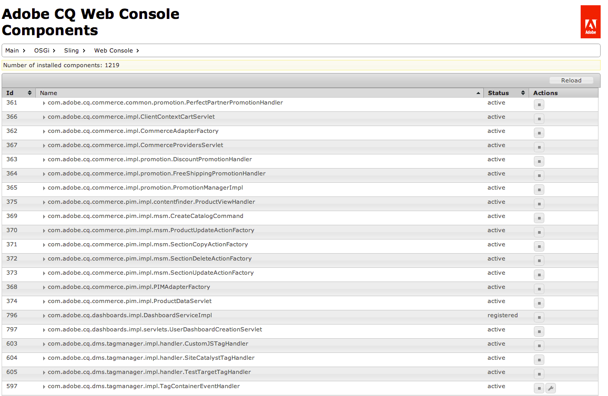

# Web-Konsole{#web-console}

Die Web-Konsole in AEM basiert auf der [Apache Felix Web Management Console](https://felix.apache.org/documentation/subprojects/apache-felix-web-console.html). Apache Felix ist ein gemeinschaftlich entwickeltes Framework zum Implementieren der OSGi R4 Service Platform, die das OSGi-Framework und die Standarddienste umfasst.

>[!NOTE]
>
>In der Web-Konsole beziehen sich alle Beschreibungen mit Standardeinstellungen auf Sling-Standardwerte.
>
>Für AEM gelten eigene Standardeinstellungen, sodass sich die festgelegten Standardeinstellungen möglicherweise von denen der Konsole unterscheiden.

Die Web-Konsole umfasst eine Reihe von Registerkarten für die Verwaltung der OSGi-Bundles, darunter:

* [Konfiguration:](#configuration) Dient zur Konfiguration der OSGi-Bundles und bildet deshalb den zugrunde liegenden Mechanismus für die Konfiguration der AEM-Systemparameter.
* [Bundles:](#bundles) Dient zum Installieren von Bundles.
* [Komponenten:](#components) Steuert den Status der für AEM erforderlichen Komponenten.

Alle vorgenommenen Änderungen werden sofort auf das laufende System angewendet. Ein Neustart ist nicht erforderlich.

Der Zugriff auf die Konsole ist über `../system/console`; Beispiel:

`http://localhost:4502/system/console/components`

## Konfiguration {#configuration}

Die Registerkarte **Konfiguration** dient zur Konfiguration der OSGi-Bundles und bildet deshalb den zugrunde liegenden Mechanismus für die Konfiguration der AEM-Systemparameter.

>[!NOTE]
>
>Weitere Einzelheiten finden Sie unter [OSGi-Konfiguration mit der Web-Konsole](/help/sites-deploying/configuring-osgi.md).

Sie können mit einer der beiden folgenden Methoden auf die Registerkarte **Konfiguration** zugreifen:

* Dropdown-Menü:

   **OSGi >**

* die URL; Beispiel:

   `http://localhost:4502/system/console/configMgr`

Eine Liste der Konfigurationen wird angezeigt:

Es gibt zwei Arten von Konfigurationen, die in den Dropdown-Listen auf dem Bildschirm verfügbar sind:

* **Konfigurationen** Ermöglicht die Aktualisierung der vorhandenen Konfigurationen. Diese haben eine Persistent Identity (PID) und fallen in eine der beiden folgenden Kategorien:

   * Standardkonfigurationen, die ein integraler Bestandteil von AEM sind. Sie sind erforderlich, und die Werte werden beim Löschen auf die Standardeinstellungen zurückgesetzt.
   * Instanzen, die vom Benutzer auf Basis von Factory-Konfigurationen erstellt werden. Sie werden durch Löschen der Instanzen entfernt.

* **Factory-Konfigurationen** Diese Konfigurationen ermöglichen die Erstellung einer Instanz des erforderlichen Funktionsobjekts.

   Diesem Objekt wird eine Persistent Identity (PID) zugewiesen und es wird dann in der Dropdown-Liste „Konfigurationen“ aufgeführt.

Bei Auswahl eines Eintrags aus den Listen werden die Parameter für die Konfiguration angezeigt:

Die Parameter können dann ggf. aktualisiert werden und Sie können unter folgenden Optionen wählen:

* **Speichern**

   Speichern Sie die vorgenommenen Änderungen.

    Für eine Factory-Konfiguration wird hierdurch eine neue Instanz mit einer Persistent Identity erstellt. Die neue Instanz wird dann unter „Konfigurationen“ aufgelistet.

* **Zurücksetzen**

   Setzen Sie die auf dem Bildschirm angezeigten Parameter auf die zuletzt gespeicherten zurück.

* **Löschen**

   Löschen Sie die aktuelle Konfiguration. Bei einer Standardinstanz werden die Parameter auf die Standardeinstellungen zurückgesetzt. Basiert die Instanz auf einer Factory-Konfiguration, wird die spezifische Instanz gelöscht.

* **Bindung aufheben**

   Heben Sie die Bindung der aktuellen Konfiguration aus dem Bundle auf.

* **Abbrechen**

   Abbrechen aktueller Änderungen.

## Bundles {#bundles}

Die **Bundles** tab ist der Mechanismus zum Installieren der für AEM erforderlichen OSGi-Pakete. Sie können mit einer der beiden folgenden Methoden auf die Registerkarte zugreifen:

* Dropdown-Menü:

   **OSGi >**

* die URL; Beispiel:

   `http://localhost:4502/system/console/bundles`

Eine Liste mit Bundles wird angezeigt:

Auf dieser Registerkarte stehen folgende Optionen zur Verfügung:

* **Installieren oder Aktualisieren**

   Sie können **Durchsuchen** , um die Datei zu suchen, die Ihr Bundle enthält, und anzugeben, ob sie **Starten** unmittelbar und **Startstufe**.

* **Neu laden**

   Aktualisiert die angezeigte Liste.

* **Aktualisieren von Paketen**

   Dadurch werden die Referenzen aller Pakete überprüft und bei Bedarf aktualisiert.

    So werden möglicherweise nach einer Aktualisierung die alte und die neue Version aufgrund vorheriger Verweise weiter ausgeführt, Diese Option prüft und transferiert alle Verweise auf die neue Version, sodass die alte Version beendet werden kann.

* **Anfang**

   Startet ein Bundle entsprechend der angegebenen Startebene.

* **Anhalten**

   Stoppt das Bundle.

* **Deinstallieren**

   Deinstalliert das Bundle vom System.

* **Status anzeigen**

   Die Liste gibt den aktuellen Status des Bundles an. Klicken Sie auf den Namen eines bestimmten Bundles mit weiteren Informationen.

>[!NOTE]
>
>Nach einer **Aktualisierung** wird empfohlen, die **Pakete zu aktualisieren**.

## Komponenten {#components}

Die **Komponenten** können Sie die verschiedenen Komponenten aktivieren bzw. deaktivieren. Sie können mit einer der beiden folgenden Methoden auf die Registerkarte zugreifen:

* Dropdown-Menü:

   **Main >**

* die URL; Beispiel:

   `http://localhost:4502/system/console/components`

Eine Liste der Komponenten wird angezeigt. Eine Reihe von Symbolen steht zur Verfügung, mit denen Sie die Komponenten aktivieren, deaktivieren oder ggf. Konfigurationsdetails für eine bestimmte Komponente öffnen können.

Klicken Sie auf den Namen einer bestimmten Komponente, um weitere Informationen zu deren Status anzuzeigen. Hier können Sie die Komponente auch aktivieren, deaktivieren oder neu laden.

>[!NOTE]
>
>Das Aktivieren oder Deaktivieren einer Komponente gilt nur, bis AEM/CRX neu gestartet wird.
>
>Der Startstatus ist im Komponenten-Deskriptor definiert, der bei der Entwicklung generiert wird, und wird bei der Bundle-Erstellung im Bundle gespeichert.
