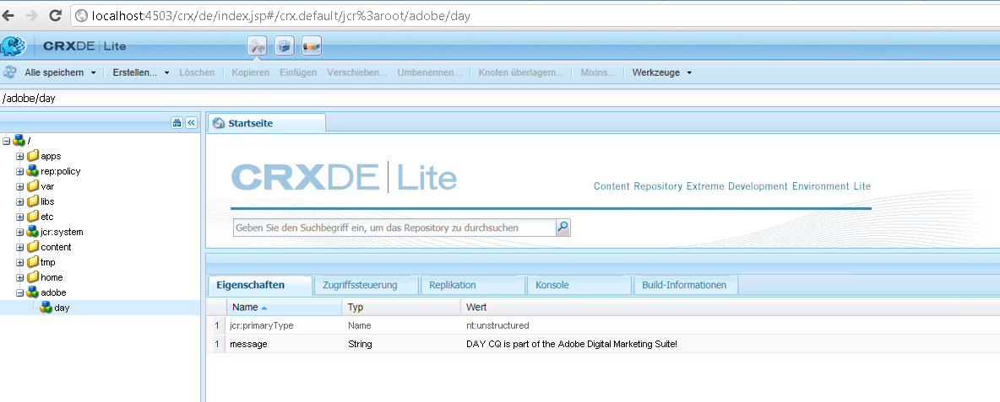

# Anleitung für den programmgesteuerten Zugriff auf das AEM-JCR{#how-to-programmatically-access-the-aem-jcr}

>[!CAUTION]
>
>AEM 6.4 hat das Ende der erweiterten Unterstützung erreicht und diese Dokumentation wird nicht mehr aktualisiert. Weitere Informationen finden Sie in unserer [technische Unterstützung](https://helpx.adobe.com/de/support/programs/eol-matrix.html). Unterstützte Versionen suchen [here](https://experienceleague.adobe.com/docs/?lang=de).

Sie können programmgesteuert Knoten und Eigenschaften ändern, die sich innerhalb des Adobe CQ-Repositorys befinden, das Teil von Adobe Marketing Cloud ist. Um auf das CQ-Repository zuzugreifen, verwenden Sie die Java Content Repository (JCR)-API. Sie können die Java JCR-API verwenden, um Vorgänge zum Erstellen, Ersetzen, Aktualisieren und Löschen (CRUD) von Inhalten im Adobe CQ-Repository durchzuführen. Weitere Informationen zur Java JCR-API finden Sie unter [https://jackrabbit.apache.org/jcr/jcr-api.html](https://jackrabbit.apache.org/jcr/jcr-api.html).

>[!NOTE]
>
>Dieser Entwicklungsartikel ändert das Adobe CQ-JCR von einer externen Java-Anwendung. Im Gegensatz dazu können Sie das JCR in einem OSGi-Bundle mithilfe der JCR-API ändern. Details finden Sie in [Beibehalten von CQ-Daten im Java Content Repository](https://experienceleague.adobe.com/docs/experience-manager-learn/getting-started-wknd-tutorial-develop/overview.html?lang=de).

>[!NOTE]
>
>Fügen Sie dem Klassenpfad Ihrer Java-Anwendung die Datei `jackrabbit-standalone-2.4.0.jar` hinzu, um die JCR-API zu verwenden. Diese JAR-Datei finden Sie auf der Web-Seite der Java JCR-API unter [https://jackrabbit.apache.org/jcr/jcr-api.html](https://jackrabbit.apache.org/jcr/jcr-api.html).

>[!NOTE]
>
>Informationen zum Abfragen des Adobe CQ-JCR mithilfe der JCR-Abfrage-API finden Sie unter [Abfrage von Adobe Experience Manager-Daten mit der JCR-API](https://helpx.adobe.com/de/experience-manager/using/querying-experience-manager-data-using1.html).

## Erstellen einer Repository-Instanz {#create-a-repository-instance}

Es gibt unterschiedliche Verfahren zur Herstellung einer Verbindung mit einem Repository. In diesem Entwicklungsartikel wird eine statische Methode verwendet, die der Klasse `org.apache.jackrabbit.commons.JcrUtils` zuzuordnen ist. Der Name der Methode lautet `getRepository`. Diese Methode verwendet einen Zeichenfolgenparameter, der die URL des Adobe CQ-Servers darstellt. Beispiel `http://localhost:4503/crx/server`.

Die Methode `getRepository` gibt eine `Repository`-Instanz zurück, was im folgenden Codebeispiel veranschaulicht wird.

```java
//Create a connection to the AEM JCR repository running on local host
Repository repository = JcrUtils.getRepository("http://localhost:4503/crx/server");
```

## Sitzungsinstanz erstellen {#create-a-session-instance}

Die `Repository`-Instanz stellt das CRX-Repository dar. Mit der `Repository`-Instanz stellen Sie eine Sitzung mit dem Repository her. Zum Erstellen einer Sitzung rufen Sie die `login`-Methode der `Repository`-Instanz auf und übergeben ein `javax.jcr.SimpleCredentials`-Objekt. Die `login`-Methode gibt eine `javax.jcr.Session`-Instanz zurück.

Sie erstellen ein `SimpleCredentials`-Objekt, indem Sie seinen Konstruktor verwenden und die folgenden Zeichenfolgenwerte übergeben:

* den Benutzernamen;
* Das entsprechende Kennwort

Rufen Sie bei der Übergabe des zweiten Parameters die `toCharArray`-Methode des Zeichenfolgenobjekts auf. Der folgende Code zeigt, wie Sie die `login`-Methode aufrufen, die eine `javax.jcr.Sessioninstance` zurückgibt.

```java
//Create a Session instance
javax.jcr.Session session = repository.login( new SimpleCredentials("admin", "admin".toCharArray()));
```

## Erstellen einer Knoteninstanz {#create-a-node-instance}

Nutzen Sie eine `Session`-Instanz, um eine `javax.jcr.Node`-Instanz zu erstellen. Mit einer `Node`-Instanz können Sie Knotenvorgänge durchführen. Beispielsweise können Sie einen neuen Knoten erstellen. Um einen Knoten zu erstellen, der den Stammknoten darstellt, rufen Sie die `getRootNode`-Methode der `Session`-Instanz auf, wie in der folgenden Codezeile veranschaulicht.

```java
//Create a Node
Node root = session.getRootNode();
```

Nach der Erstellung der `Node`-Instanz können Sie verschiedene Aufgaben ausführen, z. B. einen anderen Knoten erstellen und ihm einen Wert hinzufügen. Beispielsweise erstellt der folgende Code zwei Knoten und fügt dem zweiten Knoten einen Wert hinzu.

```java
// Store content 
Node day = adobe.addNode("day");
day.setProperty("message", "Adobe CQ is part of the Adobe Digital Marketing Suite!");
```

## Abrufen von Knotenwerten {#retrieve-node-values}

Zum Abrufen eines Knotens und seines Werts rufen Sie die `getNode`-Methode der `Node`-Instanz auf und übergeben einen Zeichenfolgenwert, der den vollqualifizierten Pfad zum Knoten darstellt. Betrachten Sie die Knotenstruktur, die im vorherigen Codebeispiel erstellt wurde. Um den Day-Knoten abzurufen, geben Sie adobe/day an, wie im folgenden Code gezeigt:

```java
// Retrieve content
Node node = root.getNode("adobe/day");
System.out.println(node.getPath());
System.out.println(node.getProperty("message").getString());
```

## Erstellen von Knoten im Adobe CQ-Repository {#create-nodes-in-the-adobe-cq-repository}

Das folgende Java-Codebeispiel stellt eine Java-Klasse dar, die eine Verbindung mit Adobe CQ herstellt, eine `Session`-Instanz erstellt und neue Knoten hinzufügt. Einem Knoten wird ein Datenwert zugewiesen, woraufhin der Wert des Knotens und seines Pfades aus der Konsole geschrieben wird. Melden Sie sich ab, um die Sitzung zu beenden.

```java
/*
 * This Java Quick Start uses the jackrabbit-standalone-2.4.0.jar
 * file. See the previous section for the location of this JAR file
 */
 
import javax.jcr.Repository; 
import javax.jcr.Session; 
import javax.jcr.SimpleCredentials; 
import javax.jcr.Node; 
 
import org.apache.jackrabbit.commons.JcrUtils;
import org.apache.jackrabbit.core.TransientRepository;

public class GetRepository {

public static void main(String[] args) throws Exception { 
 
try { 
 
    //Create a connection to the CQ repository running on local host 
    Repository repository = JcrUtils.getRepository("http://localhost:4503/crx/server");
   
   //Create a Session
   javax.jcr.Session session = repository.login( new SimpleCredentials("admin", "admin".toCharArray())); 
 
  //Create a node that represents the root node
  Node root = session.getRootNode(); 
 
  // Store content 
  Node adobe = root.addNode("adobe"); 
  Node day = adobe.addNode("day"); 
  day.setProperty("message", "Adobe CQ is part of the Adobe Digital Marketing Suite!");

  // Retrieve content 
  Node node = root.getNode("adobe/day"); 
  System.out.println(node.getPath()); 
  System.out.println(node.getProperty("message").getString()); 
 
  // Save the session changes and log out
  session.save(); 
  session.logout();
  }
 catch(Exception e){
  e.printStackTrace();
  }
 } 
}
```

Nach dem Ausführen des vollständigen Codebeispiels und dem Erstellen der Knoten können Sie die neuen Knoten in **[!UICONTROL CRXDE Lite]** anzeigen, wie in der folgenden Illustration veranschaulicht.


