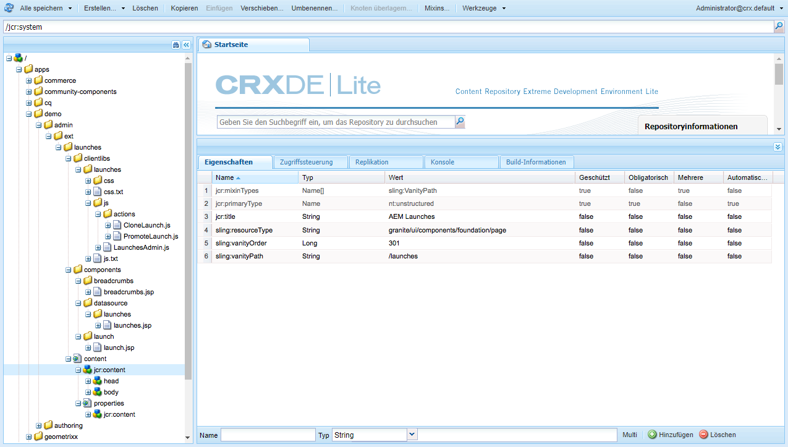
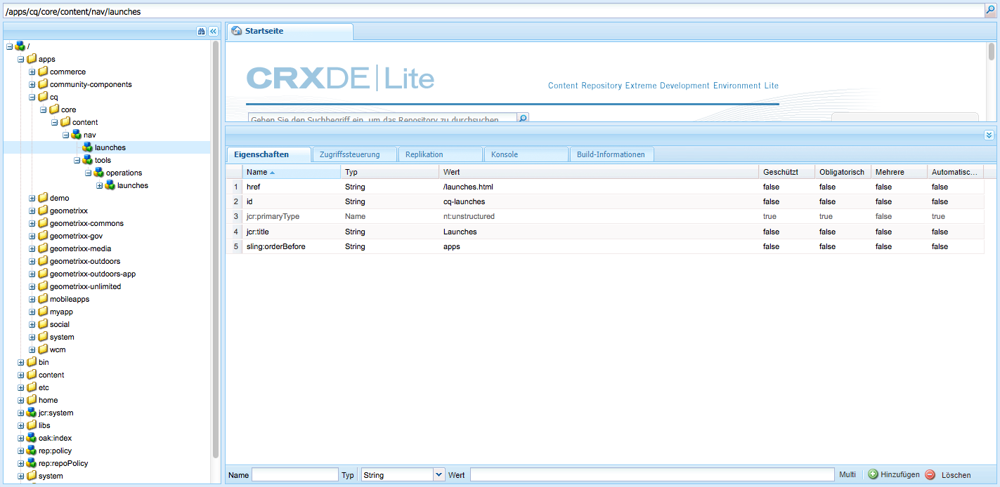

# Anpassen der Konsolen{#customizing-the-consoles}

>[!CAUTION]
>
>In diesem Dokument wird beschrieben, wie Sie Konsolen in der modernen, Touch-optimierten Benutzeroberfläche anpassen. Die Hinweise gelten nicht für die klassische Benutzeroberfläche.

AEM bietet verschiedene Methoden zum Anpassen von Konsolen (und der [Seitenbearbeitungsfunktionen](/help/sites-developing/customizing-page-authoring-touch.md)) Ihrer Autoreninstanz.

* Clientlibs

   Clientlibs ermöglichen es Ihnen, die Standardimplementierung zu erweitern, um neue Funktionen zu realisieren und gleichzeitig die Standardfunktionen, -objekte und -methoden wiederzuverwenden. Bei der Anpassung können Sie Ihre eigene clientlib unter erstellen. `/apps.` Beispielsweise kann er den Code enthalten, der für Ihre benutzerdefinierte Komponente erforderlich ist.

* Überlagerungen

   Überlagerungen basieren auf Knotendefinitionen und ermöglichen die Überlagerung der Standardfunktionen (in `/libs`) mit Ihrer eigenen benutzerdefinierten Funktionalität (in `/apps`). Wenn Sie eine Überlagerung erstellen, ist keine 1:1-Kopie des Originals erforderlich, da die Sling-Ressourcenzusammenführung das Vererben zulässt.

Überlagerungen können vielseitig zum Erweitern von AEM-Konsolen verwendet werden. Einige davon sind nachstehend (allgemein) beschrieben.

>[!NOTE]
>
>Weitere Informationen finden Sie unter:
>
>* Verwenden und Erstellen von [Clientbibliotheken](/help/sites-developing/clientlibs.md).
>* Verwenden und Erstellen von [Überlagerungen](/help/sites-developing/overlays.md).
>* [Granite](https://helpx.adobe.com/de/experience-manager/6-4/sites/developing/using/reference-materials/granite-ui/api/index.html)
>
>Dieses Thema wird auch in der [AEM Gems-Sitzung Anpassung der Benutzeroberfläche für AEM 6.0](https://experienceleague.adobe.com/docs/experience-manager-gems-events/gems/gems2014/aem-user-interface-customization-for-aem6.html) behandelt.

>[!CAUTION]
>
>Sie dürfen ***keinerlei*** Änderungen im Pfad `/libs` vornehmen,
>
>da der Inhalt von `/libs` überschrieben wird, wenn Sie die Instanz das nächste Mal aktualisieren. (Außerdem kann der Inhalt auch durch Anwenden von Hotfixes oder Feature Packs überschrieben werden.)
>
>Die empfohlene Methode zur Konfiguration und für andere Änderungen sieht wie folgt aus:
>
>1. Erstellen Sie das erforderliche Element (d. h. wie es in vorhanden ist) neu. `/libs`) unter `/apps`
>
>1. Nehmen Sie die gewünschten Änderungen in `/apps` vor.

>

Beispielsweise die folgenden Stellen innerhalb der `/libs` -Struktur kann überlagert werden:

* Konsolen (alle Konsolen basierend auf Seiten der Granite-Benutzeroberfläche); zum Beispiel:

   * `/libs/wcm/core/content`

<!-- Needs a review by Engineering -->
<!--
* secondary (inner) rails; for example:

    * `/libs/wcm/core/content/search`

* toolbar(s) (dependent on console; for example sites):

    * default 

      `/libs/wcm/core/content/sites/jcr:content/body/content/header/items/default`

    * selection mode

      `/libs/wcm/core/content/sites/jcr:content/body/content/header/items/selection`

* help menu options (dependent on console; for example sites):

    * `/libs/wcm/core/content/sites/jcr:content/body/help`

* information shown on the card view (dependent on console; for example sites):

    * `/libs/wcm/core/content/sites/jcr:content/body/content/content/items/childpages`

-->
>[!NOTE]
>
>Weitere Tipps und Informationen zu Tools finden Sie im Knowledge-Base-Artikel [Beheben von Fehlern in der Touch-optimierten AEM-Benutzeroberfläche](https://helpx.adobe.com/experience-manager/kb/troubleshooting-aem-touchui-issues.html).

<!-- Needs a review by Engineering -->
<!--
## Code Samples {#code-samples}

Various packages have been made available on Github. These provide code samples related to the tasks covered on this page.

### aem-admin-extension-new-console {#aem-admin-extension-new-console}

`aem-admin-extension-new-console` is a sample package showing how to [create a new AEM 6 console](#create-a-custom-console). This package provides a UI for managing [Launches](/help/sites-authoring/launches.md) and adds a link in the navigation:

CODE ON GITHUB

You can find the code of this page on GitHub

* [Open aem-admin-extension-new-console project on GitHub](https://github.com/Adobe-Marketing-Cloud/aem-admin-extension-new-console)
* Download the project as [a ZIP file](https://github.com/Adobe-Marketing-Cloud/aem-admin-extension-new-console/archive/master.zip)

### aem-admin-extension-customize-sites {#aem-admin-extension-customize-sites}

`aem-admin-extension-customize-sites` is a sample package showing how to customize an existing AEM 6 admin console. This package provides updates to Sites administration:

CODE ON GITHUB

You can find the code of this page on GitHub

* [Open aem-admin-extension-customize-sites project on GitHub](https://github.com/Adobe-Marketing-Cloud/aem-admin-extension-customize-sites)
* Download the project as [a ZIP file](https://github.com/Adobe-Marketing-Cloud/aem-admin-extension-customize-sites/archive/master.zip)
-->

<!-- Needs a review by Engineering -->
<!--
## Create a Custom Console {#create-a-custom-console}

1. You can create a custom console with related actions; for example, Launches at the top level (below Sites):

   This involves:

    * creating the root space definition of your new console ``; for example:

        * `/apps/<yourProject>/admin/ext/launches`

    * this can contain (according to requirements):

        * the corresponding [clientlibs](/help/sites-developing/clientlibs.md) for custom actions and `less`/ `css` definitions

            * `/apps/<yourProject>/admin/ext/launches/clientlibs`

        * components that need to be redefined/adjusted; for example, the breadcrumbs, datasource and the launch

            * `/apps/<yourProject>/admin/ext/launches/components`

        * the Granite UI page resource:

            * `/apps/<yourProject>/admin/ext/launches/content/jcr:content`

              property: `sling:resourceType`

        * the page definition of the console

            * `/apps/<yourProject>/admin/ext/launches/content/jcr:content/head`
            * `/apps/<yourProject>/admin/ext/launches/content/jcr:content/body`

   

   To use the new console (for example in the [rail for navigation](#add-new-navigation-option-to-rail)) an ID is used, so that it can be explicitly referenced. The ID is used to connect the console and its navigation definition. The ID is defined in the `rail` node of the page; for example, for the Sites console:

    * the rail node is: 

      `/libs/wcm/core/content/sites/jcr:content/body/rail`

        * here the `currentId` property is defined: 

          `currentId` = `cq-sites`

   For the Launches console example:

    * the node is:

        * `/apps/<yourProject>/admin/ext/launches/content/jcr:content/body/rail`

    * with the following properties:

        * `currentId` = `cq-launches`
        * `sling:resourceType` = `granite/ui/components/endor/navcolumns`
        * `srcPath` = `cq/core/content/nav`
-->

## Anpassen der Standardansicht für eine Konsole {#customizing-the-default-view-for-a-console}

Sie können die Standardansicht (Spalte, Karte, Liste) für eine Konsole anpassen:

1. Sie können die Ansichten durch Überlagern des erforderlichen Eintrags unter folgendem Pfad neu anordnen:

   `/libs/wcm/core/content/sites/jcr:content/views`

   Der erste Eintrag ist die Standardeinstellung.

   Die verfügbaren Knoten korrelieren mit den verfügbaren Anzeigeoptionen:

   * `column`
   * `card`
   * `list`

1. Beispiel: In einer Überlagerung für die Liste:

   `/apps/wcm/core/content/sites/jcr:content/views/list`

   Definieren Sie folgende Eigenschaften:

   * **Name**: `sling:orderBefore`
   * **Typ**: `String`
   * **Wert**: `column`

<!-- Needs a review by Engineering -->
<!--
`aem-admin-extension-customize-sites` is a sample package showing how to customize an existing AEM 6 admin console. This package provides updates to Sites administration:

CODE ON GITHUB

You can find the code of this page on GitHub

* [Open aem-admin-extension-customize-sites project on GitHub](https://github.com/Adobe-Marketing-Cloud/aem-admin-extension-customize-sites)
* Download the project as [a ZIP file](https://github.com/Adobe-Marketing-Cloud/aem-admin-extension-customize-sites/archive/master.zip)
-->

<!-- Needs a review by Engineering -->
<!--
### Add New Navigation Option to Rail {#add-new-navigation-option-to-rail}

1. You can add a navigation entry in the rail (for example, a [custom console](#create-a-custom-console) such as Launches).

   To do this, you create an overlay of:

   `/libs/cq/core/content/nav`

   In the `/apps` overlay:

   `/apps/cq/core/content/nav`

   Create the new nodes and properties:

   

    * Extend navigation:

        * `/apps/cq/core/content/nav/launches`

    * Specify location in the tree:

        * property: `sling:orderBefore`

    * To create the connection, the `id` property references (i.e. must be the same as) the `currentID` property [for the appropriate console](#create-a-custom-console):

        * property: `id`
        * value: same as for your console (e.g. `cq-launches`) 

          for example: the same value as the `currentId` property on:

          `/apps/<yourProject>/admin/ext/launches/content/jcr:content/body/rail`
-->

## Hinzufügen neuer Aktionen zu Symbolleisten {#add-new-action-to-the-toolbar}

1. Sie können Ihre eigenen Komponenten einschließlich der entsprechenden Clientbibliotheken für benutzerdefinierte Aktionen erstellen. Beispielsweise eine **Twitter**-Werbeaktion unter:

   `/apps/wcm/core/clientlibs/sites/js/twitter.js`

   Diese kann mit einem Symbolleistenelement in Ihrer Konsole verbunden sein:

   `/apps/<yourProject>/admin/ext/launches`

   Beispielsweise im Auswahlmodus:

   `content/jcr:content/body/content/header/items/selection/items/twitter`

## Beschränken einer Symbolleisten-Aktion auf eine bestimmte Gruppe {#restrict-a-toolbar-action-to-a-specific-group}

1. Sie können die Standardaktion mit einer benutzerdefinierten Render-Bedingung überlagern und bestimmte Bedingungen festlegen, die vor dem Rendern erfüllt sein müssen.

   Erstellen Sie beispielsweise eine Komponente zum Steuern der Render-Bedingungen nach Gruppe:

   `/apps/myapp/components/renderconditions/group`

1. Um diese auf die Aktion „Site erstellen“ in der Site-Konsole anzuwenden:

   `/libs/wcm/core/content/sites`

   Erstellen Sie die Überlagerung:

   `/apps/wcm/core/content/sites`

1. Fügen Sie dann die Render-Bedingung für die Aktion hinzu:

   `jcr:content/body/content/header/items/default/items/create/items/createsite/rendercondition`

   Mithilfe der Eigenschaften dieses Knotens können Sie die `groups` die spezifische Aktion ausführen dürfen; Beispiel: `administrators`

<!-- Needs a review by Engineering -->
<!--
## Remove Access to Navigation Option on Rail {#remove-access-to-navigation-option-on-rail}

1. You can rename a navigation entry in the rail by overlaying the required entry from under:

   `/libs/cq/core/content/nav`

   The nodes available correlate to the navigation options in the rail:

    * `projects`
    * `sites`
    * `assets`
    * `apps`
    * `forms`
    * `screens`
    * `personalization`
    * `commerce`
    * `tools`
    * `communities`

1. For example, on a overlay at:

   `/apps/cq/core/content/nav/sites`

   Define the following property:

    * **Name**: `sling:hideResource`
    * **Type**: `String` 
    * **Value**: `true`

`aem-admin-extension-customize-sites` is a sample package showing how to customize an existing AEM 6 admin console. This package provides updates to Sites administration:

CODE ON GITHUB

You can find the code of this page on GitHub

* [Open aem-admin-extension-new-console project on GitHub](https://github.com/Adobe-Marketing-Cloud/aem-admin-extension-new-console)
* Download the project as [a ZIP file](https://github.com/Adobe-Marketing-Cloud/aem-admin-extension-new-console/archive/master.zip)
-->

<!-- Needs a review by Engineering -->
<!--
## Restrict Access to Navigation Option on Rail {#restrict-access-to-navigation-option-on-rail}

You can restrict access to a navigation option using ACLs:

1. Open the [user and/or group management](/help/sites-administering/security.md) and select the user/group you want to restrict access for.

   >[!NOTE]
   >
   >Avoid assigning/restricting permissions on a user-by-user basis. It is [recommended to use groups](/help/sites-administering/security.md#best-practices).

1. Remove access [permissions](/help/sites-administering/security.md#permissions) to the appropriate node(s) under `/libs/cq/core/content/nav/sites`. These correlate to the navigation options in the rail:

    * `projects`
    * `sites`
    * `assets`
    * `apps`
    * `forms`
    * `screens`
    * `personalization`
    * `commerce`
    * `tools`
    * `communities`
-->

## Anpassen von Spalten in der Listenansicht {#customizing-columns-in-the-list-view}

>[!NOTE]
>
>Diese Funktion ist für Spalten von Textfeldern optimiert. Bei anderen Datentypen ist es möglich, Überlagerungen vorzunehmen `cq/gui/components/siteadmin/admin/listview/columns/analyticscolumnrenderer` in `/apps`.

<!-- Needs a review by Engineering -->
<!--
CODE ON GITHUB

You can find the code of this page on GitHub

* [Open aem-sites-extension-listview-columns project on GitHub](https://github.com/Adobe-Marketing-Cloud/aem-sites-extension-listview-columns)
* Download the project as [a ZIP file](https://github.com/Adobe-Marketing-Cloud/aem-sites-extension-listview-columns/archive/master.zip)
-->

Anpassen von Spalten in der Listenansicht:

1. Überlagern Sie die Liste der verfügbaren Spalten.

   * Auf dem Knoten:

      `/apps/wcm/core/content/common/availablecolumns`

   * Fügen Sie die neuen Spalten hinzu oder entfernen Sie vorhandene.
   Weitere Informationen finden Sie unter [Verwenden von Überlagerungen (und der Sling-Ressourcenzusammenführung)](/help/sites-developing/overlays.md).

1. Optional:

   * Wenn Sie zusätzliche Daten einbinden möchten, müssen Sie eine ` [PageInforProvider](https://helpx.adobe.com/experience-manager/6-4/sites/developing/using/reference-materials/javadoc/com/day/cq/wcm/api/PageInfoProvider.html)` mit

      `pageInfoProviderType`.
   Ein Beispiel sehen Sie im unten (aus GitHub) angehängten Class-Bundle.

1. Sie können jetzt die Spalte im Spaltenkonfigurator der Listenansicht auswählen.

## Filtern von Ressourcen {#filtering-resources}

Ein häufiges Nutzungsszenario beim Verwenden der Konsole ist die Auswahl von Ressourcen (z. B. Seiten, Komponenten, Assets usw.) durch den Benutzer. Dabei kann beispielsweise eine Liste verwendet werden, aus der der Autor ein Element auswählen muss.

Um die Größe der Liste (auf die relevanten Einsatzszenarios) zu beschränken, kann ein Filter in Form eines benutzerdefinierten Prädikats implementiert werden. Weitere Informationen finden Sie in [diesem Artikel](/help/sites-developing/customizing-page-authoring-touch.md#filtering-resources).
