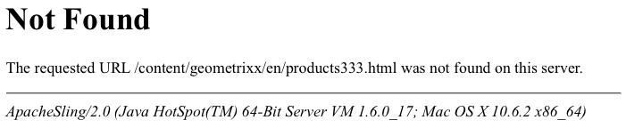

# Anpassen der vom Fehler-Handler angezeigten Seiten{#customizing-pages-shown-by-the-error-handler}

>[!CAUTION]
>
>AEM 6.4 hat das Ende der erweiterten Unterstützung erreicht und diese Dokumentation wird nicht mehr aktualisiert. Weitere Informationen finden Sie in unserer [technische Unterstützung](https://helpx.adobe.com/de/support/programs/eol-matrix.html). Unterstützte Versionen suchen [here](https://experienceleague.adobe.com/docs/?lang=de).

AEM enthält einen Standard-Fehler-Handler für die Verarbeitung von HTTP-Fehlern. Beispielsweise wird Folgendes gezeigt:

Das System stellt Skripte (unter `/libs/sling/servlet/errorhandler`) bereit, um auf Fehler-Codes zu reagieren. Standardmäßig sind folgende Skripte mit einer Standard-CQ-Instanz verfügbar:

* 403.jsp
* 404.jsp

>[!NOTE]
>
>AEM basiert auf Apache Sling. Sie finden unter [https://sling.apache.org/site/errorhandling.html](https://sling.apache.org/site/errorhandling.html) also genaue Informationen zur Sling-Fehlerbehandlung.

>[!NOTE]
>
>Auf einer Autoreninstanz: [CQ WCM Debug Filter](/help/sites-deploying/osgi-configuration-settings.md) ist standardmäßig aktiviert. Das Ergebnis ist immer der Antwort-Code 200. Der standardmäßige Fehler-Handler antwortet, indem er den vollständigen Stacktrace in die Antwort schreibt.
>
>In Veröffentlichungsinstanzen ist CQ WCM Debug Filter *immer* deaktiviert (selbst wenn er als aktiviert konfiguriert ist).

## Anpassen der vom Fehler-Handler angezeigten Seiten {#how-to-customize-pages-shown-by-the-error-handler}

Sie können Ihre eigenen Skripte erstellen, um die Seiten anzupassen, die der Fehler-Handler anzeigt, wenn ein Fehler auftritt. Die angepassten Seiten werden unter `/apps` erstellt und überlagern die Standardseiten (die unter `/libs` zu finden sind).

>[!NOTE]
>
>Siehe [Verwenden von Überlagerungen](/help/sites-developing/overlays.md) für weitere Details.

1. Kopieren Sie im Repository das/die Standardskript(e):

   * von `/libs/sling/servlet/errorhandler/`
   * nach `/apps/sling/servlet/errorhandler/`

   Da der Zielpfad standardmäßig nicht vorhanden ist, müssen Sie ihn erstellen, wenn Sie diesen Vorgang zum ersten Mal durchführen.

1. Navigieren Sie zu `/apps/sling/servlet/errorhandler`. Hier können Sie entweder:

   * das entsprechende vorhandene Skript bearbeiten, um die benötigten Informationen anzugeben.
   * ein neues Skript für den erforderlichen Code erstellen und bearbeiten.

1. Speichern Sie die Änderungen und testen Sie sie.

>[!CAUTION]
>
>Die Handler 404.jsp und 403.jsp wurden speziell für die CQ5-Authentifizierung entwickelt. insbesondere, um bei diesen Fehlern eine Systemanmeldung zu ermöglichen.
>
>Daher sollten diese beiden Handler mit großer Sorgfalt ersetzt werden.

### Anpassung der Reaktion auf HTTP 500-Fehler {#customizing-the-response-to-http-errors}

HTTP 500-Fehler werden von Server-seitigen Ausnahmefehlern verursacht.

* **[500 Interner Serverfehler](https://www.w3.org/Protocols/rfc2616/rfc2616-sec10.html)** Der Server hat einen unerwarteten Zustand entdeckt und kann daher die Anfrage nicht erfüllen.

Wenn die Bearbeitung einer Anfrage zu einem Ausnahmefehler führt, führt das Apache Sling-Framework (auf dem AEM basiert) folgende Schritte durch:

* protokolliert die Ausnahme
* gibt zurück:

   * der HTTP-Antwort-Code 500
   * Ausnahmestapelverfolgung

   im Hauptteil der Antwort.

Indem Sie [die Seiten anpassen, die der Fehler-Handler zeigt](#how-to-customize-pages-shown-by-the-error-handler), können Sie ein `500.jsp`-Skript erstellen. Es wird jedoch nur verwendet, wenn `HttpServletResponse.sendError(500)` explizit ausgeführt wird, d. h. von einem Abfangalgorithmus für Ausnahmen.

Andernfalls wird der Antwort-Code auf „500“ gesetzt, aber das `500.jsp`-Skript wird nicht ausgeführt.

Um 500-Fehler zu verarbeiten, muss der Dateiname des Fehler-Handler-Skripts identisch mit der Ausnahmeklasse (oder der übergeordneten Klasse) sein. Um alle derartigen Ausnahmen zu bearbeiten, können Sie ein `/apps/sling/servlet/errorhandler/Throwable.js`- oder `/apps/sling/servlet/errorhandler/Exception.jsp`-Skript erstellen.

>[!CAUTION]
>
>Auf einer Autoreninstanz: [CQ WCM Debug Filter](/help/sites-deploying/osgi-configuration-settings.md) ist standardmäßig aktiviert. Das Ergebnis ist immer der Antwort-Code 200. Der standardmäßige Fehler-Handler antwortet, indem er den vollständigen Stacktrace in die Antwort schreibt.
>
>Für eine individuelle Fehlerverarbeitung sind Antworten mit Code 500 erforderlich. Der [CQ WCM Debug-Filter muss also deaktiviert sein](/help/sites-deploying/osgi-configuration-settings.md). Dadurch wird sichergestellt, dass der Antwort-Code 500 zurückgegeben wird, was wiederum den richtigen Sling-Fehler-Handler auslöst.
>
>In Veröffentlichungsinstanzen ist CQ WCM Debug Filter *immer* deaktiviert (selbst wenn er als aktiviert konfiguriert ist).
