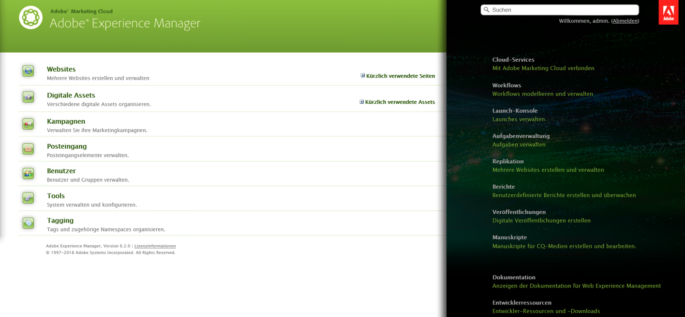
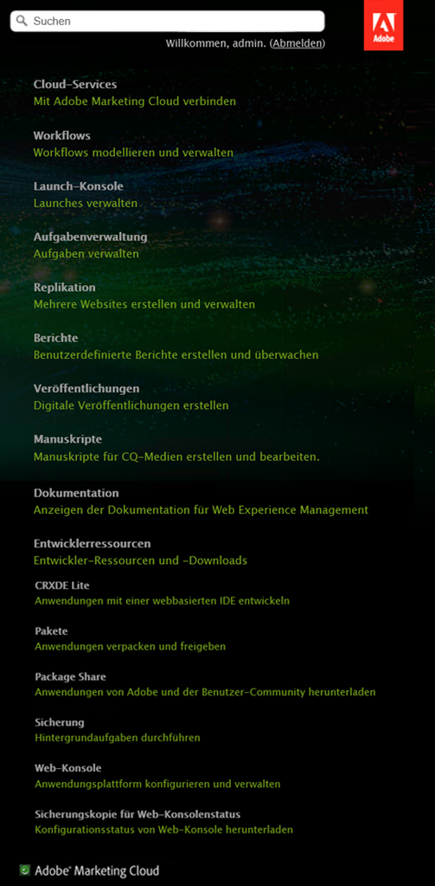

# Anpassen der Willkommens-Konsole (klassische Benutzeroberfläche){#customizing-the-welcome-console-classic-ui}

>[!CAUTION]
>
>AEM 6.4 hat das Ende der erweiterten Unterstützung erreicht und diese Dokumentation wird nicht mehr aktualisiert. Weitere Informationen finden Sie in unserer [technische Unterstützung](https://helpx.adobe.com/de/support/programs/eol-matrix.html). Unterstützte Versionen suchen [here](https://experienceleague.adobe.com/docs/?lang=de).

>[!CAUTION]
>
>Diese Seite behandelt die klassische Benutzeroberfläche.
>
>Unter [Anpassung der Konsolen](/help/sites-developing/customizing-consoles-touch.md) finden Sie genauere Informationen zur standardmäßigen Touch-optimierten Benutzeroberfläche.

Die Begrüßungskonsole bietet eine Liste von Links zu den verschiedenen Konsolen und Funktionen in AEM.

Die sichtbaren Links können konfiguriert werden. Dies kann für bestimmte Benutzer und/oder Gruppen definiert werden. Die zu ergreifenden Aktionen hängen vom Zieltyp ab (entspricht dem Abschnitt der Konsole, in der sie sich befinden):

* [Hauptkonsolen](#links-in-main-console-left-pane) - Links in der Hauptkonsole (linker Bereich)
* [Ressourcen, Dokumentation und Referenz, Funktionen](#links-in-sidebar-right-pane) - Links in der Seitenleiste (rechter Bereich)

## Links in der Hauptkonsole (linker Bereich) {#links-in-main-console-left-pane}

Hier werden die Hauptkonsolen von AEM aufgelistet.

### Konfigurieren, ob die Hauptkonsolen-Links sichtbar sind {#configuring-whether-main-console-links-are-visible}

Berechtigungen auf Knotenebene bestimmen, ob der Link angezeigt werden kann oder nicht. Die betreffenden Knoten sind Folgende:

* **Websites:** `/libs/wcm/core/content/siteadmin`

* **Digitale Assets:** `/libs/wcm/core/content/damadmin`

* **Community:** `/libs/collab/core/content/admin`

* **Kampagnen:** `/libs/mcm/content/admin`

* **Posteingang:** `/libs/cq/workflow/content/inbox`

* **Benutzer:** `/libs/cq/security/content/admin`

* **Tools:** `/libs/wcm/core/content/misc`

* **Tagging:** `/libs/cq/tagging/content/tagadmin`

Beispiel:

* Um den Zugriff auf **Tools** einzuschränken, entfernen Sie den Lesezugriff von

   `/libs/wcm/core/content/misc`

Siehe [Sicherheitsabschnitt](/help/sites-administering/security.md) für weitere Informationen zum Festlegen der gewünschten Berechtigungen.

### Links in der Seitenleiste (rechter Bereich) {#links-in-sidebar-right-pane}

Diese Links basieren auf dem Vorhandensein *und* dem Lesezugriff auf Knoten unter dem folgenden Pfad:

`/libs/cq/core/content/welcome`

Drei Abschnitte werden standardmäßig bereitgestellt (leicht getrennt):

<table> 
 <tbody> 
  <tr> 
   <td><strong>Ressourcen</strong></td> 
   <td> </td> 
  </tr> 
  <tr> 
   <td> Cloud Services</td> 
   <td><code>/libs/cq/core/content/welcome/resources/cloudservices</code></td> 
  </tr> 
  <tr> 
   <td> Workflows</td> 
   <td><code>/libs/cq/core/content/welcome/resources/workflows</code></td> 
  </tr> 
  <tr> 
   <td> Aufgabenverwaltung</td> 
   <td><code>/libs/cq/core/content/welcome/resources/taskmanager</code></td> 
  </tr> 
  <tr> 
   <td> Replikation</td> 
   <td><code>/libs/cq/core/content/welcome/resources/replication</code></td> 
  </tr> 
  <tr> 
   <td> Berichte</td> 
   <td><code>/libs/cq/core/content/welcome/resources/reports</code></td> 
  </tr> 
  <tr> 
   <td> Veröffentlichungen</td> 
   <td><code>/libs/cq/core/content/welcome/resources/publishingadmin</code></td> 
  </tr> 
  <tr> 
   <td> Manuskripte</td> 
   <td><code>/libs/cq/core/content/welcome/resources/manuscriptsadmin</code></td> 
  </tr> 
  <tr> 
   <td><strong>Dokumentation und Referenz</strong></td> 
   <td> </td> 
  </tr> 
  <tr> 
   <td> Dokumentation</td> 
   <td><code>/libs/cq/core/content/welcome/docs/docs</code></td> 
  </tr> 
  <tr> 
   <td> Entwicklungsressourcen</td> 
   <td><code>/libs/cq/core/content/welcome/docs/dev</code></td> 
  </tr> 
  <tr> 
   <td><strong>Funktionen</strong></td> 
   <td> </td> 
  </tr> 
  <tr> 
   <td> CRXDE Lite</td> 
   <td><code>/libs/cq/core/content/welcome/features/crxde</code></td> 
  </tr> 
  <tr> 
   <td> Pakete</td> 
   <td><code>/libs/cq/core/content/welcome/features/packages</code></td> 
  </tr> 
  <tr> 
   <td> Package Share</td> 
   <td><code>/libs/cq/core/content/welcome/features/share</code></td> 
  </tr> 
  <tr> 
   <td> Cluster</td> 
   <td><code>/libs/cq/core/content/welcome/features/cluster</code></td> 
  </tr> 
  <tr> 
   <td> Sicherung</td> 
   <td><code>/libs/cq/core/content/welcome/features/backup</code></td> 
  </tr> 
  <tr> 
   <td> Web-Konsole  </td> 
   <td><code>/libs/cq/core/content/welcome/features/config</code></td> 
  </tr> 
  <tr> 
   <td> Sicherungskopie für Web-Konsolenstatus  </td> 
   <td><code>/libs/cq/core/content/welcome/features/statusdump</code></td> 
  </tr> 
 </tbody> 
</table>

#### Sichtbarkeit von Seitenleisten-Links konfigurieren {#configuring-whether-sidebar-links-are-visible}

Es ist möglich, einen Link für bestimmte Benutzer oder Gruppen auszublenden, indem der Lesezugriff auf die Knoten, die den Link darstellen, entfernt wird.

* Ressourcen – Entfernen des Zugriffs auf:

   `/libs/cq/core/content/welcome/resources/<link-target>`

* Dokumente – Entfernen des Zugriffs auf:

   `/libs/cq/core/content/welcome/docs/<link-target>`

* Funktionen – Entfernen des Zugriffs auf:

   `/libs/cq/core/content/welcome/features/<link-target>`

Beispiel:

* Um den Link auf **Berichte** zu entfernen, entfernen Sie den Lesezugriff von

   `/libs/cq/core/content/welcome/resources/reports`

* Um den Link auf **Pakete** zu entfernen, entfernen Sie den Lesezugriff von

   `/libs/cq/core/content/welcome/features/packages`

Siehe [Sicherheitsabschnitt](/help/sites-administering/security.md) für weitere Informationen zum Festlegen der gewünschten Berechtigungen.

### Link-Auswahlmechanismus {#link-selection-mechanism}

In `/libs/cq/core/components/welcome/welcome.jsp` wird [ConsoleUtil](https://helpx.adobe.com/experience-manager/6-4/sites/developing/using/reference-materials/javadoc/com/day/cq/commons/ConsoleUtil.html) genutzt, das eine Abfrage auf Knoten mit folgender Eigenschaft durchführt:

* `jcr:mixinTypes` mit dem Wert: `cq:Console`

>[!NOTE]
>
>Führen Sie die folgende Abfrage aus, um die bestehende Liste zu finden:
>
>* `select * from cq:Console`
>

Wenn ein Benutzer oder eine Gruppe keine Leseberechtigungen für einen Knoten mit dem Mixin `cq:Console` hat, wird dieser Knoten nicht mit der `ConsoleUtil`-Suche abgerufen und wird daher nicht in der Konsole aufgeführt.

### Hinzufügen eines benutzerdefinierten Elements {#adding-a-custom-item}

Die [Link-Auswahlmechanismus](#link-selection-mechanism) kann verwendet werden, um Ihr eigenes benutzerdefiniertes Element zur Liste der Links hinzuzufügen.

Fügen Sie Ihr benutzerdefiniertes Element zur Liste hinzu, indem Sie das Mixin `cq:Console` zu Ihrem Widget oder Ihrer Ressource hinzufügen. Definieren Sie dazu die Eigenschaft:

* `jcr:mixinTypes` mit dem Wert: `cq:Console`
