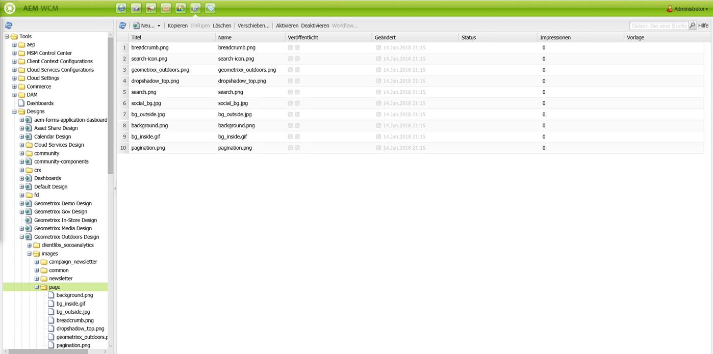
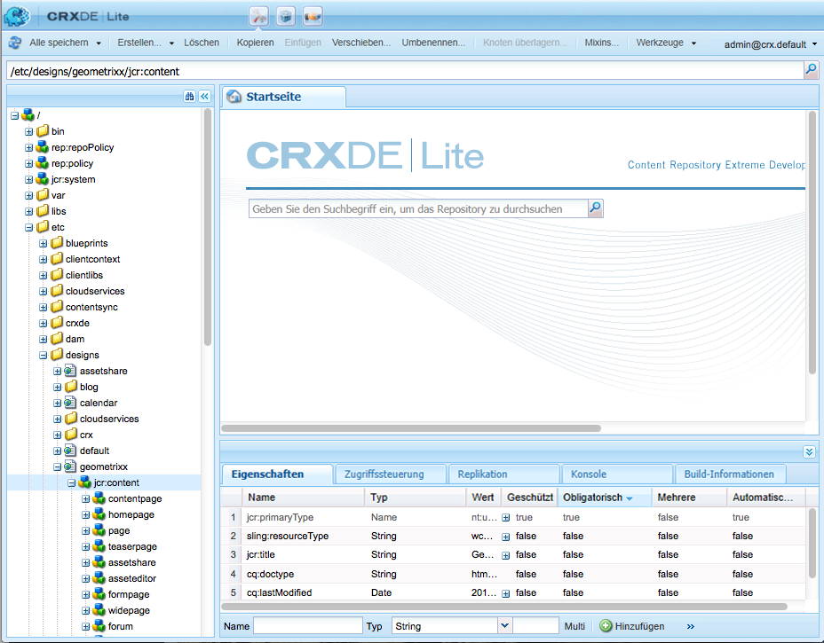

# Designs und der Designer{#designs-and-the-designer}

>[!CAUTION]
>
>In diesem Artikel wird beschrieben, wie Sie eine Website basierend auf der klassischen Benutzeroberfläche erstellen. Adobe empfiehlt, die neuesten AEM-Technologien für Ihre Websites zu nutzen, wie ausführlich im Artikel [Erste Schritte bei der Entwicklung von AEM Sites](/help/sites-developing/getting-started.md) beschrieben.

Der Designer wird verwendet, um ein Design für Ihre Website mithilfe der [Klassischen Benutzeroberfläche](/help/release-notes/touch-ui-features-status.md) in AEM zu erstellen.

>[!NOTE]
>
>Weitere Informationen zum Webzugriff finden Sie unter [AEM und Richtlinien für barrierefreien Webzugang](/help/managing/web-accessibility.md).

## Verwenden des Designers  {#using-the-designer}

Ihr Design kann im Abschnitt **designs** der Registerkarte **Tools** definiert werden:



Hier erstellen Sie die Struktur, die zum Speichern des Designs erforderlich ist, und laden dann die erforderlichen Cascaded Style Sheet und Bilder hoch.

Designs werden unter `/apps/<your-project>` gespeichert. Der Pfad zu einem Design, das für eine Website verwendet wird, wird anhand der Eigenschaft `cq:designPath` des Knotens `jcr:content` angegeben.



>[!NOTE]
>
>Alle Änderungen, die im Designmodus an einer Seite vorgenommen werden, werden unterhalb des Designknotens der Website beibehalten und automatisch auf alle Seiten mit demselben Design angewendet.

## Voraussetzungen  {#what-you-will-need}

Zur Realisierung des Design benötigen Sie:

**CSS**  - Die Cascading Style Sheets definieren die Formate bestimmter Bereiche auf Ihren Seiten.

**Bilder**  - Alle Bilder, die Sie für Funktionen wie Hintergründe und Schaltflächen verwenden.

### Überlegungen zum Entwurf Ihrer Website {#considerations-when-designing-your-website}

Bei der Entwicklung einer Website wird dringend empfohlen, Bilder und CSS-Dateien unter `/apps/<your-project>` zu speichern, damit Sie Ihre Ressourcen basierend auf dem aktuellen Design referenzieren können, wie im folgenden Snippet beschrieben.

```xml
<%= currentDesign.getPath() + "/static/img/icon.gif %>
```

Das obige Beispiel bietet mehrere Vorteile:

* Je nach Designpfad verschiedener Websites erwecken Komponenten einen anderen Eindruck.
* Die Neugestaltung der Website kann einfach durch Verweis des Designpfads auf einen anderen Knoten im Stammverzeichnis der Website von `design/v1` zu `design/v2.` vorgenommen werden.

* `/etc/designs` und  `/content` sind die einzigen externen URLs, die der Browser sieht, um Sie vor einem externen Benutzer zu schützen, der neugierig darüber wird, was sich unter Ihrem  `/apps` Baum befindet. Die obigen URL-Vorteile helfen auch Ihrem Systemadministrator, bessere Sicherheitsmaßnahmen einzurichten, weil die Angriffsfläche der Assets auf wenige spezifische Orte beschränkt wird.
