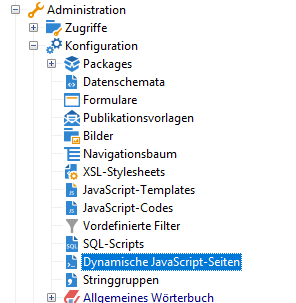
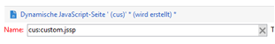
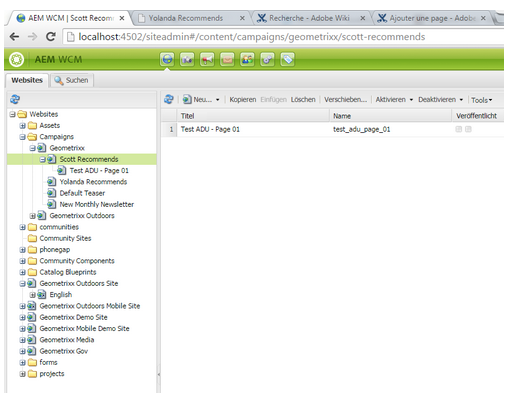

# Erstellen benutzerspezifischer Erweiterungen{#creating-custom-extensions}

>[!CAUTION]
>
>AEM 6.4 hat das Ende der erweiterten Unterstützung erreicht und diese Dokumentation wird nicht mehr aktualisiert. Weitere Informationen finden Sie in unserer [technische Unterstützung](https://helpx.adobe.com/de/support/programs/eol-matrix.html). Unterstützte Versionen suchen [here](https://experienceleague.adobe.com/docs/?lang=de).

Im Allgemeinen verwenden Sie beim Implementieren eines Projekts benutzerdefinierten Code in AEM und Adobe Campaign. Mit der vorhandenen API können Sie Ihren benutzerdefinierten Code in Adobe Campaign aus AEM oder aus AEM nach Adobe Campaign aufrufen. In diesem Dokument wird beschrieben, wie Sie dies durchführen.

## Voraussetzungen {#prerequisites}

Sie müssen Folgendes installieren:

* Adobe Experience Manager
* Adobe Campaign 6.1

Siehe [Integration von AEM in Adobe Campaign 6.1](/help/sites-administering/campaignonpremise.md) für weitere Informationen.

## Beispiel 1: AEM zu Adobe Campaign {#example-aem-to-adobe-campaign}

Die Standardintegration zwischen AEM und Campaign basiert auf JSON und JSSP (JavaScript Server Page). Diese JSSP-Dateien befinden sich in der Campaign-Konsole und beginnen alle mit **amc** (Adobe Marketing Cloud).



>[!NOTE]
>
>[Für dieses Beispiel verwenden SIe Geometrixx](/help/sites-developing/we-retail.md), das bei Package Share erhältlich ist.

In diesem Beispiel erstellen wir eine neue benutzerdefinierte JSSP-Datei und rufen diese in AEM ab, um das Ergebnis zu erhalten. Dies kann beispielsweise zum Abrufen von Daten aus Adobe Campaign oder zum Speichern von Daten in Adobe Campaign verwendet werden.

1. Klicken Sie in Adobe Campaign zum Erstellen einer neuen JSSP-Datei auf das Symbol **Neu**.

   

1. Geben Sie den Namen dieser JSSP-Datei ein. In diesem Beispiel verwenden wir **cus:custom.jssp** (was bedeutet, dass es sich im Namespace **cus** befindet).

   

1. Fügen Sie den folgenden Code in die jssp-Datei ein:

   ```
   <%
   var origin = request.getParameter("origin");
   document.write("Hello from Adobe Campaign, origin : " + origin);
   %>
   ```

1. Speichern Sie Ihre Arbeit. Die verbleibenden Arbeiten sind in AEM.
1. Erstellen Sie ein einfaches Servlet auf der AEM, um dieses JSSP aufzurufen. In diesem Beispiel gehen wir von Folgendem aus:

   * Sie haben die Verbindung zwischen AEM und Campaign hergestellt
   * Der Campaign-Cloud-Service ist in **/content/geometrixx-outdoors**

   Das wichtigste Objekt in diesem Beispiel ist **GenericCampaignConnector**, welches es Ihnen erlaubt, jssp-Dateien in Adobe Campaign aufzurufen (GET und POST).

   Im Folgenden finden Sie ein kleines Code-Snippet:

   ```
   @Reference
   private GenericCampaignConnector campaignConnector;
   ...
   Map<String, String> params = new HashMap<String, String>();
   params.put("origin", "AEM"); 
   CallResults results = campaignConnector.callGeneric("/jssp/cus/custom.jssp", params, credentials);
   return results.bodyAsString();
   ```

1. Wie Sie in diesem Beispiel sehen, müssen Sie die Anmeldeinformationen in den Aufruf eingeben. Sie können dies über die getCredentials() -Methode abrufen, bei der Sie eine Seite übergeben, auf der der Campaign-Cloud-Service konfiguriert ist.

   ```xml
   // page containing the cloudservice for Adobe Campaign
   Configuration config = campaignConnector.getWebserviceConfig(page.getContentResource().getParent());
   CampaignCredentials credentials = campaignConnector.retrieveCredentials(config);
   ```

Der vollständige Code lautet wie folgt:

```java
import java.io.IOException;
import java.io.PrintWriter;
import java.util.HashMap;
import java.util.Map;

import javax.servlet.ServletException;

import org.apache.felix.scr.annotations.Reference;
import org.apache.felix.scr.annotations.sling.SlingServlet;
import org.apache.sling.api.SlingHttpServletRequest;
import org.apache.sling.api.SlingHttpServletResponse;
import org.apache.sling.api.servlets.SlingSafeMethodsServlet;
import org.slf4j.Logger;
import org.slf4j.LoggerFactory;

import com.day.cq.mcm.campaign.CallResults;
import com.day.cq.mcm.campaign.CampaignCredentials;
import com.day.cq.mcm.campaign.GenericCampaignConnector;
import com.day.cq.wcm.api.Page;
import com.day.cq.wcm.api.PageManager;
import com.day.cq.wcm.api.PageManagerFactory;
import com.day.cq.wcm.webservicesupport.Configuration;

@SlingServlet(paths="/bin/campaign", methods="GET")
public class CustomServlet extends SlingSafeMethodsServlet {

 private final Logger log = LoggerFactory.getLogger(this.getClass());
 
 @Reference
 private GenericCampaignConnector campaignConnector;
 
 @Reference
 private PageManagerFactory pageManagerFactory;

 @Override
 protected void doGet(SlingHttpServletRequest request,
   SlingHttpServletResponse response) throws ServletException,
   IOException {
  
  PageManager pm = pageManagerFactory.getPageManager(request.getResourceResolver());
  
  Page page = pm.getPage("/content/geometrixx-outdoors");
  
  String result = null;
  if ( page != null) {
   result = callCustomFunction(page);
  }
  if ( result != null ) {
   PrintWriter pw = response.getWriter();
   pw.print(result);
  }
 }
 
 private String callCustomFunction(Page page ) {
  try {
   Configuration config = campaignConnector.getWebserviceConfig(page.getContentResource().getParent());
   CampaignCredentials credentials = campaignConnector.retrieveCredentials(config);
   
   Map<String, String> params = new HashMap<String, String>();
   params.put("origin", "AEM");
   CallResults results = campaignConnector.callGeneric("/jssp/cus/custom.jssp", params, credentials);
   return results.bodyAsString();
  } catch (Exception e ) {
   log.error("Something went wrong during the connection", e);
  }
  return null;
  
 }

}
```

## Beispiel 2: Adobe Campaign zu AEM {#example-adobe-campaign-to-aem}

AEM bietet vordefinierte APIs zum Abrufen der Objekte, die überall in der SiteAdmin-Explorer-Ansicht verfügbar sind.



>[!NOTE]
>
>[Für dieses Beispiel verwenden SIe Geometrixx](/help/sites-developing/we-retail.md), das bei Package Share erhältlich ist.

Für jeden Knoten im Explorer gibt es eine API, die damit verknüpft ist. Beispielsweise für den Knoten:

* [http://localhost:4502/siteadmin#/content/campaigns/geometrixx/scott-recommends](http://localhost:4502/siteadmin#/content/campaigns/geometrixx/scott-recommends)

die API lautet:

* [http://localhost:4502/content/campaigns/geometrixx/scott-recommends.1.json](http://localhost:4502/content/campaigns/geometrixx/scott-recommends.2.json)

Das Ende der URL **.1.json** kann ersetzt werden durch **.2.json**, **.3.json**, entsprechend der Anzahl der Unterebenen, die Sie erhalten möchten. Um alle zu erhalten, erhalten Sie den Suchbegriff **Unendlichkeit** kann verwendet werden:

* [http://localhost:4502/content/campaigns/geometrixx/scott-recommends.infinity.json](http://localhost:4502/content/campaigns/geometrixx/scott-recommends.2.json)

Um die API jetzt zu nutzen, müssen wir wissen, dass AEM standardmäßig die grundlegende Authentifizierung verwendet.

Eine JS-Bibliothek mit dem Namen **amcIntegration.js** ist in 6.1.1 (Build 8624 und höher) verfügbar, das diese Logik unter mehreren anderen implementiert.

### AEM API-Aufruf {#aem-api-call}

```java
loadLibrary("nms:amcIntegration.js");
 
var cmsAccountId = sqlGetInt("select iExtAccountId from NmsExtAccount where sName=$(sz)","aemInstance")
var cmsAccount = nms.extAccount.load(String(cmsAccountId));
var cmsServer = cmsAccount.server;
 
var request = new HttpClientRequest(cmsServer+"/content/campaigns/geometrixx.infinity.json")
aemAddBasicAuthentication(cmsAccount, request);
request.method = "GET"
request.header["Content-Type"] = "application/json; charset=UTF-8";
request.execute();
var response = request.response;
```
