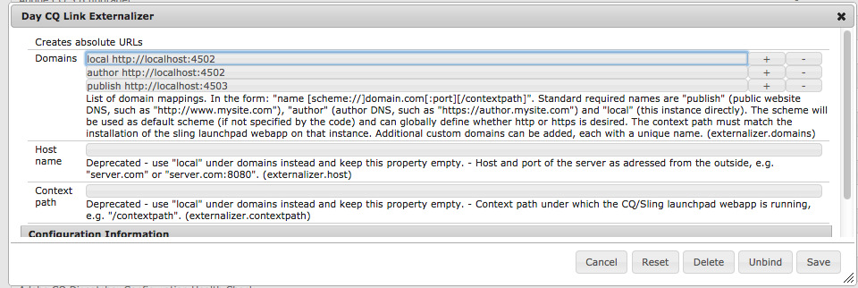

# Externalisieren von URLs{#externalizing-urls}

>[!CAUTION]
>
>AEM 6.4 hat das Ende der erweiterten Unterstützung erreicht und diese Dokumentation wird nicht mehr aktualisiert. Weitere Informationen finden Sie in unserer [technische Unterstützung](https://helpx.adobe.com/de/support/programs/eol-matrix.html). Unterstützte Versionen suchen [here](https://experienceleague.adobe.com/docs/?lang=de).

In AEM ist der **Externalizer** ein OSGI-Service, der es Ihnen ermöglicht, einen Ressourcenpfad (z. B. `/path/to/my/page`) programmgesteuert in eine externe und absolute URL umzuwandeln (z. B. `https://www.mycompany.com/path/to/my/page`), indem der Pfad mit einem vorangestellten vorkonfigurieren DNS versehen wird.

Da eine Instanz ihre extern sichtbare URL nicht kennen kann, wenn sie hinter einer Web-Ebene ausgeführt wird, und weil manchmal ein Link außerhalb des Anforderungsbereichs erstellt werden muss, bietet dieser Dienst einen zentralen Ort, um diese externen URLs zu konfigurieren und zu erstellen.

Auf dieser Seite wird beschrieben, wie Sie die **Externalizer** und wie Sie ihn verwenden. Weitere Informationen finden Sie im Abschnitt [Javadocs](https://helpx.adobe.com/experience-manager/6-4/sites/developing/using/reference-materials/javadoc/com/day/cq/commons/Externalizer.html).

## Konfigurieren des Externalizer-Dienstes {#configuring-the-externalizer-service}

Der **Externalizer**-Dienst ermöglicht es Ihnen, zentral mehrere Domains zu definieren, die für das programmgesteuerte Voranstellen von Präfixen für Ressourcenpfade verwendet werden können. Alle Domains werden anhand eines eindeutigen Namens zum programmgesteuerten Verweisen auf die Domain identifiziert.

Definieren Sie eine Domain-Zuordnung für den **Externalizer**-Service wie folgt:

1. Wechseln Sie zum Konfigurations-Manager über **Tools** > **Web-Konsole** oder geben Sie Folgendes ein `https://<host>:<port>/system/console/configMgr.`
1. Klicken Sie auf **Day CQ Link Externalizer**, um das Konfigurationsdialogfeld zu öffnen.

   >[!NOTE]
   >
   >Der Direkt-Link zur Konfiguration lautet `https://<host>:<port>/system/console/configMgr/com.day.cq.commons.impl.ExternalizerImpl`

   

1. Definieren Sie eine Domänenzuordnung: Eine Zuordnung besteht aus einem eindeutigen Namen, der im Code verwendet werden kann, um auf die Domäne, ein Leerzeichen und die Domäne zu verweisen:

   `<unique-name> [scheme://]server[:port][/contextpath]`, Hierbei gilt:

   * **schema** ist normalerweise http oder https, kann aber auch ftp usw. sein.; Verwenden Sie HTTPS, um HTTPS-Links zu erzwingen, falls gewünscht. wird verwendet, wenn der Client-Code das Schema bei der Anforderung der Externalisierung einer URL nicht außer Kraft setzt.
   * **Server** ist der Host-Name (kann ein Domain-Name oder eine IP-Adresse sein).
   * **Port** (optional) ist die Portnummer.
   * **Kontextpfad** (optional) wird nur festgelegt, wenn AEM als Web-App unter einem anderen Kontextpfad installiert wird.

   Beispiel: `production https://my.production.instance`

   Die folgenden Zuordnungsnamen sind vordefiniert und müssen immer festgelegt werden, da AEM auf sie angewiesen ist:

   * **lokal** - die lokale Instanz
   * **author** - DNS des Authoring-Systems
   * **publish** - das DNS der öffentlichen Website

   >[!NOTE]
   >
   >Mit einer benutzerdefinierten Konfiguration können Sie eine neue Kategorie hinzufügen, z. B. &quot;Produktion&quot;, &quot;Staging&quot;oder sogar externe Nicht-AEM-Systeme wie &quot;my-internal-webservice&quot;. Diese URLs können Sie vermeiden, an verschiedenen Stellen in der Codebasis eines Projekts fest zu kodieren.

1. Klicken Sie auf **Speichern**, um Ihre Änderungen zu speichern.

>[!NOTE]
>
>Adobe empfiehlt, dass Sie [die Konfiguration dem Repository hinzufügen](/help/sites-deploying/configuring-osgi.md#adding-a-new-configuration-to-the-repository).

## Verwenden des Externalizer-Diensts {#using-the-externalizer-service}

Dieser Abschnitt zeigt einige Beispiele dafür, wie der **Externalizer**-Dienst verwendet werden kann.

**Den Externalizer-Dienst rufen Sie in JSP wie folgt ab:**

`Externalizer externalizer = resourceResolver.adaptTo(Externalizer.class);`

**Einen Pfad mit der publish-Domain externalisieren Sie wie folgt:**

`String myExternalizedUrl = externalizer.publishLink(resolver, "/my/page") + ".html";`

Angenommen, die Domänenzuordnung &quot; `publish https://www.website.com`&quot;, endet myExternalizedUrl mit dem Wert &quot; `https://www.website.com/contextpath/my/page.html`&quot;.

**So externalisieren Sie einen Pfad mit der Domain „author“:**

`String myExternalizedUrl = externalizer.authorLink(resolver, "/my/page") + ".html";`

Angenommen, die Domänenzuordnung &quot; `author https://author.website.com`&quot;, endet myExternalizedUrl mit dem Wert &quot; `https://author.website.com/contextpath/my/page.html`&quot;.

**So externalisieren Sie einen Pfad mit der Domain „local“:**

`String myExternalizedUrl = externalizer.externalLink(resolver, Externalizer.LOCAL, "/my/page") + ".html";`

Angenommen, die Domänenzuordnung &quot; `local https://publish-3.internal`&quot;, endet myExternalizedUrl mit dem Wert &quot; `https://publish-3.internal/contextpath/my/page.html`&quot;.

Weitere Beispiele finden Sie in den [Javadocs](https://helpx.adobe.com/experience-manager/6-4/sites/developing/using/reference-materials/javadoc/com/day/cq/commons/Externalizer.html).
