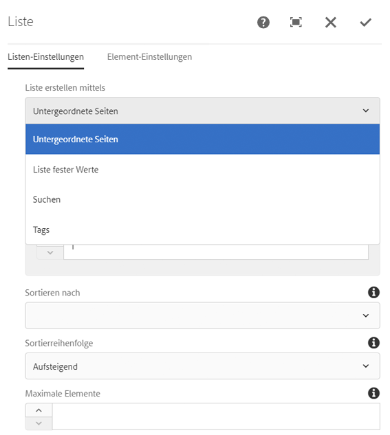
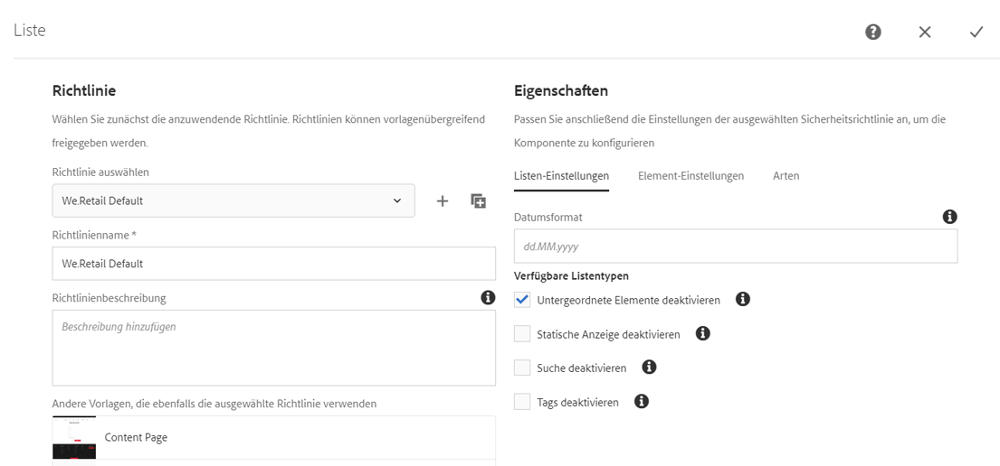
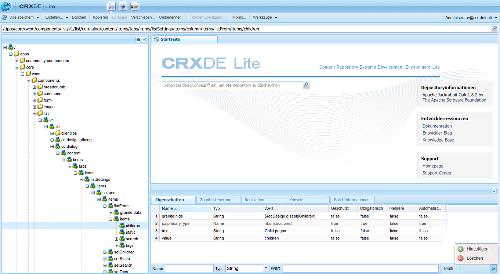
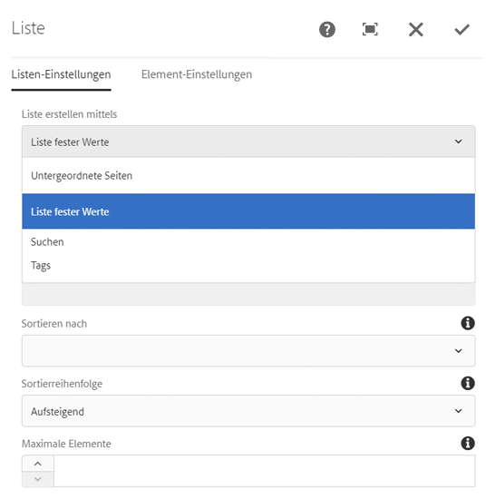

# Verwenden von Bedingungen zum Ausblenden{#using-hide-conditions}

>[!CAUTION]
>
>AEM 6.4 hat das Ende der erweiterten Unterstützung erreicht und diese Dokumentation wird nicht mehr aktualisiert. Weitere Informationen finden Sie in unserer [technische Unterstützung](https://helpx.adobe.com/de/support/programs/eol-matrix.html). Unterstützte Versionen suchen [here](https://experienceleague.adobe.com/docs/?lang=de).

Ausblendebedingungen können verwendet werden, um zu bestimmen, ob eine Komponentenressource gerendert wird oder nicht. Etwa wenn ein Vorlagenautor die Kernkomponente [Listenkomponente](https://helpx.adobe.com/de/experience-manager/core-components/using/list.html) im [Vorlageneditor](/help/sites-authoring/templates.md) konfiguriert und beschließt, die Optionen zum Erstellen der Liste auf Basis untergeordneter Seiten zu deaktivieren. Durch das Deaktivieren dieser Option im Design-Dialogfeld wird eine Eigenschaft so festgelegt, dass beim Rendern der Listenkomponente die Bedingung zum Ausblenden ausgewertet und die Option zum Anzeigen untergeordneter Seiten nicht angezeigt wird.

## Übersicht {#overview}

Dialoge können sehr komplex werden mit zahlreichen Optionen für den Benutzer, der möglicherweise nur einen Bruchteil der ihm zur Verfügung stehenden Optionen verwendet. Dies kann zu überwältigenden Benutzeroberflächen-Erlebnissen führen.

Durch die Verwendung von Bedingungen zum Ausblenden können Administratoren, Entwickler und Superuser Ressourcen anhand eines Regelsatzes ausblenden. Mit dieser Funktion können sie entscheiden, welche Ressourcen angezeigt werden sollen, wenn ein Autor Inhalte bearbeitet.

>[!NOTE]
>
>Das Ausblenden einer Ressource basierend auf einem Ausdruck ersetzt nicht die ACL-Berechtigungen. Der Inhalt bleibt bearbeitbar, wird jedoch einfach nicht angezeigt.

## Implementierung und Nutzungsdetails {#implementation-and-usage-details}

`com.adobe.granite.ui.components.FilteringResourceWrapper` ist verantwortlich für das Filtern der Ressourcen basierend auf dem Vorhandensein und dem Wert der Eigenschaft `granite:hide` für das zu filternde Feld. Die Implementierung `/libs/cq/gui/components/authoring/dialog/dialog.jsp` umfasst eine Instanz von `FilteringResourceWrapper.`

Die Implementierung greift auf die [ELResolver-API](https://helpx.adobe.com/de/experience-manager/6-4/sites/developing/using/reference-materials/granite-ui/api/jcr_root/libs/granite/ui/docs/server/el.html) von Granite zurück und fügt über den ExpressionCustomizer eine benutzerdefinierte `cqDesign`-Variable hinzu.

Im Folgenden sind einige Beispiele für Bedingungen zum Ausblenden für einen Design-Knoten aufgeführt, die sich entweder unter `etc/design` befinden oder als Inhaltsrichtlinie vorliegen.

```
${cqDesign.myProperty}
${!cqDesign.myProperty}
${cqDesign.myProperty == 'someText'}
${cqDesign.myProperty != 'someText'}
${cqDesign.myProperty == true}
${cqDesign.myProperty == true}
${cqDesign.property1 == 'someText' && cqDesign.property2 || cqDesign.property3 != 1 || header.myHeader}
```

Beachten Sie beim Definieren Ihrer Bedingung zum Ausblenden Folgendes:

* Damit sie gültig ist, sollte der Bereich, in dem sich die Eigenschaft befindet, ausgedrückt werden (beispielsweise `cqDesign.myProperty`).
* Werte sind schreibgeschützt.
* Funktionen (falls erforderlich) sollten auf eine bestimmte, vom Service vorgegebene Auswahl beschränkt sein.

## Beispiel {#example}

Beispiele für Bedingungen zum Ausblenden finden sich überall in AEM und insbesondere in den [Kernkomponenten](https://experienceleague.adobe.com/docs/experience-manager-core-components/using/introduction.html?lang=de). Betrachten Sie beispielsweise die [Listenkernkomponente](https://helpx.adobe.com/de/experience-manager/core-components/using/list.html).

[Mit dem Vorlageneditor](/help/sites-authoring/templates.md) kann der Vorlagenautor im Design-Dialogfeld festlegen, welche Optionen der Listenkomponente dem Seitenautor zur Verfügung stehen. Optionen wie die, ob die Liste eine statische Liste, eine Liste mit untergeordneten Seiten, eine Liste getaggter Seiten usw. sein darf, kann aktiviert oder deaktiviert werden.

Wenn ein Vorlagenautor die Option für untergeordnete Seiten deaktiviert, wird eine Designeigenschaft festgelegt und eine Ausblendebedingung dafür ausgewertet, wodurch die Option für den Seitenautor nicht gerendert wird.

1. Standardmäßig kann der Seitenautor die Listenkernkomponente verwenden, um eine Liste mit untergeordneten Seiten zu erstellen, indem er die Option auswählt **Untergeordnete Seiten**.

   

1. Im Design-Dialogfeld der Listenkomponente können Vorlagenautoren die Option **Untergeordnete Elemente deaktivieren** auswählen, um zu verhindern, dass Seitenautoren eine Liste mit untergeordneten Seiten angezeigt wird.

   

1. Ein Richtlinienknoten wird unter `/conf/we-retail/settings/wcm/policies/weretail/components/content/list` erstellt, wobei die Eigenschaft `disableChildren` auf `true` festgelegt wird.
1. Die Bedingung zum Ausblenden wird als Wert der Eigenschaft `granite:hide` des Dialogfeldeigenschafts-Knotens `/conf/we-retail/settings/wcm/policies/weretail/components/content/list` definiert.

   

1. Der Wert von `disableChildren` wird aus der Design-Konfiguration gezogen und der Ausdruck `${cqDesign.disableChildren}` wird als `false` ausgewertet, was bedeutet, dass die Option nicht als Teil der Komponente gerendert wird.

   Sie können den hide-Ausdruck als Wert der Eigenschaft `granite:hide` hier [auf GitHub](https://github.com/Adobe-Marketing-Cloud/aem-core-wcm-components/blob/master/content/src/content/jcr_root/apps/core/wcm/components/list/v1/list/_cq_dialog/.content.xml#L40) ansehen.

1. Die Option **Untergeordnete Seiten** wird für Seitenautoren bei Verwendung der Listenkomponente nicht mehr gerendert.

   
