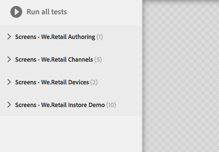

# Testen der Benutzeroberfläche{#testing-your-ui}

AEM stellt ein Framework bereit, mit dem Sie das Testen Ihrer AEM-Benutzeroberfläche automatisieren können. Mit diesem Framework können Sie Tests der Benutzeroberfläche direkt in einem Webbrowser schreiben und ausführen. Das Framework stellt eine JavaScript-API zum Erstellen von Tests bereit.

Das AEM-Test-Framework verwendet Hobbes.js, eine in JavaScript geschriebene Testbibliothek. Das Hobbes.js-Framework wurde für AEM-Tests als Teil des Entwicklungsprozesses entwickelt. Das Framework steht jetzt zur allgemeinen Verwendung zum Testen Ihrer AEM-Anwendungen zur Verfügung.

>[!NOTE]
>
>Siehe Hobbes.js [Dokumentation](https://helpx.adobe.com/experience-manager/6-4/sites/developing/using/reference-materials/test-api/index.html) für ausführliche Informationen zur API.

## Die Struktur von Tests {#structure-of-tests}

Wenn Sie automatisierte Tests in AEM verwenden, sollten Sie die folgenden Begriffe kennen:

|  |  |
|---|---|
| Aktion | Ein **Aktion** ist eine bestimmte Aktivität auf einer Webseite, z. B. das Klicken auf einen Link oder eine Schaltfläche. |
| Testfall | A **Testfall** ist eine bestimmte Situation, die aus einer oder mehreren **Aktionen**. |
| Testsuite | A **Test Suite** ist eine Gruppe verwandter **Testfälle** die zusammen einen bestimmten Anwendungsfall testen. |

## Ausführen von Tests {#executing-tests}

### Anzeigen von Test-Suites {#viewing-test-suites}

Öffnen Sie die Testen-Konsole, um die registrierten Test-Suites anzuzeigen. Das Test-Feld enthält eine Liste der Test-Suites samt ihrer Testfälle.

Navigieren Sie über **Globale Navigation > Tools > Vorgänge > Testen** zur Tools-Konsole.


Wenn Sie die Konsole öffnen, werden die Test-Suites links aufgeführt, zusammen mit der Option, sie alle nacheinander auszuführen. Der Bereich rechts mit einem Hintergrund im Schachbrettmuster ist ein Platzhalter. Hier werden Seiteninhalte bei der Testausführung angezeigt.



### Ausführen einer einzelnen Test-Suite {#running-a-single-test-suite}

Test-Suites können einzeln ausgeführt werden. Wenn Sie eine Test-Suite ausführen, ändert sich die Seite, während die Testfälle und ihre Aktion ausgeführt werden, und die Ergebnisse werden nach dem Abschluss des Tests angezeigt. Symbole zeigen die Ergebnisse an.

Das Häkchen-Symbol kennzeichnet einen erfolgreichen Test:


Das X-Symbol steht für einen gescheiterten Test:


So führen Sie eine Test-Suite aus:

1. Klicken oder tippen Sie im Testfeld auf den Namen des Testfalls, den Sie ausführen möchten, um die Details zu den Aktionen anzuzeigen.

   

1. Klicken oder tippen Sie auf die Schaltfläche **Test ausführen**.

   

1. Der Platzhalter wird durch Seiteninhalte ersetzt, wenn der Test ausgeführt wird.

   

1. Um die Ergebnisse des Testfalls anzuzeigen, tippen oder klicken Sie auf die Beschreibung, um das Feld **Ergebnis** zu öffnen. Wenn Sie im Feld **Ergebnis** auf den Namen des Testfalls tippen oder klicken, werden alle Details angezeigt.

   

### Ausführen mehrerer Tests {#running-multiple-tests}

Test-Suites werden nacheinander in der Reihenfolge ausgeführt, in der sie in der Konsole erscheinen. Sie können einen Test aufschlüsseln, um detaillierte Ergebnisse einzusehen.


1. Tippen oder klicken Sie im Testfeld auf die Schaltfläche **Alle Tests ausführen** oder auf die Schaltfläche **Tests ausführen** unter dem Titel der Test-Suite, die Sie ausführen möchten.

   

1. Um die Ergebnisse jedes Testfalls anzuzeigen, tippen oder klicken Sie auf den Titel des Testfalls. Tippen oder klicken Sie auf den Namen Ihres Tests im **Ergebnis** -Bedienfeld werden alle Details angezeigt.

   

## Erstellen und Verwenden einer einfachen Test-Suite {#creating-and-using-a-simple-test-suite}

Das folgende Verfahren führt Sie durch die Erstellung und Ausführung einer Test Suite mithilfe von [We.Retail-Inhalt](/help/sites-developing/we-retail.md), Sie können den Test jedoch einfach ändern, um eine andere Webseite zu verwenden.

Vollständige Informationen zum Erstellen eigener Test-Suites finden Sie in der [Dokumentation zur Hobbes.js-API](https://helpx.adobe.com/experience-manager/6-4/sites/developing/using/reference-materials/test-api/index.html).

1. Öffnen Sie CRXDE Lite. ([http://localhost:4502/crx/de](http://localhost:4502/crx/de))
1. Klicken Sie mit der rechten Maustaste auf die `/etc/clientlibs` Ordner und klicken Sie auf **Erstellen > Ordner erstellen**. Geben Sie als Namen `myTests` ein und klicken Sie auf **OK**.
1. Klicken Sie mit der rechten Maustaste auf die `/etc/clientlibs/myTests` Ordner und klicken Sie auf **Erstellen > Knoten erstellen**. Geben Sie die folgenden Eigenschaftswerte ein und klicken Sie dann auf **OK**:

   * Name: `myFirstTest`
   * Typ: `cq:ClientLibraryFolder`

1. Fügen Sie dem Knoten „myFirstTest“ die folgenden Eigenschaften hinzu:

   | Name | Typ | Wert |
   |---|---|---|
   | `categories` | `String[]` | `granite.testing.hobbes.tests` |
   | `dependencies` | `String[]` | `granite.testing.hobbes.testrunner` |

   >[!NOTE]
   >
   >**Nur in AEM Forms**
   >
   >Um adaptive Formulare zu testen, fügen Sie die folgenden Werte den Kategorien (categories) und Abhängigkeiten (dependencies) hinzu. Beispiel:
   >
   >**categories**: `granite.testing.hobbes.tests, granite.testing.hobbes.af.commons`
   >
   >**dependencies**: `granite.testing.hobbes.testrunner, granite.testing.hobbes.af`

1. Klicken Sie auf **Alle speichern**.
1. Klicken Sie mit der rechten Maustaste auf den Knoten `myFirstTest` und klicken Sie auf **Erstellen > Datei erstellen**. Nennen Sie die Datei `js.txt` und klicken Sie auf **OK**.
1. Geben Sie in der Datei `js.txt` den folgenden Text ein:

   ```
   #base=.
   myTestSuite.js
   ```

1. Klicken Sie auf **Alle speichern** und schließen Sie dann die Datei `js.txt`.
1. Klicken Sie mit der rechten Maustaste auf den Knoten `myFirstTest` und klicken Sie auf **Erstellen > Datei erstellen**. Nennen Sie die Datei `myTestSuite.js` und klicken Sie auf **OK**.
1. Kopieren Sie den folgenden Code in die Datei `myTestSuite.js` und speichern Sie die Datei anschließend:

   ```
   new hobs.TestSuite("Experience Content Test Suite", {path:"/etc/clientlibs/myTests/myFirstTest/myTestSuite.js"})
      .addTestCase(new hobs.TestCase("Navigate to Experience Content")
         .navigateTo("/content/we-retail/us/en/experience/arctic-surfing-in-lofoten.html")
      )
      .addTestCase(new hobs.TestCase("Hover Over Topnav")
         .mouseover("li.visible-xs")
      )
      .addTestCase(new hobs.TestCase("Click Topnav Link")
         .click("li.active a")
   );
   ```

1. Navigieren Sie zur **Testkonsole**, um die Test-Suite zu testen.
