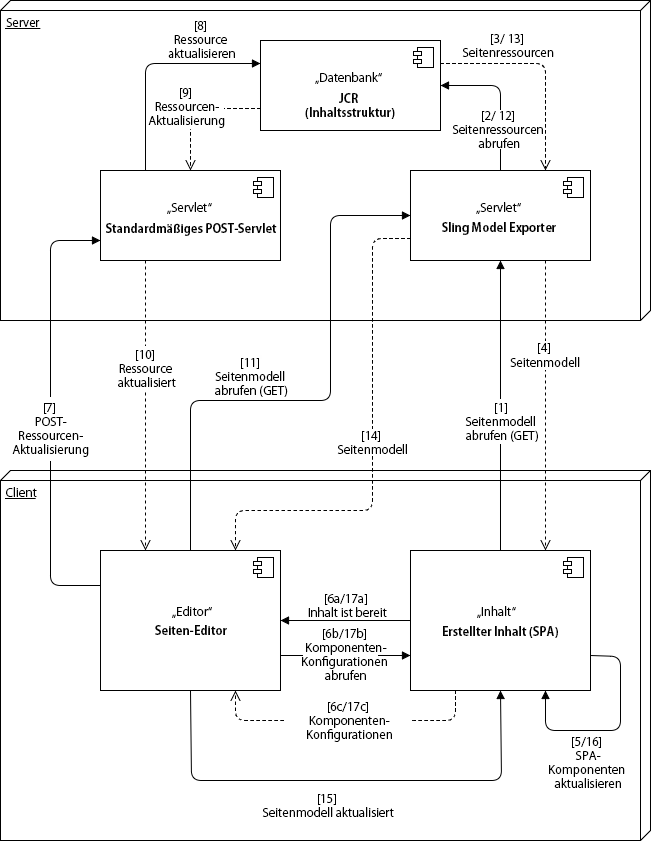
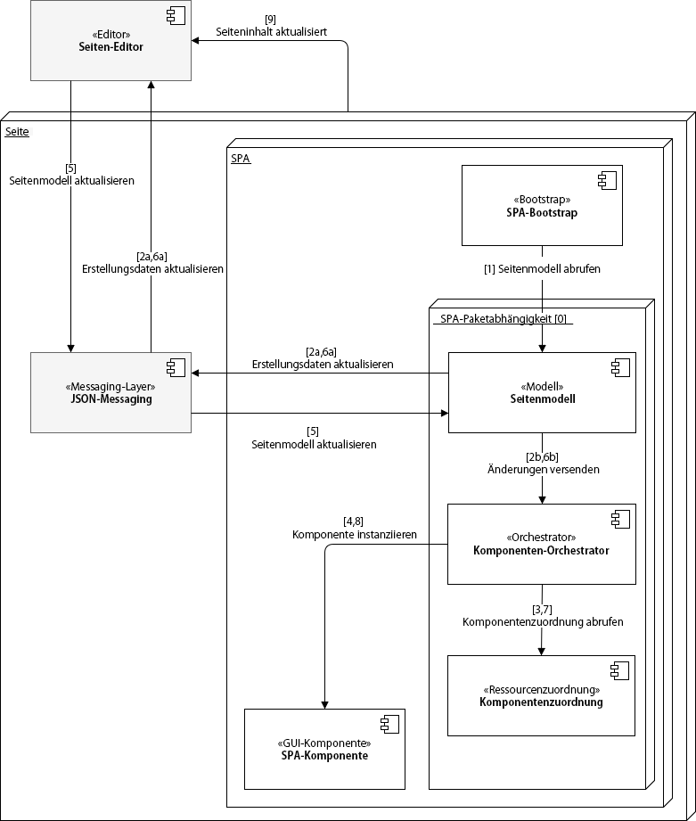

# SPA-Editor – Überblick{#spa-editor-overview}

Single Page Applications (SPAs) können ansprechende Erlebnisse für Website-Benutzer bieten. Entwickler möchten Sites mit SPA-Frameworks erstellen und Autoren möchten Inhalte in AEM nahtlos für eine Site bearbeiten, die mit diesen Frameworks erstellt wurde.

Der SPA-Editor bietet eine umfassende Lösung zur Unterstützung von SPAs in AEM. Auf dieser Seite finden Sie einen Überblick über die Unterstützung von SPA in AEM, die Funktionsweise des SPA-Editors und die Synchronisation des SPA-Frameworks und AEM.

>[!NOTE]
>
>Für die Funktion &quot;Einzelseitenanwendung (SPA) Editor&quot;ist [AEM 6.4 Service Pack 2](/help/release-notes/sp-release-notes.md) oder höher erforderlich.
>
>Der SPA-Editor ist die empfohlene Lösung für Projekte, bei denen clientseitiges Rendering (z.B. React oder Angular) durch das SPA-Framework erforderlich ist.

## Einführung {#introduction}

Sites, die mit gängigen SPA-Frameworks wie React und Angular erstellt wurden, laden ihren Inhalt über dynamisches JSON und weisen nicht die HTML-Struktur auf, die für den Seiten-Editor von AEM erforderlich ist, um Steuerelemente zur Bearbeitung platzieren zu können.

Um die Bearbeitung von SPAs innerhalb von AEM zu ermöglichen, ist eine Zuordnung zwischen der JSON-Ausgabe der SPA und dem Inhaltsmodell im AEM-Repository erforderlich, damit Änderungen am Inhalt gespeichert werden können.

Mit der SPA-Unterstützung wird in AEM ein JS-Thin Layer eingeführt. Dieses interagiert mit dem SPA-JS-Code, wenn es in den Seiten-Editor geladen wird, mit dem Ereignisse gesendet und der Speicherort für die Steuerelemente zur Bearbeitung aktiviert werden kann, um eine kontextbezogene Bearbeitung zu ermöglichen. Diese Funktion baut auf dem Content Services API Endpoint-Konzept auf, da die Inhalte aus der SPA über Content Services geladen werden müssen.

Weitere Informationen zu SPAs in AEM finden Sie in den folgenden Dokumenten:

* [SPA-Blueprint](/help/sites-developing/spa-blueprint.md) für die technischen Anforderungen an SPAs
* [Einstieg in die Verwendung von SPAs in AEM](/help/sites-developing/spa-getting-started-react.md) für eine schnelle Übersicht über eine einfache SPA

## Design {#design}

Die Seitenkomponente für eine SPA stellt die HTML-Elemente ihrer untergeordneten Komponenten nicht über die JSP- oder HTL-Datei bereit. Dieser Vorgang wird an das SPA-Framework delegiert. Die Darstellung untergeordneter Komponenten oder Modelle wird als JSON-Datenstruktur aus der JCR-Datei abgerufen. Die SPA-Komponenten werden dann entsprechend dieser Struktur zur Seite hinzugefügt. Durch dieses Verhalten unterscheidet sich die anfängliche Hauptteilkomposition der Seitenkomponente von entsprechenden Kompositionen, bei denen es sich nicht um SPA-Komponenten handelt.

### Seitenmodellverwaltung {#page-model-management}

Die Auflösung und Verwaltung des Seitenmodells wird an eine bereitgestellte `PageModel`-Bibliothek delegiert. Die SPA muss die Seitenmodellbibliothek verwenden, um vom SPA-Editor initialisiert und verfasst zu werden. Die PageModel-Bibliothek wird der AEM-Seitenkomponente indirekt über den NPM `cq-react-editable-components` bereitgestellt. Das Seitenmodell fungiert als Interpreter zwischen AEM und der SPA und muss daher immer vorhanden sein. Bei der Erstellung der Seite muss eine zusätzliche Bibliothek `cq.authoring.pagemodel.messaging` hinzugefügt werden, um die Kommunikation mit dem Seiten-Editor zu ermöglichen.

Wenn die SPA-Seitenkomponente von der Seitenkernkomponente erbt, gibt es zwei Möglichkeiten, die Kategorie `cq.authoring.pagemodel.messaging` der Client-Bibliothek verfügbar zu machen:

* Wenn die Vorlage bearbeitbar ist, fügen Sie sie der Seitenrichtlinie hinzu.
* Oder fügen Sie die Kategorien mithilfe von `customfooterlibs.html`   hinzu.

Für jede Ressource im exportierten Modell ordnet die SPA eine tatsächliche Komponente zu, die\
rendering. Das als JSON dargestellte Modell wird dann mithilfe der Komponentenzuordnungen in einem Container gerendert.\

>[!CAUTION]
>
>The inclusion of the `cq.authoring.pagemodel.messaging` category should be limited to the context of the SPA Editor.

### Kommunikationsdatentyp {#communication-data-type}

When the `cq.authoring.pagemodel.messaging` category is added to the page, it will send a message to the Page Editor to establish the JSON communication data type. Wenn der Kommunikationsdatentyp auf JSON festgelegt ist, kommunizieren die GET-Anfragen mit den Endpunkten des Sling-Modells einer Komponente. Nach einer Aktualisierung im Seiten-Editor wird die JSON-Repräsentation der aktualisierten Komponente an die PageModel-Bibliothek gesendet. Die PageModel-Bibliothek informiert dann die SPA über Aktualisierungen.

## Workflow {#workflow}

Sie können den Fluss der Interaktion zwischen SPA und AEM verstehen, indem Sie den SPA-Editor als Vermittler zwischen den beiden betrachten.

* Die Kommunikation zwischen dem Seiten-Editor und der SPA erfolgt über JSON statt über HTML.
* Der Seiten-Editor stellt die neueste Version des Seitenmodells für die SPA über die iFrame- und Messaging-API bereit.
* Der Seitenmodell-Manager informiert den Editor, dass er zur Bearbeitung bereit ist, und übergibt das Seitenmodell als JSON-Struktur.
* Der Editor verändert weder die DOM-Struktur der zu erstellenden Seite, noch greift er darauf zu, sondern stellt vielmehr das neueste Seitenmodell bereit.

### Grundlegender SPA-Editor-Workflow {#basic-spa-editor-workflow}

Unter Berücksichtigung der Schlüsselelemente des SPA-Editors erscheint der Workflow zur Bearbeitung eines SPA in AEM wie folgt für den Autor.

1. SPA-Editor wird geladen.

1. Die SPA wird in einem separaten Frame geladen.
1. SPA fordert JSON-Inhalte an und rendert Komponenten clientseitig.
1. SPA Editor erkennt gerenderte Komponenten und generiert Überlagerungen.
1. Autor klickt auf Überlagerung und zeigt die Bearbeitungssymbolleiste der Komponente an.
1. Der SPA-Editor bearbeitet weiterhin mit einer POST-Anforderung an den Server.
1. SPA Editor fordert eine Aktualisierung von JSON an den SPA-Editor an, der mit einem DOM-Ereignis an die SPA gesendet wird.
1. SPA rendert die betreffende Komponente erneut und aktualisiert ihr DOM.

>[!NOTE]
>
>Beachten Sie:
>
>* Das SPA ist immer für seine Anzeige verantwortlich.
>* Der SPA-Editor ist vom SPA selbst isoliert.
>* In der Produktion (Veröffentlichung) wird der SPA-Editor nie geladen.
>

### Client-Server-Workflow zur Seitenbearbeitung {#client-server-page-editing-workflow}

Dies ist ein detaillierterer Überblick über die Interaktion zwischen Client und Server beim Bearbeiten einer SPA.

1. Die SPA initialisiert sich selbst und fordert das Seitenmodell vom Sling Model Exporter an.

1. Der Sling Model Exporter fordert die Ressourcen, aus denen sich die Seite zusammensetzt, aus dem Repository an.

1. Das Repository gibt die Ressourcen zurück.

1. Der Sling Model Exporter gibt das Modell der Seite zurück.

1. Die SPA instanziiert ihre Komponenten auf Grundlage des Seitenmodells.

1. **6a** Der Inhalt teilt dem Editor mit, dass er für das Authoring bereit ist.

   **6b** Der Seiten-Editor fordert die Konfigurationen für das Komponenten-Authoring an.

   **6c** Der Seiten-Editor empfängt die Konfigurationen.

1. Wenn der Autor eine Komponente bearbeitet, sendet der Seiten-Editor eine Änderungsanforderung an das standardmäßige POST-Servlet.

1. Die Ressource wird im Repository aktualisiert.

1. Die aktualisierte Ressource wird für das POST-Servlet bereitgestellt.

1. Das standardmäßige POST-Servlet informiert den Seiten-Editor darüber, dass die Ressource aktualisiert wurde.

1. Der Seiten-Editor fordert das neue Seitenmodell an.

1. Die Ressourcen, aus denen sich die Seite zusammensetzt, werden vom Repository angefordert.

1. Die Ressourcen, aus denen sich die Seite zusammensetzt, werden vom Repository für den Sling Model Exporter bereitgestellt.

1. Das aktualisierte Seitenmodell wird an den Editor zurückgegeben.

1. Der Seiten-Editor aktualisiert die Seitenmodellreferenz der SPA.

1. Die SPA aktualisiert ihre Komponenten auf der Grundlage der neuen Seitenmodellreferenz.

1. Die Komponentenkonfigurationen der Seiten-Editoren werden aktualisiert.

   **17a** Die SPA signalisiert dem Seiten-Editor, dass der Inhalt bereit ist.

   **17b** Der Seiten-Editor stellt Komponentenkonfigurationen für die SPA bereit.

   **17c** Die SPA stellt aktualisierte Komponentenkonfigurationen bereit.

### Authoring-Workflow {#authoring-workflow}

Dies ist ein detaillierterer Überblick, der sich auf die Authoring-Erfahrung konzentriert.

1. Die SPA ruft das Seitenmodell ab.

1. **2a** Das Seitenmodell stellt die für das Authoring notwendigen Daten für den Editor bereit.

   **2b** Wenn der Komponenten-Orchestrator benachrichtigt wird, aktualisiert er die Inhaltsstruktur der Seite.

1. Der Komponenten-Orchestrator fragt die Zuordnung zwischen einem AEM-Ressourcentyp und einer SPA-Komponente ab.

1. Der Komponenten-Orchestrator instanziiert die SPA-Komponente dynamisch anhand des Seitenmodells und der Komponentenzuordnung.

1. Der Seiten-Editor aktualisiert das Seitenmodell.

1. **6a** Das Seitenmodell stellt die aktualisierten Authoring-Daten für den Seiten-Editor bereit.

   **6b** Das Seitenmodell versendet Änderungen an den Komponenten-Orchestrator.

1. Der Komponenten-Orchestrator ruft die Komponentenzuordnung ab.

1. Der Komponenten-Orchestrator aktualisiert den Inhalt der Seite.

1. Wenn die SPA die Aktualisierung des Inhalts der Seite abgeschlossen hat, lädt der Seiten-Editor die Authoring-Umgebung.

## Anforderungen und Einschränkungen {#requirements-limitations}

Damit der Autor den Seiteneditor zum Bearbeiten des Inhalts einer SPA verwenden kann, muss Ihre SPA-Anwendung implementiert sein, um mit dem AEM SPA Editor SDK zu interagieren. Bitte lesen Sie das Dokument [Erste Schritte mit SPAs in AEM](/help/sites-developing/spa-getting-started-react.md) , um zu erfahren, wie Sie Ihre Arbeit aufnehmen können.

### Unterstützte Frameworks {#supported-frameworks}

Das SPA Editor SDK unterstützt die folgenden Mindestversionen:

* React 16.3
* Angular 6.x

Frühere Versionen dieser Frameworks funktionieren möglicherweise mit dem AEM SPA Editor SDK, werden jedoch nicht unterstützt.

### Zusätzliche Frameworks {#additional-frameworks}

Zusätzliche SPA-Frameworks können implementiert werden, um mit dem AEM SPA Editor SDK zu arbeiten. Informationen zu den Anforderungen, die ein Framework erfüllen muss, um eine Framework-spezifische Ebene aus Modulen, Komponenten und Diensten für die Verwendung mit dem AEM SPA Editor zu erstellen, finden Sie im Dokument [SPA Blueprint](/help/sites-developing/spa-blueprint.md) .

### Beschränkungen {#limitations}

Das AEM SPA Editor SDK wurde mit AEM 6.4 Service Pack 2 eingeführt. Es wird von Adobe vollständig unterstützt und als neue Funktion wird es weiter erweitert und erweitert. Die folgenden AEM-Funktionen werden noch nicht vom SPA-Editor abgedeckt:

* Zielmodus
* ContextHub
* Inline-Bildbearbeitung
* Bearbeiten Sie Konfigurationen (z. B. Listener)
* Stilsystem
* Rückgängig/Wiederholen
* Seitenwechsel und Zeitverzerrung
* Funktionen, die serverseitig HTML-Umschreibungen durchführen, wie Link Checker, CDN-Rewriter-Dienst, URL-Verkürzung usw.
* Entwicklermodus
* AEM-Starts
