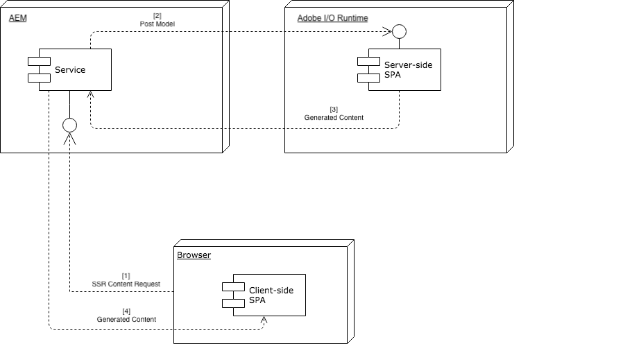

# SPA- und serverseitiges Rendering{#spa-and-server-side-rendering}

>[!NOTE]
>Für die Funktion &quot;Einzelseitenanwendung (SPA) Editor&quot;ist [AEM 6.4 Service Pack 2](https://helpx.adobe.com/de/experience-manager/6-4/release-notes/sp-release-notes.html) oder höher erforderlich.
>
>Der SPA-Editor ist die empfohlene Lösung für Projekte, bei denen clientseitiges Rendering (z.B. React oder Angular) durch das SPA-Framework erforderlich ist.

>[!NOTE]
>
>AEM Version 6.4.5.0 oder höher ist erforderlich, um die Funktionen zum Rendern der SPA-Serverseite zu verwenden, wie in diesem Dokument beschrieben.

## Übersicht {#overview}

Einzelseitenanwendungen (SPAs) können dem Anwender ein umfangreiches, dynamisches Angebot bieten, das auf vertraute Weise reagiert und funktioniert, oft genau wie native Anwendungen. [Dies wird erreicht, indem der Client den Inhalt vorab lädt und dann die Benutzerinteraktion](/help/sites-developing/spa-walkthrough.md#how-does-a-spa-work) intensiv aufhebt und so die erforderliche Kommunikation zwischen Client und Server minimiert, wodurch die App reaktiver wird.

Dies kann jedoch zu längeren anfänglichen Ladezeiten führen, insbesondere wenn die SPA groß und inhaltlich reich ist. Um die Ladezeit zu optimieren, können einige Inhalte serverseitig wiedergegeben werden. Die Verwendung des serverseitigen Renderings (SSR) kann das anfängliche Laden der Seite beschleunigen und dann das Rendering an den Client weiterleiten.

## Verwendung von SSR {#when-to-use-ssr}

SSR ist nicht für alle Projekte erforderlich. Obwohl AEM JS SSR für SPA vollständig unterstützt, wird von Adobe nicht empfohlen, sie systematisch für jedes Projekt zu implementieren.

Bei der Entscheidung, SSR zu implementieren, müssen Sie zunächst abschätzen, welche zusätzliche Komplexität, Aufwand und Kostenaufstockung SSR realistisch für das Projekt, einschließlich der langfristigen Wartung, darstellen. Eine SSR-Architektur sollte nur gewählt werden, wenn der Mehrwert die geschätzten Kosten deutlich übersteigt.

SSR bietet in der Regel einen Wert, wenn eine der folgenden Fragen mit einem klaren Ja beantwortet wird:

* **SEO:** Ist SSR noch immer erforderlich, damit Ihre Site von den Suchmaschinen, die Traffic bringen, korrekt indiziert wird? Denken Sie daran, dass die wichtigsten Suchmaschinen-Crawler jetzt JS bewerten.
* **Seitengeschwindigkeit:** Bietet SSR eine messbare Geschwindigkeitsverbesserung in Echtzeit-Umgebung und steigert die Benutzerfreundlichkeit insgesamt?

Nur wenn mindestens eine dieser beiden Fragen mit einem klaren Ja für Ihr Projekt beantwortet wird, empfiehlt Adobe die Implementierung von SSR. In den folgenden Abschnitten wird beschrieben, wie Sie dies mit Adobe I/O Runtime tun.

## Adobe I/O Runtime {#adobe-io-runtime}

Wenn Sie [sicher sind, dass Ihr Projekt die Implementierung der SSR](#when-to-use-ssr)erfordert, empfiehlt die Adobe die Verwendung von Adobe I/O Runtime.

Weitere Informationen zu Adobe I/O Runtime finden Sie unter

* [https://www.adobe.io/apis/experienceplatform/runtime.html](https://www.adobe.io/apis/experienceplatform/runtime.html) - Überblick über den Dienst
* [https://www.adobe.io/apis/experienceplatform/runtime/docs.html](https://www.adobe.io/apis/experienceplatform/runtime/docs.html) - für eine ausführliche Dokumentation auf der Plattform

In den folgenden Abschnitten wird erläutert, wie Adobe I/O Runtime zur Implementierung von SSR für Ihre SPA in zwei verschiedenen Modellen verwendet werden kann:

* [AEM-gesteuerter Kommunikationsfluss](#aem-driven-communication-flow)
* [Durch Adobe-I/O-Laufzeitschaltung angetriebener Kommunikationsfluss](#adobe-io-driven-communication-flow)

>[!NOTE]
>
>Adobe empfiehlt für jede AEM Umgebung eine separate Adobe I/O Runtime-Instanz (Autor, Veröffentlichung, Stage usw.).

## Remote Content Renderer-Konfiguration {#remote-content-renderer-configuration}

AEM müssen wissen, wo der remote gerenderte Inhalt abgerufen werden kann. Unabhängig davon, [welches Modell Sie für SSR](#adobe-io-runtime)implementieren, müssen Sie angeben, wie Sie auf diesen Remote-Rendering-Dienst zugreifen AEM.

Dies erfolgt über den **RemoteContentRenderer - Configuration Factory** OSGi-Dienst. Suchen Sie in der Web-Konsolenkonfiguration nach der Zeichenfolge &quot;RemoteContentRenderer&quot;unter `http://<host>:<port>/system/console/configMgr`.


Die folgenden Felder stehen für die Konfiguration zur Verfügung:

* **Inhaltspfadmuster** - Regulärer Ausdruck, um bei Bedarf einen Inhaltsbereich zuzuordnen
* **Remote-Endpunkt-URL** - URL des Endpunkts, der für die Erstellung des Inhalts verantwortlich ist
   * Verwenden Sie das gesicherte HTTPS-Protokoll, wenn nicht im lokalen Netzwerk.
* **Zusätzliche Anforderungsheader** - Zusätzliche Header, die der an den Remote-Endpunkt gesendeten Anforderung hinzugefügt werden
   * Muster: `key=value`
* **Anfrage-Timeout** - Zeitlimit für Remote-Host-Anfrage in Millisekunden

>[!NOTE]
>
>Unabhängig davon, ob Sie sich für die Implementierung des [AEM-basierten Kommunikationsflusses](#aem-driven-communication-flow) oder des [Adobe I/O Runtime-basierten Datenflusses](#adobe-io-driven-communication-flow)entscheiden, müssen Sie eine Remote-Konfiguration des Inhalts-Renderers definieren.
>
>Diese Konfiguration muss auch definiert werden, wenn Sie einen benutzerdefinierten Node.js-Server [verwenden](#using-node-js).

>[!NOTE]
>
>Diese Konfiguration nutzt den [Remote Content Renderer](#remote-content-renderer), der über zusätzliche Erweiterungs- und Anpassungsoptionen verfügt.

## AEM-gesteuerter Kommunikationsfluss {#aem-driven-communication-flow}

Bei Verwendung von SSR umfasst der Arbeitsablauf [für die](/help/sites-developing/spa-overview.md#workflow) Komponenteninteraktion von SPAs in AEM eine Phase, in der der ursprüngliche Inhalt der App von Adobe I/O Runtime generiert wird.

1. Der Browser fordert den SSR-Inhalt von AEM an.
1. AEM sendet das Modell an Adobe I/O Runtime.
1. Adobe I/O Runtime gibt den generierten Inhalt zurück
1. AEM gibt den von Adobe I/O Runtime über die HTML-Vorlage der Backend-Seitenkomponente zurückgegebenen HTML-Code aus.



### Adobe I/O Runtime-orientierter Kommunikationsfluss {#adobe-io-driven-communication-flow}

Der Abschnitt [AEM-Driven Communication Flow](#aem-driven-communication-flow) beschreibt die standardmäßige und empfohlene Implementierung des serverseitigen Renderings in Bezug auf SPAs in AEM, bei dem AEM das Bootstrapping und die Bereitstellung von Inhalten durchführt.

Alternativ kann SSR implementiert werden, sodass Adobe I/O Runtime für das Bootstrapping verantwortlich ist und den Kommunikationsfluss effektiv umkehrt.

Beide Modelle sind gültig und werden von AEM unterstützt. Vor der Einführung eines bestimmten Modells sollten jedoch die Vor- und Nachteile jedes einzelnen Modells berücksichtigt werden.

| Bootstrapping | Vorteile | Nachteile |
|---|---|---|
| AEM | AEM verwaltet die Injektion von Bibliotheken dort, wo<br>benötigt werdenRessourcen müssen nur auf AEM | Möglicherweise nicht mit SPA-Entwicklern vertraut |
| über Adobe I/O Runtime | Eingehendere Kenntnisse der SPA-Entwickler | Clientlib-Ressourcen, die für die Anwendung erforderlich sind, wie CSS und JavaScript, müssen vom AEM-Entwickler über die [`allowProxy` EigenschaftResources zwischen AEM und Adobe-E/A-](/help/sites-developing/clientlibs.md#locating-a-client-library-folder-and-using-the-proxy-client-libraries-servlet)<br><br>Laufzeit synchronisiert werdenUm das Authoring der SPA zu aktivieren, ist unter Umständen ein Proxyserver für Adobe I/O Runtime erforderlich |

## Planung für SSR {#planning-for-ssr}

Im Allgemeinen muss nur ein Teil einer Anwendung serverseitig gerendert werden. Das gängige Beispiel ist, dass der Inhalt, der über der Kante beim ersten Laden der Seite angezeigt wird, serverseitig gerendert werden muss. Dies spart Zeit, indem bereits gerenderte Inhalte an den Client gesendet werden. Wenn der Benutzer mit der SPA interagiert, wird der zusätzliche Inhalt vom Client gerendert.

Wenn Sie erwägen, das serverseitige Rendering für Ihre SPA zu implementieren, müssen Sie überprüfen, welche Teile der App SSR erfordern.

## Entwickeln einer SPA mit SSR {#developing-an-spa-using-ssr}

SPA-Komponenten können vom Client (im Browser) oder vom Server gerendert werden. Beim Rendern auf Serverseite sind keine Browsereigenschaften wie Fenstergröße und -position vorhanden. Daher sollten SPA-Komponenten isomorphisch sein, sodass keine Annahme darüber besteht, wo sie gerendert werden.

Zur Nutzung von SSR müssen Sie Ihren Code sowohl in AEM als auch auf Adobe I/O Runtime bereitstellen, das für das serverseitige Rendering zuständig ist. Der Großteil des Codes ist gleich, jedoch unterscheiden sich serverspezifische Aufgaben.

## SSR für besondere Schutzgebiete in AEM {#ssr-for-spas-in-aem}

SSR für SPAs in AEM erfordern Adobe I/O Runtime, das für die Wiedergabe der App Content Server-Seite aufgerufen wird. Innerhalb der HTL der App wird eine Ressource auf Adobe I/O Runtime aufgerufen, um den Inhalt zu rendern.

Ebenso wie AEM standardmäßig die SPA-Frameworks &quot;Angular&quot;und &quot;React&quot;unterstützt, wird auch das serverseitige Rendering für Angular- und React-Apps unterstützt. Weitere Informationen finden Sie in der NPM-Dokumentation für beide Frameworks.

* Reaktion: [https://github.com/adobe/aem-sample-we-retail-journal/blob/master/react-app/DEVELOPMENT.md#enabling-the-server-side-rendering-using-the-aem-page-component](https://github.com/adobe/aem-sample-we-retail-journal/blob/master/react-app/DEVELOPMENT.md#enabling-the-server-side-rendering-using-the-aem-page-component)
* Angular: [https://github.com/adobe/aem-sample-we-retail-journal/blob/master/react-app/DEVELOPMENT.md#enabling-the-server-side-rendering-using-the-aem-page-component](https://github.com/adobe/aem-sample-we-retail-journal/blob/master/react-app/DEVELOPMENT.md#enabling-the-server-side-rendering-using-the-aem-page-component)

Ein einfaches Beispiel finden Sie in der [Web.Retail-Protokoll-App](https://github.com/Adobe-Marketing-Cloud/aem-sample-we-retail-journal). Es rendert die gesamte Anwendungsserverseite. Obwohl dies kein echtes Beispiel ist, zeigt es doch, was zur Umsetzung der Reform des Sicherheitssektors erforderlich ist.

>[!CAUTION]
>Die [Web.Retail-Protokoll-App](https://github.com/Adobe-Marketing-Cloud/aem-sample-we-retail-journal) dient nur zu Demonstrationszwecken und verwendet daher Node.js als einfaches Beispiel anstelle des empfohlenen Adobe I/O Runtime. Dieses Beispiel sollte für keine Projektarbeit verwendet werden.

>[!NOTE]
>Jedes AEM Projekt sollte den [AEM Project Archetype](https://docs.adobe.com/content/help/en/experience-manager-core-components/using/developing/archetype/overview.html)nutzen, der SPA-Projekte mit React oder Angular unterstützt und das SPA-SDK nutzt.

## Verwenden von Node.js {#using-node-js}

Adobe I/O Runtime ist die empfohlene Lösung für die Implementierung von SSR für SPAs in AEM.

Bei Instanzen, die auf einer AEM ausgeführt werden, ist es auch möglich, SSR mit einer benutzerdefinierten Node.js-Instanz zu implementieren, wie oben beschrieben. Obwohl dies von Adobe unterstützt wird, wird es nicht empfohlen.

Node.js wird für Instanzen, die von Adoben gehostet AEM, nicht unterstützt.

>[!NOTE]
>
>Wenn SSR über Node.js implementiert werden muss, empfiehlt Adobe eine separate Node.js-Instanz für jede AEM Umgebung (Autor, Veröffentlichung, Stage usw.).

## Remote Content Renderer {#remote-content-renderer}

Die [Remote Content Renderer-Konfiguration](#remote-content-renderer-configuration) , die für die Verwendung von SSR mit Ihrer SPA in AEM erforderlich ist, tippt auf einen allgemeineren Renderdienst, der erweitert und an Ihre Anforderungen angepasst werden kann.

### RemoteContentRenderingService {#remotecontentrenderingservice}

`RemoteContentRenderingService` ist ein OSGi-Dienst zum Abrufen von Inhalten, die auf einem Remote-Server wiedergegeben werden, z. B. von der Adobe I/O. Der an den Remote-Server gesendete Inhalt basiert auf dem weitergeleiteten Anforderungsparameter.

`RemoteContentRenderingService` kann durch Abhängigkeitsinversion in ein benutzerdefiniertes Sling-Modell oder Servlet eingefügt werden, wenn zusätzliche Inhaltsbearbeitung erforderlich ist.

Dieser Dienst wird intern vom [RemoteContentRendererRequestHandlerServlet](#remotecontentrendererrequesthandlerservlet)verwendet.

### RemoteContentRendererRequestHandlerServlet {#remotecontentrendererrequesthandlerservlet}

Mit der `RemoteContentRendererRequestHandlerServlet` können Sie die Anforderungskonfiguration programmgesteuert einstellen. `DefaultRemoteContentRendererRequestHandlerImpl`, der bereitgestellten standardmäßigen Implementierung des Anforderungs-Handlers, ermöglicht Ihnen, mehrere OSGi-Konfigurationen zu erstellen, um einen Speicherort in der Inhaltsstruktur einem Remote-Endpunkt zuzuordnen.

Um einen benutzerdefinierten Anforderungs-Handler hinzuzufügen, implementieren Sie die `RemoteContentRendererRequestHandler` Schnittstelle. Stellen Sie sicher, dass die `Constants.SERVICE_RANKING` component-Eigenschaft auf eine Ganzzahl größer als 100 gesetzt wird, was der Rangfolge der Komponente entspricht `DefaultRemoteContentRendererRequestHandlerImpl`.

```
@Component(immediate = true,
        service = RemoteContentRendererRequestHandler.class,
        property={
            Constants.SERVICE_RANKING +":Integer=1000"
        })
public class CustomRemoteContentRendererRequestHandlerImpl implements RemoteContentRendererRequestHandler {}
```

### OSGi-Konfiguration des Standardhandlers konfigurieren {#configure-default-handler}

Die Konfiguration des Standard-Handlers muss wie im Abschnitt [Remote Content Renderer-Konfiguration](#remote-content-renderer-configuration)beschrieben konfiguriert werden.

###  Remote Content Renderer-Nutzung {#usage}

So rufen Sie ein Servlet ab und geben Inhalte zurück, die in die Seite eingefügt werden können:

1. Stellen Sie sicher, dass auf den Remote-Server zugegriffen werden kann.
1. Hinzufügen eines der folgenden Snippets zur HTML-Vorlage einer AEM Komponente.
1. Optional können Sie die OSGi-Konfigurationen erstellen oder ändern.
1. Durchsuchen des Inhalts Ihrer Site

In der Regel ist die HTL-Vorlage einer Seitenkomponente der wichtigste Empfänger einer solchen Funktion.

```
<sly data-sly-resource="${resource @ resourceType='cq/remote/content/renderer/request/handler'}" />
```

### Voraussetzungen {#requirements}

Die Servlets verwenden den Sling Model Exporter, um die Komponentendaten zu serialisieren. Standardmäßig werden sowohl das `com.adobe.cq.export.json.ContainerExporter` als auch `com.adobe.cq.export.json.ComponentExporter` als Sling Model-Adapter unterstützt. Bei Bedarf können Sie Klassen hinzufügen, die an die Verwendung der Variablen `RemoteContentRendererServlet` und die Implementierung der Anforderung angepasst werden sollen `RemoteContentRendererRequestHandler#getSlingModelAdapterClasses`. Die zusätzlichen Klassen müssen den `ComponentExporter`Wert erweitern.
