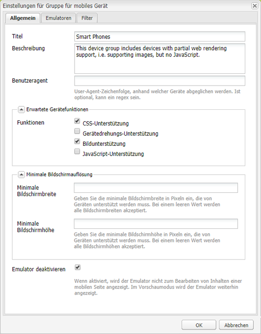
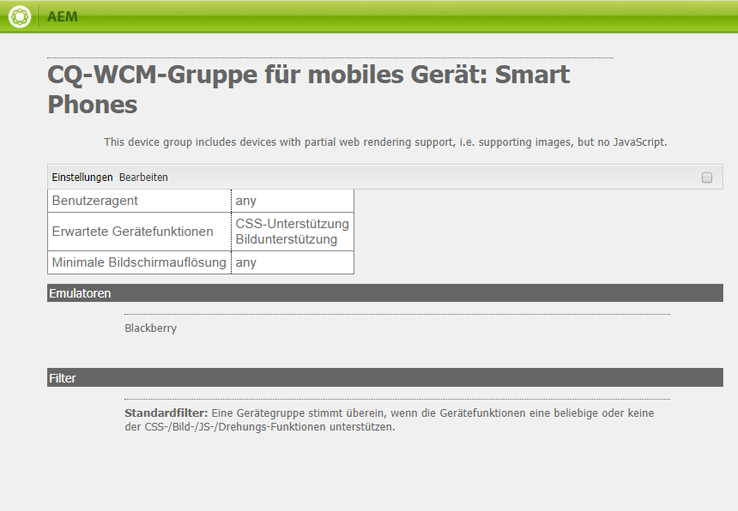
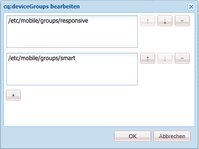
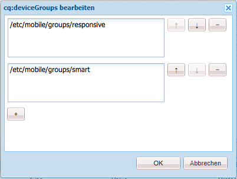
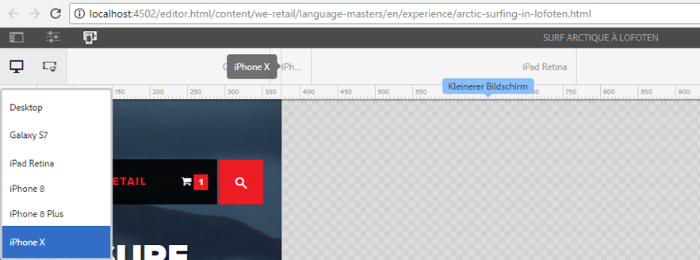

# Rendering von adaptiven Vorlagen{#adaptive-template-rendering}

>[!CAUTION]
>
>AEM 6.4 hat das Ende der erweiterten Unterstützung erreicht und diese Dokumentation wird nicht mehr aktualisiert. Weitere Informationen finden Sie in unserer [technische Unterstützung](https://helpx.adobe.com/de/support/programs/eol-matrix.html). Unterstützte Versionen suchen [here](https://experienceleague.adobe.com/docs/?lang=de).

Das Rendering adaptiver Vorlagen bietet eine Möglichkeit, eine Seite mit Varianten zu verwalten. Diese Funktion, die ursprünglich zur Bereitstellung verschiedener HTML-Ausgaben für Mobilgeräte (z. B. Feature Phone oder Smart Phone) nützlich war, ist nützlich, wenn Erlebnisse für verschiedene Geräte bereitgestellt werden müssen, für die eine andere Markup- oder HTML-Ausgabe erforderlich ist.

## Übersicht {#overview}

Vorlagen werden im Allgemeinen auf einem responsiven Raster aufgebaut. Seiten, die basierend auf diesen Vorlagen erstellt wurden, sind vollständig responsiv und passen sich automatisch an das Ansichtsfenster des Client-Geräts an. Über die Emulator-Symbolleiste im Seiten-Editor können Autoren Layouts für bestimmte Geräte festlegen.

Es ist auch möglich, Vorlagen zur Unterstützung des adaptiven Renderings einzurichten. Wenn Gerätegruppen ordnungsgemäß konfiguriert sind, wird die Seite mit einem anderen Selektor in der URL gerendert, wenn ein Gerät im Emulatormodus ausgewählt wird. Mithilfe eines Selektors kann ein bestimmtes Seiten-Rendering direkt über die URL aufgerufen werden.

Denken Sie beim Einrichten Ihrer Gerätegruppen daran:

* Jedes Gerät muss mindestens einer Gerätegruppe angehören.
* Ein Gerät kann mehreren Gerätegruppen angehören.
* Da Geräte mehreren Gerätegruppen angehören können, können Selektoren kombiniert werden.
* Die Kombination von Selektoren wird von oben nach unten ausgewertet, da sie im Repository beibehalten werden.

>[!NOTE]
>
>Die Gerätegruppe **Responsive Geräte** verfügt nie über einen Selektor, da Geräte, die als unterstützend responsiven Design erkannt werden, kein adaptives Layout benötigen

## Konfiguration {#configuration}

Adaptive Rendering-Selektoren können für bestehende Gerätegruppen oder für [Gruppen, die Sie selbst erstellt haben.](/help/sites-developing/mobile.md#device-groups)

In diesem Beispiel werden wir die vorhandene Gerätegruppe konfigurieren **Smartphones** , um eine Auswahl für adaptives Rendering als Teil der **Erlebnisseite** -Vorlage in We.Retail.

1. Bearbeiten Sie die Gerätegruppe, für die ein adaptiver Selektor benötigt wird, unter `http://localhost:4502/miscadmin#/etc/mobile/groups`.

   Aktivieren Sie die Option **Emulator deaktivieren** und speichern Sie diese Einstellung.

   

1. Der Selektor steht für **Blackberry** und **iPhone 4** zur Verfügung, vorausgesetzt, die Gerätegruppe **Smartphones** wird, wie in den folgenden Schritten erläutert, zur Vorlage und zu den Seitenstrukturen hinzugefügt.

   

1. Lassen Sie über CRXDE Lite zu, dass die Gerätegruppe bei der Vorlage genutzt wird. Fügen Sie dazu diese Gruppe zu der String-Eigenschaft mit mehreren Werten `cq:deviceGroups` in der Struktur der Vorlage hinzu.

   `/conf/<your-site>/settings/wcm/templates/<your-template>/structure/jcr:content`

   Beispiel: Die Smartphones-Gerätegruppe soll hinzugefügt werden:

   `/conf/we-retail/settings/wcm/templates/experience-page/structure/jcr:content`

   

1. Lassen Sie über CRXDE Lite zu, dass die Gerätegruppe auf Ihrer Website genutzt wird. Fügen Sie dazu diese Gruppe zu der String-Eigenschaft mit mehreren Werten `cq:deviceGroups` in der Struktur der Website hinzu.

   `/content/<your-site>/jcr:content`

   Beispiel: Die Gerätegruppe **Smartphones** soll zugelassen werden:

   `/content/we-retail/jcr:content`

   

Wenn Sie nun den [Emulator](/help/sites-authoring/responsive-layout.md#layout-definitions-device-emulation-and-breakpoints) im Seiten-Editor verwenden (z. B. beim [Bearbeiten des Layouts](/help/sites-authoring/responsive-layout.md)) und ein Gerät der konfigurierten Gerätegruppe auswählen, wird die Seite mit einem Selektor als Teil der URL gerendert.

Wenn Sie in unserem Beispiel eine Seite bearbeiten, die auf der Vorlage **Erlebnisseite** basiert, und im Emulator „iPhone 4“ auswählen, wird die Seite so gerendert, dass der Selektor als `arctic-surfing-in-lofoten.smart.html` statt als `arctic-surfing-in-lofoten.html` enthalten ist.

Die Seite lässt sich auch direkt über diesen Selektor auswählen.

