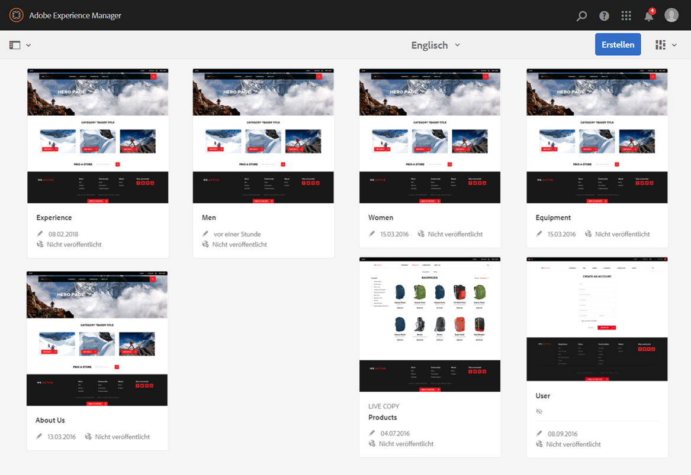
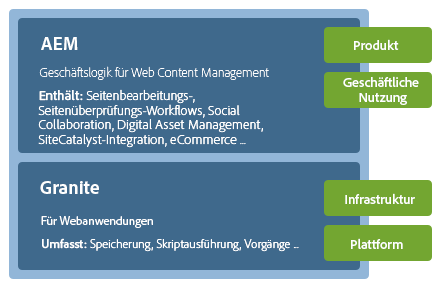
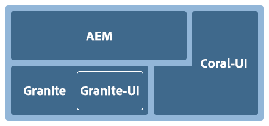
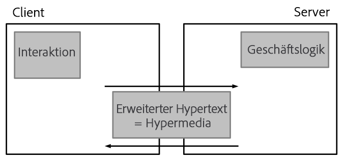
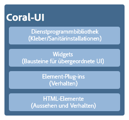

# Konzepte der Touch-optimierten Benutzeroberfläche von AEM{#concepts-of-the-aem-touch-enabled-ui}

>[!CAUTION]
>
>AEM 6.4 hat das Ende der erweiterten Unterstützung erreicht und diese Dokumentation wird nicht mehr aktualisiert. Weitere Informationen finden Sie in unserer [technische Unterstützung](https://helpx.adobe.com/de/support/programs/eol-matrix.html). Unterstützte Versionen suchen [here](https://experienceleague.adobe.com/docs/?lang=de).

Mit AEM Adobe 5.6 wurde eine neue Touch-optimierte Benutzeroberfläche mit [responsives Design](/help/sites-authoring/responsive-layout.md) für die Autorenumgebung. Dies unterscheidet sich erheblich von der klassischen Benutzeroberfläche, da sie sowohl für Touch- als auch für Desktop-Geräte entwickelt wurde.

Diese Touch-optimierte Benutzeroberfläche ist jetzt die Standardbenutzeroberfläche für AEM und ersetzt die klassische Benutzeroberfläche.

>[!NOTE]
>
>Die Touch-optimierte Benutzeroberfläche ist die Standardbenutzeroberfläche für AEM, obwohl die klassische Benutzeroberfläche weiterhin unterstützt wird.

Die Touch-optimierte Benutzeroberfläche umfasst Folgendes:

* Suite-Kopfzeile:

   * Zeigt das Logo an.
   * Enthält einen Link zu „Globale Navigation“.
   * Enthält einen Link zu anderen generischen Aktionen, z. B. „Suchen“, „Hilfe“, „Marketing Cloud-Lösungen“, „Benachrichtigungen“ und „Benutzereinstellungen“.

* Leiste auf der linken Seite (Anzeige bei Bedarf, kann ausgeblendet werden):

   * Zeitleiste
   * Verweise
   * Filter

* Die Navigationskopfzeile, die ebenfalls kontextsensitiv ist und Folgendes anzeigen kann:

   * Anzeige, welche Konsole Sie derzeit verwenden bzw. Ihrer Position in der Konsole
   * Auswahl für die linke Leiste
   * Breadcrumb
   * Zugriff auf geeignete Aktionen vom Typ **Erstellen**
   * Anzeigen von Auswahlen

* Der Inhaltsbereich, der:

   * Listet die Inhaltselemente auf (seien es Seiten, Assets, Forumsbeiträge usw.)
   * Kann nach Bedarf formatiert werden, z. B. Spalte, Karte oder Liste
   * Nutzung eines responsiven Designs (Größe der Anzeige wird je nach Gerät bzw. Fenstergröße automatisch angepasst)
   * Unendliches Scrollen (keine Seiten mehr, alle Elemente in einem Fenster)



>[!NOTE]
>
>Fast alle AEM Funktionen wurden auf die Touch-optimierte Benutzeroberfläche portiert. In einigen wenigen Fällen wird die Funktionalität jedoch auf die klassische Benutzeroberfläche zurückgesetzt. Siehe [Funktionsstatus der Touch-optimierten Benutzeroberfläche](/help/release-notes/touch-ui-features-status.md) für weitere Informationen.

Die Touch-optimierte Benutzeroberfläche wurde von Adobe entwickelt, um die Konsistenz des Benutzererlebnisses über mehrere Produkte hinweg zu gewährleisten. Er basiert auf:

* **Coral-Benutzeroberfläche** (CUI) eine Implementierung des visuellen Stils der Adobe für die Touch-optimierte Benutzeroberfläche. Die Coral-Benutzeroberfläche bietet alles, was Ihr Produkt/Projekt/Ihre Webanwendung benötigt, um den visuellen Stil der Benutzeroberfläche zu übernehmen.
* **Granite-Benutzeroberfläche** -Komponenten werden mit der Coral-Benutzeroberfläche erstellt.

Die Grundprinzipien der Touch-optimierten Benutzeroberfläche sind:

* Mobilgeräte zuerst (mit Blick auf Desktop)
* Responsives Design
* Kontextbezogene Anzeige
* Wiederverwendbar
* Einschließen der eingebetteten Referenzdokumentation
* Einschließen eingebetteter Tests
* Bottom-Up-Design zur Sicherstellung, dass diese Prinzipien auf alle Elemente und Komponenten angewendet werden

Einen weiteren Überblick über die Struktur der Touch-optimierten Benutzeroberfläche finden Sie im Artikel [Struktur der Touch-optimierten Benutzeroberfläche von AEM](/help/sites-developing/touch-ui-structure.md).

## AEM {#aem-technology-stack}

AEM verwendet die Granite-Plattform als Basis und die Granite-Plattform umfasst unter anderem das Java Content Repository.



## Granite {#granite}

Granite ist der Open-Web-Stack der Adobe und bietet verschiedene Komponenten wie:

* App-Starter
* Ein OSGi-Framework, in dem alles bereitgestellt wird
* Mehrere OSGi-Kompendium-Dienste zur Unterstützung von Bauanwendungen
* Ein umfassendes Protokollierungs-Framework mit verschiedenen Protokollierungs-APIs
* Die CRX-Repository-Implementierung der JCR-API-Spezifikation
* Das Apache Sling Web Framework
* Zusätzliche Teile des aktuellen CRX-Produkts

>[!NOTE]
>
>Granite wird als offenes Entwicklungsprojekt in Adobe ausgeführt: Beiträge zum Code, Diskussionen und Themen werden aus dem gesamten Unternehmen übernommen.
>
>Granite ist jedoch **not** ein Open-Source-Projekt. Es basiert in hohem Maße auf mehreren Open-Source-Projekten (vor allem Apache Sling, Felix, Jackrabbit und Lucene), aber Adobe achtet genau darauf, was öffentlich und was intern ist.

## Granite-Benutzeroberfläche {#granite-ui}

Die Granite-Engineering-Plattform bietet außerdem ein Framework für die Foundation-Benutzeroberfläche. Die wichtigsten Ziele sind:

* Bereitstellen granularer UI-Widgets
* Implementieren Sie die Benutzeroberflächenkonzepte und illustrieren Sie die Best Practices (Rendern von langen Listen, Filtern von Listen, CRUD von Objekten, CUD-Assistenten usw.).
* Bereitstellung einer erweiterbaren und Plug-in-basierten Verwaltungsoberfläche

Diese erfüllen die Anforderungen:

* Respektieren von &quot;mobile first&quot;
* Erweiterbar
* Überschreiben einfach



Die Granite-Benutzeroberfläche:

* Verwendet die RESTful-Architektur von Sling
* Implementiert Komponentenbibliotheken zum Erstellen inhaltsorientierter Webanwendungen
* Bietet granulare UI-Widgets
* Bietet eine standardmäßige, standardisierte Benutzeroberfläche
* Ist erweiterbar
* Wird sowohl für mobile als auch für Desktop-Geräte entwickelt (berücksichtigt zuerst mobile Geräte)
* Kann in jeder Granite-basierten Plattform/jedem Produkt/Projekt verwendet werden; z. B. AEM


* [Foundation-Komponenten der Granite-Benutzeroberfläche](#granite-ui-foundation-components)

   Diese Bibliothek mit Foundation-Komponenten kann von anderen Bibliotheken verwendet oder erweitert werden.

* [Granite-Benutzeroberfläche – Verwaltungskomponenten](#granite-ui-administration-components)

### Client-seitig und Server-seitig {#client-side-vs-server-side}

Die Client-Server-Kommunikation in der Granite-Benutzeroberfläche besteht aus Hypertext, nicht aus Objekten. Daher ist es nicht erforderlich, dass der Client die Geschäftslogik versteht

* Der Server ergänzt die HTML mit semantischen Daten
* Der Client reichert den Hypertext mit Hypermedia (Interaktion) an



#### Clientseite {#client-side}

Dabei wird eine Erweiterung des HTML-Vokabulars verwendet, vorausgesetzt der Autor kann seine Absicht zum Erstellen einer interaktiven Webanwendung zum Ausdruck bringen. Dies ist ein ähnlicher Ansatz wie [WAI-ARIA](https://www.w3.org/TR/wai-aria/) und [Mikroformate](http://microformats.org/).

Sie besteht in erster Linie aus einer Sammlung von Interaktionsmustern (z. B. asynchron Senden eines Formulars), die von JS- und CSS-Codes interpretiert werden und clientseitig ausgeführt werden. Die Rolle der Client-Seite besteht darin, das Markup für Interaktivität zu verbessern (das vom Server als Hypermedia-Angebot angegeben wird).

Die Client-Seite ist unabhängig von jeder Server-Technologie. Solange der Server das entsprechende Markup bereitstellt, kann die Client-Seite seine Rolle erfüllen.

Derzeit werden die JS- und CSS-Codes als Granite bereitgestellt [clientlibs](/help/sites-developing/clientlibs.md) unter der Kategorie:

`granite.ui.foundation and granite.ui.foundation.admin`

Die Bereitstellung erfolgt im Rahmen des Inhaltspakets:

`granite.ui.content`

#### Serverseitig {#server-side}

Dies wird durch eine Sammlung von Sling-Komponenten gebildet, die es dem Autor ermöglichen, *zusammensetzen* eine schnelle Webapp. Der Entwickler entwickelt Komponenten, der Autor stellt die Komponenten zu einer Webanwendung zusammen. Die Rolle der Server-Seite besteht darin, dem Client das Hypermedia-Angebot (Markup) zu geben.

Die Komponenten befinden sich derzeit im Granite-Repository unter:

`/libs/granite/ui/components/foundation`

Dies wird als Teil des Inhaltspakets bereitgestellt:

`granite.ui.content`

### Unterschiede zur klassischen Benutzeroberfläche {#differences-with-the-classic-ui}

Die Unterschiede zwischen der Granite-Benutzeroberfläche und ExtJS (für die klassische Benutzeroberfläche verwendet) sind ebenfalls interessant:

<table> 
 <tbody> 
  <tr> 
   <td><strong>ExtJS</strong></td> 
   <td><strong>Granite-Benutzeroberfläche</strong></td> 
  </tr> 
  <tr> 
   <td>Remote-Prozessaufruf<br /> </td> 
   <td>Statusübergänge</td> 
  </tr> 
  <tr> 
   <td>Datenübertragungsobjekte</td> 
   <td>Hypermedia</td> 
  </tr> 
  <tr> 
   <td>Client kennt die Server-Interna</td> 
   <td>Der Client kennt keine Interna</td> 
  </tr> 
  <tr> 
   <td>„FAT-Client“</td> 
   <td>„Thin-Client“</td> 
  </tr> 
  <tr> 
   <td>Spezialisierte Client-Bibliotheken</td> 
   <td>Universelle Client-Bibliotheken</td> 
  </tr> 
 </tbody> 
</table>

### Foundation-Komponenten der Granite-Benutzeroberfläche {#granite-ui-foundation-components}

Die [Foundation-Komponenten der Granite-Benutzeroberfläche](https://helpx.adobe.com/de/experience-manager/6-4/sites/developing/using/reference-materials/granite-ui/api/jcr_root/libs/granite/ui/index.html) stellen die grundlegenden Bausteine bereit, die zum Erstellen einer beliebigen Benutzeroberfläche erforderlich sind. Dazu gehören unter anderem:

* Schaltfläche
* Hyperlink
* Benutzer-Avatar

Die Foundation-Komponenten finden Sie unter:

`/libs/granite/ui/components/foundation`

Diese Bibliothek enthält eine Granite-UI-Komponente für jedes Coral-Element. Eine Komponente ist inhaltsgesteuert, wobei sich ihre Konfiguration im Repository befindet. Dies ermöglicht die Erstellung einer Granite-Benutzeroberflächen-Anwendung, ohne dass manuell HTML-Markup geschrieben werden muss.

Zweck:

* Komponentenmodell für HTML-Elemente
* Komponentenkomposition
* Automatische Tests von Einheiten und Funktionen

Implementierung:

* Repository-basierte Zusammensetzung und Konfiguration
* Nutzung der von der Granite-Plattform bereitgestellten Testeinrichtungen
* JSP-Vorlage

Diese Bibliothek mit Foundation-Komponenten kann von anderen Bibliotheken verwendet oder erweitert werden.

### ExtJS und zugehörige Granite-UI-Komponenten {#extjs-and-corresponding-granite-ui-components}

Bei der Aktualisierung von ExtJS-Code zur Verwendung der Granite-Benutzeroberfläche bietet die folgende Liste einen praktischen Überblick über ExtJS-xtypes und Knotentypen mit den entsprechenden Granite-UI-Ressourcentypen.

| **ExtJS xtype** | **Ressourcentyp der Granite-Benutzeroberfläche** |
|---|---|
| `button` | `granite/ui/components/foundation/form/button` |
| `checkbox` | `granite/ui/components/foundation/form/checkbox` |
| `componentstyles` | `cq/gui/components/authoring/dialog/componentstyles` |
| `cqinclude` | `granite/ui/components/foundation/include` |
| `datetime` | `granite/ui/components/foundation/form/datepicker` |
| `dialogfieldset` | `granite/ui/components/foundation/form/fieldset` |
| `hidden` | `granite/ui/components/foundation/form/hidden` |
| `html5smartfile, html5smartimage` | `granite/ui/components/foundation/form/fileupload` |
| `multifield` | `granite/ui/components/foundation/form/multifield` |
| `numberfield` | `granite/ui/components/foundation/form/numberfield` |
| `pathfield, paragraphreference` | `granite/ui/components/foundation/form/pathbrowser` |
| `selection` | `granite/ui/components/foundation/form/select` |
| `sizefield` | `cq/gui/components/authoring/dialog/sizefield` |
| `tags` | `granite/ui/components/foundation/form/autocomplete` `cq/gui/components/common/datasources/tags` |
| `textarea` | `granite/ui/components/foundation/form/textarea` |
| `textfield` | `granite/ui/components/foundation/form/textfield` |

| **Knotentyp** | **Ressourcentyp der Granite-Benutzeroberfläche** |
|---|---|
| `cq:WidgetCollection` | `granite/ui/components/foundation/container` |
| `cq:TabPanel` | `granite/ui/components/foundation/container` `granite/ui/components/foundation/layouts/tabs` |
| `cq:panel` | `granite/ui/components/foundation/container` |

### Granite-Benutzeroberfläche – Verwaltungskomponenten {#granite-ui-administration-components}

Die [Verwaltungskomponenten der Granite-Benutzeroberfläche](https://helpx.adobe.com/de/experience-manager/6-4/sites/developing/using/reference-materials/granite-ui/api/jcr_root/libs/granite/ui/index.html) auf den Foundation-Komponenten aufbauen, um allgemeine Bausteine bereitzustellen, die von jeder Administration-Anwendung implementiert werden können. Dazu gehören unter anderem:

* Globale Navigationsleiste
* Leiste (Skelett)
* Suchbereich

Zweck:

* Einheitliches Erscheinungsbild für Verwaltungsanwendungen
* Rad für Anwendungen zur Administration

Implementierung:

* Vordefinierte Komponenten mit den Foundation-Komponenten
* Komponenten können angepasst werden

## Coral-Benutzeroberfläche {#coral-ui}

Die Coral-Benutzeroberfläche (CUI) ist eine Implementierung des visuellen Stils der Adobe für die Touch-optimierte Benutzeroberfläche, die darauf ausgelegt ist, die Konsistenz des Benutzererlebnisses über mehrere Produkte hinweg zu gewährleisten. Die Coral-Benutzeroberfläche bietet alles, was Sie zur Übernahme des visuellen Stils in der Authoring-Umgebung benötigen.

>[!CAUTION]
>
>Die Coral-Benutzeroberfläche ist eine UI-Bibliothek, die AEM Kunden zum Erstellen von Anwendungen und Webschnittstellen innerhalb der Grenzen ihrer lizenzierten Nutzung des Produkts zur Verfügung gestellt wird.
>
>Die Nutzung der Coral-Benutzeroberfläche ist nur unter folgenden Bedingungen bzw. für folgende Zwecke zulässig:
>
>* Wenn es versandt und mit AEM gebündelt wurde.
>* Wird verwendet, wenn die vorhandene Benutzeroberfläche der Authoring-Umgebung erweitert wird.
>* Begleitmaterial, Anzeigen und Präsentationen von Adobe
>* Benutzeroberfläche von Anwendungen mit Markenzeichen (die Schriftart darf nicht für andere Adoben verfügbar sein).
>* Mit geringfügigen Anpassungen.
>
>Die Verwendung der Coral-Benutzeroberfläche sollte in folgenden Fällen vermieden werden:
>
>* Dokumente und andere Elemente, die nicht mit der Adobe in Zusammenhang stehen.
>* Umgebungen zur Inhaltserstellung (in denen die vorhergehenden Elemente möglicherweise von anderen generiert werden).
>* Anwendungen/Komponenten/Webseiten, die nicht eindeutig mit der Adobe verbunden sind.
>


Die Coral-Benutzeroberfläche ist eine Sammlung von Bausteinen für die Entwicklung von Web-Anwendungen.



Sie ist vollständig modular konzipiert und jedes Modul stellt basierend auf seiner primäre Rolle eine eigene Ebene dar. Obwohl die Ebenen so konzipiert wurden, dass sie sich gegenseitig unterstützen, können sie bei Bedarf auch unabhängig voneinander verwendet werden. Dies ermöglicht die Implementierung des Benutzererlebnisses von Coral in jeder HTML-fähigen Umgebung.

Mit der Coral-Benutzeroberfläche ist es nicht erforderlich, ein bestimmtes Entwicklungsmodell und/oder eine bestimmte Plattform zu verwenden. Hauptziel von Coral ist die Bereitstellung eines einheitlichen und sauberen HTML5-Markups, unabhängig von der eigentlichen Methode, mit der dieses Markup ausgegeben wird. Er kann für Client- oder Server-seitiges Rendering, Vorlagen, JSP, PHP oder auch Adobe Flash-RIA-Anwendungen verwendet werden, um nur einige zu nennen.

### HTML-Elemente - Markup-Ebene {#html-elements-the-markup-layer}

Über die HTML-Elemente wird ein einheitliches Erscheinungsbild für alle Basiselemente der Benutzeroberfläche (z. B. Navigationsleiste, Schaltfläche, Menü, Leiste usw.) erzielt.

Auf der einfachsten Ebene ist ein HTML-Element ein HTML-Tag mit einem dedizierten Klassennamen. Komplexere Elemente können aus mehreren Tags zusammengestellt werden, die ineinander geschachtelt sind (auf spezifische Weise).

Das CSS wird verwendet, um das eigentliche Erscheinungsbild bereitzustellen. Um eine einfache Anpassung des Erscheinungsbilds (z. B. für Branding-Fälle) zu ermöglichen, werden die Formatierungswerte als Variablen deklariert, die zur Laufzeit vom [LESS](https://lesscss.org/)-Prozessor vorab verarbeitet werden.

Zweck:

* Grundlegende Benutzeroberflächen-Elemente mit einem gemeinsamen Erscheinungsbild bereitstellen
* Standardrastersystem bereitstellen

Implementierung:

* HTML-Tags mit Stilen, die von [Bootstrap](https://twitter.github.com/bootstrap/)
* Klassen werden in LESS-Dateien definiert
* Symbole werden als Schriftspritzen definiert

Beispiel für verwendeten Markup-Code:

```xml
<button class="btn btn-large btn-primary" type="button">Large button</button> 
<button class="btn btn-large" type="button">Large button</button>
```

Darstellung:


Das Erscheinungsbild wird in LESS definiert und es besteht eine Bindung an ein Element nach dem dedizierten Klassennamen (der folgende Auszug wurde gekürzt):

```xml
.btn {
    font-size: @baseFontSize; 
    line-height: @baseLineHeight; 
    .buttonBackground(@btnBackground,
                                @btnBackgroundHighlight,
                                @grayDark, 0 1px 1px rgba(255,255,255,.75));
```

Die tatsächlichen Werte werden in einer LESS-Variablendatei definiert (der folgende Auszug wurde gekürzt):

```xml
@btnBackgroundHighlight: darken(@white, 10%); 
@btnPrimaryBackgroundHighlight: spin(@btnPrimaryBackground, 20%); 
@baseFontSize: 17px;
@baseFontFamily: @sansFontFamily;
```

### Element-Plugins {#element-plugins}

Viele der HTML-Elemente müssen eine gewisse Dynamik aufweisen, z. B. das Öffnen und Schließen von Popup-Menüs. Dies ist die Rolle der Element-Plug-ins, die solche Aufgaben durch Manipulation des DOM mit JavaScript ausführen.

Ein Plug-in ist entweder:

* Für den Betrieb mit einem bestimmten DOM-Element entwickelt. Für ein Dialogfeld-Plug-in wird beispielsweise `DIV class=dialog` erwartet.
* Es ist generischer Art. Über einen Layout-Manager wird beispielsweise das Layout für eine Liste mit `DIV`- oder `LI`-Elementen bereitgestellt.

Das Plug-in-Verhalten kann mit Parametern angepasst werden, indem Sie:

* Übergeben der Parameter mithilfe eines JavaScript-Aufrufs
* Verwenden von dedizierten `data-*`-Attributen, die an den HTML-Markup-Code gebunden sind

Entwickler können für jedes Plug-in den besten Ansatz wählen, aber die Faustregel lautet:

* `data-*`-Attribute für Optionen, die sich auf das HTML-Layout beziehen. So legen Sie beispielsweise die Anzahl der Spalten fest
* API-Optionen/-Klassen für Funktionen im Zusammenhang mit Daten. Beispiel: Erstellung der Liste der anzuzeigenden Elemente

Dasselbe Konzept wird für die Implementierung der Formularüberprüfung verwendet. Für ein Element, das validiert werden soll, müssen Sie das erforderliche Eingabeformular als benutzerdefiniertes `data-*`-Attribut angeben. Dieses Attribut wird dann als Option für ein Validierungs-Plug-in verwendet.

>[!NOTE]
>
>Die HTML5-native Formularvalidierung sollte nach Möglichkeit immer verwendet und erweitert werden.

Zweck:

* Dynamisches Verhalten für HTML-Elemente bereitstellen
* Bereitstellung benutzerdefinierter Layouts, die mit reinem CSS nicht möglich sind
* Formularüberprüfung durchführen
* Erweiterte DOM-Manipulation durchführen

Implementierung:

* jQuery-Plug-in, gebunden an bestimmte DOM-Elemente
* Verwenden von `data-*`-Attributen zum Anpassen des Verhaltens

Ein Auszug aus Beispielmarkup (beachten Sie die Optionen, die als data-&amp;ast angegeben sind); -Attribute):

```xml
<ul data-column-width="220" data-layout="card" class="cards">
  <li class="item">
    <div class="thumbnail">
       
      <div class="caption">
        <h4>Toolbar</h4>
          <p><small>toolbar</small><br></p>
      </div>
    </div>
  </li>
  <li class="item">
    <div class="thumbnail">
       
      <div class="caption">
        <h4>Toolbar</h4>
        <p><small>toolbar</small><br></p>
      </div>
    </div>
  </li>
```

Aufruf des jQuery-Plug-ins:

```
$(‘.cards’).cardlayout ();
```

Anzeige als:


Mit dem `cardLayout`-Plug-in wird das Layout für die eingebundenen `UL`-Elemente basierend auf der entsprechenden Höhe erstellt und außerdem wird die Breite des übergeordneten Elements berücksichtigt.

### HTML-Elemente-Widgets {#html-elements-widgets}

Ein Widget kombiniert ein oder mehrere grundlegende Elemente mit einem JavaScript-Plug-in, um UI-Elemente auf &quot;höherer Ebene&quot;zu bilden. Dadurch können komplexere Verhaltensweisen sowie ein komplexeres Erscheinungsbild implementiert werden, als ein einzelnes Element liefern könnte. Gute Beispiele hierfür sind die Tag-Auswahl oder Leisten-Widgets.

Ein Widget kann benutzerdefinierte Ereignisse sowohl auslösen als auch darauf lauschen, um eine Kooperation mit anderen Widgets der Seite zu ermöglichen. Bei einigen Widgets handelt es sich eigentlich um native jQuery-Widgets, für die die Coral-HTML-Elemente verwendet werden.

Zweck:

* Implementieren von UI-Elementen der höheren Ebene für komplexeres Verhalten
* Auslösen und Verarbeiten von Ereignissen

Implementierung:

* jQuery-Plug-in + HTML Markup
* Kann Client-/Server-seitige Vorlagen verwenden

Beispiel-Markup:

```
<input type="text" name="tags" placeholder="Tags" class="tagManager"/>
```

Aufruf des jQuery-Plug-ins (mit Optionen):

```
$(".tagManager").tagsManager({
        prefilled: ["Pisa", "Rome"] })
```

Das Plug-in gibt HTML Markup aus (dieses Markup verwendet grundlegende Elemente, die intern andere Plug-ins verwenden können):

```
<span>Pisa</span>
<a title="Removing tag" tagidtoremove="0"
   id="myRemover_0" class="myTagRemover" href="#">x</a></span>

<span id="myTag_1" class="myTag"><span>Rome</span>
<a title="Removing tag" tagidtoremove="1"
   id="myRemover_1" class="myTagRemover" href="#">x</a></span>

<input type="text" data-original-title="" class="input-medium tagManager"
       placeholder="Tags" name="tags" data-provide="typeahead" data-items="6"
       autocomplete="off">
```

Anzeige als:


### Dienstprogrammbibliothek {#utility-library}

Diese Bibliothek ist eine Sammlung von JavaScript-Helper-Plug-ins und/oder Funktionen, die:

* Benutzeroberflächenunabhängig
* Entscheidend für die Erstellung von Web-Anwendungen mit vollem Funktionsumfang

Dazu gehören die XSS-Handhabung und der Ereignisbus.

Die HTML-Element-Plug-ins und Widgets können zwar auf Funktionen der Dienstprogrammbibliothek beruhen, die Dienstprogrammbibliothek kann jedoch keine feste Abhängigkeit von den Elementen und Widgets selbst aufweisen.

Zweck:

* Bereitstellung von allgemeiner Funktionalität
* Implementierung des Ereignisbus
* Clientseitige Vorlagen
* XSS

Implementierung:

* jQuery-Plug-ins oder AMD-konforme JavaScript-Module
