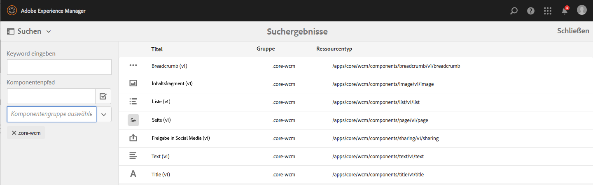
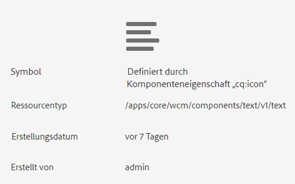
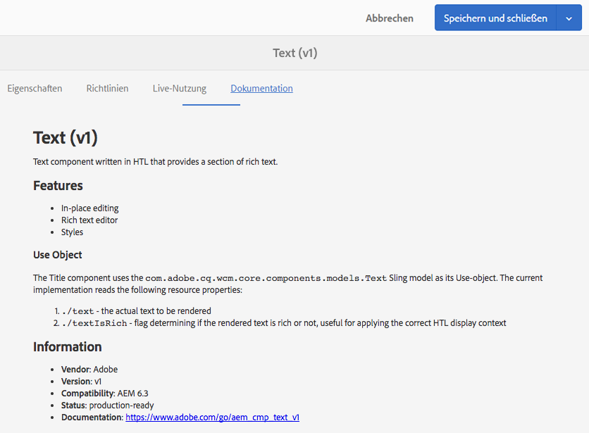
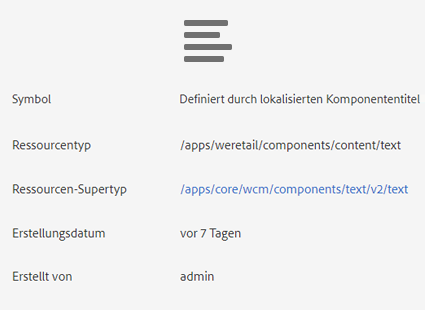
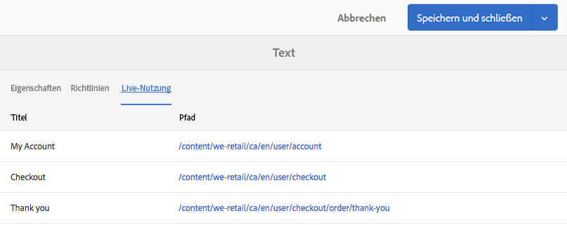
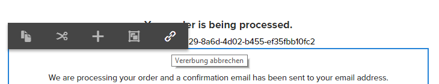
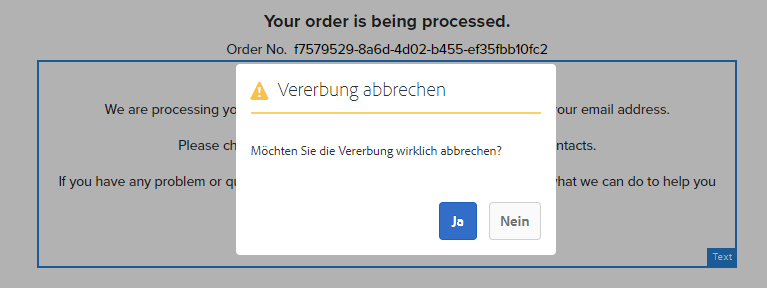
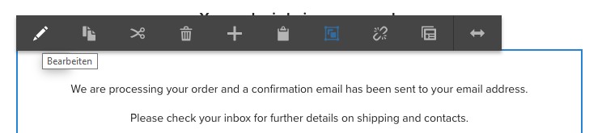
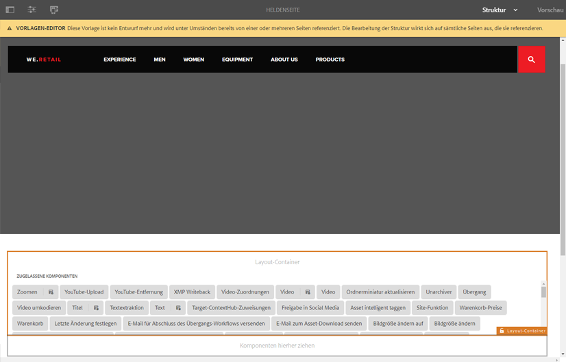
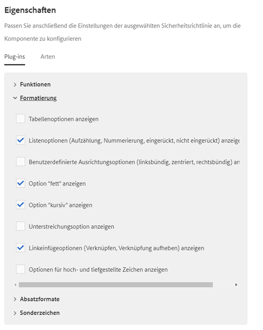

# Testen von Kernkomponenten in We.Retail{#trying-out-core-components-in-we-retail}

>[!CAUTION]
>
>AEM 6.4 hat das Ende der erweiterten Unterstützung erreicht und diese Dokumentation wird nicht mehr aktualisiert. Weitere Informationen finden Sie in unserer [technische Unterstützung](https://helpx.adobe.com/de/support/programs/eol-matrix.html). Unterstützte Versionen suchen [here](https://experienceleague.adobe.com/docs/?lang=de).

Die Kernkomponenten sind moderne, flexible Komponenten mit einfacher Erweiterbarkeit und einfacher Integration in Ihre Projekte. Die Kernkomponenten basieren auf verschiedenen grundlegenden Designprinzipien, wie HTL, Benutzerfreundlichkeit standardmäßig, Konfigurierbarkeit, Versionierung und Erweiterbarkeit. We.Retail basiert auf Kernkomponenten.

## Testen {#trying-it-out}

1. Beginnen Sie AEM mit dem Beispielinhalt &quot;We.Retail&quot;und öffnen Sie die [Komponentenkonsole](/help/sites-authoring/default-components-console.md).

   **Globale Navigation -> Tools -> Komponenten**

1. Wenn Sie die Leiste in der Komponentenkonsole öffnen, können Sie nach einer bestimmten Komponentengruppe filtern. Die Kernkomponenten finden Sie unter

   * `.core-wcm`: Die standardmäßigen Kernkomponenten
   * `.core-wcm-form`: Die Kernkomponenten für die Formularübermittlung

   Choose `.core-wcm`.

   

1. Beachten Sie, dass alle Kernkomponenten **v1**, was zeigt, dass dies die erste Version dieser Kernkomponente ist. Es werden in Zukunft reguläre Versionen veröffentlicht, die versionskompatibel mit AEM sind und ein einfaches Upgrade ermöglichen, sodass Sie die neuesten Funktionen nutzen können.
1. Klicken **Text (v1)**.

   Hier können Sie sehen, dass der **Ressourcentyp** der Komponente `/apps/core/wcm/components/text/v1/text` lautet. Kernkomponenten befinden sich unter `/apps/core/wcm/components` und werden pro Komponente versioniert.

   

1. Klicken Sie auf die Registerkarte **Dokumentation**, um die Entwicklerdokumentation für die Komponente anzuzeigen.

   

1. Kehren Sie zur Komponentenkonsole zurück. Nach Gruppe filtern **We.Retail** und wählen Sie die **Text** -Komponente.
1. Hier können Sie sehen, dass der **Ressourcentyp** auf eine Komponente verweist, wie unter `/apps/weretail` erwartet, aber der **Ressourcen-Supertyp** zurück auf die Kernkomponente `/apps/core/wcm/components/text/v1/text` verweist.

   

1. Klicken Sie auf die Registerkarte **Live-Nutzung**, um anzuzeigen, auf welchen Seiten diese Komponente aktuell verwendet wird. Klicken Sie auf die erste **Dankeseite**, um die Seite zu bearbeiten.

   

1. Wählen Sie auf der Dankeseite die Textkomponente aus und klicken Sie im Bearbeitungsmenü der Komponente auf das Symbol Vererbung abbrechen .

   [We.Retail verfügt über eine globalisierte Site-Struktur](/help/sites-developing/we-retail-globalized-site-structure.md) wo Inhalte von Sprach-Mastern an gesendet werden [Live Copies über einen Mechanismus namens Vererbung](/help/sites-administering/msm.md). Aus diesem Grund muss die Vererbung abgebrochen werden, damit ein Benutzer Text manuell bearbeiten kann.

   

1. Bestätigen Sie den Abbruch, indem Sie auf **Ja** klicken.

   

1. Wenn die Vererbung abgebrochen ist und Sie die Textkomponenten auswählen, stehen Ihnen viele weitere Optionen zur Verfügung. Klicken Sie auf **Bearbeiten**.

   

1. Sie können nun sehen, welche Bearbeitungsmöglichkeiten für die Textkomponente zur Verfügung stehen.

   

1. Aus dem **Seiteninformationen** Menüauswahl **Vorlage bearbeiten**.
1. Klicken Sie im Vorlagen-Editor der Seite auf das **Richtlinien**-Symbol der Textkomponente im **Layout-Container** der Seite.

   

1. Die Kernkomponenten ermöglichen es einem Vorlagenautor, zu konfigurieren, welche Eigenschaften den Seitenautoren zur Verfügung stehen. Dazu gehören Funktionen wie zulässige Einfügequellen, Formatierungsoptionen, verfügbare Absatzstile usw.

   Solche Dialogfelder sind für viele Kernkomponenten verfügbar und arbeiten Hand in Hand mit dem Vorlageneditor. Nach der Aktivierung sind sie für den Autor über die Komponenten-Editoren verfügbar.

   

## Weiterführende Informationen {#further-information}

Weitere Informationen zu den Kernkomponenten finden Sie im Authoring-Dokument . [Kernkomponenten](https://experienceleague.adobe.com/docs/experience-manager-core-components/using/introduction.html?lang=de) für einen Überblick über die Funktionen der Kernkomponenten und das Entwicklerdokument [Entwickeln von Kernkomponenten](https://helpx.adobe.com/de/experience-manager/core-components/using/developing.html) für einen technischen Überblick.

Sie können sich darüber hinaus eingehender mit [bearbeitbaren Vorlagen](/help/sites-developing/we-retail-editable-templates.md) befassen. Umfassende Informationen zu bearbeitbaren Vorlagen finden Sie im Dokument [Erstellen von Seitenvorlagen](/help/sites-authoring/templates.md) für Autoren oder im Dokument [Bearbeitbare Seitenvorlagen](/help/sites-developing/page-templates-editable.md) für Entwickler.
