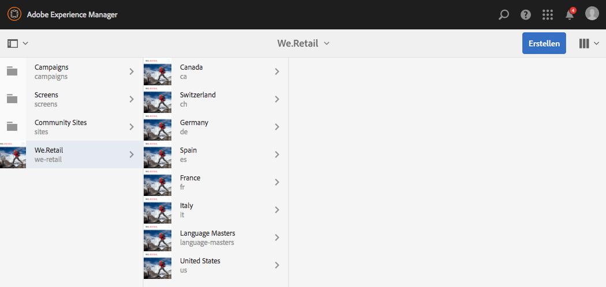
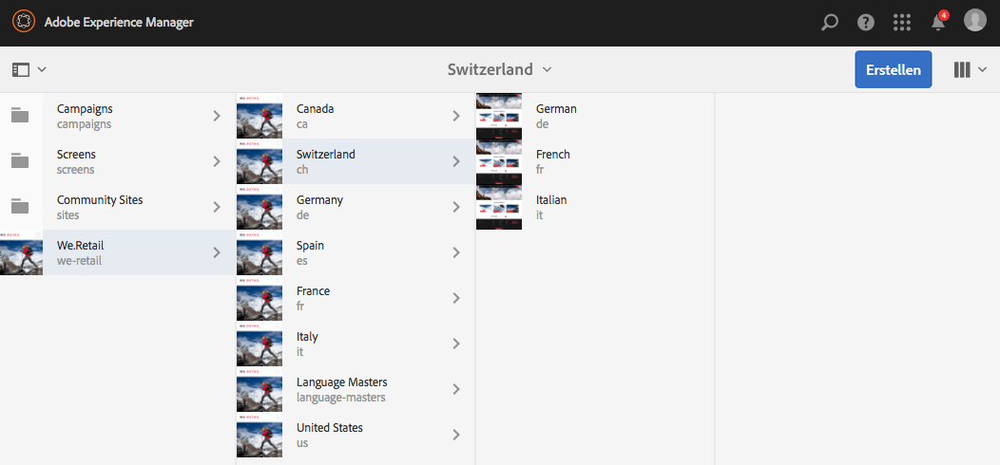
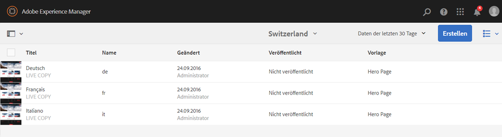
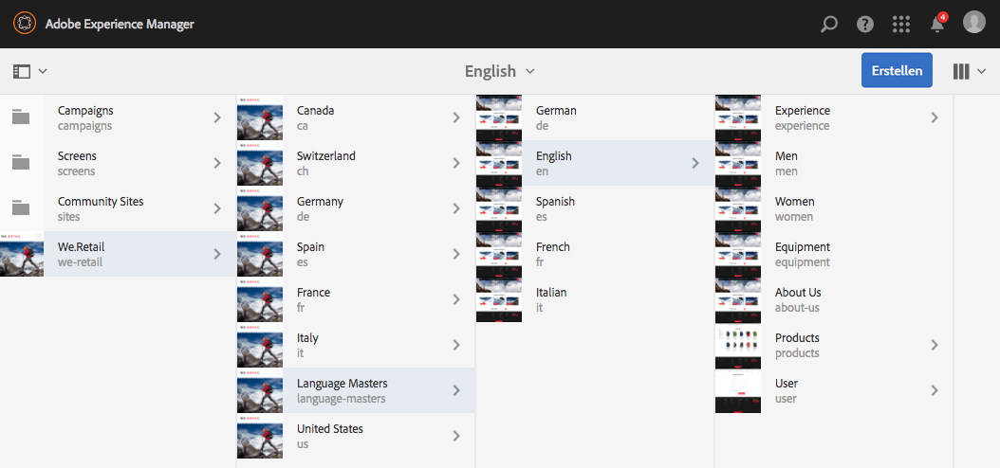
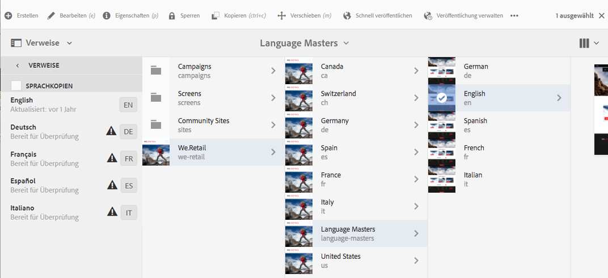
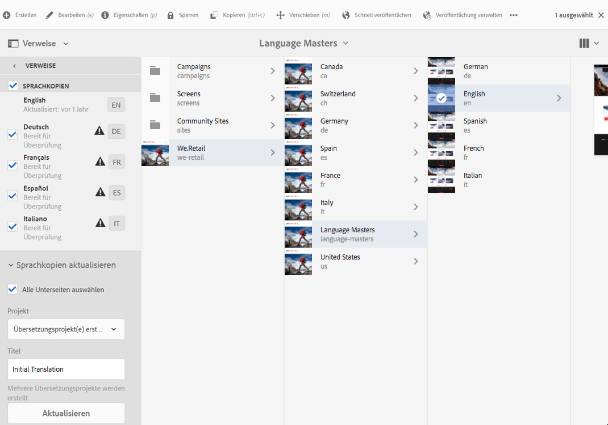
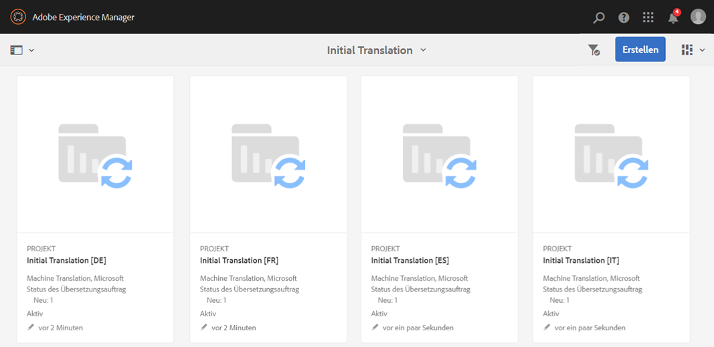
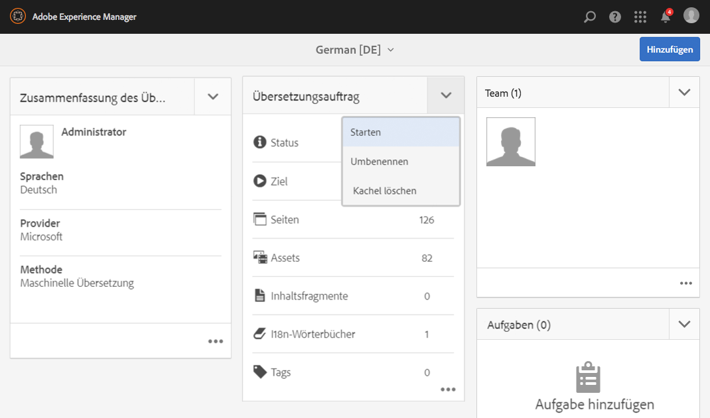
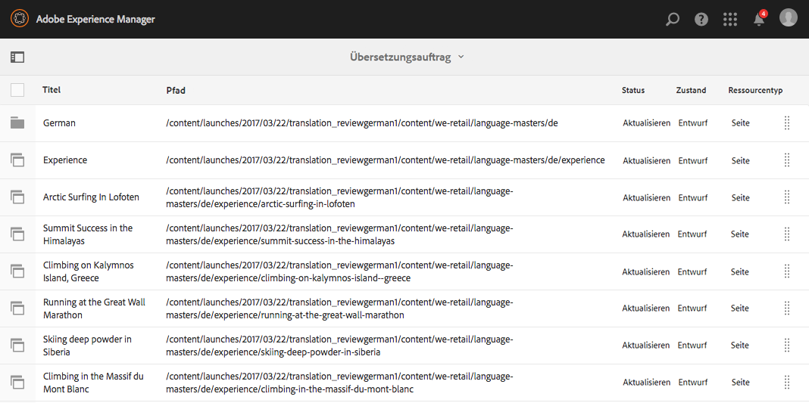
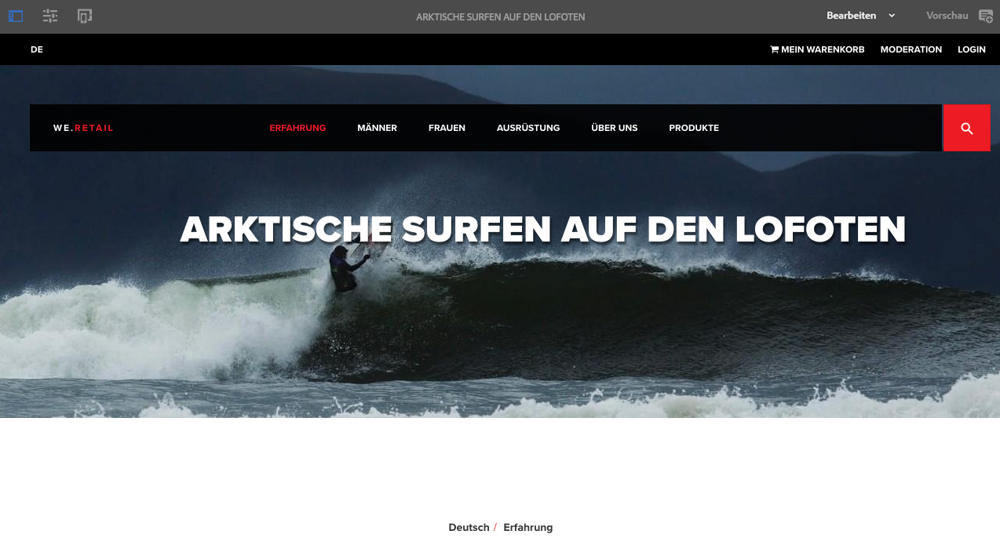

# Testen der globalisierten Site-Struktur von We.Retail{#trying-out-the-globalized-site-structure-in-we-retail}

>[!CAUTION]
>
>AEM 6.4 hat das Ende der erweiterten Unterstützung erreicht und diese Dokumentation wird nicht mehr aktualisiert. Weitere Informationen finden Sie in unserer [technische Unterstützung](https://helpx.adobe.com/de/support/programs/eol-matrix.html). Unterstützte Versionen suchen [here](https://experienceleague.adobe.com/docs/?lang=de).

We.Retail wurde mit einer globalisierten Site-Struktur erstellt, die Sprach-Master bietet, die live auf länderspezifische Websites kopiert werden können. Alles ist vorkonfiguriert, damit Sie mit dieser Struktur und den integrierten Übersetzungsfunktionen experimentieren können.

## Testen {#trying-it-out}

1. Öffnen Sie die Sites-Konsole über **Globale Navigation -> Sites**.
1. Wechseln Sie zur Spaltenansicht (falls noch nicht aktiv) und wählen Sie We.Retail aus. Beachten Sie die Beispiel-Landesstruktur inklusive Schweiz, USA, Frankreich usw. sowie die Sprach-Master.

   

1. Wählen Sie die Schweiz aus und sehen Sie sich die Sprachstämme für die Sprachen dieses Landes an. Beachten Sie, dass unter diesen Wurzeln noch kein Inhalt vorhanden ist.

   

1. Wechseln Sie in die Listenansicht, um zu sehen, dass es sich bei den Sprachkopien für die Länder um Live Copies handelt.

   

1. Kehren Sie zur Spaltenansicht zurück und klicken Sie auf Übergeordnete Sprache und sehen Sie sich die Übergeordneten Sprachstämme mit Inhalt an. Beachten Sie, dass nur Englisch Inhalte enthält.

   We.Retail enthält keine übersetzten Inhalte, doch die Struktur und Konfiguration sind vorhanden, um Ihnen die Übersetzungsdienste zu demonstrieren.

   

1. Lassen Sie den englischen Sprach-Master ausgewählt, öffnen Sie die Leiste **Verweise** in der Sites-Konsole und wählen Sie **Sprachkopien** aus.

   

1. Aktivieren Sie das Kontrollkästchen neben dem **Sprachkopien** Beschriftung zur Auswahl aller Sprachkopien. Im **Sprachkopien aktualisieren** Wählen Sie in der Leiste die Option **Neues Übersetzungsprojekt erstellen**. Geben Sie einen Namen für das Projekt ein und klicken Sie auf **Aktualisieren**.

   

1. Für jede Sprachübersetzung wird ein Projekt erstellt. Anzeigen unter **Navigation -> Projekte**.

   

1. Klicken Sie auf Deutsch , um die Details des Übersetzungsprojekts anzuzeigen. Beachten Sie, dass der Status in **Entwurf**. Um die Übersetzung mit dem Übersetzungsdienst von Microsoft zu starten, klicken Sie auf den Pfeil neben dem **Übersetzungsauftrag** Überschrift und Auswahl **Starten**.

   

1. Das Übersetzungsprojekt beginnt. Klicken Sie unten auf der Karte mit der Bezeichnung Übersetzungsauftrag auf das Auslassungszeichen, um die Details anzuzeigen. Seiten mit dem Status **Bereit zur Überprüfung** wurden bereits vom Übersetzungsdienst übersetzt.

   

1. Wählen Sie in der Liste eine der Seiten und dann in der Symbolleiste die Option **Vorschau in Sites** aus, um die übersetzte Seite im Seiteneditor zu öffnen.

   

>[!NOTE]
>
>Dieses Verfahren zeigt die integrierte Integration mit der maschinellen Übersetzung von Microsoft. Verwenden der [AEM Framework für die Übersetzungsintegration](/help/sites-administering/translation.md), können Sie mit vielen Standardübersetzungsdiensten integrieren, um die Übersetzung von AEM zu koordinieren.

## Weiterführende Informationen {#further-information}

Weitere Informationen sowie vollständige technische Details finden Sie im Dokument [Übersetzen von Inhalten für mehrsprachige Sites](/help/sites-administering/translation.md).
