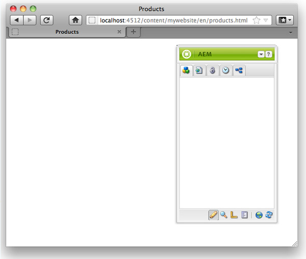
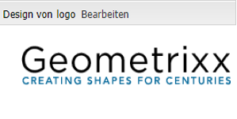

# Erstellen von Websites mit vollem Funktionsumfang (JSP){#create-a-fully-featured-website-jsp}

>[!CAUTION]
>
>In diesem Artikel wird erläutert, wie Sie über die klassische Benutzeroberfläche mithilfe von JSP Websites erstellen. Adobe empfiehlt, die neuesten AEM-Technologien für Ihre Websites zu nutzen, wie ausführlich im Artikel [Erste Schritte bei der Entwicklung von AEM Sites](/help/sites-developing/getting-started.md) beschrieben.

In diesem Tutorial erfahren Sie, wie Sie mit Adobe Experience Manager (AEM) Websites mit vollem Funktionsumfang erstellen. Eine so erstellte Website basiert auf einer generischen Website und ist vor allem auf Webentwickler ausgerichtet. Die gesamte Entwicklung erfolgt in einer Autorenumgebung.

In diesem Tutorial wird erläutert, wie Sie die folgenden Aktionen durchführen:

1. Installieren von AEM
1. Zugreifen auf CRXDE Lite (die Entwicklungsumgebung)
1. Einrichten der Projektstruktur in CRXDE Lite
1. Erstellen der Vorlagen, Komponenten und Skripte, die als Grundlage für die Erstellung von Inhaltsseiten dienen
1. Erstellen der Stammseite für die Website sowie der Inhaltsseiten
1. Erstellen der folgenden Komponenten zur Verwendung auf den Seiten

   * **[!UICONTROL topnav (Navigation oben)]**
   * **[!UICONTROL listchildren (Untergeordnete Elemente auflisten)]**
   * **[!UICONTROL -Logo]**
   * **[!UICONTROL Bild]**
   * **[!UICONTROL textimage (Textbild)]**
   * **[!UICONTROL Suchen]**

1. Einbinden unterschiedlicher Foundation-Komponenten

Nachdem Sie alle Schritte ausgeführt haben, sehen Ihre Seiten wie folgt aus:


**Herunterladen der fertiggestellten Website**

Wenn Sie es vorziehen, dem Tutorial zu folgen, anstatt die Übungen durchzuführen, laden Sie die Datei website-1.0.zip herunter. Diese Datei ist ein AEM-Inhaltspaket, das die Ergebnisse dieses Tutorials enthält. Installieren Sie das Paket mithilfe von [Package Manager](/help/sites-administering/package-manager.md) auf Ihrer Autoreninstanz.

>[!NOTE]
>Durch die Installation dieses Pakets werden alle Ressourcen Ihrer Authoring-Instanz, die Sie mit diesem Lernprogramm erstellt haben, überschrieben.

Website-Inhaltspaket

[Datei laden](assets/website-1_0.zip)

## Installieren von Adobe Experience Manager {#installing-adobe-experience-manager}

Um eine AEM Instanz zum Entwickeln Ihrer Website zu installieren, befolgen Sie die Anweisungen zum Einrichten einer [Bereitstellungsinstanz mit Autor- und Veröffentlichungsinstanzen](/help/sites-deploying/deploy.md#author-and-publish-installs) oder führen Sie eine [generische Umgebung](/help/sites-deploying/deploy.md#default-local-install) durch. Die allgemeine Installation umfasst das Herunterladen der AEM Quickstart-JAR-Datei, das Platzieren der Datei &quot;license.properties&quot;im selben Ordner wie die JAR-Datei und das Klicken der Dublette auf die JAR-Datei.

Nachdem Sie AEM installiert haben, greifen Sie auf die CRXDE Lite-Entwicklungsumgebung zu, indem Sie auf der Begrüßungsseite auf den Link für CRXDE Lite klicken:


>[!NOTE]
>
>Die URL der CRXDE Lite für eine AEM Authoring-Instanz, die lokal mit dem Standardanschluss installiert wird, lautet [http://localhost:4502/crx/de/](http://localhost:4502/crx/de/).

## Einrichten von Projektstrukturen in CRXDE Lite {#setting-up-the-project-structure-in-crxde-lite}

Verwenden Sie CRXDE Lite, um die mywebsite-Anwendungsstruktur im Repository zu erstellen:

1. Klicken Sie in der Struktur auf der linken Seite der CRXDE Lite mit der rechten Maustaste auf den Ordner **`/apps`** und klicken Sie auf **[!UICONTROL Erstellen > Ordner erstellen]**. Geben Sie im Dialogfeld **Ordner erstellen** als Ordnernamen `mywebsite` ein und klicken Sie auf **OK**.
1. Klicken Sie mit der rechten Maustaste auf den Ordner `/apps/mywebsite` und klicken Sie auf **[!UICONTROL Erstellen > Ordner erstellen]**. Geben Sie im Dialogfeld **[!UICONTROL Ordner erstellen]** als Ordnernamen `components` ein und klicken Sie auf **[!UICONTROL OK]**.
1. Klicken Sie mit der rechten Maustaste auf den Ordner `/apps/mywebsite` und klicken Sie auf **[!UICONTROL Erstellen > Ordner erstellen]**. Geben Sie im Dialogfeld **[!UICONTROL Ordner erstellen]** als Ordnernamen `templates` ein und klicken Sie auf **[!UICONTROL OK]**.

   Die Struktur im Baum sollte nun in etwa so aussehen:

   

1. Klicken Sie auf **[!UICONTROL Alle speichern]**.

## Einrichten von Designs {#setting-up-the-design}

In diesem Abschnitt erstellen Sie das Design für Ihre Anwendung mithilfe des Designer-Tools. Das Design stellt CSS- und Bildressourcen für Ihre Website bereit.

>[!NOTE]
>
>Klicken Sie auf den folgenden Link, um ``mywebsite.zip`` herunterzuladen. Das Archiv enthält die static.css- und Bilddateien für Ihr Design.

Beispieldatei &quot;static.css&quot;und Bilder

[Datei laden](assets/mywebsite.zip)

1. Klicken Sie auf der AEM-Begrüßungsseite auf **[!UICONTROL Tools]**. ([http://localhost:4502/libs/cq/core/content/welcome.html](http://localhost:4502/libs/cq/core/content/welcome.html))

   

1. Wählen Sie in der Ordnerstruktur den Ordner **[!UICONTROL Entwürfe]** und klicken Sie dann auf **[!UICONTROL Neu > Neue Seite]**. Geben Sie `mywebsite` als Titel ein und klicken Sie auf **[!UICONTROL Erstellen]**.

1. Wenn das Element „mywebsite“ nicht in der Tabelle aufgeführt wird, aktualisieren Sie die Baumansicht bzw. die Tabelle.

1. [Kopieren Sie mithilfe von ](/help/sites-administering/webdav-access.md) WebDAVaccess auf die URL unter http://localhost:4502 die  `static.css` Beispieldatei und den  `images` Ordner aus der heruntergeladenen Datei &quot;mywebsite.zip&quot;in den  `/etc/designs/mywebsite` Ordner.

   

## Erstellen der Inhaltsseitenvorlage, Komponente und des Skripts {#creating-the-contentpage-template-component-and-script}

In diesem Abschnitt wird die Erstellung der folgenden Elemente beschrieben:

* Die contentpage-Vorlage, die zur Erstellung von Inhaltsseiten in der Beispielwebsite verwendet wird
* Die contentpage-Komponente, die zum Rendern von Inhaltsseiten verwendet werden soll
* Das contentpage-Skript

### Erstellen von contentpage-Vorlagen {#creating-the-contentpage-template}

Erstellen Sie eine Vorlage, die als Basis für die Webseiten Ihrer Website dient.

Eine Vorlage definiert den Standardinhalt einer neuen Seite. Bei komplexen Websites werden ggf. auch mehrere Vorlagen für die Erstellung der verschiedenen Seitentypen der Website verwendet. Bei dieser Übung basieren jedoch alle Seiten auf einer einfachen Vorlage.

1. Klicken Sie in der Ordnerstruktur von CRXDE Lite mit der rechten Maustaste auf `/apps/mywebsite/templates` und klicken Sie dann auf **[!UICONTROL Erstellen > Vorlage erstellen]**.

1. Geben Sie im Dialogfeld „Vorlage erstellen“ die folgenden Werte ein und klicken Sie anschließend auf **[!UICONTROL Weiter]**:

   * **[!UICONTROL Bezeichnung]**: contentpage
   * **[!UICONTROL Titel]**: My Website Content Page Template
   * **[!UICONTROL Beschreibung]**: This is my Website Content Page Template
   * **[!UICONTROL Ressourcentyp]**: mywebsite/components/contentpage

   Verwenden Sie den Standardwert für die Eigenschaft „Rangfolge“.

   

   Der Ressourcentyp identifiziert die Komponente, die die Seite rendert. In diesem Fall werden alle mit der Vorlage contentpage erstellten Seiten von der Komponente `mywebsite/components/contentpage` gerendert.

1. Um die Pfade der Seiten anzugeben, die diese Vorlage verwenden können, klicken Sie auf die Plusschaltfläche und geben Sie `/content(/.*)?` in das angezeigte Textfeld ein. Klicken Sie dann auf **[!UICONTROL Weiter]**.

   

   Der Wert der Eigenschaft allowed path ist ein *regulärer Ausdruck.* Seiten mit einem Pfad, der dem Ausdruck entspricht, können die Vorlage verwenden. In diesem Fall stimmt der reguläre Ausdruck mit dem Pfad des Ordners `/content` und mit allen Unterseiten überein.

   Wenn ein Autor eine Seite unterhalb von `/content` erstellt, wird die Vorlage **[!UICONTROL contentpage]** in einer Liste der zu verwendenden Vorlagen angezeigt.

1. Klicken Sie in den Bedienfeldern **[!UICONTROL Zugelassene übergeordnete Elemente]** und **[!UICONTROL Zugelassene untergeordnete Elemente]** auf **[!UICONTROL Weiter]** und dann auf **[!UICONTROL OK]**. Klicken Sie in CRXDE Lite auf **[!UICONTROL Alle speichern]**.

   

#### Erstellen von contentpage-Komponenten {#creating-the-contentpage-component}

Erstellen Sie die *Komponente*, die den Inhalt definiert und die Seiten rendert, die die contentpage-Vorlage verwenden. Der Speicherort der Komponente muss dem Wert der Eigenschaft „Ressourcentyp“ der contentpage-Vorlage entsprechen.

1. Klicken Sie in CRXDE Lite mit der rechten Maustaste auf `/apps/mywebsite/components` und dann auf **[!UICONTROL Erstellen > Komponente]**.
1. Geben Sie im Dialogfeld **[!UICONTROL Komponente erstellen]** die folgenden Eigenschaftswerte ein:

   * **[!UICONTROL Bezeichnung]**: contentpage
   * **[!UICONTROL Titel]**: My Website Content Page Component
   * **[!UICONTROL Beschreibung]**: This is My Website Content Page Component

   

   Der Speicherort der neuen Komponente ist `/apps/mywebsite/components/contentpage`. Dieser Pfad entspricht dem Ressourcentyp der Vorlage contentpage (abzüglich des anfänglichen Teils `/apps/` des Pfades).

   Diese Entsprechung verbindet die Vorlage mit der Komponente und ist entscheidend für die ordnungsgemäße Funktionsweise der Website.

1. Klicken Sie auf **[!UICONTROL Weiter]**, bis das Fenster **[!UICONTROL Zulässige Kinder]** des Dialogfelds angezeigt wird, und klicken Sie dann auf **[!UICONTROL OK]**. Klicken Sie in CRXDE Lite auf **[!UICONTROL Alle speichern]**.

   Die Struktur sieht nun wie folgt aus:

   

#### Entwickeln von Skripten für contentpage-Komponenten {#developing-the-contentpage-component-script}

Fügen Sie dem Skript contentpage.jsp Code hinzu, um den Seiteninhalt zu definieren.

1. Öffnen Sie in CRXDE Lite die Datei `contentpage.jsp` in `/apps/mywebsite/components/contentpage`. Die Datei enthält standardmäßig den folgenden Code:

   ```java
   <%--
   
     My Website Content Page Component component.
   
     This is My Website Content Page Component.
   
   --%><%
   %><%@include file="/libs/foundation/global.jsp"%><%
   %><%@page session="false" %><%
   %><%
       /* TODO add you code here */
   %>
   ```

1. Kopieren Sie den folgenden Code und fügen Sie ihn in contentpage.jsp nach dem Standardcode ein:

   ```java
   <%@ page language="java" contentType="text/html; charset=ISO-8859-1"
       pageEncoding="ISO-8859-1"%>
   <!DOCTYPE html PUBLIC "-//W3C//DTD HTML 4.01 Transitional//EN" 
   "https://www.w3.org/TR/html4/loose.dtd">
   <html>
   <head>
   <meta http-equiv="Content-Type" content="text/html; charset=ISO-8859-1">
   <title>My title</title>
   </head>
   <body>
   <div>My body</div>
   </body>
   </html>
   ```

1. Klicken Sie auf **[!UICONTROL Alle speichern]**, um Ihre Änderungen zu speichern.

### Erstellen von Website-Seiten und Inhaltsseiten {#creating-your-website-page-and-content-pages}

In diesem Abschnitt erstellen Sie die folgenden Seiten, die alle die contentpage-Vorlage verwenden: Meine Website, Englisch, Produkte, Services und Kunden.

1. Klicken Sie auf der AEM-Begrüßungsseite ([http://localhost:4502/libs/cq/core/content/welcome.html](http://localhost:4502/libs/cq/core/content/welcome.html)) auf „Websites“.

   

1. Wählen Sie in der Ordnerstruktur den Ordner **[!UICONTROL Websites]** und klicken Sie dann auf **[!UICONTROL Neu > Neue Seite]**.
1. Geben Sie im Fenster **[!UICONTROL Seite erstellen]** Folgendes ein:

   * **[!UICONTROL Titel]**: `My Website`
   * **[!UICONTROL Name]**: `mywebsite`
   * Wählen Sie **[!UICONTROL My Website Content Page Template]** aus.

   

1. Klicken Sie auf **[!UICONTROL Erstellen]**. Wählen Sie in der Ordnerstruktur die Seite `/Websites/My Website` und klicken Sie auf **[!UICONTROL Neu > Neue Seite]**.
1. Geben Sie im Dialogfeld **[!UICONTROL Seite erstellen]** die folgenden Eigenschaftswerte ein und klicken Sie dann auf Erstellen:

   * **[!UICONTROL Titel]**: englisch
   * **[!UICONTROL Name]**: en
   * Wählen Sie **[!UICONTROL My Website Content Page Template]** aus.

1. Wählen Sie in der Ordnerstruktur die Seite `/Websites/My Website/English` und klicken Sie auf **[!UICONTROL Neu > Neue Seite]**.
1. Geben Sie im Dialogfeld **[!UICONTROL Seite erstellen]** die folgenden Eigenschaftswerte ein und klicken Sie dann auf **[!UICONTROL Erstellen]**:

   * **[!UICONTROL Titel]**: Produkte
   * Wählen Sie **[!UICONTROL My Website Content Page Template]** aus.

1. Wählen Sie in der Ordnerstruktur die Seite `/Websites/My Website/English` und klicken Sie auf **[!UICONTROL Neu > Neue Seite]**.
1. Geben Sie im Dialogfeld **[!UICONTROL Seite erstellen]** die folgenden Eigenschaftswerte ein und klicken Sie dann auf **[!UICONTROL Erstellen]**:

   * **Titel**: Dienste
   * Wählen Sie **[!UICONTROL My Website Content Page Template]** aus.

1. Wählen Sie in der Ordnerstruktur die Seite `/Websites/My Website/English` und klicken Sie auf **[!UICONTROL Neu > Neue Seite]**.
1. Geben Sie im Dialogfeld **[!UICONTROL Seite erstellen]** die folgenden Eigenschaftswerte ein und klicken Sie dann auf **[!UICONTROL Erstellen]**:

   * **Titel**: Kunden
   * Wählen Sie **[!UICONTROL My Website Content Page Template]** aus.

   Ihre Struktur sieht nun wie folgt aus:

   

1. Um Ihre Seiten mit dem Entwurf der mywebsite zu verknüpfen, wählen Sie in der CRXDE Lite den Knoten `/content/mywebsite/en/jcr:content` aus. Geben Sie auf der Registerkarte **[!UICONTROL Eigenschaften]** die folgenden Werte für eine neue Eigenschaft ein und klicken Sie dann auf Hinzufügen:

   * **[!UICONTROL Name]**: cq:designPath
   * **[!UICONTROL Typ]**: String
   * **[!UICONTROL Wert]**: /etc/designs/mywebsite

   

1. Öffnen Sie in einem neuen Webbrowser-Register oder -Fenster [http://localhost:4502/content/mywebsite/en/products.html](http://localhost:4502/content/mywebsite/en/products.html), um die Seite &quot;Produkte&quot;anzuzeigen:

   

### Erweitern des contentpage-Skripts {#enhancing-the-contentpage-script}

In diesem Abschnitt wird beschrieben, wie das contentpage-Skript mit Skripten für AEM-Foundation-Komponenten sowie mit eigenen Skripten erweitert werden kann.

Die Seite **[!UICONTROL Products]** sieht nun wie folgt aus:


#### Verwenden von Skripten für Foundation-Seitenkomponenten {#using-the-foundation-page-scripts}

Im Rahmen dieser Übung konfigurieren Sie Ihre pagecontent-Komponente so, dass ihr Supertyp die AEM-Seitenkomponente ist. Da Komponenten die Funktionen ihres Supertyps übernehmen, übernimmt Ihr Seiteninhalt die Skripte und Eigenschaften der Seitenkomponente.

Beispielsweise können Sie im JSP-Code der Komponente so auf die Skripte verweisen, die den Supertyp der Komponente bereitstellen, als wären sie in Ihrer Komponente enthalten.

1. Fügen Sie in CRXDE Lite eine Eigenschaft zum Knoten `/apps/mywebsite/components/contentpage` hinzu.

   1. Wählen Sie den Knoten `/apps/mywebsite/components/contentpage` aus.
   1. Geben Sie unten auf der Registerkarte Eigenschaften die folgenden Eigenschaftswerte ein und klicken Sie auf Hinzufügen:

      * **[!UICONTROL Name]**: sling:resourceSuperType
      * **[!UICONTROL Typ]**: String
      * **[!UICONTROL Wert]**: foundation/components/page
   1. Klicken Sie auf **[!UICONTROL Alle speichern]**.


1. Öffnen Sie die Datei `contentpage.jsp` unter `/apps/mywebsite/components/contentpage` und ersetzen Sie den vorhandenen Code durch den folgenden Code:

   ```xml
   <%@include file="/libs/foundation/global.jsp"%><%
   %><%@page session="false" contentType="text/html; charset=utf-8" %><%
   %><!DOCTYPE HTML PUBLIC "-//W3C//DTD HTML 4.01//EN" "https://www.w3.org/TR/html4/strict.dtd">
   <html>
   <cq:include script="head.jsp"/>
   <cq:include script="body.jsp"/>
   </html>
   ```

1. Speichern Sie Ihre Änderungen.
1. Laden Sie in Ihrem Browser die Seite **[!UICONTROL Products]** neu. Diese sieht nun wie folgt aus:

   

   Öffnen Sie die Seitenquelle, um die JavaScript- und HTML-Elemente anzuzeigen, die die Skripte head.jsp und body.jsp generiert haben. Das folgende Skript-Snippet öffnet den Sidekick, wenn Sie die Seite öffnen:

   ```java
   CQ.WCM.launchSidekick("/content/mywebsite/en/products",
               {propsDialog: "/libs/foundation/components/page/dialog",
                  locked: false locked: false
                }); 
   ```

#### Verwenden eigener Skripte  {#using-your-own-scripts}

In diesem Abschnitt wird beschrieben, wie Sie mehrere Skripte erstellen, die jeweils einen Teil des Seitentextes generieren. Erstellen Sie anschließend in der pagecontent-Komponente die Datei body.jsp, um die Datei body.jsp der AEM-Seitenkomponente zu überschreiben. Binden Sie in Ihre Datei body.jsp Ihre Skripte ein, die die verschiedenen Teile des Seitentextes generieren.

**Tipp**: Wenn eine Komponente eine Datei enthält, die denselben Namen und denselben relativen Speicherort wie eine Datei im Supertyp der Komponente aufweist, wird dies als *Überlagerung* bezeichnet.

1. Erstellen Sie in CRXDE Lite die Datei `left.jsp` unter `/apps/mywebsite/components/contentpage`:

   1. Klicken Sie mit der rechten Maustaste auf den Knoten `/apps/mywebsite/components/contentpage`, wählen Sie **[!UICONTROL Erstellen]** und dann **[!UICONTROL Datei erstellen]**.
   1. Geben Sie im Fenster `left.jsp` als** Name** ein und klicken Sie auf **[!UICONTROL OK]**.

1. Bearbeiten Sie die Datei `left.jsp`, um den vorhandenen Inhalt zu entfernen und durch den folgenden Code zu ersetzen:

   ```java
   <%@include file="/libs/foundation/global.jsp"%><%
   %><div class="left">
   <div>logo</div>
   <div>newslist</div>
   <div>search</div>
   </div>
   ```

1. Speichern Sie die Änderungen.
1. Erstellen Sie in CRXDE Lite die Datei `center.jsp` unter `/apps/mywebsite/components/contentpage`:

   1. Klicken Sie mit der rechten Maustaste auf den Knoten `/apps/mywebsite/components/contentpage`, wählen Sie **[!UICONTROL Erstellen]** und dann **[!UICONTROL Datei erstellen]**.
   1. Geben Sie im Dialogfeld `center.jsp` als **[!UICONTROL Name]** ein und klicken Sie auf **[!UICONTROL OK]**.

1. Bearbeiten Sie die Datei `center.jsp`, um den vorhandenen Inhalt zu entfernen und ihn durch den folgenden Code zu ersetzen:

   ```java
   <%@include file="/libs/foundation/global.jsp"%><%
   %><div class="center">
   <div>trail</div>
   <div>title</div>
   <div>parsys</div>
   </div>
   ```

1. Speichern Sie die Änderungen.
1. Erstellen Sie in CRXDE Lite die Datei `right.jsp` unter `/apps/mywebsite/components/contentpage`:

   1. Klicken Sie mit der rechten Maustaste auf den Knoten `/apps/mywebsite/components/contentpage`, wählen Sie **[!UICONTROL Erstellen]** und dann **[!UICONTROL Datei erstellen]**.
   1. Geben Sie im Dialogfeld in das Feld `right.jsp`Name den Dateinamen **** ein und klicken Sie auf **[!UICONTROL OK]**.

1. Bearbeiten Sie die Datei `right.jsp`, um den vorhandenen Inhalt zu entfernen und durch den folgenden Code zu ersetzen:

   ```java
   <%@include file="/libs/foundation/global.jsp"%><%
   %><div class="right">
   <div>iparsys</div>
   </div>
   ```

1. Speichern Sie die Änderungen.
1. Erstellen Sie in CRXDE Lite die Datei `body.jsp` unter `/apps/mywebsite/components/contentpage`:
1. Bearbeiten Sie die Datei `body.jsp`, um den vorhandenen Inhalt zu entfernen und durch den folgenden Code zu ersetzen:

   ```java
   <%@include file="/libs/foundation/global.jsp"%><%
   %><body>
   <div id="CQ">
   <div class="topnav">topnav</div>
   <div class="content">
   <cq:include script="left.jsp" />
   <cq:include script="center.jsp" />
   <cq:include script="right.jsp" />
   </div>
   <div class="footer">
   <div class="toolbar">toolbar</div>
   </div>
   </div>
   </body>
   ```

1. Speichern Sie die Änderungen.
1. Laden Sie in Ihrem Browser die Seite **[!UICONTROL Products]** neu. Diese sieht nun wie folgt aus:

   

### Erstellen von topnav-Komponenten {#creating-the-top-navigation-component}

In diesem Abschnitt wird beschrieben, wie Sie eine Komponente erstellen, die Links zu allen Seiten der obersten Ebene der Website anzeigt, um die Navigation zu vereinfachen. Dieser Komponenteninhalt erscheint oben auf allen Seiten, die mit der contentpage-Vorlage erstellt wurden.

In der ersten Version der topnav-Komponente handelt es sich bei den Navigationselementen ausschließlich um Textlinks. In der zweiten Version implementieren Sie „topnav“ mit Bildnavigationslinks.

Die Navigation oben sieht nun wie folgt aus:


#### Erstellen von topnav-Komponenten {#creating-the-top-navigation-component-1}

1. Klicken Sie in der CRXDE Lite mit der rechten Maustaste auf `/apps/mywebsite/components`, wählen Sie **[!UICONTROL Create]** und dann **[!UICONTROL Create Component]**.
1. Geben Sie im Fenster **[!UICONTROL Komponente erstellen]** Folgendes ein:

   * **[!UICONTROL Beschriftung]**:  `topnav`
   * **[!UICONTROL Titel]**: `My Top Navigation Component`
   * **[!UICONTROL Beschreibung]**: `This is My Top Navigation Component`

1. Klicken Sie auf **[!UICONTROL Weiter]**, bis Sie das letzte Fenster erreicht haben. Klicken Sie dort auf **[!UICONTROL OK]**. Speichern Sie Ihre Änderungen.

#### Erstellen von topnav-Skripten mit Textlinks  {#creating-the-top-navigation-script-with-textual-links}

Fügen Sie das Rendering-Skript zu „topnav“ hinzu, um Textlinks zu untergeordneten Seiten zu generieren:

1. Öffnen Sie in CRXDE Lite die Datei `topnav.jsp` unter `/apps/mywebsite/components/topnav`.
1. Ersetzen Sie den vorhandenen Code, indem Sie den folgenden Code kopieren und einfügen:

   ```xml
   <%@include file="/libs/foundation/global.jsp"%><% 
   %><%@ page import="java.util.Iterator,
           com.day.text.Text, 
           com.day.cq.wcm.api.PageFilter, com.day.cq.wcm.api.Page" %><% 
       /* get starting point of navigation */
       Page navRootPage = currentPage.getAbsoluteParent(2); 
       if (navRootPage == null && currentPage != null) { 
       navRootPage = currentPage; 
       }
       if (navRootPage != null) { 
           Iterator<Page> children = navRootPage.listChildren(new PageFilter(request));
           while (children.hasNext()) { 
               Page child = children.next(); 
               %><a href="<%= child.getPath() %>.html"><%=child.getTitle() %></a><% 
           } 
       } 
   %> 
   ```

#### Einbinden von „topnav“ in contentpage-Komponenten  {#including-top-navigation-in-the-contentpage-component}

Gehen Sie wie folgt vor, um „topnav“ in Ihre contentpage-Komponente einzubinden:

1. Öffnen Sie in der CRXDE Lite `body.jsp` unter `/apps/mywebsite/components/contentpage`und ersetzen Sie:

   ```xml
   <div class="topnav">topnav</div>
   ```

   durch:

   ```xml
   <cq:include path="topnav" resourceType="mywebsite/components/topnav" />
   ```

1. Speichern Sie die Änderungen.
1. Laden Sie in Ihrem Browser die Seite **[!UICONTROL Produkte]** neu. Die Navigation oben wird nun wie folgt angezeigt:

   

#### Erweitern von Seiten mit Untertiteln {#enhancing-pages-with-subtitles}

Die Komponente **[!UICONTROL Seite]** definiert Eigenschaften, mit denen Sie Untertitel für Seiten bereitstellen können. Fügen Sie Untertitel hinzu, die Informationen über den Seiteninhalt bereitstellen.

1. Öffnen Sie in Ihrem Browser die Seite **[!UICONTROL Produkte]**.
1. Klicken Sie auf der Registerkarte &quot;Sidekick **[!UICONTROL Seite]**&quot;auf **[!UICONTROL Seiteneigenschaften]**.
1. Erweitern Sie auf der Registerkarte **[!UICONTROL Einfach]** des Dialogfelds **[!UICONTROL Mehr Titel und Beschreibung]** und für die Eigenschaft **[!UICONTROL Untertitel]** `what we do` . Klicken Sie auf **[!UICONTROL OK]**.
1. Wiederholen Sie die vorherigen Schritte, um der Seite **[!UICONTROL Dienste]** den Untertitel **über unsere Dienste** hinzuzufügen.
1. Wiederholen Sie die vorherigen Schritte, um der Seite **[!UICONTROL Customers]** die Vertrauenswürdigkeit hinzuzufügen, die wir verdienen **.**

   **Tipp**: Wählen Sie in CRXDE Lite den Knoten /content/mywebsite/en/products/jcr:content aus, um zu überprüfen, ob die Eigenschaft „Untertitel“ hinzugefügt wurde.

#### Erweitern von „topnav“ mithilfe von Bildlinks  {#enhance-top-navigation-by-using-image-links}

Erweitern Sie das Rendering-Skript der topnav-Komponente, um für die Navigationssteuerung Bildlinks anstelle von Hypertext zu verwenden. Das Bild enthält den Titel und Untertitel des Linkziels.

Diese Übung veranschaulicht die [Sling-Anforderungsverarbeitung](/help/sites-developing/the-basics.md#sling-request-processing). Das Skript topnav.jsp wurde so geändert, dass es ein Skript aufruft, das dynamisch Bilder für die Seitennavigationslinks generiert. In dieser Übung analysiert Sling die URL der Bildquelldateien, um das Skript zu bestimmen, das zum Rendern der Bilder verwendet werden soll.

Die Quelle für den Bildlink zur Seite „Products“ könnte beispielsweise http://localhost:4502/content/mywebsite/en/products.navimage.png lauten. Sling analysiert diese URL, um den Ressourcentyp und das Skript zum Rendern der Ressource zu bestimmen:

1. Sling legt den Pfad der Ressource fest, die `/content/mwebysite/en/products.png.` lautet.
1. Sling stimmt mit diesem Pfad mit dem Knoten `/content/mywebsite/en/products` überein.
1. Sling bestimmt, dass `sling:resourceType` dieses Knotens `mywebsite/components/contentpage` lautet.

1. Sling findet das Skript in dieser Komponente, das die größte Übereinstimmung mit der URL-Auswahl (`navimage`) und der Dateinamenerweiterung (`png`) aufweist.

Im Rahmen dieser Übung ordnet Sling diese URLs dem Skript /apps/mywebsite/components/contentpage/navimage.png.java zu, das Sie erstellen.

1. Öffnen Sie in CRXDE Lite unter `/apps/mywebsite/components/topnav.`Suchen Sie den Inhalt des Ankerelements (Zeile 14):`topnav.jsp`

   ```xml
   <%=child.getTitle() %>
   ```

1. Ersetzen Sie den Ankerinhalt durch den folgenden Code:

   ```xml
   " src="<%= child.getPath() %>.navimage.png">
   ```

1. Speichern Sie die Änderungen.
1. Klicken Sie mit der rechten Maustaste auf den Knoten `/apps/mywebsite/components/contentpage` und klicken Sie auf **[!UICONTROL Erstellen > Datei erstellen]**.
1. Geben Sie im Fenster **[!UICONTROL Datei erstellen]** als **[!UICONTROL Name]** `navimage.png.java` ein.

   Die Dateierweiterung .java gibt Sling an, dass die Java-Unterstützung für Apache Sling Scripting zum Kompilieren des Skripts und zum Erstellen eines Servlets verwendet werden sollte.

1. Kopieren Sie den folgenden Code in `navimage.png.java.`Der Code erweitert die Klasse AbstractImageServlet:

   * [AbstractImageServlet](https://helpx.adobe.com/experience-manager/6-4/sites/developing/using/reference-materials/javadoc/com/day/cq/wcm/commons/AbstractImageServlet.html) erstellt ein ImageContext-Objekt, das die Eigenschaften der aktuellen Ressource speichert.
   * Die übergeordnete Seite der Ressource wird aus dem ImageContext-Objekt extrahiert. Dann werden der Seitentitel und der Untertitel abgerufen.
   * [ImageHelper](https://helpx.adobe.com/experience-manager/6-4/sites/developing/using/reference-materials/javadoc/com/day/cq/commons/ImageHelper.html) wird verwendet, um das Bild aus der Datei navimage_bg.jpg des Site-Designs, des Seitentitels und des Seitenuntertitels zu generieren.

   ```java
   package apps.mywebsite.components.contentpage;
   
   import java.awt.Color; 
   import java.awt.Paint; 
   import java.awt.geom.Rectangle2D; 
   
   import java.io.IOException;
   import javax.jcr.RepositoryException; 
   
   import com.day.cq.wcm.api.Page; 
   import com.day.cq.wcm.api.PageManager; 
   import com.day.cq.wcm.api.components.Component; 
   import com.day.cq.wcm.api.designer.Designer;
   
   import com.day.cq.commons.SlingRepositoryException; 
   import com.day.cq.wcm.commons.WCMUtils; 
   import com.day.cq.wcm.commons.AbstractImageServlet; 
   import com.day.cq.commons.ImageHelper; 
   
   import com.day.image.Font; 
   import com.day.image.Layer; 
   
   import org.apache.sling.api.SlingHttpServletRequest; 
   import org.apache.sling.api.SlingHttpServletResponse; 
   import org.apache.sling.api.resource.Resource; 
   import org.apache.sling.api.servlets.SlingSafeMethodsServlet; 
   
   /**
     * Renders the navigation image
     */ 
   public class navimage_png extends AbstractImageServlet {
   
         protected Layer createLayer(ImageContext ctx)
                throws RepositoryException, IOException {
            PageManager pageManager = ctx.resolver.adaptTo(PageManager.class);
            Page currentPage = pageManager.getContainingPage(ctx.resource);
   
            /* constants for image appearance */
            int scale = 6;
            int paddingX = 24;
            int paddingY = 24;
            Color bgColor = new Color(0x004a565c, true);
   
            /* obtain the page title */
            String title = currentPage.getTitle();
            if (title == null) {
                title = currentPage.getName();
            }
   
            /* format the title text */
            title = title.toUpperCase();
            Paint titleColor = Color.WHITE;
            Font titleFont = new Font("Myriad Pro", 10 * scale, Font.BOLD);
            int titleBase = 10 * scale;
   
            /* obtain and format the page subtitle */
            String subtitle = currentPage.getProperties().get("subtitle", "");
            Paint subtitleColor = new Color(0xffa9afb1, true);
            Font subTitleFont = new Font("Tahoma", 7);
            int subTitleBase = 20;
   
            /* create a layer that contains the background image from the mywebsite design */
            Designer dg = ctx.resolver.adaptTo(Designer.class);
            String imgPath = new String(dg.getDesignPath(currentPage)+"/images/navimage_bg.jpg");
            Layer bg = ImageHelper.createLayer(ctx.resolver.resolve(imgPath));
   
            /* draw the title text (4 times bigger) */
            Rectangle2D titleExtent = titleFont.getTextExtent(0, 0, 0, 0, title, Font.ALIGN_LEFT, 0, 0);
            Rectangle2D subtitleExtent = subTitleFont.getTextExtent(0, 0, 0, 0, subtitle, Font.ALIGN_LEFT, 0, 0);
   
            /* ensure subtitleExtent is wide enough */
            if ( subtitle.length() > 0 ) {
                int titleWidth = (int)titleExtent.getWidth() / scale;
                if ( subtitleExtent.getWidth() > titleWidth && subtitleExtent.getWidth() + 2 * paddingX >
    bg.getWidth() ) {
                    int charWidth = (int)subtitleExtent.getWidth() / subtitle.length();
                    int maxWidth = (bg.getWidth() > titleWidth + 2  * paddingX ? bg.getWidth() - 2 * paddingX : titleWidth);
                    int len = (maxWidth - ( 2 * charWidth) ) / charWidth;
                    subtitle = subtitle.substring(0, len) + "...";
                    subtitleExtent = subTitleFont.getTextExtent(0, 0, 0, 0, subtitle, Font.ALIGN_LEFT, 0, 0);
                }
            }
            int width = Math.max((int) titleExtent.getWidth(), (int) subtitleExtent.getWidth());
           /* create the text layer */
            Layer text = new Layer(width, (int) titleExtent.getHeight() + 40, new Color(0x01ffffff, true));
            text.setPaint(titleColor);
            text.drawText(0, titleBase, 0, 0, title, titleFont, Font.ALIGN_LEFT | Font.ALIGN_BASE, 0, 0);
            text.resize(text.getWidth() / scale, text.getHeight() / scale);
            text.setX(0);
            text.setY(0);
   
            if (subtitle.length() > 0) {
                /* draw the subtitle normal sized */
                text.setPaint(subtitleColor);
                text.drawText(0, subTitleBase, 0, 0, subtitle, subTitleFont, Font.ALIGN_LEFT | Font.ALIGN_BASE, 0, 0); 
            }
   
            /* merge the image and text layers */
            text.setY(paddingY);
            text.setX(paddingX);
            text.setBackgroundColor(bgColor);
   
            int bgWidth = bg.getWidth();
            if ( text.getWidth() + 2 * paddingX > bgWidth ) {
                bgWidth = text.getWidth() + 2 * paddingX;
                bg.resize(bgWidth, bg.getHeight());
            }
            bg.merge(text);
   
            return bg;
        }
    }
   ```

1. Speichern Sie die Änderungen.
1. Laden Sie in Ihrem Browser die Seite **[!UICONTROL Products]** neu. Die Navigation oben wird nun wie folgt angezeigt:

   

### Erstellen von listchildren-Komponenten {#creating-the-list-children-component}

Erstellen Sie die listchildren-Komponente, die eine Liste von Seitenlinks mit Titel, Beschreibung und Datum der Seiten (z. B. Produktseiten) generiert. Die Links führen zu den untergeordneten Seiten der aktuellen Seite oder einer Stammseite, die im Komponenten-Dialogfeld angegeben ist.


#### Erstellen von Produktseiten {#creating-product-pages}

Erstellen Sie zwei Seiten unter der Seite **[!UICONTROL Produkte]**. Legen Sie für die beiden Seiten, die jeweils ein bestimmtes Produkt beschreiben, einen Titel, eine Beschreibung und ein Datum fest.

1. Wählen Sie in der Ordnerstruktur der Seite **[!UICONTROL Websites]** den Eintrag **[!UICONTROL Websites/Meine Website/Englisch/Produkte]** und klicken Sie auf **[!UICONTROL Neu > Neue Seite]**.
1. Geben Sie im Dialogfeld die folgenden Eigenschaftswerte ein und klicken Sie dann auf **[!UICONTROL Erstellen]**:

   * **[!UICONTROL Titel]**: Produkt 1.
   * **[!UICONTROL Name]**: product1.
   * Wählen Sie **[!UICONTROL Meine Website-Inhaltsseitenvorlage]**

1. Erstellen Sie eine weitere Seite unter „Products“ mit den folgenden Eigenschaftswerten:

   * **[!UICONTROL Titel]**: Produkt 2
   * **[!UICONTROL Name]**: product2
   * Wählen Sie **[!UICONTROL Meine Website-Inhaltsseitenvorlage]**

1. Legen Sie in CRXDE Lite eine Beschreibung und ein Datum für die Seite „Product 1“ fest:

   1. Wählen Sie den Knoten `/content/mywebsite/en/products/product1/jcr:content` aus.
   1. Geben Sie auf der Registerkarte **[!UICONTROL Eigenschaften]** die folgenden Werte ein:

      * **[!UICONTROL Name]**:  `jcr:description`
      * **[!UICONTROL Typ]**: `String`
      * **[!UICONTROL Wert]**: `This is a description of the Product 1!.`
   1. Klicken Sie auf **[!UICONTROL Hinzufügen]**.
   1. Erstellen Sie auf der Registerkarte **[!UICONTROL Eigenschaften]** eine weitere Eigenschaft mit den folgenden Werten:

      * **[!UICONTROL Name]**: date
      * **[!UICONTROL Typ]**: String
      * **[!UICONTROL Wert]**: 14.02.2008
      * Klicken Sie auf **[!UICONTROL Hinzufügen]**.
   1. Klicken Sie auf **[!UICONTROL Alle speichern]**.


1. Legen Sie in CRXDE Lite eine Beschreibung und ein Datum für die Seite „Product 2“ fest:

   1. Wählen Sie den Knoten `/content/mywebsite/en/products/product2/jcr:content` aus.
   1. Geben Sie auf der Registerkarte **[!UICONTROL Eigenschaften]** die folgenden Werte ein:

      * **[!UICONTROL Name]**: jcr:description
      * **[!UICONTROL Typ]**: String
      * **[!UICONTROL Wert]**: Dies ist eine Beschreibung des Produkts 2!..
   1. Klicken Sie auf **[!UICONTROL Hinzufügen]**.
   1. Ersetzen Sie in denselben Textfeldern die vorherigen Werte durch die folgenden Werte:

      * **[!UICONTROL Name]**: date
      * **[!UICONTROL Typ]**: String
      * **[!UICONTROL Wert]**: 11.05.2012
      * Klicken Sie auf **[!UICONTROL Hinzufügen]**.
   1. Klicken Sie auf **[!UICONTROL Alle speichern]**.


#### Erstellen von listchildren-Komponenten {#creating-the-list-children-component-1}

Gehen Sie wie folgt vor, um die listchildren-Komponente zu erstellen:

1. Klicken Sie in der CRXDE Lite mit der rechten Maustaste auf `/apps/mywebsite/components`, wählen Sie **[!UICONTROL Create]** und dann **[!UICONTROL Create Component]**.
1. Geben Sie im Dialogfeld die folgenden Eigenschaftswerte ein und klicken Sie dann auf **[!UICONTROL Weiter]**:

   * **[!UICONTROL Beschriftung]**: ListChildren.
   * **[!UICONTROL Titel]**: Meine ListChildren-Komponente.
   * **[!UICONTROL Beschreibung]**: Dies ist die Komponente Meine ListChildren.

1. Klicken Sie weiter auf **[!UICONTROL Weiter]**, bis das Fenster **[!UICONTROL Zulässige Kinder]** angezeigt wird, und klicken Sie dann auf **[!UICONTROL OK]**.

#### Erstellen von listchildren-Skripten {#creating-the-list-children-script}

Entwickeln Sie das Skript für die listchildren-Komponente.

1. Öffnen Sie in CRXDE Lite die Datei `listchildren.jsp` unter `/apps/mywebsite/components/listchildren`.
1. Ersetzen Sie den Standardcode durch den folgenden Code:

   ```xml
   <%@include file="/libs/foundation/global.jsp"%><%
   %><%@ page import="java.util.Iterator,
            com.day.cq.wcm.api.PageFilter"%><%
        /* Create a new Page object using the path of the current page */ 
         String listroot = properties.get("listroot", currentPage.getPath());
        Page rootPage = pageManager.getPage(listroot);
        /* iterate through the child pages and gather properties */
        if (rootPage != null) {
            Iterator<Page> children = rootPage.listChildren(new PageFilter(request));
            while (children.hasNext()) {
                Page child = children.next();
                String title = child.getTitle() == null ? child.getName() : child.getTitle();
                String date = child.getProperties().get("date","");
                %><div class="item">
                <a href="<%= child.getPath() %>.html"><b><%= title %></b></a>
                <span><%= date %></span><br>
                <%= child.getProperties().get("jcr:description","") %><br>
                </div><%
            }
        }
    %>
   ```

1. Speichern Sie die Änderungen.

#### Erstellen von listchildren-Dialogfeldern  {#creating-the-list-children-dialog}

Erstellen Sie das Dialogfeld zum Konfigurieren der Eigenschaften der listchildren-Komponente.

1. Erstellen Sie den Dialogknoten unter der listchildren-Komponente:

   1. Klicken Sie in CRXDE Lite mit der rechten Maustaste auf den Knoten `/apps/mywebsite/components/listchildren`und dann auf **[!UICONTROL Erstellen > Dialogfeld]** erstellen.
   1. Geben Sie im Dialogfeld die folgenden Eigenschaftswerte ein und klicken Sie dann auf „OK“:

      * **[!UICONTROL Beschriftung]**:  `dialog`
      * **[!UICONTROL Titel]**:  `Edit Component` und klicken Sie auf  **[!UICONTROL OK]**.

   

   Mit den folgenden Eigenschaften:

   

1. Wählen Sie den Knoten `/apps/mywebsite/components/listchildren/dialog/items/items/tab1` aus.
1. Ändern Sie auf der Registerkarte **[!UICONTROL Eigenschaften]** den Wert der Eigenschaft **[!UICONTROL title]** in `List Children`

   

1. Wählen Sie den Knoten **tab1** aus und klicken Sie auf **[!UICONTROL Erstellen > Knoten erstellen]**, geben Sie die folgenden Eigenschaftswerte ein und klicken Sie auf **[!UICONTROL OK]**:

   * **[!UICONTROL Name]**: items
   * **[!UICONTROL Typ]**: cq:WidgetCollection

   

1. Erstellen Sie einen Knoten unterhalb des Knotens „items“ mit den folgenden Eigenschaftswerten:

   * **[!UICONTROL Name]**: listroot
   * **[!UICONTROL Typ]**: cq:Widget

   

1. hinzufügen Eigenschaften für den Listroot-Knoten, um ihn als Textfeld zu konfigurieren. Jede Zeile der folgenden Tabelle stellt eine Eigenschaft dar. Klicken Sie abschließend auf **[!UICONTROL Alle speichern]**.

   | Name | Typ | Wert |
   |---|---|---|
   | fieldLabel | Zeichenfolge | Pfad des Listenstammverzeichnisses |
   | name | Zeichenfolge | ./listroot |
   | xtype | Zeichenfolge | textfield |

   

#### Einbinden von „listchildren“ in contentpage-Komponenten {#including-list-children-in-the-contentpage-component}

Gehen Sie wie folgt vor, um die listchildren-Komponente in Ihre contentpage-Komponente einzubinden:

1. Öffnen Sie in CRXDE Lite die Datei `left.jsp` unter `/apps/mywebsite/components/contentpage` und suchen Sie den folgenden Code (Zeile 4):

   ```xml
   <div>newslist</div>
   ```

1. Ersetzen Sie diesen Code durch den folgenden Code:

   ```xml
   <cq:include path="newslist" resourceType="mywebsite/components/listchildren" />
   ```

1. Speichern Sie die Änderungen.

#### Anzeigen von „listchildren“ auf einer Seite  {#viewing-list-children-in-a-page}

Um sämtliche Vorgänge im Zusammenhang mit dieser Komponente einzusehen, können Sie die Seite „Products“ anzeigen:

* wenn die übergeordnete Seite („Pfad des Listenstammverzeichnisses“) nicht definiert ist.
* wenn die übergeordnete Seite („Pfad des Listenstammverzeichnisses“) definiert ist.

1. Laden Sie in Ihrem Browser die Seite **[!UICONTROL Products]** neu. Die listchildren-Komponente wird nun wie folgt angezeigt:

   

1. 

1. Geben Sie als Stammordner für die Liste Folgendes ein: `/content/mywebsite/en`. Klicken Sie auf **[!UICONTROL OK]**. Die listchildren-Komponente auf Ihrer Seite sieht nun wie folgt aus:

   

### Erstellen von logo-Komponenten {#creating-the-logo-component}

Erstellen Sie eine Komponente, die das Firmenlogo anzeigt und einen Link zur Homepage der Website bereitstellt. Die Komponente enthält ein Designmodus-Dialogfeld, sodass Eigenschaftswerte im Site-Design gespeichert werden (/etc/designs/mywebsite):

* Die Eigenschaftswerte gelten für alle Instanzen der Komponente, die zu Seiten hinzugefügt werden, die das Design verwenden.
* Die Eigenschaften können über jede Instanz der Komponente konfiguriert werden, die sich auf einer Seite befindet, die das Design verwendet.

Ihr Designmodus-Dialogfeld umfasst Eigenschaften zum Festlegen des Bilds und des Linkpfads. Die logo-Komponente wird oben links auf allen Seiten der Website platziert.

Es sieht wie nun folgt aus:


>[!NOTE]
>
>Adobe Experience Manager bietet eine stärker ausgestattete Logokomponente ( `/libs/foundation/components/logo`).

#### Erstellen von Knoten für logo-Komponenten {#creating-the-logo-component-node}

Gehen Sie wie folgt vor, um die logo-Komponente zu erstellen:

1. Klicken Sie in CRXDE Lite mit der rechten Maustaste auf /apps/mywebsite/components, wählen Sie dann die Option **[!UICONTROL Erstellen]** und anschließend die Option **[!UICONTROL Komponente erstellen]** aus.
1. Geben Sie im Dialogfeld „Komponente erstellen“ die folgenden Eigenschaftswerte ein und klicken Sie dann auf „Weiter“:

   * **[!UICONTROL Beschriftung]**:  `logo`.
   * **[!UICONTROL Titel]**: `My Logo Component`.
   * **[!UICONTROL Beschreibung]**: `This is My Logo Component`.

1. Klicken Sie auf „Weiter“, bis Sie das letzte Bedienfeld des Dialogfelds erreicht haben, und klicken Sie dann auf **[!UICONTROL OK]**.

#### Erstellen von logo-Skripten  {#creating-the-logo-script}

In diesem Abschnitt wird beschrieben, wie Sie das Skript zum Anzeigen des Logobilds mit einem Link zur Homepage erstellen.

1. Öffnen Sie in CRXDE Lite die Datei `logo.jsp` unter `/apps/mywebsite/components/logo`.
1. Mit dem folgenden Code wird ein Link zur Homepage der Website erstellt und einen Verweis auf das Logobild hinzufügt. Kopieren Sie den Code nach `logo.jsp`:

   ```xml
   <%@include file="/libs/foundation/global.jsp"%><%
   %><%@ page import="com.day.text.Text,
                      com.day.cq.wcm.foundation.Image,
                      com.day.cq.commons.Doctype" %><%
       /* obtain the path for home */
       long absParent = currentStyle.get("absParent", 2L);
       String home = Text.getAbsoluteParent(currentPage.getPath(), (int) absParent);
       /* obtain the image */
       Resource res = currentStyle.getDefiningResource("imageReference");
       if (res == null) {
           res = currentStyle.getDefiningResource("image");
       }
       /* if no image use text link, otherwise draw the image */
       %>
   <a href="<%= home %>.html"><%
       if (res == null) {
           %>Home<%
       } else {
           Image img = new Image(res);
           img.setItemName(Image.NN_FILE, "image");
           img.setItemName(Image.PN_REFERENCE, "imageReference");
           img.setSelector("img");
           img.setDoctype(Doctype.fromRequest(request));
           img.setAlt("Home");
           img.draw(out);
       }
       %></a>
   ```

1. Speichern Sie die Änderungen.

#### Erstellen des Logodesign-Dialogfelds  {#creating-the-logo-design-dialog}

Erstellen Sie das Dialogfeld zum Konfigurieren Ihrer logo-Komponente im Designmodus. Dialogfeldknoten im Designmodus müssen den Namen `design_dialog` haben.

1. Erstellen Sie den Knoten „dialog“ unter der logo-Komponente:

   1. Klicken Sie mit der rechten Maustaste auf den Knoten `/apps/mywebsite/components/logo` und klicken Sie auf **[!UICONTROL Erstellen > Dialogfeld]** erstellen.
   1. Geben Sie die folgenden Eigenschaftswerte ein und klicken Sie dann auf **[!UICONTROL OK]**:

      * **[!UICONTROL Beschriftung]** `design_dialog`
      * **[!UICONTROL Titel]** `Logo (Design)`

1. Klicken Sie mit der rechten Maustaste im Zweig „design_dialog“ auf den Knoten „tab1“ und klicken Sie dann auf „Löschen“. Klicken Sie auf **[!UICONTROL Alle speichern]**.
1. Erstellen Sie unter dem Knoten `design_dialog/items/items`einen neuen Knoten mit dem Namen `img` des Typs `cq:Widget`. hinzufügen Sie die folgenden Eigenschaften und klicken Sie dann auf **[!UICONTROL Alle speichern]**:

   | Name | Typ | Wert |
   |---|---|---|
   | fileNameParameter | Zeichenfolge | ./imageName |
   | fileReferenceParameter | Zeichenfolge | ./imageReference |
   | name | Zeichenfolge | ./image |
   | title | Zeichenfolge | Bild |
   | xtype | Zeichenfolge | html5smartimage |

   

#### Erstellen von Rendering-Skripten für Logos {#creating-the-logo-render-script}

Erstellen Sie das Skript, das das Logobild abruft und es in die Seite schreibt.

1. Klicken Sie mit der rechten Maustaste auf den Knoten für die Logo-Komponente und klicken Sie auf **[!UICONTROL Erstellen > Datei erstellen]**, um die Skriptdatei img.GET.java zu erstellen.
1. Öffnen Sie die Datei, kopieren Sie den folgenden Code in die Datei und klicken Sie dann auf **[!UICONTROL Alle speichern]**:

```java
package apps.mywebsite.components.logo;

import java.io.IOException;
import java.io.InputStream;

import javax.jcr.RepositoryException;
import javax.jcr.Property;
import javax.servlet.http.HttpServletResponse;

import com.day.cq.wcm.foundation.Image;
import com.day.cq.wcm.commons.RequestHelper;
import com.day.cq.wcm.commons.WCMUtils;
import com.day.cq.wcm.commons.AbstractImageServlet;
import com.day.cq.commons.SlingRepositoryException;
import com.day.image.Layer;
import org.apache.commons.io.IOUtils;
import org.apache.sling.api.SlingHttpServletRequest;
import org.apache.sling.api.SlingHttpServletResponse;
import org.apache.sling.api.resource.Resource;
import org.apache.sling.api.resource.ValueMap;
import org.apache.sling.api.servlets.SlingSafeMethodsServlet;

/**
 * Renders an image
 */
public class img_GET extends AbstractImageServlet {

    protected Layer createLayer(ImageContext c)
            throws RepositoryException, IOException {
        /* don't create the layer yet. handle everything later */
        return null;
    }

    protected void writeLayer(SlingHttpServletRequest req,
                              SlingHttpServletResponse resp,
                              ImageContext c, Layer layer)
            throws IOException, RepositoryException {

        Image image = new Image(c.resource);
        image.setItemName(Image.NN_FILE, "image");
        image.setItemName(Image.PN_REFERENCE, "imageReference");
        if (!image.hasContent()) {
            resp.sendError(HttpServletResponse.SC_NOT_FOUND);
            return;
        }
        /* get pure layer */
        layer = image.getLayer(false, false, false);

        /* do not re-encode layer, just spool */
        Property data = image.getData();
        InputStream in = data.getStream();
        resp.setContentLength((int) data.getLength());
        String contentType = image.getMimeType();
        if (contentType.equals("application/octet-stream")) {
            contentType=c.requestImageType;
        }
        resp.setContentType(contentType);
        IOUtils.copy(in, resp.getOutputStream());
        in.close();

        resp.flushBuffer();
    }
}
```

#### Hinzufügen von logo-Komponenten zu contentpage-Komponenten {#adding-the-logo-component-to-the-contentpage-component}

1. Öffnen Sie in der CRXDE Lite `left.jsp` unter `/apps/mywebsite/components/contentpage file` und suchen Sie die folgende Codezeile:

   ```xml
   <div>logo</div>
   ```

1. Ersetzen Sie diesen Code durch die folgende Codezeile:

   ```xml
   <cq:include path="logo" resourceType="mywebsite/components/logo" />
   ```

1. Speichern Sie die Änderungen.
1. Laden Sie in Ihrem Browser die Seite **[!UICONTROL Products]** neu. Das Logo sieht nun wie folgt aus, zeigt aber zurzeit nur den zugrundeliegenden Link:

   

#### Festlegen von Logobildern auf Seiten {#setting-the-logo-image-in-a-page}

In diesem Abschnitt wird beschrieben, wie Sie mithilfe des Designmodus-Dialogfelds ein Bild als Logo festlegen.

1. Wenn die Seite **[!UICONTROL Produkte]** in Ihrem Browser geöffnet ist, klicken Sie unten im Sidekick auf die Schaltfläche **[!UICONTROL Design]**, um in den Modus **[!UICONTROL Design]** zu wechseln.

   

1. Klicken Sie in der Symbolleiste &quot;Design of logo&quot;auf **[!UICONTROL Bearbeiten]**, um die Einstellungen für die Logokomponente im Dialogfeld zu bearbeiten.
1. Klicken Sie im Dialogfeld auf die Registerkarte **[!UICONTROL Bild]**, suchen Sie das `logo.png`-Bild, das Sie aus der `mywebsite.zip`-Datei extrahiert haben, und klicken Sie auf **[!UICONTROL OK]**.

   

1. Klicken Sie auf das Dreieck in der Sidekick-Titelleiste, um zum Modus **[!UICONTROL Bearbeiten]** zurückzukehren.

   

1. Wechseln Sie in CRXDE Lite zum folgenden Knoten, um die gespeicherten Eigenschaftswerte anzuzeigen:

   `/etc/designs/mywebsite/jcr:content/contentpage/logo`

### Einbinden von trail-Komponenten {#including-the-breadcrumb-component}

In diesem Abschnitt wird beschrieben, wie Sie die trail-Komponente (Breadcrumb) einbinden, die zu den Foundation-Komponenten gehört.

1. Suchen Sie in der CRXDE Lite nach `/apps/mywebsite/components/contentpage`, öffnen Sie die Datei `center.jsp` und ersetzen Sie:

   ```java
   <div>trail</div>
   ```

   durch:

   ```xml
   <cq:include path="trail" resourceType="foundation/components/breadcrumb" />
   ```

1. Speichern Sie die Änderungen.
1. Laden Sie in Ihrem Browser die Seite **[!UICONTROL Products 1]** neu. Die trail-Komponente sieht nun wie folgt aus:

   

### Einbinden von title-Komponenten {#including-the-title-component}

In diesem Abschnitt wird beschrieben, wie Sie die title-Komponente einbinden, die zu den Foundation-Komponenten gehört.

1. Suchen Sie in der CRXDE Lite nach `/apps/mywebsite/components/contentpage`, öffnen Sie die Datei `center.jsp` und ersetzen Sie:

   ```xml
   <div>title</div>
   ```

   durch:

   ```xml
   <cq:include path="title" resourceType="foundation/components/title" />
   ```

1. Speichern Sie die Änderungen.
1. Laden Sie in Ihrem Browser die Seite **[!UICONTROL Products]** neu. Die title-Komponente sieht nun wie folgt aus:

   

>[!NOTE]
>Sie können einen anderen Titel und den Typ/die Größe im Modus **[!UICONTROL Bearbeiten]** festlegen.

### Einbinden von parsys-Komponenten {#including-the-paragraph-system-component}

Das Absatzsystem („parsys“) ist ein wesentlicher Teil einer Website, da es eine Liste von Absätzen verwaltet. Es ermöglicht den Autoren das Hinzufügen von Absatzkomponenten zur Seite und schafft Struktur.

Fügen Sie die parsys-Komponente (eine der Foundation-Komponenten) zu Ihrer contentpage-Komponente hinzu.

1. Suchen Sie in der CRXDE Lite nach `/apps/mywebsite/components/contentpage`, öffnen Sie die Datei `center.jsp` und suchen Sie die folgende Codezeile:

   ```xml
   <div>parsys</div>
   ```

1. Ersetzen Sie diese Codezeile durch den folgenden Code und speichern Sie die Änderungen:

   ```xml
   <cq:include path="par" resourceType="foundation/components/parsys" />
   ```

1. Aktualisieren Sie im Browser die Seite **[!UICONTROL Produkte]**. Sie weist nun die parsys-Komponente auf, die wie folgt aussieht:

   

### Erstellen von image-Komponenten {#creating-the-image-component}

Erstellen Sie eine Komponente, die ein Bild im Absatzsystem anzeigt. Um Zeit zu sparen, wird die image-Komponente als Kopie der logo-Komponente erstellt, bei der einige Eigenschaften geändert wurden.

>[!NOTE]
>
>Adobe Experience Manager bietet eine Bildkomponente mit mehr Vollmerkmalen ( `/libs/foundation/components/image`).

#### Erstellen von image-Komponenten {#creating-the-image-component-1}

1. Klicken Sie mit der rechten Maustaste auf den Knoten `/apps/mywebsite/components/logo` und klicken Sie auf **[!UICONTROL Kopieren]**.
1. Klicken Sie mit der rechten Maustaste auf den Knoten `/apps/mywebsite/components` und klicken Sie auf **[!UICONTROL Einfügen]**.
1. Klicken Sie mit der rechten Maustaste auf den Knoten `Copy of logo`, klicken Sie auf **[!UICONTROL Umbenennen]**, löschen Sie den vorhandenen Text und geben Sie `image` ein.

1. Wählen Sie den Komponentenknoten `image` aus und ändern Sie die folgenden Eigenschaftswerte:

   * `jcr:title:` Meine Bildkomponente.
   * `jcr:description`: Dies ist meine Bildkomponente.

1. Fügen Sie zum Knoten `image` eine Eigenschaft mit den folgenden Eigenschaftswerten hinzu:

   * **[!UICONTROL Name]**: componentGroup
   * **[!UICONTROL Typ]**: String
   * **[!UICONTROL Wert]**: MyWebsite

1. Benennen Sie unter dem Knoten `image` den Knoten `design_dialog` in `dialog` um.

1. `logo.jsp` in `image.jsp.` umbenennen

1. Öffnen Sie img.GET.java und ändern Sie das Paket in `apps.mywebsite.components.image`.


#### Erstellen von image-Skripten {#creating-the-image-script}

In diesem Abschnitt wird beschrieben, wie Sie das image-Skript erstellen.

1. Öffnen Sie `/apps/mywebsite/components/image/` `image.jsp`
1. Ersetzen Sie den vorhandenen Code durch den folgenden Code und speichern Sie dann die Änderungen:

   ```xml
   <%@include file="/libs/foundation/global.jsp"%><%
   %><%@ page import="com.day.cq.commons.Doctype,
                       com.day.cq.wcm.foundation.Image,
                       com.day.cq.wcm.api.components.DropTarget,
                       com.day.cq.wcm.api.components.EditConfig,
                       com.day.cq.wcm.commons.WCMUtils" %><%
    /* global.jsp provides access to the current resource through the resource object */
           Image img = new Image(resource);
           img.setItemName(Image.NN_FILE, "image");
           img.setItemName(Image.PN_REFERENCE, "imageReference");
           img.setSelector("img");
           img.setDoctype(Doctype.fromRequest(request));
           img.setAlt("Home");
           img.draw(out); %>
   ```

1. Speichern Sie die Änderungen.

#### Erstellen des Knotens „Image cq:editConfig“  {#creating-the-image-cq-editconfig-node}

Über den Knoten `cq:editConfig` können Sie bestimmte Verhaltensweisen von Komponenten konfigurieren, indem Sie ihre Eigenschaften bearbeiten.

In diesem Abschnitt verwenden Sie den Knoten „cq:editConfig“, um Assets aus dem Content Finder in Ihre image-Komponente zu ziehen.

1. Erstellen Sie in CRXDE Lite unter dem Knoten /apps/mywebsite/components/image wie folgt einen neuen Knoten:

   * **[!UICONTROL Name]**: cq:editConfig.
   * **[!UICONTROL Typ]**: cq:EditConfig.

1. Erstellen Sie unter dem Knoten „cq:editConfig“ wie folgt einen neuen Knoten:

   * **[!UICONTROL Name]**: cq:dropTargets.
   * **[!UICONTROL Typ]**: cq:DropTargetConfig.

1. Erstellen Sie unter dem Knoten „cq:dropTargets“ wie folgt einen neuen Knoten:

   * **[!UICONTROL Name]**: Bild.
   * **[!UICONTROL Typ]**: nt:unstructured.

1. Legen Sie in CRXDE die Eigenschaften wie folgt fest:

| Name | Typ | Wert |
|---|---|---|
| Akzeptieren der Bedingungen | Zeichenfolge | image/(gif | jpeg | png) |
| Gruppen | Zeichenfolge | media |
| propertyName | Zeichenfolge | ./imageReference |


#### Hinzufügen des Symbols {#adding-the-icon}

In diesem Abschnitt fügen Sie das Symbol hinzu, das neben der image-Komponente angezeigt wird, wenn diese im Sidekick aufgeführt ist:

1. Klicken Sie in CRXDE Lite mit der rechten Maustaste auf die Datei `/libs/foundation/components/image/icon.png` und wählen Sie **[!UICONTROL Kopieren]**.
1. Klicken Sie mit der rechten Maustaste auf den Knoten `/apps/mywebsite/components/image` und klicken Sie auf **[!UICONTROL Einfügen]** und dann auf **[!UICONTROL Alle speichern]**.

#### Verwenden von image-Komponenten {#using-the-image-component}

In diesem Abschnitt zeigen Sie die Seite **[!UICONTROL Products]** an und fügen Ihre image-Komponente zum Absatzsystem hinzu.

1. Laden Sie in Ihrem Browser die Seite **[!UICONTROL Products]** neu.
1. Klicken Sie im Sidekick auf das Symbol **[!UICONTROL Designmodus]**.
1. Klicken Sie auf die Schaltfläche **[!UICONTROL Bearbeiten]**, um das Design-Dialogfeld von par zu bearbeiten.
1. Im Dialogfeld wird die Liste **[!UICONTROL Zugelassene Komponenten]** angezeigt. Navigieren Sie zu **[!UICONTROL MyWebsite]**, wählen Sie die Komponente **[!UICONTROL My Image]** aus und klicken Sie auf **[!UICONTROL OK]**.
1. Kehren Sie zu **[!UICONTROL Bearbeitungsmodus]** zurück.
1. Doppelklicken Sie auf den parsys-Rahmen (im Bereich **[!UICONTROL Komponenten oder Assets hierhin ziehen]**). Die Auswahlen **[!UICONTROL Neue Komponente einfügen]** und **[!UICONTROL Sidekick]** sehen wie folgt aus:

   

### Einbinden von toolbar-Komponenten {#including-the-toolbar-component}

In diesem Abschnitt wird beschrieben, wie Sie die toolbar-Komponente einbinden, die zu den Foundation-Komponenten gehört.

Ihnen stehen dazu mehrere Optionen im Bearbeitungsmodus und im Designmodus zur Auswahl.

1. Navigieren Sie in der CRXDE Lite zu `/apps/mywebsite/components/contentpage`, öffnen Sie die `body.jsp`-Datei und suchen Sie den folgenden Code:

   ```java
   <div class="toolbar">toolbar</div>
   ```

1. Ersetzen Sie diese Codezeile durch den folgenden Code und speichern Sie die Änderungen:

   ```java
   <cq:include path="toolbar" resourceType="foundation/components/toolbar"/>
   ```

1. Wählen Sie in der Ordnerstruktur der AEM Websites die Option `Websites/My Website/English` und klicken Sie dann auf **[!UICONTROL Neu > Neue Seite]**. Geben Sie die folgenden Eigenschaftswerte an und klicken Sie auf „Erstellen“:

   * **[!UICONTROL Titel]**: Symbolleiste
   * Wählen Sie **[!UICONTROL Meine Website-Inhaltsseitenvorlage]**

1. Klicken Sie in der Liste der Seiten mit der rechten Maustaste auf die Seite **[!UICONTROL Symbolleiste]** und klicken Sie auf **[!UICONTROL Eigenschaften]**. Wählen Sie **[!UICONTROL In Navigation ausblenden]** und klicken Sie auf **[!UICONTROL OK]**.

   Die Option **[!UICONTROL In Navigation ausblenden]** verhindert, dass die Seite in Navigationskomponenten wie &quot;topnav&quot;und &quot;listChildren&quot;angezeigt wird.

1. Erstellen Sie unter **[!UICONTROL Symbolleiste]** die folgenden Seiten:

   * Contacts
   * Feedback
   * Anmeldung
   * Suchen

1. Laden Sie in Ihrem Browser die Seite **[!UICONTROL Products]** neu. Diese sieht nun wie folgt aus:

   

### Erstellen von search-Komponenten {#creating-the-search-component}

In diesem Abschnitt erstellen Sie die Komponente zum Suchen nach Inhalten auf der Website. Diese search-Komponente kann im Absatzsystem einer beliebigen Seite (z. B. auf einer spezialisierten Suchergebnisseite) platziert werden.

Das Eingabefeld für die Suche auf der Seite **[!UICONTROL Englisch]** sieht nun wie folgt aus:


#### Erstellen von search-Komponenten {#creating-the-search-component-1}

1. Klicken Sie in der CRXDE Lite mit der rechten Maustaste auf `/apps/mywebsite/components`, wählen Sie **[!UICONTROL Create]** und dann **[!UICONTROL Create Component]**.
1. Konfigurieren Sie die Komponente über das Dialogfeld:

   1. Geben Sie im ersten Bedienfeld die folgenden Eigenschaftswerte an:

      * **[!UICONTROL Beschriftung]**: search
      * **[!UICONTROL Titel]**: Meine Suchkomponente
      * **[!UICONTROL Beschreibung]**: Dies ist die Komponente Meine Suche
      * **[!UICONTROL Gruppe]**: MyWebsite
   1. Klicken Sie auf **[!UICONTROL Weiter]** und dann erneut auf **[!UICONTROL Weiter]**.
   1. Klicken Sie im Bereich **[!UICONTROL Zulässige Eltern]** auf die Schaltfläche **[!UICONTROL +]** und geben Sie `*/parsys` ein.
   1. Klicken Sie auf **[!UICONTROL Weiter]** und dann auf **[!UICONTROL OK]**.


1. Klicken Sie auf **[!UICONTROL Alle speichern]**.
1. Kopieren Sie die folgenden Knoten und fügen Sie sie in den Knoten `apps/mywebsite/components/search` ein:

   * `/libs/foundation/components/search/dialog`
   * `` `/libs/foundation/components/search/i18n`
   * `/libs/foundation/components/search/icon.png`

1. Klicken Sie auf **[!UICONTROL Alle speichern]**.

#### Erstellen von search-Skripten {#creating-the-search-script}

In diesem Abschnitt wird das Erstellen des Suchskripts beschrieben:

1. Öffnen Sie die Datei `/apps/mywebsite/components/search/search.jsp`.
1. Kopieren Sie den folgenden Code und fügen Sie ihn in `search.jsp` ein:

   ```java
   <%@ page import="com.day.cq.wcm.foundation.Search,com.day.cq.tagging.TagManager" %>
   <%@include file="/libs/foundation/global.jsp" %><%
   %><cq:setContentBundle/><%
       Search search = new Search(slingRequest);
   
       String searchIn = (String) properties.get("searchIn");
       String requestSearchPath = request.getParameter("path");
       if (searchIn != null) {
           /* only allow the "path" request parameter to be used if it
            is within the searchIn path configured */
           if (requestSearchPath != null && requestSearchPath.startsWith(searchIn)) {
               search.setSearchIn(requestSearchPath);
           } else {
               search.setSearchIn(searchIn);
           }
       } else if (requestSearchPath != null) {
           search.setSearchIn(requestSearchPath);
       }
   
       pageContext.setAttribute("search", search);
       TagManager tm = resourceResolver.adaptTo(TagManager.class);
   %><c:set var="trends" value="${search.trends}"/><%
   %><center>
     <form action="${currentPage.path}.html">
       <input size="41" maxlength="2048" name="q" value="${fn:escapeXml(search.query)}"/>
       <input value="<fmt:message key="searchButtonText"/>" type="submit" />
     </form>
   </center>
   <br/>
   <c:set var="result" value="${search.result}"/>
   <c:choose>
     <c:when test="${empty result && empty search.query}">
     </c:when>
     <c:when test="${empty result.hits}">
       <c:if test="${result.spellcheck != null}">
         <p><fmt:message key="spellcheckText"/> <a href="<c:url value="${currentPage.path}.html"><c:param name="q" value="${result.spellcheck}"/></c:url>"><b><c:out value="${result.spellcheck}"/></b></a></p>
       </c:if>
       <fmt:message key="noResultsText">
         <fmt:param value="${fn:escapeXml(search.query)}"/>
       </fmt:message>
     </c:when>
     <c:otherwise>
       <p class="searchmeta">Results ${result.startIndex + 1} - ${result.startIndex + fn:length(result.hits)} of ${result.totalMatches} for <b>${fn:escapeXml(search.query)}</b>. (${result.executionTime} seconds)</p>
      <br/>
   
     <div class="searchresults"> 
       <div class="results">
         <c:forEach var="hit" items="${result.hits}" varStatus="status">
           <div class="hit">
           <a href="${hit.URL}">${hit.title}</a>
           <div class="excerpt">${hit.excerpt}</div>
          <div class="hiturl"> ${hit.URL}<c:if test="${!empty hit.properties['cq:lastModified']}"> - <c:catch><fmt:formatDate value="${hit.properties['cq:lastModified'].time}" dateStyle="medium"/></c:catch></c:if> - <a href="${hit.similarURL}"><fmt:message key="similarPagesText"/></a>
           </div></div>
         </c:forEach>
       </div>
         <br/>
   
        <div class="searchRight">
             <c:if test="${fn:length(trends.queries) > 0}">
                 <p><fmt:message key="searchTrendsText"/></p>
                 <div class="searchTrends">
                     <c:forEach var="query" items="${trends.queries}">
                         <a href="<c:url value="${currentPage.path}.html"><c:param name="q" value="${query.query}"/></c:url>"><span style="font-size:${query.size}px"><c:out value="${query.query}"/></span></a>
                     </c:forEach>
                 </div>
             </c:if> 
             <c:if test="${result.facets.languages.containsHit}">
                 <p>Languages</p>
                 <c:forEach var="bucket" items="${result.facets.languages.buckets}">
                     <c:set var="bucketValue" value="${bucket.value}"/>
                     <c:set var="label" value='<%= new java.util.Locale((String) pageContext.getAttribute("bucketValue")).getDisplayLanguage(request.getLocale()) %>'/>
                     <c:choose>
                         <c:when test="${param.language != null}">${label} (${bucket.count}) - <a href="<cq:requestURL><cq:removeParam name="language"/></cq:requestURL>">remove filter</a></c:when>
                         <c:otherwise><a title="filter results" href="<cq:requestURL><cq:addParam name="language" value="${bucket.value}"/></cq:requestURL>">${label} (${bucket.count})</a></c:otherwise>
                     </c:choose><br/>
                 </c:forEach>
             </c:if> 
             <c:if test="${result.facets.tags.containsHit}">
                 <p>Tags</p>
                 <c:forEach var="bucket" items="${result.facets.tags.buckets}">
                     <c:set var="bucketValue" value="${bucket.value}"/>
                     <c:set var="tag" value="<%= tm.resolve((String) pageContext.getAttribute("bucketValue")) %>"/>
                     <c:if test="${tag != null}">
                         <c:set var="label" value="${tag.title}"/>
                         <c:choose>
                             <c:when test="<%= request.getParameter("tag") != null && java.util.Arrays.asList(request.getParameterValues("tag")).contains(pageContext.getAttribute("bucketValue")) %>">${label} (${bucket.count}) - <a href="<cq:requestURL><cq:removeParam name="tag" value="${bucket.value}"/></cq:requestURL>">remove filter</a></c:when>
                             <c:otherwise><a title="filter results" href="<cq:requestURL><cq:addParam name="tag" value="${bucket.value}"/></cq:requestURL>">${label} (${bucket.count})</a></c:otherwise>
                         </c:choose><br/>
                     </c:if>
                 </c:forEach>
             </c:if> 
             <c:if test="${result.facets.mimeTypes.containsHit}">
                 <jsp:useBean id="fileTypes" class="com.day.cq.wcm.foundation.FileTypes"/>
                 <p>File types</p>
                 <c:forEach var="bucket" items="${result.facets.mimeTypes.buckets}">
                     <c:set var="bucketValue" value="${bucket.value}"/>
                     <c:set var="label" value="${fileTypes[bucket.value]}"/>
                     <c:choose>
                         <c:when test="<%= request.getParameter("mimeType") != null && java.util.Arrays.asList(request.getParameterValues("mimeType")).contains(pageContext.getAttribute("bucketValue")) %>">${label} (${bucket.count}) - <a href="<cq:requestURL><cq:removeParam name="mimeType" value="${bucket.value}"/></cq:requestURL>">remove filter</a></c:when>
                         <c:otherwise><a title="filter results" href="<cq:requestURL><cq:addParam name="mimeType" value="${bucket.value}"/></cq:requestURL>">${label} (${bucket.count})</a></c:otherwise>
                     </c:choose><br/>
                 </c:forEach>
             </c:if>
             <c:if test="${result.facets.lastModified.containsHit}">
                 <p>Last Modified</p>
                 <c:forEach var="bucket" items="${result.facets.lastModified.buckets}">
                     <c:choose>
                         <c:when test="${param.from == bucket.from && param.to == bucket.to}">${bucket.value} (${bucket.count}) - <a href="<cq:requestURL><cq:removeParam name="from"/><cq:removeParam name="to"/></cq:requestURL>">remove filter</a></c:when>
                         <c:otherwise><a title="filter results" href="<cq:requestURL><cq:removeParam name="from"/><cq:removeParam name="to"/><c:if test="${bucket.from != null}"><cq:addParam name="from" value="${bucket.from}"/></c:if><c:if test="${bucket.to != null}"><cq:addParam name="to" value="${bucket.to}"/></c:if></cq:requestURL>">${bucket.value} (${bucket.count})</a></c:otherwise>
                     </c:choose><br/>
                 </c:forEach>
             </c:if>
   
         <c:if test="${fn:length(search.relatedQueries) > 0}">
   
          <br/><br/><div class="related">
           <fmt:message key="relatedSearchesText"/>
           <c:forEach var="rq" items="${search.relatedQueries}">
               <a href="${currentPage.path}.html?q=${rq}"><c:out value="${rq}"/></a>
           </c:forEach></div>
         </c:if>
         </div> 
   
         <c:if test="${fn:length(result.resultPages) > 1}">
           <div class="pagination"> 
               <fmt:message key="resultPagesText"/>
           <c:if test="${result.previousPage != null}">
             <a href="${result.previousPage.URL}"><fmt:message key="previousText"/></a>
           </c:if>
           <c:forEach var="page" items="${result.resultPages}">
             <c:choose>
               <c:when test="${page.currentPage}">${page.index + 1}</c:when>
               <c:otherwise>
                 <a href="${page.URL}">${page.index + 1}</a>
               </c:otherwise>
             </c:choose>
           </c:forEach>
           <c:if test="${result.nextPage != null}">
             <a href="${result.nextPage.URL}"><fmt:message key="nextText"/></a>
           </c:if>
           </div>
         </c:if>
         </div>
   
     </c:otherwise>
   </c:choose>
   ```

1. Speichern Sie die Änderungen.

#### Einbinden von Suchfeldern in contentpage-Komponenten  {#including-a-search-box-in-the-contentpage-component}

Gehen Sie wie folgt vor, um ein Eingabefeld für die Suche in den linken Bereich Ihrer Inhaltsseite einzufügen:

1. Öffnen Sie in CRXDE Lite die Datei `left.jsp` unter `/apps/mywebsite/components/contentpage` und suchen Sie den folgenden Code (Zeile 2):

   ```xml
   %><div class="left">
   ```

1. Fügen Sie den folgenden Code *vor* dieser Zeile ein:

   ```java
   %><%@ page import="com.day.text.Text"%><%
   %><% String docroot = currentDesign.getPath(); 
   String home = Text.getAbsoluteParent(currentPage.getPath(), 2);%><%
   ```

1. Suchen Sie die folgende Codezeile:

   ```xml
   <div>search</div>
   ```

1. Ersetzen Sie diese Codezeile durch den folgenden Code und speichern Sie die Änderungen:

   ```java
   <div class="form_1">
        <form class="geo" action="<%= home %>/toolbar/search.html" id="form" >
             <p>
                  <input class="geo" type="text" name="q"><br> 
                  <a href="<%= home %>/toolbar/search.html" class="link_1">advanced search</a> 
             </p>
        </form>
   </div>
   ```

1. Laden Sie in Ihrem Browser die Seite **[!UICONTROL Products]** neu. Die search-Komponente sieht nun wie folgt aus:

   

#### Einbinden vom search-Komponenten in die Seite „Search“{#including-the-search-component-in-the-search-page}

In diesem Abschnitt fügen Sie die search-Komponente zum Absatzsystem hinzu.

1. Öffnen Sie in Ihrem Browser die Seite **Suche**.
1. Klicken Sie im Sidekick auf das Symbol **[!UICONTROL Design]**-Modus.
1. Klicken Sie im Block &quot;Design of par&quot;(unter dem Suchtitel) auf **[!UICONTROL Bearbeiten]**.
1. Führen Sie im Dialogfeld einen Bildlauf nach unten zur Gruppe **[!UICONTROL Meine Websites]** durch, wählen Sie **[!UICONTROL Meine Suchkomponente]** und klicken Sie auf **[!UICONTROL OK]**.
1. Klicken Sie im Sidekick auf das Dreieck, um zum Modus **[!UICONTROL Bearbeiten]** zurückzukehren.
1. Ziehen Sie die Komponente **[!UICONTROL Meine Suche]** aus dem Sidekick in den Rahmen parsys. Diese sieht nun wie folgt aus:

   

1. Navigieren Sie zur Seite **[!UICONTROL Produkte]**. Suchen Sie im Eingabefeld nach Kunden und drücken Sie **[!UICONTROL die Eingabetaste]**. Sie werden zur Seite **[!UICONTROL Suche]** umgeleitet. Zu **[!UICONTROL Vorschau]** wechseln: die Ausgabe hat ein ähnliches Format wie folgt:

   

### Einbinden von iparsys-Komponenten {#including-the-iparsys-component}

In diesem Abschnitt wird beschrieben, wie Sie die iparsys-Komponente (Inheritance Paragraph System) einbinden, die zu den Foundation-Komponenten gehört. Mit dieser Komponente können Sie eine Struktur von Absätzen auf einer übergeordneten Seite erstellen und die Absätze von den untergeordneten Seiten erben lassen.

Für diese Komponente können Sie verschiedene Parameter im Bearbeitungs- und Designmodus festlegen.

1. Navigieren Sie in der CRXDE Lite zu `/apps/mywebsite/components/contentpage`, öffnen Sie die Datei `right.jsp` und ersetzen Sie:

   ```java
   <div>iparsys</div>
   ```

   durch:

   ```java
   <cq:include path="rightpar" resourceType="foundation/components/iparsys" />
   ```

1. Speichern Sie die Änderungen.
1. Laden Sie in Ihrem Browser die Seite **[!UICONTROL Products]** neu. Die Seite sieht nun insgesamt wie folgt aus:

   

