# Erstellen von Workflow-Modellen{#creating-workflow-models}

>[!CAUTION]
>
>Informationen zur Verwendung der klassischen Benutzeroberfläche finden Sie in der [Dokumentation zu AEM 6.3](https://helpx.adobe.com/experience-manager/6-3/sites-developing/workflows-models.html).

Sie erstellen ein [Workflow-Modell](/help/sites-developing/workflows.md#model), um die Schritte zu definieren, die ausgeführt werden, wenn ein Benutzer den Workflow startet. Sie können auch Modelleigenschaften definieren, um beispielsweise festzulegen, ob es sich um einen Übergangs-Workflow oder einen Workflow mit mehreren Ressourcen handelt.

Wenn ein Benutzer einen Workflow startet, wird eine Instanz gestartet. Dabei handelt es sich um das entsprechende Laufzeitmodell, das erstellt wird, wenn Sie Ihre Änderungen durch Klicken auf [Sync](#sync-your-workflow-generate-a-runtime-model) synchronisieren.

## Erstellen neuer Workflows {#creating-a-new-workflow}

Wenn Sie zum ersten Mal ein neues Workflow-Modell erstellen, umfasst es Folgendes:

* Die Schritte, **[!UICONTROL Flussstart]** und **[!UICONTROL Flussende]**.

   Diese stellen den Anfang und das Ende des Workflows dar. Diese Schritte sind obligatorisch und können nicht bearbeitet oder entfernt werden.

* Beispiel **Teilnehmer** Schritt genannt **Schritt 1**.

   Dieser Schritt ist so konfiguriert, dass er dem Workflow-Initiator ein Arbeitselement zuordnet. Sie können diesen Schritt nach Bedarf bearbeiten oder löschen und Schritte hinzufügen.

Gehen Sie folgendermaßen vor, um einen neuen Workflow mit dem Editor zu erstellen:

1. Öffnen Sie die **[!UICONTROL Workflow-Modelle]** Konsole; durch **[!UICONTROL Instrumente]**, **[!UICONTROL Workflow]**, **[!UICONTROL Modelle]** oder beispielsweise:

   [http://localhost:4502/aem/workflow](http://localhost:4502/aem/workflow)

1. Wählen Sie **[!UICONTROL Erstellen]** und dann **[!UICONTROL Modell erstellen]** aus.
1. Die **[!UICONTROL Workflow-Modell hinzufügen]** angezeigt. Geben Sie den **[!UICONTROL Titel]** und den **[!UICONTROL Namen]** (optional) ein. Wählen Sie anschließend **[!UICONTROL Fertig]** aus.
1. Das neue Modell wird im **[!UICONTROL Workflow-Modelle]** Konsole.
1. Wählen Sie Ihren neuen Workflow aus und öffnen Sie ihn dann, indem Sie auf [**[!UICONTROL Bearbeiten ]**klicken, um ihn zu konfigurieren](#editing-a-workflow):

   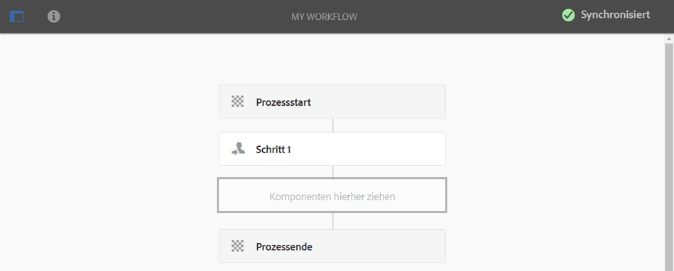

>[!NOTE]
>
>Wenn Sie Modelle programmgesteuert (mithilfe eines CRX-Pakets) erstellen, können Sie auch einen Unterordner erstellen:
>
>`/var/workflow/models`
>
>Beispiel: `/var/workflow/models/prototypes`
>
>Dieser Ordner kann anschließend zum [Verwalten des Zugriffs auf die Modelle in diesem Ordner](/help/sites-administering/workflows-managing.md#create-a-subfolder-in-var-workflow-models-and-apply-the-acl-to-that) verwendet werden.

## Bearbeiten von Workflows {#editing-a-workflow}

Sie können jedes vorhandene Workflow-Modell zu folgenden Zwecken bearbeiten:

* [zum Definieren von Schritten](#adding-a-step-to-a-model) und ihren [Parametern](#configuring-a-workflow-step)

* zum Konfigurieren von Workflow-Eigenschaften, einschließlich [Phasen](#configuring-workflow-stages-that-show-workflow-progress), [egal ob es sich um einen Übergangs-Workflow handelt](#creating-a-transient-workflow) und/oder [der Workflow mehrere Ressourcen verwendet](#configuring-a-workflow-for-multi-resource-support)

Bearbeiten von [**Standard oder veraltet** (vordefinierter) Workflow](#editing-a-default-or-legacy-workflow-for-the-first-time) einen zusätzlichen Schritt umfasst, um sicherzustellen, dass ein [sichere Kopie](/help/sites-developing/workflows-best-practices.md#locations-workflow-models) vor der Durchführung Ihrer Änderungen durchgeführt werden.

Wenn Sie mit den Änderungen an Ihrem Workflow fertig sind, müssen Sie zum **[!UICONTROL Generieren eines Laufzeitmodells]** auf **[!UICONTROL Sync]** klicken. Weitere Informationen finden Sie unter [Synchronisieren von Workflows](#sync-your-workflow-generate-a-runtime-model).

### Synchronisieren von Workflows – Generieren von Laufzeitmodellen {#sync-your-workflow-generate-a-runtime-model}

Wenn Sie rechts in der Editor-Symbolleiste auf **Sync** klicken, wird ein [Laufzeitmodell](/help/sites-developing/workflows.md#runtime-model) generiert. Das Laufzeitmodell ist das Modell, das tatsächlich verwendet wird, wenn ein Benutzer einen Workflow startet. Wenn Sie Ihre Änderungen nicht durch Klicken auf **[!UICONTROL Sync]** synchronisieren, stehen diese nicht zur Laufzeit zur Verfügung.

Wenn Sie (oder andere Benutzer) Änderungen am Workflow vornehmen, müssen Sie auf **[!UICONTROL Sync]** klicken, um ein Laufzeitmodell zu erstellen, auch wenn einzelne Dialogfelder (z. B. für Schritte) eigene Optionen zum Speichern aufweisen.

Nachdem die Änderungen mit dem (gespeicherten) Laufzeitmodell synchronisiert wurden, wird stattdessen **[!UICONTROL Synchronisiert]** angezeigt.

Bei einigen Schritten gibt es Pflichtfelder und/oder eine integrierte Validierung. Wenn die entsprechenden Bedingungen nicht erfüllt sind, wird eine Fehlermeldung angezeigt, falls Sie versuchen, das Modell mithilfe der Option **[!UICONTROL Sync]** zu synchronisieren. Etwa wenn für einen **[!UICONTROL Teilnehmer]**-Schritt kein Teilnehmer definiert wurde:

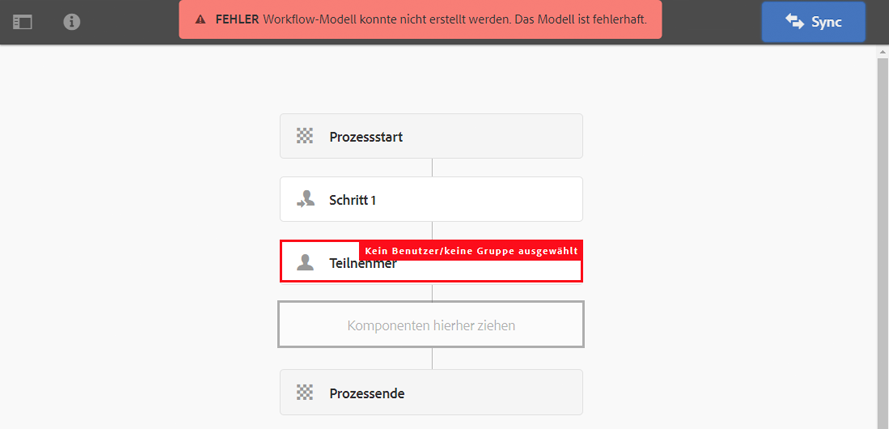

### Erstmaliges Bearbeiten von Standard- oder Legacy-Workflows {#editing-a-default-or-legacy-workflow-for-the-first-time}

Wenn Sie ein [Standard- bzw. Legacy-Modell](/help/sites-developing/workflows.md#workflow-types) zur Bearbeitung öffnen, finden Sie die folgenden Bedingungen vor:

* Die **[!UICONTROL Schritte]** -Browser nicht verfügbar (linke Seite).
* Die Symbolleiste weist eine Option zum **[!UICONTROL Bearbeiten]** auf (auf der rechten Seite).
* Zunächst werden das Modell und seine Eigenschaften im schreibgeschützten Modus wie folgt dargestellt:

   * Standard-Workflows befinden sich unter `/libs`
   * Ältere Workflows befinden sich unter `/etc`

Durch Auswahl von **[!UICONTROL Bearbeiten]** geschieht Folgendes:

* eine Kopie des Workflows in `/conf`
* erstellen **[!UICONTROL Schritte]** Browser verfügbar
* Sie erhalten die Möglichkeit, Änderungen vorzunehmen.

>[!NOTE]
>
>Unter [Speicherorte von Workflow-Modellen](/help/sites-developing/workflows-best-practices.md#locations-workflow-models) finden Sie weitere Informationen.

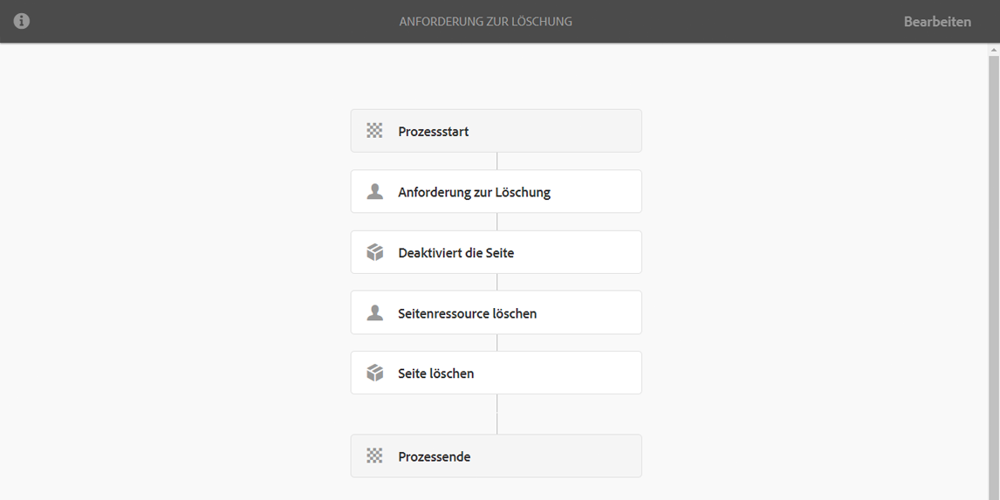

### Hinzufügen von Schritten zu Modellen {#adding-a-step-to-a-model}

Sie müssen zu Ihrem Modell Schritte hinzufügen, um die auszuführende Aktivität darzustellen. Mit jedem Schritt wird eine bestimmte Aktivität ausgeführt. In einer Standard-AEM-Instanz stehen unterschiedliche Schrittkomponenten zur Auswahl.

Wenn Sie ein Modell bearbeiten, werden die verfügbaren Schritte in den verschiedenen Gruppen der **[!UICONTROL Schritte]** Browser. Beispiel:

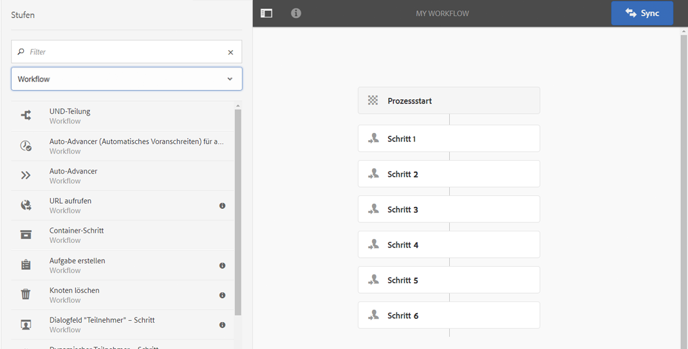

>[!NOTE]
>
>Weitere Informationen zu den primären Schrittkomponenten, die mit AEM installiert werden, finden Sie in der [Referenz für Workflow-Schritte](/help/sites-developing/workflows-step-ref.md).

**So fügen Sie einem Modell einen Schritt hinzu**:

1. Öffnen Sie ein vorhandenes Workflow-Modell zur Bearbeitung. Wählen Sie in der **[!UICONTROL Workflow-Modelle-Konsole]** das gewünschte Modell aus und klicken Sie anschließend auf **[!UICONTROL Bearbeiten]**.
1. Öffnen Sie die **[!UICONTROL Schritte]** Browser; using **[!UICONTROL Seitliches Bedienfeld ein/aus]**, ganz links in der oberen Symbolleiste. Folgende Informationen/Optionen sind verfügbar:

   * Die Option **[!UICONTROL Filter]** zum Filtern nach bestimmten Schritten.
   * Verwenden Sie das Dropdown-Menü, um die Auswahl auf eine bestimmte Gruppe von Schritten zu begrenzen.
   * Wählen Sie das Symbol Beschreibung anzeigen aus  um weitere Details zum entsprechenden Schritt anzuzeigen.

   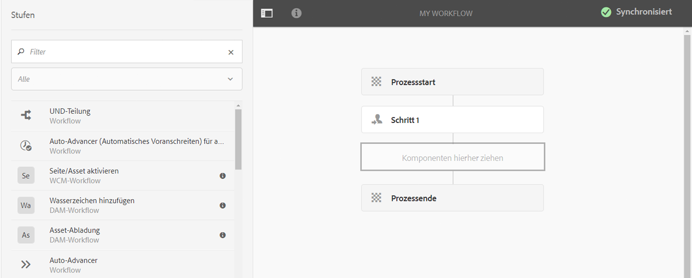

1. Ziehen Sie die entsprechenden Schritte an die gewünschte Stelle im Modell,

   beispielsweise einen **[!UICONTROL Teilnehmer-Schritt]**.

   Nachdem es zum Fluss hinzugefügt wurde, können Sie [Schritt konfigurieren](#configuring-a-workflow-step).

   

1. Fügen Sie nach Bedarf Schritte hinzu oder nehmen Sie andere Änderungen vor.

   Zur Laufzeit werden die Schritte in der Reihenfolge ausgeführt, in der sie im Modell erscheinen. Nachdem Sie Schrittkomponenten hinzugefügt haben, können Sie diese an eine andere Stelle im Modell ziehen.

   Sie können vorhandene Schritte wie beim [Seiten-Editor](/help/sites-authoring/editing-content.md) darüber hinaus kopieren, ausschneiden, einfügen, gruppieren oder löschen.

   Aufspaltungsschritte können auch mithilfe der Symbolleistenoption reduziert/erweitert werden: 

1. Bestätigen Sie Ihre Änderungen, indem Sie in der Editor-Symbolleiste auf **[!UICONTROL Sync]** klicken, um das Laufzeitmodell zu generieren.

   Weitere Informationen finden Sie unter [Synchronisieren von Workflows](#sync-your-workflow-generate-a-runtime-model).

### Konfigurieren von Workflow-Schritten {#configuring-a-workflow-step}

Sie können **Konfigurieren** und passen Sie das Verhalten eines Workflow-Schritts mithilfe des **[!UICONTROL Schritt-Eigenschaften]** Dialogfelder.

1. So öffnen Sie die **[!UICONTROL Schritt-Eigenschaften]** Dialogfeld für einen Schritt:

   * Tippen Sie auf den Schritt im Workflow-Modell und wählen Sie **[!UICONTROL Konfigurieren]** aus der Komponenten-Symbolleiste.
   * Doppelklicken Sie auf den Schritt.

   >[!NOTE]
   >
   >Weitere Informationen zu den primären Schrittkomponenten, die mit AEM installiert werden, finden Sie in der [Referenz für Workflow-Schritte](/help/sites-developing/workflows-step-ref.md).

1. Konfigurieren Sie die **[!UICONTROL Schritt-Eigenschaften]** nach Bedarf. Die jeweils verfügbaren Eigenschaften hängen vom Schritttyp ab, ggf. stehen auch mehrere Registerkarten zur Verfügung. Beispielsweise wird die Standardeinstellung **[!UICONTROL Teilnehmer-Schritt]**, in einem neuen Workflow als `Step 1`:

   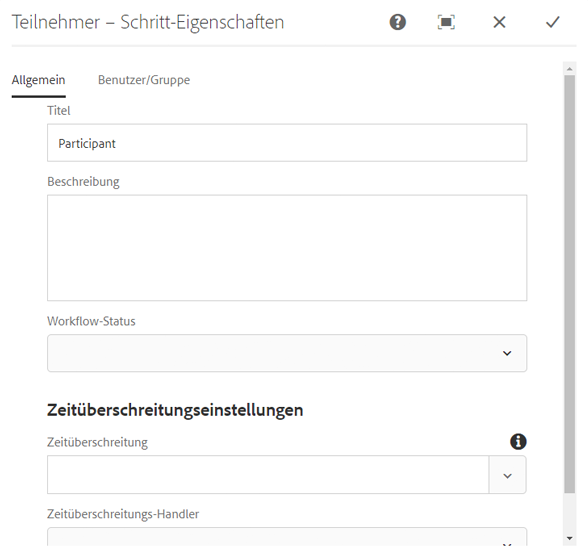

1. Bestätigen Sie Ihre Änderungen durch Klicken auf das Häkchen-Symbol.
1. Bestätigen Sie Ihre Änderungen, indem Sie in der Editor-Symbolleiste auf **[!UICONTROL Sync]** klicken, um das Laufzeitmodell zu generieren.

   Weitere Informationen finden Sie unter [Synchronisieren von Workflows](#sync-your-workflow-generate-a-runtime-model).

### Erstellen von Übergangs-Workflows {#creating-a-transient-workflow}

Sie können ein [Übergangs-](/help/sites-developing/workflows.md#transient-workflows)Workflow-Modell erstellen, wenn Sie ein neues Modell erstellen oder ein vorhandenes Modell bearbeiten:

1. Öffnen Sie das Workflow-Modell zur [Bearbeitung](#editing-a-workflow).
1. Wählen Sie in der Symbolleiste die Option **[!UICONTROL Eigenschaften für Workflow-Modell]** aus.
1. Aktivieren Sie im Dialogfeld **[!UICONTROL Übergangs-Workflow]** (bzw. bei Bedarf deaktivieren):

   

1. Bestätigen Sie die Änderung mit **[!UICONTROL Speichern und schließen]** und klicken Sie anschließend in der Editor-Symbolleiste auf **[!UICONTROL Sync]**, um das Laufzeitmodell zu generieren.

   Weitere Informationen finden Sie unter [Synchronisieren von Workflows](#sync-your-workflow-generate-a-runtime-model).

>[!NOTE]
>
>Beim Ausführen eines Workflows im [Übergangsmodus](/help/sites-developing/workflows.md#transient-workflows) speichert AEM keinen Workflow-Verlauf. Aus diesem Grund werden in der [Timeline](/help/sites-authoring/basic-handling.md#timeline) keine Informationen zu diesem Workflow angezeigt. [](/help/sites-authoring/basic-handling.md#timeline)

### Workflow-Modelle in der Touch-Benutzeroberfläche verfügbar machen {#make-workflow-models-available-in-touchui}

Wenn ein Workflow-Modell in der klassischen Benutzeroberfläche vorhanden ist, aber im Popupmenü für die Auswahl im **[!UICONTROL Timeline]** Leiste der Touch-optimierten Benutzeroberfläche an und befolgen Sie dann die Konfiguration, um sie verfügbar zu machen. Die folgenden Schritte zeigen die Verwendung des Workflow-Modells namens **[!UICONTROL Aktivierungsanfrage]**.

1. Vergewissern Sie sich, dass das Modell nicht in der Touch-Benutzeroberfläche verfügbar ist. Zugreifen auf ein Asset mit `/assets.html/content/dam` Pfad. Auswählen eines Assets. Öffnen Sie **[!UICONTROL Timeline]** in der linken Leiste. Klicken **[!UICONTROL Workflow starten]** und bestätigen Sie, dass **[!UICONTROL Aktivierungsanfrage]** -Modell ist nicht in der Popup-Liste vorhanden.

1. Navigieren durch **[!UICONTROL Tools > Allgemein > Tagging]**. Wählen Sie **[!UICONTROL Workflow]**.

1. Auswählen **[!UICONTROL Erstellen > Tag erstellen]**. Satz **[!UICONTROL Titel]** as `DAM` und **[!UICONTROL Name]** as `dam`. Klicken Sie auf **[!UICONTROL Übermitteln]**.
   

1. Gehen Sie zu **[!UICONTROL Tools > Workflow > Modelle]**. Auswählen **[!UICONTROL Aktivierungsanfrage]**, wählen Sie **[!UICONTROL Bearbeiten]**.

1. Auswählen **[!UICONTROL Bearbeiten]** , dann öffnen **[!UICONTROL Workflow-Modelleigenschaften]**. Navigieren Sie zu **[!UICONTROL Allgemein]** Registerkarte.

1. Hinzufügen `Workflow : DAM` nach **[!UICONTROL Tags]** -Feld. Bestätigen Sie die Auswahl mit dem Häkchen.

1. Bestätigen Sie das Hinzufügen des Tags mit **[!UICONTROL Speichern und schließen]**.
   

1. Schließen Sie den Prozess mit **[!UICONTROL Synchronisieren]**. Der Workflow ist jetzt in der Touch-optimierten Benutzeroberfläche verfügbar.

### Konfigurieren von Workflows für die Unterstützung für mehrere Ressourcen {#configuring-a-workflow-for-multi-resource-support}

Sie konfigurieren ein Workflow-Modell für die [Unterstützung für mehrere Ressourcen](/help/sites-developing/workflows.md#multi-resource-support), wenn Sie ein neues Modell erstellen oder ein vorhandenes Modell bearbeiten:

1. Öffnen Sie das Workflow-Modell zur [Bearbeitung](#editing-a-workflow).
1. Wählen Sie in der Symbolleiste die Option **[!UICONTROL Eigenschaften für Workflow-Modell]** aus.

1. Aktivieren Sie im Dialogfeld **[!UICONTROL Unterstützung mehrerer Ressourcen]** (bzw. bei Bedarf deaktivieren):

   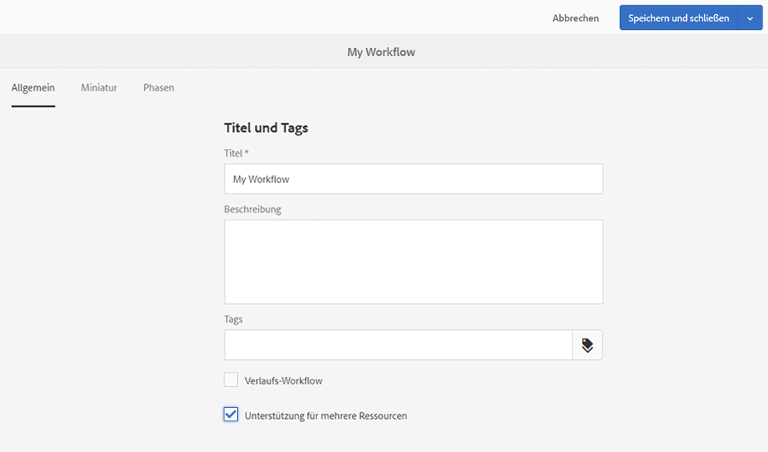

1. Bestätigen Sie die Änderung mit **[!UICONTROL Speichern und schließen]** und klicken Sie anschließend in der Editor-Symbolleiste auf **[!UICONTROL Sync]**, um das Laufzeitmodell zu generieren.

   Weitere Informationen finden Sie unter [Synchronisieren von Workflows](#sync-your-workflow-generate-a-runtime-model).

### Konfigurieren von Workflow-Phasen (die den Workflow-Fortschritt anzeigen) {#configuring-workflow-stages-that-show-workflow-progress}

Die [Workflow-Phasen](/help/sites-developing/workflows.md#workflow-stages) helfen Ihnen bei der Visualisierung des Fortschritts bei der Verarbeitung von Aufgaben.

>[!CAUTION]
>
>Wenn Workflow-Phasen in **[!UICONTROL Seiteneigenschaften]** definiert sind, aber für keinen der Workflow-Schritte verwendet werden, zeigt der Fortschrittsbalken keinen Fortschritt an (unabhängig vom aktuellen Workflow-Schritt).

Die jeweils verfügbaren Phasen werden in den Workflow-Modellen definiert. Die vorhandenen Workflow-Modelle können aktualisiert werden, um die Phasendefinitionen einzubinden. Sie können eine beliebige Anzahl von Phasen für das Workflow-Modell definieren.

Gehen Sie folgendermaßen vor, um **[!UICONTROL Phasen]** zu definieren:

1. Öffnen Sie das Workflow-Modell zur Bearbeitung.
1. Wählen Sie in der Symbolleiste die Option **[!UICONTROL Eigenschaften für Workflow-Modell]** aus. Wechseln Sie dann zur Registerkarte **[!UICONTROL Phasen]**.
1. Fügen Sie Ihre gewünschten **[!UICONTROL Phasen]** hinzu (und positionieren Sie sie). Sie können eine beliebige Anzahl von Phasen für das Workflow-Modell definieren.

   Beispiel:

   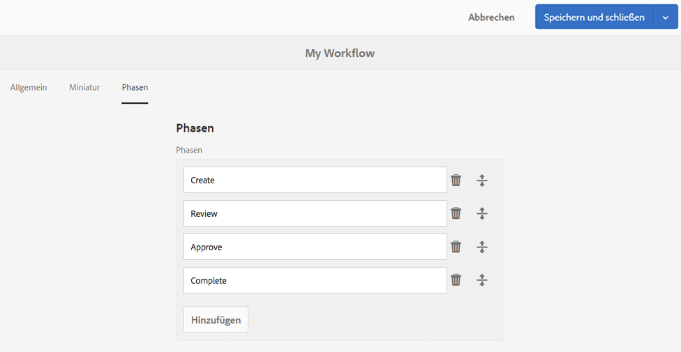

1. Klicken Sie zum Speichern der Eigenschaften auf **[!UICONTROL Speichern und schließen.]**
1. Ordnen Sie jedem der Schritte im Workflow-Modell eine Phase zu. Beispiel:

   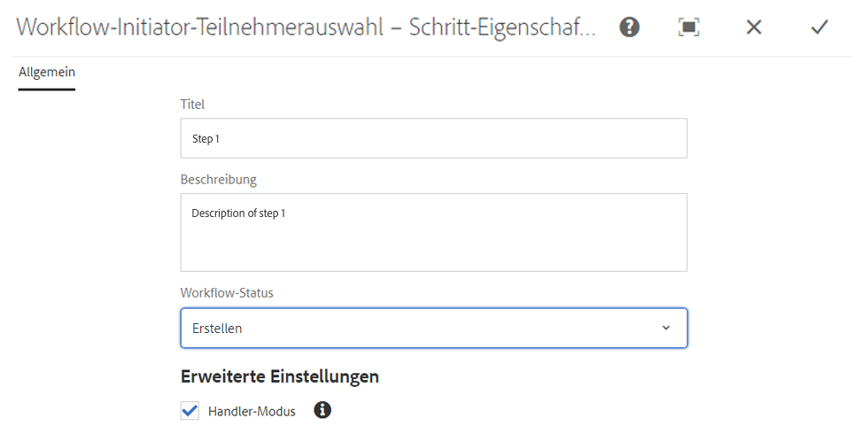

   Eine Phase kann mehreren Schritten zugeordnet werden. Beispiel:

   | **Schritt** | **Staging** |
   |---|---|
   | Schritt 1 | Erstellen |
   | Schritt 2 | Erstellen |
   | Schritt 3 | Überprüfung |
   | Schritt 4 | Genehmigen |
   | Schritt 5 | Genehmigen |
   | Schritt 6 | Fertig stellen |

1. Bestätigen Sie Ihre Änderungen, indem Sie in der Editor-Symbolleiste auf **[!UICONTROL Sync]** klicken, um das Laufzeitmodell zu generieren.

   Weitere Informationen finden Sie unter [Synchronisieren von Workflows](#sync-your-workflow-generate-a-runtime-model).

## Exportieren von Workflow-Modellen in Pakete {#exporting-a-workflow-model-in-a-package}

1. Erstellen Sie mit [Package Manager](/help/sites-administering/package-manager.md#package-manager) ein neues Paket:

   1. Navigieren Sie zum Package Manager über **[!UICONTROL Instrumente]**, **[!UICONTROL Implementierung]**, **[!UICONTROL Pakete]**.
   1. Klicken Sie auf **[!UICONTROL Paket erstellen]**.
   1. Geben Sie den **[!UICONTROL Paketnamen]** sowie alle weiteren erforderlichen Informationen an.
   1. Klicken Sie auf **[!UICONTROL OK]**.

1. Klicken Sie in der Symbolleiste Ihres neuen Pakets auf **[!UICONTROL Bearbeiten]**.

1. Öffnen Sie die Registerkarte **[!UICONTROL Filter]**.

1. Wählen Sie **[!UICONTROL Filter hinzufügen]** und geben Sie den Pfad zum *Design* Ihres Workflow-Modells ein:

   `/conf/global/settings/workflow/models/<*your-model-name*>`

   Klicken Sie auf **[!UICONTROL Fertig]**.

1. Wählen Sie **[!UICONTROL Filter hinzufügen]** und geben Sie den Pfad zu Ihrem *Laufzeit*-Workflow-Modell ein:

   `/var/workflow/models/<*your-model-name*>`

   Klicken Sie auf **[!UICONTROL Fertig]**.

1. Fügen Sie weitere Filter für alle benutzerdefinierten Skripte hinzu, die von Ihrem Modell verwendet werden.
1. Klicken Sie auf **[!UICONTROL Speichern]**, um Ihre Filterdefinitionen zu bestätigen.
1. Wählen Sie in der Symbolleiste Ihrer Paketdefinition die Option **[!UICONTROL Build]** aus.
1. Wählen Sie in der Symbolleiste Ihres Pakets die Option **[!UICONTROL Herunterladen]** aus.

## Verwenden von Workflows zum Verarbeiten von Formularübermittlungen {#using-workflows-to-process-form-submissions}

Sie können ein Formular so konfigurieren, dass es durch den ausgewählten Workflow verarbeitet wird. Wenn Benutzer das Formular übermitteln, wird eine neue Workflow-Instanz mit den Daten der Formularübermittlung als Nutzlast erstellt.

Gehen Sie folgendermaßen vor, um den Workflow zur Verwendung mit Ihrem Formular zu konfigurieren:

1. Erstellen Sie eine neue Seite und öffnen Sie sie zur Bearbeitung.
1. Fügen Sie der Seite die Komponente **[!UICONTROL Formular]** hinzu.
1. Konfigurieren Sie die Komponente **[!UICONTROL Formular-Start]**, die auf der Seite angezeigt wird.
1. Verwendung **[!UICONTROL Workflow starten]** um den gewünschten Workflow aus den verfügbaren auszuwählen:

   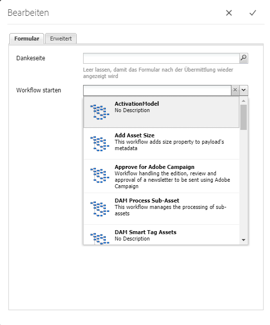

1. Bestätigen Sie die neue Formularkonfiguration durch Klicken auf das Häkchen-Symbol.

## Testen von Workflows {#testing-workflows}

Beim Testen eines Workflows ist es sinnvoll, verschiedene Nutzlasttypen zu verwenden, auch solche, die sich von denen unterscheiden, für die der Workflow entwickelt wurde. Wenn Sie beispielsweise möchten, dass Ihr Workflow für die Verwendung mit Assets ausgelegt ist, testen Sie ihn, indem Sie eine Seite als Nutzlast festlegen und sicherstellen, dass keine Fehler auftreten.

Testen Sie Ihren neuen Workflow beispielsweise wie folgt:

1. [Workflow-Modell starten](/help/sites-administering/workflows-starting.md) über die Konsole aus.
1. Definieren Sie die **[!UICONTROL Nutzlast]** und bestätigen Ihre Eingaben.

1. Ergreifen Sie die erforderlichen Maßnahmen, damit der Workflow fortgesetzt wird.
1. Überwachen Sie während der Ausführung des Workflows die Protokolldateien.

Sie können AEM auch so konfigurieren, dass die **[!UICONTROL DEBUG]**-Meldungen in den Protokolldateien angezeigt werden. Siehe [Protokollierung](/help/sites-deploying/configure-logging.md) Weitere Informationen erhalten Sie, und wenn die Entwicklung abgeschlossen ist, legen Sie die **[!UICONTROL Protokollebene]** zurück zu **[!UICONTROL Info]**.

## Beispiele {#examples}

### Beispiel: Erstellen eines (einfachen) Workflows zum Annehmen oder Ablehnen einer Anfrage zur Veröffentlichung {#example-creating-a-simple-workflow-to-accept-or-reject-a-request-for-publication}

Um einige der Möglichkeiten zur Erstellung eines Workflows zu veranschaulichen, wird im folgenden Beispiel eine Variante des Workflows `Publish Example` erstellt.

1. [Erstellen Sie ein neues Workflow-Modell](#creating-a-new-workflow).

   Der neue Workflow umfasst Folgendes:

   * **[!UICONTROL Prozessstart]**
   * `Step 1`
   * **[!UICONTROL Prozessende]**

1. Löschen `Step 1` (da es für dieses Beispiel der falsche Schritttyp ist):

   * Klicken Sie auf den Schritt und wählen Sie **[!UICONTROL Löschen]** aus der Komponenten-Symbolleiste. Bestätigen Sie die Aktion.

1. Aus dem **[!UICONTROL Workflow]** Auswahl des Schrittbrowsers, Ziehen Sie eine **[!UICONTROL Teilnehmer-Schritt]** auf den Workflow zu platzieren und zwischen **[!UICONTROL Flussstart]** und **[!UICONTROL Flussende*]*.
1. So öffnen Sie das Dialogfeld &quot;Eigenschaften&quot;:

   * Klicken Sie auf den Teilnehmerschritt und wählen Sie **[!UICONTROL Konfigurieren]** aus der Komponenten-Symbolleiste.
   * Doppelklicken Sie auf den Teilnehmer-Schritt.

1. Im **[!UICONTROL Häufig]** tab enter `Validate Content` für beide **[!UICONTROL Titel]** und **[!UICONTROL Beschreibung]**.
1. Öffnen Sie die Registerkarte **[!UICONTROL Benutzer/Gruppe]**:

   * Aktivieren Sie das Kontrollkästchen **[!UICONTROL Benachrichtigen Sie den Benutzer per E-Mail]**.
   * Auswählen `Administrator` ( `admin`) für die **[!UICONTROL Benutzer/Gruppe]** -Feld.

   >[!NOTE]
   >
   >Damit E-Mails versendet werden können, müssen [der E-Mail-Dienst und die Benutzerkontoinformationen konfiguriert werden](/help/sites-administering/notification.md).

1. Bestätigen Sie Ihre Änderungen durch Klicken auf das Häkchen-Symbol.

   Sie werden zur Übersicht des Workflow-Modells zurückgeleitet. Hier wurde der Teilnehmerschritt in `Validate Content`.

1. Ziehen Sie eine **[!UICONTROL Oder Aufspaltung]** auf den Workflow zu platzieren und zwischen `Validate Content` und **[!UICONTROL Flussende]**.
1. Öffnen Sie die **[!UICONTROL ODER-Teilung]** zur Konfiguration.
1. Konfigurieren:

   * **[!UICONTROL Häufig]**: select **[!UICONTROL 2 Verzweigungen]**
   * **[!UICONTROL Zweig 1]**: Wählen Sie **[!UICONTROL Standardroute]** aus.
   * **[!UICONTROL Zweig 2]**: Stellen Sie sicher, dass **[!UICONTROL Standardroute]** nicht ausgewählt ist.

1. Bestätigen Sie Ihre Änderungen an der **[!UICONTROL ODER-Teilung]**.
1. Ziehen Sie einen **[!UICONTROL Teilnehmer-Schritt]** auf den linken Zweig, öffnen Sie die Eigenschaften, geben Sie die folgenden Werte an und bestätigen Sie die Änderungen:

   * **[!UICONTROL Titel]**: `Reject Publish Request`
   * **[!UICONTROL Benutzer/Gruppe]**: z. B. `projects-administrators`
   * **[!UICONTROL Benutzer per E-Mail benachrichtigen]**: Aktivieren Sie diese Option, damit der Benutzer per E-Mail benachrichtigt wird.

1. Ziehen Sie einen **[!UICONTROL Prozessschritt]** auf den rechten Zweig, öffnen Sie die Eigenschaften, geben Sie die folgenden Werte an und bestätigen Sie die Änderungen:

   * **[!UICONTROL Titel]**: `Publish Page as Requested`
   * **[!UICONTROL Prozess]**: select `Activate Page`. Mit diesem Prozess wird die ausgewählte Seite in den Publisher-Instanzen veröffentlicht.

1. Klicken Sie in der Editor-Symbolleiste auf **[!UICONTROL Sync]**, um das Laufzeitmodell zu generieren.

   Weitere Informationen finden Sie unter [Synchronisieren von Workflows](#sync-your-workflow-generate-a-runtime-model).

   Ihr neues Workflow-Modell sieht dann wie folgt aus:

   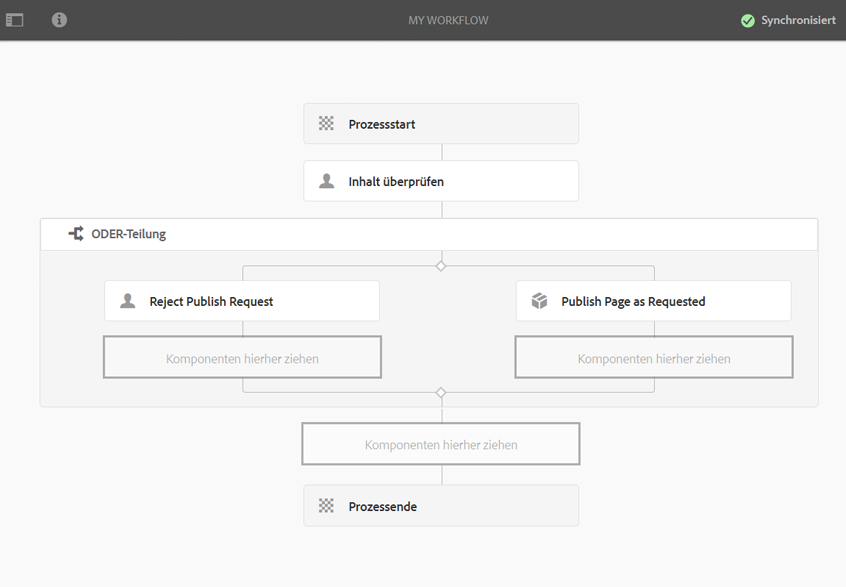

1. Wenden Sie diesen Workflow auf Ihre Seite an, sodass Benutzer, die zur Phase **[!UICONTROL Fertig stellen]** übergehen, den Schritt **[!UICONTROL Inhalt überprüfen]** auswählen können, egal ob sie die **[!UICONTROL Seite wie angefordert veröffentlichen]** oder die **[!UICONTROL Anfrage zur Veröffentlichung ablehnen]** möchten.

   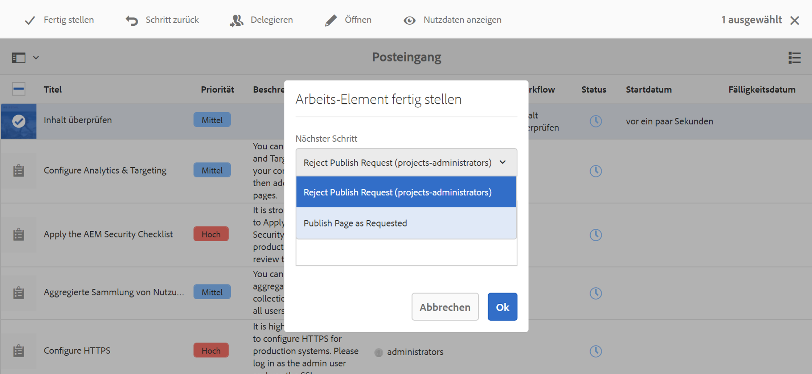

### Beispiel: Definieren einer Regel oder ODER-Teilung {#example-defining-a-rule-for-an-or-split}

**[!UICONTROL ODER-Teilung]**-Schritte ermöglichen es Ihnen, bedingte Verarbeitungspfade in Ihren Workflow einzubinden.

So definieren Sie eine ODER-Regel:

1. Erstellen Sie zwei Skripte und speichern Sie diese im Repository, beispielsweise unter:

   `/apps/myapp/workflow/scripts`

   >[!NOTE]
   >
   >Die Skripte müssen über eine [function `check()`](#function-check) , der einen booleschen Wert zurückgibt.

1. Bearbeiten Sie den Workflow und fügen Sie die **[!UICONTROL ODER-Teilung]** zum Modell hinzu.
1. Bearbeiten Sie die Eigenschaften von **[!UICONTROL Zweig 1]** der **[!UICONTROL ODER-Teilung]**:

   * Definieren Sie dies als **[!UICONTROL Standardroute]** durch Festlegen der **[!UICONTROL Wert]** nach `true`.
   * As **[!UICONTROL Regel]**, legen Sie den Pfad zum Skript fest. Beispiel:

      `/apps/myapp/workflow/scripts/myscript1.ecma`
   >[!NOTE]
   >
   >Sie können die Reihenfolge der Verzweigungen bei Bedarf ändern.

1. Bearbeiten Sie die Eigenschaften von **[!UICONTROL Zweig 2]** der **[!UICONTROL ODER-Teilung]**:

   * As **[!UICONTROL Regel]**, legen Sie den Pfad auf das andere Skript fest. Beispiel:

      `/apps/myapp/workflow/scripts/myscript2.ecma`

1. Legen Sie die Eigenschaften der einzelnen Schritte in jedem Zweig fest. Stellen Sie sicher, dass **[!UICONTROL Benutzer/Gruppe]** festgelegt ist.
1. Klicken Sie in der Editor-Symbolleiste auf **Sync**, um Ihre Änderungen am Laufzeitmodell beizubehalten.

   Weitere Informationen finden Sie unter [Synchronisieren von Workflows](#sync-your-workflow-generate-a-runtime-model).

#### Funktion „Check()“ {#function-check}

>[!NOTE]
>
>Weitere Informationen finden Sie unter [Verwenden von ECMAScript](/help/sites-developing/workflows-customizing-extending.md#using-ecmascript).

Das folgende Beispielskript gibt Folgendes zurück `true` wenn der Knoten eine `JCR_PATH` befindet sich unter `/content/we-retail/us/en`:

```
function check() {
    if (workflowData.getPayloadType() == "JCR_PATH") {
      var path = workflowData.getPayload().toString();
      var node = jcrSession.getItem(path);

      if (node.getPath().indexOf("/content/we-retail/us/en") >= 0) {
       return true;
      } else {
       return false;
      } 
     } else {
      return false;
     }
}
```

### Beispiel: Benutzerdefinierte Aktivierungsanfrage {#example-customized-request-for-activation}

Sie können jeden der vorkonfigurierten Workflows anpassen. Um das Verhalten anzupassen, überlagern Sie Details des entsprechenden Workflows.

Beispielsweise der Workflow **[!UICONTROL Aktivierungsanfrage]**. Dieser wird für die Veröffentlichung von Seiten innerhalb von **[!UICONTROL Sites]** verwendet und automatisch ausgelöst, wenn ein Inhaltsautor nicht über die entsprechenden Replikationsrechte verfügt. Siehe [Anpassen der Seitenbearbeitung - Anpassen des Aktivierungsanfrage-Workflows](/help/sites-developing/customizing-page-authoring-touch.md#customizing-the-request-for-activation-workflow) für weitere Informationen.
