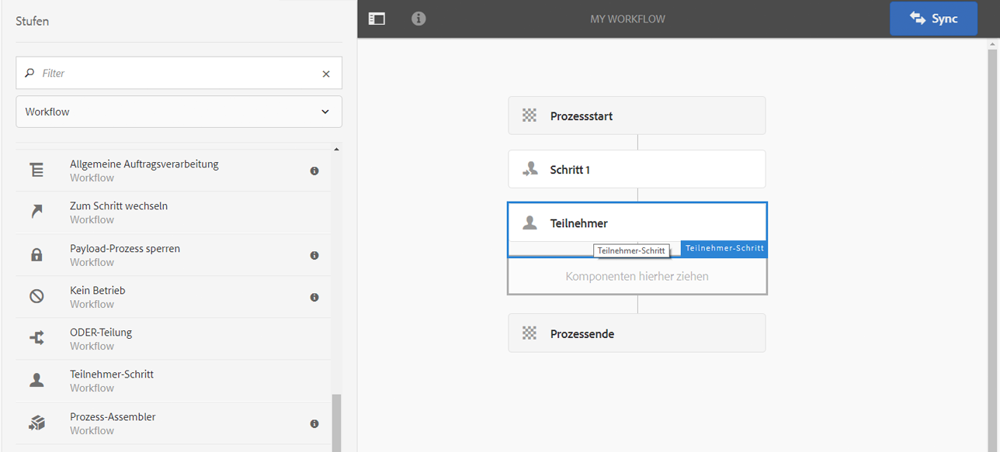

# Erstellen von Workflow-Modellen{#creating-workflow-models}

>[!CAUTION]
>
>Informationen zur Verwendung der klassischen Benutzeroberfläche finden Sie in der [Dokumentation zu AEM 6.3](https://helpx.adobe.com/experience-manager/6-3/sites-developing/workflows-models.html).

Sie erstellen ein [Workflow-Modell](/help/sites-developing/workflows.md#model), um die Schritte zu definieren, die ausgeführt werden, wenn ein Benutzer den Workflow startet. Sie können auch Modelleigenschaften definieren, um beispielsweise festzulegen, ob es sich um einen Übergangs-Workflow handelt oder der Workflow mehrere Ressourcen verwendet.

Wenn ein Benutzer einen Workflow startet, wird eine Instanz gestartet. Dabei handelt es sich um das entsprechende Laufzeitmodell, das erstellt wird, wenn Sie Ihre Änderungen durch Klicken auf [Sync](#sync-your-workflow-generate-a-runtime-model) synchronisieren.

## Erstellen neuer Workflows {#creating-a-new-workflow}

Wenn Sie zum ersten Mal ein neues Workflow-Modell erstellen, umfasst es Folgendes:

* The steps, **[!UICONTROL Flow Start]** and **[!UICONTROL Flow End]**.

   Diese stellen den Anfang und das Ende des Workflows dar. Diese Schritte sind obligatorisch und können nicht bearbeitet oder entfernt werden.

* An example **Participant** step named **Step 1**.

   Dieser Schritt ist so konfiguriert, dass er dem Workflow-Initiator ein Arbeitselement zuordnet. Sie können diesen Schritt nach Bedarf bearbeiten oder löschen und Schritte hinzufügen.

Gehen Sie folgendermaßen vor, um einen neuen Workflow mit dem Editor zu erstellen:

1. Open the **[!UICONTROL Workflow Models]** console; by way of **[!UICONTROL Tools]**, **[!UICONTROL Workflow]**, **[!UICONTROL Models]** or, for example:

   [http://localhost:4502/aem/workflow](http://localhost:4502/aem/workflow)

1. Wählen Sie dann **[!UICONTROL Erstellen]** und dann **[!UICONTROL Modell erstellen]** aus.
1. The **[!UICONTROL Add Workflow Model]** dialog box appears. Geben Sie den **[!UICONTROL Titel]** und den **[!UICONTROL Namen]** (optional) ein. Wählen Sie anschließend **[!UICONTROL Fertig]** aus.
1. The new model is listed in the **[!UICONTROL Workflow Models]** console.
1. Wählen Sie Ihren neuen Workflow aus und öffnen Sie ihn dann, indem Sie auf [**[!UICONTROL Bearbeiten ]**klicken, um ihn zu konfigurieren](#editing-a-workflow):

   

>[!NOTE]
>
>Wenn Sie Modelle programmgesteuert (mithilfe eines CRX-Pakets) erstellen, können Sie auch einen Unterordner erstellen:
>
>`/var/workflow/models`
>
>Beispiel: `/var/workflow/models/prototypes`
>
>Dieser Ordner kann anschließend zum [Verwalten des Zugriffs auf die Modelle in diesem Ordner](/help/sites-administering/workflows-managing.md#create-a-subfolder-in-var-workflow-models-and-apply-the-acl-to-that) verwendet werden.

## Bearbeiten von Workflows {#editing-a-workflow}

Sie können jedes vorhandene Workflow-Modell zu folgenden Zwecken bearbeiten:

* [zum Definieren von Schritten](#adding-a-step-to-a-model) und ihren [Parametern](#configuring-a-workflow-step)

* zum Konfigurieren von Workflow-Eigenschaften, einschließlich [Phasen](#configuring-workflow-stages-that-show-workflow-progress), [egal ob es sich um einen Übergangs-Workflow handelt](#creating-a-transient-workflow) und/oder [der Workflow mehrere Ressourcen verwendet](#configuring-a-workflow-for-multi-resource-support)

Editing a [**Default or Legacy **(out-of-the-box) workflow](#editing-a-default-or-legacy-workflow-for-the-first-time)has an additional step, to ensure that a[safe copy](/help/sites-developing/workflows-best-practices.md#locations-workflow-models)is taken prior to your changes being made.

Wenn Sie mit den Änderungen an Ihrem Workflow fertig sind, müssen Sie zum **[!UICONTROL Generieren eines Laufzeitmodells]** auf **[!UICONTROL Sync]** klicken. Weitere Informationen finden Sie unter [Synchronisieren von Workflows](#sync-your-workflow-generate-a-runtime-model).

### Synchronisieren von Workflows – Generieren von Laufzeitmodellen {#sync-your-workflow-generate-a-runtime-model}

Wenn Sie rechts in der Editor-Symbolleiste auf **Sync** klicken, wird ein [Laufzeitmodell](/help/sites-developing/workflows.md#runtime-model) generiert. Das Laufzeitmodell ist das Modell, das tatsächlich verwendet wird, wenn ein Benutzer einen Workflow startet. Wenn Sie Ihre Änderungen nicht durch Klicken auf **[!UICONTROL Sync]** synchronisieren, stehen diese nicht zur Laufzeit zur Verfügung.

Wenn Sie (oder andere Benutzer) Änderungen am Workflow vornehmen, müssen Sie auf **[!UICONTROL Sync]** klicken, um ein Laufzeitmodell zu erstellen, auch wenn einzelne Dialogfelder (z. B. für Schritte) eigene Optionen zum Speichern aufweisen.

Nachdem die Änderungen mit dem (gespeicherten) Laufzeitmodell synchronisiert wurden, wird stattdessen **[!UICONTROL Synchronisiert]** angezeigt.

Bei einigen Schritten gibt es Pflichtfelder und/oder eine integrierte Validierung. Wenn die entsprechenden Bedingungen nicht erfüllt sind, wird eine Fehlermeldung angezeigt, falls Sie versuchen, das Modell mithilfe der Option **[!UICONTROL Sync]** zu synchronisieren. Etwa wenn für einen **[!UICONTROL Teilnehmer]**-Schritt kein Teilnehmer definiert wurde:


### Erstmaliges Bearbeiten von Standard- oder Legacy-Workflows {#editing-a-default-or-legacy-workflow-for-the-first-time}

Wenn Sie ein [Standard- bzw. Legacy-Modell](/help/sites-developing/workflows.md#workflow-types) zur Bearbeitung öffnen, finden Sie die folgenden Bedingungen vor:

* The **[!UICONTROL Steps]** browser is not available (left side).
* Die Symbolleiste weist eine Option zum **[!UICONTROL Bearbeiten]** auf (auf der rechten Seite).
* Zunächst werden das Modell und seine Eigenschaften im schreibgeschützten Modus wie folgt dargestellt:

   * Default workflows are located in `/libs`
   * Legacy workflows are located in `/etc`

Durch Auswahl von **[!UICONTROL Bearbeiten]** geschieht Folgendes:

* take a copy of the workflow into `/conf`
* make the **[!UICONTROL Steps]** browser available
* Sie erhalten die Möglichkeit, Änderungen vorzunehmen.

>[!NOTE]
>
>Unter [Speicherorte von Workflow-Modellen](/help/sites-developing/workflows-best-practices.md#locations-workflow-models) finden Sie weitere Informationen.


### Hinzufügen von Schritten zu Modellen {#adding-a-step-to-a-model}

Sie müssen zu Ihrem Modell Schritte hinzufügen, um die auszuführende Aktivität darzustellen. Mit jedem Schritt wird eine bestimmte Aktivität ausgeführt. In einer Standard-AEM-Instanz stehen unterschiedliche Schrittkomponenten zur Auswahl.

When you edit a model, the available steps appear in the various groups of the **[!UICONTROL Steps]** browser. Beispiel:


>[!NOTE]
>
>Weitere Informationen zu den primären Schrittkomponenten, die mit AEM installiert werden, finden Sie in der [Referenz für Workflow-Schritte](/help/sites-developing/workflows-step-ref.md).

**So fügen Sie einem Modell** einen Schritt hinzu:

1. Öffnen Sie ein vorhandenes Workflow-Modell zur Bearbeitung. Wählen Sie in der **[!UICONTROL Workflow-Modelle-Konsole]** das gewünschte Modell aus und klicken Sie anschließend auf **[!UICONTROL Bearbeiten]**.
1. Open the **[!UICONTROL Steps]** browser; using **[!UICONTROL Toggle Side Panel]**, at the far left of the top toolbar. Folgende Informationen/Optionen sind verfügbar:

   * Die Option **[!UICONTROL Filter]** zum Filtern nach bestimmten Schritten.
   * Verwenden Sie das Dropdown-Menü, um die Auswahl auf eine bestimmte Gruppe von Schritten zu begrenzen.
   * Select the Show Description icon  to show more details about the appropriate step.
   

1. Ziehen Sie die entsprechenden Schritte an die gewünschte Stelle im Modell,

   beispielsweise einen **[!UICONTROL Teilnehmer-Schritt]**.

   After it is added to the flow you can [configure the step](#configuring-a-workflow-step).

   

1. Fügen Sie nach Bedarf Schritte hinzu oder nehmen Sie andere Änderungen vor.

   Zur Laufzeit werden die Schritte in der Reihenfolge ausgeführt, in der sie im Modell erscheinen. Nachdem Sie Schrittkomponenten hinzugefügt haben, können Sie diese an eine andere Stelle im Modell ziehen.

   Sie können vorhandene Schritte wie beim [Seiten-Editor](/help/sites-authoring/editing-content.md) darüber hinaus kopieren, ausschneiden, einfügen, gruppieren oder löschen.

   Split steps can also be collapsed/expanded using the toolbar option: 

1. Bestätigen Sie Ihre Änderungen, indem Sie in der Editor-Symbolleiste auf **[!UICONTROL Sync]** klicken, um das Laufzeitmodell zu generieren.

   Weitere Informationen finden Sie unter [Synchronisieren von Workflows](#sync-your-workflow-generate-a-runtime-model).

### Konfigurieren von Workflow-Schritten {#configuring-a-workflow-step}

You can **Configure** and customize the behavior of a workflow step using the **[!UICONTROL Step Properties]** dialog boxes.

1. To open the **[!UICONTROL Step Properties]** dialog box for a step either:

   * Tap the step in the workflow model and select **[!UICONTROL Configure]** from the component toolbar.
   * Doppelklicken Sie auf den Schritt.
   >[!NOTE]
   >
   >Weitere Informationen zu den primären Schrittkomponenten, die mit AEM installiert werden, finden Sie in der [Referenz für Workflow-Schritte](/help/sites-developing/workflows-step-ref.md).

1. Konfigurieren Sie die **[!UICONTROL Schritt-Eigenschaften]** nach Bedarf. Die jeweils verfügbaren Eigenschaften hängen vom Schritttyp ab, ggf. stehen auch mehrere Registerkarten zur Verfügung. For example, the default **[!UICONTROL Participant Step]**, present in a new workflow as `Step 1`:

   

1. Bestätigen Sie Ihre Änderungen durch Klicken auf das Häkchen-Symbol.
1. Bestätigen Sie Ihre Änderungen, indem Sie in der Editor-Symbolleiste auf **[!UICONTROL Sync]** klicken, um das Laufzeitmodell zu generieren.

   Weitere Informationen finden Sie unter [Synchronisieren von Workflows](#sync-your-workflow-generate-a-runtime-model).

### Erstellen von Übergangs-Workflows {#creating-a-transient-workflow}

Sie können ein [Übergangs-](/help/sites-developing/workflows.md#transient-workflows)Workflow-Modell erstellen, wenn Sie ein neues Modell erstellen oder ein vorhandenes Modell bearbeiten:

1. Öffnen Sie das Workflow-Modell zur [Bearbeitung](#editing-a-workflow).
1. Wählen Sie in der Symbolleiste die Option **[!UICONTROL Eigenschaften für Workflow-Modell]** aus.
1. In the dialog box, activate **[!UICONTROL Transient Workflow]** (or deactivate if required):

   

1. Bestätigen Sie die Änderung mit **[!UICONTROL Speichern und schließen]** und klicken Sie anschließend in der Editor-Symbolleiste auf **[!UICONTROL Sync]**, um das Laufzeitmodell zu generieren.

   Weitere Informationen finden Sie unter [Synchronisieren von Workflows](#sync-your-workflow-generate-a-runtime-model).

>[!NOTE]
>
>Beim Ausführen eines Workflows im [Übergangsmodus](/help/sites-developing/workflows.md#transient-workflows) speichert AEM keinen Workflow-Verlauf. Aus diesem Grund werden in der [Timeline](/help/sites-authoring/basic-handling.md#timeline) keine Informationen zu diesem Workflow angezeigt. [](/help/sites-authoring/basic-handling.md#timeline)

### Workflow-Modelle in der Touch-Benutzeroberfläche verfügbar machen {#make-workflow-models-available-in-touchui}

If a workflow model is present in Classic UI, but missing in the selection popup menu in the **[!UICONTROL Timeline]** rail of Touch UI, then follow the configuration to make it available. Die folgenden Schritte veranschaulichen die Verwendung des Workflow-Modells **[!UICONTROL Request for Activation]**.

1. Vergewissern Sie sich, dass das Modell nicht in der Touch-Benutzeroberfläche verfügbar ist. Access an asset using `/assets.html/content/dam` path. Auswählen eines Assets. Öffnen Sie **[!UICONTROL Timeline]** in der linken Leiste. Klicken Sie auf Arbeitsablauf **[!UICONTROL starten]** und vergewissern Sie sich, dass das **[!UICONTROL Aktivierungsmodell]** nicht in der Popup-Liste vorhanden ist.

1. Navigieren Sie zu **[!UICONTROL Tools > Allgemein > Tagging]**. Wählen Sie **[!UICONTROL Workflow]**.

1. Select **[!UICONTROL Create > Create Tag]**. Set **[!UICONTROL Title]** as `DAM` and **[!UICONTROL Name]** as `dam`. Klicken Sie auf **[!UICONTROL Übermitteln]**.
   

1. Navigate to **[!UICONTROL Tools > Workflow > Models]**. Wählen Sie **[!UICONTROL Aktivierungsanfrage]** und dann **[!UICONTROL Bearbeiten]**.

1. Wählen Sie **[!UICONTROL Bearbeiten]** und öffnen Sie dann die **[!UICONTROL Workflow-Modelleigenschaften]**. Go to the **[!UICONTROL Basic]** tab.

1. Zu `Workflow : DAM`Tags **** hinzufügen. Bestätigen Sie die Auswahl mit dem Häkchen.

1. Bestätigen Sie das Hinzufügen des Tags mit **[!UICONTROL Speichern und Schließen]**.
   

1. Schließen Sie den Prozess mit **[!UICONTROL Synchronisieren]** ab. Der Workflow ist jetzt in der Touch-fähigen Benutzeroberfläche verfügbar.

### Konfigurieren von Workflows für die Unterstützung für mehrere Ressourcen {#configuring-a-workflow-for-multi-resource-support}

Sie konfigurieren ein Workflow-Modell für die [Unterstützung für mehrere Ressourcen](/help/sites-developing/workflows.md#multi-resource-support), wenn Sie ein neues Modell erstellen oder ein vorhandenes Modell bearbeiten:

1. Öffnen Sie das Workflow-Modell zur [Bearbeitung](#editing-a-workflow).
1. Wählen Sie in der Symbolleiste die Option **[!UICONTROL Eigenschaften für Workflow-Modell]** aus.

1. In the dialog box, activate **[!UICONTROL Multi Resource Support]** (or deactivate if required):

   

1. Bestätigen Sie die Änderung mit **[!UICONTROL Speichern und schließen]** und klicken Sie anschließend in der Editor-Symbolleiste auf **[!UICONTROL Sync]**, um das Laufzeitmodell zu generieren.

   Weitere Informationen finden Sie unter [Synchronisieren von Workflows](#sync-your-workflow-generate-a-runtime-model).

### Konfigurieren von Workflow-Phasen (die den Workflow-Fortschritt anzeigen) {#configuring-workflow-stages-that-show-workflow-progress}

Die [Workflow-Phasen](/help/sites-developing/workflows.md#workflow-stages) helfen Ihnen bei der Visualisierung des Fortschritts bei der Verarbeitung von Aufgaben.

>[!CAUTION]
>
>Wenn Workflow-Phasen in **[!UICONTROL Seiteneigenschaften]** definiert sind, aber für keinen der Workflow-Schritte verwendet werden, zeigt der Fortschrittsbalken keinen Fortschritt an (unabhängig vom aktuellen Workflow-Schritt).

Die jeweils verfügbaren Phasen werden in den Workflow-Modellen definiert. Die vorhandenen Workflow-Modelle können aktualisiert werden, um die Phasendefinitionen einzubinden. Sie können eine beliebige Anzahl von Phasen für das Workflow-Modell definieren.

Gehen Sie folgendermaßen vor, um **[!UICONTROL Phasen]** zu definieren:

1. Öffnen Sie das Workflow-Modell zur Bearbeitung.
1. Wählen Sie in der Symbolleiste die Option **[!UICONTROL Eigenschaften für Workflow-Modell]** aus. Wechseln Sie dann zur Registerkarte **[!UICONTROL Phasen]**.
1. Fügen Sie Ihre gewünschten **[!UICONTROL Phasen]** hinzu (und positionieren Sie sie). Sie können eine beliebige Anzahl von Phasen für das Workflow-Modell definieren.

   Beispiel:

   

1. Klicken Sie zum Speichern der Eigenschaften auf **[!UICONTROL Speichern und schließen.]**
1. Ordnen Sie jedem der Schritte im Workflow-Modell eine Phase zu. Beispiel:

   

   Eine Phase kann mehreren Schritten zugeordnet werden. Beispiel:

   | **Schritt** | **Phase** |
   |---|---|
   | Schritt 1 | Erstellen |
   | Schritt 2 | Erstellen |
   | Schritt 3 | Überprüfen |
   | Schritt 4 | Genehmigen |
   | Schritt 5 | Genehmigen |
   | Schritt 6 | Fertig stellen |

1. Bestätigen Sie Ihre Änderungen, indem Sie in der Editor-Symbolleiste auf **[!UICONTROL Sync]** klicken, um das Laufzeitmodell zu generieren.

   Weitere Informationen finden Sie unter [Synchronisieren von Workflows](#sync-your-workflow-generate-a-runtime-model).

## Exportieren von Workflow-Modellen in Pakete {#exporting-a-workflow-model-in-a-package}

1. Erstellen Sie mit [Package Manager](/help/sites-administering/package-manager.md#package-manager) ein neues Paket:

   1. Navigate to the Package Manager by way of **[!UICONTROL Tools]**, **[!UICONTROL Deployment]**, **[!UICONTROL Packages]**.
   1. Klicken Sie auf **[!UICONTROL Paket erstellen]**.
   1. Geben Sie den **[!UICONTROL Paketnamen]** sowie alle weiteren erforderlichen Informationen an.
   1. Klicken Sie auf **[!UICONTROL OK]**.

1. Klicken Sie in der Symbolleiste Ihres neuen Pakets auf **[!UICONTROL Bearbeiten]**.

1. Öffnen Sie die Registerkarte **[!UICONTROL Filter]**.

1. Wählen Sie **[!UICONTROL Filter hinzufügen]** und geben Sie den Pfad zum *Design* Ihres Workflow-Modells ein:

   `/conf/global/settings/workflow/models/<*your-model-name*>`

   Klicken Sie auf **[!UICONTROL Fertig]**.

1. Wählen Sie **[!UICONTROL Filter hinzufügen]** und geben Sie den Pfad zu Ihrem *Laufzeit*-Workflow-Modell ein:

   `/var/workflow/models/<*your-model-name*>`

   Klicken Sie auf **[!UICONTROL Fertig]**.

1. Fügen Sie weitere Filter für alle benutzerdefinierten Skripte hinzu, die von Ihrem Modell verwendet werden.
1. Klicken Sie auf **[!UICONTROL Speichern]**, um Ihre Filterdefinitionen zu bestätigen.
1. Wählen Sie in der Symbolleiste Ihrer Paketdefinition die Option **[!UICONTROL Build]** aus.
1. Wählen Sie in der Symbolleiste Ihres Pakets die Option **[!UICONTROL Herunterladen]** aus.

## Verwenden von Workflows zum Verarbeiten von Formularübermittlungen {#using-workflows-to-process-form-submissions}

Sie können ein Formular so konfigurieren, dass es durch den ausgewählten Workflow verarbeitet wird. Wenn Benutzer das Formular übermitteln, wird eine neue Workflow-Instanz mit den Daten der Formularübermittlung als Nutzlast erstellt.

Gehen Sie folgendermaßen vor, um den Workflow zur Verwendung mit Ihrem Formular zu konfigurieren:

1. Erstellen Sie eine neue Seite und öffnen Sie sie zur Bearbeitung.
1. Fügen Sie der Seite die Komponente **[!UICONTROL Formular]** hinzu.
1. Konfigurieren Sie die Komponente **[!UICONTROL Formular-Start]**, die auf der Seite angezeigt wird.
1. Use **[!UICONTROL Start Workflow]** to select the desired workflow from those available:

   

1. Bestätigen Sie die neue Formularkonfiguration durch Klicken auf das Häkchen-Symbol.

## Testen von Workflows {#testing-workflows}

Beim Testen eines Workflows ist es sinnvoll, verschiedene Nutzlasttypen zu verwenden, auch solche, die sich von denen unterscheiden, für die der Workflow entwickelt wurde. Wenn Sie beispielsweise möchten, dass Ihr Workflow für die Verwendung mit Assets ausgelegt ist, testen Sie ihn, indem Sie eine Seite als Nutzlast festlegen und sicherstellen, dass keine Fehler auftreten.

Testen Sie Ihren neuen Workflow beispielsweise wie folgt:

1. [Starten Sie Ihr Workflow-Modell](/help/sites-administering/workflows-starting.md) von der Konsole aus.
1. Definieren Sie die **[!UICONTROL Nutzlast]** und bestätigen Ihre Eingaben.

1. Ergreifen Sie die erforderlichen Maßnahmen, damit der Workflow fortgesetzt wird.
1. Überwachen Sie während der Ausführung des Workflows die Protokolldateien.

Sie können AEM auch so konfigurieren, dass die **[!UICONTROL DEBUG]**-Meldungen in den Protokolldateien angezeigt werden. See [Logging](/help/sites-deploying/configure-logging.md) for further information and when the development is finished, set the **[!UICONTROL Log Level]** back to **[!UICONTROL Info]**.

## Beispiele {#examples}

### Beispiel: Erstellen eines (einfachen) Workflows zum Annehmen oder Ablehnen einer Anfrage zur Veröffentlichung {#example-creating-a-simple-workflow-to-accept-or-reject-a-request-for-publication}

Um einige der Möglichkeiten zur Erstellung eines Workflows zu veranschaulichen, wird im folgenden Beispiel eine Variante des Workflows `Publish Example` erstellt.

1. [Erstellen Sie ein neues Workflow-Modell.](#creating-a-new-workflow)

   Der neue Workflow umfasst Folgendes:

   * **[!UICONTROL Prozessstart]**
   * `Step 1`
   * **[!UICONTROL Prozessende]**

1. Delete `Step 1` (as it is the wrong step type for this example):

   * Click on the step and select **[!UICONTROL Delete]** from the component toolbar. Bestätigen Sie die Aktion.

1. From the **[!UICONTROL Workflow]** selection of the steps browser, drag a **[!UICONTROL Participant Step]** onto the workflow and position it between **[!UICONTROL Flow Start]** and **[!UICONTROL Flow End*]*.
1. So öffnen Sie das Dialogfeld &quot;Eigenschaften&quot;:

   * Click on the participant step and select **[!UICONTROL Configure]** from the component toolbar.
   * Doppelklicken Sie auf den Teilnehmer-Schritt.

1. In the **[!UICONTROL Common]** tab enter `Validate Content` for both the **[!UICONTROL Title]** and **[!UICONTROL Description]**.
1. Öffnen Sie die Registerkarte **[!UICONTROL Benutzer/Gruppe]**:

   * Aktivieren Sie das Kontrollkästchen **[!UICONTROL Benachrichtigen Sie den Benutzer per E-Mail]**.
   * Select `Administrator` ( `admin`) for the **[!UICONTROL User/Group]** field.
   >[!NOTE]
   >
   >Damit E-Mails versendet werden können, müssen [der E-Mail-Dienst und die Benutzerkontoinformationen konfiguriert werden](/help/sites-administering/notification.md).

1. Bestätigen Sie Ihre Änderungen durch Klicken auf das Häkchen-Symbol.

   You will be returned to the overview of the workflow model, here the participant step will have been renamed to `Validate Content`.

1. Drag an **[!UICONTROL Or Split]** onto the workflow and position it between `Validate Content` and **[!UICONTROL Flow End]**.
1. Öffnen Sie die **[!UICONTROL ODER-Teilung]** zur Konfiguration.
1. Konfigurieren:

   * **[!UICONTROL Häufig]**: Auswählen von **[!UICONTROL 2 Zweigen]**
   * **[!UICONTROL Zweig 1]**: Wählen Sie **[!UICONTROL Standardroute]** aus.
   * **[!UICONTROL Zweig 2]**: Stellen Sie sicher, dass **[!UICONTROL Standardroute]** nicht ausgewählt ist.

1. Bestätigen Sie Ihre Änderungen an der **[!UICONTROL ODER-Teilung]**.
1. Ziehen Sie einen **[!UICONTROL Teilnehmer-Schritt]** auf den linken Zweig, öffnen Sie die Eigenschaften, geben Sie die folgenden Werte an und bestätigen Sie die Änderungen:

   * **[!UICONTROL Titel]**: `Reject Publish Request`
   * **[!UICONTROL Benutzer/Gruppe]**: z. B. `projects-administrators`
   * **[!UICONTROL Benutzer per E-Mail]** benachrichtigen: Aktivieren Sie diese Option, damit der Benutzer per E-Mail benachrichtigt wird.

1. Ziehen Sie einen **[!UICONTROL Prozessschritt]** auf den rechten Zweig, öffnen Sie die Eigenschaften, geben Sie die folgenden Werte an und bestätigen Sie die Änderungen:

   * **[!UICONTROL Titel]**: `Publish Page as Requested`
   * **[!UICONTROL Prozess]**: auswählen `Activate Page`. Mit diesem Prozess wird die ausgewählte Seite in den Publisher-Instanzen veröffentlicht.

1. Klicken Sie in der Editor-Symbolleiste auf **[!UICONTROL Sync]**, um das Laufzeitmodell zu generieren.

   Weitere Informationen finden Sie unter [Synchronisieren von Workflows](#sync-your-workflow-generate-a-runtime-model).

   Ihr neues Workflow-Modell sieht dann wie folgt aus:

   

1. Wenden Sie diesen Workflow auf Ihre Seite an, sodass Benutzer, die zur Phase **[!UICONTROL Fertig stellen]** übergehen, den Schritt **[!UICONTROL Inhalt überprüfen]** auswählen können, egal ob sie die **[!UICONTROL Seite wie angefordert veröffentlichen]** oder die **[!UICONTROL Anfrage zur Veröffentlichung ablehnen]** möchten.

   

### Beispiel: Definieren einer Regel für eine ODER-Teilung  {#example-defining-a-rule-for-an-or-split}

**[!UICONTROL ODER-Teilung]**-Schritte ermöglichen es Ihnen, bedingte Verarbeitungspfade in Ihren Workflow einzubinden.

So definieren Sie eine ODER-Regel:

1. Erstellen Sie zwei Skripte und speichern Sie diese im Repository, beispielsweise unter:

   `/apps/myapp/workflow/scripts`

   >[!NOTE]
   >
   >The scripts must have a [function `check()`](#function-check) that returns a boolean.

1. Bearbeiten Sie den Workflow und fügen Sie die **[!UICONTROL ODER-Teilung]** zum Modell hinzu.
1. Bearbeiten Sie die Eigenschaften von **[!UICONTROL Zweig 1]** der **[!UICONTROL ODER-Teilung]**:

   * Define this as the **[!UICONTROL Default Route]** by setting the **[!UICONTROL Value]** to `true`.
   * As **[!UICONTROL Rule]**, set the path to the script. Beispiel:

      `/apps/myapp/workflow/scripts/myscript1.ecma`
   >[!NOTE]
   >
   >Sie können bei Bedarf die Abzweigungsreihenfolge wechseln.

1. Bearbeiten Sie die Eigenschaften von **[!UICONTROL Zweig 2]** der **[!UICONTROL ODER-Teilung]**:

   * As **[!UICONTROL Rule]**, set the path to the other script. Beispiel:

      `/apps/myapp/workflow/scripts/myscript2.ecma`

1. Legen Sie die Eigenschaften der einzelnen Schritte in jedem Zweig fest. Make sure the **[!UICONTROL User/Group]** is set.
1. Klicken Sie in der Editor-Symbolleiste auf **Sync**, um Ihre Änderungen am Laufzeitmodell beizubehalten.

   Weitere Informationen finden Sie unter [Synchronisieren von Workflows](#sync-your-workflow-generate-a-runtime-model).

#### Funktion „Check()“ {#function-check}

>[!NOTE]
>
>Weitere Informationen finden Sie unter [Verwenden von ECMAScript](/help/sites-developing/workflows-customizing-extending.md#using-ecmascript).

The following sample script returns `true` if the node is a `JCR_PATH` located under `/content/we-retail/us/en`:

```
function check() {
    if (workflowData.getPayloadType() == "JCR_PATH") {
      var path = workflowData.getPayload().toString();
      var node = jcrSession.getItem(path);

      if (node.getPath().indexOf("/content/we-retail/us/en") >= 0) {
       return true;
      } else {
       return false;
      } 
     } else {
      return false;
     }
}
```

### Beispiel: Benutzerdefinierte Aktivierungsanfrage {#example-customized-request-for-activation}

Sie können jeden der vorkonfigurierten Workflows anpassen. Um das Verhalten anzupassen, überlagern Sie Details des entsprechenden Workflows.

Beispielsweise der Workflow **[!UICONTROL Aktivierungsanfrage]**. Dieser wird für die Veröffentlichung von Seiten innerhalb von **[!UICONTROL Sites]** verwendet und automatisch ausgelöst, wenn ein Inhaltsautor nicht über die entsprechenden Replikationsrechte verfügt. See [Customizing Page Authoring - Customizing the Request for Activation Workflow](/help/sites-developing/customizing-page-authoring-touch.md#customizing-the-request-for-activation-workflow) for further details.
