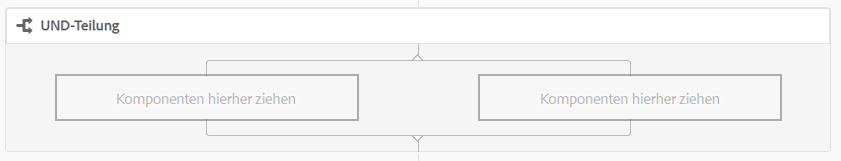
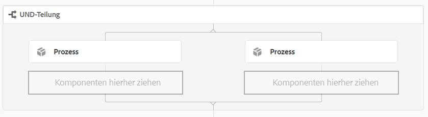
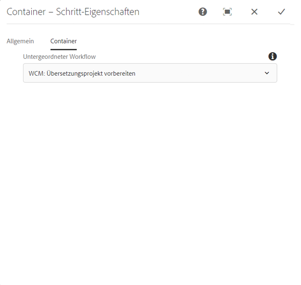
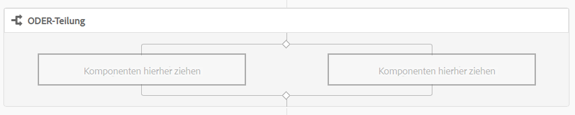
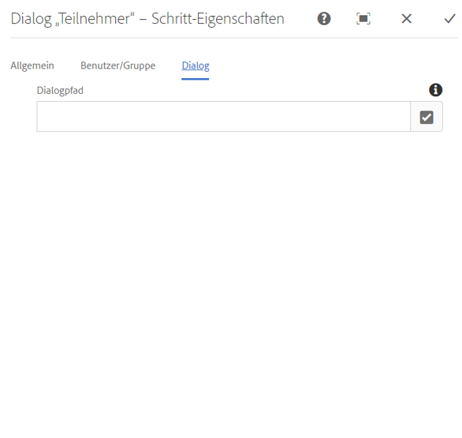
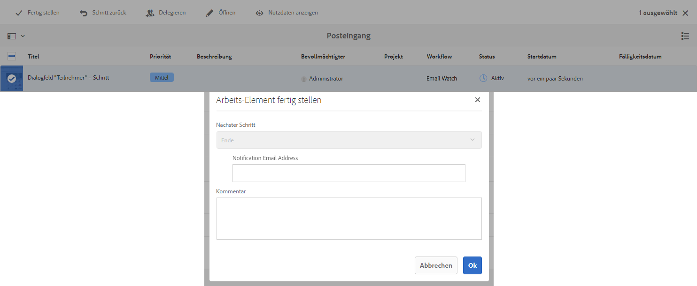
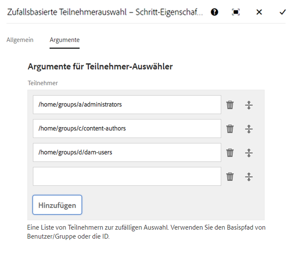
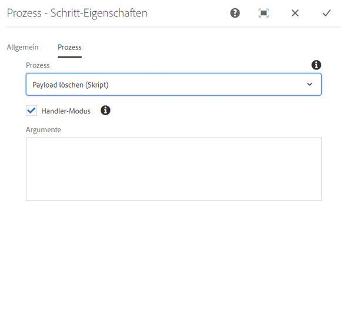

# Referenz für Workflow-Schritte{#workflow-step-reference}

>[!CAUTION]
>
>AEM 6.4 hat das Ende der erweiterten Unterstützung erreicht und diese Dokumentation wird nicht mehr aktualisiert. Weitere Informationen finden Sie in unserer [technische Unterstützung](https://helpx.adobe.com/de/support/programs/eol-matrix.html). Unterstützte Versionen suchen [here](https://experienceleague.adobe.com/docs/?lang=de).

Workflow-Modelle bestehen aus einer Reihe von Schritten verschiedener Typen. Je nach Typ können diese Schritte konfiguriert und mit Parametern und Skripten erweitert werden, um die benötigten Funktionen und Steuerungsmöglichkeiten bereitzustellen.

>[!NOTE]
>
>In diesem Abschnitt werden die standardmäßigen Workflow-Schritte beschrieben.
>
>Informationen zu modulspezifischen Schritten finden Sie auch unter:
>
>* [Schrittreferenz für AEM Forms-Arbeitsabläufe](/help/forms/using/aem-forms-workflow-step-reference.md)
>* [Verarbeitung von Assets mithilfe von Medien-Handlern und Workflows](/help/assets/media-handlers.md)
>


## Schritt-Eigenschaften {#step-properties}

Jede Schritt-Komponente verfügt über eine **[!UICONTROL Schritt-Eigenschaften]** -Dialogfeld, in dem Sie die erforderlichen Eigenschaften definieren und bearbeiten können.

### Schritteigenschaften - Registerkarte &quot;Allgemein&quot; {#step-properties-common-tab}

Für die meisten Workflow-Schritt-Komponenten ist eine Kombination der folgenden Eigenschaften verfügbar: **[!UICONTROL Häufig]** Registerkarte des Eigenschaftendialogfelds:

* **[!UICONTROL Titel]**

   Der Titel für den Schritt.

* **[!UICONTROL Beschreibung]**

   Eine Beschreibung des Schritts.

* **[!UICONTROL Workflow-Phase]**

   Eine Dropdown-Auswahl zum Anwenden einer [Staging](/help/sites-developing/workflows.md#workflow-stages) zum Schritt hinzu.

* **[!UICONTROL Zeitüberschreitung]**

   Der Zeitraum, nach dessen Ablauf der Schritt die zulässige Zeit überschritten hat.


   Folgende Optionen stehen zur Auswahl: **[!UICONTROL Aus]**, **[!UICONTROL Unmittelbar]**, **[!UICONTROL 1 h]**, **[!UICONTROL 6 h]**, **[!UICONTROL 12 h]**, **[!UICONTROL 24 h]**.

* **[!UICONTROL Zeitüberschreitungs-Handler]**

   Der Handler, der den Workflow steuert, sobald ein Schritt die zulässige Zeit überschreitet, z. B.:

   `Auto Advancer`

* **[!UICONTROL Handler-Fortschritt]**

   Wählen Sie diese Option aus, um den Workflow nach dem Ausführen automatisch mit dem nächsten Schritt fortzuführen. Wenn diese Option nicht ausgewählt ist, muss das Implementierungsskript den Workflow fortführen.

#### Schritteigenschaften - Registerkarte &quot;Benutzer/Gruppe&quot; {#step-properties-user-group-tab}

Die folgenden Eigenschaften sind für viele Workflow-Schritt-Komponenten verfügbar: **[!UICONTROL Benutzer/Gruppe]** Registerkarte des Eigenschaftendialogfelds:

* **[!UICONTROL Benachrichtigen Sie den Benutzer per E-Mail]**

   * Sie können Teilnehmer benachrichtigen, indem Sie ihnen eine E-Mail senden, wenn der Workflow den Schritt erreicht.
   * Wenn diese Option aktiviert ist, wird eine E-Mail an den durch die Eigenschaft definierten Benutzer gesendet. **[!UICONTROL Benutzer/Gruppe]** oder an jedes Gruppenmitglied, wenn eine Gruppe definiert ist.

* **[!UICONTROL Benutzer/Gruppe]**

   * Sie können einen Benutzer oder eine Gruppe aus einem Dropdown-Menü auswählen.
   * Falls Sie den Schritt einem bestimmten Benutzer zuweisen, kann nur dieser Benutzer Aktionen für den Schritt durchführen.
   * Falls Sie den Schritt einer ganzen Gruppe zuweisen, erhalten alle Benutzer in dieser Gruppe die Aktion im **[!UICONTROL Workflow-Posteingang]**, sobald der Workflow diesen Schritt erreicht.
   * Siehe [Teilnehmen an Workflows](/help/sites-authoring/workflows-participating.md) für weitere Informationen.

## UND-Teilung {#and-split}

Mit der **[!UICONTROL UND-Teilung]** wird der Workflow unterteilt und beide Verzweigungen werden aktiviert. Sie fügen jeder Verzweigung nach Bedarf Workflow-Schritte hinzu. Dieser Schritt ermöglicht es Ihnen, mehrere Verarbeitungspfade in den Workflow einzufügen. Sie können beispielsweise zulassen, dass bestimmte Überprüfungsschritte parallel ausgeführt werden, sodass Zeit gespart wird.



### UND-Teilung - Konfiguration {#and-split-configuration}

* Bearbeiten Sie die **[!UICONTROL UND-Teilung]** properties:

   * **[!UICONTROL Splitsname]**: zu erläuternden Zwecken einen Namen zuweisen.
   * Wählen Sie die Anzahl der erforderlichen Zweige aus. 2, 3, 4 oder 5.

* Fügen Sie den Verzweigungen nach Bedarf Workflow-Schritte hinzu.

   

## Container-Schritt {#container-step}

A **[!UICONTROL Container]** step startet ein anderes Workflow-Modell, das als untergeordneter Workflow ausgeführt wird.

Diese **[!UICONTROL Container]** ermöglicht die Wiederverwendung von Workflow-Modellen zur Implementierung gängiger Schrittfolgen. Beispielsweise kann ein Übersetzungs-Workflow-Modell in mehreren Bearbeitungs-Workflows verwendet werden.



### Container-Schritt - Konfiguration {#container-step-configuration}

Verwenden und bearbeiten Sie die folgenden Registerkarten, um den Schritt zu konfigurieren:

* [**[!UICONTROL Allgemein]**](#step-properties-common-tab)
* **[!UICONTROL Container]**

   * **[!UICONTROL Unter-Workflow]**: Wählen Sie den zu startenden Workflow aus.

## Zum Schritt wechseln {#goto-step}

Die **[!UICONTROL Zum Schritt wechseln]** ermöglicht es Ihnen, den nächsten auszuführenden Schritt im Workflow-Modell abhängig vom Ergebnis eines ECMAScripts anzugeben:

* `true`: Die **[!UICONTROL Zum Schritt wechseln]** wird abgeschlossen und die Workflow-Engine führt den angegebenen Schritt aus.

* `false`: Die **[!UICONTROL Zum Schritt wechseln]** completes und die normale Routing-Logik bestimmt den nächsten auszuführenden Schritt.

Mit **[!UICONTROL Zum Schritt wechseln]** können Sie erweiterte Routingstrukturen im Workflow-Modell implementieren. Um beispielsweise eine Schleife zu implementieren, muss die **[!UICONTROL Zum Schritt wechseln]** kann definiert werden, um einen vorherigen Schritt im Workflow auszuführen, wobei das Skript eine Schleifenbedingung auswertet.

### Zum Schritt wechseln - Konfiguration {#goto-step-configuration}

Verwenden und bearbeiten Sie die folgenden Registerkarten, um den Schritt zu konfigurieren:

* [**[!UICONTROL Allgemein]**](#step-properties-common-tab)
* **[!UICONTROL Prozess]**

   * **[!UICONTROL Der Schritt, zu dem]**: Wählen Sie den auszuführenden Schritt aus.
   * **[!UICONTROL Skriptpfad]**: Der Pfad zum ECMAScript, das bestimmt, ob die **[!UICONTROL Zum Schritt wechseln]**.
   * **[!UICONTROL Skript]**: Das ECMAScript, das bestimmt, ob die **[!UICONTROL Zum Schritt wechseln]**.

>[!CAUTION]
>
>Geben Sie entweder **[!UICONTROL Skriptpfad]** oder **[!UICONTROL Skript]**. Beide Optionen können nicht gleichzeitig verwendet werden. Wenn Sie Werte für beide Eigenschaften angeben, verwendet der Schritt die **[!UICONTROL Skriptpfad]**.

#### Simulieren einer für Schleife {#simulating-a-for-loop}

Für die Simulation einer for-Schleife müssen Sie die Anzahl der aufgetretenen Schleifeniterationen beibehalten:

* Die Anzahl stellt normalerweise einen Index der Elemente dar, auf die im Workflow reagiert wird.
* Die Anzahl wird als Ausstiegskriterien für die Schleife ausgewertet.

Um beispielsweise einen Workflow zu implementieren, der eine Aktion auf mehreren JCR-Knoten ausführt, können Sie einen Schleifenzähler als Index für die Knoten verwenden. Speichern Sie in der Datenzuordnung der Workflow-Instanz einen `integer`-Wert, um die Schleifenzahl zu speichern. Verwenden Sie das Skript für **[!UICONTROL Zum Schritt wechseln]**, um die Zahl zu erhöhen und mit den Beendigungskriterien zu vergleichen.

```
function check(){
   var count=0;
   var keyname="loopcount"
   try{
      if (workflowData.getMetaDataMap().containsKey(keyname)){ 
        log.info("goto script: found loopcount key");
        count= parseInt(workflowData.getMetaDataMap().get(keyname))+1;
      } 
 
     workflowData.getMetaDataMap().put(keyname,count);
 
     }catch(err) {
         log.info(err.message);
         return false;
    }
   if (parseInt(count) <7){
       return true;
   } else {
      return false;
   }
}
```

## ODER-Teilung {#or-split}

Mit der **[!UICONTROL ODER-Teilung]** wird der Workflow so geteilt, dass nur eine Verzweigung aktiv bleibt. Mit diesem Schritt können Sie bedingte Verarbeitungspfade in einem Workflow einrichten. Sie fügen jeder Verzweigung nach Bedarf Workflow-Schritte hinzu.

>[!NOTE]
>
>Weitere Informationen zum Erstellen einer ODER-Teilung finden Sie unter: [https://helpx.adobe.com/experience-manager/using/aem64_workflow_servlet.html](https://helpx.adobe.com/experience-manager/using/aem64_workflow_servlet.html)



### ODER-Teilung - Konfiguration {#or-split-configuration}

* Bearbeiten Sie die **[!UICONTROL ODER-Teilung]** properties:

   * **[!UICONTROL Allgemein]**

      * Wählen Sie die Anzahl der erforderlichen Zweige aus. 2, 3, 4 oder 5.
   * **[!UICONTROL Verzweigung : *x*>]**

      * **[!UICONTROL Skriptpfad]**: Der Pfad zu einer Datei, die das Skript enthält.
      * **[!UICONTROL Skript]**: Fügen Sie das Skript in das Feld ein.
      * **[!UICONTROL Standardroute]**: Der Standardverzweigung wird gefolgt, wenn mehrere Verzweigungen als &quot;true&quot;ausgewertet werden. Sie können nur eine Verzweigung als Standard festlegen.

   >[!NOTE]
   >
   >Für jeden Zweig gibt es eine separate Registerkarte:
   >
   >* Das Skript jedes Zweigs wird einzeln ausgewertet.
   >* Die Verzweigungen werden von links nach rechts ausgewertet.
   >* Das erste Skript, das als „true“ bewertet wird, wird ausgeführt.
   >* Falls keine Verzweigung als „true“ bewertet wird, wird der Workflow nicht fortgeführt.


   >[!CAUTION]
   >
   >Geben Sie entweder **[!UICONTROL Skriptpfad]** oder **[!UICONTROL Skript]**. Beide Optionen können nicht gleichzeitig verwendet werden. Wenn Sie Werte für beide Eigenschaften angeben, verwendet der Schritt die **[!UICONTROL Skriptpfad]**.

   >[!NOTE]
   >
   >Siehe [Definieren einer Regel für eine ODER-Teilung](/help/sites-developing/workflows-models.md#example-defining-a-rule-for-an-or-split).

* Fügen Sie den Verzweigungen nach Bedarf Workflow-Schritte hinzu.

## Teilnehmer - Schritte und Auswahlmöglichkeiten {#participant-steps-and-choosers}

### Teilnehmerschritt {#participant-step}

Mit der Option **[!UICONTROL Teilnehmer-Schritt]** können Sie einer bestimmten Aktion Eigentümerrechte zuweisen. Der Workflow wird nur fortgesetzt, wenn der Benutzer den Schritt manuell quittiert hat. Die Option wird verwendet, wenn Sie einer Person eine Aktion in einem Workflow zuweisen möchten, z. B. einen Bewertungsschritt.

Obwohl sie nicht direkt damit im Zusammenhang steht, muss die Benutzerautorisierung beim Zuweisen einer Aktion berücksichtigt werden. Der Benutzer muss Zugriff auf die Seite mit der Workflow-Payload haben.

#### Teilnehmer-Schritt - Konfiguration {#participant-step-configuration}

Verwenden und bearbeiten Sie die folgenden Registerkarten, um den Schritt zu konfigurieren:

* [**[!UICONTROL Allgemein]**](#step-properties-common-tab)
* [**[!UICONTROL Benutzer/Gruppe]**](#step-properties-user-group-tab)

>[!NOTE]
>
>Der Workflow-Initiator wird immer benachrichtigt, wenn:
>
>* Der Workflow ist abgeschlossen (beendet).
>* Der Workflow wird abgebrochen (beendet).
>


>[!NOTE]
>
>Einige Eigenschaften müssen konfiguriert werden, um E-Mail-Benachrichtigungen zu aktivieren. Sie können auch die E-Mail-Vorlage anpassen oder eine E-Mail-Vorlage für eine neue Sprache hinzufügen. Informationen zum Konfigurieren von E-Mail-Benachrichtigungen in AEM finden Sie unter [Konfigurieren von E-Mail-Benachrichtigungen](/help/sites-administering/notification.md).

### Dialogfeld &quot;Teilnehmer&quot; – Schritt {#dialog-participant-step}

Verwenden Sie eine **[!UICONTROL Dialogfeld &quot;Teilnehmer - Schritt&quot;]** , um Informationen von dem Benutzer zu erfassen, dem das Arbeitselement zugewiesen ist. Dieser Schritt ist nützlich für die Erfassung kleiner Datenmengen, die später im Workflow verwendet werden.

Nach Abschluss des Schritts wird die **[!UICONTROL Arbeitselement abschließen]** enthält die Felder, die Sie in Ihrem Dialogfeld definieren. Die in den Feldern erfassten Daten werden in den Knoten der Workflow-Payload gespeichert. Nachfolgende Workflow-Schritte können dann den Wert aus dem Repository lesen.

Um den Schritt zu konfigurieren, geben Sie die Gruppe oder den Benutzer an, der das Arbeitselement zugewiesen werden soll, und den Pfad zum Dialogfeld.

#### Dialogfeld &quot;Teilnehmer - Schritt - Konfiguration&quot; {#dialog-participant-step-configuration}

Verwenden und bearbeiten Sie die folgenden Registerkarten, um den Schritt zu konfigurieren:

* [**[!UICONTROL Allgemein]**](#step-properties-common-tab)
* [**[!UICONTROL Benutzer/Gruppe]**](#step-properties-user-group-tab)
* **[!UICONTROL Dialogfeld]**

   * **[!UICONTROL Dialogpfad*]: Der Pfad zum Dialogfeldknoten des [Dialogfeld erstellen](#dialog-participant-step-creating-a-dialog).

#### Dialogfeld &quot;Teilnehmer-Schritt&quot;- Erstellen eines Dialogfelds{#dialog-participant-step-creating-a-dialog}

So erstellen Sie ein Dialogfeld:

* Entscheiden Sie, wo die erfassten Daten [in der Payload gespeichert werden](#dialog-participant-step-storing-data-in-the-payload).
* [Definieren Sie das Dialogfeld, einschließlich der Felder zum Erfassen (und Speichern) der Daten](#dialog-participant-step-dialog-definition).

#### Dialogfeld „Teilnehmer-Schritt“ – Speichern von Daten in der Payload {#dialog-participant-step-storing-data-in-the-payload}

Sie können Widget-Daten in der Workflow-Payload oder in den Metadaten des Arbeitselements speichern. Das Format der `name`-Eigenschaft des Widget-Knotens bestimmt, wo die Daten gespeichert werden.

* **[!UICONTROL Daten mit der Payload speichern]**

   * Um Widget-Daten als Eigenschaft der Workflow-Payload zu speichern, verwenden Sie folgendes Format für den Wert der name-Eigenschaft des Widget-Knotens:

      `./jcr:content/nodename`

   * Die Daten werden in der `nodename`-Eigenschaft des Payload-Knotens gespeichert. Wenn der Knoten diese Eigenschaft nicht enthält, wird die Eigenschaft erstellt.
   * Wenn Daten mit der Payload gespeichert werden, wird der Wert der Eigenschaft bei nachfolgender Verwendung des Dialogfelds mit derselben Payload überschrieben.

* **[!UICONTROL Speichern von Daten mit dem Arbeitselement]**

   * Um Widget-Daten als Eigenschaft der Metadaten des Arbeitselements zu speichern, verwenden Sie das folgende Format für den Wert der name-Eigenschaft:

      `nodename`

   * Die Daten werden in der `nodename`-Eigenschaft der `metadata` des Arbeitselements gespeichert. Die Daten werden beibehalten, wenn das Dialogfeld anschließend von derselben Payload verwendet wird.

#### Dialogfeld &quot;Teilnehmer-Schritt&quot;- Dialogfelddefinition {#dialog-participant-step-dialog-definition}

1. **[!UICONTROL Dialogfeldstruktur]**

   Dialogfelder für das Dialogfeld „Teilnehmer-Schritt“ ähneln den Dialogfeldern, die Sie für Bearbeitungskomponenten erstellen. Sie werden gespeichert unter:

   `/apps/myapp/workflow/dialogs`

   Dialogfelder für die standardmäßige Touch-optimierte Benutzeroberfläche weisen die folgende Knotenstruktur auf:

   ```xml
   newComponent (cq:Component)
     |- cq:dialog (nt:unstructured)
       |- content 
         |- layout 
           |- items 
             |- column 
               |- items 
                 |- component0
                 |- component1
                 |- ...
   ```

   >[!NOTE]
   >
   >Weitere Informationen finden Sie unter [Erstellen und Konfigurieren eines Dialogfelds](/help/sites-developing/developing-components.md#creating-and-configuring-a-dialog).

1. **[!UICONTROL Dialogpfad-Eigenschaft]**

   Das Dialogfeld **[!UICONTROL Teilnehmer-Schritt]** beinhaltet die Eigenschaft **[!UICONTROL Dialogpfad]** (in Kombination mit den Eigenschaften eines [Teilnehmer-Schritts](#participant-step)). Der Wert der Eigenschaft **[!UICONTROL Dialogpfad]** entspricht dem Pfad zum Knoten `dialog` im Dialogfeld.

   Das Dialogfeld kann sich beispielsweise in einer Komponente mit dem Namen `EmailWatch` befindet, die im Knoten gespeichert ist:

   `/apps/myapp/workflows/dialogs`

   Für die Touch-optimierte Benutzeroberfläche wird folgender Wert für die Eigenschaft **[!UICONTROL Dialogpfad]** verwendet:

   `/apps/myapp/workflow/dialogs/EmailWatch/cq:dialog`

   

1. **Beispiel für eine Dialogfelddefinition**

   Das folgende XML-Code-Snippet steht für ein Dialogfeld, bei dem der `String`-Wert im Knoten `watchEmail` des Payload-Inhalts gespeichert wird. Der Titelknoten stellt die [TextField](https://helpx.adobe.com/experience-manager/6-4/sites/developing/using/reference-materials/granite-ui/api/jcr_root/libs/granite/ui/components/coral/foundation/form/textfield/index.html) component:

   ```xml
   jcr:primaryType="nt:unstructured" 
       jcr:title="Watcher Email Address Dialog" 
       sling:resourceType="cq/gui/components/authoring/dialog">
       <content jcr:primaryType="nt:unstructured"
           sling:resourceType="granite/ui/components/foundation/container">
           <layout jcr:primaryType="nt:unstructured" 
               margin="false" 
               sling:resourceType="granite/ui/components/foundation/layouts/fixedcolumns"
           />
           <items jcr:primaryType="nt:unstructured">
               <column jcr:primaryType="nt:unstructured"
                   sling:resourceType="granite/ui/components/foundation/container">
                   <items jcr:primaryType="nt:unstructured">
                       <title jcr:primaryType="nt:unstructured" 
                           fieldLabel="Notification Email Address" 
                           name="./jcr:content/watchEmails"
                           sling:resourceType="granite/ui/components/foundation/form/textfield"
                       />
                   </items>
               </column>
           </items>
       </content>
   </cq:dialog>
   ```

   Dieses Beispiel führt im Falle der Touch-optimierten Benutzeroberfläche zu einem Dialogfeld wie:

   

### Dynamischer Teilnehmerschritt {#dynamic-participant-step}

Die **[!UICONTROL Dynamischer Teilnehmer - Schritt]** -Komponente ähnelt **[!UICONTROL Teilnehmer-Schritt]** mit dem Unterschied, dass der Teilnehmer zur Laufzeit automatisch ausgewählt wird.

Um den Schritt zu konfigurieren, wählen Sie eine **[!UICONTROL Teilnehmerauswahl]** , der den Teilnehmer identifiziert, dem das Arbeitselement zugewiesen werden soll, zusammen mit einem Dialogfeld.

#### Dynamischer Teilnehmer - Schritt - Konfiguration {#dynamic-participant-step-configuration}

Verwenden und bearbeiten Sie die folgenden Registerkarten, um den Schritt zu konfigurieren:

* [**[!UICONTROL Allgemein]**](#step-properties-common-tab)
* **[!UICONTROL Teilnehmer-Auswähler]**

   * **[!UICONTROL Teilnehmerauswahl]**: Der Name der [Teilnehmerauswahl, die Sie erstellen](#dynamic-participant-step-developing-the-participant-chooser).
   * **[!UICONTROL Argumente]**: Alle erforderlichen Argumente.
   * **[!UICONTROL Email]**: Ob eine E-Mail-Benachrichtigung an den Benutzer gesendet werden soll.

* **[!UICONTROL Dialogfeld]**

   * **[!UICONTROL Dialogpfad]**: Der Pfad zum Dialogfeldknoten des [erstellen (wie bei den **Dialogfeld &quot;Teilnehmer - Schritt&quot;**)](#dialog-participant-step-creating-a-dialog).

#### Dynamischer Teilnehmer - Schritt zur Entwicklung der Teilnehmerauswahl {#dynamic-participant-step-developing-the-participant-chooser}

Sie erstellen die Teilnehmerauswahl. Daher können Sie eine beliebige Auswahllogik oder ein beliebiges Kriterium verwenden. Ihre Teilnehmerauswahl kann beispielsweise den Benutzer (innerhalb einer Gruppe) mit den wenigsten Arbeitselementen auswählen. Sie können eine beliebige Anzahl von Teilnehmerauswahlen erstellen, die mit verschiedenen Instanzen der **Dynamischer Teilnehmer - Schritt** -Komponente in Ihren Workflow-Modellen.

Erstellen Sie einen OSGi-Dienst oder ein ECMAScript, das einen Benutzer auswählt, dem das Arbeitselement zugewiesen werden soll.

* **[!UICONTROL ECMAscript]**

   Skripte müssen eine getParticipant-Funktion enthalten, mit der eine Benutzer-ID als `String`-Wert zurückgegeben wird. Speichern Sie die benutzerdefinierten Skripte beispielsweise im Ordner `/apps/myapp/workflow/scripts` oder in einem Unterordner.

   Ein Beispielskript ist in einer Standard-AEM-Instanz enthalten:

   `/libs/workflow/scripts/initiator-participant-chooser.ecma`

   >[!CAUTION]
   >
   >Sie dürfen *keinerlei* Änderungen im Pfad `/libs` vornehmen,
   >
   >
   >da der Inhalt von `/libs` überschrieben wird, wenn Sie die Instanz das nächste Mal upgraden. (Außerdem kann der Inhalt auch durch Anwenden von Hotfixes oder Feature Packs überschrieben werden.)

   Mit diesem Skript wird der Workflow-Initiator als Teilnehmer ausgewählt:

   ```
   function getParticipant() {
       return workItem.getWorkflow().getInitiator();
   }
   ```

   >[!NOTE]
   >
   >Die Komponente **[!UICONTROL Workflow-Initiator-Teilnehmerauswahl]** erweitert die Komponente **[!UICONTROL Dynamischer-Teilnehmer-Schritt]** und verwendet dieses Skript für die Implementierung des Schritts.

* **[!UICONTROL OSGi-Dienst]**

   Dienste müssen die Schnittstelle [com.day.cq.workflow.exec.ParticipantStepChooser](https://helpx.adobe.com/experience-manager/6-4/sites/developing/using/reference-materials/javadoc/com/day/cq/workflow/exec/ParticipantStepChooser.html) implementieren. Die Schnittstelle definiert die folgenden Mitglieder:

   * `SERVICE_PROPERTY_LABEL`-Feld: Geben Sie in diesem Feld den Namen der Teilnehmerauswahl an. Der Name wird in einer Liste der verfügbaren Teilnehmerauswahlen in den Eigenschaften **[!UICONTROL Dynamischer Teilnehmer – Schritt]** angezeigt.
   * `getParticipant`-Methode: Gibt die dynamisch aufgelöste Prinzipal-ID als `String`-Wert zurück.

   >[!CAUTION]
   >
   >Die `getParticipant`-Methode gibt die dynamisch aufgelöste Prinzipal-ID zurück. Dabei kann es sich um eine Gruppen-ID oder eine Benutzer-ID handeln.
   >
   >
   >Eine Gruppen-ID kann jedoch nur für eine **[!UICONTROL Teilnehmer-Schritt]**, wenn eine Teilnehmerliste zurückgegeben wird. Für die Komponente **[!UICONTROL Dynamischer-Teilnehmer-Schritt]** wird eine leere Liste zurückgegeben und diese kann nicht für die Delegierung verwendet werden.

   Um die Implementierung für Komponenten **[!UICONTROL Dynamischer Teilnehmer – Schritt]** verfügbar zu machen, fügen Sie die Java-Klasse zum OSGi-Bundle hinzu, das den Dienst exportiert, und stellen Sie das Bundle auf dem AEM-Server bereit.

   >[!NOTE]
   >
   >Die **[!UICONTROL zufallsbasierte Teilnehmerauswahl]** ist ein Sampling-Dienst, der willkürlich einen Benutzer auswählt ( `com.day.cq.workflow.impl.process.RandomParticipantChooser`). Die **[!UICONTROL Zufallsbasierte Teilnehmerauswahl]** Schritt-Komponentenbeispiel erweitert **[!UICONTROL Dynamischer Teilnehmer - Schritt]** und verwendet diesen Dienst als Schritt-Implementierung.

#### Dynamischer Teilnehmer - Schritt - Beispiel für einen Teilnehmerauswahldienst {#dynamic-participant-step-example-participant-chooser-service}

Die folgende Java-Klasse implementiert die `ParticipantStepChooser`-Oberfläche. Die Klasse gibt den Namen des Teilnehmers zurück, der den Workflow initiiert hat. Der Code verwendet dieselbe Logik wie das Beispielskript (`initator-participant-chooser.ecma`).

Die `@Property`-Anmerkung setzt den Wert des `SERVICE_PROPERTY_LABEL`-Felds auf `Workflow Initiator Participant Chooser`.

```java
package com.adobe.example;

import org.apache.felix.scr.annotations.Component;
import org.apache.felix.scr.annotations.Properties;
import org.apache.felix.scr.annotations.Property;
import org.apache.felix.scr.annotations.Service;
import org.osgi.framework.Constants;
import org.slf4j.Logger;
import org.slf4j.LoggerFactory;

import com.adobe.granite.workflow.WorkflowException;
import com.adobe.granite.workflow.WorkflowSession;
import com.adobe.granite.workflow.exec.ParticipantStepChooser;
import com.adobe.granite.workflow.exec.WorkItem;
import com.adobe.granite.workflow.metadata.MetaDataMap;

@Component
@Service
@Properties({
        @Property(name = Constants.SERVICE_DESCRIPTION, value = "An example implementation of a dynamic participant chooser."),
        @Property(name = ParticipantStepChooser.SERVICE_PROPERTY_LABEL, value = "Workflow Initiator Participant Chooser (service)") })
public class InitiatorParticipantChooser implements ParticipantStepChooser {

 private Logger logger = LoggerFactory.getLogger(this.getClass());

 public String getParticipant(WorkItem arg0, WorkflowSession arg1,
   MetaDataMap arg2) throws WorkflowException {

  String initiator = arg0.getWorkflow().getInitiator();
  logger.info("Assigning Dynamic Participant Step work item to {}",initiator);

  return initiator;
 }
}
```

Im Dialogfeld **[!UICONTROL Dynamischer-Teilnehmer-Schritt]** enthält die Liste **[!UICONTROL Teilnehmerauswahl]** das Element `Workflow Initiator Participant Chooser (script)`, das für diesen Dienst steht.

``Wenn das Workflow-Modell gestartet wird, wird in der Protokolldatei die ID des Benutzers angegeben, der den Workflow initiiert hat und dem das Arbeitselement zugewiesen ist. In diesem Beispiel hat der Benutzer `admin` den Workflow gestartet.

`13.09.2015 15:48:53.037 *INFO* [10.176.129.223 [1347565733037] POST /etc/workflow/instances HTTP/1.1] com.adobe.example.InitiatorParticipantChooser Assigning Dynamic Participant Step work item to admin`

### Formular &quot;Teilnehmer&quot; – Schritt {#form-participant-step}

Die **[!UICONTROL Teilnehmer-Schritt des Formulars]** zeigt ein Formular an, wenn das Arbeitselement geöffnet wird. Wenn der Benutzer das Formular ausfüllt und absendet, werden die Daten in den Knoten der Workflow-Payload gespeichert.

Um den Schritt zu konfigurieren, geben Sie die Gruppe oder den Benutzer an, der das Arbeitselement zugewiesen werden soll, und den Pfad zum Formular.

>[!CAUTION]
>
>In diesem Abschnitt werden [Formulare von Foundation-Komponenten für die Seitenbearbeitung](/help/sites-authoring/default-components-foundation.md#form) behandelt.

#### Formularteilnehmerschritt - Konfiguration {#form-participant-step-configuration}

Verwenden und bearbeiten Sie die folgenden Registerkarten, um den Schritt zu konfigurieren:

* [**[!UICONTROL Allgemein]**](#step-properties-common-tab)
* [**[!UICONTROL Benutzer/Gruppe]**](#step-properties-user-group-tab)
* **[!UICONTROL Formular]**

   * **[!UICONTROL Formularpfad]**: Der Pfad zum [Formular, das Sie erstellen](#form-participant-step-creating-the-form).

#### Formularteilnehmerschritt - Erstellen des Formulars {#form-participant-step-creating-the-form}

Erstellen Sie ein Formular zur Verwendung mit einer **[!UICONTROL Teilnehmer-Schritt des Formulars]** als normal. Formulare für einen Formular &quot;Teilnehmer - Schritt&quot;müssen jedoch die folgenden Konfigurationen aufweisen:

* Für die Komponente **[!UICONTROL Beginn des Formulars]** muss die Eigenschaft **[!UICONTROL Aktionstyp]** auf `Edit Workflow Controlled Resource(s)` gesetzt sein.

* Die Komponente **[!UICONTROL Beginn des Formulars]** muss einen Wert für die Eigenschaft `Form Identifier` enthalten.

* Für die Formularkomponenten muss die Eigenschaft **Elementname** auf den Pfad des Knotens verweisen, in dem die Felddaten gespeichert werden. Der Pfad muss auf einen Knoten im Payload-Inhalt des Workflows verweisen. Der Wert verwendet das folgende Format:

   `./jcr:content/path_to_node`

* Das Formular muss die Komponente **[!UICONTROL Workflow-Sende-Schaltfläche(n)]** enthalten. Sie konfigurieren keine Eigenschaften der Komponente.

Die Anforderungen Ihres Workflows bestimmen, wo Felddaten gespeichert werden sollen. Beispielsweise können Felddaten verwendet werden, um die Eigenschaften des Seiteninhalts zu konfigurieren. Der folgende Wert der Eigenschaft **[!UICONTROL Elementname]** speichert Felddaten als Wert der `redirectTarget`-Eigenschaft des Knotens `jcr:content`:

`./jcr:content/redirectTarget`

Im folgenden Beispiel werden die Felddaten als Inhalt einer **[!UICONTROL Text]**-Komponente auf der Payload-Seite verwendet:

`./jcr:content/par/text_3/text`

``Das erste Beispiel kann für eine beliebige Seite verwendet werden, die von der `cq:Page`-Komponente gerendert wird. Das zweite Beispiel kann nur verwendet werden, wenn die Payload-Seite eine **Text**-Komponente mit der ID `text_3` beinhaltet.

Das Formular kann sich an einer beliebigen Stelle im Repository befinden, Workflow-Benutzer müssen jedoch berechtigt sein, das Formular zu lesen.

### Zufallsbasierte Teilnehmerauswahl {#random-participant-chooser}

Der Schritt **[!UICONTROL Zufallsbasierte Teilnehmerauswahl]** bezieht sich auf eine Teilnehmerauswahl, die das erzeugte Arbeitselement einem willkürlich aus einer Liste ausgewählten Benutzer zuweist.



#### Zufallsbasierte Teilnehmerauswahl - Konfiguration {#random-participant-chooser-configuration}

Verwenden und bearbeiten Sie die folgenden Registerkarten, um den Schritt zu konfigurieren:

* [**[!UICONTROL Allgemein]**](#step-properties-common-tab)
* **[!UICONTROL Argumente]**

   * **[!UICONTROL Teilnehmer]**: Gibt die Liste der zur Auswahl verfügbaren Benutzer an. Um einen Benutzer zur Liste hinzuzufügen, klicken Sie auf **[!UICONTROL Element hinzufügen]** und geben Sie den Startpfad des Benutzerknotens oder die Benutzer-ID ein. Die Reihenfolge der Benutzer wirkt sich nicht auf die Wahrscheinlichkeit aus, ein Arbeitselement zugewiesen zu werden.

### Workflow-Initiator-Teilnehmerauswahl {#workflow-initiator-participant-chooser}

Die **[!UICONTROL Workflow-Initiator-Teilnehmerauswahl]** step ist eine Teilnehmerauswahl, die das generierte Arbeitselement dem Benutzer zuordnet, der den Workflow gestartet hat. Es gibt keine anderen Eigenschaften als die **[!UICONTROL Häufig]** Eigenschaften.

#### Workflow-Initiator-Teilnehmerauswahl - Konfiguration {#workflow-initiator-participant-chooser-configuration}

Um den Schritt zu konfigurieren, bearbeiten Sie ihn mithilfe der folgenden Registerkarten:

* [**[!UICONTROL Allgemein]**](#step-properties-common-tab)

## Prozessschritt {#process-step}

A **[!UICONTROL Prozessschritt]** führt ein ECMAScript aus oder ruft einen OSGi-Dienst auf, um eine automatische Verarbeitung durchzuführen.



### Prozessschritt - Konfiguration {#process-step-configuration}

Verwenden und bearbeiten Sie die folgenden Registerkarten, um den Schritt zu konfigurieren:

* [**[!UICONTROL Allgemein]**](#step-properties-common-tab)
* **[!UICONTROL Prozess]**

   * **[!UICONTROL Prozess]**: Die auszuführende Prozessimplementierung. Wählen Sie das ECMA-Skript oder den OSGi-Dienst aus dem Dropdown-Menü aus. Informationen:

      * Die standardmäßigen ECMAScripts und OSGi-Dienste finden Sie unter [Integrierte Prozesse für Prozessschritte](/help/sites-developing/workflows-process-ref.md).
      * ECMAScripts für eine **[!UICONTROL Prozess]** Schritt, siehe [Implementieren eines Prozessschritts mit einem ECMAScript](/help/sites-developing/workflows-customizing-extending.md#using-ecmascript).
      * Erstellen von OSGi-Diensten für eine **[!UICONTROL Prozess]** Schritt, siehe [Implementieren eines Prozessschritts mit einer Java-Klasse](/help/sites-developing/workflows-customizing-extending.md#implementing-a-process-step-with-a-java-class).
   * **[!UICONTROL Handler-Fortschritt]**: Wählen Sie diese Option aus, um den Workflow nach der Ausführung automatisch mit dem nächsten Schritt fortzuführen. Wenn diese Option nicht ausgewählt ist, muss das Implementierungsskript den Workflow fortführen.
   * **[!UICONTROL Argumente]**: An den Prozess zu übergebende Argumente.
