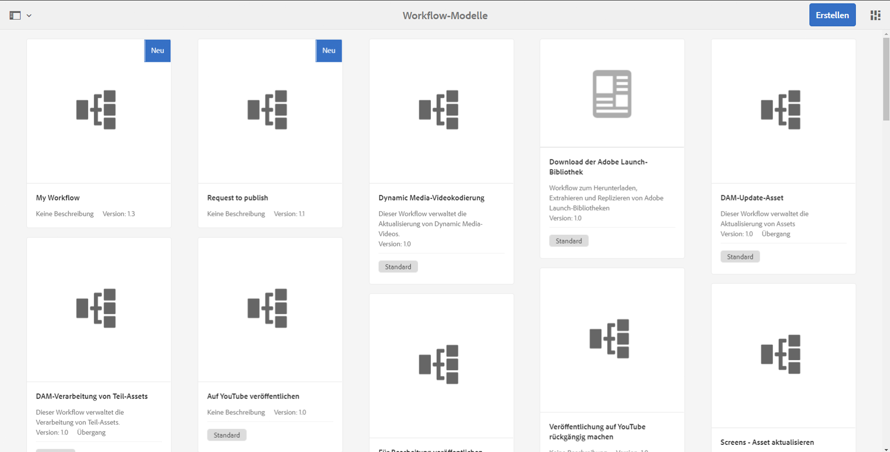

# Entwickeln und Erweitern von Workflows{#developing-and-extending-workflows}

>[!CAUTION]
>
>AEM 6.4 hat das Ende der erweiterten Unterstützung erreicht und diese Dokumentation wird nicht mehr aktualisiert. Weitere Informationen finden Sie in unserer [technische Unterstützung](https://helpx.adobe.com/de/support/programs/eol-matrix.html). Unterstützte Versionen suchen [here](https://experienceleague.adobe.com/docs/?lang=de).

AEM stellt mehrere Tools und Ressourcen zum Erstellen von Workflow-Modellen, Entwickeln von Workflow-Schritten und programmgesteuerten Interagieren mit Workflows bereit.

Mit Workflows können Sie Prozesse zum Verwalten von Ressourcen und Veröffentlichen von Inhalten in der AEM-Umgebung automatisieren. Workflows beinhalten eine Reihe von Schritten, wobei bei jedem Schritt eine diskrete Aufgabe ausgeführt wird. Sie können Logik- und Laufzeitdaten verwenden, um Entscheidungen darüber zu treffen, wann ein Prozess fortgesetzt werden kann, und den nächsten Schritt aus einem von mehreren möglichen Schritten auswählen.

So beinhalten beispielsweise Geschäftsprozesse zum Erstellen und Veröffentlichen von Webseiten Genehmigungs- und Abzeichnungsaufgaben diverser am Prozess beteiligter Personen. Diese Prozesse können mithilfe von AEM-Workflows modelliert und auf bestimmte Inhalte angewendet werden.

Die wichtigsten Aspekte werden im Folgenden behandelt, während die folgenden Seiten weitere Details enthalten:

* [Erstellen von Workflow-Modellen](/help/sites-developing/workflows-models.md)
* [Erweitern der Workflow-Funktionen](/help/sites-developing/workflows-customizing-extending.md)
* [Programmgesteuerte Interaktion mit Workflows](/help/sites-developing/workflows-program-interaction.md)
* [Referenz für Workflow-Schritte](/help/sites-developing/workflows-step-ref.md)
* [Prozessreferenz für Workflows](/help/sites-developing/workflows-process-ref.md)
* [Best Practices für Workflows](/help/sites-developing/workflows-best-practices.md)

>[!NOTE]
>
>Informationen:
>
>* Informationen zum Teilnehmen an Workflows finden Sie unter [Verwenden von Workflows](/help/sites-authoring/workflows.md).
>* Informationen zum Verwalten von Workflows und Workflow-Instanzen finden Sie unter [Verwalten von Workflows](/help/sites-administering/workflows.md).
>* Lesen Sie den umfassenden Community-Artikel zum Thema [Ändern digitaler Assets mit Workflows in Adobe Experience Manager](https://helpx.adobe.com/de/experience-manager/using/modify_asset_workflow.html).
>* Sehen Sie sich das [AEM-Experten-Webinar zum Thema Workflows](https://bit.ly/ATACE218) an.
>* Lesen Sie den umfassenden Community-Artikel zum Thema [Erstellen eines benutzerdefinierten dynamischen Teilnehmerschritts mit Adobe Experience Manager 6.3](https://helpx.adobe.com/de/experience-manager/using/dynamic-steps-aem63.html).
>* Informationen zu Änderungen der Datenspeicherorte finden Sie unter [Neustrukturierung von Repositorys in AEM 6.4](/help/sites-deploying/repository-restructuring.md) und [Best Practices für Workflows – Speicherorte](/help/sites-developing/workflows-best-practices.md#locations).
>

## Modell {#model}

Ein `WorkflowModel` steht für eine Definition (bzw. ein Modell) eines Workflows. Es besteht aus `WorkflowNodes` und `WorkflowTransitions`. Die Übergänge verbinden die Knoten und definieren den *Fluss*. Das Modell weist immer einen Start- und einen Endknoten auf.

### Laufzeitmodell {#runtime-model}

Workflow-Modelle sind versioniert. Wenn Sie eine Workflow-Instanz ausführen, wird das Laufzeitmodell des Workflows verwendet (und beibehalten) (wie es zum Zeitpunkt des Starts des Workflows verfügbar war).

Ein Laufzeitmodell ist [generiert **Synchronisieren** wird im Workflow-Modell-Editor ausgelöst](/help/sites-developing/workflows-models.md#sync-your-workflow-generate-a-runtime-model).

Änderungen am Workflow-Modell und/oder an *nach* dem Starten der spezifischen Instanz erzeugten Laufzeitmodellen werden nicht auf diese Instanz angewandt.

>[!CAUTION]
>
>Die durchgeführten Schritte entsprechen den in der Variablen [Laufzeitmodell](/help/sites-developing/workflows-models.md#sync-your-workflow-generate-a-runtime-model); wird zum Zeitpunkt der **Synchronisieren** -Aktion wird im Workflow-Modell-Editor ausgelöst.
>
>Wenn das Workflow-Modell nach diesem Zeitpunkt geändert wird (ohne **Synchronisieren** ausgelöst wird), dann spiegelt die Laufzeitinstanz diese Änderungen nicht wider. Nur nach der Aktualisierung generierte Laufzeitmodelle spiegeln die Änderungen wider. Ausnahmen sind die zugrunde liegenden ECMA-Skripte, die nur einmal gespeichert werden, sodass Änderungen daran vorgenommen werden.

### Schritt {#step}

Jeder Schritt führt eine diskrete Aufgabe aus. Es gibt verschiedene Arten von Workflow-Schritten:

* Teilnehmer (Benutzer/Gruppe): Diese Schritte generieren ein Arbeitselement und weisen es einem Benutzer oder einer Gruppe zu. Ein Benutzer muss das Arbeitselement abschließen, damit der Workflow zum nächsten Schritt fortschreiten kann.
* Prozess (Skript, Java-Methodenaufruf): Diese Schritte werden automatisch vom System ausgeführt. Ein ECMA-Skript oder eine Java-Klasse implementiert den Schritt. Dienste können entwickelt werden, um spezielle Workflow-Ereignisse zu überwachen und Aufgaben gemäß der Geschäftslogik auszuführen.
* Container (Unter-Workflow): Dieser Schritttyp startet ein anderes Workflow-Modell.
* ODER-Teilung/Verknüpfung: Legen Sie mithilfe der Logik fest, welcher Schritt im Workflow als Nächstes ausgeführt werden soll.
* UND-Teilung/Verknüpfung: Ermöglicht die gleichzeitige Ausführung mehrerer Schritte.

Alle Schritte verwenden gemeinsam folgende Eigenschaften: `Autoadvance` und `Timeout`-Warnungen (skriptfähig).

### Übergang {#transition}

Ein `WorkflowTransition` steht für den Übergang zwischen zwei `WorkflowNodes` in einem `WorkflowModel`.

* Sie definiert die Verknüpfung zwischen zwei aufeinander folgenden Schritten.
* Es ist möglich, Regeln anzuwenden.

### Arbeitselement {#workitem}

Ein `WorkItem` ist die Einheit, die die `Workflow`-Instanz eines `WorkflowModel` durchläuft. Es enthält `WorkflowData`, die von der Instanz ausgeführt werden, und einen Verweis auf den `WorkflowNode`, der den zugrunde liegenden Workflow-Schritt beschreibt.

* Arbeitselemente werden verwendet, um eine Aufgabe zu identifizieren und in den entsprechenden Posteingang weiterzuleiten.
* Eine Workflow-Instanz kann ein oder mehrere `WorkItems` gleichzeitig enthalten (je nach Workflow-Modell).
* Das `WorkItem` verweist auf die Workflow-Instanz.
* Im Repository wird das `WorkItem` unterhalb der Workflow-Instanz gespeichert.

### Payload {#payload}

Verweist auf die Ressource, die über einen Workflow erweitert werden muss.

Die Payload-Implementierung verweist auf eine Ressource im Repository (über einen Pfad, eine UUID oder URL) oder auf ein serialisiertes Java-Objekt. Das Referenzieren einer Ressource im Repository ist sehr flexibel und in Verbindung mit Sling sehr produktiv. Beispielsweise kann der referenzierte Knoten als Formular wiedergegeben werden.

### Lebenszyklus {#lifecycle}

Wird beim Starten eines neuen Workflows (durch Auswählen des jeweiligen Workflow-Modells und Definieren der Payload) erstellt und endet, sobald der Endknoten verarbeitet ist.

Folgende Aktionen können für eine Workflow-Instanz ausgeführt werden:

* Beenden
* Aussetzen
* Fortsetzen 
* Neu starten

Abgeschlossene und beendete Instanzen werden archiviert.

### Posteingang {#inbox}

Jedes Benutzerkonto hat einen eigenen Workflow-Posteingang, in dem die zugewiesenen `WorkItems` verfügbar sind.

Die `WorkItems` werden dem Benutzerkonto direkt oder der Gruppe, zu der der Benutzer gehört, zugewiesen.

### Workflow-Typen {#workflow-types}

Es gibt verschiedene Arten von Workflows, wie in der Konsole Workflow-Modelle angegeben:

* **Standard**

   Dies sind vorkonfigurierte Workflows, die in einer Standard-AEM-Instanz enthalten sind.

* Benutzerdefinierte Workflows (kein Indikator in der Konsole)

   Hierbei handelt es sich um Workflows, die neu oder aus vorkonfigurierten Workflows erstellt wurden, die mit Anpassungen überlagert wurden.

* **Veraltet**

   Mit einer älteren Version von AEM erstellte Workflows. Diese können während eines Upgrades beibehalten oder als Workflow-Paket aus der vorherigen Version exportiert und dann in die neue Version importiert werden.

### Übergangs-Workflows {#transient-workflows}

Standardarbeitsabläufe speichern Laufzeitinformationen (Verlaufsinformationen) während ihrer Ausführung. Sie können ein Workflow-Modell auch als **Übergang** definieren, um das persistente Speichern des Verlaufs zu vermeiden. Dies wird zur Leistungsoptimierung verwendet, da dadurch die für die Speicherung der Informationen verwendeten Zeit/Ressourcen gespeichert/vermieden werden.

Übergangs-Workflows können für alle Workflows verwendet werden, die:

* werden oft ausgeführt.
* den Workflow-Verlauf nicht benötigen.

Übergangs-Workflows wurden zum Laden einer großen Anzahl von Assets eingeführt, bei denen die Asset-Informationen wichtig sind, jedoch nicht der Workflow-Laufzeitverlauf.

>[!NOTE]
>
>Siehe [Erstellen eines Verlaufs-Workflows](/help/sites-developing/workflows-models.md#creating-a-transient-workflow) für weitere Informationen.

>[!CAUTION]
>
>Wenn ein Workflow-Modell als Übergangs gekennzeichnet wurde, gibt es einige Szenarien, in denen die Laufzeitinformationen weiterhin beibehalten werden:
>
>* Für den Payload-Typ (z. B. Video) sind externe Verarbeitungsschritte erforderlich. In diesem Fall ist der Laufzeitverlauf zum Bestätigen des Status erforderlich.
>* Der Workflow wird in ein **UND-Teilung**; in solchen Fällen ist der Laufzeitverlauf für die Statusbestätigung erforderlich.
>* Wenn der Verlaufs-Workflow in einen Teilnehmerschritt eintritt, ändert er den Modus (zur Laufzeit) in &quot;nicht transient&quot;. da die Aufgabe an eine Person übergeben wird, muss der Verlauf beibehalten werden
>

>[!CAUTION]
>
>Innerhalb eines Verlaufs-Workflows sollten Sie keine **Zum Schritt wechseln**.
>
>Mit **Zum Schritt wechseln** wird ein Sling-Auftrag erstellt, um den Workflow am Punkt `goto` fortzusetzen. Dadurch wird der Workflow vorübergehend und in der Protokolldatei wird ein Fehler erzeugt.
>
>Um Entscheidungen in einem Verlaufs-Workflow zu treffen, können Sie die **ODER-Teilung**.

>[!NOTE]
>
>Siehe [Best Practices für Assets](/help/assets/performance-tuning-guidelines.md#transient-workflows) Weitere Informationen dazu, wie sich Übergangs-Workflows auf die Asset-Leistung auswirken.

### Unterstützung für mehrere Ressourcen {#multi-resource-support}

Wenn Sie **Unterstützung für mehrere Ressourcen** für ein Workflow-Modell aktivieren, wird eine einzelne Workflow-Instanz gestartet, auch wenn Sie mehrere Ressourcen auswählen. Diese werden als Paket angehängt.

Wenn **Unterstützung mehrerer Ressourcen** nicht für Ihr Workflow-Modell aktiviert ist und mehrere Ressourcen ausgewählt sind, wird für jede Ressource eine einzelne Workflow-Instanz gestartet.

>[!NOTE]
>
>Siehe [Konfigurieren eines Workflows für die Unterstützung mehrerer Ressourcen](/help/sites-developing/workflows-models.md#configuring-a-workflow-for-multi-resource-support) für weitere Informationen.

### Workflow-Phasen {#workflow-stages}

Die Workflow-Phasen sind hilfreich, um den Fortschritt eines Workflows beim Ausführen von Aufgaben anzuzeigen. Sie können einen Überblick darüber verschaffen, wie weit der Workflow durch die Verarbeitung fortgeschritten ist. So kann der Benutzer bei Ausführung des Workflows den Fortschritt anzeigen, der durch **Staging** (im Gegensatz zu einzelnen Schritten).

Da die Namen der einzelnen Schritte spezifisch und technisch sein können, kann der Name der Phase eine Konzeptansicht des Workflow-Fortschritts vermitteln.

Für einen Workflow mit sechs Schritten und vier Phasen kann dies wie folgt aussehen:

1. Sie können die [Workflow-Phase (die den jeweiligen Fortschritt anzeigt) konfigurieren und dann die Phase dem entsprechenden Schritt im Workflow zuweisen](/help/sites-developing/workflows-models.md#configuring-workflow-stages-that-show-workflow-progress):

   * Mehrere Phasennamen können erstellt werden.
   * Dann wird jedem Schritt ein einzelner Phasenname zugewiesen (ein Phasenname kann einem oder mehreren Schritten zu gewiesen werden).

   | **Schrittname** | **Phase (dem Schritt zugewiesen)** |
   |---|---|
   | Schritt 1 | Erstellen |
   | Schritt 2 | Erstellen |
   | Schritt 3 | Überprüfung |
   | Schritt 4 | Genehmigen |
   | Schritt 5 | Fertig stellen |
   | Schritt 6 | Fertig stellen |

1. Wenn der Workflow ausgeführt wird, kann der Benutzer den Fortschritt anhand des Phasenamens (anstelle des Schrittnamens) anzeigen. Der Workflow-Fortschritt wird auf der Registerkarte [WORKFLOW-INFORMATIONEN im Fenster mit den Aufgabendetails für das Arbeitselement](/help/sites-authoring/workflows-participating.md#opening-a-workflow-item-to-view-details-and-take-actions) angezeigt, das im [Posteingang](/help/sites-authoring/inbox.md) aufgelistet ist.

### Workflows und Forms {#workflows-and-forms}

In der Regel werden Workflows zur Verarbeitung von Formularübermittlungen in AEM verwendet. Dies kann mit den [Formularkomponenten der Kernkomponenten](https://helpx.adobe.com/de/experience-manager/core-components/using/form-container.html), die in einer Standard-AEM-Instanz verfügbar sind, oder mit der [AEM Forms-Lösung](/help/forms/using/aem-forms-workflow.md) erfolgen.

Beim Erstellen eines neuen Formulars kann die Formularübermittlung einfach mit einem Workflow-Modell verknüpft werden. z. B. um den Inhalt an einem bestimmten Speicherort des Repositorys zu speichern oder einen Benutzer über die Formularübermittlung und deren Inhalt zu benachrichtigen.

### Workflows und Übersetzung {#workflows-and-translation}

Workflows sind auch ein fester Bestandteil des [Übersetzungs](/help/sites-administering/translation.md)-Prozesses.
